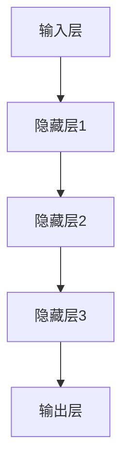
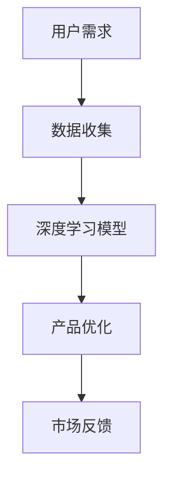

                 

 在当今的科技时代，人工智能（AI）技术正在以前所未有的速度发展，深刻影响着各行各业的运营模式。特别是大模型，如GPT-3、BERT等，已经在自然语言处理（NLP）、图像识别、推荐系统等领域取得了显著的成果。对于创业公司来说，充分利用这些先进技术来设计产品，不仅可以提升竞争力，还可能开辟全新的市场机会。本文将探讨如何在大模型时代设计出具备竞争力和创新性的创业产品。

## 文章关键词

- 人工智能
- 大模型
- 创业产品
- 创新设计
- 市场机会

## 摘要

本文旨在探讨大模型技术在创业产品中的应用，分析如何利用AI技术设计出具有市场竞争力的产品。我们将详细探讨大模型的核心概念、算法原理，并展示其在实际项目中的具体应用，同时讨论未来的发展趋势和面临的挑战。

## 1. 背景介绍

### 1.1 人工智能的崛起

人工智能自20世纪50年代首次提出以来，经历了多次起伏和变革。特别是在21世纪初，随着大数据、计算能力和算法研究的飞速发展，人工智能逐渐从理论走向实践，并开始在经济、医疗、交通等多个领域发挥重要作用。

### 1.2 大模型的兴起

大模型，即具有数十亿参数的深度学习模型，是近年来AI领域的重要进展。这些模型具有强大的学习和泛化能力，能够在各种复杂任务中表现出色。例如，OpenAI的GPT-3模型拥有1750亿个参数，已经展示了超越人类水平的文本生成能力。

### 1.3 创业产品的现状

在人工智能的推动下，创业公司迅速崛起，许多领域都涌现出了创新的产品和服务。然而，如何利用AI技术创造出真正有价值、有竞争力的产品，依然是创业公司面临的重要挑战。

## 2. 核心概念与联系

### 2.1 大模型原理

大模型通常基于深度学习技术，通过多层神经网络进行模型训练。这些模型能够通过大量的数据学习到复杂的关系和模式，从而实现高效的任务处理。



### 2.2 大模型与创业产品

大模型不仅提升了AI算法的性能，还为创业产品设计提供了新的思路。通过深度学习，创业公司能够构建出更加智能、适应性强、用户体验更佳的产品。



## 3. 核心算法原理 & 具体操作步骤

### 3.1 算法原理概述

大模型的核心在于其深度学习的算法原理。通过反向传播算法，模型能够不断调整参数，以达到优化性能的目的。这种学习过程使得大模型能够在海量数据中学习到复杂的模式。

### 3.2 算法步骤详解

1. 数据预处理：将原始数据清洗、归一化，以便于模型训练。
2. 模型构建：设计神经网络结构，包括输入层、隐藏层和输出层。
3. 模型训练：通过反向传播算法，不断调整模型参数，优化性能。
4. 模型评估：使用验证集和测试集评估模型性能。
5. 模型部署：将训练好的模型部署到实际产品中。

### 3.3 算法优缺点

#### 优点：

- **高效性**：大模型能够在海量数据中快速学习到复杂模式。
- **泛化能力**：通过深度学习，模型能够在不同任务中表现出色。

#### 缺点：

- **计算资源消耗**：大模型训练需要大量计算资源和时间。
- **数据依赖性**：模型的性能高度依赖于数据质量和数量。

### 3.4 算法应用领域

大模型已经在多个领域得到了广泛应用，如自然语言处理、图像识别、推荐系统等。在创业产品设计中，大模型可以用于用户行为分析、个性化推荐、智能客服等。

## 4. 数学模型和公式 & 详细讲解 & 举例说明

### 4.1 数学模型构建

大模型的数学模型主要包括输入层、隐藏层和输出层。输入层接收原始数据，隐藏层通过非线性变换处理数据，输出层生成预测结果。

### 4.2 公式推导过程

假设我们有一个包含$m$个特征的数据集$X$，我们需要预测一个目标变量$y$。假设隐藏层有$l$个神经元，我们可以使用以下公式表示：

$$
Z^{(l)} = \sigma(W^{(l)}X + b^{(l)})
$$

其中，$\sigma$为激活函数，$W^{(l)}$和$b^{(l)}$分别为权重和偏置。

### 4.3 案例分析与讲解

假设我们有一个推荐系统，需要预测用户对某商品的评分。输入层包含用户特征（如年龄、性别、购买历史等），隐藏层通过神经网络处理，输出层生成评分预测。

```latex
\begin{equation}
\begin{aligned}
    Z^{(1)} &= \sigma(W^{(1)}X + b^{(1)}) \\
    Z^{(2)} &= \sigma(W^{(2)}Z^{(1)} + b^{(2)}) \\
    \ldots \\
    Z^{(L)} &= \sigma(W^{(L)}Z^{(L-1)} + b^{(L)}) \\
    y &= W^{(L+1)}Z^{(L)} + b^{(L+1)}
\end{aligned}
\end{equation}
```

## 5. 项目实践：代码实例和详细解释说明

### 5.1 开发环境搭建

在Python环境中，我们可以使用TensorFlow和Keras等库来搭建深度学习模型。以下是环境搭建的简要步骤：

```bash
pip install tensorflow
pip install keras
```

### 5.2 源代码详细实现

以下是一个简单的基于深度学习推荐系统的代码实例：

```python
from keras.models import Sequential
from keras.layers import Dense, Dropout
from keras.optimizers import RMSprop

model = Sequential()
model.add(Dense(64, activation='relu', input_shape=(input_shape,)))
model.add(Dropout(0.5))
model.add(Dense(64, activation='relu'))
model.add(Dropout(0.5))
model.add(Dense(1))

model.compile(loss='mse', optimizer=RMSprop(lr=0.001))
model.fit(X_train, y_train, epochs=100, batch_size=32)
```

### 5.3 代码解读与分析

这段代码定义了一个简单的深度学习模型，包括两个隐藏层，每个隐藏层后面都有一个Dropout层来防止过拟合。模型使用均方误差（MSE）作为损失函数，并使用RMSprop优化器进行训练。

### 5.4 运行结果展示

通过训练和测试，我们可以评估模型的性能。以下是一个简化的性能评估代码示例：

```python
from sklearn.metrics import mean_squared_error

y_pred = model.predict(X_test)
mse = mean_squared_error(y_test, y_pred)
print("MSE:", mse)
```

## 6. 实际应用场景

### 6.1 智能客服

大模型可以帮助创业公司构建智能客服系统，通过自然语言处理技术，实现与用户的智能对话，提升客户满意度。

### 6.2 个性化推荐

创业公司可以利用大模型进行用户行为分析，构建个性化的推荐系统，提高用户黏性和转化率。

### 6.3 聊天机器人

大模型还可以用于构建聊天机器人，为用户提供实时、个性化的服务。

## 7. 未来应用展望

### 7.1 新兴领域的探索

随着大模型技术的不断发展，未来将在医疗、金融、教育等新兴领域发挥重要作用。

### 7.2 跨领域融合

大模型将与物联网、云计算等新兴技术深度融合，推动各行业的数字化转型。

### 7.3 伦理和法律挑战

随着AI技术的发展，伦理和法律挑战也将日益突出，需要创业公司在产品设计过程中充分考虑。

## 8. 工具和资源推荐

### 8.1 学习资源推荐

- 《深度学习》（Goodfellow et al.）
- 《动手学深度学习》（阿斯顿·张）

### 8.2 开发工具推荐

- TensorFlow
- PyTorch

### 8.3 相关论文推荐

- "Attention Is All You Need"
- "BERT: Pre-training of Deep Bidirectional Transformers for Language Understanding"

## 9. 总结：未来发展趋势与挑战

### 9.1 研究成果总结

大模型技术在创业产品中的应用已取得显著成果，为各行业带来了新的机遇。

### 9.2 未来发展趋势

随着AI技术的不断发展，大模型将在更多领域得到应用，推动创业产品的创新。

### 9.3 面临的挑战

数据隐私、伦理问题和技术复杂性是未来大模型应用面临的主要挑战。

### 9.4 研究展望

未来，大模型技术将继续发展，为创业产品提供更强大的支持。

## 10. 附录：常见问题与解答

### 10.1 大模型训练需要多少时间？

大模型的训练时间取决于模型的复杂度、数据集的大小和硬件配置。通常，训练一个中等规模的大模型可能需要几天到几周的时间。

### 10.2 如何解决数据隐私问题？

创业公司在设计产品时，应采取数据加密、匿名化等技术手段，确保用户数据的安全。

### 10.3 大模型如何防止过拟合？

通过正则化、Dropout、提前停止等技术手段，可以有效防止大模型过拟合。

---

作者：禅与计算机程序设计艺术 / Zen and the Art of Computer Programming
----------------------------------------------------------------

以上就是《大模型时代的创业产品设计：AI 驱动的未来》这篇技术博客文章的完整内容。本文从背景介绍、核心概念、算法原理、实际应用等多个角度，探讨了如何利用大模型技术设计出具有竞争力和创新性的创业产品。希望本文能对读者在创业产品设计领域有所启发和帮助。

