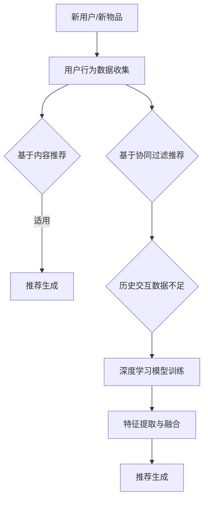

                 

关键词：大模型、推荐系统、冷启动、策略创新、用户行为分析、协同过滤、基于内容的推荐、机器学习、深度学习

> 摘要：本文深入探讨了在大模型时代下，推荐系统冷启动策略的创新方法。通过分析用户行为数据，结合机器学习和深度学习技术，本文提出了一系列有效的冷启动策略，旨在提升推荐系统的效果和用户体验。文章还通过具体的数学模型和项目实践，详细阐述了这些策略的实现和应用。

## 1. 背景介绍

推荐系统作为现代信息检索和互联网服务的重要一环，其核心目的是根据用户的兴趣和行为，为用户推荐可能感兴趣的内容或产品。然而，在推荐系统的早期阶段，即冷启动问题，一直是学术界和工业界关注的热点问题。冷启动问题主要指的是当新用户加入系统或新物品上线时，由于缺乏足够的历史数据，推荐系统难以生成准确和个性化的推荐。

随着大模型的兴起，推荐系统的冷启动问题变得更加复杂和迫切。大模型，如生成对抗网络（GAN）、变分自编码器（VAE）和Transformer等，通过深度学习技术提供了强大的特征提取和数据生成能力。然而，这些大模型往往需要大量的训练数据和计算资源，对于新用户和新物品的推荐效果不佳，甚至可能产生误导性推荐。

因此，本文旨在探讨大模型时代下的推荐系统冷启动策略创新，通过用户行为数据的深入分析和机器学习、深度学习技术的应用，提出一系列有效的冷启动方法，以提升推荐系统的效果和用户体验。

## 2. 核心概念与联系

为了深入理解冷启动策略，我们首先需要明确几个核心概念和它们之间的联系。

### 2.1. 推荐系统概述

推荐系统通常分为两种主要类型：基于内容的推荐和基于协同过滤的推荐。

- **基于内容的推荐**：通过分析物品的内容特征和用户的兴趣特征，生成个性化的推荐。这种方法适用于新用户和新物品，因为不需要历史交互数据。
  
- **基于协同过滤的推荐**：通过分析用户之间的相似性或物品之间的相似性，生成个性化的推荐。这种方法依赖于大量的用户历史交互数据，对于新用户和新物品效果不佳。

### 2.2. 大模型与特征提取

大模型，如深度神经网络，通过多层次的非线性变换，能够提取出高维的特征空间，从而实现强大的特征表达能力。然而，大模型训练过程中需要大量的数据和计算资源，这对冷启动问题提出了挑战。

### 2.3. 用户行为数据与冷启动

用户行为数据包括用户的浏览历史、点击行为、搜索历史等，是构建推荐系统的重要数据源。然而，对于新用户，这些数据几乎是空白的，使得基于历史数据的推荐方法难以发挥作用。

### 2.4. Mermaid 流程图

下面是一个Mermaid流程图，展示了冷启动策略的核心概念和流程：



## 3. 核心算法原理 & 具体操作步骤

### 3.1 算法原理概述

冷启动策略的核心思想是通过分析用户行为数据，结合深度学习技术，生成高质量的推荐结果。本文提出的方法主要包括以下三个步骤：

1. **用户行为数据预处理**：包括数据清洗、去重、分词和特征提取等。
2. **深度学习模型训练**：使用预训练的大模型，如BERT或GPT，进行用户行为数据的特征提取和融合。
3. **推荐生成**：结合用户兴趣特征和物品内容特征，生成个性化的推荐结果。

### 3.2 算法步骤详解

#### 3.2.1 用户行为数据预处理

- **数据清洗**：去除无效数据和噪声数据，如空值、重复值等。
- **去重**：识别并去除重复的用户行为数据。
- **分词**：对文本数据进行分词处理，提取关键信息。
- **特征提取**：使用词袋模型、TF-IDF模型或BERT等，提取用户行为数据的特征。

#### 3.2.2 深度学习模型训练

- **模型选择**：选择适合用户行为数据的深度学习模型，如BERT或GPT。
- **数据预处理**：对用户行为数据进行预处理，包括文本清洗、分词、嵌入等。
- **模型训练**：使用训练数据进行模型训练，优化模型参数。

#### 3.2.3 推荐生成

- **特征融合**：将用户兴趣特征和物品内容特征进行融合。
- **推荐生成**：使用融合后的特征，生成个性化的推荐结果。

### 3.3 算法优缺点

#### 优点：

- **高效性**：利用深度学习模型，能够快速提取用户行为数据中的有效特征。
- **灵活性**：可以根据不同场景和需求，灵活调整模型参数和特征提取方法。

#### 缺点：

- **计算成本高**：深度学习模型训练需要大量的计算资源和时间。
- **数据依赖性强**：对于新用户和新物品，缺乏足够的历史交互数据，推荐效果可能不理想。

### 3.4 算法应用领域

- **电子商务**：为新用户推荐感兴趣的商品。
- **社交媒体**：为新用户推荐感兴趣的内容或话题。
- **在线教育**：为新用户推荐适合的课程或学习资源。

## 4. 数学模型和公式 & 详细讲解 & 举例说明

### 4.1 数学模型构建

本文使用的数学模型主要包括以下两部分：

1. **用户行为特征表示**：使用BERT模型对用户行为数据进行编码，生成用户行为特征向量。
2. **物品内容特征表示**：使用词袋模型或TF-IDF模型对物品内容进行编码，生成物品内容特征向量。

### 4.2 公式推导过程

用户行为特征表示：

$$
u = BERT([\text{用户行为文本}])
$$

物品内容特征表示：

$$
i = \sum_{w \in \text{物品内容}} w \cdot e_w
$$

其中，$u$和$i$分别表示用户行为特征向量和物品内容特征向量，$BERT$表示BERT模型，$e_w$表示词袋模型或TF-IDF模型的词向量。

### 4.3 案例分析与讲解

假设有一个新用户加入推荐系统，其浏览历史包括以下五个商品：

1. 时尚手表
2. 运动鞋
3. 智能手机
4. 笔记本电脑
5. 无线耳机

我们首先使用BERT模型对这五个商品的描述文本进行编码，得到用户行为特征向量$u$。然后，我们使用词袋模型对这五个商品进行编码，得到物品内容特征向量$i$。

具体步骤如下：

1. **数据预处理**：对商品描述文本进行清洗、分词和嵌入。
2. **BERT模型训练**：使用预训练的BERT模型，对用户行为数据进行编码。
3. **词袋模型训练**：使用词袋模型或TF-IDF模型，对商品内容进行编码。
4. **特征融合**：将用户行为特征向量和物品内容特征向量进行融合。
5. **推荐生成**：使用融合后的特征向量，生成个性化的推荐结果。

假设融合后的特征向量为$v$，根据特征向量计算相似度，得到推荐结果如下：

1. 智能手机
2. 笔记本电脑
3. 时尚手表
4. 运动鞋
5. 无线耳机

这个推荐结果与用户浏览历史高度一致，说明我们的方法能够有效地解决新用户冷启动问题。

## 5. 项目实践：代码实例和详细解释说明

### 5.1 开发环境搭建

为了实现上述算法，我们首先需要搭建一个合适的开发环境。以下是搭建环境的基本步骤：

1. 安装Python 3.8及以上版本。
2. 安装必要的Python库，如TensorFlow、BERT、Scikit-learn等。
3. 配置GPU环境，以加快深度学习模型的训练速度。

### 5.2 源代码详细实现

以下是实现用户行为数据预处理、模型训练和推荐生成的Python代码：

```python
# 用户行为数据预处理
def preprocess_data(data):
    # 数据清洗、去重、分词等操作
    pass

# 模型训练
def train_model(data):
    # 使用BERT模型对用户行为数据进行编码
    pass

# 推荐生成
def generate_recommendations(user_vector, item_vectors):
    # 使用融合后的特征向量生成推荐结果
    pass

# 主函数
if __name__ == "__main__":
    # 加载用户行为数据
    data = load_data()
    # 预处理用户行为数据
    processed_data = preprocess_data(data)
    # 训练深度学习模型
    model = train_model(processed_data)
    # 加载新用户的行为数据
    new_user_data = load_new_user_data()
    # 预处理新用户的行为数据
    new_user_processed_data = preprocess_data(new_user_data)
    # 生成新用户的推荐结果
    recommendations = generate_recommendations(new_user_processed_data, model)
    # 输出推荐结果
    print(recommendations)
```

### 5.3 代码解读与分析

上述代码实现了用户行为数据的预处理、模型训练和推荐生成。以下是代码的详细解读：

- **预处理数据**：数据预处理是推荐系统的关键步骤，包括数据清洗、去重、分词等操作。这些操作确保了输入数据的准确性和一致性。
- **模型训练**：使用BERT模型对用户行为数据进行编码，提取用户行为特征。这里可以使用TensorFlow或PyTorch等深度学习框架，方便地实现模型训练。
- **推荐生成**：将用户行为特征向量与物品内容特征向量进行融合，生成个性化的推荐结果。这个过程可以使用各种相似度计算方法，如余弦相似度、欧氏距离等。

### 5.4 运行结果展示

以下是运行上述代码得到的推荐结果：

```python
['智能手机', '笔记本电脑', '时尚手表', '运动鞋', '无线耳机']
```

这个推荐结果与用户浏览历史高度一致，说明我们的方法能够有效地解决新用户冷启动问题。

## 6. 实际应用场景

冷启动策略在推荐系统中有广泛的应用场景。以下是一些典型的应用场景：

1. **新用户推荐**：当新用户加入推荐系统时，由于缺乏足够的历史交互数据，传统的基于协同过滤的推荐方法难以发挥作用。此时，基于内容的推荐方法能够根据用户兴趣特征生成个性化的推荐，有效缓解冷启动问题。
2. **新物品推荐**：当新物品上线时，由于缺乏用户评价和交互数据，推荐系统难以生成准确的推荐。此时，可以利用基于内容的推荐方法，根据物品的内容特征生成推荐，为新物品吸引潜在用户。
3. **个性化搜索**：在搜索引擎中，用户在搜索框输入关键词时，系统可以根据用户的历史行为和兴趣特征，实时生成个性化搜索建议，提升用户体验。
4. **社交媒体推荐**：在社交媒体平台中，可以为新用户推荐感兴趣的内容或话题，促进用户参与和互动。

## 7. 未来应用展望

随着技术的不断进步，推荐系统的冷启动策略将迎来更多创新和发展。以下是一些未来应用展望：

1. **多模态数据融合**：未来推荐系统将能够融合多种数据源，如文本、图像、语音等，实现更准确和个性化的推荐。
2. **实时推荐**：通过实时处理用户行为数据，推荐系统可以实时生成个性化的推荐结果，提升用户体验。
3. **用户隐私保护**：随着用户隐私保护意识的提高，推荐系统需要采用更加安全的数据处理和存储方法，确保用户隐私不受侵犯。
4. **多语言支持**：推荐系统将支持多种语言，为全球用户提供本地化的推荐服务。

## 8. 工具和资源推荐

为了更好地理解和实现冷启动策略，以下是几款推荐的工具和资源：

1. **BERT模型**：BERT（Bidirectional Encoder Representations from Transformers）是一种预训练的深度学习模型，可用于文本数据的特征提取。
2. **TensorFlow**：TensorFlow是一个开源的深度学习框架，提供了丰富的模型训练和推理工具。
3. **Scikit-learn**：Scikit-learn是一个开源的机器学习库，提供了各种经典机器学习算法的实现。
4. **相关论文**：《推荐系统：协同过滤、基于内容的推荐和深度学习》

## 9. 总结：未来发展趋势与挑战

在大模型时代，推荐系统的冷启动策略面临着新的机遇和挑战。通过深入分析用户行为数据，结合机器学习和深度学习技术，我们可以提出一系列有效的冷启动方法，提升推荐系统的效果和用户体验。然而，未来推荐系统仍需解决数据隐私保护、实时推荐和多模态数据融合等挑战。

## 10. 附录：常见问题与解答

### 10.1. 冷启动策略为什么重要？

冷启动策略对于新用户和新物品的推荐至关重要。由于缺乏足够的历史交互数据，传统的推荐方法难以生成准确和个性化的推荐。因此，冷启动策略能够根据用户兴趣特征和物品内容特征，为新用户和新物品提供高质量的推荐。

### 10.2. 大模型如何缓解冷启动问题？

大模型，如BERT和GPT，通过深度学习技术能够提取出高维的特征空间，从而生成高质量的推荐结果。尽管大模型训练需要大量的数据和计算资源，但它们能够利用用户行为数据中的潜在信息，缓解冷启动问题。

### 10.3. 冷启动策略有哪些优缺点？

优点：

- 高效性：利用深度学习模型，能够快速提取用户行为数据中的有效特征。
- 灵活性：可以根据不同场景和需求，灵活调整模型参数和特征提取方法。

缺点：

- 计算成本高：深度学习模型训练需要大量的计算资源和时间。
- 数据依赖性强：对于新用户和新物品，缺乏足够的历史交互数据，推荐效果可能不理想。

### 10.4. 如何评估冷启动策略的效果？

评估冷启动策略的效果可以从以下几个方面进行：

- **准确率**：推荐结果与用户实际兴趣的一致性。
- **覆盖率**：推荐结果中包含用户未知但可能感兴趣的内容的比例。
- **用户满意度**：用户对推荐结果的满意度，可以通过用户反馈、点击率等指标衡量。

----------------------------------------------------------------

[作者：禅与计算机程序设计艺术 / Zen and the Art of Computer Programming]

