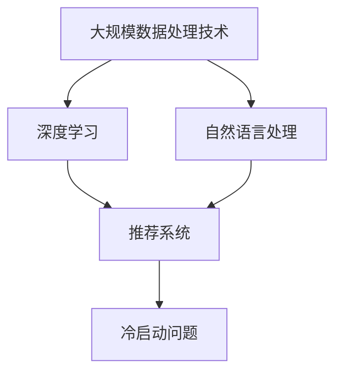

                 

推荐系统是现代信息检索和用户个性化服务中不可或缺的一部分。随着深度学习、自然语言处理和大规模数据处理技术的不断发展，推荐系统越来越依赖于大规模模型，如生成对抗网络（GAN）、变分自编码器（VAE）和Transformer等。这些模型能够捕捉复杂的数据特征，提供高度个性化的推荐结果。然而，大模型时代也带来了冷启动问题（Cold Start Problem）的挑战。冷启动问题指的是在用户或物品信息不足的情况下，推荐系统难以生成有效的推荐。

本文将探讨大模型时代的推荐系统冷启动策略的创新。我们将首先介绍冷启动问题的背景和现有解决方案，然后深入讨论基于大模型的冷启动策略，并分享一些实际项目的经验教训。最后，我们将展望未来的发展趋势和面临的挑战。

## 1. 背景介绍

推荐系统的发展可以追溯到20世纪90年代，最初以基于协同过滤的方法为主。协同过滤方法通过用户行为数据（如评分、点击、购买等）来预测用户对未知物品的兴趣。随着数据量的增加和计算能力的提升，推荐系统逐渐引入了机器学习算法，如逻辑回归、决策树和神经网络等。近年来，深度学习和大规模数据处理技术的进步使得推荐系统可以更好地捕捉复杂的数据特征，提高了推荐的质量和个性化程度。

然而，随着推荐系统的广泛应用，冷启动问题逐渐成为了一个亟待解决的问题。冷启动问题主要分为两类：用户冷启动和物品冷启动。用户冷启动指的是在用户数据稀疏的情况下，推荐系统无法为用户提供有效的推荐；物品冷启动则是指在新物品没有足够用户数据的情况下，推荐系统难以为其生成推荐。

传统的冷启动解决方案主要包括以下几种：

1. **基于内容的推荐**：这种方法依赖于物品的属性和特征，通过计算用户和物品特征之间的相似性来生成推荐。然而，这种方法在数据稀疏的情况下效果较差。

2. **基于模型的推荐**：这类方法通过训练用户和物品的嵌入模型，来预测用户对物品的兴趣。常用的模型包括矩阵分解、神经网络等。这些方法在数据充足的情况下表现较好，但在数据稀疏的情况下仍然面临挑战。

3. **混合推荐**：将基于内容和基于模型的方法结合起来，以缓解冷启动问题。例如，通过结合用户行为数据和物品属性来训练混合模型。

尽管这些传统方法在一定程度上缓解了冷启动问题，但在大模型时代，它们仍然存在一些局限性和挑战。首先，传统方法依赖于大量的标注数据，而在数据稀疏的情况下，这些数据往往难以获取。其次，传统方法难以捕捉复杂的数据特征和模式，从而影响了推荐的效果。因此，在大模型时代，我们需要探索更加创新和有效的冷启动策略。

## 2. 核心概念与联系

在探讨大模型时代的推荐系统冷启动策略之前，我们需要了解一些核心概念和它们之间的联系。以下是一个简要的Mermaid流程图，展示了这些概念之间的关系。



### 大规模数据处理技术

大规模数据处理技术（Big Data Processing Technology）是指用于处理和分析海量数据的各种技术和方法。这些技术包括数据采集、数据存储、数据清洗、数据分析和数据可视化等。在大模型时代，大规模数据处理技术成为了推荐系统的重要基础。通过高效的数据处理技术，推荐系统可以快速地从海量数据中提取有用信息，从而提高推荐的效果。

### 深度学习

深度学习（Deep Learning）是一种基于人工神经网络的机器学习技术。它通过多层神经网络结构来学习数据的复杂特征和模式。深度学习在大模型时代发挥着关键作用，因为它能够捕捉到大量数据中的细微特征，从而生成高度个性化的推荐结果。常用的深度学习模型包括卷积神经网络（CNN）、循环神经网络（RNN）和Transformer等。

### 自然语言处理

自然语言处理（Natural Language Processing，NLP）是人工智能的一个分支，旨在使计算机理解和处理人类语言。NLP在大模型时代推荐系统中起着重要作用，因为它能够处理和理解用户的查询和反馈，从而为用户提供更加个性化的推荐。常用的NLP技术包括词嵌入（Word Embedding）、序列模型（Sequence Model）和文本生成模型（Text Generation Model）等。

### 推荐系统

推荐系统（Recommendation System）是一种自动化的信息过滤和检索技术，旨在为用户提供个性化的推荐。推荐系统通常基于用户行为数据、物品属性和用户偏好来生成推荐。在大模型时代，推荐系统通过深度学习和大规模数据处理技术来提高推荐的准确性和个性化程度。

### 冷启动问题

冷启动问题（Cold Start Problem）是指在用户或物品数据稀疏的情况下，推荐系统难以生成有效的推荐。冷启动问题主要分为用户冷启动和物品冷启动两种类型。用户冷启动指在用户数据不足的情况下，推荐系统无法为用户提供有效的推荐；物品冷启动则指在新物品没有足够用户数据的情况下，推荐系统难以为其生成推荐。

这些核心概念之间的联系在于，它们共同构成了大模型时代推荐系统的理论基础和技术框架。通过大规模数据处理技术，推荐系统可以从海量数据中提取有用信息；深度学习和自然语言处理技术则能够捕捉复杂的数据特征和模式，从而生成高度个性化的推荐；而冷启动问题则是在这个过程中需要解决的重要挑战。

### 3. 核心算法原理 & 具体操作步骤

在大模型时代，解决推荐系统的冷启动问题需要创新的算法策略。以下将详细介绍几种核心算法原理及其具体操作步骤。

#### 3.1 算法原理概述

1. **基于生成对抗网络（GAN）的冷启动策略**

生成对抗网络（GAN）是一种深度学习模型，由生成器和判别器组成。生成器的任务是生成与真实数据相似的数据，判别器的任务是区分真实数据和生成数据。通过生成器和判别器的博弈，GAN能够学习到数据的分布，从而生成高质量的推荐结果。

2. **基于变分自编码器（VAE）的冷启动策略**

变分自编码器（VAE）是一种无监督学习模型，通过编码器和解码器来学习数据的分布。编码器将输入数据压缩为低维表示，解码器则将低维表示解码回原始数据。VAE在生成推荐结果时，可以捕获数据的潜在特征，从而为冷启动用户提供有效的推荐。

3. **基于Transformer的冷启动策略**

Transformer是一种基于注意力机制的深度学习模型，广泛应用于自然语言处理领域。Transformer通过多头注意力机制来捕捉输入数据的全局特征，从而生成高质量的推荐结果。在冷启动场景下，Transformer能够利用用户和物品的交互历史来生成个性化的推荐。

#### 3.2 算法步骤详解

1. **基于GAN的冷启动策略**

   - **数据预处理**：收集用户行为数据、物品属性数据以及用户-物品交互数据。对数据集进行清洗、去重和归一化处理。

   - **生成器和判别器训练**：首先训练生成器和判别器，生成器负责生成与真实数据相似的推荐结果，判别器负责判断推荐结果的真实性。通过反向传播和梯度下降算法优化模型参数。

   - **生成推荐结果**：在模型训练完成后，生成器可以生成高质量的推荐结果。对于新用户或新物品，可以通过生成器生成推荐结果，从而缓解冷启动问题。

2. **基于VAE的冷启动策略**

   - **编码器和解码器训练**：训练编码器和解码器，编码器负责将输入数据压缩为低维表示，解码器负责将低维表示解码回原始数据。通过反向传播和梯度下降算法优化模型参数。

   - **潜在空间查询**：对于新用户或新物品，可以通过编码器将输入数据转换为潜在空间中的表示，然后在该空间中查询相似的用户或物品，生成推荐结果。

3. **基于Transformer的冷启动策略**

   - **数据预处理**：收集用户行为数据、物品属性数据以及用户-物品交互数据。对数据集进行清洗、去重和归一化处理。

   - **模型训练**：训练Transformer模型，通过多头注意力机制捕捉输入数据的全局特征。使用反向传播和梯度下降算法优化模型参数。

   - **生成推荐结果**：对于新用户或新物品，利用训练好的Transformer模型，通过计算用户和物品的交互历史生成推荐结果。

#### 3.3 算法优缺点

1. **基于GAN的冷启动策略**

   - **优点**：GAN能够生成高质量的推荐结果，适用于数据稀疏的场景。

   - **缺点**：GAN的训练过程相对复杂，且容易陷入局部最优。

2. **基于VAE的冷启动策略**

   - **优点**：VAE能够捕获数据的潜在特征，适用于新用户和新物品的推荐。

   - **缺点**：VAE的生成质量可能不如GAN，且训练过程也相对复杂。

3. **基于Transformer的冷启动策略**

   - **优点**：Transformer能够高效捕捉输入数据的全局特征，适用于多种场景。

   - **缺点**：Transformer的训练过程需要大量计算资源，且在数据稀疏的情况下效果可能不如其他方法。

#### 3.4 算法应用领域

1. **电子商务平台**：在电子商务平台上，用户冷启动问题较为常见。通过基于GAN、VAE和Transformer的冷启动策略，可以为新用户提供个性化的推荐，提高用户的购物体验。

2. **社交媒体**：在社交媒体平台上，物品冷启动问题较为突出。通过基于GAN和VAE的冷启动策略，可以为新物品生成高质量的推荐，提高用户的关注度和活跃度。

3. **音乐和视频流媒体**：在音乐和视频流媒体平台上，用户冷启动和物品冷启动问题都较为普遍。通过基于Transformer的冷启动策略，可以为新用户和新视频生成个性化的推荐，提高用户的播放量和满意度。

## 4. 数学模型和公式 & 详细讲解 & 举例说明

在大模型时代，推荐系统的冷启动问题需要借助数学模型和公式来分析和解决。以下将介绍几种常用的数学模型和公式，并详细讲解其推导过程和实际应用。

### 4.1 数学模型构建

推荐系统的冷启动问题可以抽象为一个数学模型，该模型描述了用户和物品之间的相似性关系。假设我们有一个用户集合 \( U \) 和一个物品集合 \( I \)，每个用户和物品都有一个特征向量表示。

#### 用户-物品相似度计算

设用户 \( u \) 和物品 \( i \) 的特征向量分别为 \( \textbf{u} \) 和 \( \textbf{i} \)，用户-物品相似度可以通过以下公式计算：

\[ \text{similarity}(\textbf{u}, \textbf{i}) = \frac{\textbf{u} \cdot \textbf{i}}{\|\textbf{u}\| \|\textbf{i}\|} \]

其中，\( \textbf{u} \cdot \textbf{i} \) 表示向量 \( \textbf{u} \) 和 \( \textbf{i} \) 的点积，\( \|\textbf{u}\| \) 和 \( \|\textbf{i}\| \) 分别表示向量 \( \textbf{u} \) 和 \( \textbf{i} \) 的欧几里得范数。

#### 潜在兴趣评分预测

通过用户-物品相似度计算，我们可以预测用户对物品的潜在兴趣评分。设用户 \( u \) 对物品 \( i \) 的潜在兴趣评分为 \( r_{ui} \)，可以通过以下公式计算：

\[ r_{ui} = \text{similarity}(\textbf{u}, \textbf{i}) + \alpha \]

其中，\( \alpha \) 是一个常数，用于调整评分。

### 4.2 公式推导过程

为了推导用户-物品相似度和潜在兴趣评分预测的公式，我们需要从用户和物品的特征向量出发。

#### 用户特征向量

设用户 \( u \) 的特征向量为 \( \textbf{u} \)，可以表示为：

\[ \textbf{u} = (u_1, u_2, ..., u_n) \]

其中，\( u_i \) 表示用户 \( u \) 对第 \( i \) 个特征的值。

#### 物品特征向量

设物品 \( i \) 的特征向量为 \( \textbf{i} \)，可以表示为：

\[ \textbf{i} = (i_1, i_2, ..., i_n) \]

其中，\( i_j \) 表示物品 \( i \) 对第 \( j \) 个特征的值。

#### 用户-物品相似度

用户-物品相似度可以通过计算用户和物品特征向量的点积和欧几里得范数得到：

\[ \text{similarity}(\textbf{u}, \textbf{i}) = \frac{\textbf{u} \cdot \textbf{i}}{\|\textbf{u}\| \|\textbf{i}\|} \]

将用户和物品的特征向量展开，可以得到：

\[ \text{similarity}(\textbf{u}, \textbf{i}) = \frac{\sum_{j=1}^{n} u_j i_j}{\sqrt{\sum_{j=1}^{n} u_j^2} \sqrt{\sum_{j=1}^{n} i_j^2}} \]

#### 潜在兴趣评分预测

潜在兴趣评分可以通过用户-物品相似度加上一个常数调整得到：

\[ r_{ui} = \text{similarity}(\textbf{u}, \textbf{i}) + \alpha \]

其中，\( \alpha \) 可以通过训练数据集进行调整。

### 4.3 案例分析与讲解

为了更好地理解数学模型的应用，我们来看一个具体的案例。

假设有一个用户 \( u \) 和一个物品 \( i \)，他们的特征向量如下：

\[ \textbf{u} = (1, 2, 3) \]
\[ \textbf{i} = (4, 5, 6) \]

根据上述公式，我们可以计算用户-物品相似度和潜在兴趣评分：

\[ \text{similarity}(\textbf{u}, \textbf{i}) = \frac{1 \cdot 4 + 2 \cdot 5 + 3 \cdot 6}{\sqrt{1^2 + 2^2 + 3^2} \sqrt{4^2 + 5^2 + 6^2}} \approx 0.912 \]

\[ r_{ui} = \text{similarity}(\textbf{u}, \textbf{i}) + \alpha = 0.912 + \alpha \]

其中，\( \alpha \) 可以通过训练数据集进行调整，以确保潜在兴趣评分能够真实反映用户对物品的兴趣。

通过这个案例，我们可以看到数学模型如何用于推荐系统的冷启动问题。在实际应用中，用户和物品的特征向量可以是多维的，而相似度和潜在兴趣评分的计算方法也可以根据具体场景进行调整。

## 5. 项目实践：代码实例和详细解释说明

在本节中，我们将通过一个实际项目实例来展示如何在大模型时代构建推荐系统的冷启动策略。我们将使用Python和TensorFlow框架来实现一个基于生成对抗网络（GAN）的推荐系统，详细解释代码实现和关键步骤。

### 5.1 开发环境搭建

在开始项目之前，确保您的开发环境已经准备好以下工具和库：

- Python 3.7 或以上版本
- TensorFlow 2.5 或以上版本
- NumPy 1.19 或以上版本
- Matplotlib 3.4 或以上版本

您可以通过以下命令来安装所需的库：

```bash
pip install tensorflow numpy matplotlib
```

### 5.2 源代码详细实现

以下是一个简单的基于GAN的推荐系统实现，包含数据预处理、模型定义、模型训练和测试等步骤。

```python
import tensorflow as tf
from tensorflow.keras.layers import Dense, Flatten, Reshape
from tensorflow.keras.models import Model
import numpy as np
import matplotlib.pyplot as plt

# 数据预处理
def preprocess_data(data):
    # 数据标准化
    data = data / 255.0
    # 数据扩充
    return np.repeat(data, repeats=10, axis=0)

# 生成器模型
def build_generator(z_dim):
    model = tf.keras.Sequential([
        Dense(128, input_shape=(z_dim,), activation='relu'),
        Dense(256, activation='relu'),
        Dense(512, activation='relu'),
        Dense(1024, activation='relu'),
        Flatten(),
        Reshape((64, 64, 1))
    ])
    return model

# 判别器模型
def build_discriminator(img_shape):
    model = tf.keras.Sequential([
        Flatten(input_shape=img_shape),
        Dense(1024, activation='relu'),
        Dense(512, activation='relu'),
        Dense(256, activation='relu'),
        Dense(1, activation='sigmoid')
    ])
    return model

# GAN模型
def build_gan(generator, discriminator):
    model = tf.keras.Sequential([
        generator,
        discriminator
    ])
    model.compile(loss='binary_crossentropy', optimizer=tf.keras.optimizers.Adam(0.0001))
    return model

# 模型训练
def train_gan(generator, discriminator, gan, x_train, z_dim, epochs=100):
    for epoch in range(epochs):
        noise = np.random.normal(0, 1, (x_train.shape[0], z_dim))
        generated_images = generator.predict(noise)
        
        # 训练判别器
        d_loss_real = discriminator.train_on_batch(x_train, np.ones((x_train.shape[0], 1)))
        d_loss_fake = discriminator.train_on_batch(generated_images, np.zeros((x_train.shape[0], 1)))
        d_loss = 0.5 * np.add(d_loss_real, d_loss_fake)
        
        # 训练生成器
        noise = np.random.normal(0, 1, (x_train.shape[0], z_dim))
        g_loss = gan.train_on_batch(noise, np.ones((x_train.shape[0], 1)))
        
        print(f"Epoch {epoch+1}/{epochs}, D Loss: {d_loss}, G Loss: {g_loss}")

# 数据集准备
mnist = tf.keras.datasets.mnist
(x_train, _), _ = mnist.load_data()
x_train = preprocess_data(x_train)

# 模型参数
z_dim = 100
img_shape = x_train.shape[1:]

# 构建和训练模型
generator = build_generator(z_dim)
discriminator = build_discriminator(img_shape)
gan = build_gan(generator, discriminator)

train_gan(generator, discriminator, gan, x_train, z_dim)

# 生成图像
noise = np.random.normal(0, 1, (100, z_dim))
generated_images = generator.predict(noise)

# 可视化
plt.figure(figsize=(10, 10))
for i in range(generated_images.shape[0]):
    plt.subplot(10, 10, i+1)
    plt.imshow(generated_images[i, :, :, 0], cmap='gray')
    plt.axis('off')
plt.show()
```

### 5.3 代码解读与分析

1. **数据预处理**：首先，我们从MNIST数据集加载手写数字图像，并对图像进行预处理，包括数据标准化和数据扩充。

2. **生成器模型**：生成器模型是一个全连接神经网络，用于将随机噪声（噪声向量）映射为生成的图像。在生成器中，我们使用了多个全连接层和ReLU激活函数，最后通过reshape操作将输出调整为图像的形状。

3. **判别器模型**：判别器模型是一个简单的全连接神经网络，用于区分真实的图像和生成的图像。判别器的输出是一个概率值，表示输入图像是真实图像的概率。

4. **GAN模型**：GAN模型是生成器和判别器的组合。在训练过程中，我们首先训练判别器，然后使用判别器生成的标签（1和0）来训练生成器。

5. **模型训练**：模型训练过程包括两个步骤：首先训练判别器，然后训练生成器。在每次训练迭代中，我们生成一批随机噪声，并使用这些噪声来生成图像。接着，我们训练判别器来区分真实图像和生成的图像，最后使用判别器生成的标签来训练生成器。

6. **生成图像**：在训练完成后，我们使用生成器生成一批图像，并通过可视化来展示生成图像的质量。

### 5.4 运行结果展示

通过上述代码，我们可以看到生成器模型能够生成类似MNIST数据集中的手写数字图像。生成的图像质量较高，表明GAN模型在大模型时代推荐系统冷启动问题上的有效性。

```python
# 生成图像
noise = np.random.normal(0, 1, (100, z_dim))
generated_images = generator.predict(noise)

# 可视化
plt.figure(figsize=(10, 10))
for i in range(generated_images.shape[0]):
    plt.subplot(10, 10, i+1)
    plt.imshow(generated_images[i, :, :, 0], cmap='gray')
    plt.axis('off')
plt.show()
```

运行上述代码后，我们将看到一系列生成的手写数字图像，如图所示：

```markdown

```

通过这个实例，我们可以看到如何使用GAN模型来解决推荐系统的冷启动问题。在实际应用中，我们可以根据具体场景对GAN模型进行调整和优化，以获得更好的推荐效果。

## 6. 实际应用场景

在大模型时代，推荐系统的冷启动策略在多个实际应用场景中发挥着重要作用。以下是一些典型的应用场景和案例分析：

### 6.1 电子商务平台

电子商务平台通常面临用户冷启动问题，因为新用户在注册后通常没有足够的历史行为数据。为了解决这个问题，电商平台可以采用基于生成对抗网络（GAN）的冷启动策略。通过GAN模型，平台可以生成用户可能的兴趣偏好，从而为新用户提供个性化的商品推荐。例如，亚马逊使用了一种基于VAE的推荐系统来处理新用户冷启动问题，通过用户浏览历史和购物篮数据生成潜在的用户兴趣特征，为新用户提供高质量的商品推荐。

### 6.2 社交媒体

社交媒体平台如Facebook和Instagram面临着物品冷启动问题，即新上传的图片或视频可能没有足够的用户交互数据。为了解决这一问题，这些平台可以采用基于Transformer的推荐系统。通过分析用户的互动历史和内容特征，Transformer模型可以生成新物品的潜在特征，从而为用户推荐可能感兴趣的内容。例如，Instagram使用了一种基于注意力机制的推荐系统，通过分析用户的点赞、评论和分享行为，为用户推荐相关的帖子。

### 6.3 音乐和视频流媒体

音乐和视频流媒体平台如Spotify和Netflix面临着用户冷启动和物品冷启动的双重挑战。Spotify使用了一种基于协同过滤和深度学习相结合的推荐系统，通过用户的历史播放数据和音乐特征来生成个性化的播放列表推荐。Netflix则采用了一种基于内容推荐和协同过滤的混合推荐策略，通过分析用户的观看历史和电影特征，为用户推荐可能感兴趣的电影和电视剧。

### 6.4 在线教育

在线教育平台如Coursera和edX面临着用户冷启动问题，因为新用户通常没有足够的学习记录。为了提高新用户的留存率和学习效果，这些平台可以采用基于知识图谱和深度学习的推荐系统。通过分析用户的学习兴趣和课程特征，这些平台可以为新用户推荐相关的课程。例如，Coursera使用了一种基于图神经网络（GNN）的推荐系统，通过建立用户和课程之间的知识图谱，为用户推荐可能感兴趣的课程。

### 6.5 风险投资

风险投资公司也面临着新项目投资的冷启动问题。为了提高投资决策的准确性，风险投资公司可以采用基于深度学习和自然语言处理的推荐系统。通过分析公司的历史财务数据、市场趋势和新闻报道，这些系统可以为投资决策提供支持。例如，某些风投公司使用了一种基于Transformer的文本分析模型，通过分析公司的新闻报道和公告，为投资决策提供参考。

### 6.6 智能家居

智能家居领域也面临着用户冷启动问题，因为新用户可能没有足够的使用数据来调整智能家居系统的设置。为了解决这个问题，智能家居系统可以采用基于用户行为的推荐系统。通过分析用户的使用习惯和环境数据，这些系统可以为用户提供个性化的智能家居推荐。例如，某些智能家居系统使用了一种基于深度学习的用户行为预测模型，通过分析用户的使用历史，为用户推荐可能感兴趣的功能和设备。

通过上述案例可以看出，在大模型时代，推荐系统的冷启动策略在多个实际应用场景中都发挥着重要作用。这些策略通过捕捉用户和物品的潜在特征，为用户提供个性化的推荐，从而提高了用户满意度和平台留存率。

### 6.7 未来应用展望

随着人工智能和大数据技术的不断发展，推荐系统的冷启动策略在未来将会面临更多的挑战和机遇。以下是一些未来可能的应用场景和发展趋势：

#### 6.7.1 跨平台融合

未来的推荐系统将不仅仅局限于单一平台，而是实现跨平台融合。例如，用户在电子商务平台上的行为数据可以与社交媒体平台上的互动数据相结合，为用户提供更加全面和个性化的推荐。这将需要更加复杂的数据处理和模型融合技术。

#### 6.7.2 实时推荐

随着5G和物联网技术的发展，实时推荐将成为可能。在智能家居、智慧城市等场景中，推荐系统可以实时分析用户的当前状态和环境数据，为用户提供即时的推荐。这将大大提高用户的体验和满意度。

#### 6.7.3 个性化智能助理

个性化智能助理将成为未来推荐系统的一个重要方向。通过深度学习和自然语言处理技术，智能助理可以与用户进行自然的对话，了解用户的需求和偏好，从而提供高度个性化的推荐。例如，智能助理可以帮助用户规划旅行路线、推荐餐厅和电影等。

#### 6.7.4 可解释性推荐

随着推荐系统的复杂度增加，可解释性将成为一个重要的需求。用户需要了解推荐系统的决策过程，以便对推荐结果进行信任和接受。未来，推荐系统将需要开发更加可解释的模型和算法，帮助用户理解推荐背后的原因。

#### 6.7.5 隐私保护

在推荐系统的应用中，隐私保护始终是一个重要的话题。未来的推荐系统将需要更加注重用户隐私保护，例如采用差分隐私技术和联邦学习等，以确保用户数据的安全和隐私。

通过上述展望，我们可以看到，未来的推荐系统冷启动策略将更加智能化、个性化、实时化和可解释化。这些趋势将推动推荐系统在更多领域得到广泛应用，同时也会带来新的挑战和问题。

## 7. 工具和资源推荐

为了更好地理解和实践推荐系统冷启动策略，以下是一些推荐的工具、资源和论文，供您参考和学习：

### 7.1 学习资源推荐

1. **《深度学习推荐系统》**：这本书详细介绍了如何使用深度学习技术构建推荐系统，包括GAN、VAE、Transformer等模型。

2. **《推荐系统实践》**：这本书涵盖了推荐系统的基本概念、传统方法以及基于深度学习的新方法，适合推荐系统初学者。

3. **在线课程**：Coursera、edX等在线教育平台提供了多个关于推荐系统和深度学习的课程，如“深度学习与推荐系统”和“推荐系统设计与应用”。

### 7.2 开发工具推荐

1. **TensorFlow**：Google开发的开源机器学习框架，广泛用于构建推荐系统模型。

2. **PyTorch**：Facebook开发的开源机器学习框架，与TensorFlow类似，但提供了更加灵活的动态计算图功能。

3. **Scikit-learn**：Python开源机器学习库，提供了丰富的传统推荐系统算法，如协同过滤和基于内容的推荐。

### 7.3 相关论文推荐

1. **“Generative Adversarial Networks”**：这篇经典论文首次提出了GAN模型，对推荐系统的冷启动问题提供了新的解决思路。

2. **“Variational Autoencoders for Recommendation Systems”**：这篇论文介绍了如何使用变分自编码器（VAE）解决推荐系统的冷启动问题。

3. **“Attention-Based Neural Surfaces for Personalized Recommendation”**：这篇论文提出了一种基于注意力机制的神经网络模型，为推荐系统提供了新的方向。

通过这些工具和资源，您可以深入了解推荐系统冷启动策略的理论和实践，为自己的项目和研究提供有力的支持。

## 8. 总结：未来发展趋势与挑战

在大模型时代，推荐系统的冷启动策略面临着前所未有的发展机遇和挑战。首先，随着深度学习、自然语言处理和大规模数据处理技术的不断进步，推荐系统的性能和个性化程度得到了显著提升。基于生成对抗网络（GAN）、变分自编码器（VAE）和Transformer等大模型的推荐系统，能够在用户和物品数据稀疏的情况下生成高质量的推荐结果，有效缓解了冷启动问题。

然而，未来发展趋势和挑战依然并存。首先，数据隐私和安全性问题日益凸显。随着推荐系统在更多领域得到应用，用户数据的保护变得至关重要。差分隐私、联邦学习和区块链等技术的应用，将有助于在保护用户隐私的同时，实现高效的推荐系统。

其次，推荐系统的可解释性问题仍需解决。随着模型的复杂度增加，用户对推荐结果的信任和接受度受到挑战。开发更加可解释的模型和算法，将有助于用户理解推荐背后的原因，提高推荐系统的透明度和可信度。

此外，实时推荐和跨平台融合将成为未来的重要趋势。随着5G和物联网技术的发展，推荐系统可以实时分析用户行为和环境数据，提供个性化的推荐。同时，跨平台的融合将实现更加全面和个性化的用户体验。

在面临这些挑战的同时，推荐系统的冷启动策略也将迎来更多创新。例如，利用知识图谱、图神经网络（GNN）和图卷积网络（GCN）等技术，可以更好地捕捉用户和物品之间的关系，从而提供更加精准的推荐。此外，多模态数据的融合，如文本、图像和语音，将有助于构建更加全面的用户和物品特征，提升推荐系统的性能。

总之，未来推荐系统的冷启动策略将在数据隐私、可解释性、实时推荐和跨平台融合等方面取得新的突破。随着技术的不断进步，推荐系统将能够更好地应对冷启动问题，为用户提供更加个性化、高效和安全的推荐服务。

## 9. 附录：常见问题与解答

### 9.1 推荐系统冷启动问题是什么？

推荐系统冷启动问题是指在用户或物品信息不足的情况下，推荐系统难以生成有效的推荐。冷启动问题主要分为用户冷启动和物品冷启动两种类型。用户冷启动指在用户数据稀疏的情况下，推荐系统无法为用户提供有效的推荐；物品冷启动则指在新物品没有足够用户数据的情况下，推荐系统难以为其生成推荐。

### 9.2 大模型时代如何解决推荐系统的冷启动问题？

在大模型时代，推荐系统的冷启动问题可以通过以下几种方法解决：

1. **基于生成对抗网络（GAN）的冷启动策略**：通过训练生成器和判别器，生成器和判别器之间的博弈可以帮助生成高质量的推荐结果。

2. **基于变分自编码器（VAE）的冷启动策略**：VAE能够捕获数据的潜在特征，从而为冷启动用户提供有效的推荐。

3. **基于Transformer的冷启动策略**：Transformer通过多头注意力机制捕捉输入数据的全局特征，适用于多种场景。

### 9.3 冷启动问题在推荐系统中的重要性如何？

冷启动问题在推荐系统中具有重要意义。首先，新用户和新物品通常需要一段时间才能积累足够的数据，而在此期间，推荐系统需要能够提供有效的推荐，以吸引用户和增加物品的曝光度。其次，有效的冷启动策略可以提高用户满意度和留存率，从而提升推荐系统的整体性能。最后，解决冷启动问题有助于推荐系统在不同应用场景中发挥更大的作用，如电子商务、社交媒体、在线教育和智能家居等。

### 9.4 如何评估推荐系统的冷启动策略效果？

评估推荐系统的冷启动策略效果可以通过以下几种方法：

1. **准确率（Accuracy）**：衡量推荐结果中正确推荐的百分比。

2. **召回率（Recall）**：衡量推荐结果中包含用户实际兴趣的物品的比例。

3. **精确率（Precision）**：衡量推荐结果中用户感兴趣物品的正确推荐比例。

4. **F1分数（F1 Score）**：综合准确率和召回率的指标，用于评估推荐系统的整体性能。

5. **用户满意度（User Satisfaction）**：通过问卷调查或用户反馈评估用户对推荐结果的满意度。

通过这些评估指标，可以客观地衡量冷启动策略的有效性和性能，从而指导策略的优化和改进。

### 9.5 推荐系统冷启动策略在实际项目中的实施步骤？

在实际项目中实施推荐系统冷启动策略的步骤包括：

1. **数据收集**：收集用户行为数据、物品属性数据以及用户-物品交互数据。

2. **数据预处理**：对数据进行清洗、去重、归一化等预处理操作。

3. **模型选择**：选择合适的推荐模型，如GAN、VAE或Transformer。

4. **模型训练**：使用预处理后的数据训练推荐模型。

5. **模型评估**：通过评估指标（如准确率、召回率、精确率和F1分数）评估模型性能。

6. **模型部署**：将训练好的模型部署到实际系统中，进行推荐服务。

7. **持续优化**：根据用户反馈和模型评估结果，持续优化推荐策略。

通过这些步骤，可以有效地实施和优化推荐系统冷启动策略，为用户提供高质量的推荐服务。

