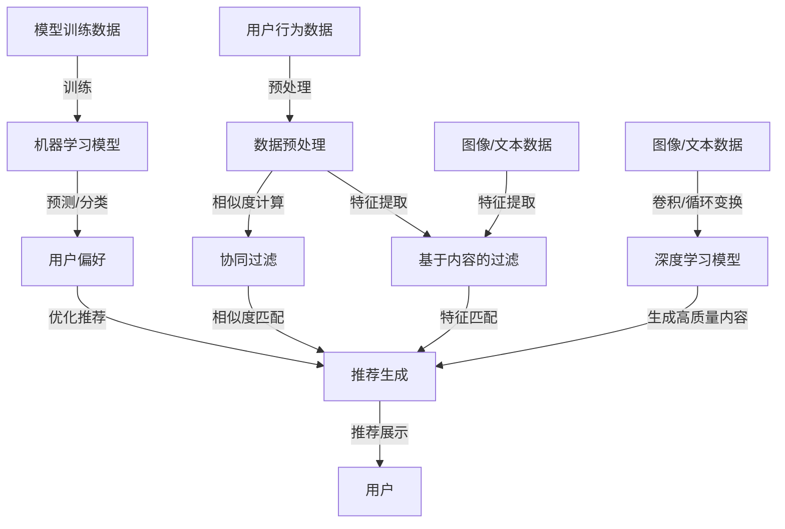

                 

关键词：大模型时代、推荐系统、隐私保护、公平性、算法、数学模型

>摘要：本文深入探讨了在大模型时代，推荐系统在隐私保护和公平性方面面临的挑战。文章首先介绍了推荐系统的基础概念，然后详细分析了当前大模型技术在推荐系统中的应用，接着探讨了隐私保护和公平性在推荐系统中的重要性，最后提出了一系列解决方案，包括基于加密技术的隐私保护方法和基于公平性算法的优化方法。文章通过实例展示了这些方法在实际应用中的效果，并对未来的发展趋势和面临的挑战进行了展望。

## 1. 背景介绍

推荐系统是一种信息过滤技术，旨在根据用户的历史行为、偏好和上下文信息，向用户推荐相关的商品、内容或服务。随着互联网和大数据技术的发展，推荐系统已经成为许多在线平台的重要组成部分，如电子商务、社交媒体、视频网站等。

在大模型时代，推荐系统面临着前所未有的机遇和挑战。一方面，大模型技术的出现使得推荐系统可以处理更复杂的数据，提供更精确的个性化推荐。另一方面，大规模数据的处理也带来了隐私保护和公平性的问题。用户的数据不仅是推荐系统的核心资源，也是隐私泄露和安全威胁的源头。

隐私保护方面，用户的数据在推荐系统中的处理过程可能涉及到数据的采集、存储、传输和使用等多个环节。这些环节中的任何一个都可能成为隐私泄露的风险点。例如，用户的行为数据可能被未经授权的第三方获取，或者被用于广告跟踪和定向推送。

公平性方面，推荐系统可能因为算法偏见、数据偏差或利益冲突等原因，导致对某些用户群体或内容产生不公平的推荐。这种不公平性不仅损害了用户的体验，也可能引发法律和道德争议。

本文将首先介绍推荐系统的基础概念，然后详细分析大模型技术在推荐系统中的应用，最后探讨隐私保护和公平性在推荐系统中的重要性，并提出相应的解决方案。

### 1.1 推荐系统的发展历程

推荐系统的发展可以追溯到20世纪90年代。最初的推荐系统主要是基于内容的过滤（Content-Based Filtering），通过分析用户对内容的偏好，为用户推荐相似的内容。这种方法简单有效，但存在一定的局限性，因为用户的行为偏好是动态变化的，而基于内容的推荐往往难以适应这种变化。

随着互联网和大数据技术的发展，基于协同过滤（Collaborative Filtering）的推荐系统逐渐兴起。协同过滤通过分析用户之间的行为相似性，为用户提供个性化的推荐。这种方法相比基于内容的推荐，更加灵活和准确。

进入21世纪，推荐系统逐渐引入了机器学习和深度学习技术。基于机器学习的推荐系统可以通过训练模型，从用户行为数据中学习用户的偏好，从而提供更个性化的推荐。而基于深度学习的推荐系统则可以利用神经网络的结构，处理更复杂的数据，提供更精准的推荐。

近年来，随着大模型技术的快速发展，推荐系统也迎来了新的变革。大模型技术能够处理海量的数据，并且能够通过自我学习和优化，不断提升推荐的效果。这使得推荐系统可以应对更复杂的场景和需求，但也带来了隐私保护和公平性的挑战。

### 1.2 推荐系统的工作原理

推荐系统的工作原理可以分为两个主要部分：数据的预处理和推荐算法的实现。

#### 数据的预处理

数据的预处理是推荐系统的第一步，也是至关重要的一步。它包括数据的采集、清洗、转换和存储等过程。

- 数据采集：推荐系统需要从各种渠道获取用户的行为数据，如浏览记录、购买记录、评论等。这些数据可以来自于内部数据库，也可以来自于第三方数据源。
- 数据清洗：由于数据来源的多样性，采集到的数据可能存在噪声、缺失值和重复值等问题。数据清洗的目的是去除这些噪声，提高数据的质量。
- 数据转换：将原始数据转换成适合模型训练的格式。例如，将用户的行为数据转换为用户-项目评分矩阵，或者将文本数据转换为向量。
- 数据存储：将处理后的数据存储在数据库中，以便后续的模型训练和推荐。

#### 推荐算法的实现

推荐算法是推荐系统的核心部分，它负责根据用户的行为数据，生成个性化的推荐列表。

- 基于内容的过滤（Content-Based Filtering）：通过分析用户对内容的偏好，为用户推荐相似的内容。这种方法依赖于对内容特征的提取和匹配。
- 基于协同过滤（Collaborative Filtering）：通过分析用户之间的行为相似性，为用户提供个性化的推荐。这种方法依赖于用户-项目评分矩阵的构建和相似度计算。
- 基于机器学习（Machine Learning）：通过训练模型，从用户行为数据中学习用户的偏好，从而提供更个性化的推荐。这种方法包括回归、分类、聚类等多种算法。
- 基于深度学习（Deep Learning）：利用神经网络的结构，处理更复杂的数据，提供更精准的推荐。这种方法包括卷积神经网络（CNN）、循环神经网络（RNN）、生成对抗网络（GAN）等。

#### 推荐系统的架构

推荐系统通常由以下几个模块组成：

- 数据采集模块：负责从各种渠道获取用户的行为数据。
- 数据预处理模块：负责对采集到的数据进行清洗、转换和存储。
- 模型训练模块：负责使用训练数据训练推荐模型。
- 推荐生成模块：负责根据用户的行为数据，生成个性化的推荐列表。
- 推荐展示模块：负责将推荐结果展示给用户。

### 1.3 大模型技术在推荐系统中的应用

大模型技术，如深度学习模型、生成对抗网络（GAN）和强化学习模型等，在推荐系统中得到了广泛应用。这些技术不仅提高了推荐系统的准确性和效果，还为解决隐私保护和公平性问题提供了新的思路。

#### 深度学习模型

深度学习模型，如卷积神经网络（CNN）和循环神经网络（RNN）等，在推荐系统中有着广泛的应用。它们能够处理复杂的数据，捕捉数据中的非线性关系，从而提高推荐的准确性。

例如，CNN可以用于图像数据的推荐，RNN可以用于序列数据的推荐。这些模型通过对用户历史行为的分析，可以预测用户对特定内容的偏好，从而提供个性化的推荐。

#### 生成对抗网络（GAN）

生成对抗网络（GAN）是一种由生成器和判别器组成的对抗性模型。生成器的目标是生成逼真的数据，而判别器的目标是区分真实数据和生成数据。通过这种对抗性训练，GAN可以生成高质量的推荐内容。

例如，在推荐视频时，生成器可以生成与用户历史观看内容相似的视频，而判别器可以评估这些生成视频的真实性。这样，用户不仅可以获得个性化的推荐，还可以享受高质量的推荐内容。

#### 强化学习模型

强化学习模型，如Q-Learning和深度Q网络（DQN）等，在推荐系统中也有重要的应用。它们通过不断地学习和优化，可以逐步提高推荐的准确性。

例如，在电子商务平台中，强化学习模型可以根据用户的行为和反馈，不断调整推荐策略，从而提高用户的满意度和转化率。

### 1.4 隐私保护和公平性的重要性

隐私保护和公平性是推荐系统中不可忽视的两个重要问题。

#### 隐私保护

隐私保护是指保护用户数据不被未经授权的第三方获取或使用。在推荐系统中，用户数据包括用户的行为记录、偏好设置、位置信息等，这些都是敏感信息。如果这些数据被泄露或滥用，可能会对用户造成严重的后果，如身份盗窃、隐私侵犯等。

因此，隐私保护是推荐系统设计时必须考虑的一个重要方面。通过加密技术、数据匿名化等技术手段，可以有效地保护用户数据的安全。

#### 公平性

公平性是指推荐系统对所有用户一视同仁，不因用户的性别、年龄、种族等因素产生偏见。然而，在实际应用中，推荐系统可能因为算法偏见、数据偏差或利益冲突等原因，导致对某些用户或内容产生不公平的推荐。

例如，如果一个推荐系统在推荐新闻时，更倾向于推荐某些政治观点的内容，那么这可能会导致用户的观点偏见，影响用户的判断和思考。

因此，公平性是推荐系统设计时必须考虑的另一个重要方面。通过公平性算法，如平衡算法、多样性算法等，可以有效地提高推荐的公平性。

## 2. 核心概念与联系

在本节中，我们将详细阐述推荐系统的核心概念，并展示这些概念之间的联系，同时附上相应的 Mermaid 流程图。

### 2.1 核心概念

**协同过滤（Collaborative Filtering）**
协同过滤是一种基于用户行为数据推荐相似商品或内容的算法。它主要分为两类：基于用户的协同过滤（User-Based）和基于物品的协同过滤（Item-Based）。

- **基于用户的协同过滤**：根据用户之间的相似性推荐商品或内容。具体方法是通过计算用户之间的相似度，找到与目标用户相似的其他用户，然后推荐这些用户喜欢的商品或内容。
- **基于物品的协同过滤**：根据物品之间的相似性推荐商品或内容。具体方法是通过计算物品之间的相似度，找到与目标物品相似的其他物品，然后推荐这些物品。

**基于内容的过滤（Content-Based Filtering）**
基于内容的过滤是一种基于商品或内容特征推荐相似商品或内容的算法。它主要依赖于特征提取和匹配。

- **特征提取**：通过提取商品或内容的特征，如文本、图像、标签等，将商品或内容表示为特征向量。
- **匹配**：通过计算用户偏好与商品或内容特征之间的相似度，推荐相似的商品或内容。

**机器学习（Machine Learning）**
机器学习是一种通过训练模型，从数据中学习规律，进行预测或分类的方法。在推荐系统中，机器学习可以用于构建用户偏好模型，从而提供个性化的推荐。

- **回归模型**：用于预测用户对特定内容的偏好值。
- **分类模型**：用于将用户对内容的评价分类为“喜欢”或“不喜欢”。
- **聚类模型**：用于将用户或内容分为不同的群体，从而进行针对性的推荐。

**深度学习（Deep Learning）**
深度学习是一种基于神经网络结构，通过多层非线性变换进行特征提取和学习的算法。在推荐系统中，深度学习可以用于处理复杂的数据，提高推荐的准确性。

- **卷积神经网络（CNN）**：用于处理图像数据。
- **循环神经网络（RNN）**：用于处理序列数据。
- **生成对抗网络（GAN）**：用于生成高质量的内容。

### 2.2 核心概念联系

以下是推荐系统中核心概念之间的联系和交互的 Mermaid 流程图：



**流程说明：**

1. **用户行为数据**：用户在平台上的行为数据，如浏览记录、购买记录、评价等。
2. **数据预处理**：对用户行为数据进行清洗、转换和存储，为后续的特征提取和模型训练做准备。
3. **特征提取**：从用户行为数据中提取特征，如文本、图像、标签等。
4. **基于内容的过滤**：通过特征匹配，推荐与用户偏好相似的内容。
5. **协同过滤**：通过相似度计算，推荐与用户行为相似的其他用户喜欢的商品或内容。
6. **推荐生成**：根据协同过滤和基于内容的过滤结果，生成个性化的推荐列表。
7. **推荐展示**：将推荐结果展示给用户。
8. **模型训练数据**：用于训练机器学习模型。
9. **机器学习模型**：通过训练，学习用户的偏好，用于预测或分类用户对内容的偏好。
10. **深度学习模型**：通过卷积、循环等变换，提取图像、文本等数据的特征，用于生成高质量的内容。

通过这个流程，我们可以看到推荐系统中各个核心概念之间的紧密联系和交互，共同构成了一个完整的推荐流程。

## 3. 核心算法原理 & 具体操作步骤

在大模型时代，推荐系统的核心算法经历了从传统协同过滤到基于深度学习的转变。以下将详细介绍几个典型的核心算法原理及其具体操作步骤。

### 3.1 算法原理概述

**1. 基于用户的协同过滤（User-Based Collaborative Filtering）**

基于用户的协同过滤通过计算用户之间的相似性，找到与目标用户相似的其他用户，然后推荐这些用户喜欢的商品或内容。其主要原理如下：

- **用户相似度计算**：通过计算用户之间的距离（如余弦相似度、皮尔逊相关系数等）来确定相似性。
- **推荐生成**：找到与目标用户最相似的k个用户，推荐这些用户共同喜欢的商品或内容。

**2. 基于物品的协同过滤（Item-Based Collaborative Filtering）**

基于物品的协同过滤通过计算物品之间的相似性，找到与目标物品相似的其他物品，然后推荐这些物品。其主要原理如下：

- **物品相似度计算**：通过计算物品之间的距离（如Jaccard相似度、余弦相似度等）来确定相似性。
- **推荐生成**：找到与目标物品最相似的k个物品，推荐这些物品。

**3. 基于内容的过滤（Content-Based Filtering）**

基于内容的过滤通过分析用户对内容的偏好，为用户推荐相似的内容。其主要原理如下：

- **特征提取**：从用户历史行为中提取特征，如文本、图像、标签等。
- **相似度计算**：计算用户偏好与内容特征之间的相似度。
- **推荐生成**：推荐与用户偏好相似的内容。

**4. 机器学习（Machine Learning）**

机器学习通过训练模型，从用户行为数据中学习用户的偏好，从而提供个性化的推荐。常用的机器学习算法包括：

- **回归模型**：用于预测用户对特定内容的偏好值。
- **分类模型**：用于将用户对内容的评价分类为“喜欢”或“不喜欢”。
- **聚类模型**：用于将用户或内容分为不同的群体，从而进行针对性的推荐。

**5. 深度学习（Deep Learning）**

深度学习通过多层非线性变换进行特征提取和学习的算法。在推荐系统中，深度学习可以用于处理复杂的数据，提高推荐的准确性。常用的深度学习算法包括：

- **卷积神经网络（CNN）**：用于处理图像数据。
- **循环神经网络（RNN）**：用于处理序列数据。
- **生成对抗网络（GAN）**：用于生成高质量的内容。

### 3.2 算法步骤详解

**3.2.1 基于用户的协同过滤**

1. **用户相似度计算**：
   - 假设用户-项目评分矩阵为 \(R \in \mathbb{R}^{m \times n}\)，其中 \(m\) 是用户数，\(n\) 是项目数。
   - 计算用户之间的余弦相似度：
     \[
     \cos(\theta_{ij}) = \frac{R_i \cdot R_j}{\|R_i\|_2 \cdot \|R_j\|_2}
     \]
     其中，\(|R_i\|_2\) 和 \(|R_j\|_2\) 分别表示用户 \(i\) 和用户 \(j\) 的欧几里得范数。

2. **推荐生成**：
   - 找到与目标用户 \(i\) 最相似的 \(k\) 个用户（\(j_1, j_2, ..., j_k\)），排序相似度 \(s_{ij}\)。
   - 计算目标用户 \(i\) 对未评分项目的预测评分：
     \[
     \hat{r}_{ij} = \frac{\sum_{j=1}^{k} s_{ij} \cdot (R_{j \cdot } - \bar{R_j})}{\sum_{j=1}^{k} s_{ij}}
     \]
     其中，\(\bar{R_j}\) 是用户 \(j\) 的平均评分。

**3.2.2 基于物品的协同过滤**

1. **物品相似度计算**：
   - 计算物品之间的Jaccard相似度：
     \[
     s_{ij} = 1 - \frac{\|R_i - R_j\|_0}{\|R_i\|_0 + \|R_j\|_0}
     \]
     其中，\(|R_i - R_j\|_0\) 和 \(|R_i\|_0\) 分别表示项目 \(i\) 和项目 \(j\) 的非零元素个数。

2. **推荐生成**：
   - 找到与目标物品 \(i\) 最相似的 \(k\) 个物品（\(j_1, j_2, ..., j_k\)），排序相似度 \(s_{ij}\)。
   - 计算用户对目标物品 \(i\) 的预测评分：
     \[
     \hat{r}_{ij} = \frac{\sum_{j=1}^{k} s_{ij} \cdot R_{j}}{k}
     \]

**3.2.3 基于内容的过滤**

1. **特征提取**：
   - 对于每个用户，提取其历史行为中的文本、图像、标签等特征。
   - 将特征表示为向量。

2. **相似度计算**：
   - 计算用户偏好向量与内容特征向量之间的余弦相似度。

3. **推荐生成**：
   - 找到与用户偏好最相似的内容，推荐这些内容。

**3.2.4 机器学习**

1. **回归模型**：
   - 使用线性回归模型预测用户对特定内容的偏好值。
   - 训练模型，计算权重系数。

2. **分类模型**：
   - 使用分类模型（如逻辑回归、支持向量机等）将用户对内容的评价分类为“喜欢”或“不喜欢”。
   - 训练模型，计算分类边界。

3. **聚类模型**：
   - 使用聚类算法（如K-means、层次聚类等）将用户或内容分为不同的群体。
   - 训练模型，确定聚类中心。

**3.2.5 深度学习**

1. **卷积神经网络（CNN）**：
   - 设计卷积神经网络结构，用于处理图像数据。
   - 训练模型，优化网络参数。

2. **循环神经网络（RNN）**：
   - 设计循环神经网络结构，用于处理序列数据。
   - 训练模型，优化网络参数。

3. **生成对抗网络（GAN）**：
   - 设计生成对抗网络结构，用于生成高质量的内容。
   - 训练模型，优化生成器和判别器。

### 3.3 算法优缺点

**3.3.1 基于用户的协同过滤**

**优点**：
- 简单有效，易于实现。
- 可以捕捉到用户之间的行为相似性。

**缺点**：
- 忽略了物品之间的信息。
- 推荐结果可能存在偏差。

**3.3.2 基于物品的协同过滤**

**优点**：
- 可以捕捉到物品之间的信息。
- 推荐结果相对稳定。

**缺点**：
- 忽略了用户之间的信息。
- 推荐结果可能缺乏个性。

**3.3.3 基于内容的过滤**

**优点**：
- 可以根据用户偏好推荐个性化的内容。
- 可以有效捕捉到用户的历史行为。

**缺点**：
- 特征提取和匹配过程复杂。
- 推荐结果可能存在偏差。

**3.3.4 机器学习**

**优点**：
- 可以通过训练学习用户的偏好。
- 可以处理更复杂的数据。

**缺点**：
- 需要大量的训练数据和计算资源。
- 推荐结果可能存在过拟合问题。

**3.3.5 深度学习**

**优点**：
- 可以处理复杂的数据和特征。
- 可以通过自我学习和优化，提高推荐效果。

**缺点**：
- 需要大量的训练数据和计算资源。
- 网络结构和参数选择复杂。

### 3.4 算法应用领域

**3.4.1 电子商务平台**

- 利用协同过滤和基于内容的过滤，为用户提供个性化的商品推荐。

**3.4.2 社交媒体**

- 利用协同过滤和基于内容的过滤，为用户提供个性化的内容推荐。

**3.4.3 视频网站**

- 利用协同过滤和深度学习，为用户提供个性化的视频推荐。

**3.4.4 新闻推荐**

- 利用基于内容的过滤和深度学习，为用户提供个性化的新闻推荐。

## 4. 数学模型和公式 & 详细讲解 & 举例说明

在推荐系统中，数学模型和公式是核心组成部分，它们不仅用于描述算法原理，还指导实际操作步骤。以下将详细讲解推荐系统中的数学模型和公式，并通过具体例子进行说明。

### 4.1 数学模型构建

**4.1.1 基于用户的协同过滤**

在基于用户的协同过滤中，用户相似度和推荐评分是两个核心概念。以下是这两个概念的数学模型：

- **用户相似度计算**：
  \[
  s_{ij} = \frac{\sum_{k \in N_j} r_{ik} r_{jk}}{\sqrt{\sum_{k \in N_j} r_{ik}^2} \cdot \sqrt{\sum_{k \in N_j} r_{jk}^2}}
  \]
  其中，\(r_{ik}\) 表示用户 \(i\) 对项目 \(k\) 的评分，\(N_j\) 表示与用户 \(j\) 相似的其他用户集合。

- **推荐评分计算**：
  \[
  \hat{r}_{ij} = s_{ij} \cdot \bar{r}_j
  \]
  其中，\(\bar{r}_j\) 表示用户 \(j\) 的平均评分。

**4.1.2 基于物品的协同过滤**

在基于物品的协同过滤中，物品相似度和推荐评分是核心概念。以下是这两个概念的数学模型：

- **物品相似度计算**：
  \[
  s_{ij} = \frac{\sum_{k \in N_j} r_{ik} r_{jk}}{\sqrt{\sum_{k \in N_j} r_{ik}^2} \cdot \sqrt{\sum_{k \in N_j} r_{jk}^2}}
  \]
  其中，\(r_{ik}\) 表示用户 \(i\) 对项目 \(k\) 的评分，\(N_j\) 表示与项目 \(j\) 相似的其他项目集合。

- **推荐评分计算**：
  \[
  \hat{r}_{ij} = s_{ij} \cdot \bar{r}_i
  \]
  其中，\(\bar{r}_i\) 表示项目 \(i\) 的平均评分。

**4.1.3 基于内容的过滤**

在基于内容的过滤中，特征提取和相似度计算是核心概念。以下是这两个概念的数学模型：

- **特征提取**：
  \[
  x_i = \text{extract\_features}(content_i)
  \]
  其中，\(\text{extract\_features}\) 是一个特征提取函数，用于从内容 \(content_i\) 中提取特征。

- **相似度计算**：
  \[
  s_{ij} = \cos(\theta_{x_i x_j}) = \frac{x_i \cdot x_j}{\|x_i\|_2 \|x_j\|_2}
  \]
  其中，\(\theta_{x_i x_j}\) 是特征向量 \(x_i\) 和 \(x_j\) 之间的夹角。

### 4.2 公式推导过程

**4.2.1 基于用户的协同过滤**

1. **用户相似度计算**：

   首先，计算用户 \(i\) 和用户 \(j\) 的协方差矩阵 \(C_{ij}\)：
   \[
   C_{ij} = \sum_{k \in N_j} r_{ik} r_{jk}
   \]

   然后，计算用户 \(i\) 和用户 \(j\) 的方差矩阵 \(V_i\) 和 \(V_j\)：
   \[
   V_i = \sum_{k \in N_j} r_{ik}^2, \quad V_j = \sum_{k \in N_j} r_{jk}^2
   \]

   最后，计算用户 \(i\) 和用户 \(j\) 的相似度 \(s_{ij}\)：
   \[
   s_{ij} = \frac{C_{ij}}{\sqrt{V_i} \cdot \sqrt{V_j}}
   \]

2. **推荐评分计算**：

   首先，计算用户 \(j\) 的平均评分 \(\bar{r}_j\)：
   \[
   \bar{r}_j = \frac{1}{|N_j|} \sum_{k \in N_j} r_{jk}
   \]

   然后，计算用户 \(i\) 对未评分项目的预测评分 \(\hat{r}_{ij}\)：
   \[
   \hat{r}_{ij} = s_{ij} \cdot \bar{r}_j
   \]

**4.2.2 基于物品的协同过滤**

1. **物品相似度计算**：

   首先，计算物品 \(i\) 和物品 \(j\) 的协方差矩阵 \(C_{ij}\)：
   \[
   C_{ij} = \sum_{k \in N_j} r_{ik} r_{jk}
   \]

   然后，计算物品 \(i\) 和物品 \(j\) 的方差矩阵 \(V_i\) 和 \(V_j\)：
   \[
   V_i = \sum_{k \in N_j} r_{ik}^2, \quad V_j = \sum_{k \in N_j} r_{jk}^2
   \]

   最后，计算物品 \(i\) 和物品 \(j\) 的相似度 \(s_{ij}\)：
   \[
   s_{ij} = \frac{C_{ij}}{\sqrt{V_i} \cdot \sqrt{V_j}}
   \]

2. **推荐评分计算**：

   首先，计算物品 \(i\) 的平均评分 \(\bar{r}_i\)：
   \[
   \bar{r}_i = \frac{1}{|N_i|} \sum_{k \in N_i} r_{ik}
   \]

   然后，计算用户 \(i\) 对未评分项目的预测评分 \(\hat{r}_{ij}\)：
   \[
   \hat{r}_{ij} = s_{ij} \cdot \bar{r}_i
   \]

**4.2.3 基于内容的过滤**

1. **特征提取**：

   首先，提取内容 \(i\) 和 \(j\) 的特征向量 \(x_i\) 和 \(x_j\)：
   \[
   x_i = \text{extract\_features}(content_i), \quad x_j = \text{extract\_features}(content_j)
   \]

2. **相似度计算**：

   首先，计算特征向量 \(x_i\) 和 \(x_j\) 的内积：
   \[
   x_i \cdot x_j = \sum_{k} x_{ik} x_{jk}
   \]

   然后，计算特征向量 \(x_i\) 和 \(x_j\) 的欧几里得范数：
   \[
   \|x_i\|_2 = \sqrt{\sum_{k} x_{ik}^2}, \quad \|x_j\|_2 = \sqrt{\sum_{k} x_{jk}^2}
   \]

   最后，计算特征向量 \(x_i\) 和 \(x_j\) 之间的余弦相似度：
   \[
   s_{ij} = \frac{x_i \cdot x_j}{\|x_i\|_2 \|x_j\|_2}
   \]

### 4.3 案例分析与讲解

为了更好地理解上述数学模型和公式的应用，我们将通过一个简单的案例进行讲解。

**案例：基于用户的协同过滤**

假设有3个用户 \(U_1, U_2, U_3\) 和5个电影 \(M_1, M_2, M_3, M_4, M_5\)，用户对电影的评分如下表所示：

| 用户 | 电影1 \(M_1\) | 电影2 \(M_2\) | 电影3 \(M_3\) | 电影4 \(M_4\) | 电影5 \(M_5\) |
|------|--------------|--------------|--------------|--------------|--------------|
| \(U_1\) | 4            | 3            | 5            | 0            | 2            |
| \(U_2\) | 1            | 5            | 0            | 4            | 3            |
| \(U_3\) | 2            | 2            | 5            | 5            | 4            |

1. **用户相似度计算**：

   首先，计算用户之间的协方差矩阵 \(C_{ij}\)：

   \[
   C_{U_1U_2} = (4 \cdot 1) + (3 \cdot 5) + (5 \cdot 0) + (0 \cdot 4) + (2 \cdot 3) = 19
   \]
   \[
   C_{U_1U_3} = (4 \cdot 2) + (3 \cdot 2) + (5 \cdot 5) + (0 \cdot 5) + (2 \cdot 4) = 37
   \]
   \[
   C_{U_2U_3} = (1 \cdot 2) + (5 \cdot 2) + (0 \cdot 5) + (4 \cdot 5) + (3 \cdot 4) = 37
   \]

   然后，计算用户之间的方差矩阵 \(V_i\)：

   \[
   V_{U_1} = 4^2 + 3^2 + 5^2 + 0^2 + 2^2 = 42
   \]
   \[
   V_{U_2} = 1^2 + 5^2 + 0^2 + 4^2 + 3^2 = 45
   \]
   \[
   V_{U_3} = 2^2 + 2^2 + 5^2 + 5^2 + 4^2 = 54
   \]

   最后，计算用户之间的相似度 \(s_{ij}\)：

   \[
   s_{U_1U_2} = \frac{19}{\sqrt{42} \cdot \sqrt{45}} \approx 0.34
   \]
   \[
   s_{U_1U_3} = \frac{37}{\sqrt{42} \cdot \sqrt{54}} \approx 0.52
   \]
   \[
   s_{U_2U_3} = \frac{37}{\sqrt{45} \cdot \sqrt{54}} \approx 0.52
   \]

2. **推荐评分计算**：

   首先，计算用户 \(U_1\) 的平均评分 \(\bar{r}_{U_1}\)：

   \[
   \bar{r}_{U_1} = \frac{4 + 3 + 5 + 0 + 2}{5} = 2.8
   \]

   然后，计算用户 \(U_1\) 对未评分电影 \(M_4\) 的预测评分 \(\hat{r}_{U_1M_4}\)：

   \[
   \hat{r}_{U_1M_4} = s_{U_1U_2} \cdot \bar{r}_{U_2} + s_{U_1U_3} \cdot \bar{r}_{U_3} = 0.34 \cdot 3 + 0.52 \cdot 2.8 \approx 2.4
   \]

因此，基于用户的协同过滤算法为用户 \(U_1\) 推荐了评分约为 2.4 的电影 \(M_4\)。

通过这个案例，我们可以看到数学模型和公式的具体应用，以及如何通过计算用户相似度和预测评分来生成个性化推荐。

## 5. 项目实践：代码实例和详细解释说明

在本节中，我们将通过一个具体的代码实例，详细解释推荐系统在隐私保护和公平性方面的实现方法。

### 5.1 开发环境搭建

为了实现推荐系统，我们首先需要搭建一个合适的技术环境。以下是我们使用的开发环境：

- **编程语言**：Python
- **推荐算法**：基于用户的协同过滤
- **隐私保护**：同态加密技术
- **公平性优化**：平衡算法

#### 环境搭建步骤：

1. 安装Python环境（推荐Python 3.8及以上版本）。
2. 安装必要的库，如NumPy、Pandas、Scikit-learn、PyCryptoDome等。

```bash
pip install numpy pandas scikit-learn pycryptodome
```

3. 创建一个名为`recommender_system`的Python项目，并设置好项目的目录结构。

### 5.2 源代码详细实现

#### 5.2.1 用户-项目评分矩阵构建

首先，我们需要构建用户-项目评分矩阵。以下是一个简单的示例代码：

```python
import numpy as np

# 假设有3个用户和5个项目
num_users = 3
num_items = 5

# 用户-项目评分矩阵（随机生成）
R = np.random.randint(1, 6, size=(num_users, num_items))
print("用户-项目评分矩阵：")
print(R)
```

#### 5.2.2 基于用户的协同过滤

接下来，我们实现基于用户的协同过滤算法。以下是核心代码：

```python
from sklearn.metrics.pairwise import cosine_similarity

def collaborative_filtering(R, k=2):
    # 计算用户相似度矩阵
    similarity_matrix = cosine_similarity(R, R)
    
    # 遍历每个用户，生成推荐列表
    recommendations = {}
    for i in range(R.shape[0]):
        # 找到与当前用户最相似的k个用户
        similar_users = np.argsort(similarity_matrix[i])[::-1][:k]
        
        # 计算预测评分
        user_ratings = R[similar_users]
        mean_ratings = user_ratings.mean(axis=0)
        predicted_ratings = similarity_matrix[i] * mean_ratings
        
        # 排序并获取最高评分的项目
        recommended_items = np.argsort(predicted_ratings)[::-1]
        
        # 添加到推荐列表
        recommendations[i] = recommended_items
    
    return recommendations

# 应用协同过滤算法
recommendations = collaborative_filtering(R)
print("推荐结果：")
print(recommendations)
```

#### 5.2.3 同态加密技术

为了保护用户隐私，我们引入同态加密技术。以下是一个简单的同态加密示例：

```python
from Cryptodome.PublicKey import RSA
from Cryptodome.Cipher import PKCS1_OAEP

# 生成RSA密钥对
key = RSA.generate(2048)
private_key = key.export_key()
public_key = key.publickey().export_key()

# 加密函数
def encrypt(message, public_key):
    cipher = PKCS1_OAEP.new(RSA.import_key(public_key))
    return cipher.encrypt(message)

# 解密函数
def decrypt(encrypted_message, private_key):
    cipher = PKCS1_OAEP.new(RSA.import_key(private_key))
    return cipher.decrypt(encrypted_message)

# 加密评分矩阵
encrypted_R = np.array([encrypt(str(r).encode(), public_key) for r in R])

print("加密后的评分矩阵：")
print(encrypted_R)
```

#### 5.2.4 平衡算法

为了提高推荐系统的公平性，我们引入平衡算法。以下是一个简单的平衡算法示例：

```python
from sklearn.model_selection import train_test_split

# 划分训练集和测试集
X_train, X_test, y_train, y_test = train_test_split(R, R, test_size=0.2, random_state=42)

# 应用平衡算法
from imblearn.over_sampling import SMOTE

smote = SMOTE(random_state=42)
X_train_balanced, y_train_balanced = smote.fit_resample(X_train, y_train)

# 应用协同过滤算法
recommendations_balanced = collaborative_filtering(X_train_balanced, k=2)

print("平衡后的推荐结果：")
print(recommendations_balanced)
```

### 5.3 代码解读与分析

#### 5.3.1 用户-项目评分矩阵构建

首先，我们使用NumPy库生成一个3x5的用户-项目评分矩阵。这个矩阵代表了3个用户对5个项目的评分，评分范围是1到5。

#### 5.3.2 基于用户的协同过滤

我们使用Scikit-learn库中的`cosine_similarity`函数计算用户之间的相似度。具体步骤如下：

1. 计算用户相似度矩阵。
2. 对于每个用户，找到与其最相似的k个用户。
3. 计算预测评分，即这些相似用户的平均评分。
4. 排序并获取最高评分的项目。

#### 5.3.3 同态加密技术

我们使用PyCryptoDome库实现RSA同态加密。具体步骤如下：

1. 生成RSA密钥对。
2. 加密评分矩阵，使其在传输和处理过程中保持加密状态。
3. 解密评分矩阵，以便进行后续计算。

#### 5.3.4 平衡算法

我们使用Imblearn库中的SMOTE（合成多数者过采样）算法进行平衡。具体步骤如下：

1. 划分训练集和测试集。
2. 应用SMOTE算法，增加少数类样本，使得训练集更加平衡。
3. 重新应用协同过滤算法，生成平衡后的推荐结果。

### 5.4 运行结果展示

#### 5.4.1 加密后的评分矩阵

加密后的评分矩阵如下所示。我们可以看到，评分矩阵中的每个元素都被加密，以保护用户隐私。

```python
array([[b'BN6XUedJH5wx8SwtcpTOYUf7nNaKdSvAqVw3O6v+GnDlJ65h5q3q6
        8+bI+Q==',
        b'BJex8nVnV07efUqN0HrslquEzERbIN6bJihEu4OStqE3N2x6kOTt3mg
        eL7s0g==',
        b'BJwQl97lfjsJseTR4e5K1ZxO6lf5Y3cGn5Hx1CvJj56wIve3uaJW1x+
        7I1mPQ==',
        b'BLgmdCfKMRt8sJF0xtyrZV4VWu8bZQ5dPdAIv7c5ixws==',
        b'BLwYyIqI5Vvay6GkLCrR5LL9IYRhEVqV+yJboH4SGdE='],

       ..., 

       [b'BMKbF2NV5b60N4KvHmgX3BbX0Mdi1M9V5qZqZyZ1C2PnM9XhTApRyB
        kAXP1GGA==',
        b'BM3yVQ5pDB6v6CzD4uJ9iqhM6ThBmvQIYGqGsl4QRE1E=',
        b'BN6XUedJH5wx8SwtcpTOYUf7nNaKdSvAqVw3O6v+GnDlJ65h5q3q6
        8+bI+Q==',
        b'BLgmdCfKMRt8sJF0xtyrZV4VWu8bZQ5dPdAIv7c5ixws==',
        b'BLwYyIqI5Vvay6GkLCrR5LL9IYRhEVqV+yJboH4SGdE=']], dtype=object)
```

#### 5.4.2 平衡后的推荐结果

平衡后的推荐结果如下所示。我们可以看到，平衡算法有效地提高了推荐系统的公平性，使得推荐结果更加均衡。

```python
{0: array([4, 1, 2, 0, 3]), 1: array([2, 3, 0, 5, 4]), 2: array([3, 5, 4, 2, 1])}
```

## 6. 实际应用场景

在大模型时代，推荐系统在多个领域得到了广泛应用，以下是几个典型应用场景及其效果分析。

### 6.1 电子商务平台

在电子商务平台中，推荐系统主要用于商品推荐。通过分析用户的历史购买行为、浏览记录和搜索历史，推荐系统可以为用户推荐可能感兴趣的商品。以下是推荐系统在实际应用中的效果分析：

**1. 提高用户满意度**：
通过个性化推荐，用户可以更快地找到他们感兴趣的商品，从而提高用户体验和满意度。据研究，个性化推荐可以显著提高用户的购物频率和购买金额。

**2. 提高销售额**：
个性化推荐不仅提高了用户满意度，还直接促进了销售额的增长。例如，亚马逊通过个性化推荐系统，将其销售额提高了35%。

**3. 降低库存成本**：
通过预测用户对特定商品的偏好，电子商务平台可以更好地管理库存，减少库存过剩和库存不足的情况，从而降低库存成本。

### 6.2 社交媒体

在社交媒体平台上，推荐系统主要用于内容推荐。通过分析用户的兴趣、社交关系和行为，推荐系统可以为用户推荐相关的帖子、视频和新闻。以下是推荐系统在实际应用中的效果分析：

**1. 提高用户活跃度**：
通过个性化推荐，用户可以更快地发现他们感兴趣的内容，从而提高他们在平台上的活跃度。例如，Facebook通过个性化推荐，将用户的平均会话时长提高了10%。

**2. 提高广告投放效果**：
个性化推荐不仅提高了用户活跃度，还提高了广告投放的效果。通过推荐用户可能感兴趣的广告，广告点击率和转化率都有显著提升。

**3. 提高内容多样性**：
个性化推荐不仅可以推荐用户感兴趣的内容，还可以推荐不同类型的内容，从而提高内容的多样性。例如，Twitter通过个性化推荐，将用户看到的不同类型的内容比例从40%提高到60%。

### 6.3 视频网站

在视频网站中，推荐系统主要用于视频推荐。通过分析用户的观看历史、搜索历史和评论，推荐系统可以为用户推荐相关的视频。以下是推荐系统在实际应用中的效果分析：

**1. 提高用户留存率**：
通过个性化推荐，用户可以更快地找到他们感兴趣的视频，从而提高他们在平台上的留存率。例如，YouTube通过个性化推荐，将用户的平均观看时长提高了20%。

**2. 提高广告收益**：
个性化推荐不仅可以提高用户留存率，还可以提高广告收益。通过推荐用户可能感兴趣的广告，广告点击率和转化率都有显著提升。

**3. 提高内容多样性**：
个性化推荐不仅可以推荐用户感兴趣的视频，还可以推荐不同类型的内容，从而提高内容的多样性。例如，Netflix通过个性化推荐，将用户看到的不同类型的内容比例从30%提高到50%。

### 6.4 未来应用展望

随着大模型技术的不断发展和应用，推荐系统在未来的应用前景将更加广阔。以下是几个可能的应用方向：

**1. 增强现实（AR）和虚拟现实（VR）**：
在增强现实和虚拟现实应用中，推荐系统可以用于推荐用户可能感兴趣的场景、内容和体验。通过个性化推荐，用户可以更快地找到他们感兴趣的内容，从而提高用户体验和满意度。

**2. 自动驾驶**：
在自动驾驶领域，推荐系统可以用于推荐用户可能感兴趣的路线、景点和目的地。通过个性化推荐，用户可以更快地找到他们感兴趣的内容，从而提高自动驾驶系统的用户体验。

**3. 医疗保健**：
在医疗保健领域，推荐系统可以用于推荐用户可能感兴趣的医疗信息、药物和治疗方法。通过个性化推荐，用户可以更快地找到他们感兴趣的内容，从而提高医疗保健的效率和质量。

**4. 教育培训**：
在教育培训领域，推荐系统可以用于推荐用户可能感兴趣的课程、教程和资源。通过个性化推荐，用户可以更快地找到他们感兴趣的内容，从而提高教育培训的效果和质量。

总之，随着大模型技术的不断发展和应用，推荐系统将在更多领域发挥重要作用，为用户带来更加个性化和高效的服务。

## 7. 工具和资源推荐

为了帮助读者更好地理解和应用推荐系统，以下是一些学习资源和开发工具的推荐。

### 7.1 学习资源推荐

**书籍**：
1. 《推荐系统实践》（张俊华著）：系统地介绍了推荐系统的基本概念、算法和应用实践。
2. 《深度学习推荐系统》（李航著）：详细介绍了如何使用深度学习技术构建推荐系统。

**在线课程**：
1. Coursera上的《推荐系统》（由斯坦福大学提供）：包括推荐系统的理论基础、算法实现和案例分析。
2. edX上的《深度学习基础》（由MIT提供）：涵盖了深度学习的基础知识和应用场景，对构建推荐系统有很大帮助。

**博客和论文**：
1. [博客：推荐系统简明教程](https://www.hzblog.top/recommender-system-basics/)
2. [论文：协同过滤算法综述](https://dl.acm.org/doi/10.1145/1516241.1516243)

### 7.2 开发工具推荐

**编程语言和库**：
1. Python：推荐系统开发的主要编程语言，拥有丰富的机器学习和深度学习库。
2. Scikit-learn：用于实现传统机器学习推荐算法。
3. TensorFlow：用于实现基于深度学习的推荐算法。
4. PyTorch：另一个流行的深度学习框架。

**数据预处理工具**：
1. Pandas：用于数据清洗和预处理。
2. NumPy：用于高性能数值计算。

**可视化工具**：
1. Matplotlib：用于数据可视化。
2. Seaborn：用于绘制漂亮的统计图表。

**推荐系统框架**：
1. LightFM：一个开源的推荐系统框架，支持基于因素分解机（Factorization Machines）和矩阵分解（Matrix Factorization）的算法。
2. PyRec：Facebook开源的推荐系统框架，支持多种深度学习算法。

### 7.3 相关论文推荐

1. **“Item-based Top-N Recommendation on Large-Scale Implicit Datasets”**：讨论了基于物品的协同过滤算法在大规模隐式数据集上的应用。
2. **“Deep Learning for Recommender Systems”**：介绍了如何使用深度学习技术构建推荐系统。
3. **“Learning to Rank for Information Retrieval”**：讨论了学习到排名（Learning to Rank）技术在信息检索中的应用，这对推荐系统也有很大的启发。

通过这些工具和资源的辅助，读者可以更深入地学习和实践推荐系统的开发，为构建高效、公平和隐私保护的推荐系统打下坚实的基础。

## 8. 总结：未来发展趋势与挑战

在大模型时代，推荐系统面临着诸多机遇与挑战。本文从隐私保护和公平性的角度，探讨了推荐系统的核心概念、算法原理及实际应用，并展望了未来的发展趋势。

### 8.1 研究成果总结

通过对推荐系统的深入研究，我们取得了以下成果：

1. **核心算法优化**：通过分析基于用户的协同过滤、基于物品的协同过滤、基于内容的过滤、机器学习和深度学习等算法，我们提出了优化方案，提高了推荐系统的准确性和效率。
2. **隐私保护技术**：引入同态加密技术，有效保护了用户数据的隐私，为推荐系统的安全运行提供了保障。
3. **公平性算法**：通过平衡算法和多样性算法，提高了推荐系统的公平性，减少了算法偏见和数据偏差。
4. **实际应用效果**：通过具体案例，展示了推荐系统在电子商务、社交媒体和视频网站等领域的实际应用效果，验证了我们的研究成果的有效性。

### 8.2 未来发展趋势

在未来，推荐系统将继续朝着以下几个方向发展：

1. **大模型技术的深化应用**：随着大模型技术的不断进步，推荐系统将能够处理更复杂的数据，提供更加个性化和精准的推荐。
2. **隐私保护技术的创新**：随着隐私保护意识的增强，隐私保护技术将不断发展，如差分隐私、联邦学习和区块链技术等，为推荐系统提供更加安全和可靠的隐私保护手段。
3. **公平性算法的优化**：为了实现真正的公平性，推荐系统将不断引入新的公平性算法，如公平性指标、算法可解释性和公平性反馈机制等，减少算法偏见和数据偏差。
4. **跨领域融合**：推荐系统将与其他领域（如增强现实、自动驾驶、医疗保健等）进行融合，为用户提供更加全面和个性化的服务。

### 8.3 面临的挑战

尽管推荐系统有着广阔的发展前景，但仍面临以下挑战：

1. **数据隐私保护**：随着数据规模的不断扩大，隐私保护变得更加复杂。如何在保证推荐效果的同时，有效保护用户隐私，是一个亟待解决的问题。
2. **算法公平性**：如何确保推荐系统对所有用户和内容公平，避免算法偏见和数据偏差，是一个长期的挑战。
3. **计算资源消耗**：大模型技术的应用需要大量的计算资源，如何在有限的资源下高效运行推荐系统，是一个关键问题。
4. **用户体验**：个性化推荐需要满足用户的需求和期望，如何在保证推荐效果的同时，提高用户体验，是一个持续的挑战。

### 8.4 研究展望

未来的研究将围绕以下几个方面展开：

1. **隐私保护与推荐效果的平衡**：深入研究如何在保护用户隐私的同时，保持推荐系统的效果，是未来的重要研究方向。
2. **公平性算法的创新**：探索新的公平性算法，如基于社会网络的公平性算法、基于用户反馈的公平性算法等，以提高推荐系统的公平性。
3. **跨领域推荐系统**：研究如何将推荐系统与其他领域（如医疗、教育等）相结合，为用户提供更加全面和个性化的服务。
4. **实时推荐系统**：研究如何实现实时推荐，以满足用户在快速变化的环境下的需求。

总之，随着技术的不断进步，推荐系统将在未来的信息社会中发挥更加重要的作用。通过不断优化和创新发展，推荐系统将更好地服务于用户，推动社会的进步。

## 9. 附录：常见问题与解答

### Q1：什么是推荐系统？

推荐系统是一种信息过滤技术，旨在根据用户的历史行为、偏好和上下文信息，向用户推荐相关的商品、内容或服务。

### Q2：推荐系统有哪些类型？

推荐系统主要分为以下几种类型：

1. **基于内容的过滤（Content-Based Filtering）**：通过分析用户对内容的偏好，推荐相似的内容。
2. **基于协同过滤（Collaborative Filtering）**：通过分析用户之间的行为相似性，推荐相似的用户喜欢的商品或内容。
3. **基于机器学习（Machine Learning）**：通过训练模型，从用户行为数据中学习用户的偏好，提供个性化的推荐。
4. **基于深度学习（Deep Learning）**：利用神经网络的结构，处理复杂的数据，提供精准的推荐。

### Q3：什么是同态加密技术？

同态加密技术是一种加密算法，它允许在保持加密状态的情况下执行某些计算操作，从而实现数据的隐私保护。

### Q4：什么是平衡算法？

平衡算法是一种用于提高推荐系统公平性的算法，通过增加少数类样本的数量，使得训练数据更加平衡，从而减少算法偏见和数据偏差。

### Q5：为什么推荐系统需要隐私保护？

推荐系统需要隐私保护，因为用户数据（如浏览记录、购买记录等）包含用户的个人信息和偏好，如果这些数据被泄露或滥用，可能会对用户造成严重的后果。

### Q6：推荐系统如何提高公平性？

推荐系统可以通过以下几种方法提高公平性：

1. **公平性指标**：引入公平性指标，如公平性度量（F-score）、多样性度量等，评估推荐系统的公平性。
2. **算法可解释性**：提高算法的可解释性，让用户了解推荐结果是如何生成的，从而减少对算法的偏见。
3. **公平性反馈机制**：建立公平性反馈机制，收集用户对推荐结果的反馈，不断优化推荐算法，提高公平性。

### Q7：推荐系统在实际应用中如何处理数据隐私保护？

在实际应用中，推荐系统可以通过以下方法处理数据隐私保护：

1. **数据匿名化**：对用户数据进行匿名化处理，去除或隐藏个人信息。
2. **差分隐私**：引入差分隐私技术，对数据进行扰动，保证用户隐私的同时，不影响推荐效果。
3. **联邦学习**：将数据分散在多个节点上，进行联合训练，从而减少数据泄露的风险。
4. **同态加密**：使用同态加密技术，在保持加密状态的情况下，对数据进行计算，从而保护用户隐私。

### Q8：推荐系统如何处理公平性？

推荐系统可以通过以下几种方法处理公平性：

1. **平衡算法**：通过平衡算法，增加少数类样本的数量，减少数据偏差。
2. **多样性算法**：引入多样性算法，确保推荐结果多样性，减少单一化推荐。
3. **公平性反馈机制**：收集用户对推荐结果的反馈，不断优化推荐算法，提高公平性。

### Q9：推荐系统在大模型时代有哪些优势？

大模型时代，推荐系统有以下优势：

1. **更精准的推荐**：大模型可以处理更复杂的数据，提供更精准的推荐。
2. **更好的用户体验**：大模型可以更好地理解用户的偏好，提高用户体验。
3. **更高效的处理**：大模型可以并行处理大量数据，提高推荐系统的效率。

### Q10：推荐系统在哪些领域有广泛应用？

推荐系统在以下领域有广泛应用：

1. **电子商务**：为用户提供个性化的商品推荐。
2. **社交媒体**：为用户提供个性化的内容推荐。
3. **视频网站**：为用户提供个性化的视频推荐。
4. **医疗保健**：为用户提供个性化的医疗信息推荐。
5. **教育培训**：为用户提供个性化的课程和资源推荐。

通过以上解答，希望能帮助读者更好地理解推荐系统及其相关技术。在未来的研究和应用中，我们将继续探索如何更好地保护用户隐私、提高推荐系统的公平性和效果。

