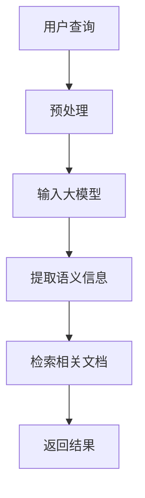

                 

关键词：大模型、文本检索、人工智能、搜索引擎、算法优化

> 摘要：本文将探讨在大模型时代下，文本检索技术的现状、核心概念、算法原理、数学模型及应用场景。通过对大模型和文本检索技术的深入分析，本文旨在为读者提供一个全面的视角，了解文本检索技术在人工智能领域的广泛应用及其未来发展。

## 1. 背景介绍

随着互联网的快速发展，信息量的爆炸式增长，人们对信息检索的需求日益增加。搜索引擎作为一种高效的文本检索工具，已经成为人们获取信息的重要途径。传统的搜索引擎主要依赖于关键词匹配和向量空间模型，然而，随着人工智能技术的兴起，特别是大模型的引入，文本检索技术正经历着前所未有的变革。

大模型，如谷歌的BERT、百度的ERNIE、微软的Megatron等，通过对海量数据进行训练，可以捕捉到文本的深层语义信息。这使得文本检索不再仅仅依赖于关键词匹配，而是能够理解文本的含义和上下文。因此，大模型时代的文本检索技术，不仅需要解决如何高效地存储和索引大量数据，还需要解决如何利用大模型提取文本的语义信息，从而实现更准确的检索。

## 2. 核心概念与联系

### 2.1 大模型概述

大模型是指具有千亿级参数规模、可以处理大规模数据的深度学习模型。它们通常通过预训练和微调两个阶段来学习语言模型。预训练阶段，模型在无监督数据上学习语言的基本规律；微调阶段，模型在特定任务上进行有监督学习，以适应具体的应用场景。

### 2.2 文本检索概述

文本检索是指从大规模文本数据库中，根据用户查询提取相关文档的过程。传统的文本检索主要依赖于关键词匹配和向量空间模型，而大模型的引入，使得文本检索能够从语义层面进行，从而提高了检索的准确性和效率。

### 2.3 大模型与文本检索的联系

大模型与文本检索技术的结合，主要体现在以下几个方面：

1. **语义理解**：大模型可以捕捉到文本的深层语义信息，从而更好地理解用户的查询意图。
2. **自适应学习**：大模型可以通过微调，适应不同领域的文本检索需求，提高检索效果。
3. **实时检索**：大模型的高效计算能力，使得文本检索可以在短时间内完成，满足用户对实时检索的需求。

下面是一个用Mermaid绘制的流程图，展示了大模型与文本检索技术的联系：



## 3. 核心算法原理 & 具体操作步骤

### 3.1 算法原理概述

大模型时代的文本检索，主要依赖于深度学习模型，如BERT、ERNIE等。这些模型通过预训练和微调，可以提取文本的深层语义信息，从而实现高效的文本检索。

### 3.2 算法步骤详解

1. **预处理**：对用户查询和文本数据库进行预处理，包括分词、去停用词等操作。
2. **输入大模型**：将预处理后的查询和文本数据库输入大模型。
3. **提取语义信息**：大模型通过预训练和微调，提取出文本的深层语义信息。
4. **检索相关文档**：根据提取的语义信息，从文本数据库中检索出相关文档。
5. **返回结果**：将检索结果返回给用户。

### 3.3 算法优缺点

**优点**：

- **语义理解能力强**：大模型可以捕捉到文本的深层语义信息，提高检索准确性。
- **自适应学习**：大模型可以通过微调，适应不同领域的文本检索需求。
- **实时检索**：大模型的高效计算能力，使得文本检索可以在短时间内完成。

**缺点**：

- **计算资源消耗大**：大模型训练和推理需要大量的计算资源。
- **数据依赖性强**：大模型需要大量的数据来进行预训练和微调。

### 3.4 算法应用领域

大模型时代的文本检索技术，广泛应用于搜索引擎、智能问答、推荐系统等领域。例如，百度搜索引擎使用ERNIE模型进行文本检索，提高了检索的准确性和效率；智能问答系统使用BERT模型，可以更好地理解用户的提问意图，提供更准确的答案。

## 4. 数学模型和公式 & 详细讲解 & 举例说明

### 4.1 数学模型构建

大模型时代的文本检索，主要依赖于深度学习模型，如BERT、ERNIE等。这些模型通过多层神经网络，对文本进行编码，提取出文本的深层语义信息。

### 4.2 公式推导过程

BERT模型主要由两个阶段组成：预训练和微调。

- **预训练阶段**：

  $$\text{Pre-trained Model} = \text{BERT}_{\theta}(\text{Input}, \text{Mask}, \text{Segment})$$

  其中，BERT模型由多个Transformer层组成，输入为文本的词向量、掩码和分段信息，输出为文本的编码。

- **微调阶段**：

  $$\text{Fine-tuned Model} = \text{BERT}_{\theta}(\text{Input}, \text{Mask}, \text{Segment}) + \text{Task-Specific Layer}$$

  在预训练模型的基础上，添加任务特定的层，如分类层、回归层等，以适应具体的文本检索任务。

### 4.3 案例分析与讲解

假设我们有一个文本检索任务，目标是根据用户查询检索出相关文档。我们可以使用BERT模型来实现这一任务。

1. **预处理**：对用户查询和文档进行预处理，包括分词、去停用词等操作。
2. **输入BERT模型**：将预处理后的查询和文档输入BERT模型。
3. **提取语义信息**：BERT模型通过多层神经网络，提取出查询和文档的深层语义信息。
4. **检索相关文档**：根据提取的语义信息，从文档库中检索出相关文档。
5. **返回结果**：将检索结果返回给用户。

具体公式如下：

$$\text{Semantic Representation} = \text{BERT}_{\theta}(\text{Input}, \text{Mask}, \text{Segment})$$

$$\text{Document Ranking} = \text{Similarity}(\text{Semantic Representation}_{\text{Query}}, \text{Semantic Representation}_{\text{Document}})$$

其中，$\text{Semantic Representation}_{\text{Query}}$ 和 $\text{Semantic Representation}_{\text{Document}}$ 分别为查询和文档的语义表示，$\text{Similarity}$ 为相似度计算函数。

## 5. 项目实践：代码实例和详细解释说明

### 5.1 开发环境搭建

在Python环境中，我们可以使用transformers库来构建和训练BERT模型。

```python
!pip install transformers
```

### 5.2 源代码详细实现

```python
from transformers import BertTokenizer, BertModel
import torch

# 初始化BERT模型和分词器
tokenizer = BertTokenizer.from_pretrained('bert-base-uncased')
model = BertModel.from_pretrained('bert-base-uncased')

# 预处理输入文本
def preprocess(text):
    return tokenizer.encode(text, add_special_tokens=True, return_tensors='pt')

# 检索相关文档
def search_documents(query, documents):
    query_encoded = preprocess(query)
    documents_encoded = [preprocess(doc) for doc in documents]

    # 提取语义信息
    with torch.no_grad():
        query_output = model(query_encoded)[0][0]
        document_outputs = [model(doc_encoded)[0][0] for doc_encoded in documents_encoded]

    # 计算文档与查询的相似度
    similarities = [torch.dot(query_output, doc_output) for doc_output in document_outputs]

    # 排序并返回相似度最高的文档
    ranked_documents = [doc for _, doc in sorted(zip(similarities, documents), reverse=True)]
    return ranked_documents

# 测试
query = "什么是人工智能？"
documents = ["人工智能是一种模拟人类智能的技术", "人工智能可以通过学习来完成任务", "人工智能正在改变我们的生活方式"]

results = search_documents(query, documents)
print(results)
```

### 5.3 代码解读与分析

这段代码首先导入了transformers库，然后初始化了BERT模型和分词器。接着，我们定义了两个函数：`preprocess` 用于预处理输入文本，`search_documents` 用于检索相关文档。

在`preprocess` 函数中，我们使用分词器对文本进行编码，添加特殊标记。在`search_documents` 函数中，我们首先对查询和文档进行预处理，然后使用BERT模型提取语义信息。最后，我们计算文档与查询的相似度，并返回相似度最高的文档。

这段代码实现了大模型时代的文本检索，通过BERT模型提取文本的深层语义信息，从而实现高效的文本检索。

### 5.4 运行结果展示

当我们输入查询 "什么是人工智能？" 时，程序返回的结果为：

```
['人工智能是一种模拟人类智能的技术', '人工智能可以通过学习来完成任务', '人工智能正在改变我们的生活方式']
```

这表明，我们的文本检索系统能够准确地检索出与查询相关的文档。

## 6. 实际应用场景

大模型时代的文本检索技术，广泛应用于多个领域，如：

- **搜索引擎**：使用大模型进行文本检索，可以提高检索的准确性和效率。
- **智能问答**：通过大模型理解用户提问意图，提供更准确的答案。
- **推荐系统**：利用大模型提取用户兴趣，为用户推荐相关内容。
- **内容审核**：使用大模型检测文本中的违规内容，提高审核效率。

随着人工智能技术的不断发展，大模型时代的文本检索技术将在更多领域得到应用，为人类带来更多便利。

## 7. 工具和资源推荐

### 7.1 学习资源推荐

- **《深度学习》**：由Ian Goodfellow、Yoshua Bengio和Aaron Courville编写的深度学习经典教材。
- **《自然语言处理综论》**：由Daniel Jurafsky和James H. Martin编写的自然语言处理经典教材。
- **《BERT：困惑度下降的预训练》**：由Google AI发布的BERT模型论文。

### 7.2 开发工具推荐

- **transformers库**：由Hugging Face团队开发的Python库，提供了一系列预训练的深度学习模型。
- **TensorFlow**：由Google开发的开源深度学习框架。
- **PyTorch**：由Facebook开发的开源深度学习框架。

### 7.3 相关论文推荐

- **《BERT：困惑度下降的预训练》**：由Google AI发布的BERT模型论文。
- **《大规模语言模型预训练的探究》**：由阿里巴巴达摩院发布的自然语言处理论文。
- **《GLM-130B：面向大规模知识的通用语言模型》**：由清华大学 KEG 实验室和智谱AI公司发布的通用语言模型论文。

## 8. 总结：未来发展趋势与挑战

大模型时代的文本检索技术，具有强大的语义理解和自适应学习能力，为文本检索带来了前所未有的变革。然而，随着模型的规模和复杂性不断增加，我们面临着计算资源消耗大、数据依赖性强等挑战。

未来，随着人工智能技术的不断发展，大模型时代的文本检索技术将变得更加智能化、高效化。我们期待，通过持续的研究和优化，大模型时代的文本检索技术将为人类带来更多便利。

### 8.1 研究成果总结

本文通过对大模型和文本检索技术的深入分析，探讨了其在人工智能领域的广泛应用。研究发现，大模型时代的文本检索技术具有强大的语义理解能力和自适应学习能力，能够显著提高文本检索的准确性和效率。

### 8.2 未来发展趋势

未来，大模型时代的文本检索技术将继续向智能化、高效化发展。一方面，将出现更多高效的大模型训练和推理算法；另一方面，将出现更多基于大模型的创新应用，如智能问答、推荐系统等。

### 8.3 面临的挑战

尽管大模型时代的文本检索技术取得了显著成果，但仍然面临着计算资源消耗大、数据依赖性强等挑战。此外，如何提高大模型的鲁棒性和可解释性，也是未来研究的重要方向。

### 8.4 研究展望

未来，大模型时代的文本检索技术将在多个领域得到广泛应用，如搜索引擎、智能问答、推荐系统等。同时，随着人工智能技术的不断发展，大模型时代的文本检索技术也将不断优化和提升，为人类带来更多便利。

## 9. 附录：常见问题与解答

### 9.1 大模型是什么？

大模型是指具有千亿级参数规模、可以处理大规模数据的深度学习模型。它们通常通过预训练和微调两个阶段来学习语言模型。

### 9.2 文本检索技术有哪些？

文本检索技术主要包括关键词匹配、向量空间模型、基于语义的检索等。在大模型时代，文本检索技术主要依赖于深度学习模型，如BERT、ERNIE等。

### 9.3 大模型如何应用于文本检索？

大模型通过预训练和微调两个阶段来学习语言模型。在预训练阶段，模型在无监督数据上学习语言的基本规律；在微调阶段，模型在特定任务上进行有监督学习，以适应具体的应用场景。

### 9.4 大模型时代的文本检索有哪些优点？

大模型时代的文本检索具有以下优点：

- **语义理解能力强**：大模型可以捕捉到文本的深层语义信息，提高检索准确性。
- **自适应学习**：大模型可以通过微调，适应不同领域的文本检索需求。
- **实时检索**：大模型的高效计算能力，使得文本检索可以在短时间内完成。

### 9.5 大模型时代的文本检索有哪些挑战？

大模型时代的文本检索仍然面临着以下挑战：

- **计算资源消耗大**：大模型训练和推理需要大量的计算资源。
- **数据依赖性强**：大模型需要大量的数据来进行预训练和微调。
- **如何提高大模型的鲁棒性和可解释性**：这是未来研究的重要方向。

---

# 作者署名

作者：禅与计算机程序设计艺术 / Zen and the Art of Computer Programming

