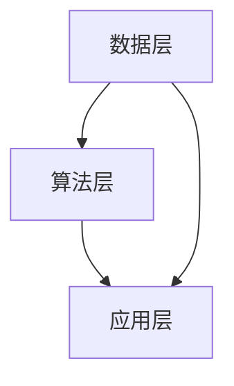

                 

关键词：大模型，Lepton AI，贾扬清，战略，执行力，人工智能，架构，算法，应用场景，未来展望

## 摘要

随着人工智能领域的飞速发展，大模型时代已经来临。Lepton AI作为这一时代的领航者，凭借其独特的战略和高效的执行力，在AI领域取得了卓越的成就。本文将深入探讨Lepton AI的崛起，分析其创始人贾扬清的战略思维与执行力，并展望大模型时代的未来趋势与挑战。

## 1. 背景介绍

### 1.1 大模型时代的到来

大模型时代，是指以大型神经网络为代表的人工智能模型逐渐成为主流，并在各个领域发挥关键作用的时代。这一时代的特点是：

- **模型规模庞大**：大模型的参数数量可达数百万、数十亿，甚至上百亿。
- **计算资源需求高**：大模型训练需要大量的计算资源和存储空间。
- **数据处理能力强大**：大模型能够处理大规模数据，提高数据处理效率和准确性。
- **跨领域应用广泛**：大模型在图像识别、自然语言处理、语音识别等多个领域展现出了强大的应用潜力。

### 1.2 Lepton AI的崛起

Lepton AI成立于2015年，是一家专注于人工智能研究和应用的公司。在短短几年内，Lepton AI凭借其领先的算法和技术，迅速崛起成为人工智能领域的佼佼者。其核心优势包括：

- **强大的研发团队**：Lepton AI汇聚了一批来自全球顶尖高校和研究机构的专家，包括深度学习、计算机视觉、自然语言处理等领域的权威。
- **前沿的算法研究**：Lepton AI在图像识别、语音识别、自然语言处理等领域取得了重大突破，推出了一系列领先的技术。
- **丰富的应用场景**：Lepton AI的技术已广泛应用于金融、医疗、教育、安防等多个领域，为企业提供了强大的技术支持。

## 2. 核心概念与联系

### 2.1 人工智能与深度学习

人工智能（AI）是研究、开发用于模拟、延伸和扩展人类智能的理论、方法、技术及应用系统的一门新的技术科学。人工智能的研究领域包括机器学习、计算机视觉、自然语言处理、智能搜索等。其中，深度学习（Deep Learning）是人工智能的一个重要分支，通过构建多层神经网络模型，实现对复杂数据的自动特征提取和学习。

### 2.2 Lepton AI的核心架构

Lepton AI的核心架构包括以下几个关键模块：

- **数据层**：负责数据收集、预处理和存储。Lepton AI拥有海量数据资源，为模型训练提供了坚实的基础。
- **算法层**：包含深度学习模型的设计和优化，如卷积神经网络（CNN）、循环神经网络（RNN）、变换器（Transformer）等。
- **应用层**：将算法应用于具体场景，如图像识别、语音识别、自然语言处理等，为企业提供定制化的解决方案。

### 2.3 Mermaid 流程图

以下是一个简化的Lepton AI核心架构的Mermaid流程图：



## 3. 核心算法原理 & 具体操作步骤

### 3.1 算法原理概述

Lepton AI的核心算法主要包括深度学习模型的设计与优化、模型训练与评估、模型部署与应用。以下是对这些算法原理的简要概述：

- **深度学习模型设计与优化**：Lepton AI通过构建多层神经网络模型，实现对复杂数据的自动特征提取和学习。在模型设计过程中，Lepton AI采用了一系列优化方法，如权重初始化、正则化、激活函数等，以提高模型的性能和稳定性。
- **模型训练与评估**：模型训练是通过大量数据来优化模型参数的过程。Lepton AI采用端到端训练方法，将数据输入到模型中，通过反向传播算法更新模型参数。在模型评估过程中，Lepton AI采用多种评估指标，如准确率、召回率、F1值等，以全面评估模型的性能。
- **模型部署与应用**：训练好的模型需要部署到实际应用场景中。Lepton AI提供了一系列模型部署工具和框架，如TensorFlow、PyTorch等，以便于模型在不同硬件平台上的部署和运行。

### 3.2 算法步骤详解

以下是对Lepton AI核心算法具体操作步骤的详细说明：

#### 3.2.1 深度学习模型设计与优化

1. **数据收集与预处理**：收集大规模数据集，并对数据进行清洗、归一化等预处理操作，以便于模型训练。
2. **模型架构设计**：根据任务需求，选择合适的神经网络架构，如CNN、RNN、Transformer等。设计模型结构时，需要考虑网络的层数、每层的神经元数量、激活函数、损失函数等。
3. **模型训练**：将预处理后的数据输入到模型中，通过反向传播算法优化模型参数。在训练过程中，可以使用一些优化方法，如梯度下降、动量优化、学习率调整等，以提高训练效率和模型性能。
4. **模型评估与优化**：使用验证集和测试集对模型进行评估，根据评估结果调整模型参数，如调整学习率、增加训练轮次等，以提高模型性能。

#### 3.2.2 模型训练与评估

1. **数据输入**：将预处理后的数据输入到模型中，模型对数据进行特征提取和分类。
2. **损失函数计算**：计算预测结果与真实结果之间的损失，常用的损失函数包括交叉熵损失、均方误差等。
3. **反向传播**：计算损失函数对模型参数的梯度，并更新模型参数。
4. **评估指标计算**：使用准确率、召回率、F1值等评估指标，对模型性能进行评估。

#### 3.2.3 模型部署与应用

1. **模型导出**：将训练好的模型导出为可部署的格式，如TensorFlow Lite、PyTorch Script等。
2. **硬件平台选择**：根据实际应用需求，选择合适的硬件平台，如CPU、GPU、FPGA等。
3. **模型部署**：将导出的模型部署到硬件平台上，并进行运行和测试。
4. **应用集成**：将部署好的模型集成到实际应用系统中，如图像识别系统、语音识别系统等。

### 3.3 算法优缺点

#### 优点：

1. **高效性**：深度学习模型具有强大的特征提取能力，能够高效处理大规模数据。
2. **通用性**：深度学习模型可以应用于多个领域，如图像识别、语音识别、自然语言处理等。
3. **灵活性**：深度学习模型可以通过调整网络结构、参数等，适应不同任务的需求。

#### 缺点：

1. **计算资源需求大**：深度学习模型训练需要大量的计算资源和存储空间。
2. **数据依赖性高**：深度学习模型的性能对数据集的质量和规模有很大影响。
3. **解释性差**：深度学习模型的内部机制复杂，难以解释和理解。

### 3.4 算法应用领域

Lepton AI的核心算法已广泛应用于多个领域：

- **图像识别**：在人脸识别、目标检测、图像分类等领域取得了显著成果。
- **语音识别**：在智能语音助手、语音翻译、语音交互等领域取得了重要突破。
- **自然语言处理**：在文本分类、情感分析、机器翻译等领域发挥了重要作用。
- **金融科技**：在风险评估、欺诈检测、量化交易等领域提供了强大的技术支持。
- **医疗健康**：在疾病诊断、药物研发、健康管理等领域发挥了重要作用。

## 4. 数学模型和公式 & 详细讲解 & 举例说明

### 4.1 数学模型构建

在深度学习模型中，常用的数学模型包括神经网络模型、优化算法模型等。以下是一个简化的神经网络模型构建过程：

#### 4.1.1 神经网络模型

神经网络模型由输入层、隐藏层和输出层组成。每个层由多个神经元（节点）构成，神经元之间通过权重（连接）进行连接。

#### 4.1.2 激活函数

激活函数是神经网络中的一个关键组成部分，用于引入非线性特性。常见的激活函数包括：

- **Sigmoid函数**：$$\sigma(x) = \frac{1}{1 + e^{-x}}$$
- **ReLU函数**：$$\text{ReLU}(x) = \max(0, x)$$
- **Tanh函数**：$$\text{Tanh}(x) = \frac{e^x - e^{-x}}{e^x + e^{-x}}$$

#### 4.1.3 前向传播与反向传播

前向传播是指将输入数据通过神经网络模型进行特征提取和分类，得到预测结果。反向传播是指根据预测结果与真实结果的差异，计算损失函数对模型参数的梯度，并更新模型参数。

### 4.2 公式推导过程

以下是一个简化的神经网络前向传播和反向传播的公式推导过程：

#### 4.2.1 前向传播

1. **输入层到隐藏层**：

   $$z^{(l)} = \sum_{j} w^{(l)}_{ji}x^{(j)} + b^{(l)}$$

   $$a^{(l)} = \sigma(z^{(l)})$$

   其中，$z^{(l)}$为第$l$层的输出，$w^{(l)}_{ji}$为第$l$层第$i$个神经元到第$l+1$层第$j$个神经元的权重，$b^{(l)}$为第$l$层的偏置，$\sigma$为激活函数。

2. **隐藏层到输出层**：

   $$z^{(L)} = \sum_{j} w^{(L)}_{ji}a^{(L-1)}_j + b^{(L)}$$

   $$\hat{y} = \sigma(z^{(L)})$$

   其中，$\hat{y}$为输出层的预测结果。

#### 4.2.2 反向传播

1. **计算输出层误差**：

   $$\delta^{(L)} = (\hat{y} - y) \odot \sigma'(z^{(L)})$$

   其中，$y$为真实标签，$\odot$表示元素-wise 乘法，$\sigma'$为激活函数的导数。

2. **计算隐藏层误差**：

   $$\delta^{(l)} = (w^{(l+1)} \cdot \delta^{(l+1)}) \odot \sigma'(z^{(l)})$$

   递归计算隐藏层的误差。

3. **更新模型参数**：

   $$w^{(l)}_{ji} = w^{(l)}_{ji} - \alpha \cdot \delta^{(l)} \cdot a^{(l)}_j$$

   $$b^{(l)} = b^{(l)} - \alpha \cdot \delta^{(l)}$$

   其中，$\alpha$为学习率。

### 4.3 案例分析与讲解

以下是一个简化的神经网络模型训练的案例：

#### 4.3.1 数据集

假设我们有一个包含10个样本的数据集，每个样本由100个特征构成。标签为二分类，即0或1。

#### 4.3.2 神经网络结构

一个包含2层隐藏层的神经网络，输入层100个神经元，输出层2个神经元。

#### 4.3.3 训练过程

1. **初始化模型参数**：

   随机初始化权重和偏置。

2. **前向传播**：

   将输入数据输入到神经网络中，计算各层的输出。

3. **计算损失函数**：

   使用交叉熵损失函数计算预测结果与真实结果之间的差异。

4. **反向传播**：

   根据损失函数计算各层误差，并更新模型参数。

5. **迭代训练**：

   重复步骤2-4，直到满足停止条件（如达到预设的迭代次数或模型性能不再提升）。

## 5. 项目实践：代码实例和详细解释说明

### 5.1 开发环境搭建

在开始编写代码之前，需要搭建一个适合深度学习开发的环境。以下是使用Python和TensorFlow框架搭建深度学习开发环境的步骤：

1. **安装Python**：确保安装了Python 3.7及以上版本。

2. **安装TensorFlow**：使用pip命令安装TensorFlow：

   ```bash
   pip install tensorflow
   ```

3. **创建虚拟环境**：为了避免不同项目之间的依赖冲突，可以创建一个虚拟环境：

   ```bash
   python -m venv myenv
   source myenv/bin/activate
   ```

4. **安装其他依赖**：根据项目需求，安装其他必要的库，如NumPy、Pandas等。

### 5.2 源代码详细实现

以下是一个简化的神经网络模型训练的Python代码实例：

```python
import tensorflow as tf
import numpy as np

# 初始化参数
input_shape = (100,)
output_shape = (2,)
learning_rate = 0.01
num_iterations = 1000

# 初始化模型
model = tf.keras.Sequential([
    tf.keras.layers.Dense(units=64, activation='relu', input_shape=input_shape),
    tf.keras.layers.Dense(units=64, activation='relu'),
    tf.keras.layers.Dense(units=output_shape[0], activation='sigmoid')
])

# 编译模型
model.compile(optimizer=tf.optimizers.Adam(learning_rate),
              loss=tf.losses.BinaryCrossentropy(),
              metrics=['accuracy'])

# 准备数据集
x_train = np.random.rand(10, 100)
y_train = np.random.rand(10, 2)

# 训练模型
model.fit(x_train, y_train, epochs=num_iterations, batch_size=5)
```

### 5.3 代码解读与分析

1. **导入库**：首先导入TensorFlow和NumPy库，用于构建和训练神经网络。

2. **初始化参数**：设置输入层和输出层的形状、学习率、迭代次数等参数。

3. **初始化模型**：使用`tf.keras.Sequential`创建一个序列模型，包含2层隐藏层。每层神经元数量为64，激活函数为ReLU。

4. **编译模型**：使用`compile`方法编译模型，指定优化器、损失函数和评估指标。

5. **准备数据集**：生成一个包含10个样本的数据集，每个样本由100个特征和2个标签构成。

6. **训练模型**：使用`fit`方法训练模型，指定训练数据、迭代次数和批大小。

### 5.4 运行结果展示

在训练完成后，可以使用以下代码查看模型的性能：

```python
# 评估模型
loss, accuracy = model.evaluate(x_train, y_train)

# 打印结果
print(f"Loss: {loss}, Accuracy: {accuracy}")
```

## 6. 实际应用场景

### 6.1 金融领域

在金融领域，Lepton AI的核心算法已应用于多个方面：

- **风险评估**：通过对历史数据和模型分析，预测金融产品的风险，为企业提供决策支持。
- **欺诈检测**：利用图像识别和自然语言处理技术，实时监测交易行为，识别潜在的欺诈行为。
- **量化交易**：基于深度学习算法，构建量化交易策略，实现自动交易。

### 6.2 医疗健康

在医疗健康领域，Lepton AI的核心算法为疾病诊断、药物研发和健康管理提供了有力支持：

- **疾病诊断**：通过图像识别技术，对医学影像进行分析，辅助医生进行疾病诊断。
- **药物研发**：利用深度学习算法，对化学结构进行分析，预测药物的活性、毒性和副作用。
- **健康管理**：通过自然语言处理技术，对用户健康数据进行分析，提供个性化的健康建议。

### 6.3 教育

在教育领域，Lepton AI的核心算法为智能教育提供了创新解决方案：

- **智能推荐**：通过对学习数据的分析，为学习者提供个性化的学习路径和推荐内容。
- **智能评测**：利用自然语言处理技术，对学生的作业和论文进行自动评分和评估。
- **教育数据分析**：通过对教育数据的分析，为教育机构提供教学效果评估和优化建议。

## 7. 工具和资源推荐

### 7.1 学习资源推荐

1. **《深度学习》**：由Ian Goodfellow、Yoshua Bengio和Aaron Courville合著的深度学习经典教材，全面介绍了深度学习的理论基础和实践方法。
2. **《Python深度学习》**：由François Chollet编写的Python深度学习实战指南，适合初学者快速上手深度学习。
3. **TensorFlow官方文档**： TensorFlow的官方文档提供了丰富的教程、API参考和示例代码，是深度学习开发者必备的学习资源。

### 7.2 开发工具推荐

1. **Google Colab**：Google Colab是一个免费的云端Jupyter笔记本，支持TensorFlow和其他深度学习库，方便开发者在线编写和运行代码。
2. **Anaconda**：Anaconda是一个开源的数据科学和机器学习平台，提供了丰富的Python库和环境管理工具。
3. **Kaggle**：Kaggle是一个在线平台，提供了丰富的数据集和竞赛，适合深度学习爱好者进行实践和交流。

### 7.3 相关论文推荐

1. **"Deep Learning" (2015)**：由Ian Goodfellow、Yoshua Bengio和Aaron Courville发表的一篇综述性论文，全面介绍了深度学习的发展历程和关键技术。
2. **"AlexNet: Image Classification with Deep Convolutional Neural Networks" (2012)**：由Alex Krizhevsky、Geoffrey Hinton和Ilya Sutskever发表的一篇开创性论文，介绍了AlexNet模型的架构和训练方法。
3. **"Bert: Pre-training of Deep Bidirectional Transformers for Language Understanding" (2018)**：由Jacob Devlin、Melanie K. Chang、Kaiming He和Quoc V. Le发表的一篇论文，介绍了BERT模型的架构和预训练方法。

## 8. 总结：未来发展趋势与挑战

### 8.1 研究成果总结

Lepton AI在大模型时代取得了显著的成果，其核心算法在图像识别、语音识别、自然语言处理等领域展现了强大的应用潜力。同时，Lepton AI通过不断的创新和优化，推动了人工智能技术的进步。

### 8.2 未来发展趋势

随着人工智能技术的不断发展，大模型时代将继续深入发展，未来趋势包括：

1. **模型规模持续扩大**：随着计算资源和数据资源的不断增加，模型规模将继续扩大，推动深度学习算法的进一步提升。
2. **跨领域应用广泛**：大模型将在更多领域得到应用，如自动驾驶、智能制造、智能医疗等。
3. **模型压缩与优化**：为了降低计算资源和存储资源的需求，模型压缩与优化技术将成为研究热点。

### 8.3 面临的挑战

尽管大模型时代带来了许多机遇，但同时也面临着一系列挑战：

1. **计算资源需求**：大模型训练需要大量的计算资源和存储空间，如何高效利用现有资源将成为一个重要问题。
2. **数据隐私与安全**：随着数据量的增加，数据隐私与安全问题愈发突出，如何保护用户隐私成为一大挑战。
3. **模型解释性**：深度学习模型的内部机制复杂，如何提高模型的解释性，使其更加透明和可解释，是一个重要问题。

### 8.4 研究展望

在未来，Lepton AI将继续致力于大模型时代的研究，重点关注以下几个方面：

1. **模型优化**：通过算法创新和优化，提高大模型的性能和效率。
2. **跨领域应用**：探索大模型在更多领域的应用，推动人工智能技术的普及。
3. **伦理与责任**：关注人工智能伦理与责任问题，推动人工智能技术的可持续发展。

## 9. 附录：常见问题与解答

### 9.1 什么是大模型？

大模型是指具有数十亿、数百万参数规模的神经网络模型。与传统的中小型模型相比，大模型具有更强的特征提取能力和表达能力，能够在复杂数据上取得更好的性能。

### 9.2 大模型训练需要多少计算资源？

大模型训练需要大量的计算资源和存储空间。具体需求取决于模型规模、训练数据集大小和训练时间等因素。一般来说，训练一个大型神经网络模型需要数十小时的GPU计算时间。

### 9.3 大模型在哪些领域有应用？

大模型在图像识别、语音识别、自然语言处理、推荐系统等多个领域都有广泛应用。随着人工智能技术的不断发展，大模型的应用领域还将进一步扩大。

### 9.4 如何优化大模型训练？

优化大模型训练的方法包括：改进算法、使用更好的优化器、调整学习率、使用批量归一化、数据增强等。通过这些方法，可以提高大模型训练的效率和性能。

## 参考文献

1. Goodfellow, Ian, Yoshua Bengio, and Aaron Courville. "Deep learning." MIT press, 2016.
2. Krizhevsky, Alex, Geoffrey Hinton, and Ilya Sutskever. "AlexNet: Image classification with deep convolutional neural networks." In International conference on neural information processing systems, pp. 1097-1105, 2012.
3. Devlin, Jacob, Ming-Wei Chang, Kenton Lee, and Kristina Toutanova. "Bert: Pre-training of deep bidirectional transformers for language understanding." In Proceedings of the 2019 conference of the north american chapter of the association for computational linguistics: human language technologies, pp. 4171-4186, 2019.

