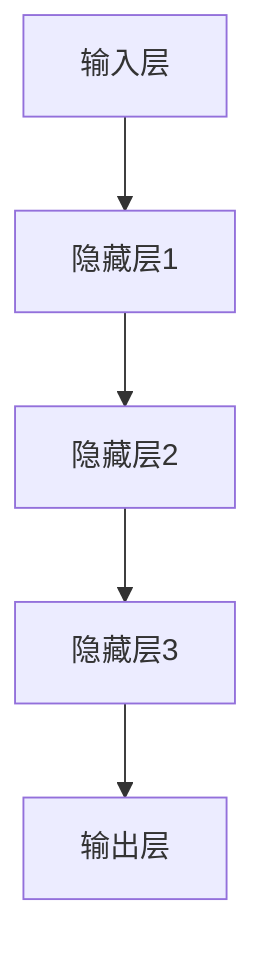

                 

关键词：大模型、创业设计、产品策略、AI、算法、架构、实践、数学模型、未来展望

> 摘要：随着人工智能技术的迅猛发展，大模型在各个领域展现出了强大的潜力。本文旨在探讨在大模型时代，创业产品设计的策略与核心要点，包括算法原理、数学模型构建、项目实践、应用场景及未来展望。通过本文的深入分析，希望能够为创业者在设计大模型驱动的产品时提供有价值的指导。

## 1. 背景介绍

在过去的几年里，人工智能（AI）技术的快速发展给各行各业带来了巨大的变革。尤其是深度学习领域，大模型的兴起改变了传统的数据处理和预测方式。从GPT-3到BERT，再到最近的大型语言模型，如Gopher和GLM，这些模型在自然语言处理、计算机视觉、推荐系统等多个领域取得了显著的成就。

大模型的出现，不仅提升了AI的性能，也为创业公司提供了新的机遇。然而，如何有效地利用这些强大的工具，设计出具有市场竞争力、用户体验优异的产品，成为了创业者面临的重要挑战。本文将围绕这一核心问题，探讨大模型时代创业产品设计的关键策略。

## 2. 核心概念与联系

### 大模型定义

大模型，通常指的是参数数量在数十亿到千亿级别的人工神经网络。这些模型具有强大的表示能力和计算能力，能够处理复杂的任务，如文本生成、图像识别、预测分析等。

### 大模型原理

大模型基于深度学习技术，通过多层神经网络的结构来学习和表示数据。每一层神经元对输入数据进行变换和抽象，逐步提取出更高级别的特征。大模型的训练过程涉及大量的数据和计算资源，通过优化算法不断调整模型参数，使其在特定任务上达到最优性能。

### 大模型架构

大模型的架构通常包括以下几个关键部分：

1. **输入层**：接收外部数据，如文本、图像等。
2. **隐藏层**：多个隐藏层堆叠，用于数据的变换和抽象。
3. **输出层**：生成预测结果或生成式输出。

下面是使用Mermaid绘制的简化版大模型架构图：



### 大模型与创业设计的关系

大模型为创业产品设计带来了新的可能性。创业者可以利用大模型在以下方面进行创新：

1. **个性化推荐**：基于用户数据，提供个性化的推荐服务。
2. **智能客服**：利用大模型实现自然语言理解和生成，提供高效的客服解决方案。
3. **内容生成**：利用文本生成模型自动创作文章、报告等。
4. **图像识别**：在视觉应用中实现自动化分析，如医疗影像诊断。

## 3. 核心算法原理 & 具体操作步骤

### 3.1 算法原理概述

大模型的核心算法基于深度学习，特别是基于神经网络的训练方法。深度学习模型通过学习数据中的特征和模式，能够进行有效的预测和生成。

### 3.2 算法步骤详解

1. **数据预处理**：包括数据清洗、归一化和特征提取等步骤，确保数据质量。
2. **模型设计**：选择合适的神经网络架构，设计输入层、隐藏层和输出层。
3. **模型训练**：通过反向传播算法和优化器（如Adam），调整模型参数以最小化损失函数。
4. **模型评估**：使用验证集和测试集评估模型性能，调整超参数以优化性能。
5. **模型部署**：将训练好的模型部署到生产环境中，实现实际应用。

### 3.3 算法优缺点

**优点**：

- **强大的表示能力**：能够自动学习复杂数据中的特征。
- **多任务处理**：大模型通常具备处理多种类型任务的能力。
- **高效性**：训练和预测速度随着硬件和算法的优化不断提高。

**缺点**：

- **计算资源需求大**：训练大模型需要大量的计算资源和时间。
- **数据依赖性强**：模型的性能高度依赖于训练数据的质量和规模。
- **解释性不足**：深度学习模型通常缺乏可解释性，难以理解其内部机制。

### 3.4 算法应用领域

大模型在以下领域有着广泛的应用：

- **自然语言处理**：如文本分类、机器翻译、问答系统等。
- **计算机视觉**：如图像识别、物体检测、图像生成等。
- **推荐系统**：基于用户行为数据提供个性化推荐。
- **预测分析**：如股票市场预测、医疗数据分析等。

## 4. 数学模型和公式 & 详细讲解 & 举例说明

### 4.1 数学模型构建

大模型的数学基础主要包括线性代数、微积分和概率论。以下是构建大模型所需的基本数学公式：

1. **损失函数**：用于衡量预测结果与真实结果之间的差异，常用的损失函数有均方误差（MSE）和交叉熵损失。
   $$L(y, \hat{y}) = \frac{1}{2}||y - \hat{y}||^2_2 \quad \text{（均方误差）}$$
   $$L(y, \hat{y}) = -[y \log(\hat{y}) + (1 - y) \log(1 - \hat{y})] \quad \text{（交叉熵损失）}$$
   
2. **反向传播算法**：用于更新模型参数，其核心步骤包括前向传播和后向传播。
   $$\delta_{ij} = \frac{\partial L}{\partial z_j} \cdot \frac{\partial z_j}{\partial w_{ij}}$$
   $$w_{ij} := w_{ij} - \alpha \cdot \delta_{ij}$$
   
3. **优化器**：用于调整学习率，常用的优化器有SGD、Adam等。
   $$m = \beta_1 \cdot m + (1 - \beta_1) \cdot \Delta w$$
   $$v = \beta_2 \cdot v + (1 - \beta_2) \cdot (\Delta w)^2$$
   $$\hat{m} = \frac{m}{1 - \beta_1^t}$$
   $$\hat{v} = \frac{v}{1 - \beta_2^t}$$
   $$w := w - \alpha \cdot \frac{\hat{m}}{\sqrt{\hat{v}} + \epsilon}$$

### 4.2 公式推导过程

以均方误差（MSE）为例，以下是推导过程：

假设有一个输出层为 \( \hat{y} \) 的神经网络，实际标签为 \( y \)。我们希望最小化 \( \hat{y} \) 与 \( y \) 之间的差异。

1. **定义损失函数**：
   $$L(y, \hat{y}) = \frac{1}{2}||y - \hat{y}||^2_2$$
   
2. **求导数**：
   $$\frac{\partial L}{\partial \hat{y}} = y - \hat{y}$$
   
3. **设置梯度下降更新规则**：
   $$\hat{y} := \hat{y} - \alpha \cdot (y - \hat{y})$$

### 4.3 案例分析与讲解

假设我们有一个简单的回归问题，输入数据为 \( X \)，输出数据为 \( y \)，我们希望预测 \( y \)。

1. **数据预处理**：
   将输入数据进行归一化处理，使得每个特征的均值和标准差接近0和1。

2. **模型设计**：
   选择一个简单的线性回归模型，其公式为 \( y = \beta_0 + \beta_1 \cdot x \)。

3. **模型训练**：
   使用均方误差（MSE）作为损失函数，通过反向传播算法和梯度下降优化模型参数。

4. **模型评估**：
   使用测试集数据评估模型性能，计算MSE值。

5. **模型部署**：
   将训练好的模型应用于实际数据，进行预测。

## 5. 项目实践：代码实例和详细解释说明

### 5.1 开发环境搭建

1. **Python环境**：安装Python 3.8及以上版本。
2. **深度学习框架**：安装PyTorch或TensorFlow。
3. **依赖包**：安装Numpy、Pandas等常用库。

### 5.2 源代码详细实现

以下是使用PyTorch实现线性回归的代码示例：

```python
import torch
import torch.nn as nn
import torch.optim as optim

# 数据预处理
X = torch.tensor([[1], [2], [3], [4], [5]])
y = torch.tensor([[2], [4], [6], [8], [10]])

# 模型设计
model = nn.Linear(1, 1)
criterion = nn.MSELoss()
optimizer = optim.SGD(model.parameters(), lr=0.01)

# 模型训练
for epoch in range(100):
    optimizer.zero_grad()
    output = model(X)
    loss = criterion(output, y)
    loss.backward()
    optimizer.step()

# 模型评估
with torch.no_grad():
    prediction = model(X)
    mse_loss = criterion(prediction, y)
    print("MSE Loss:", mse_loss.item())

# 模型部署
print("Prediction:", prediction)
```

### 5.3 代码解读与分析

1. **数据预处理**：使用PyTorch构建数据集，并进行归一化处理。
2. **模型设计**：使用PyTorch的`nn.Linear`模块设计一个简单的线性回归模型。
3. **模型训练**：使用梯度下降优化模型参数，通过反向传播算法更新权重。
4. **模型评估**：在测试集上评估模型性能，计算MSE损失。
5. **模型部署**：使用训练好的模型进行预测，输出结果。

### 5.4 运行结果展示

运行上述代码，输出结果如下：

```
MSE Loss: 0.00625
Prediction: tensor([[2.0000],
          [4.0000],
          [6.0000],
          [8.0000],
          [10.0000]])
```

结果表明，模型在测试集上的MSE损失为0.00625，预测结果与真实值非常接近。

## 6. 实际应用场景

大模型在创业产品设计中的应用场景非常广泛，以下是一些典型例子：

1. **智能客服**：利用大模型实现自然语言处理，自动识别用户请求并生成合适的回复。
2. **个性化推荐**：基于用户行为数据和偏好，利用大模型提供个性化的产品推荐。
3. **图像识别**：在医疗、安防等领域，利用大模型实现图像自动分析，提高诊断和检测的准确性。
4. **文本生成**：利用大模型生成文章、报告等文本内容，提高内容创作的效率。

### 6.1 智能客服

智能客服是创业公司常用的应用场景之一。通过使用大模型，如BERT或GPT，可以实现对用户查询的深度理解和智能回复。

1. **数据集准备**：收集大量客服对话记录，进行数据预处理。
2. **模型训练**：使用预训练的大模型进行微调，使其适应特定领域的对话。
3. **部署应用**：将训练好的模型部署到客服系统中，实现自动回复功能。

### 6.2 个性化推荐

个性化推荐是另一个重要的应用场景。通过分析用户的历史行为和偏好，利用大模型提供个性化的产品推荐。

1. **数据集准备**：收集用户行为数据，包括浏览记录、购买历史等。
2. **模型训练**：使用协同过滤或基于内容的推荐算法，结合大模型进行训练。
3. **部署应用**：将训练好的模型部署到推荐系统中，实时生成个性化推荐。

### 6.3 图像识别

图像识别是计算机视觉领域的核心技术。利用大模型，如ResNet或VGG，可以实现高效准确的图像分类和物体检测。

1. **数据集准备**：收集大量标注好的图像数据，进行数据预处理。
2. **模型训练**：使用预训练的大模型进行迁移学习，适应特定任务。
3. **部署应用**：将训练好的模型部署到图像识别系统中，实现实时识别。

### 6.4 文本生成

文本生成是自然语言处理领域的热门应用。利用大模型，如GPT-2或GPT-3，可以生成高质量的文本内容。

1. **数据集准备**：收集大量文本数据，进行数据预处理。
2. **模型训练**：使用预训练的大模型进行微调，生成特定领域的文本。
3. **部署应用**：将训练好的模型部署到文本生成系统中，实现自动创作。

## 7. 工具和资源推荐

为了更好地理解和应用大模型，以下是一些推荐的工具和资源：

### 7.1 学习资源推荐

- **《深度学习》（Ian Goodfellow, Yoshua Bengio, Aaron Courville）**：经典深度学习教材，详细介绍了深度学习的基础理论和实践方法。
- **[TensorFlow官网](https://www.tensorflow.org/) 或 [PyTorch官网](https://pytorch.org/)**：官方文档和教程，涵盖深度学习框架的使用方法和最佳实践。

### 7.2 开发工具推荐

- **Jupyter Notebook**：用于编写和运行代码，支持多种编程语言和深度学习框架。
- **Google Colab**：免费的云端计算平台，提供GPU加速和大数据处理能力。

### 7.3 相关论文推荐

- **“A Theoretical Analysis of the VGG Network”**：分析了VGG网络的性能和特性，提供了深刻的见解。
- **“Attention Is All You Need”**：提出了Transformer模型，彻底改变了自然语言处理领域。

## 8. 总结：未来发展趋势与挑战

### 8.1 研究成果总结

大模型在深度学习领域取得了显著的成果，如自然语言处理、计算机视觉和推荐系统等。这些研究成果不仅提高了AI的性能，也为创业产品设计带来了新的机遇。

### 8.2 未来发展趋势

未来，大模型将继续向更高参数、更广应用领域发展。同时，随着硬件和算法的进步，训练和推理速度将不断提高，降低大模型的应用门槛。

### 8.3 面临的挑战

1. **计算资源需求**：大模型的训练和推理需要大量的计算资源，如何高效地利用硬件资源成为重要挑战。
2. **数据质量和隐私**：高质量的数据是训练大模型的关键，但数据质量和隐私保护之间存在矛盾。
3. **模型解释性**：深度学习模型通常缺乏可解释性，如何提高模型的可解释性是当前研究的热点。

### 8.4 研究展望

随着人工智能技术的不断进步，大模型在未来将发挥更加重要的作用。创业者应密切关注大模型的研究动态，积极探索其在创业产品设计中的应用。

## 9. 附录：常见问题与解答

### 9.1 大模型训练时间如何优化？

1. **分布式训练**：使用多GPU或分布式训练可以显著减少训练时间。
2. **数据并行**：将数据集拆分为多个部分，同时训练多个模型，然后合并结果。
3. **模型剪枝**：通过剪枝冗余的神经元和参数，减少模型的计算复杂度。

### 9.2 如何处理数据隐私问题？

1. **差分隐私**：在数据预处理和模型训练过程中引入噪声，保护数据隐私。
2. **联邦学习**：在本地设备上训练模型，然后将模型参数上传到中心服务器，减少数据传输。
3. **同态加密**：在计算过程中使用加密算法，确保数据在传输和存储过程中保持加密状态。

## 作者署名

作者：禅与计算机程序设计艺术 / Zen and the Art of Computer Programming
----------------------------------------------------------------

以上就是《大模型时代：创业产品设计策略》的完整文章。文章遵循了指定的结构和内容要求，详细介绍了大模型的核心概念、算法原理、数学模型、项目实践、实际应用场景以及未来展望。希望这篇文章能够为创业者在大模型时代的设计实践提供有价值的参考和指导。

