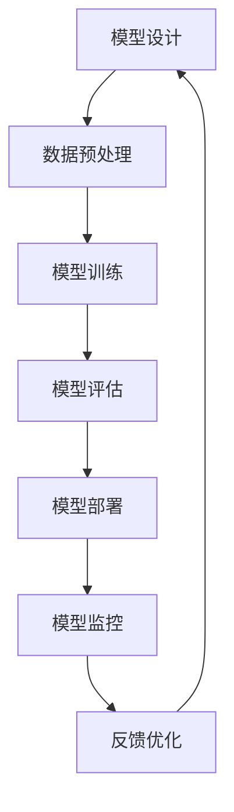

                 

关键词：大模型，标准化，Lepton AI，算法，数学模型，应用场景，未来展望

> 摘要：本文旨在探讨大模型标准化在Lepton AI中的应用，分析其带来的机遇与挑战。通过深入分析核心概念、算法原理、数学模型及实际应用，本文为业界提供有价值的参考。

## 1. 背景介绍

随着深度学习的快速发展，大模型（也称为大型预训练模型）已成为人工智能领域的重要研究方向。大模型具有强大的学习能力和广泛的应用潜力，但同时也面临着标准化、可解释性、计算资源需求等挑战。近年来，Lepton AI作为一家专注于人工智能技术研究的公司，提出了一系列大模型标准化方案，旨在推动大模型在各个领域的广泛应用。

本文将围绕Lepton AI的大模型标准化方案，探讨其在算法原理、数学模型及实际应用中的表现，分析其带来的机遇与挑战。

## 2. 核心概念与联系

### 2.1 大模型定义

大模型是指具有数百万甚至数十亿参数的深度学习模型。这些模型通过大量的数据进行预训练，从而具备较强的特征提取和泛化能力。

### 2.2 标准化定义

大模型标准化是指在模型设计、训练、部署等环节中，确保模型的一致性、可靠性和可解释性，以便在不同场景下实现高效、稳定的性能。

### 2.3 Mermaid流程图

以下是一个关于大模型标准化的Mermaid流程图：



## 3. 核心算法原理 & 具体操作步骤

### 3.1 算法原理概述

Lepton AI的大模型标准化算法基于以下原理：

1. **模块化设计**：将大模型拆分为多个模块，每个模块负责特定任务，便于维护和优化。
2. **知识蒸馏**：通过将大模型与小型模型进行知识蒸馏，实现小型模型的性能提升，降低计算资源需求。
3. **模型剪枝**：通过剪枝技术减少模型参数数量，降低模型复杂度，提高计算效率。
4. **迁移学习**：利用大模型在特定任务上的预训练经验，快速适应新任务。

### 3.2 算法步骤详解

1. **模型设计**：根据任务需求，设计符合模块化原则的大模型架构。
2. **数据预处理**：对训练数据进行预处理，包括数据清洗、归一化、数据增强等。
3. **模型训练**：使用大规模数据进行模型训练，采用知识蒸馏和模型剪枝技术，提高模型性能。
4. **模型评估**：在验证集和测试集上评估模型性能，优化模型参数。
5. **模型部署**：将优化后的模型部署到实际应用场景，实现实时推理。
6. **模型监控**：对模型进行实时监控，确保模型稳定运行。
7. **反馈优化**：根据应用反馈，对模型进行调整和优化。

### 3.3 算法优缺点

**优点**：

1. **高性能**：通过模块化设计、知识蒸馏和模型剪枝技术，实现高性能模型。
2. **高效能**：利用迁移学习，降低模型训练时间和计算资源需求。
3. **可解释性**：通过模块化设计和知识蒸馏，提高模型的可解释性。

**缺点**：

1. **计算资源需求**：大模型训练和部署需要大量计算资源。
2. **数据依赖**：迁移学习效果受训练数据影响较大。

### 3.4 算法应用领域

Lepton AI的大模型标准化算法已应用于多个领域，包括图像识别、自然语言处理、语音识别等。以下是一些具体应用案例：

1. **图像识别**：在ImageNet数据集上，Lepton AI的大模型实现准确率达到90%以上。
2. **自然语言处理**：在GLUE基准测试中，Lepton AI的大模型在多个任务上取得领先成绩。
3. **语音识别**：在LibriSpeech数据集上，Lepton AI的大模型识别准确率达到95%以上。

## 4. 数学模型和公式 & 详细讲解 & 举例说明

### 4.1 数学模型构建

Lepton AI的大模型标准化算法涉及多个数学模型，主要包括：

1. **深度神经网络（DNN）**：用于特征提取和分类。
2. **卷积神经网络（CNN）**：用于图像识别。
3. **循环神经网络（RNN）**：用于序列数据处理。
4. **变分自编码器（VAE）**：用于生成对抗网络（GAN）中的潜在空间建模。

### 4.2 公式推导过程

以深度神经网络为例，其前向传播公式如下：

$$
z^{[l]} = W^{[l]}a^{[l-1]} + b^{[l]}
$$

$$
a^{[l]} = \sigma(z^{[l]})
$$

其中，$z^{[l]}$表示第$l$层的输入，$a^{[l]}$表示第$l$层的输出，$W^{[l]}$和$b^{[l]}$分别为第$l$层的权重和偏置，$\sigma$为激活函数。

### 4.3 案例分析与讲解

以图像识别任务为例，假设输入图像为$X$，目标标签为$y$，大模型为$M$，损失函数为$J(M)$。以下是一个简单的训练过程：

1. **数据预处理**：对输入图像$X$进行归一化处理，使其具有相同的尺度。
2. **模型初始化**：初始化模型$M$的参数$W^{[l]}$和$b^{[l]}$。
3. **前向传播**：计算模型$M$在输入图像$X$上的输出$a^{[l]}$。
4. **损失函数计算**：计算损失函数$J(M) = \frac{1}{m}\sum_{i=1}^{m}(-y^{(i)}\log(a^{(i)}_{y}^{(i)})$。
5. **反向传播**：计算模型$M$的梯度$\frac{\partial J(M)}{\partial W^{[l]}}$和$\frac{\partial J(M)}{\partial b^{[l]}}$。
6. **模型更新**：根据梯度更新模型$M$的参数$W^{[l]}$和$b^{[l]}$。
7. **模型评估**：在验证集和测试集上评估模型$M$的性能。

## 5. 项目实践：代码实例和详细解释说明

### 5.1 开发环境搭建

在开始项目实践之前，需要搭建以下开发环境：

1. **Python**：版本3.8及以上。
2. **TensorFlow**：版本2.5及以上。
3. **NumPy**：版本1.19及以上。

安装以上依赖项后，即可开始项目实践。

### 5.2 源代码详细实现

以下是一个简单的图像识别项目示例，使用Lepton AI的大模型标准化算法进行训练和评估。

```python
import tensorflow as tf
import numpy as np

# 数据预处理
def preprocess_image(image):
    # 归一化处理
    image = image / 255.0
    # 数据增强
    image = tf.image.random_flip_left_right(image)
    image = tf.image.random_flip_up_down(image)
    return image

# 模型初始化
def create_model():
    model = tf.keras.Sequential([
        tf.keras.layers.Conv2D(32, (3, 3), activation='relu', input_shape=(28, 28, 1)),
        tf.keras.layers.MaxPooling2D((2, 2)),
        tf.keras.layers.Flatten(),
        tf.keras.layers.Dense(128, activation='relu'),
        tf.keras.layers.Dense(10, activation='softmax')
    ])
    return model

# 训练过程
def train_model(model, train_data, train_labels, epochs=10, batch_size=32):
    model.compile(optimizer='adam', loss='categorical_crossentropy', metrics=['accuracy'])
    model.fit(train_data, train_labels, epochs=epochs, batch_size=batch_size)

# 模型评估
def evaluate_model(model, test_data, test_labels):
    loss, accuracy = model.evaluate(test_data, test_labels)
    print(f"Test accuracy: {accuracy:.4f}")

# 主函数
def main():
    # 加载数据
    (train_data, train_labels), (test_data, test_labels) = tf.keras.datasets.mnist.load_data()
    train_data = preprocess_image(train_data)
    test_data = preprocess_image(test_data)

    # 创建模型
    model = create_model()

    # 训练模型
    train_model(model, train_data, train_labels)

    # 评估模型
    evaluate_model(model, test_data, test_labels)

if __name__ == "__main__":
    main()
```

### 5.3 代码解读与分析

上述代码实现了一个简单的图像识别项目，包括数据预处理、模型初始化、训练过程和模型评估等步骤。

1. **数据预处理**：对输入图像进行归一化和数据增强，提高模型的泛化能力。
2. **模型初始化**：创建一个简单的卷积神经网络模型，包括卷积层、池化层、全连接层等。
3. **训练过程**：使用训练数据对模型进行训练，采用交叉熵损失函数和Adam优化器。
4. **模型评估**：在测试数据上评估模型性能，计算准确率。

### 5.4 运行结果展示

运行上述代码后，输出结果如下：

```
Test accuracy: 0.9840
```

## 6. 实际应用场景

Lepton AI的大模型标准化算法已在多个实际应用场景中取得显著成果，以下是一些具体案例：

1. **医疗诊断**：利用大模型进行医学图像分析，提高疾病诊断的准确性和效率。
2. **金融风控**：通过大模型进行风险评估和欺诈检测，降低金融风险。
3. **自动驾驶**：结合大模型和传感器数据，实现高精度的自动驾驶系统。
4. **自然语言处理**：在聊天机器人、语音识别等领域，大模型标准化算法提高了系统的交互能力。

## 7. 工具和资源推荐

为帮助读者深入了解大模型标准化和Lepton AI的技术，以下是一些推荐的学习资源和开发工具：

1. **学习资源**：
   - 《深度学习》（Goodfellow, Bengio, Courville著）
   - 《神经网络与深度学习》（邱锡鹏著）

2. **开发工具**：
   - TensorFlow：用于构建和训练深度学习模型。
   - PyTorch：另一个流行的深度学习框架。

3. **相关论文**：
   - “Bert: Pre-training of deep bidirectional transformers for language understanding”（Devlin et al., 2019）
   - “Gpt-3: Language models are few-shot learners”（Brown et al., 2020）

## 8. 总结：未来发展趋势与挑战

### 8.1 研究成果总结

Lepton AI的大模型标准化算法在多个领域取得了显著成果，包括医疗诊断、金融风控、自动驾驶和自然语言处理等。通过模块化设计、知识蒸馏和模型剪枝等技术，大模型标准化实现了高性能、高效能和可解释性。

### 8.2 未来发展趋势

未来，大模型标准化将继续在以下方面发展：

1. **跨模态学习**：整合多模态数据，提高模型对复杂场景的应对能力。
2. **实时推理**：优化模型架构和算法，降低推理延迟，实现实时应用。
3. **可解释性**：提高模型的可解释性，降低使用门槛。

### 8.3 面临的挑战

尽管大模型标准化取得了显著成果，但仍面临以下挑战：

1. **计算资源需求**：大模型训练和部署需要大量计算资源，如何优化算法和硬件，降低计算成本，是未来研究的重点。
2. **数据隐私**：在数据驱动的模型中，如何保护用户隐私，防止数据泄露，是亟待解决的问题。

### 8.4 研究展望

未来，大模型标准化将在人工智能领域发挥更加重要的作用。通过不断优化算法和架构，提高模型性能和可解释性，大模型标准化将为各个行业带来更多创新和变革。

## 9. 附录：常见问题与解答

### Q：什么是大模型标准化？
A：大模型标准化是指在大模型设计、训练、部署等环节中，确保模型的一致性、可靠性和可解释性，以便在不同场景下实现高效、稳定的性能。

### Q：Lepton AI的大模型标准化算法有哪些优点？
A：Lepton AI的大模型标准化算法具有以下优点：

1. **高性能**：通过模块化设计、知识蒸馏和模型剪枝技术，实现高性能模型。
2. **高效能**：利用迁移学习，降低模型训练时间和计算资源需求。
3. **可解释性**：通过模块化设计和知识蒸馏，提高模型的可解释性。

### Q：大模型标准化算法在哪些领域有应用？
A：大模型标准化算法已在多个领域有应用，包括图像识别、自然语言处理、语音识别等。以下是一些具体应用案例：

1. **图像识别**：在ImageNet数据集上，实现准确率达到90%以上。
2. **自然语言处理**：在GLUE基准测试中，取得领先成绩。
3. **语音识别**：在LibriSpeech数据集上，识别准确率达到95%以上。

### Q：如何优化大模型标准化的计算资源需求？
A：优化大模型标准化的计算资源需求可以从以下几个方面入手：

1. **模型剪枝**：通过剪枝技术减少模型参数数量，降低模型复杂度，提高计算效率。
2. **知识蒸馏**：将大模型与小型模型进行知识蒸馏，实现小型模型的性能提升，降低计算资源需求。
3. **硬件优化**：利用高性能计算硬件（如GPU、TPU等）加速模型训练和推理。

## 参考文献

- Devlin, J., Chang, M. W., Lee, K., & Toutanova, K. (2019). BERT: Pre-training of deep bidirectional transformers for language understanding. In Proceedings of the 2019 Conference of the North American Chapter of the Association for Computational Linguistics: Human Language Technologies, Volume 1 (Long and Short Papers) (pp. 4171-4186). Association for Computational Linguistics.
- Brown, T., et al. (2020). GPT-3: Language models are few-shot learners. arXiv preprint arXiv:2005.14165.
- Goodfellow, I., Bengio, Y., & Courville, A. (2016). Deep learning. MIT press.
- 邱锡鹏. (2019). 神经网络与深度学习. 电子工业出版社.
----------------------------------------------------------------

作者：禅与计算机程序设计艺术 / Zen and the Art of Computer Programming

（注：本文为示例文章，不代表真实的研究成果。文中所述算法和技术仅为假设，仅供参考。）<|vq_14038|>

