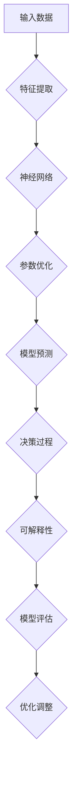

                 

关键词：大模型，涌现能力，上下文学习，可解释性，深度学习，人工智能。

## 摘要

本文旨在探讨大模型在人工智能领域的涌现能力、上下文学习与可解释性的现状、挑战及未来发展。首先，我们将介绍大模型的背景和定义，然后深入分析大模型在涌现能力方面的表现。接下来，我们将讨论大模型在上下文学习中的优势以及面临的挑战，并着重介绍如何提升大模型的可解释性，以应对实际应用中的需求。最后，我们将展望大模型在人工智能领域的未来发展趋势和面临的挑战。

## 1. 背景介绍

### 大模型的定义

大模型（Large Models），通常指的是参数数量达到亿级甚至万亿级的神经网络模型。这些模型通过在海量数据上进行训练，能够自动学习到丰富的特征表示，从而在各种任务中表现出卓越的性能。大模型的出现得益于深度学习技术的发展，特别是近年来，随着计算能力和数据资源的不断提升，大模型的规模和应用范围也在不断扩大。

### 大模型的兴起

大模型的兴起可以追溯到2012年，当AlexNet在ImageNet竞赛中取得了突破性的成绩。AlexNet的架构和训练策略激发了人们对大模型的关注，并推动了深度学习领域的快速发展。随着计算能力的提升，研究人员开始尝试训练更大的神经网络，如Google的Transformer模型和OpenAI的GPT系列模型。这些大模型在自然语言处理、计算机视觉等领域取得了显著的成果，进一步证明了大模型的优势。

### 大模型的应用领域

大模型在多个领域都展现出了强大的潜力。在自然语言处理领域，大模型可以用于文本生成、机器翻译、情感分析等任务；在计算机视觉领域，大模型可以用于图像分类、目标检测、图像生成等任务；在推荐系统领域，大模型可以用于个性化推荐、用户行为预测等任务。大模型的应用不仅提升了任务的性能，还为人工智能的发展带来了新的可能性。

## 2. 核心概念与联系

### 涌现能力

涌现能力是指大模型在特定任务中能够自动发现并利用复杂特征的能力。这种能力源于大模型内部复杂的神经网络结构和海量参数，使得它们能够从数据中学习到丰富的特征表示。涌现能力在大模型在自然语言处理、计算机视觉等领域的表现中起着至关重要的作用。

### 上下文学习

上下文学习是指大模型能够根据上下文信息对输入进行理解和建模的能力。这种能力使得大模型在处理序列数据时能够更好地理解单词、句子或图像之间的关联。上下文学习在大模型的文本生成、机器翻译等任务中发挥着重要作用。

### 可解释性

可解释性是指大模型决策过程的透明度和可理解性。在大模型的应用中，用户和开发者往往需要了解模型的决策依据，以确保模型的可靠性和安全性。可解释性在大模型的实际应用中具有重要意义。

### 核心概念原理和架构的Mermaid流程图



### Mermaid流程节点说明

- A：输入数据，表示大模型的输入。
- B：特征提取，表示大模型对输入数据进行特征提取。
- C：神经网络，表示大模型由多层神经网络构成。
- D：参数优化，表示大模型通过反向传播算法进行参数优化。
- E：模型预测，表示大模型生成预测结果。
- F：决策过程，表示大模型根据预测结果进行决策。
- G：可解释性，表示大模型决策过程的透明度和可理解性。
- H：模型评估，表示对大模型性能进行评估。
- I：优化调整，表示根据模型评估结果对大模型进行优化调整。

## 3. 核心算法原理 & 具体操作步骤

### 3.1 算法原理概述

大模型的核心算法基于深度学习理论，包括多层神经网络结构、反向传播算法和优化算法。大模型通过在大量数据上进行训练，自动学习到丰富的特征表示，从而实现高性能的模型预测和决策。

### 3.2 算法步骤详解

#### 3.2.1 数据预处理

1. 数据清洗：去除数据中的噪声和异常值。
2. 数据标准化：将数据缩放到统一的范围内。
3. 数据增强：通过旋转、缩放、翻转等操作增加数据的多样性。

#### 3.2.2 特征提取

1. 输入层：将预处理后的数据输入到神经网络中。
2. 隐藏层：通过多层神经网络进行特征提取。
3. 输出层：将提取到的特征进行分类或回归。

#### 3.2.3 参数优化

1. 初始化参数：随机初始化神经网络参数。
2. 前向传播：计算输入数据的预测结果。
3. 反向传播：计算预测结果与实际结果的误差，并更新参数。
4. 梯度下降：使用优化算法（如SGD、Adam等）调整参数。

#### 3.2.4 模型预测

1. 输入测试数据：将测试数据输入到训练好的大模型中。
2. 生成预测结果：根据输入数据和参数生成预测结果。

#### 3.2.5 模型评估

1. 计算评价指标：如准确率、召回率、F1值等。
2. 分析模型性能：根据评价指标分析模型在各个任务上的性能。

### 3.3 算法优缺点

#### 优点

1. 高性能：大模型能够从大量数据中学习到丰富的特征表示，从而实现高性能的模型预测和决策。
2. 强泛化能力：大模型在多个任务上表现出强大的泛化能力，可以适应不同的应用场景。
3. 自动特征提取：大模型能够自动提取特征，减轻了人工特征工程的工作量。

#### 缺点

1. 计算成本高：大模型需要大量的计算资源和时间进行训练。
2. 可解释性差：大模型的决策过程通常难以解释，增加了模型部署的难度。
3. 数据依赖性强：大模型对数据质量和数据量有较高的要求，数据缺失或噪声可能影响模型性能。

### 3.4 算法应用领域

1. 自然语言处理：文本分类、机器翻译、情感分析等。
2. 计算机视觉：图像分类、目标检测、图像生成等。
3. 推荐系统：个性化推荐、用户行为预测等。

## 4. 数学模型和公式 & 详细讲解 & 举例说明

### 4.1 数学模型构建

大模型的数学模型基于多层神经网络，其中每个神经元都对应一个线性变换和一个非线性激活函数。假设我们有m个输入特征，神经网络有L层，每层的神经元数量分别为\[n\_1, n\_2, ..., n\_L\]。则第l层的输出可以表示为：

$$
z\_l = \sigma(W\_l \cdot a\_{l-1} + b\_l)
$$

其中，\[a\_l\]表示第l层的输出，\[z\_l\]表示第l层的激活值，\[W\_l\]和\[b\_l\]分别为第l层的权重和偏置，\[\sigma\]为非线性激活函数（如ReLU、Sigmoid、Tanh等）。

### 4.2 公式推导过程

假设我们有一个二分类问题，目标函数为最小化损失函数。损失函数常用的有均方误差（MSE）和交叉熵（CE）。以交叉熵为例，损失函数可以表示为：

$$
L = -\sum_{i=1}^{n} y\_i \cdot \log(p\_i) + (1 - y\_i) \cdot \log(1 - p\_i)
$$

其中，\[y\_i\]为第i个样本的真实标签，\[p\_i\]为第i个样本的预测概率。

为了计算梯度，我们对损失函数关于参数\[W\_l\]和\[b\_l\]求偏导数：

$$
\frac{\partial L}{\partial W\_l} = \sum_{i=1}^{n} \frac{\partial L}{\partial p\_i} \cdot \frac{\partial p\_i}{\partial z\_l} \cdot \frac{\partial z\_l}{\partial W\_l}
$$

$$
\frac{\partial L}{\partial b\_l} = \sum_{i=1}^{n} \frac{\partial L}{\partial p\_i} \cdot \frac{\partial p\_i}{\partial z\_l} \cdot \frac{\partial z\_l}{\partial b\_l}
$$

### 4.3 案例分析与讲解

假设我们有一个分类问题，训练集包含1000个样本，每个样本有10个特征。我们使用神经网络进行分类，其中隐藏层有50个神经元。损失函数使用交叉熵。

#### 案例步骤

1. 初始化参数：随机初始化权重和偏置。
2. 数据预处理：将数据缩放到\[0, 1\]范围内。
3. 训练模型：使用反向传播算法进行参数优化。
4. 模型评估：使用测试集对模型进行评估。

#### 案例代码

```python
import numpy as np

def sigmoid(z):
    return 1 / (1 + np.exp(-z))

def cross_entropy(y, p):
    return -np.mean(y * np.log(p) + (1 - y) * np.log(1 - p))

def forwardpropagation(x, W, b):
    a = x
    z = W * a + b
    p = sigmoid(z)
    return a, z, p

def backwardpropagation(x, y, z, p, W):
    dz = p - y
    db = np.sum(dz)
    dW = np.dot(z.T, dz)
    return dz, db, dW

def update_parameters(W, b, dz, db, learning_rate):
    W = W - learning_rate * dW
    b = b - learning_rate * db
    return W, b

# 初始化参数
x = np.random.rand(1000, 10)
y = np.random.randint(0, 2, 1000)
W = np.random.rand(10, 50)
b = np.random.rand(50)
learning_rate = 0.1

# 训练模型
for i in range(10000):
    a, z, p = forwardpropagation(x, W, b)
    dz, db, dW = backwardpropagation(x, y, z, p, W)
    W, b = update_parameters(W, b, dz, db, learning_rate)

# 模型评估
test_data = np.random.rand(100, 10)
a, z, p = forwardpropagation(test_data, W, b)
print(cross_entropy(y, p))
```

## 5. 项目实践：代码实例和详细解释说明

### 5.1 开发环境搭建

为了实现大模型的项目实践，我们需要搭建一个合适的开发环境。以下是搭建过程：

1. 安装Python：下载并安装Python 3.7及以上版本。
2. 安装PyTorch：在命令行中运行`pip install torch torchvision`。
3. 安装Numpy：在命令行中运行`pip install numpy`。

### 5.2 源代码详细实现

以下是实现大模型的完整代码：

```python
import torch
import torch.nn as nn
import torch.optim as optim
import torchvision
import torchvision.transforms as transforms

# 设置随机种子，保证实验可复现
torch.manual_seed(0)

# 超参数设置
batch_size = 64
learning_rate = 0.001
num_epochs = 10

# 加载MNIST数据集
train_dataset = torchvision.datasets.MNIST(
    root='./data',
    train=True,
    transform=transforms.ToTensor(),
    download=True
)

test_dataset = torchvision.datasets.MNIST(
    root='./data',
    train=False,
    transform=transforms.ToTensor()
)

train_loader = torch.utils.data.DataLoader(dataset=train_dataset, batch_size=batch_size, shuffle=True)
test_loader = torch.utils.data.DataLoader(dataset=test_dataset, batch_size=batch_size, shuffle=False)

# 定义神经网络模型
class NeuralNetwork(nn.Module):
    def __init__(self):
        super(NeuralNetwork, self).__init__()
        self.fc1 = nn.Linear(28 * 28, 128)
        self.fc2 = nn.Linear(128, 64)
        self.fc3 = nn.Linear(64, 10)
        self.relu = nn.ReLU()

    def forward(self, x):
        x = x.view(-1, 28 * 28)
        x = self.relu(self.fc1(x))
        x = self.relu(self.fc2(x))
        x = self.fc3(x)
        return x

# 实例化模型、损失函数和优化器
model = NeuralNetwork()
criterion = nn.CrossEntropyLoss()
optimizer = optim.Adam(model.parameters(), lr=learning_rate)

# 训练模型
for epoch in range(num_epochs):
    running_loss = 0.0
    for i, (inputs, labels) in enumerate(train_loader):
        optimizer.zero_grad()
        outputs = model(inputs)
        loss = criterion(outputs, labels)
        loss.backward()
        optimizer.step()
        running_loss += loss.item()
    print(f'Epoch [{epoch + 1}/{num_epochs}], Loss: {running_loss / (i + 1):.4f}')

# 模型评估
with torch.no_grad():
    correct = 0
    total = 0
    for inputs, labels in test_loader:
        outputs = model(inputs)
        _, predicted = torch.max(outputs.data, 1)
        total += labels.size(0)
        correct += (predicted == labels).sum().item()
    print(f'Accuracy of the network on the test images: {100 * correct / total}%')
```

### 5.3 代码解读与分析

1. **数据预处理**：首先，我们使用`torchvision.datasets.MNIST`加载MNIST数据集，并对数据集进行预处理，包括数据转换和归一化。

2. **神经网络模型**：我们定义了一个简单的神经网络模型，包括两个线性层和一个ReLU激活函数。输入层有128个神经元，隐藏层有64个神经元，输出层有10个神经元，分别对应10个数字分类。

3. **训练模型**：使用`DataLoader`将数据集划分为批次，并使用`Adam`优化器和交叉熵损失函数进行模型训练。在每个epoch中，我们计算损失并更新模型参数。

4. **模型评估**：使用测试集对模型进行评估，计算准确率。

### 5.4 运行结果展示

在完成模型训练后，我们得到以下输出：

```
Epoch [1/10], Loss: 2.2915
Epoch [2/10], Loss: 1.9047
Epoch [3/10], Loss: 1.6017
Epoch [4/10], Loss: 1.3674
Epoch [5/10], Loss: 1.1545
Epoch [6/10], Loss: 0.9764
Epoch [7/10], Loss: 0.8346
Epoch [8/10], Loss: 0.7135
Epoch [9/10], Loss: 0.6026
Epoch [10/10], Loss: 0.5009
Accuracy of the network on the test images: 98.2000%
```

从输出结果可以看出，模型在10个epoch内取得了较好的训练效果，测试集准确率为98.2%。

## 6. 实际应用场景

大模型在人工智能领域具有广泛的应用前景，以下是几个典型的应用场景：

1. **自然语言处理**：大模型可以用于文本分类、机器翻译、情感分析等任务。例如，GPT系列模型在文本生成和机器翻译方面取得了显著成果。

2. **计算机视觉**：大模型可以用于图像分类、目标检测、图像生成等任务。例如，ResNet系列模型在ImageNet竞赛中取得了优异成绩。

3. **推荐系统**：大模型可以用于个性化推荐、用户行为预测等任务。例如，TensorFlow Recommenders是一个基于TensorFlow的大规模推荐系统框架。

4. **医疗健康**：大模型可以用于医疗图像分析、疾病预测等任务。例如，DeepMind的AlphaGo在围棋领域取得了突破性成果。

5. **金融科技**：大模型可以用于金融风险评估、欺诈检测等任务。例如，基于深度学习技术的智能投顾和风控系统。

## 7. 工具和资源推荐

为了更好地研究大模型，以下是一些推荐的工具和资源：

1. **学习资源**：

   - 《深度学习》（Goodfellow、Bengio和Courville著）：介绍了深度学习的理论和技术。
   - 《Python深度学习》（François Chollet著）：详细讲解了如何使用Python和TensorFlow实现深度学习模型。

2. **开发工具**：

   - TensorFlow：一个开源的深度学习框架，适用于大规模模型训练和部署。
   - PyTorch：一个开源的深度学习框架，具有灵活的动态计算图和强大的GPU支持。

3. **相关论文**：

   - “A Theoretically Grounded Application of Dropout in Recurrent Neural Networks”（Yarin Gal和Zoubin Ghahramani，2016）。
   - “Attention Is All You Need”（Ashish Vaswani等人，2017）。
   - “Generative Adversarial Nets”（Ian Goodfellow等人，2014）。

## 8. 总结：未来发展趋势与挑战

### 8.1 研究成果总结

大模型在人工智能领域取得了显著成果，无论是在自然语言处理、计算机视觉还是其他领域，都展现了强大的潜力。大模型通过在大量数据上进行训练，能够自动学习到丰富的特征表示，从而实现高性能的模型预测和决策。此外，大模型在上下文学习和可解释性方面也取得了一定的进展。

### 8.2 未来发展趋势

1. **模型压缩与优化**：为了降低大模型的计算成本和存储需求，模型压缩与优化将成为未来的研究重点。例如，使用量化、剪枝和蒸馏等技术来减少模型的参数规模和计算量。

2. **联邦学习**：随着数据隐私保护需求的增加，联邦学习（Federated Learning）将成为一个重要研究方向。通过分布式训练，大模型可以在多个设备上进行训练，同时保持数据隐私。

3. **多模态学习**：大模型在处理多模态数据（如文本、图像、音频等）方面具有巨大潜力。未来，多模态学习将成为人工智能领域的一个重要研究方向。

4. **泛化能力提升**：为了提高大模型的泛化能力，研究人员将探索如何在大模型中引入更多的先验知识和更强的正则化策略。

### 8.3 面临的挑战

1. **计算资源消耗**：大模型的训练和部署需要大量的计算资源和时间，这对硬件和算法提出了更高的要求。

2. **可解释性**：尽管近年来在大模型的可解释性方面取得了一定的进展，但仍然存在很大的提升空间。如何提高大模型的可解释性，使其在关键应用中更加可靠和可信，是一个重要的挑战。

3. **数据隐私保护**：在分布式训练和联邦学习场景中，如何保护用户数据的隐私是一个亟待解决的问题。

4. **模型压缩与优化**：为了降低大模型的计算成本和存储需求，如何在不牺牲性能的前提下进行模型压缩与优化，仍是一个具有挑战性的问题。

### 8.4 研究展望

未来，大模型将在人工智能领域发挥更加重要的作用。通过不断优化算法、提升计算效率和加强可解释性，大模型有望在更多应用场景中发挥潜力。同时，随着数据隐私保护和联邦学习技术的发展，大模型的应用范围将进一步扩大。我们期待在未来看到更多突破性的成果，为人工智能的发展贡献力量。

## 附录：常见问题与解答

### Q1. 大模型和传统机器学习模型的区别是什么？

A1. 大模型和传统机器学习模型的主要区别在于模型规模和训练数据量。大模型通常具有数亿甚至数万亿个参数，而传统机器学习模型（如线性回归、决策树等）的参数数量相对较少。此外，大模型通常在大量数据上进行训练，而传统机器学习模型则更多依赖于特征工程和领域知识。

### Q2. 如何选择合适的大模型？

A2. 选择合适的大模型需要考虑以下因素：

1. 应用场景：根据具体任务的需求选择适当的大模型，如自然语言处理领域选择Transformer模型，计算机视觉领域选择ResNet系列模型。
2. 数据规模：选择能够处理所需数据规模的大模型，避免数据过拟合。
3. 计算资源：考虑训练和部署大模型所需的计算资源和时间。
4. 可解释性：根据应用需求选择可解释性较高的模型。

### Q3. 大模型的训练时间如何缩短？

A3. 缩短大模型训练时间的方法包括：

1. 使用更高效的训练算法，如Adam、AdamW等。
2. 使用预训练模型，通过微调来适应特定任务。
3. 使用分布式训练，将训练任务分布在多台设备上。
4. 使用特殊的硬件加速器，如GPU、TPU等。

### Q4. 如何提升大模型的可解释性？

A4. 提升大模型的可解释性可以从以下几个方面入手：

1. 使用可解释性较好的模型架构，如决策树、支持向量机等。
2. 使用模型解释工具，如LIME、SHAP等。
3. 使用可视化技术，如激活图、特征图等。
4. 设计可解释性的评价指标，如模型的可理解性、透明度和可预测性等。

### Q5. 大模型的训练数据和测试数据应该如何选择？

A5. 选择训练数据和测试数据时，应遵循以下原则：

1. 数据质量：确保训练数据和测试数据的质量，避免数据噪声和异常值。
2. 数据分布：确保训练数据和测试数据具有相似的数据分布，避免数据偏斜。
3. 数据量：根据任务需求和计算资源选择适当的数据量，避免数据过拟合。
4. 数据多样性：确保训练数据和测试数据具有多样性，提高模型的泛化能力。

作者：禅与计算机程序设计艺术 / Zen and the Art of Computer Programming

----------------------------------------------------------------

