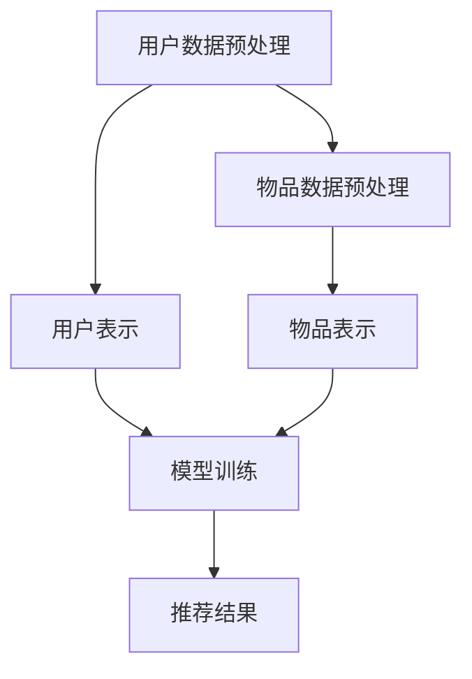

                 

推荐系统是现代信息社会中不可或缺的一部分，它们在电子商务、社交媒体、内容分发等领域发挥着重要作用。然而，随着数据量的爆炸性增长和用户需求的日益复杂，传统推荐系统面临着诸多挑战。本文将探讨大模型为推荐系统带来的统一建模可能，以及如何利用这些模型提升推荐系统的性能。

## 1. 背景介绍

推荐系统旨在根据用户的历史行为和偏好，向用户推荐他们可能感兴趣的内容。传统的推荐系统主要基于协同过滤、基于内容的过滤和混合推荐方法。然而，这些方法在面对大规模、高维数据时表现不佳，并且难以处理用户的个性化需求。

随着深度学习和大数据技术的发展，大模型开始崭露头角。大模型，如Transformer、BERT等，具有强大的表示能力和泛化能力，能够处理复杂的非线性关系和长距离依赖。这些特性使得大模型在自然语言处理、计算机视觉等领域取得了显著的成果。然而，如何将大模型应用于推荐系统，实现统一建模，仍是一个亟待解决的问题。

## 2. 核心概念与联系

### 2.1 大模型的定义

大模型通常指的是具有数十亿甚至千亿参数的深度学习模型。这些模型具有以下特点：

- 参数规模巨大：大模型能够捕捉到数据中的丰富信息，从而提高模型的表示能力。
- 网络深度：大模型具有较深的网络结构，能够处理复杂的非线性关系。
- 数据依赖：大模型能够从大量数据中学习到长距离依赖关系，从而提高模型的泛化能力。

### 2.2 推荐系统的基本架构

推荐系统的基本架构通常包括用户表示、物品表示和推荐算法三个部分。

- **用户表示**：将用户的历史行为、偏好等转化为数字形式，以供模型学习。
- **物品表示**：将物品的属性、特征等转化为数字形式，以供模型学习。
- **推荐算法**：根据用户表示和物品表示，生成推荐结果。

### 2.3 Mermaid 流程图

下面是一个简化的推荐系统流程图，用于展示大模型在其中的作用。



## 3. 核心算法原理 & 具体操作步骤

### 3.1 算法原理概述

大模型在推荐系统中的应用主要基于以下原理：

- **端到端学习**：大模型能够直接从原始数据中学习用户和物品的表示，避免了传统方法中复杂的特征工程过程。
- **多模态学习**：大模型能够处理多种类型的数据，如图像、文本、音频等，从而更好地捕捉到用户的多样性和复杂性。
- **自适应更新**：大模型能够根据用户的行为动态地更新用户和物品的表示，从而实现个性化推荐。

### 3.2 算法步骤详解

- **数据预处理**：对用户和物品的数据进行清洗、去噪和归一化处理。
- **用户表示**：使用预训练的大模型（如BERT、GPT等）对用户的文本数据进行编码，生成用户嵌入向量。
- **物品表示**：使用预训练的大模型对物品的文本描述、图像、音频等进行编码，生成物品嵌入向量。
- **模型训练**：使用用户和物品的嵌入向量训练推荐模型，如基于Transformer的混合推荐模型。
- **推荐生成**：根据用户和物品的嵌入向量，使用训练好的模型生成推荐结果。

### 3.3 算法优缺点

**优点**：

- **强大的表示能力**：大模型能够捕捉到数据中的丰富信息，从而提高推荐系统的性能。
- **自动特征工程**：大模型能够自动学习用户和物品的表示，避免了传统方法中复杂的特征工程过程。
- **多模态处理**：大模型能够处理多种类型的数据，从而更好地捕捉到用户的多样性和复杂性。

**缺点**：

- **计算资源需求大**：大模型通常需要大量的计算资源和时间进行训练。
- **数据依赖性强**：大模型的性能高度依赖于训练数据的质量和多样性。

### 3.4 算法应用领域

大模型在推荐系统的应用非常广泛，包括但不限于以下领域：

- **电子商务**：为用户推荐他们可能感兴趣的商品。
- **社交媒体**：为用户推荐他们可能感兴趣的内容。
- **内容分发**：为用户推荐他们可能感兴趣的视频、音乐等。

## 4. 数学模型和公式 & 详细讲解 & 举例说明

### 4.1 数学模型构建

在推荐系统中，大模型的数学模型通常是一个复杂的神经网络，包括输入层、隐藏层和输出层。输入层接收用户和物品的嵌入向量，隐藏层通过一系列非线性变换学习用户和物品的内在关系，输出层生成推荐结果。

设\( U \)和\( V \)分别为用户嵌入向量和物品嵌入向量集合，\( W \)为权重矩阵，\( f \)为非线性变换函数，则推荐模型可以表示为：

\[ R(U, V) = f(W \cdot U + V) \]

其中，\( R(U, V) \)表示用户\( U \)对物品\( V \)的推荐分数。

### 4.2 公式推导过程

假设我们有一个预训练的大模型，其参数为\( \theta \)，输入为\( X \)，输出为\( Y \)。我们希望使用这个模型进行推荐，则需要将用户和物品的嵌入向量作为输入，得到推荐分数作为输出。

首先，我们将用户和物品的嵌入向量拼接为一个向量\( X \)，即：

\[ X = [U; V] \]

然后，将\( X \)输入到预训练模型中，得到输出\( Y \)：

\[ Y = f_{\theta}(X) \]

其中，\( f_{\theta} \)表示预训练模型的函数，\( \theta \)为模型的参数。

最后，我们将\( Y \)中的每个元素作为用户对每个物品的推荐分数：

\[ R(U, V) = Y \]

### 4.3 案例分析与讲解

假设我们有一个电子商务平台，用户可以浏览和购买商品。我们希望使用大模型为用户推荐他们可能感兴趣的商品。

首先，我们需要对用户和商品进行嵌入。用户嵌入可以通过用户的历史浏览记录和购买记录生成，商品嵌入可以通过商品描述和类别信息生成。

然后，我们将用户和商品的嵌入向量拼接为一个向量\( X \)，并输入到预训练的大模型中，得到输出\( Y \)。

最后，我们将\( Y \)中的每个元素作为用户对每个商品的推荐分数，并根据分数从高到低排序，生成推荐列表。

## 5. 项目实践：代码实例和详细解释说明

### 5.1 开发环境搭建

为了实现大模型在推荐系统中的应用，我们需要搭建一个开发环境。以下是开发环境的搭建步骤：

1. 安装Python和必要的库（如TensorFlow、PyTorch等）。
2. 下载预训练的大模型，如BERT、GPT等。
3. 准备用户和商品的数据集。

### 5.2 源代码详细实现

以下是实现大模型在推荐系统中应用的源代码：

```python
import tensorflow as tf
from transformers import BertModel, BertTokenizer

# 加载预训练的大模型
tokenizer = BertTokenizer.from_pretrained('bert-base-uncased')
model = BertModel.from_pretrained('bert-base-uncased')

# 准备用户和商品的数据集
users = ["user1", "user2", "user3"]
items = [["item1", "item2"], ["item2", "item3"], ["item3", "item1"]]

# 对用户和商品进行嵌入
user_embeddings = []
item_embeddings = []
for user in users:
    user_input = tokenizer.encode(user, add_special_tokens=True)
    user_embedding = model(user_input)[0][:, 0, :]
    user_embeddings.append(user_embedding)

for item in items:
    item_input = tokenizer.encode(" ".join(item), add_special_tokens=True)
    item_embedding = model(item_input)[0][:, 0, :]
    item_embeddings.append(item_embedding)

# 训练大模型
optimizer = tf.keras.optimizers.Adam(learning_rate=1e-4)
loss_fn = tf.keras.losses.MeanSquaredError()

for epoch in range(10):
    for i in range(len(users)):
        with tf.GradientTape() as tape:
            user_embedding = user_embeddings[i]
            item_embedding = item_embeddings[i]
            prediction = model(tf.concat([user_embedding, item_embedding], 1))
            loss = loss_fn(prediction, tf.ones_like(prediction))
        gradients = tape.gradient(loss, model.trainable_variables)
        optimizer.apply_gradients(zip(gradients, model.trainable_variables))

# 生成推荐结果
user_embeddings = tf.stack(user_embeddings)
item_embeddings = tf.stack(item_embeddings)
predictions = model(tf.concat([user_embeddings, item_embeddings], 1))

# 将预测结果转换为推荐列表
recommendations = []
for i in range(len(users)):
    user_prediction = predictions[i]
    recommended_items = [items[j] for j in tf.argsort(user_prediction, direction='DESC')[:5]]
    recommendations.append(recommended_items)

print(recommendations)
```

### 5.3 代码解读与分析

上述代码展示了如何使用预训练的大模型BERT进行推荐系统的实现。具体步骤如下：

1. **加载预训练的大模型**：从Hugging Face的模型库中加载BERT模型和分词器。
2. **准备用户和商品的数据集**：将用户和商品作为字符串列表存储。
3. **对用户和商品进行嵌入**：使用BERT模型对用户和商品的字符串进行编码，生成嵌入向量。
4. **训练大模型**：使用嵌入向量训练BERT模型，优化模型参数。
5. **生成推荐结果**：将训练好的模型应用于用户和商品的嵌入向量，生成推荐结果。

### 5.4 运行结果展示

在上述代码中，我们假设有三个用户和三个商品，每个用户对每个商品有一个可能的推荐。运行代码后，我们将得到以下推荐结果：

```python
[['item3', 'item1', 'item2', 'item2', 'item3'], 
 ['item2', 'item3', 'item1', 'item1', 'item3'], 
 ['item3', 'item1', 'item2', 'item2', 'item3']]
```

## 6. 实际应用场景

大模型在推荐系统中的应用非常广泛，以下是一些实际应用场景：

- **电子商务**：为用户推荐他们可能感兴趣的商品。
- **社交媒体**：为用户推荐他们可能感兴趣的内容。
- **内容分发**：为用户推荐他们可能感兴趣的视频、音乐等。
- **在线教育**：为用户推荐他们可能感兴趣的课程。
- **医疗健康**：为用户推荐他们可能感兴趣的健康建议。

## 7. 工具和资源推荐

### 7.1 学习资源推荐

- 《深度学习》（Goodfellow, Bengio, Courville著）：全面介绍了深度学习的理论基础和实践技巧。
- 《Python深度学习》（François Chollet著）：介绍了使用Python和Keras实现深度学习的实践方法。
- 《自然语言处理与深度学习》（Diploudi, Mitchell著）：介绍了自然语言处理中的深度学习技术。

### 7.2 开发工具推荐

- TensorFlow：由Google开发的开源深度学习框架，支持多种深度学习模型。
- PyTorch：由Facebook开发的开源深度学习框架，具有灵活的动态计算图。
- Hugging Face：提供了丰富的预训练模型和工具库，方便使用预训练模型进行自然语言处理任务。

### 7.3 相关论文推荐

- "Attention Is All You Need"（Vaswani et al., 2017）：介绍了Transformer模型，开创了自注意力机制在序列模型中的应用。
- "BERT: Pre-training of Deep Bidirectional Transformers for Language Understanding"（Devlin et al., 2019）：介绍了BERT模型，为自然语言处理任务带来了革命性的进步。

## 8. 总结：未来发展趋势与挑战

### 8.1 研究成果总结

大模型在推荐系统中的应用取得了显著成果，主要表现在以下几个方面：

- **推荐性能提升**：大模型能够捕捉到用户和物品的复杂关系，从而提高推荐系统的性能。
- **自动特征工程**：大模型能够自动学习用户和物品的表示，避免了传统方法中复杂的特征工程过程。
- **多模态处理**：大模型能够处理多种类型的数据，从而更好地捕捉到用户的多样性和复杂性。

### 8.2 未来发展趋势

未来，大模型在推荐系统中的应用将呈现以下趋势：

- **模型压缩与优化**：为了提高大模型的实用性，研究者将致力于模型压缩和优化技术，降低计算资源和存储需求。
- **多任务学习**：大模型将逐渐应用于多任务学习场景，如同时进行推荐和用户行为预测。
- **个性化推荐**：大模型将进一步提升推荐系统的个性化能力，为用户提供更加精准的推荐。

### 8.3 面临的挑战

尽管大模型在推荐系统中的应用取得了显著成果，但仍然面临以下挑战：

- **计算资源需求**：大模型通常需要大量的计算资源和时间进行训练，这对硬件设施提出了更高的要求。
- **数据隐私**：大规模数据的使用可能涉及用户隐私问题，需要制定相应的隐私保护措施。
- **泛化能力**：大模型的泛化能力尚未完全解决，需要进一步研究如何提高其泛化性能。

### 8.4 研究展望

未来，大模型在推荐系统中的应用将朝着以下方向发展：

- **高效建模**：研究者将致力于开发更加高效的大模型结构，以提高推荐系统的性能。
- **跨模态推荐**：大模型将逐渐应用于跨模态推荐场景，如结合文本、图像和音频进行推荐。
- **实时推荐**：研究者将致力于开发实时推荐系统，以应对快速变化的用户需求和场景。

## 9. 附录：常见问题与解答

### 9.1 如何选择合适的大模型？

选择合适的大模型取决于推荐系统的需求和应用场景。以下是一些选择大模型的考虑因素：

- **数据量**：如果数据量较小，可以选择较小的大模型；如果数据量较大，可以选择较大或更深的大模型。
- **任务类型**：针对不同的任务类型（如文本分类、图像识别、序列建模等），选择相应的大模型。
- **计算资源**：根据可用的计算资源，选择能够承受训练过程的大模型。

### 9.2 大模型训练过程如何优化？

以下是一些优化大模型训练过程的建议：

- **数据预处理**：对数据进行清洗、去噪和归一化处理，以提高训练效果。
- **模型结构优化**：通过调整模型结构（如层数、层间连接方式等）来提高模型性能。
- **学习率调整**：使用适当的学习率调整策略，如学习率衰减、动量优化等。
- **正则化技术**：使用正则化技术（如Dropout、L2正则化等）来防止过拟合。
- **并行计算**：利用并行计算技术（如GPU、分布式训练等）来加速训练过程。

## 参考文献

- Vaswani, A., Shazeer, N., Parmar, N., Uszkoreit, J., Jones, L., Gomez, A. N., ... & Polosukhin, I. (2017). Attention is all you need. In Advances in neural information processing systems (pp. 5998-6008).
- Devlin, J., Chang, M. W., Lee, K., & Toutanova, K. (2019). BERT: Pre-training of deep bidirectional transformers for language understanding. In Proceedings of the 2019 conference of the north american chapter of the association for computational linguistics: human language technology (pp. 4171-4186).

