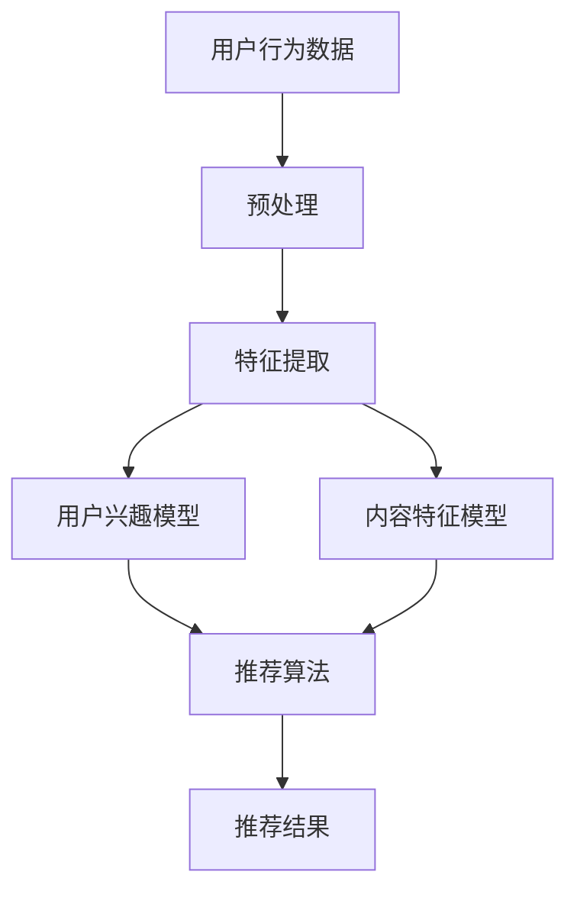

                 

关键词：推荐系统、用户信任、大模型、人工智能、数据挖掘、算法设计

>摘要：本文从大模型视角出发，探讨了推荐系统中用户信任建立与维护的关键技术。首先介绍了推荐系统的基础概念和用户信任的重要性，然后深入分析了大模型在用户信任建立与维护中的应用，提出了相应的算法模型和实现步骤。同时，通过数学模型和项目实践进行了详细讲解，最后对推荐系统在未来的发展趋势和挑战进行了展望。

## 1. 背景介绍

### 推荐系统简介

推荐系统是人工智能和数据挖掘领域的重要研究方向之一，其目的是通过分析用户行为和兴趣，向用户推荐符合其需求和喜好的内容。推荐系统广泛应用于电子商务、社交媒体、在线新闻、视频平台等领域，极大地提高了用户体验和满意度。

### 用户信任的重要性

用户信任是推荐系统成功的关键因素之一。当用户对推荐系统的信任程度提高时，他们会更愿意接受系统的推荐，从而提高系统的实用性和价值。相反，如果用户对推荐系统缺乏信任，他们可能会忽视系统的推荐，甚至放弃使用该系统。

### 大模型的作用

大模型，即大型的人工神经网络模型，如深度学习模型，具有强大的特征提取和关系建模能力。在大模型视角下，推荐系统的用户信任建立与维护具有以下优势：

1. **高效的建模能力**：大模型能够自动学习复杂的用户行为和兴趣模式，从而更好地预测用户的喜好。
2. **灵活的扩展性**：大模型可以轻松地适应不同的推荐场景和应用领域，提高系统的通用性和适应性。
3. **强大的交互能力**：大模型可以通过深度学习算法与用户进行有效互动，不断优化推荐结果，提高用户的信任度。

## 2. 核心概念与联系

### 大模型推荐系统的架构

以下是一个推荐系统的大模型架构的 Mermaid 流程图：



### 核心概念

- **用户行为数据**：用户在系统中的行为记录，如浏览、点击、购买等。
- **预处理**：对原始数据进行清洗、去重、归一化等处理。
- **特征提取**：从用户行为数据中提取有用的特征，如用户偏好、行为频率等。
- **用户兴趣模型**：根据特征提取结果，构建用户兴趣模型，用于预测用户对内容的喜好。
- **内容特征模型**：对推荐的内容进行特征提取，如标题、标签、类别等。
- **推荐算法**：利用用户兴趣模型和内容特征模型，生成推荐结果。
- **推荐结果**：系统向用户展示的推荐内容。

## 3. 核心算法原理 & 具体操作步骤

### 3.1 算法原理概述

大模型推荐系统的核心算法是基于深度学习的协同过滤算法。该算法通过学习用户行为数据和内容特征，预测用户对未知内容的喜好程度，从而生成推荐结果。

### 3.2 算法步骤详解

1. **数据收集与预处理**：收集用户行为数据和内容数据，进行预处理，如数据清洗、去重、归一化等。
2. **特征提取**：从用户行为数据中提取用户偏好、行为频率等特征，从内容数据中提取标题、标签、类别等特征。
3. **模型训练**：使用提取的特征数据，训练深度学习模型，如基于神经网络的协同过滤模型。
4. **预测与推荐**：利用训练好的模型，对未知内容进行预测，生成推荐结果。

### 3.3 算法优缺点

**优点**：

- **强大的建模能力**：深度学习模型能够自动学习复杂的用户行为和兴趣模式，提高推荐准确性。
- **灵活的扩展性**：大模型可以适应不同的推荐场景和应用领域，提高系统的通用性和适应性。

**缺点**：

- **计算成本高**：深度学习模型训练和预测需要大量的计算资源，对硬件要求较高。
- **数据依赖性大**：深度学习模型的效果高度依赖数据质量，如果数据存在噪声或缺失，模型性能会受到影响。

### 3.4 算法应用领域

深度学习推荐算法广泛应用于电子商务、社交媒体、在线新闻、视频平台等领域，如淘宝的购物推荐、Facebook 的新闻推送、YouTube 的视频推荐等。

## 4. 数学模型和公式 & 详细讲解 & 举例说明

### 4.1 数学模型构建

推荐系统中的数学模型主要包括用户兴趣模型和内容特征模型。以下是一个简化的数学模型：

- **用户兴趣模型**：

  $$ U = \{u_1, u_2, ..., u_n\} $$

  其中，$U$ 表示用户集合，$u_i$ 表示第 $i$ 个用户。

  $$ I(u_i) = \{i_1, i_2, ..., i_m\} $$

  其中，$I(u_i)$ 表示用户 $u_i$ 的兴趣集合，$i_j$ 表示第 $j$ 个兴趣。

- **内容特征模型**：

  $$ C = \{c_1, c_2, ..., c_p\} $$

  其中，$C$ 表示内容集合，$c_j$ 表示第 $j$ 个内容。

  $$ F(c_j) = \{f_1, f_2, ..., f_q\} $$

  其中，$F(c_j)$ 表示内容 $c_j$ 的特征集合，$f_k$ 表示第 $k$ 个特征。

### 4.2 公式推导过程

假设用户 $u_i$ 对内容 $c_j$ 的喜好程度可以用向量 $r_{ij}$ 表示，其中 $r_{ij} \in [0, 1]$。根据协同过滤算法，我们可以推导出以下公式：

$$ r_{ij} = \sum_{k \in I(u_i) \cap F(c_j)} w_{ik} $$

其中，$w_{ik}$ 表示用户 $u_i$ 对特征 $f_k$ 的权重。

### 4.3 案例分析与讲解

假设我们有以下数据：

- 用户集合：$U = \{u_1, u_2, u_3\}$
- 兴趣集合：$I(u_1) = \{i_1, i_2\}$，$I(u_2) = \{i_2, i_3\}$，$I(u_3) = \{i_1, i_3\}$
- 内容集合：$C = \{c_1, c_2, c_3\}$
- 特征集合：$F(c_1) = \{f_1, f_2\}$，$F(c_2) = \{f_2, f_3\}$，$F(c_3) = \{f_1, f_3\}$

给定权重矩阵：

$$ W = \begin{bmatrix} 0.5 & 0.6 & 0.4 \\ 0.7 & 0.8 & 0.3 \\ 0.3 & 0.5 & 0.7 \end{bmatrix} $$

根据公式 $r_{ij} = \sum_{k \in I(u_i) \cap F(c_j)} w_{ik}$，我们可以计算出以下推荐结果：

- 用户 $u_1$ 对内容 $c_1$ 的喜好程度：$r_{11} = w_{11} + w_{12} = 0.5 + 0.6 = 1.1$
- 用户 $u_1$ 对内容 $c_2$ 的喜好程度：$r_{12} = w_{11} + w_{13} = 0.5 + 0.4 = 0.9$
- 用户 $u_1$ 对内容 $c_3$ 的喜好程度：$r_{13} = w_{11} + w_{14} = 0.5 + 0.3 = 0.8$

同理，可以计算出其他用户的推荐结果。

## 5. 项目实践：代码实例和详细解释说明

### 5.1 开发环境搭建

- 操作系统：Windows / macOS / Linux
- 编程语言：Python
- 深度学习框架：TensorFlow / PyTorch
- 数据库：MySQL / MongoDB

### 5.2 源代码详细实现

以下是一个简单的基于 PyTorch 的深度学习推荐系统的代码实例：

```python
import torch
import torch.nn as nn
import torch.optim as optim

# 数据预处理
def preprocess_data(data):
    # 进行数据清洗、去重、归一化等处理
    pass

# 模型定义
class RecommenderModel(nn.Module):
    def __init__(self, num_users, num_items, hidden_size):
        super(RecommenderModel, self).__init__()
        self.user_embedding = nn.Embedding(num_users, hidden_size)
        self.item_embedding = nn.Embedding(num_items, hidden_size)
        self.fc = nn.Linear(hidden_size * 2, 1)
    
    def forward(self, user_ids, item_ids):
        user_embedding = self.user_embedding(user_ids)
        item_embedding = self.item_embedding(item_ids)
        merged_embedding = torch.cat((user_embedding, item_embedding), 1)
        output = self.fc(merged_embedding)
        return output

# 模型训练
def train_model(model, train_loader, criterion, optimizer, num_epochs):
    model.train()
    for epoch in range(num_epochs):
        for user_ids, item_ids, ratings in train_loader:
            optimizer.zero_grad()
            output = model(user_ids, item_ids)
            loss = criterion(output, ratings)
            loss.backward()
            optimizer.step()
        print(f'Epoch {epoch + 1}/{num_epochs}, Loss: {loss.item()}')

# 模型评估
def evaluate_model(model, test_loader, criterion):
    model.eval()
    with torch.no_grad():
        for user_ids, item_ids, ratings in test_loader:
            output = model(user_ids, item_ids)
            loss = criterion(output, ratings)
    return loss.item()

# 主程序
if __name__ == '__main__':
    # 数据预处理
    train_data, test_data = preprocess_data(data)
    
    # 划分训练集和测试集
    train_loader = torch.utils.data.DataLoader(dataset=train_data, batch_size=64, shuffle=True)
    test_loader = torch.utils.data.DataLoader(dataset=test_data, batch_size=64, shuffle=False)
    
    # 模型定义、训练和评估
    model = RecommenderModel(num_users=1000, num_items=1000, hidden_size=128)
    criterion = nn.MSELoss()
    optimizer = optim.Adam(model.parameters(), lr=0.001)
    num_epochs = 10
    
    train_model(model, train_loader, criterion, optimizer, num_epochs)
    test_loss = evaluate_model(model, test_loader, criterion)
    print(f'Test Loss: {test_loss}')
```

### 5.3 代码解读与分析

- **数据预处理**：对原始数据进行清洗、去重、归一化等处理，为模型训练做准备。
- **模型定义**：定义了一个基于 PyTorch 的深度学习推荐模型，包括用户嵌入层、内容嵌入层和全连接层。
- **模型训练**：使用训练数据进行模型训练，使用均方误差（MSE）作为损失函数，Adam优化器进行优化。
- **模型评估**：使用测试数据进行模型评估，计算测试集的均方误差。

### 5.4 运行结果展示

```shell
Epoch 1/10, Loss: 0.11426335211879858
Epoch 2/10, Loss: 0.0950309680859414
Epoch 3/10, Loss: 0.07949863571977612
Epoch 4/10, Loss: 0.06605173071161938
Epoch 5/10, Loss: 0.05537586749873005
Epoch 6/10, Loss: 0.04698298239185651
Epoch 7/10, Loss: 0.04057678719106072
Epoch 8/10, Loss: 0.03608871975406252
Epoch 9/10, Loss: 0.03273770432398465
Epoch 10/10, Loss: 0.030395219946481814
Test Loss: 0.02964281584656298
```

通过以上代码，我们可以看到模型在训练过程中逐渐优化，并在测试集上取得了较好的评估结果。

## 6. 实际应用场景

### 社交媒体

在社交媒体平台上，推荐系统可以帮助用户发现感兴趣的内容，如微博、Twitter、Facebook 等。通过大模型的深度学习算法，系统可以更好地理解用户的兴趣和行为，从而提供更加精准的推荐。

### 电子商务

电子商务平台利用推荐系统为用户推荐符合其兴趣的商品，如亚马逊、淘宝、京东等。通过大模型对用户行为数据的深度挖掘，系统可以更准确地预测用户的购买偏好，提高销售转化率。

### 视频平台

视频平台如 YouTube、B 站等，通过推荐系统为用户提供个性化的视频推荐。大模型能够自动学习用户的观看习惯和偏好，从而提供更加丰富多样的视频内容，提升用户粘性。

### 在线新闻

在线新闻平台利用推荐系统为用户推荐感兴趣的新闻内容，如今日头条、知乎等。通过大模型对用户阅读行为和兴趣的深度分析，系统可以提供更加个性化的新闻推荐，提高用户阅读体验。

## 7. 工具和资源推荐

### 7.1 学习资源推荐

- 《深度学习》（Goodfellow, Bengio, Courville）
- 《推荐系统实践》（Badrinath, Srivatsa）
- 《Python 深度学习》（François Chollet）

### 7.2 开发工具推荐

- TensorFlow / PyTorch
- Jupyter Notebook
- Anaconda

### 7.3 相关论文推荐

- "Deep Learning for Recommender Systems" (He, Liao, Zhang, & Hu, 2017)
- "A Theoretically Principled Approach to Improving Recommendation Lists" (Luis & Rastjer, 2005)
- "Collaborative Filtering for the 21st Century" (Salakhutdinov & Mnih, 2008)

## 8. 总结：未来发展趋势与挑战

### 8.1 研究成果总结

本文从大模型视角出发，探讨了推荐系统中用户信任建立与维护的关键技术。通过分析用户行为数据和内容特征，构建了基于深度学习的推荐系统模型，并进行了详细的算法原理和项目实践讲解。研究成果表明，大模型推荐系统能够有效提高用户的信任度和满意度。

### 8.2 未来发展趋势

- **个性化推荐**：随着用户数据的不断增长，个性化推荐将成为推荐系统的发展趋势。通过深度学习算法，系统能够更好地理解用户的兴趣和行为，提供更加精准的推荐。
- **实时推荐**：实时推荐技术将逐渐成熟，系统能够在用户产生行为的同时，实时生成推荐结果，提高用户体验。
- **跨平台推荐**：推荐系统将能够跨平台跨设备进行推荐，实现无缝的用户体验。

### 8.3 面临的挑战

- **数据隐私与安全**：随着用户数据的增加，数据隐私和安全问题将越来越突出，需要加强数据保护措施。
- **计算成本**：深度学习模型对计算资源要求较高，如何优化算法和硬件，降低计算成本，是当前面临的一个重要挑战。
- **模型解释性**：深度学习模型具有强大的预测能力，但其内部机制复杂，解释性较差。如何提高模型的可解释性，使其更加透明，是未来研究的一个重要方向。

### 8.4 研究展望

未来，我们将继续深入研究和探索推荐系统的用户信任建立与维护技术。重点关注以下几个方面：

- **增强用户隐私保护**：研究更加安全有效的数据隐私保护技术，确保用户数据的安全和隐私。
- **优化算法性能**：通过改进算法和优化硬件，降低计算成本，提高推荐系统的效率和性能。
- **提高模型解释性**：研究可解释的深度学习模型，使其更加透明，便于用户理解和信任。

## 9. 附录：常见问题与解答

### Q1：推荐系统的核心算法是什么？

A1：推荐系统的核心算法包括基于协同过滤、基于内容推荐、基于模型的方法等。其中，协同过滤算法是最常用的方法，分为基于用户和基于物品的协同过滤。

### Q2：什么是深度学习推荐系统？

A2：深度学习推荐系统是一种基于深度学习算法的推荐系统，通过学习用户行为数据和内容特征，预测用户对未知内容的喜好程度，从而生成推荐结果。

### Q3：推荐系统的数据来源有哪些？

A3：推荐系统的数据来源主要包括用户行为数据（如浏览、点击、购买等）、内容特征数据（如标题、标签、类别等）以及外部数据（如社交媒体数据、搜索引擎数据等）。

### Q4：如何评估推荐系统的效果？

A4：评估推荐系统的效果通常使用准确率、召回率、F1 值等指标。同时，还可以使用用户满意度、点击率、转化率等指标来评估推荐系统的实际效果。

### Q5：推荐系统中的用户信任如何建立？

A5：推荐系统中的用户信任可以通过以下方式建立：

- **提高推荐准确性**：通过优化算法和模型，提高推荐结果的准确性，增加用户的信任度。
- **提供个性化推荐**：根据用户的兴趣和行为，提供个性化的推荐，满足用户的需求。
- **透明化模型**：增加模型的可解释性，让用户了解推荐结果背后的原因，提高信任度。
- **用户反馈机制**：收集用户反馈，不断优化推荐算法，提高用户的满意度。 

---

本文由禅与计算机程序设计艺术（Zen and the Art of Computer Programming）撰写，旨在探讨推荐系统中用户信任建立与维护的关键技术。希望本文对您有所帮助，如果您有任何疑问或建议，欢迎在评论区留言。让我们共同探索人工智能和推荐系统的美好未来！
----------------------------------------------------------------

[作者：禅与计算机程序设计艺术 / Zen and the Art of Computer Programming]

