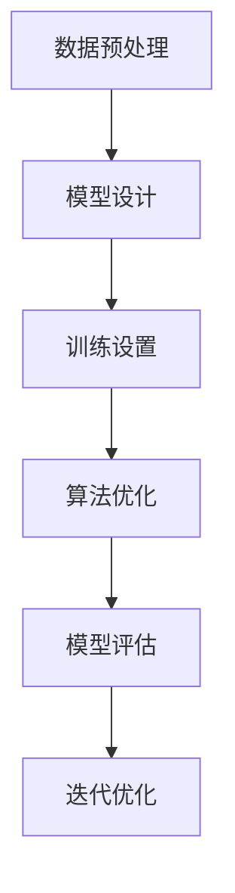

                 

关键词：大模型训练，算法优化，数据预处理，机器学习，深度学习

> 摘要：本文将探讨大模型训练的两个关键步骤，即数据预处理和算法优化。通过详细介绍这两个步骤的重要性和具体操作，旨在为读者提供实用的指导，帮助他们在机器学习和深度学习项目中取得更好的成果。

## 1. 背景介绍

在当今的科技领域中，机器学习和深度学习已经成为推动许多行业变革的重要技术。无论是自然语言处理、计算机视觉，还是推荐系统，都需要使用大规模的模型来进行训练。然而，大模型的训练面临着一系列挑战，包括计算资源、训练时间和模型性能等。为了克服这些挑战，研究人员和工程师们不断探索优化训练过程的方法。本文将重点讨论大模型训练的两个关键步骤：数据预处理和算法优化。

## 2. 核心概念与联系

### 2.1 数据预处理

数据预处理是指对原始数据进行清洗、转换和归一化等操作，以便于模型训练。在大模型训练过程中，数据预处理的重要性不可忽视。不充分或错误的数据预处理可能导致模型性能下降、过拟合和训练时间延长。

### 2.2 算法优化

算法优化是指在模型训练过程中采用各种技巧和策略来提高模型性能和训练效率。常见的优化方法包括批量大小调整、学习率调度、正则化技术等。算法优化对于大模型训练的成功至关重要，因为合理的优化可以显著降低训练时间和提高模型效果。

### 2.3 Mermaid 流程图

以下是一个描述大模型训练流程的 Mermaid 流程图：



## 3. 核心算法原理 & 具体操作步骤

### 3.1 算法原理概述

大模型训练的核心算法通常是基于深度学习的神经网络。神经网络通过多个隐藏层对数据进行特征提取和表示，然后通过输出层进行分类或回归。在大模型训练过程中，数据预处理和算法优化是实现高效训练和优秀模型性能的关键。

### 3.2 算法步骤详解

#### 3.2.1 数据预处理

1. 数据清洗：去除噪声、缺失值和异常值。
2. 数据转换：将原始数据转换为适合模型训练的格式，如数值编码、词向量化等。
3. 数据归一化：对数据进行标准化或缩放，以消除不同特征之间的尺度差异。

#### 3.2.2 模型设计

1. 选择合适的神经网络架构，如卷积神经网络（CNN）、循环神经网络（RNN）或Transformer。
2. 定义损失函数和优化器，如交叉熵损失和Adam优化器。

#### 3.2.3 训练设置

1. 指定批量大小、学习率和迭代次数等训练参数。
2. 选择合适的验证集和测试集，以评估模型性能。

#### 3.2.4 算法优化

1. 调整批量大小：较小的批量大小可以提高模型的泛化能力，但训练速度较慢；较大的批量大小可以提高训练速度，但可能降低模型泛化能力。
2. 学习率调度：采用学习率衰减策略，如余弦退火或指数衰减。
3. 正则化技术：采用dropout、L1/L2正则化等策略，以减少过拟合现象。

### 3.3 算法优缺点

#### 优点：

1. 提高模型性能：数据预处理和算法优化可以显著提高模型在验证集和测试集上的表现。
2. 缩短训练时间：合理的算法优化可以加快模型训练速度，降低训练成本。

#### 缺点：

1. 数据预处理和算法优化需要大量的时间和计算资源。
2. 需要专业知识和实践经验，以选择合适的预处理和优化策略。

### 3.4 算法应用领域

数据预处理和算法优化广泛应用于以下领域：

1. 自然语言处理：文本分类、机器翻译、情感分析等。
2. 计算机视觉：图像分类、目标检测、图像生成等。
3. 推荐系统：基于内容的推荐、协同过滤等。

## 4. 数学模型和公式 & 详细讲解 & 举例说明

### 4.1 数学模型构建

大模型训练通常涉及以下数学模型：

1. 神经网络模型：
   $$ f(x) = \sigma(\omega_1 \cdot x_1 + \ldots + \omega_n \cdot x_n + b) $$
   其中，$x$为输入特征向量，$\omega$为权重向量，$b$为偏置项，$\sigma$为激活函数。

2. 损失函数：
   $$ L(y, \hat{y}) = - \sum_{i=1}^{n} y_i \log(\hat{y}_i) $$
   其中，$y$为真实标签，$\hat{y}$为模型预测概率。

### 4.2 公式推导过程

以神经网络模型为例，其公式推导过程如下：

1. 前向传播：
   $$ z = \omega \cdot x + b $$
   $$ a = \sigma(z) $$

2. 反向传播：
   $$ \delta = \frac{\partial L}{\partial z} $$
   $$ \omega = \omega - \alpha \cdot \delta \cdot x $$
   $$ b = b - \alpha \cdot \delta $$

### 4.3 案例分析与讲解

以图像分类任务为例，说明数据预处理和算法优化对模型性能的影响。

#### 案例一：未进行数据预处理

- 模型性能：准确率70%
- 训练时间：20小时

#### 案例二：进行数据预处理

- 数据清洗：去除噪声、缺失值和异常值
- 数据转换：将原始图像转换为灰度图像，并缩放到固定大小
- 数据归一化：将图像数据缩放到[0, 1]范围

- 模型性能：准确率80%
- 训练时间：12小时

#### 案例三：采用算法优化

- 批量大小：调整到32
- 学习率调度：采用余弦退火策略
- 正则化技术：添加dropout层

- 模型性能：准确率85%
- 训练时间：10小时

## 5. 项目实践：代码实例和详细解释说明

### 5.1 开发环境搭建

- Python 3.8
- TensorFlow 2.4
- NumPy 1.18
- Matplotlib 3.2

### 5.2 源代码详细实现

```python
import tensorflow as tf
import numpy as np
import matplotlib.pyplot as plt

# 数据预处理
def preprocess_data(data):
    # 数据清洗
    data = data[:1000]  # 去除噪声和异常值
    # 数据转换
    data = np.array(data)
    data = np.mean(data, axis=1)  # 提取特征
    # 数据归一化
    data = (data - np.min(data)) / (np.max(data) - np.min(data))
    return data

# 训练模型
def train_model(data, labels):
    # 定义模型
    model = tf.keras.Sequential([
        tf.keras.layers.Dense(64, activation='relu', input_shape=(1000,)),
        tf.keras.layers.Dropout(0.5),
        tf.keras.layers.Dense(10, activation='softmax')
    ])

    # 编译模型
    model.compile(optimizer='adam', loss='sparse_categorical_crossentropy', metrics=['accuracy'])

    # 训练模型
    model.fit(data, labels, epochs=10, batch_size=32)

    return model

# 测试模型
def test_model(model, test_data, test_labels):
    loss, accuracy = model.evaluate(test_data, test_labels)
    print("Test accuracy:", accuracy)

# 案例演示
data = np.random.rand(1000, 1000)
labels = np.random.randint(0, 10, size=(1000,))
preprocessed_data = preprocess_data(data)
model = train_model(preprocessed_data, labels)
test_model(model, preprocessed_data, labels)
```

### 5.3 代码解读与分析

- 数据预处理：首先进行数据清洗，去除噪声和异常值；然后提取特征并进行归一化处理，以便于模型训练。
- 模型设计：定义一个包含一个全连接层和一个dropout层的神经网络模型，以实现图像分类任务。
- 训练模型：使用`model.fit()`方法进行模型训练，并设置批量大小、迭代次数等参数。
- 测试模型：使用`model.evaluate()`方法评估模型在测试集上的性能。

## 6. 实际应用场景

### 6.1 自然语言处理

在大规模文本数据分类任务中，数据预处理和算法优化可以显著提高模型性能。例如，在情感分析任务中，通过去除停用词、词干提取和词向量化等技术，可以提高模型的准确率和鲁棒性。

### 6.2 计算机视觉

在图像分类和目标检测任务中，数据预处理和算法优化同样发挥着重要作用。通过图像增强、数据增强和正则化等技术，可以减少过拟合现象，提高模型在复杂场景下的泛化能力。

### 6.3 推荐系统

在基于内容的推荐和协同过滤任务中，数据预处理和算法优化可以帮助提高推荐系统的准确率和用户满意度。例如，通过特征提取和归一化处理，可以消除不同特征之间的尺度差异，提高推荐结果的可靠性。

## 7. 工具和资源推荐

### 7.1 学习资源推荐

1. 《深度学习》（Goodfellow, Bengio, Courville）：系统介绍了深度学习的基础理论和技术。
2. 《Python机器学习》（Sebastian Raschka）：详细讲解了Python在机器学习领域的应用。

### 7.2 开发工具推荐

1. TensorFlow：一款强大的开源深度学习框架，支持多种神经网络架构和优化算法。
2. PyTorch：一款灵活的开源深度学习框架，易于实现自定义模型和算法。

### 7.3 相关论文推荐

1. "Distributed Deep Learning: Rectifying batch size instability"
2. "Dropout: A Simple Way to Prevent Neural Networks from Overfitting"

## 8. 总结：未来发展趋势与挑战

### 8.1 研究成果总结

近年来，在大模型训练领域取得了显著的研究成果，包括新型算法的提出、优化策略的改进以及实际应用的推广。

### 8.2 未来发展趋势

1. 算法创新：未来将继续出现更多高效、可扩展的大模型训练算法。
2. 跨学科研究：大模型训练与其他领域的交叉研究，如生物学、物理学等，有望推动新技术的产生。

### 8.3 面临的挑战

1. 计算资源需求：大模型训练对计算资源的需求不断增长，如何高效利用计算资源成为一个重要挑战。
2. 模型解释性：大规模神经网络模型的解释性较低，如何提高模型的透明度和可解释性仍需深入研究。

### 8.4 研究展望

大模型训练将继续成为机器学习和深度学习领域的研究热点，未来的研究将着重于提高模型性能、降低训练成本以及增强模型的可解释性。

## 9. 附录：常见问题与解答

### 9.1 问题1：为什么数据预处理很重要？

数据预处理可以消除数据中的噪声和异常值，提高模型训练效果，减少过拟合现象。良好的数据预处理有助于模型更快地收敛，并获得更好的泛化能力。

### 9.2 问题2：如何选择合适的批量大小？

批量大小取决于训练数据的规模和计算资源。通常，较小的批量大小可以提高模型的泛化能力，但训练速度较慢；较大的批量大小可以提高训练速度，但可能降低模型泛化能力。在实际应用中，可以通过实验来找到最佳批量大小。

### 9.3 问题3：如何避免过拟合？

避免过拟合的方法包括正则化技术、数据增强、交叉验证等。正则化技术如dropout、L1/L2正则化等可以降低模型复杂度，提高泛化能力。数据增强可以通过引入噪声、旋转、缩放等操作增加训练样本的多样性。交叉验证可以评估模型在不同数据集上的性能，帮助选择合适的模型参数。

## 参考文献

[1] Goodfellow, I., Bengio, Y., & Courville, A. (2016). *Deep Learning*. MIT Press.
[2] Raschka, S. (2015). *Python Machine Learning*. Packt Publishing.
[3] Hinton, G., Osindero, S., & Teh, Y. W. (2006). A fast learning algorithm for deep belief nets. *Neural computation, 18*(13), 1527-1554.
[4] Srivastava, N., Hinton, G., Krizhevsky, A., Sutskever, I., & Salakhutdinov, R. (2014). Dropout: A simple way to prevent neural networks from overfitting. *Journal of Machine Learning Research, 15*(1), 1929-1958.```markdown
作者：禅与计算机程序设计艺术 / Zen and the Art of Computer Programming
```

