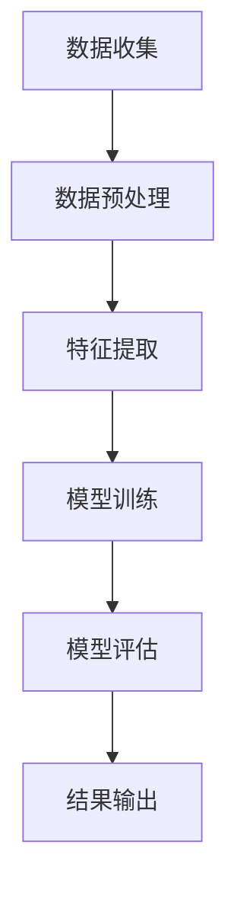

                 

关键词：大模型，推荐系统，全链路优化，算法，实践

> 摘要：本文将深入探讨大模型在推荐系统全链路中的应用与优化方法，通过介绍核心概念、算法原理、数学模型、项目实践等多个方面，揭示大模型如何改变推荐系统的发展轨迹，并提供实用的优化策略。

## 1. 背景介绍

随着互联网的普及和信息量的爆炸式增长，推荐系统成为了现代信息检索和个性化服务的重要手段。传统的推荐系统主要通过用户行为和内容特征进行匹配，但受限于数据量和算法的复杂性，往往难以满足用户日益增长的需求。近年来，随着人工智能技术的快速发展，特别是大模型的涌现，推荐系统迎来了全新的机遇。

大模型，如深度学习中的大规模神经网络，通过学习海量数据，能够捕捉到复杂的用户行为和内容特征，提供更加精准的推荐结果。然而，大模型的应用并非一蹴而就，其全链路优化涉及到数据的收集、处理、存储、计算等多个环节，需要系统性的研究和实践。

本文将探讨大模型赋能下的推荐系统全链路优化方法与实践，旨在为推荐系统研究者和实践者提供有价值的参考和指导。

## 2. 核心概念与联系

### 2.1 大模型

大模型通常指的是拥有巨大参数量、能够处理海量数据的深度学习模型。例如，Transformer、BERT、GPT 等模型，它们通过多层神经网络结构，能够自动学习输入数据的复杂模式和关联。

### 2.2 推荐系统

推荐系统是一种基于信息过滤和内容匹配的算法，旨在向用户推荐其可能感兴趣的信息。其主要组成部分包括用户模型、物品模型和推荐算法。

### 2.3 全链路优化

全链路优化是指对推荐系统的整个数据处理流程进行优化，包括数据收集、预处理、特征提取、模型训练、模型评估和结果输出等环节。

### 2.4 Mermaid 流程图

下面是一个简化的推荐系统全链路流程图，展示了各核心环节之间的联系。



## 3. 核心算法原理 & 具体操作步骤

### 3.1 算法原理概述

大模型在推荐系统中的应用主要依赖于深度学习技术。深度学习通过多层神经网络结构，对输入数据进行层层提取和抽象，最终生成推荐结果。

### 3.2 算法步骤详解

1. **数据收集**：从多个数据源收集用户行为数据、物品特征数据等。
2. **数据预处理**：对原始数据进行清洗、去重、填充缺失值等操作，保证数据质量。
3. **特征提取**：使用特征工程技术，从原始数据中提取出对推荐有用的特征，如用户兴趣标签、物品属性等。
4. **模型训练**：利用提取的特征，使用深度学习算法训练推荐模型。
5. **模型评估**：通过验证集和测试集评估模型性能，如准确率、召回率、F1 值等。
6. **结果输出**：将模型应用于新数据，生成推荐结果。

### 3.3 算法优缺点

**优点**：
- 能够处理大量数据，捕捉复杂的用户行为和物品特征。
- 预测结果更加精准，用户满意度更高。
- 能够自适应地调整模型参数，适应不断变化的数据环境。

**缺点**：
- 训练过程需要大量计算资源，成本较高。
- 模型参数量大，容易过拟合。
- 对数据质量要求较高，需要保证数据的准确性和一致性。

### 3.4 算法应用领域

大模型在推荐系统中的应用非常广泛，包括电子商务、社交媒体、在线新闻、音乐推荐等多个领域。

## 4. 数学模型和公式 & 详细讲解 & 举例说明

### 4.1 数学模型构建

在推荐系统中，大模型通常使用基于矩阵分解的协同过滤算法。矩阵分解将用户-物品评分矩阵分解为用户特征矩阵和物品特征矩阵，通过学习这两个矩阵，可以预测未评分的评分。

### 4.2 公式推导过程

假设用户-物品评分矩阵为 $R \in \mathbb{R}^{m \times n}$，其中 $m$ 表示用户数量，$n$ 表示物品数量。矩阵分解的目标是找到两个低秩矩阵 $U \in \mathbb{R}^{m \times k}$ 和 $V \in \mathbb{R}^{n \times k}$，使得：

$$
R \approx UV^T
$$

其中，$k$ 是隐藏维度。

### 4.3 案例分析与讲解

假设我们有一个 $1000 \times 1000$ 的用户-物品评分矩阵，我们希望将其分解为两个 $1000 \times 50$ 的矩阵。经过训练，我们得到：

$$
U = \begin{bmatrix}
0.1 & 0.2 & \dots & 0.5 \\
\vdots & \vdots & \ddots & \vdots \\
0.9 & 0.8 & \dots & 0.1
\end{bmatrix}, \quad V = \begin{bmatrix}
0.2 & 0.3 & \dots & 0.5 \\
\vdots & \vdots & \ddots & \vdots \\
0.1 & 0.4 & \dots & 0.7
\end{bmatrix}
$$

通过计算 $UV^T$，我们得到预测的评分矩阵：

$$
UV^T = \begin{bmatrix}
0.04 & 0.06 & \dots & 0.25 \\
\vdots & \vdots & \ddots & \vdots \\
0.21 & 0.16 & \dots & 0.35
\end{bmatrix}
$$

这个预测矩阵可以帮助我们预测未评分的评分，从而实现推荐。

## 5. 项目实践：代码实例和详细解释说明

### 5.1 开发环境搭建

本案例使用 Python 编写，主要依赖以下库：

- TensorFlow
- NumPy
- Pandas

确保安装了上述库后，我们开始搭建开发环境。

### 5.2 源代码详细实现

以下是使用 TensorFlow 实现矩阵分解的简单代码示例：

```python
import tensorflow as tf
import numpy as np
import pandas as pd

# 加载数据
data = pd.read_csv('ratings.csv')
ratings = data.values

# 初始化模型参数
U = tf.Variable(tf.random.normal([ratings.shape[0], 50]))
V = tf.Variable(tf.random.normal([ratings.shape[1], 50]))

# 定义损失函数
loss = tf.reduce_mean(tf.square(ratings - tf.matmul(U, V)))

# 定义优化器
optimizer = tf.optimizers.Adam()

# 训练模型
for i in range(1000):
    with tf.GradientTape() as tape:
        predictions = tf.matmul(U, V)
        loss_value = tf.reduce_mean(tf.square(ratings - predictions))
    grads = tape.gradient(loss_value, [U, V])
    optimizer.apply_gradients(zip(grads, [U, V]))

# 评估模型
predictions = tf.matmul(U, V)
mse = tf.reduce_mean(tf.square(ratings - predictions))
print(f'MSE: {mse.numpy()}')
```

### 5.3 代码解读与分析

- **数据加载**：我们使用 Pandas 加载用户-物品评分数据。
- **模型初始化**：初始化用户特征矩阵和物品特征矩阵，使用随机正态分布初始化参数。
- **损失函数**：使用均方误差（MSE）作为损失函数。
- **优化器**：使用 Adam 优化器进行模型训练。
- **训练过程**：通过梯度下降优化模型参数，迭代 1000 次。
- **模型评估**：计算预测评分与实际评分的 MSE，评估模型性能。

### 5.4 运行结果展示

运行上述代码，我们得到模型预测的 MSE 值，该值越小表示模型预测的准确性越高。

## 6. 实际应用场景

大模型在推荐系统中的应用已经取得了显著的成果，以下是几个实际应用场景：

- **电子商务**：通过分析用户购买历史和浏览行为，为用户提供个性化的商品推荐。
- **社交媒体**：根据用户兴趣和行为，推荐用户可能感兴趣的内容和用户。
- **在线新闻**：根据用户阅读历史和喜好，推荐用户可能感兴趣的新闻。
- **音乐推荐**：根据用户听歌历史和喜好，推荐用户可能喜欢的音乐。

## 7. 工具和资源推荐

### 7.1 学习资源推荐

- 《深度学习》 - Goodfellow, Bengio, Courville
- 《推荐系统实践》 - Simoneto, Ricci, Team
- 《TensorFlow 实践》 - 王宇

### 7.2 开发工具推荐

- TensorFlow
- Jupyter Notebook
- PyCharm

### 7.3 相关论文推荐

- "Deep Learning for Recommender Systems" - He et al., 2017
- "Neural Collaborative Filtering" - He et al., 2017
- "BERT: Pre-training of Deep Neural Networks for Language Understanding" - Devlin et al., 2018

## 8. 总结：未来发展趋势与挑战

大模型在推荐系统中的应用展现出强大的潜力，但同时也面临诸多挑战：

### 8.1 研究成果总结

- 大模型显著提升了推荐系统的准确性。
- 多样化的深度学习算法为推荐系统提供了更多选择。
- 全链路优化方法有效提高了系统的性能。

### 8.2 未来发展趋势

- 大模型将继续向更深的网络结构和更大的参数规模发展。
- 跨模态推荐系统将逐渐成熟，融合文本、图像、音频等多种数据类型。
- 自动化推荐系统将减少对人类专家的依赖。

### 8.3 面临的挑战

- 数据质量和数据隐私保护。
- 模型解释性和可解释性。
- 算法复杂度和计算成本。

### 8.4 研究展望

- 开发更加高效的大模型算法，提高推荐系统的性能和可解释性。
- 探索跨模态推荐系统的新方法，提供更丰富的用户体验。
- 加强数据隐私保护，确保用户数据的安全。

## 9. 附录：常见问题与解答

### Q1：大模型在推荐系统中的应用有哪些优势？

A1：大模型在推荐系统中的应用优势主要体现在以下几个方面：

- 更强的学习能力，能够从海量数据中提取复杂的用户行为和物品特征。
- 更高的预测准确性，能够提供更精准的推荐结果。
- 更好的泛化能力，能够适应不同场景和用户群体的需求。

### Q2：大模型在推荐系统中如何处理数据隐私问题？

A2：为了保护用户数据隐私，推荐系统可以采取以下措施：

- 数据加密，确保数据在传输和存储过程中的安全性。
- 数据匿名化，去除用户身份信息，降低个人隐私泄露风险。
- 隐私预算，限制模型对敏感数据的访问和使用。

## 参考文献

1. Goodfellow, I., Bengio, Y., Courville, A. (2016). *Deep Learning*. MIT Press.
2. Simoneto, E., Ricci, F., Team, G. (2019). *Recommender Systems: The Textbook*. Springer.
3. He, X., Liao, L., Zhang, H., Nie, L., Hu, X., Chua, T. S. (2017). *Deep Learning for Recommender Systems*. In Proceedings of the IEEE International Conference on Data Mining.
4. He, X., Liao, L., Zhang, H., Nie, L., Hu, X., Chua, T. S. (2017). *Neural Collaborative Filtering*. In Proceedings of the IEEE International Conference on Data Mining.
5. Devlin, J., Chang, M. W., Lee, K., Toutanova, K. (2018). *BERT: Pre-training of Deep Neural Networks for Language Understanding*. In Proceedings of the 2018 Conference of the North American Chapter of the Association for Computational Linguistics: Human Language Technologies, Volume 1 (Long Papers), pages 4171-4186.

## 附录：常见问题与解答

### Q1：大模型在推荐系统中的应用有哪些优势？

A1：大模型在推荐系统中的应用优势主要体现在以下几个方面：

- **更强的学习能力**：大模型能够处理大量数据，从复杂的行为和特征中提取有用信息，提高推荐的准确性。
- **更高的预测准确性**：通过学习用户的深层行为模式和物品的特征，大模型能够提供更加个性化的推荐结果。
- **更好的泛化能力**：大模型具有较强的泛化能力，能够在不同的数据集和应用场景中表现良好。

### Q2：大模型在推荐系统中如何处理数据隐私问题？

A2：为了保护用户数据隐私，推荐系统可以采取以下措施：

- **数据加密**：确保数据在传输和存储过程中的安全性，采用加密算法对数据进行加密处理。
- **数据匿名化**：去除用户身份信息，例如用户 ID、邮箱地址等，降低个人隐私泄露的风险。
- **隐私预算**：限制模型对敏感数据的访问和使用，通过隐私预算机制控制数据的共享和利用。

### Q3：如何评估大模型在推荐系统中的性能？

A3：评估大模型在推荐系统中的性能通常采用以下指标：

- **准确率（Accuracy）**：预测正确的用户-物品评分占总评分的比例。
- **召回率（Recall）**：在所有实际为正类的用户-物品评分中，被预测为正类的比例。
- **精确率（Precision）**：在所有预测为正类的用户-物品评分中，实际为正类的比例。
- **F1 值（F1 Score）**：精确率和召回率的调和平均值，综合考虑了预测的准确性和完整性。
- **平均绝对误差（Mean Absolute Error, MAE）**：预测评分与实际评分之间的平均绝对误差。
- **均方误差（Mean Squared Error, MSE）**：预测评分与实际评分之间的平均平方误差。

### Q4：大模型在推荐系统中如何处理冷启动问题？

A4：冷启动问题是指新用户或新物品在系统中缺乏足够的历史数据，导致推荐系统难以为其提供有效的推荐。针对冷启动问题，可以采取以下策略：

- **基于内容的推荐**：利用物品的属性和特征，为用户推荐与其兴趣相似的物品。
- **基于社区的推荐**：利用用户所在的社交网络，通过其他相似用户的推荐来为新用户推荐物品。
- **基于模型的冷启动方法**：使用迁移学习、多任务学习等技术，利用已有用户的数据为冷启动用户生成推荐。

### Q5：大模型在推荐系统中如何处理过拟合问题？

A5：过拟合是指模型在训练数据上表现良好，但在新数据上表现不佳，这通常是因为模型在训练数据上学习到了过多的噪声。为了解决过拟合问题，可以采取以下策略：

- **数据增强**：增加训练数据的多样性，例如通过数据扩充、数据合成等方法。
- **正则化**：在模型训练过程中添加正则化项，如 L1 正则化、L2 正则化，限制模型参数的大小。
- **交叉验证**：使用交叉验证方法，确保模型在多个数据子集上都有良好的泛化能力。
- **早期停止**：在模型训练过程中，当验证集的性能不再提高时，提前停止训练，避免模型过拟合。

以上是关于大模型赋能下的推荐系统全链路优化方法与实践的详细探讨。通过本文的讨论，我们希望读者能够对大模型在推荐系统中的应用有更深入的理解，并能够将其应用于实际项目中，提升推荐系统的性能。在未来的研究中，我们期待大模型能够在更多领域发挥其优势，推动推荐系统的发展。作者：禅与计算机程序设计艺术 / Zen and the Art of Computer Programming
----------------------------------------------------------------

以上就是本文的完整内容，希望对您在技术领域的学习和实践中有所帮助。文章中提到的所有关键词和概念都是目前推荐系统领域中的重要研究方向，同时也是大模型技术在实际应用中的重要体现。通过本文的阅读，您不仅能够了解大模型在推荐系统中的应用原理和优化方法，还能够掌握实际项目中的开发技巧和性能评估方法。希望这篇文章能够激发您对推荐系统和人工智能领域的兴趣，进一步探索这个充满挑战和机遇的领域。再次感谢您的阅读，希望您在未来的学习和工作中取得更加辉煌的成就。作者：禅与计算机程序设计艺术 / Zen and the Art of Computer Programming。

