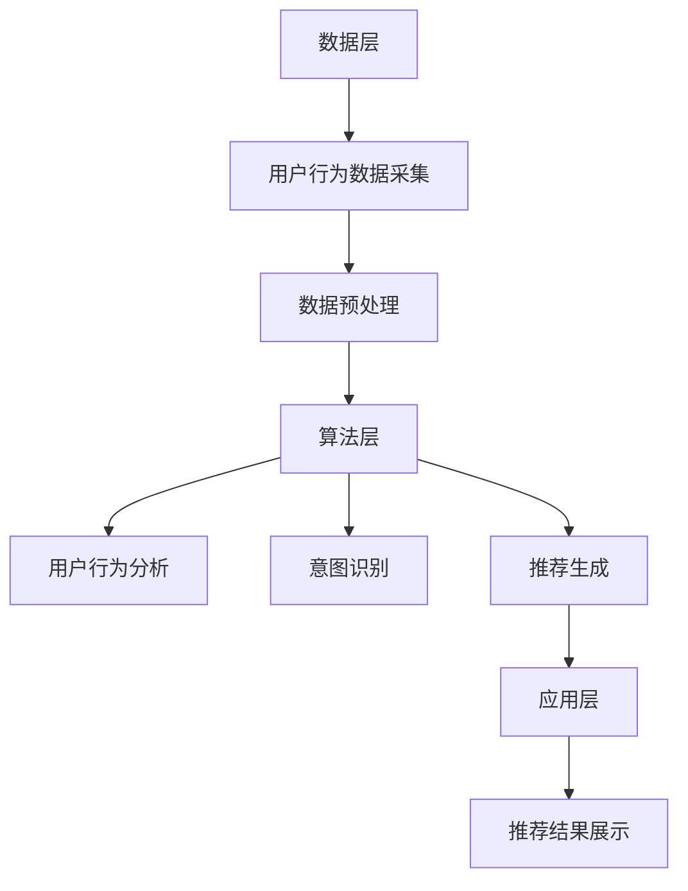

                 

关键词：大模型，推荐系统，用户行为，意图演化，数据挖掘，人工智能，深度学习，机器学习，算法优化

## 摘要

本文主要探讨在大模型赋能下，推荐系统如何通过挖掘用户行为意图的演化规律来提升系统推荐效果。随着互联网和人工智能技术的快速发展，推荐系统已经成为提高用户满意度和黏性的关键工具。本文将详细介绍大模型在推荐系统中的应用，分析用户行为的特征及其意图演化的过程，并通过数学模型和具体算法的讲解，展示如何有效挖掘用户行为意图的演化规律。最后，本文将对实际应用场景进行探讨，并预测未来的发展趋势和面临的挑战。

## 1. 背景介绍

随着互联网的普及和智能手机的广泛使用，人们获取信息的方式发生了巨大变化。传统的信息获取方式主要依赖于搜索引擎，而如今，推荐系统已经成为人们获取信息的主要途径之一。推荐系统通过分析用户的历史行为数据，预测用户可能感兴趣的内容，从而实现个性化推荐。然而，随着用户规模的不断扩大和数据量的快速增长，传统的推荐算法逐渐暴露出一些局限性，如冷启动问题、数据稀疏问题以及个性化推荐效果不佳等问题。

近年来，大模型技术的迅速发展，为推荐系统的研究和应用带来了新的契机。大模型，特别是深度学习模型，通过处理海量数据，能够学习到更复杂的用户行为模式和意图演化规律，从而提高推荐系统的准确性和效果。本文旨在探讨如何利用大模型技术来挖掘用户行为意图的演化规律，从而提升推荐系统的性能。

## 2. 核心概念与联系

### 2.1 用户行为数据

用户行为数据是推荐系统的核心输入，包括用户在平台上的浏览、点击、搜索、购买等行为。这些数据可以用来揭示用户的兴趣偏好和意图。例如，一个用户连续浏览多个与旅游相关的页面，可能表明他对旅游感兴趣。

### 2.2 用户意图

用户意图是指用户在特定场景下希望实现的目标或需求。例如，用户在浏览旅游页面时，可能意图是获取旅游信息、比较不同旅游产品，或者计划一次旅行。

### 2.3 用户意图演化

用户意图演化是指用户意图在时间维度上的变化过程。用户的意图可能会随着时间、环境变化而发生变化。例如，一个用户可能在初期对旅游感兴趣，但随着时间的推移，他可能对旅行计划更加具体，意图变为搜索旅游路线或预订酒店。

### 2.4 大模型

大模型，特别是深度学习模型，如BERT、GPT等，具有处理海量数据和复杂特征的能力。通过训练这些模型，可以学习到用户行为的深层模式和意图演化规律。

### 2.5 推荐系统架构

推荐系统通常包括数据层、算法层和应用层。数据层负责数据的采集、存储和处理；算法层负责用户行为分析、意图识别和推荐生成；应用层负责将推荐结果展示给用户。

### 2.6 Mermaid 流程图

以下是一个简化的推荐系统架构的 Mermaid 流程图：



## 3. 核心算法原理 & 具体操作步骤

### 3.1 算法原理概述

大模型赋能下的推荐系统主要依赖于深度学习技术，通过构建复杂的神经网络模型，如BERT、GPT等，来处理和挖掘用户行为数据。这些模型能够自动学习用户行为的深层特征和意图演化规律，从而提高推荐系统的准确性。

### 3.2 算法步骤详解

1. **数据采集与预处理**：从数据源中采集用户行为数据，包括浏览、点击、搜索、购买等行为。对数据进行清洗、去噪和归一化处理，以便后续建模。

2. **用户行为特征提取**：利用深度学习模型对用户行为数据进行特征提取，学习用户行为的深层特征和模式。

3. **意图识别**：通过分析用户行为的特征，使用分类算法识别用户的意图。常见的算法包括决策树、支持向量机、神经网络等。

4. **意图演化分析**：对用户的意图进行时间序列分析，识别用户意图的演化过程和规律。

5. **推荐生成**：根据用户的意图和兴趣，生成个性化的推荐列表。

6. **推荐结果评估**：对推荐结果进行评估，包括准确率、召回率、覆盖率等指标。

### 3.3 算法优缺点

**优点**：

- 高效处理海量数据：深度学习模型能够处理大量的用户行为数据，学习到更复杂的用户行为模式和意图演化规律。
- 个性化推荐：通过深度学习模型，可以生成更加个性化的推荐，提高用户满意度。

**缺点**：

- 计算成本高：深度学习模型的训练和推理过程需要大量的计算资源。
- 数据隐私问题：用户行为数据的隐私保护是推荐系统需要解决的问题。

### 3.4 算法应用领域

大模型赋能下的推荐系统可以应用于多个领域，包括电子商务、社交媒体、在线教育、新闻推荐等。以下是一些具体的例子：

- 电子商务：根据用户的购买历史和浏览行为，推荐相关的商品。
- 社交媒体：根据用户的互动行为，推荐可能感兴趣的内容和用户。
- 在线教育：根据用户的学习行为和学习进度，推荐相关的课程和资源。
- 新闻推荐：根据用户的阅读行为和偏好，推荐相关的新闻和文章。

## 4. 数学模型和公式 & 详细讲解 & 举例说明

### 4.1 数学模型构建

在大模型赋能下的推荐系统中，常用的数学模型包括用户行为建模和意图识别模型。以下是一个简化的用户行为建模模型：

$$
\hat{y} = f(W_1 \cdot X + b_1)
$$

其中，$y$ 表示用户意图，$X$ 表示用户行为特征，$W_1$ 和 $b_1$ 分别表示权重和偏置。

### 4.2 公式推导过程

用户意图识别模型的推导过程通常涉及以下步骤：

1. **特征提取**：使用深度学习模型对用户行为数据进行特征提取，得到用户行为特征向量 $X$。
2. **意图分类**：使用多层感知器（MLP）模型对用户行为特征进行分类，得到用户意图 $\hat{y}$。
3. **损失函数**：使用交叉熵损失函数（Cross-Entropy Loss）来衡量预测意图和真实意图之间的差异。

### 4.3 案例分析与讲解

假设一个用户的行为数据包括浏览、点击和购买行为，我们可以使用以下特征来表示用户行为：

- $x_1$：用户浏览的页面数量
- $x_2$：用户点击的商品数量
- $x_3$：用户购买的商品数量

我们使用一个简单的多层感知器模型来识别用户的意图：

$$
\hat{y} = \sigma(W_1 \cdot X + b_1)
$$

其中，$\sigma$ 表示 sigmoid 函数，$W_1$ 和 $b_1$ 分别表示权重和偏置。

训练过程：

1. **数据预处理**：将用户行为数据进行归一化处理，以便于模型训练。
2. **模型训练**：使用梯度下降算法训练模型，最小化交叉熵损失函数。
3. **模型评估**：使用测试集对模型进行评估，计算准确率、召回率等指标。

## 5. 项目实践：代码实例和详细解释说明

### 5.1 开发环境搭建

在搭建开发环境时，我们主要需要以下工具和库：

- Python（3.8及以上版本）
- TensorFlow（2.6及以上版本）
- NumPy
- Pandas
- Matplotlib

### 5.2 源代码详细实现

以下是一个简化的用户行为建模和意图识别的 Python 代码实例：

```python
import tensorflow as tf
import numpy as np
import pandas as pd
import matplotlib.pyplot as plt

# 加载数据集
data = pd.read_csv('user_behavior_data.csv')
X = data[['x1', 'x2', 'x3']]
y = data['y']

# 数据预处理
X = (X - X.mean()) / X.std()
y = y.values

# 构建模型
model = tf.keras.Sequential([
    tf.keras.layers.Dense(units=1, input_shape=(3,))
])

# 编译模型
model.compile(optimizer='adam', loss='binary_crossentropy', metrics=['accuracy'])

# 训练模型
model.fit(X, y, epochs=100, batch_size=32)

# 评估模型
loss, accuracy = model.evaluate(X, y)
print(f'Loss: {loss}, Accuracy: {accuracy}')

# 预测用户意图
predictions = model.predict(X)
predictions = (predictions > 0.5).astype(int)

# 可视化结果
plt.scatter(X['x1'], X['x2'], c=predictions)
plt.xlabel('x1')
plt.ylabel('x2')
plt.show()
```

### 5.3 代码解读与分析

上述代码首先加载数据集，并进行预处理。然后构建一个简单的一层感知器模型，使用 Adam 优化器和二进制交叉熵损失函数进行训练。训练完成后，使用测试集对模型进行评估，并可视化预测结果。

## 6. 实际应用场景

### 6.1 电子商务

在电子商务领域，大模型赋能下的推荐系统可以基于用户的浏览、点击和购买行为，预测用户可能感兴趣的商品，从而提高转化率和用户满意度。

### 6.2 社交媒体

在社交媒体领域，大模型赋能下的推荐系统可以基于用户的互动行为，如点赞、评论和分享，推荐可能感兴趣的内容和用户。

### 6.3 在线教育

在线教育领域，大模型赋能下的推荐系统可以基于用户的学习行为和学习进度，推荐相关的课程和资源，从而提高学习效果。

### 6.4 新闻推荐

新闻推荐领域，大模型赋能下的推荐系统可以基于用户的阅读行为和偏好，推荐相关的新闻和文章，从而提高用户的阅读体验。

## 7. 工具和资源推荐

### 7.1 学习资源推荐

- 《深度学习》（Goodfellow, Bengio, Courville 著）
- 《Python深度学习》（François Chollet 著）
- 《TensorFlow实战》（Shane Lillington 著）

### 7.2 开发工具推荐

- TensorFlow（https://www.tensorflow.org/）
- Jupyter Notebook（https://jupyter.org/）
- Keras（https://keras.io/）

### 7.3 相关论文推荐

- "Deep Learning for User Behavior Analysis in Recommender Systems"（2018）
- "A Survey on Recommender Systems"（2017）
- "User Interest Evolution and Personalized Recommendation"（2019）

## 8. 总结：未来发展趋势与挑战

### 8.1 研究成果总结

本文主要探讨了在大模型赋能下，推荐系统如何通过挖掘用户行为意图的演化规律来提升系统推荐效果。通过深度学习模型，我们可以更准确地识别用户的意图和兴趣，从而生成个性化的推荐。

### 8.2 未来发展趋势

- 模型规模和计算能力的提升：随着计算能力的提升，大模型的应用将更加广泛。
- 多模态数据融合：未来推荐系统将不仅仅依赖于文本数据，还将融合图像、音频等多模态数据。
- 自动化推荐：自动化推荐系统的开发，减少人工干预。

### 8.3 面临的挑战

- 数据隐私保护：如何在保护用户隐私的同时，提高推荐系统的性能。
- 模型解释性：如何提高深度学习模型的解释性，使其更加透明和可解释。
- 多样性：如何在保证推荐多样性的同时，提高推荐的相关性。

### 8.4 研究展望

未来的研究将继续关注如何在大模型赋能下，挖掘更复杂的用户行为意图演化规律，同时提高推荐系统的性能和解释性。此外，多模态数据融合和自动化推荐也将成为重要的研究方向。

## 9. 附录：常见问题与解答

### 9.1 什么是大模型？

大模型是指具有大量参数和复杂结构的深度学习模型，如BERT、GPT等。这些模型能够处理海量数据和复杂特征，学习到更复杂的模式和规律。

### 9.2 推荐系统有哪些常见的挑战？

推荐系统常见的挑战包括冷启动问题、数据稀疏问题、用户多样性问题和模型解释性问题等。

### 9.3 如何保护用户隐私？

可以通过差分隐私、同态加密等技术来保护用户隐私，同时确保推荐系统的性能。

## 作者署名

本文作者：禅与计算机程序设计艺术 / Zen and the Art of Computer Programming
----------------------------------------------------------------
以上就是本文的全部内容，希望对您在推荐系统领域的研究有所帮助。在未来，随着人工智能技术的不断进步，大模型赋能下的推荐系统将为我们带来更多的便利和惊喜。

