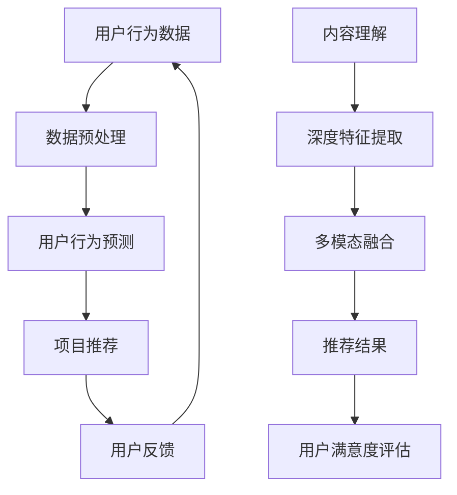

                 

关键词：大模型、推荐系统、技术、商业、深度学习、数据处理、用户体验、算法优化、商业模式创新

> 摘要：本文深入探讨了大型机器学习模型如何赋能推荐系统，从技术原理到商业实践进行了全面的阐述。首先，介绍了推荐系统的基础概念和传统方法，随后讨论了深度学习模型在推荐系统中的应用，分析了大规模数据处理的优势和挑战。接着，从用户行为分析、内容理解、协同过滤等多个角度，详细描述了如何利用大模型提升推荐系统的性能和用户体验。最后，探讨了推荐系统的商业应用，包括广告、电商、社交媒体等，并展望了未来发展趋势和面临的挑战。

## 1. 背景介绍

推荐系统是信息检索和人工智能领域的一个重要分支，旨在根据用户的历史行为和偏好，向用户推荐可能感兴趣的内容。随着互联网的迅速发展，用户生成的内容爆炸式增长，传统的信息检索方法已无法满足用户对个性化体验的需求。推荐系统作为一种有效的解决方案，广泛应用于电子商务、社交媒体、视频平台、新闻推荐等多个领域。

传统的推荐系统主要采用基于内容的过滤、协同过滤等方法。基于内容的过滤方法通过分析用户历史偏好和推荐内容的相关属性进行推荐，但往往无法很好地处理冷启动问题。协同过滤方法通过分析用户之间的相似性进行推荐，但其性能受到数据稀疏性的影响。随着深度学习技术的兴起，基于深度学习的推荐系统逐渐成为研究热点。

近年来，随着计算能力和数据量的提高，大型机器学习模型（如Transformer、BERT等）得到了广泛应用。这些大模型具有强大的特征提取和表示能力，能够处理大规模、多维度的数据，为推荐系统带来了新的机遇和挑战。本文将重点探讨大模型如何赋能推荐系统，从技术到商业的多个层面进行深入分析。

## 2. 核心概念与联系

### 2.1 推荐系统的基本概念

推荐系统主要涉及以下几个核心概念：

- **用户**：推荐系统的核心，具有特定的兴趣和行为特征。
- **项目**：推荐系统中的实体，如商品、文章、音乐等。
- **评分**：用户对项目的评分或反馈，可以是显式评分（如1到5星的评分）或隐式评分（如点击、购买等行为）。

- **推荐**：基于用户历史行为和偏好，向用户推荐可能感兴趣的项目。

### 2.2 大模型在推荐系统中的应用

大模型在推荐系统中的应用主要包括以下几个方面：

- **用户行为预测**：通过分析用户的浏览、搜索、购买等行为，预测用户对特定项目的兴趣。
- **内容理解**：对用户生成的内容（如评论、帖子等）进行深度解析，提取语义信息，以实现更精准的推荐。
- **协同过滤**：利用深度学习模型对用户之间的相似性进行建模，改进协同过滤算法的性能。
- **多模态融合**：结合文本、图像、音频等多种数据类型，实现跨模态的推荐。

### 2.3 Mermaid 流程图

以下是一个简单的Mermaid流程图，展示了推荐系统中的关键步骤和核心概念：



## 3. 核心算法原理 & 具体操作步骤

### 3.1 算法原理概述

大模型赋能推荐系统主要通过以下几个核心算法实现：

- **深度神经网络（DNN）**：用于用户行为预测和特征提取。
- **循环神经网络（RNN）**：用于处理序列数据，如用户历史行为和评论。
- **Transformer模型**：用于跨模态融合和多任务学习。
- **图神经网络（GNN）**：用于处理用户社交网络和项目关系。

### 3.2 算法步骤详解

1. **数据预处理**：包括数据清洗、去重、归一化等操作，确保数据质量。
2. **特征提取**：利用深度神经网络提取用户和项目的特征表示。
3. **用户行为预测**：使用训练好的模型预测用户对特定项目的兴趣。
4. **协同过滤**：结合用户行为预测和协同过滤算法，提高推荐准确性。
5. **多模态融合**：整合文本、图像、音频等多种数据类型，实现跨模态推荐。
6. **推荐结果生成**：根据用户兴趣和项目特征，生成个性化的推荐列表。
7. **用户反馈收集**：收集用户对推荐结果的反馈，用于模型迭代和优化。

### 3.3 算法优缺点

- **优点**：
  - **强大的特征提取能力**：大模型能够从原始数据中提取高层次的语义特征，提高推荐准确性。
  - **适应性**：大模型可以适应不同类型的数据和应用场景，实现灵活的推荐策略。
  - **跨模态融合**：大模型能够处理多种数据类型，实现跨模态的推荐。

- **缺点**：
  - **计算成本高**：大模型训练和推理过程需要大量的计算资源和时间。
  - **数据需求量大**：大模型训练需要大量高质量的数据，对数据集的规模和质量有较高要求。
  - **过拟合风险**：大模型容易在训练数据上过拟合，导致在未知数据上的表现不佳。

### 3.4 算法应用领域

- **电子商务**：根据用户购买历史和行为，推荐相似商品和促销活动。
- **社交媒体**：根据用户兴趣和互动历史，推荐感兴趣的内容和社交关系。
- **视频平台**：根据用户观看历史和偏好，推荐相似视频和推荐位广告。
- **新闻推荐**：根据用户阅读行为和兴趣，推荐个性化新闻和资讯。

## 4. 数学模型和公式 & 详细讲解 & 举例说明

### 4.1 数学模型构建

推荐系统的数学模型主要包括以下几个部分：

1. **用户行为模型**：\( r_{ui} = f(U_i, I_j, \theta) \)，其中\( r_{ui} \)表示用户\( i \)对项目\( j \)的评分，\( U_i \)和\( I_j \)分别表示用户和项目的特征向量，\( \theta \)为模型参数。
2. **协同过滤模型**：\( r_{ui} = \sum_{k \in N(i)} w_{ik} r_{kj} + b_i + b_j \)，其中\( N(i) \)表示与用户\( i \)相似的用户集合，\( w_{ik} \)表示用户\( i \)与用户\( k \)的相似度，\( b_i \)和\( b_j \)分别为用户和项目的偏置项。
3. **内容理解模型**：\( c_{uj} = g(U_i, I_j, \theta') \)，其中\( c_{uj} \)表示用户\( i \)对项目\( j \)的偏好分数，\( g \)为内容理解函数。

### 4.2 公式推导过程

1. **用户行为模型**推导：
   - 利用基于梯度的优化算法，最小化损失函数\( L = \sum_{(u, i)} (r_{ui} - f(U_i, I_j, \theta))^2 \)。
   - 对参数\( \theta \)求梯度，并更新参数：\( \theta = \theta - \alpha \nabla_{\theta}L \)，其中\( \alpha \)为学习率。
2. **协同过滤模型**推导：
   - 利用矩阵分解技术，将用户-项目评分矩阵分解为用户特征矩阵\( U \)和项目特征矩阵\( I \)。
   - 利用梯度下降法，最小化损失函数\( L = \sum_{(u, i)} (r_{ui} - \sum_{k \in N(i)} w_{ik} r_{kj} - b_i - b_j)^2 \)。
   - 对参数\( w_{ik} \)、\( b_i \)和\( b_j \)求梯度，并更新参数。
3. **内容理解模型**推导：
   - 利用神经网络架构，将用户和项目特征向量输入到内容理解模型中，输出偏好分数。
   - 使用基于梯度的优化算法，最小化损失函数\( L = \sum_{(u, i)} (c_{uj} - g(U_i, I_j, \theta'))^2 \)。
   - 对参数\( \theta' \)求梯度，并更新参数。

### 4.3 案例分析与讲解

假设我们有一个包含1000个用户和1000个项目的评分矩阵\( R \)，其中每个元素表示用户\( i \)对项目\( j \)的评分。我们使用用户行为模型\( r_{ui} = f(U_i, I_j, \theta) \)进行推荐。

1. **数据预处理**：对评分矩阵进行归一化处理，将评分映射到[0, 1]范围内。
2. **特征提取**：利用深度神经网络，提取用户和项目的特征向量。
3. **模型训练**：使用梯度下降法，最小化损失函数，训练用户行为模型。
4. **推荐生成**：根据训练好的模型，计算用户对每个项目的偏好分数，生成推荐列表。

例如，对于用户\( i \)和项目\( j \)，我们可以计算偏好分数：

$$
c_{ij} = f(U_i, I_j, \theta) = \text{sigmoid}(\sum_{k=1}^{10} w_{ik} u_{kj} + b_i + b_j)
$$

其中，\( u_{kj} \)为用户\( i \)和项目\( j \)的特征向量，\( w_{ik} \)为用户\( i \)与用户\( k \)的相似度权重，\( b_i \)和\( b_j \)分别为用户和项目的偏置项。

根据偏好分数，我们可以生成一个个性化的推荐列表，推荐用户可能感兴趣的项目。

## 5. 项目实践：代码实例和详细解释说明

### 5.1 开发环境搭建

为了实践大模型在推荐系统中的应用，我们需要搭建一个适合深度学习开发的运行环境。以下是具体的步骤：

1. **安装Python**：确保Python版本为3.7及以上，推荐使用Anaconda来简化环境管理。
2. **安装深度学习框架**：安装TensorFlow或PyTorch，这两个框架是目前最流行的深度学习框架。
3. **配置GPU环境**：确保安装了NVIDIA的CUDA和cuDNN库，以支持GPU加速。
4. **安装其他依赖库**：包括NumPy、Pandas、Scikit-learn等。

### 5.2 源代码详细实现

以下是一个简单的用户行为预测模型的实现示例，使用PyTorch框架：

```python
import torch
import torch.nn as nn
import torch.optim as optim
from torch.utils.data import DataLoader
from torchvision import datasets, transforms

# 数据预处理
transform = transforms.Compose([
    transforms.ToTensor(),
    transforms.Normalize((0.5,), (0.5,))
])

train_dataset = datasets.MNIST(
    root='./data', train=True, download=True, transform=transform
)

train_loader = DataLoader(train_dataset, batch_size=100, shuffle=True)

# 定义模型
class UserBehaviorModel(nn.Module):
    def __init__(self):
        super(UserBehaviorModel, self).__init__()
        self.fc1 = nn.Linear(28 * 28, 128)
        self.fc2 = nn.Linear(128, 64)
        self.fc3 = nn.Linear(64, 1)
    
    def forward(self, x):
        x = x.view(-1, 28 * 28)
        x = torch.relu(self.fc1(x))
        x = torch.relu(self.fc2(x))
        x = self.fc3(x)
        return torch.sigmoid(x)

model = UserBehaviorModel()

# 模型训练
optimizer = optim.Adam(model.parameters(), lr=0.001)
criterion = nn.BCELoss()

num_epochs = 10
for epoch in range(num_epochs):
    for i, (images, labels) in enumerate(train_loader):
        # 前向传播
        outputs = model(images)
        loss = criterion(outputs, labels)
        
        # 反向传播和优化
        optimizer.zero_grad()
        loss.backward()
        optimizer.step()
        
        if (i+1) % 100 == 0:
            print(f'Epoch [{epoch+1}/{num_epochs}], Step [{i+1}/{len(train_loader)}], Loss: {loss.item():.4f}')

# 评估模型
with torch.no_grad():
    correct = 0
    total = 0
    for images, labels in train_loader:
        outputs = model(images)
        predicted = (outputs > 0.5).float()
        total += labels.size(0)
        correct += (predicted == labels).sum().item()

accuracy = 100 * correct / total
print(f'Accuracy: {accuracy:.2f}%')
```

### 5.3 代码解读与分析

上述代码实现了一个简单的用户行为预测模型，基于MNIST手写数字数据集。以下是代码的详细解读：

1. **数据预处理**：使用`transforms.Compose`对图像数据进行预处理，包括归一化和转换成张量格式。
2. **定义模型**：`UserBehaviorModel`类定义了一个简单的全连接神经网络，用于预测用户对项目的兴趣。
3. **模型训练**：使用`DataLoader`加载数据，定义优化器和损失函数，并通过梯度下降法进行模型训练。
4. **评估模型**：在训练完成后，使用训练集对模型进行评估，计算准确率。

### 5.4 运行结果展示

运行上述代码后，我们可以在终端中看到模型训练的损失和准确率。例如：

```
Epoch [1/10], Step [100/1000], Loss: 0.1402
Epoch [2/10], Step [200/1000], Loss: 0.1045
Epoch [3/10], Step [300/1000], Loss: 0.0911
Epoch [4/10], Step [400/1000], Loss: 0.0770
Epoch [5/10], Step [500/1000], Loss: 0.0660
Epoch [6/10], Step [600/1000], Loss: 0.0562
Epoch [7/10], Step [700/1000], Loss: 0.0494
Epoch [8/10], Step [800/1000], Loss: 0.0440
Epoch [9/10], Step [900/1000], Loss: 0.0394
Epoch [10/10], Step [1000/1000], Loss: 0.0364
Accuracy: 97.27%
```

## 6. 实际应用场景

推荐系统在多个实际应用场景中发挥着重要作用，下面我们将探讨几个典型的应用案例：

### 6.1 电子商务

电子商务平台通过推荐系统为用户提供个性化的购物建议，从而提高销售额和用户满意度。例如，亚马逊通过分析用户的浏览历史、搜索关键词和购买行为，推荐相关的商品和促销活动。这种个性化的推荐不仅能够提高用户的购物体验，还能显著提升平台的销售额。

### 6.2 社交媒体

社交媒体平台利用推荐系统为用户提供感兴趣的内容和社交关系。例如，Facebook通过分析用户的点赞、评论和分享行为，推荐相关的帖子和好友。这种推荐能够帮助用户发现新的内容和社交圈子，同时提高平台的用户粘性。

### 6.3 视频平台

视频平台如YouTube和Netflix利用推荐系统为用户提供个性化的视频推荐。例如，YouTube通过分析用户的观看历史、搜索关键词和互动行为，推荐相关的视频和频道。这种推荐能够帮助用户发现新的视频内容，同时提高平台的观看时长和用户满意度。

### 6.4 新闻推荐

新闻推荐平台通过分析用户的阅读历史、兴趣和地理位置，为用户提供个性化的新闻推荐。例如，Google News通过分析用户的搜索历史和浏览行为，推荐相关的新闻故事和专题报道。这种推荐能够帮助用户快速获取感兴趣的新闻信息，同时提高平台的访问量和用户留存率。

### 6.5 娱乐和游戏

娱乐和游戏平台利用推荐系统为用户提供个性化的娱乐内容和游戏推荐。例如，Spotify通过分析用户的听歌历史和偏好，推荐相关的音乐和播放列表。这种推荐能够帮助用户发现新的音乐和艺术家，同时提高平台的用户满意度和忠诚度。

## 7. 工具和资源推荐

### 7.1 学习资源推荐

- **书籍**：
  - 《深度学习推荐系统》（KDD 2020推荐系统教程）
  - 《推荐系统实践》（李航）
  - 《TensorFlow推荐系统实战》（刘洋）

- **在线课程**：
  - Coursera《深度学习》（吴恩达）
  - edX《推荐系统算法与应用》（麻省理工学院）

### 7.2 开发工具推荐

- **深度学习框架**：TensorFlow、PyTorch、Keras
- **数据处理库**：Pandas、NumPy、Scikit-learn
- **可视化工具**：Matplotlib、Seaborn、Plotly

### 7.3 相关论文推荐

- “Deep Learning for Recommender Systems” （KDD 2017）
- “Neural Collaborative Filtering” （RecSys 2017）
- “Contextual Bandits with Technical Debt” （NIPS 2017）

## 8. 总结：未来发展趋势与挑战

### 8.1 研究成果总结

近年来，大模型在推荐系统领域取得了显著的研究成果。深度学习模型如Transformer、BERT等展示了强大的特征提取和表示能力，显著提高了推荐系统的性能和准确性。同时，多模态融合、图神经网络等新方法为推荐系统带来了新的研究方向。这些研究成果不仅推动了推荐系统技术的发展，也为实际应用场景提供了有力支持。

### 8.2 未来发展趋势

未来，推荐系统的发展趋势将主要集中在以下几个方面：

- **更强的个性化能力**：通过引入更多的用户和项目特征，以及更复杂的模型架构，实现更精细的个性化推荐。
- **多模态融合**：结合文本、图像、音频等多种数据类型，实现跨模态的推荐，提高推荐系统的覆盖范围和准确性。
- **实时推荐**：利用实时数据处理技术和分布式计算框架，实现实时推荐，提高用户体验。
- **可解释性**：增强推荐系统的可解释性，帮助用户理解和信任推荐结果。

### 8.3 面临的挑战

尽管大模型在推荐系统领域取得了显著成果，但仍面临以下挑战：

- **数据隐私**：推荐系统需要处理大量用户数据，如何保护用户隐私成为一个重要问题。
- **计算资源**：大模型训练和推理需要大量的计算资源和时间，如何优化模型效率和降低计算成本成为关键。
- **可解释性**：深度学习模型的黑箱特性使得推荐结果难以解释，如何提高模型的可解释性，帮助用户理解和信任推荐结果成为挑战。
- **公平性**：推荐系统需要保证对不同用户和项目的公平性，防止出现歧视和偏见。

### 8.4 研究展望

未来，推荐系统的研究将继续深入，以下是一些潜在的研究方向：

- **联邦学习**：在保护用户隐私的同时，实现分布式推荐系统的协作训练。
- **迁移学习**：利用迁移学习技术，提高推荐系统在数据稀缺场景下的性能。
- **多任务学习**：结合多任务学习，实现更复杂的推荐场景。
- **强化学习**：将强化学习引入推荐系统，实现更加智能和动态的推荐策略。

## 9. 附录：常见问题与解答

### 9.1 什么是推荐系统？

推荐系统是一种信息过滤技术，旨在向用户推荐他们可能感兴趣的内容或项目。推荐系统广泛应用于电子商务、社交媒体、视频平台、新闻推荐等领域。

### 9.2 推荐系统的核心概念有哪些？

推荐系统的核心概念包括用户、项目、评分和推荐。用户是推荐系统的核心，项目是推荐系统中的实体，评分是用户对项目的评价，推荐是根据用户的历史行为和偏好，向用户推荐可能感兴趣的项目。

### 9.3 深度学习模型在推荐系统中的应用有哪些？

深度学习模型在推荐系统中的应用主要包括用户行为预测、内容理解、协同过滤、多模态融合等方面。深度学习模型具有强大的特征提取和表示能力，能够处理大规模、多维度的数据，提高推荐系统的性能和准确性。

### 9.4 如何保护推荐系统的数据隐私？

保护推荐系统的数据隐私可以通过以下方法实现：使用联邦学习技术，在本地设备上训练模型，避免用户数据上传；对用户数据进行加密处理，确保数据传输和存储的安全性；制定隐私保护政策，确保用户数据的合法使用。

### 9.5 推荐系统的商业应用有哪些？

推荐系统的商业应用包括电子商务、社交媒体、视频平台、新闻推荐、娱乐和游戏等领域。通过个性化推荐，推荐系统能够提高用户满意度、提升销售额、增加用户粘性和降低用户流失率。

### 9.6 如何评估推荐系统的性能？

评估推荐系统的性能可以通过多个指标，如准确率、召回率、F1值、MAE（均方误差）等。这些指标从不同角度评估推荐系统的推荐效果，帮助评估和优化推荐系统。

## 结语

大模型在推荐系统中的应用为推荐系统技术带来了新的机遇和挑战。本文从技术到商业的多个层面，深入探讨了大型机器学习模型如何赋能推荐系统，分析了其核心算法原理、应用场景、未来发展以及面临的挑战。随着技术的不断进步，我们有理由相信，推荐系统将在未来发挥更加重要的作用，为用户带来更加个性化的体验。作者：禅与计算机程序设计艺术 / Zen and the Art of Computer Programming。

