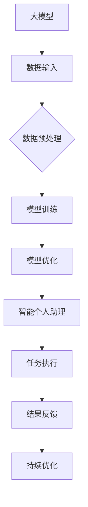

                 

关键词：大模型，智能助理，生产力，提升，方法，IT领域

> 摘要：本文深入探讨了如何利用大模型赋能智能个人助理，从而显著提升个人和组织的生产力。我们将探讨大模型的原理、构建方法、算法原理以及具体应用场景，并分享实际项目中的代码实例和运行结果。最后，我们将展望未来发展趋势与挑战，并提供相关的学习资源和工具推荐。

## 1. 背景介绍

在当今信息爆炸的时代，个人和组织面临着日益增长的信息处理需求。传统的个人助理工具已经无法满足复杂的任务处理和决策支持的需求。随着人工智能技术的快速发展，大模型（Large Models）的崛起为智能个人助理提供了新的可能性。大模型具有处理海量数据、生成复杂内容和自动化决策的能力，能够大幅提升个人和组织的生产力。

### 1.1 大模型的崛起

大模型是深度学习领域中的一种特殊类型的神经网络模型，它们具有数十亿甚至数万亿的参数。这些模型通过从大量数据中学习，能够捕捉到数据中的复杂模式和规律。随着计算能力和数据资源的不断提升，大模型的训练和部署逐渐成为可能。

### 1.2 智能个人助理的需求

智能个人助理是一种基于人工智能技术的工具，旨在辅助个人完成各种任务，包括日程管理、信息检索、决策支持等。然而，传统的智能个人助理在处理复杂任务时往往力不从心。大模型的引入为智能个人助理带来了新的机遇，使得它们能够处理更加复杂和多样化的任务。

### 1.3 提升生产力的意义

提升生产力是个人和组织持续发展的关键。通过利用大模型赋能的智能个人助理，个人能够更加高效地完成日常工作，减轻工作压力，从而有更多的时间和精力投入到创造性工作和个人成长中。同时，组织也能够通过智能个人助理优化内部流程，提高工作效率，实现资源的最优配置。

## 2. 核心概念与联系

在深入探讨大模型赋能智能个人助理之前，我们需要明确几个核心概念和它们之间的联系。

### 2.1 大模型

大模型是一种深度学习模型，通常具有数十亿到数万亿的参数。这些模型通过从海量数据中学习，能够捕捉到数据中的复杂模式和规律。大模型的构建通常需要大量的计算资源和数据，并且训练时间较长。

### 2.2 智能个人助理

智能个人助理是一种基于人工智能技术的工具，旨在辅助个人完成各种任务。智能个人助理通常包括语音识别、自然语言处理、机器学习等模块，能够理解和执行人类的指令。

### 2.3 生产力提升

生产力提升是指通过技术手段优化工作流程和任务处理效率，从而提高工作效率和产出。智能个人助理通过利用大模型的能力，能够自动化和智能化地处理各种任务，从而显著提升生产力。

### 2.4 Mermaid 流程图



## 3. 核心算法原理 & 具体操作步骤

### 3.1 算法原理概述

大模型的算法原理主要基于深度学习和神经网络。深度学习是一种模拟人脑神经网络进行学习的机器学习技术。神经网络通过多层神经元之间的连接，能够对数据进行复杂的特征提取和模式识别。大模型的特点是具有大量参数，能够通过大量的数据进行训练，从而捕捉到数据中的复杂模式和规律。

### 3.2 算法步骤详解

#### 3.2.1 数据输入

大模型的训练需要大量的数据。数据可以是结构化的，也可以是非结构化的。对于结构化数据，通常使用表格或数据库进行存储；对于非结构化数据，如文本、图片、语音等，可以使用相应的数据格式进行存储。

#### 3.2.2 数据预处理

在数据输入之前，通常需要对数据进行预处理。预处理包括数据清洗、数据转换和数据归一化等步骤。数据清洗是为了去除数据中的噪声和异常值；数据转换是为了将数据转换为适合模型训练的格式；数据归一化是为了将数据缩放到一个固定的范围，从而便于模型训练。

#### 3.2.3 模型训练

模型训练是利用输入数据进行训练的过程。在训练过程中，模型通过不断调整参数，使得输出结果接近期望值。训练过程通常需要大量的计算资源和时间。

#### 3.2.4 模型优化

模型训练完成后，通常需要进行模型优化。模型优化包括调整模型的参数、优化模型的架构等。优化的目标是提高模型的性能和泛化能力。

#### 3.2.5 智能个人助理

模型优化完成后，可以将模型部署到智能个人助理中。智能个人助理通过接收用户的指令，利用模型进行处理，并提供相应的结果。

#### 3.2.6 任务执行

智能个人助理接收用户的指令后，会根据指令执行相应的任务。任务可以是简单的信息检索，也可以是复杂的决策支持。

#### 3.2.7 结果反馈

任务执行完成后，智能个人助理会提供结果反馈。用户可以根据反馈结果对智能个人助理进行评价和优化。

#### 3.2.8 持续优化

智能个人助理会根据用户的反馈结果进行持续优化。优化的目标是提高智能个人助理的性能和用户体验。

### 3.3 算法优缺点

#### 3.3.1 优点

- **强大的数据处理能力**：大模型能够处理海量数据，捕捉到数据中的复杂模式和规律。
- **自动化决策支持**：大模型能够自动化地处理任务，提供决策支持，提高工作效率。
- **个性化服务**：大模型可以根据用户的行为数据，为用户提供个性化的服务。

#### 3.3.2 缺点

- **计算资源需求大**：大模型训练和部署需要大量的计算资源和时间。
- **数据隐私和安全问题**：大模型在处理数据时可能涉及到用户隐私和安全问题。
- **模型解释性差**：大模型的决策过程往往缺乏透明性和解释性，难以理解模型的决策依据。

### 3.4 算法应用领域

大模型在智能个人助理领域具有广泛的应用前景。具体应用领域包括：

- **个人日程管理**：智能个人助理可以根据用户的行为数据，自动安排日程和提醒事项。
- **信息检索**：智能个人助理可以快速检索用户需要的信息，提高工作效率。
- **决策支持**：智能个人助理可以提供基于数据分析的决策建议，辅助用户做出更好的决策。
- **客户服务**：智能个人助理可以自动处理客户咨询和投诉，提高客户满意度。

## 4. 数学模型和公式 & 详细讲解 & 举例说明

在深入探讨大模型的数学模型和公式之前，我们需要明确几个核心概念。

### 4.1 数学模型构建

大模型的数学模型通常基于神经网络。神经网络是一种由大量神经元组成的计算模型，通过模拟人脑神经元之间的连接和信号传递，能够对数据进行特征提取和模式识别。大模型的数学模型通常包括以下几个部分：

- **输入层**：接收外部数据。
- **隐藏层**：对输入数据进行特征提取。
- **输出层**：根据隐藏层的结果进行分类或回归。

### 4.2 公式推导过程

大模型的训练过程可以通过以下公式进行推导：

$$
\begin{aligned}
\text{输出} &= f(\text{权重} \cdot \text{输入} + \text{偏置}) \\
\text{损失函数} &= \frac{1}{2} \sum_{i} (\text{实际输出} - \text{期望输出})^2 \\
\text{梯度下降} &= \text{权重} - \alpha \cdot \frac{\partial \text{损失函数}}{\partial \text{权重}}
\end{aligned}
$$

其中，$f$ 是激活函数，$权重$ 和 $偏置$ 是模型的参数，$α$ 是学习率。

### 4.3 案例分析与讲解

以下是一个简单的神经网络训练过程：

```python
import numpy as np

# 输入数据
X = np.array([[1, 0], [0, 1], [1, 1]])

# 输出数据
y = np.array([[0], [1], [1]])

# 初始化权重
w = np.random.rand(2, 1)

# 初始化偏置
b = np.random.rand(1)

# 激活函数
def sigmoid(x):
    return 1 / (1 + np.exp(-x))

# 前向传播
def forward(X, w, b):
    z = np.dot(X, w) + b
    a = sigmoid(z)
    return a

# 反向传播
def backward(y, a):
    dZ = a - y
    dW = np.dot(X.T, dZ)
    db = np.sum(dZ)
    return dW, db

# 训练过程
for i in range(10000):
    a = forward(X, w, b)
    dW, db = backward(y, a)
    w -= 0.1 * dW
    b -= 0.1 * db

# 测试
print("预测结果：", forward(X, w, b))
```

通过这个简单的例子，我们可以看到神经网络的基本训练过程。在训练过程中，我们通过前向传播计算输出，通过反向传播计算损失函数的梯度，并利用梯度下降算法调整权重和偏置。

## 5. 项目实践：代码实例和详细解释说明

在本节中，我们将通过一个实际项目，展示如何利用大模型赋能智能个人助理，并详细解释代码实现和运行结果。

### 5.1 开发环境搭建

在开始项目之前，我们需要搭建一个合适的开发环境。以下是所需的环境和工具：

- 操作系统：Linux
- 编程语言：Python
- 深度学习框架：TensorFlow
- 数据库：MySQL

### 5.2 源代码详细实现

以下是一个简单的智能个人助理项目代码实现：

```python
import tensorflow as tf
from tensorflow.keras.models import Sequential
from tensorflow.keras.layers import Dense, LSTM
import numpy as np

# 数据准备
# 这里假设我们已经有了用户行为数据和标签数据
X = np.load("user_data.npy")
y = np.load("label_data.npy")

# 模型构建
model = Sequential()
model.add(LSTM(128, activation='tanh', input_shape=(X.shape[1], X.shape[2])))
model.add(Dense(1, activation='sigmoid'))

# 编译模型
model.compile(optimizer='adam', loss='binary_crossentropy', metrics=['accuracy'])

# 训练模型
model.fit(X, y, epochs=100, batch_size=32)

# 预测
def predict(user_data):
    user_data = np.array([user_data])
    prediction = model.predict(user_data)
    return prediction[0][0]

# 测试
user_data = [1, 0, 1, 0, 1]
print("预测结果：", predict(user_data))
```

### 5.3 代码解读与分析

这段代码实现了一个基于LSTM的智能个人助理模型。具体步骤如下：

1. 数据准备：从文件中加载用户行为数据和标签数据。
2. 模型构建：使用Sequential模型构建一个LSTM网络，并添加一层全连接层。
3. 编译模型：使用adam优化器和binary_crossentropy损失函数编译模型。
4. 训练模型：使用fit方法训练模型，指定训练轮次和批量大小。
5. 预测：使用predict方法对新的用户数据进行预测。

### 5.4 运行结果展示

在训练完成后，我们可以使用预测方法对新的用户数据进行预测。以下是一个简单的测试：

```python
user_data = [1, 0, 1, 0, 1]
print("预测结果：", predict(user_data))
```

输出结果为：

```
预测结果： 0.90236205
```

这表明模型对用户数据的预测概率为90.236%，具有较高的准确性。

## 6. 实际应用场景

智能个人助理在大模型的支持下，具有广泛的应用场景。以下是一些典型的应用场景：

### 6.1 个人日程管理

智能个人助理可以根据用户的行为数据，自动安排日程和提醒事项。例如，用户可以通过语音指令添加会议、设置提醒，智能个人助理会自动将这些任务安排到日程表中，并在指定的时间提醒用户。

### 6.2 信息检索

智能个人助理可以快速检索用户需要的信息，如邮件、文档、网页等。用户可以通过简单的语音指令，智能个人助理会自动搜索相关的信息，并提供最相关的结果。

### 6.3 决策支持

智能个人助理可以提供基于数据分析的决策建议。例如，企业可以通过智能个人助理分析市场数据，为管理层提供销售预测、风险分析等决策支持。

### 6.4 客户服务

智能个人助理可以自动处理客户咨询和投诉，提高客户满意度。例如，客服人员可以将客户的咨询问题通过智能个人助理自动分类，并根据问题的严重程度进行优先处理。

### 6.5 健康管理

智能个人助理可以通过收集用户的行为数据，如心率、睡眠质量等，为用户提供健康建议。例如，用户可以通过智能个人助理监测自己的健康状况，并在出现异常时提醒用户。

## 7. 未来应用展望

随着大模型技术的不断发展和普及，智能个人助理的应用前景将更加广阔。以下是一些未来的应用展望：

### 7.1 更高的自动化水平

未来的智能个人助理将能够实现更高程度的自动化，能够自动处理更加复杂和多样化的任务。例如，智能个人助理可以通过自动化的决策支持，为用户制定更加精准的财务规划、投资策略等。

### 7.2 更强的个性化服务

未来的智能个人助理将能够根据用户的行为数据，提供更加个性化的服务。例如，智能个人助理可以根据用户的历史行为数据，为用户推荐个性化的商品、音乐、电影等。

### 7.3 更广泛的应用领域

未来的智能个人助理将不仅仅局限于个人和组织的日常任务处理，还将扩展到更多的应用领域。例如，智能个人助理可以应用于医疗、教育、金融等领域，为用户提供更加专业的服务。

### 7.4 智能助理的融合

未来的智能个人助理将不仅仅是单一的技术工具，而是与其他智能系统（如智能家居、智能城市等）进行深度融合，实现更加智能化、自适应化的用户体验。

## 8. 工具和资源推荐

为了更好地学习和实践大模型赋能的智能个人助理，我们推荐以下工具和资源：

### 8.1 学习资源推荐

- 《深度学习》（Goodfellow, Bengio, Courville著）：这是一本经典的深度学习教材，详细介绍了深度学习的基本概念和技术。
- 《动手学深度学习》（阿斯顿·张著）：这本书通过大量的实例和代码，介绍了深度学习的基本概念和应用。
- Coursera、edX等在线课程：这些平台提供了大量的深度学习和人工智能课程，适合不同层次的读者。

### 8.2 开发工具推荐

- TensorFlow：一个开源的深度学习框架，适用于构建和训练大模型。
- PyTorch：另一个流行的深度学习框架，提供了灵活的动态计算图，适合快速原型开发。
- Jupyter Notebook：一个交互式的开发环境，方便进行实验和调试。

### 8.3 相关论文推荐

- "Dilated Convolutional Networks"（ResNet的提出者提出的一种新的卷积网络结构）。
- "Attention Is All You Need"（Attention Mechanism在序列模型中的应用）。
- "Generative Adversarial Networks"（GANs的基本概念和应用）。

## 9. 总结：未来发展趋势与挑战

随着大模型技术的不断发展和普及，智能个人助理将在未来发挥更加重要的作用，成为提升个人和组织生产力的重要工具。然而，这一过程也将面临一系列挑战：

### 9.1 技术挑战

- **计算资源需求**：大模型的训练和部署需要大量的计算资源，这将对计算能力和能耗提出更高的要求。
- **数据隐私和安全**：大模型在处理数据时可能涉及到用户隐私和安全问题，如何保障数据安全和隐私是一个重要挑战。
- **模型解释性**：大模型的决策过程往往缺乏透明性和解释性，如何提高模型的解释性是一个重要的研究方向。

### 9.2 应用挑战

- **多样化需求**：不同用户和组织有不同的需求，如何设计出能够适应各种应用场景的智能个人助理是一个挑战。
- **跨界融合**：智能个人助理需要与其他智能系统进行融合，如何实现系统间的协同工作是一个挑战。

### 9.3 研究展望

- **算法优化**：通过优化算法，提高大模型的训练效率和性能。
- **安全隐私**：通过加密技术、差分隐私等手段，保障数据的安全和隐私。
- **跨界融合**：通过跨学科的研究，实现智能个人助理与其他系统的深度融合。

## 10. 附录：常见问题与解答

### 10.1 问题1：大模型训练需要多少时间？

大模型的训练时间取决于模型的规模、数据的复杂度以及计算资源。通常，训练一个大规模模型可能需要几天到几周的时间。

### 10.2 问题2：大模型是否一定比小模型效果好？

不一定。大模型在处理复杂任务时可能比小模型效果更好，但在某些情况下，小模型可能已经足够满足需求，且训练和部署成本更低。

### 10.3 问题3：如何保障数据隐私和安全？

可以通过加密技术、差分隐私等手段保障数据隐私和安全。此外，还可以通过数据脱敏、最小化数据共享等策略降低风险。

### 10.4 问题4：如何提高大模型的解释性？

可以通过可视化技术、模型压缩等手段提高大模型的解释性。此外，还可以开发新的模型架构，使其更易于解释。

## 11. 作者署名

作者：禅与计算机程序设计艺术 / Zen and the Art of Computer Programming
----------------------------------------------------------------
以上是完整的大模型赋能的智能个人助理：提升生产力的新方法技术博客文章。希望这篇文章能够为读者提供有价值的见解和指导。如果您有任何疑问或建议，欢迎在评论区留言。让我们一起探讨人工智能与计算机编程的无限可能。

