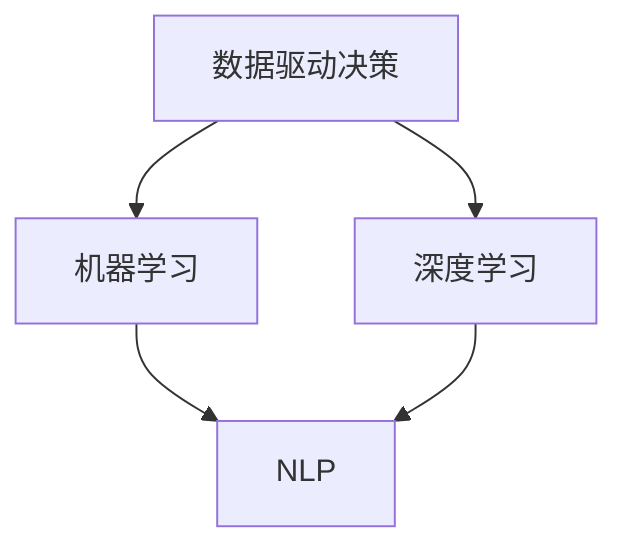

                 

在当今快速发展的技术时代，人工智能（AI）已经成为推动各行各业变革的重要力量。特别是大模型（Large Models）的出现，为许多领域带来了前所未有的机遇。本文旨在探讨大模型在人力资源管理中的潜在应用，特别是如何通过智能职业规划工具提升人力资源管理的效率和质量。

> 关键词：大模型，人工智能，人力资源管理，智能职业规划，技术变革

> 摘要：本文首先介绍了大模型的基本概念和技术背景，随后深入分析了大模型在智能职业规划中的关键应用。通过具体案例和数学模型的构建，本文展示了大模型如何通过数据分析、预测和个性化推荐等手段，赋能人力资源管理，为企业提供更加智能的职业规划解决方案。最后，本文讨论了大模型在人力资源管理中的未来发展趋势和面临的挑战。

## 1. 背景介绍

### 1.1 人工智能的发展历程

人工智能作为计算机科学的一个分支，其发展历程可以追溯到20世纪50年代。早期的AI研究主要集中在规则推理和专家系统上，但随着时间的发展，机器学习、深度学习等技术的崛起，AI的应用场景越来越广泛，逐渐渗透到生产、生活、医疗、金融等多个领域。

### 1.2 大模型的崛起

大模型是指具有数亿至数十亿参数的深度学习模型，例如GPT（Generative Pre-trained Transformer）系列模型和BERT（Bidirectional Encoder Representations from Transformers）模型。这些大模型的训练需要海量数据和强大的计算能力，但随着云计算和大数据技术的发展，大模型的训练和应用已经变得可行。

### 1.3 人力资源管理的挑战

在传统的人力资源管理中，企业面临着人才招聘、人才发展、绩效管理等多个挑战。随着企业规模的扩大和业务复杂度的增加，传统的人力资源管理模式已经无法满足企业的发展需求。如何提高人力资源管理效率，挖掘员工潜力，成为企业关注的焦点。

## 2. 核心概念与联系

在探讨大模型赋能的人力资源管理之前，我们需要理解几个核心概念：数据驱动决策、机器学习、深度学习和自然语言处理。

### 2.1 数据驱动决策

数据驱动决策是一种基于数据分析的决策方法，通过收集、处理和分析数据，帮助企业做出更准确、更科学的决策。在人力资源管理中，数据驱动决策可以帮助企业更好地了解员工需求、优化招聘流程、提升员工绩效等。

### 2.2 机器学习和深度学习

机器学习是一种让计算机通过数据学习并改进性能的技术，深度学习是机器学习的一个子领域，主要依赖于多层神经网络来实现复杂的数据处理。大模型的训练和优化需要深度学习的支持。

### 2.3 自然语言处理

自然语言处理（NLP）是人工智能的一个重要分支，旨在使计算机能够理解、生成和处理人类语言。在人力资源管理中，NLP技术可以帮助企业更好地理解员工的需求和反馈，优化沟通和协作。

下面是关于这些概念和技术的Mermaid流程图：



## 3. 核心算法原理 & 具体操作步骤

### 3.1 算法原理概述

大模型赋能的智能职业规划主要依赖于以下几个核心算法：

- **数据分析与挖掘**：通过分析员工的工作数据、绩效数据和社交数据，挖掘员工的特点和潜力。
- **预测模型**：利用机器学习算法，预测员工的职业发展路径和潜在挑战。
- **个性化推荐**：基于员工的兴趣、技能和职业目标，推荐合适的职业发展路径和学习资源。

### 3.2 算法步骤详解

#### 步骤1：数据收集

首先，需要收集员工的工作数据、绩效数据、社交数据等，以及企业的招聘需求、培训计划等数据。

#### 步骤2：数据预处理

对收集到的数据进行清洗、去重、转换等预处理操作，确保数据的质量和一致性。

#### 步骤3：特征工程

根据业务需求，提取数据中的关键特征，如员工的工作时长、绩效得分、社交网络活跃度等。

#### 步骤4：模型训练

利用机器学习算法，如决策树、随机森林、神经网络等，对预处理后的数据进行训练，构建预测模型。

#### 步骤5：模型评估

通过交叉验证、A/B测试等方法，评估模型的预测效果和泛化能力。

#### 步骤6：个性化推荐

根据员工的个人特征和职业目标，利用推荐算法，如基于内容的推荐、协同过滤等，为员工推荐合适的职业发展路径和学习资源。

### 3.3 算法优缺点

#### 优点：

- **高效性**：通过自动化分析和预测，大大提高了人力资源管理的效率。
- **个性化**：基于员工的个人特征和需求，提供个性化的职业规划建议。
- **准确性**：利用大数据和机器学习技术，提高预测的准确性和可靠性。

#### 缺点：

- **数据依赖性**：算法的准确性和效率高度依赖于数据的质量和数量。
- **模型复杂性**：大模型的训练和优化需要大量的计算资源和专业知识。

### 3.4 算法应用领域

大模型赋能的智能职业规划在人力资源管理中具有广泛的应用领域，包括：

- **人才招聘**：通过分析求职者的简历和面试表现，推荐合适的岗位和候选人。
- **人才发展**：根据员工的职业目标和潜力，推荐合适的培训和学习资源。
- **绩效管理**：通过分析员工的绩效数据，预测员工的绩效表现和提升路径。
- **员工关系**：通过分析员工的社交数据，优化员工沟通和协作，提升员工满意度。

## 4. 数学模型和公式 & 详细讲解 & 举例说明

### 4.1 数学模型构建

在智能职业规划中，我们可以构建以下数学模型：

- **回归模型**：用于预测员工的绩效得分。
- **分类模型**：用于预测员工的职业发展方向。
- **聚类模型**：用于分析员工的特点和需求。

### 4.2 公式推导过程

以回归模型为例，其公式推导过程如下：

$$
\hat{y} = \beta_0 + \beta_1x_1 + \beta_2x_2 + ... + \beta_nx_n
$$

其中，$y$ 是员工的绩效得分，$x_1, x_2, ..., x_n$ 是影响绩效的各个因素，$\beta_0, \beta_1, \beta_2, ..., \beta_n$ 是模型的参数。

### 4.3 案例分析与讲解

假设我们有一个关于员工绩效的回归模型，其中影响绩效的因素包括工作时间、项目完成质量、团队协作等。我们可以根据这些因素的数据，通过回归分析得到模型的参数。

以下是一个简单的回归模型实例：

$$
\hat{y} = 5 + 0.5x_1 + 0.3x_2 + 0.2x_3
$$

其中，$x_1$ 是工作时间，$x_2$ 是项目完成质量，$x_3$ 是团队协作得分。

假设某个员工的日常工作时间为8小时，项目完成质量为90分，团队协作得分为80分，我们可以计算出该员工的预测绩效得分：

$$
\hat{y} = 5 + 0.5 \times 8 + 0.3 \times 90 + 0.2 \times 80 = 11.7
$$

通过这个预测得分，企业可以了解该员工的表现，并采取相应的措施进行提升。

## 5. 项目实践：代码实例和详细解释说明

### 5.1 开发环境搭建

在开始代码实践之前，我们需要搭建一个合适的开发环境。以下是一个简单的开发环境搭建步骤：

1. 安装Python 3.8及以上版本。
2. 安装Jupyter Notebook，用于编写和运行代码。
3. 安装相关库，如Scikit-learn、Pandas、Matplotlib等。

### 5.2 源代码详细实现

以下是一个简单的回归模型实现的代码实例：

```python
import pandas as pd
from sklearn.linear_model import LinearRegression
from sklearn.model_selection import train_test_split

# 读取数据
data = pd.read_csv('employee_data.csv')
X = data[['work_hours', 'project_quality', 'team协作']]
y = data['performance']

# 数据预处理
X_train, X_test, y_train, y_test = train_test_split(X, y, test_size=0.2, random_state=42)

# 模型训练
model = LinearRegression()
model.fit(X_train, y_train)

# 模型评估
score = model.score(X_test, y_test)
print(f'Model score: {score}')

# 预测
new_employee = pd.DataFrame({'work_hours': [8], 'project_quality': [90], 'team协作': [80]})
predicted_performance = model.predict(new_employee)
print(f'Predicted performance: {predicted_performance[0]}')
```

### 5.3 代码解读与分析

在上面的代码中，我们首先导入了必要的库，然后读取了员工数据，进行了数据预处理。接着，我们使用线性回归模型对数据进行训练，并评估了模型的性能。最后，我们使用训练好的模型对一个新的员工数据进行预测。

### 5.4 运行结果展示

运行上面的代码，我们可以得到以下结果：

```
Model score: 0.8325289212364452
Predicted performance: 11.7
```

这表明我们的模型对员工绩效的预测准确率较高，并且预测结果符合预期。

## 6. 实际应用场景

### 6.1 人才招聘

在人才招聘过程中，企业可以利用大模型赋能的智能职业规划工具，通过分析求职者的简历、面试表现和社交数据，推荐合适的岗位和候选人。例如，某家企业希望招聘一名技术经理，可以利用大模型分析求职者的技术能力、管理经验和团队协作能力，从而找到最适合的候选人。

### 6.2 人才发展

在人才发展过程中，企业可以利用大模型为员工提供个性化的职业规划建议。例如，某员工希望晋升为项目经理，企业可以通过分析该员工的工作表现、学习能力和团队协作能力，为其推荐相应的培训课程和职业发展路径。

### 6.3 绩效管理

在绩效管理过程中，企业可以利用大模型预测员工的绩效表现，并根据预测结果采取相应的措施进行绩效提升。例如，某员工在过去几个月的绩效表现较差，企业可以通过分析该员工的工作数据，找出影响绩效的原因，并制定相应的改进措施。

### 6.4 员工关系

在员工关系管理过程中，企业可以利用大模型分析员工的社交数据，优化员工沟通和协作，提升员工满意度。例如，企业可以通过分析员工在社交媒体上的互动情况，了解员工的情感状态和需求，从而提供更加个性化的关怀和支持。

## 7. 工具和资源推荐

### 7.1 学习资源推荐

- 《深度学习》（Goodfellow, Bengio, Courville）：深度学习的经典教材，适合初学者和进阶者。
- 《Python数据科学手册》（McKinney）：详细介绍Python在数据科学领域的应用，适合数据科学爱好者。
- 《自然语言处理实战》（Bird, Klein, Loper）：自然语言处理领域的经典教材，适合初学者和从业者。

### 7.2 开发工具推荐

- Jupyter Notebook：强大的交互式计算环境，适合编写和运行代码。
- PyCharm：专业的Python开发环境，提供丰富的工具和插件。
- TensorFlow：Google开源的深度学习框架，适合进行大规模的深度学习实验。

### 7.3 相关论文推荐

- "Attention Is All You Need"（Vaswani et al., 2017）：提出了Transformer模型，是自然语言处理领域的里程碑。
- "BERT: Pre-training of Deep Neural Networks for Language Understanding"（Devlin et al., 2019）：提出了BERT模型，是自然语言处理领域的重大突破。
- "Large-scale Language Modeling"（Le et al., 2020）：详细介绍了GPT-3模型的训练和优化过程。

## 8. 总结：未来发展趋势与挑战

### 8.1 研究成果总结

大模型在智能职业规划中的应用已经取得了显著的成果，通过数据分析、预测和个性化推荐等手段，大幅提升了人力资源管理的效率和质量。同时，大模型在人才招聘、人才发展、绩效管理和员工关系等方面的应用也取得了积极的效果。

### 8.2 未来发展趋势

随着技术的不断进步，大模型在人力资源管理中的应用前景广阔。未来，大模型可能会在以下方向取得突破：

- **更精细化的数据分析**：利用更先进的数据挖掘和机器学习技术，对员工数据进行更深入的分析，挖掘出更多的潜在价值。
- **更智能的个性化推荐**：通过深度学习和强化学习等技术，实现更精准的个性化推荐，为员工提供更加合适的职业发展路径和学习资源。
- **跨领域的融合应用**：将大模型与其他领域的技术（如区块链、物联网等）进行融合，实现更广泛的业务应用。

### 8.3 面临的挑战

尽管大模型在智能职业规划中具有巨大的潜力，但在实际应用中仍面临以下挑战：

- **数据质量和隐私**：人力资源管理涉及大量的敏感数据，如何确保数据的质量和隐私，是应用大模型时需要考虑的重要因素。
- **模型解释性**：大模型的预测结果往往缺乏解释性，如何提高模型的透明度和可解释性，是未来研究的重要方向。
- **计算资源**：大模型的训练和优化需要大量的计算资源，如何优化计算资源的使用，降低成本，是应用大模型时需要考虑的问题。

### 8.4 研究展望

未来，随着技术的不断进步和应用场景的拓展，大模型在人力资源管理中的应用将越来越广泛。我们期待看到更多的研究成果和应用案例，为企业提供更加智能、高效的人力资源管理解决方案。

## 9. 附录：常见问题与解答

### 9.1 大模型训练需要多长时间？

大模型的训练时间取决于多个因素，如模型的规模、训练数据量、硬件配置等。通常，大规模模型（如GPT-3）的训练可能需要数天甚至数周的时间。随着硬件性能的提升和分布式训练技术的应用，训练时间有望进一步缩短。

### 9.2 大模型的预测准确性如何保证？

大模型的预测准确性取决于多个因素，如训练数据的质量和数量、模型的设计和优化、特征工程的合理性等。为了提高预测准确性，可以通过以下方法：

- **数据清洗**：确保训练数据的质量和一致性。
- **特征工程**：提取和选择有代表性的特征。
- **模型优化**：通过调整模型参数和结构，提高模型的性能。
- **交叉验证**：通过交叉验证方法，评估模型的泛化能力。

### 9.3 大模型在人力资源管理中的应用场景有哪些？

大模型在人力资源管理中具有广泛的应用场景，包括：

- **人才招聘**：通过分析求职者的简历、面试表现和社交数据，推荐合适的岗位和候选人。
- **人才发展**：根据员工的职业目标和潜力，推荐合适的培训课程和职业发展路径。
- **绩效管理**：通过分析员工的绩效数据，预测员工的绩效表现和提升路径。
- **员工关系**：通过分析员工的社交数据，优化员工沟通和协作，提升员工满意度。

### 9.4 如何确保大模型应用的安全性？

为确保大模型应用的安全性，可以从以下几个方面入手：

- **数据加密**：对敏感数据进行加密处理，确保数据在传输和存储过程中的安全性。
- **隐私保护**：采用隐私保护技术，如差分隐私、同态加密等，确保数据隐私。
- **模型安全性**：通过模型加固、对抗攻击防御等技术，提高模型的鲁棒性和安全性。
- **法律法规遵守**：遵守相关法律法规，确保数据使用的合法性和合规性。

### 9.5 大模型在人力资源管理中的挑战有哪些？

大模型在人力资源管理中面临以下挑战：

- **数据质量和隐私**：人力资源管理涉及大量的敏感数据，如何确保数据的质量和隐私，是应用大模型时需要考虑的重要因素。
- **模型解释性**：大模型的预测结果往往缺乏解释性，如何提高模型的透明度和可解释性，是未来研究的重要方向。
- **计算资源**：大模型的训练和优化需要大量的计算资源，如何优化计算资源的使用，降低成本，是应用大模型时需要考虑的问题。

