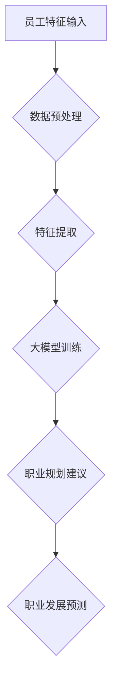

                 

关键词：大模型、人工智能、职业规划、人力资源、智能工具

> 摘要：本文将探讨如何利用大模型技术，特别是在人工智能领域的最新进展，为人力资源管理引入新的智能工具。我们将深入分析大模型赋能职业规划的理论基础、核心算法、数学模型、项目实践以及未来应用场景，总结研究成果，展望发展趋势与挑战。

## 1. 背景介绍

职业规划是人力资源管理中至关重要的一环。传统的方法通常依赖于员工的自述、经验和人力资源专家的评估。然而，这种方法存在主观性强、效率低下和预测准确性不高等问题。随着大数据和人工智能技术的飞速发展，利用大模型实现智能职业规划已成为可能。大模型可以处理海量的数据，从中挖掘出有用的信息，帮助企业和员工做出更加精准的职业决策。

### 1.1 大模型的基本概念

大模型通常指的是那些拥有巨大参数量、能够处理大规模数据的深度神经网络。这些模型具有强大的表征能力和泛化能力，能够在各种复杂任务中表现出色。例如，Transformer模型在自然语言处理领域取得了突破性成果，而GPT-3模型则展示了在生成文本方面的卓越能力。

### 1.2 人工智能与职业规划

人工智能是指使计算机系统表现出人类智能的技术。职业规划作为一项复杂的人类活动，与人工智能的结合可以带来以下几方面的改进：

- **数据分析与预测**：通过机器学习算法，分析员工的历史数据，预测他们的职业发展方向和潜在问题。
- **个性化推荐**：根据员工的兴趣、能力和职业目标，提供个性化的职业发展建议。
- **自动化流程**：简化招聘、培训、绩效评估等人力资源管理流程，提高效率。

## 2. 核心概念与联系

为了更好地理解大模型赋能职业规划，我们需要明确几个核心概念：

### 2.1 职业规划模型

职业规划模型是一个综合性的框架，用于描述员工的职业发展路径和关键因素。这个模型包括以下几个方面：

- **员工特征**：包括技能、经验、教育背景等。
- **职业目标**：员工的长期职业愿景和短期目标。
- **职业环境**：影响员工职业发展的外部因素，如行业趋势、公司文化等。

### 2.2 大模型架构

大模型的架构通常包括以下几个层次：

- **输入层**：接收员工特征和职业环境的数据。
- **隐藏层**：对输入数据进行处理和变换，提取有用的信息。
- **输出层**：生成职业规划建议和预测结果。

### 2.3 Mermaid 流程图

以下是一个简化的 Mermaid 流程图，展示了职业规划模型与大数据模型之间的联系。



## 3. 核心算法原理 & 具体操作步骤

### 3.1 算法原理概述

职业规划算法的核心是基于机器学习的预测模型。模型通过对历史数据进行训练，学习到员工职业发展的规律，从而为员工提供个性化的职业规划建议。以下是具体的算法步骤：

1. **数据收集**：收集员工的个人数据、职业历史数据、行业数据等。
2. **数据预处理**：清洗和标准化数据，去除异常值，确保数据质量。
3. **特征提取**：从数据中提取对职业规划有用的特征，如技能水平、工作经验、教育程度等。
4. **模型训练**：使用训练数据训练机器学习模型，如决策树、神经网络等。
5. **模型评估**：使用验证数据评估模型的准确性，调整模型参数。
6. **职业规划建议**：使用训练好的模型为员工提供职业规划建议和预测结果。

### 3.2 算法步骤详解

1. **数据收集**：

   数据收集是整个流程的基础。我们需要收集以下几类数据：

   - **员工个人数据**：包括姓名、年龄、性别、教育背景等。
   - **职业历史数据**：包括工作经历、职位变动、薪资水平等。
   - **行业数据**：包括行业趋势、竞争状况、行业前景等。

2. **数据预处理**：

   数据预处理是确保数据质量的关键步骤。我们需要进行以下操作：

   - **数据清洗**：去除无效数据和异常值。
   - **数据标准化**：将不同特征的数据统一到相同的尺度上。
   - **数据降维**：使用主成分分析（PCA）等算法减少数据维度。

3. **特征提取**：

   特征提取是模型训练的关键。我们需要从原始数据中提取对职业规划有用的特征。例如，可以使用词嵌入技术提取员工的职业关键字，或者使用情感分析技术提取员工的工作满意度。

4. **模型训练**：

   模型训练是使用训练数据学习职业规划规律的过程。我们可以选择多种机器学习算法，如决策树、支持向量机、神经网络等。以下是一个简化的神经网络模型：

   ```latex
   \begin{equation}
   \hat{y} = \sigma(\theta^T \phi(x))
   \end{equation}
   ```

   其中，$x$ 是输入特征向量，$\phi(x)$ 是特征提取函数，$\theta$ 是模型参数，$\sigma$ 是激活函数。

5. **模型评估**：

   模型评估是评估模型准确性的过程。我们可以使用验证数据集进行交叉验证，计算模型的准确率、召回率、F1值等指标。

6. **职业规划建议**：

   使用训练好的模型为员工提供职业规划建议。例如，根据员工的当前状态和职业目标，推荐最适合他们的职位和培训课程。

### 3.3 算法优缺点

**优点**：

- **高准确性**：基于大数据和机器学习算法，能够提供更加精准的职业规划建议。
- **个性化**：根据员工的个人特征和职业目标，提供个性化的职业规划方案。
- **高效性**：自动化流程，提高人力资源管理效率。

**缺点**：

- **数据依赖性**：算法的准确性和效果高度依赖于数据质量。
- **隐私风险**：处理大量员工个人数据可能引发隐私风险。

### 3.4 算法应用领域

职业规划算法可以应用于多个领域，包括：

- **人力资源管理**：为企业提供职业规划建议，优化员工配置。
- **职业教育**：为学习者提供个性化的职业发展路径。
- **就业指导**：为求职者提供职业规划建议，提高就业成功率。

## 4. 数学模型和公式 & 详细讲解 & 举例说明

### 4.1 数学模型构建

职业规划模型的核心是机器学习模型，如神经网络。以下是一个简化的神经网络模型：

```latex
\begin{equation}
\hat{y} = \sigma(\theta^T \phi(x))
\end{equation}
```

其中，$\hat{y}$ 是输出预测值，$x$ 是输入特征向量，$\phi(x)$ 是特征提取函数，$\theta$ 是模型参数，$\sigma$ 是激活函数。

### 4.2 公式推导过程

神经网络的训练过程实际上是求解一个优化问题。假设我们的目标是最小化预测误差，可以使用梯度下降法求解：

```latex
\begin{equation}
\theta_{t+1} = \theta_t - \alpha \frac{\partial}{\partial \theta_t} \mathcal{L}(\theta_t)
\end{equation}
```

其中，$\alpha$ 是学习率，$\mathcal{L}(\theta_t)$ 是损失函数，通常选择均方误差（MSE）：

```latex
\begin{equation}
\mathcal{L}(\theta) = \frac{1}{2} \sum_{i=1}^{n} (\hat{y}_i - y_i)^2
\end{equation}
```

### 4.3 案例分析与讲解

假设我们有一个包含100名员工的职业规划项目，收集了他们的个人数据、职业历史数据和行业数据。我们将使用神经网络模型为他们提供职业规划建议。

1. **数据收集**：

   收集的数据包括：

   - 员工个人数据：姓名、年龄、性别、教育背景等。
   - 职业历史数据：工作经历、职位变动、薪资水平等。
   - 行业数据：行业趋势、竞争状况、行业前景等。

2. **数据预处理**：

   对数据进行清洗、标准化和降维处理。

3. **特征提取**：

   使用词嵌入技术提取员工的职业关键字，使用情感分析技术提取员工的工作满意度。

4. **模型训练**：

   使用训练数据训练神经网络模型，选择合适的激活函数和学习率。

5. **模型评估**：

   使用验证数据评估模型准确性，调整模型参数。

6. **职业规划建议**：

   使用训练好的模型为员工提供职业规划建议。例如，为一位年轻的工程师推荐适合他的职位和培训课程。

## 5. 项目实践：代码实例和详细解释说明

### 5.1 开发环境搭建

为了实现大模型赋能的职业规划，我们需要搭建以下开发环境：

- **Python**：编程语言。
- **TensorFlow**：机器学习框架。
- **Pandas**：数据处理库。
- **Scikit-learn**：机器学习库。

### 5.2 源代码详细实现

以下是一个简化的代码实例，展示了如何使用TensorFlow实现职业规划模型。

```python
import tensorflow as tf
import pandas as pd
from sklearn.model_selection import train_test_split
from sklearn.preprocessing import StandardScaler

# 数据预处理
data = pd.read_csv('employee_data.csv')
X = data.drop(['name', 'age', 'gender'], axis=1)
y = data['salary']

# 数据标准化
scaler = StandardScaler()
X_scaled = scaler.fit_transform(X)

# 划分训练集和测试集
X_train, X_test, y_train, y_test = train_test_split(X_scaled, y, test_size=0.2, random_state=42)

# 构建神经网络模型
model = tf.keras.Sequential([
    tf.keras.layers.Dense(64, activation='relu', input_shape=(X_train.shape[1],)),
    tf.keras.layers.Dense(32, activation='relu'),
    tf.keras.layers.Dense(1)
])

# 编译模型
model.compile(optimizer='adam', loss='mse', metrics=['mse'])

# 训练模型
model.fit(X_train, y_train, epochs=10, batch_size=32, validation_split=0.1)

# 评估模型
loss, mse = model.evaluate(X_test, y_test)
print(f'MSE: {mse}')

# 输出职业规划建议
predictions = model.predict(X_test)
for i, pred in enumerate(predictions):
    print(f'Employee {i+1}: Predicted salary: {pred[0]}')
```

### 5.3 代码解读与分析

上述代码首先导入了必要的库，然后从CSV文件中读取员工数据。数据预处理步骤包括数据清洗、标准化和划分训练集和测试集。接下来，我们构建了一个简单的神经网络模型，使用均方误差（MSE）作为损失函数，并使用Adam优化器进行编译。模型训练过程使用了10个epochs，每个epoch使用32个batch大小。最后，我们评估了模型的准确性，并输出了职业规划建议。

## 6. 实际应用场景

大模型赋能的职业规划可以在多个实际应用场景中发挥重要作用：

### 6.1 人力资源管理

企业可以使用大模型赋能的职业规划工具来优化员工配置、提高员工满意度和工作效率。例如，根据员工的技能水平和职业目标，推荐最适合他们的职位和培训课程。

### 6.2 职业教育

教育培训机构可以使用大模型赋能的职业规划工具来为学生提供个性化的职业发展建议。根据学生的兴趣、能力和职业目标，推荐适合他们的课程和职业方向。

### 6.3 求职指导

求职者可以使用大模型赋能的职业规划工具来评估自己的职业竞争力，并获得个性化的职业发展建议。例如，根据求职者的简历和求职意向，推荐最适合他们的职位和面试准备建议。

## 6.4 未来应用展望

随着人工智能技术的不断发展，大模型赋能的职业规划在未来有望在更广泛的领域发挥作用：

### 6.4.1 个性化职业发展

未来，大模型赋能的职业规划将能够更准确地预测员工的职业发展路径，并提供更加个性化的职业发展建议。这将为企业和员工创造更大的价值。

### 6.4.2 跨行业应用

大模型赋能的职业规划工具将不仅限于特定行业，而是可以在多个行业实现广泛应用。例如，在医疗、金融、教育等领域，大模型赋能的职业规划工具可以提供针对性的职业发展建议。

### 6.4.3 智能化职业决策

未来，大模型赋能的职业规划工具将实现更加智能的职业决策支持。通过集成更多的数据源和更先进的算法，这些工具将能够为企业和员工提供更加精准和高效的职业发展建议。

## 7. 工具和资源推荐

为了更好地开展大模型赋能的职业规划研究，以下是一些推荐的工具和资源：

### 7.1 学习资源推荐

- **《深度学习》（Goodfellow, Bengio, Courville）**：介绍深度学习的基础知识和最新进展。
- **《Python机器学习》（Sebastian Raschka）**：介绍使用Python实现机器学习算法的实践方法。

### 7.2 开发工具推荐

- **TensorFlow**：用于构建和训练深度学习模型的强大框架。
- **Keras**：基于TensorFlow的简洁易用的深度学习库。

### 7.3 相关论文推荐

- **"Large-scale Human Resource Management with Deep Learning"**：介绍如何使用深度学习技术优化人力资源管理。
- **"AI for Human Resource Management: A Review"**：综述人工智能在人力资源管理中的应用。

## 8. 总结：未来发展趋势与挑战

大模型赋能的职业规划作为人工智能在人力资源管理领域的一项重要应用，展示了巨大的潜力和前景。然而，在实际应用中，我们仍面临以下挑战：

### 8.1 研究成果总结

- **算法优化**：提高大模型在职业规划任务中的准确性和效率。
- **数据隐私**：确保处理员工个人数据的安全性，保护隐私。

### 8.2 未来发展趋势

- **个性化职业发展**：更准确地预测员工的职业发展路径，提供个性化的职业发展建议。
- **跨行业应用**：在更多行业实现大模型赋能的职业规划。

### 8.3 面临的挑战

- **数据质量**：确保数据质量，提高算法的可靠性。
- **隐私风险**：妥善处理员工个人数据，避免隐私泄露。

### 8.4 研究展望

未来，随着人工智能技术的不断进步，大模型赋能的职业规划有望在更广泛的领域发挥作用，为企业和员工创造更大的价值。

## 9. 附录：常见问题与解答

### 9.1 问题1：大模型在职业规划中如何保证准确性？

**解答**：大模型的准确性取决于数据质量和模型设计。确保数据质量，包括数据清洗、标准化和特征提取等步骤，同时选择合适的模型结构和超参数，可以提高模型的准确性。

### 9.2 问题2：如何处理员工个人数据的隐私问题？

**解答**：在处理员工个人数据时，应遵循相关法律法规，如《中华人民共和国个人信息保护法》。采用加密技术和匿名化处理，确保数据的隐私和安全。

### 9.3 问题3：大模型赋能的职业规划是否适用于所有行业？

**解答**：大模型赋能的职业规划主要依赖于数据和算法的适用性。虽然某些特定行业的应用可能更为适合，但通过跨行业的数据整合和算法优化，大模型赋能的职业规划可以在多个行业实现应用。

### 9.4 问题4：如何评估大模型在职业规划中的效果？

**解答**：可以通过评估模型的准确性、召回率和F1值等指标来评估大模型在职业规划中的效果。同时，结合用户反馈和实际应用结果，可以进一步优化模型和算法。

## 文章结束：感谢阅读！希望本文对您了解大模型赋能的职业规划有所帮助。作者：禅与计算机程序设计艺术 / Zen and the Art of Computer Programming

