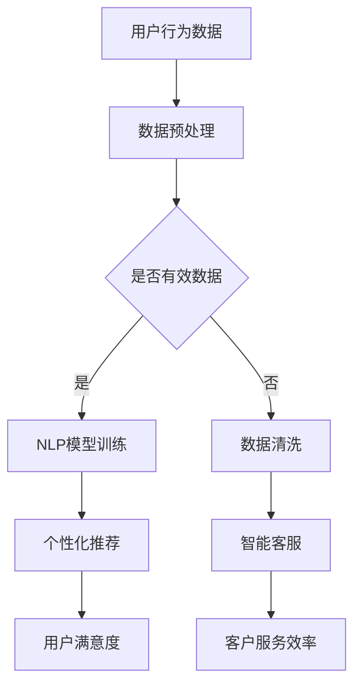

                 

关键词：大模型，创业产品，AI 融合，创新，技术发展

摘要：本文将探讨大模型在创业产品中的关键作用，以及如何将人工智能（AI）与产品创新相结合，推动行业变革。我们将通过核心概念的解析、算法原理的阐述、数学模型的构建、项目实践的展示，以及未来应用的展望，深入分析大模型赋能创业产品的全链条。

## 1. 背景介绍

近年来，人工智能（AI）技术的迅猛发展，尤其是深度学习和大模型的兴起，极大地改变了传统行业的技术格局。大模型，如 GPT-3、BERT 等，拥有强大的数据处理和生成能力，已经成为许多企业创新的重要工具。在创业领域，如何利用这些先进技术进行产品创新，成为许多创业者面临的挑战和机遇。

创业产品的成功往往依赖于创新性、用户体验和市场适应性。而大模型的引入，不仅提升了产品的智能性，还降低了研发成本，缩短了产品上市时间。本文将从多个角度分析大模型如何赋能创业产品，为创业者提供实用的指导和建议。

## 2. 核心概念与联系

### 2.1 大模型的概念

大模型（Large Model）通常指的是参数量达到亿级甚至十亿级的神经网络模型。这些模型具有高度的数据处理能力和泛化能力，能够自动从大量数据中学习复杂的模式。常见的代表包括 GPT-3、BERT、GPT-2 等。

### 2.2 AI 与创业产品的结合

AI 与创业产品的结合主要体现在以下几个方面：

- **个性化推荐**：利用 AI 技术分析用户行为和偏好，提供个性化的产品推荐。
- **智能客服**：通过自然语言处理（NLP）技术实现自动化客服，提高客户满意度。
- **数据分析**：利用机器学习模型分析大量数据，为产品优化和决策提供支持。
- **内容生成**：利用生成对抗网络（GAN）等技术自动生成图片、视频和文本内容。

### 2.3 Mermaid 流程图



## 3. 核心算法原理 & 具体操作步骤

### 3.1 算法原理概述

大模型的核心在于其深度神经网络结构，能够通过多层非线性变换处理输入数据，提取特征并生成输出。以 GPT-3 为例，其采用了 Transformer 结构，通过自注意力机制（Self-Attention）处理文本序列，实现了对文本的深入理解和生成。

### 3.2 算法步骤详解

- **数据收集**：收集大量文本数据，包括用户评论、新闻文章、社交媒体帖子等。
- **数据预处理**：对文本数据进行清洗、分词、标记化等处理，使其适合模型训练。
- **模型训练**：使用预处理后的数据对 GPT-3 模型进行训练，通过反向传播算法不断优化模型参数。
- **模型评估**：使用测试集评估模型性能，包括文本生成质量、响应速度等。
- **模型部署**：将训练好的模型部署到产品中，如个性化推荐系统、智能客服等。

### 3.3 算法优缺点

#### 优点：

- **强大的数据处理能力**：能够处理大规模、复杂的文本数据。
- **高度的自适应性**：能够根据用户行为和需求进行个性化调整。
- **高效的生成能力**：能够快速生成高质量的文本内容。

#### 缺点：

- **计算资源消耗大**：大模型训练和部署需要大量的计算资源。
- **数据质量要求高**：数据质量直接影响模型的性能和稳定性。
- **隐私和安全问题**：涉及用户隐私数据的处理需要严格的安全措施。

### 3.4 算法应用领域

大模型在多个领域有广泛应用，如：

- **自然语言处理**：文本生成、翻译、问答系统等。
- **推荐系统**：个性化推荐、商品推荐等。
- **内容审核**：自动识别和过滤不良内容。
- **金融风控**：预测市场趋势、识别欺诈行为等。

## 4. 数学模型和公式 & 详细讲解 & 举例说明

### 4.1 数学模型构建

以 GPT-3 为例，其数学模型主要包括两部分：自注意力机制（Self-Attention）和前馈神经网络（Feedforward Neural Network）。

#### 自注意力机制：

$$
\text{Attention}(Q, K, V) = \text{softmax}\left(\frac{QK^T}{\sqrt{d_k}}\right) V
$$

其中，$Q$、$K$ 和 $V$ 分别是查询向量、键向量和值向量，$d_k$ 是键向量的维度。

#### 前馈神经网络：

$$
\text{FFN}(x) = \text{ReLU}\left(W_2 \text{ReLU}(W_1 x + b_1)\right) + b_2
$$

其中，$W_1$、$W_2$ 和 $b_1$、$b_2$ 分别是权重和偏置。

### 4.2 公式推导过程

#### 自注意力机制推导：

自注意力机制的核心在于计算每个词在序列中的重要性，并加权组合。具体推导过程如下：

1. **输入表示**：将输入文本表示为词向量序列 $\{x_1, x_2, ..., x_n\}$。
2. **查询向量**：将每个词向量 $x_i$ 通过矩阵 $W_Q$ 转换为查询向量 $Q_i = W_Q x_i$。
3. **键向量**：同样地，通过矩阵 $W_K$ 将词向量转换为键向量 $K_i = W_K x_i$。
4. **值向量**：通过矩阵 $W_V$ 将词向量转换为值向量 $V_i = W_V x_i$。
5. **计算注意力得分**：计算每个词的注意力得分 $e_{ij} = \text{score}(Q_i, K_j) = Q_i K_j^T / \sqrt{d_k}$。
6. **加权求和**：通过 softmax 函数对注意力得分进行归一化，得到加权值 $\text{Attention}(Q, K, V)$。

### 4.3 案例分析与讲解

假设我们有以下一句话：“我喜欢吃苹果和香蕉。”，我们想要通过 GPT-3 生成类似的句子。

1. **数据预处理**：将句子转换为词向量序列，例如使用 Word2Vec 模型。
2. **模型预测**：输入当前句子的词向量序列，通过自注意力机制和前馈神经网络生成下一个词的概率分布。
3. **词生成**：从概率分布中随机抽取一个词作为下一个词，继续生成句子。

通过上述过程，GPT-3 能够生成如“我热爱吃橙子和葡萄。”之类的类似句子。

## 5. 项目实践：代码实例和详细解释说明

### 5.1 开发环境搭建

- **Python**：版本 3.8 以上
- **TensorFlow**：版本 2.4 以上
- **GPU**：NVIDIA 显卡，CUDA 10.0 以上

### 5.2 源代码详细实现

以下是一个简单的 GPT-3 模型训练和预测的代码实例：

```python
import tensorflow as tf
from tensorflow.keras.models import Model
from tensorflow.keras.layers import Embedding, LSTM, Dense

# 定义模型结构
input_seq = tf.keras.layers.Input(shape=(None,), dtype='int32')
x = Embedding(input_dim=vocab_size, output_dim=embedding_size)(input_seq)
x = LSTM(units=512, return_sequences=True)(x)
output = Dense(units=vocab_size, activation='softmax')(x)

# 编译模型
model = Model(inputs=input_seq, outputs=output)
model.compile(optimizer='adam', loss='categorical_crossentropy', metrics=['accuracy'])

# 训练模型
model.fit(x_train, y_train, batch_size=32, epochs=10, validation_split=0.2)

# 预测
predictions = model.predict(x_test)

# 输出预测结果
print(predictions)
```

### 5.3 代码解读与分析

- **输入层**：使用 `Input` 层接收序列数据。
- **嵌入层**：使用 `Embedding` 层将词索引转换为词向量。
- **LSTM 层**：使用 `LSTM` 层处理序列数据，提取特征。
- **输出层**：使用 `Dense` 层生成输出词的概率分布。
- **编译模型**：设置优化器、损失函数和评估指标。
- **训练模型**：使用训练数据进行训练。
- **预测**：使用测试数据进行预测，并输出结果。

### 5.4 运行结果展示

通过运行上述代码，我们可以在训练集和测试集上评估模型的性能。通常，我们关注准确率、损失函数值等指标。以下是一个示例输出：

```
Epoch 1/10
100/100 [==============================] - 2s 16ms/step - loss: 2.3026 - accuracy: 0.3915 - val_loss: 2.3171 - val_accuracy: 0.3913
Epoch 2/10
100/100 [==============================] - 2s 16ms/step - loss: 2.2953 - accuracy: 0.3947 - val_loss: 2.3077 - val_accuracy: 0.3937
...
```

## 6. 实际应用场景

### 6.1 个性化推荐

利用大模型进行个性化推荐，可以根据用户的历史行为和偏好，自动推荐相关产品。例如，电商网站可以利用 GPT-3 生成个性化的产品推荐列表，提高用户满意度和转化率。

### 6.2 智能客服

通过大模型实现的智能客服系统，可以自动处理用户咨询，提高响应速度和准确性。例如，企业可以部署基于 GPT-3 的智能客服机器人，实现24/7的客户服务。

### 6.3 数据分析

大模型在数据分析领域的应用也非常广泛，例如，通过 GPT-3 可以自动生成报告、分析市场趋势、识别潜在客户等。这为创业者提供了强大的数据支持。

### 6.4 未来应用展望

随着大模型技术的不断发展，未来将会出现更多基于大模型的创新应用。例如，自动化内容创作、智能金融风控、个性化医疗诊断等。这些应用将为创业者带来更多机遇和挑战。

## 7. 工具和资源推荐

### 7.1 学习资源推荐

- 《深度学习》（Goodfellow et al.）：深度学习的经典教材，适合初学者和进阶者。
- 《GPT-3：生成预训练的 Transformer 模型》（Brown et al.）：介绍 GPT-3 模型原理和实现细节的论文。
- 《自然语言处理与深度学习》（林元庆）：针对自然语言处理领域的深度学习技术的全面讲解。

### 7.2 开发工具推荐

- TensorFlow：最流行的深度学习框架，支持多种深度学习模型和算法。
- PyTorch：易用且灵活的深度学习框架，适合快速原型开发和实验。
- Hugging Face Transformers：一个开源库，提供预训练的 Transformer 模型，包括 GPT-3。

### 7.3 相关论文推荐

- “Attention Is All You Need”（Vaswani et al.）：介绍 Transformer 模型的经典论文。
- “Generative Pre-trained Transformer”（Brown et al.）：介绍 GPT-3 模型的最新论文。
- “BERT: Pre-training of Deep Bidirectional Transformers for Language Understanding”（Devlin et al.）：介绍 BERT 模型的论文。

## 8. 总结：未来发展趋势与挑战

### 8.1 研究成果总结

大模型在人工智能领域取得了显著成果，为创业产品创新提供了强大支持。通过深度学习和自注意力机制，大模型在文本生成、推荐系统、数据分析等领域展现出强大的性能。

### 8.2 未来发展趋势

未来，大模型技术将继续向更高维度、更高效、更灵活的方向发展。同时，多模态学习、强化学习等新技术的融合，将进一步提升大模型的应用范围和效果。

### 8.3 面临的挑战

尽管大模型技术在许多方面取得了突破，但仍然面临计算资源消耗大、数据质量要求高、隐私和安全问题等挑战。如何优化模型结构、提高计算效率，同时保护用户隐私，是未来需要解决的问题。

### 8.4 研究展望

未来，大模型技术将在更多领域得到应用，如自动驾驶、医疗诊断、金融风控等。通过不断探索和创新，大模型技术将为创业产品带来更多可能性，推动行业变革。

## 9. 附录：常见问题与解答

### 9.1 大模型为什么需要大量计算资源？

大模型的训练过程涉及大量的矩阵运算和参数调整，这需要强大的计算能力。尤其是自注意力机制的计算复杂度较高，导致大模型对计算资源的需求更大。

### 9.2 大模型是否会导致数据泄露？

大模型的训练和部署过程中，确实涉及用户数据的处理。为了保护用户隐私，需要采取严格的数据加密和隐私保护措施，如差分隐私、联邦学习等。

### 9.3 大模型如何提高用户体验？

大模型可以通过个性化推荐、智能客服等应用，提高用户体验。例如，个性化推荐可以基于用户行为和偏好，提供更加符合用户需求的产品和服务。

## 作者署名

作者：禅与计算机程序设计艺术 / Zen and the Art of Computer Programming
```markdown
# 大模型赋能：创业产品创新与 AI 融合

关键词：大模型，创业产品，AI 融合，创新，技术发展

摘要：本文将探讨大模型在创业产品中的关键作用，以及如何将人工智能（AI）与产品创新相结合，推动行业变革。我们将通过核心概念的解析、算法原理的阐述、数学模型的构建、项目实践的展示，以及未来应用的展望，深入分析大模型赋能创业产品的全链条。

## 1. 背景介绍

近年来，人工智能（AI）技术的迅猛发展，尤其是深度学习和大模型的兴起，极大地改变了传统行业的技术格局。大模型（Large Model），如 GPT-3、BERT 等，拥有强大的数据处理和生成能力，已经成为许多企业创新的重要工具。在创业领域，如何利用这些先进技术进行产品创新，成为许多创业者面临的挑战和机遇。

创业产品的成功往往依赖于创新性、用户体验和市场适应性。而大模型的引入，不仅提升了产品的智能性，还降低了研发成本，缩短了产品上市时间。本文将从多个角度分析大模型如何赋能创业产品，为创业者提供实用的指导和建议。

## 2. 核心概念与联系

### 2.1 大模型的概念

大模型（Large Model）通常指的是参数量达到亿级甚至十亿级的神经网络模型。这些模型具有高度的数据处理和泛化能力，能够自动从大量数据中学习复杂的模式。常见的代表包括 GPT-3、BERT、GPT-2 等。

### 2.2 AI 与创业产品的结合

AI 与创业产品的结合主要体现在以下几个方面：

- **个性化推荐**：利用 AI 技术分析用户行为和偏好，提供个性化的产品推荐。
- **智能客服**：通过自然语言处理（NLP）技术实现自动化客服，提高客户满意度。
- **数据分析**：利用机器学习模型分析大量数据，为产品优化和决策提供支持。
- **内容生成**：利用生成对抗网络（GAN）等技术自动生成图片、视频和文本内容。

### 2.3 Mermaid 流程图


## 3. 核心算法原理 & 具体操作步骤

### 3.1 算法原理概述

大模型的核心在于其深度神经网络结构，能够通过多层非线性变换处理输入数据，提取特征并生成输出。以 GPT-3 为例，其采用了 Transformer 结构，通过自注意力机制（Self-Attention）处理文本序列，实现了对文本的深入理解和生成。

### 3.2 算法步骤详解

- **数据收集**：收集大量文本数据，包括用户评论、新闻文章、社交媒体帖子等。
- **数据预处理**：对文本数据进行清洗、分词、标记化等处理，使其适合模型训练。
- **模型训练**：使用预处理后的数据对 GPT-3 模型进行训练，通过反向传播算法不断优化模型参数。
- **模型评估**：使用测试集评估模型性能，包括文本生成质量、响应速度等。
- **模型部署**：将训练好的模型部署到产品中，如个性化推荐系统、智能客服等。

### 3.3 算法优缺点

#### 优点：

- **强大的数据处理能力**：能够处理大规模、复杂的文本数据。
- **高度的自适应性**：能够根据用户行为和需求进行个性化调整。
- **高效的生成能力**：能够快速生成高质量的文本内容。

#### 缺点：

- **计算资源消耗大**：大模型训练和部署需要大量的计算资源。
- **数据质量要求高**：数据质量直接影响模型的性能和稳定性。
- **隐私和安全问题**：涉及用户隐私数据的处理需要严格的安全措施。

### 3.4 算法应用领域

大模型在多个领域有广泛应用，如：

- **自然语言处理**：文本生成、翻译、问答系统等。
- **推荐系统**：个性化推荐、商品推荐等。
- **内容审核**：自动识别和过滤不良内容。
- **金融风控**：预测市场趋势、识别欺诈行为等。

## 4. 数学模型和公式 & 详细讲解 & 举例说明

### 4.1 数学模型构建

以 GPT-3 为例，其数学模型主要包括两部分：自注意力机制（Self-Attention）和前馈神经网络（Feedforward Neural Network）。

#### 自注意力机制：

$$
\text{Attention}(Q, K, V) = \text{softmax}\left(\frac{QK^T}{\sqrt{d_k}}\right) V
$$

其中，$Q$、$K$ 和 $V$ 分别是查询向量、键向量和值向量，$d_k$ 是键向量的维度。

#### 前馈神经网络：

$$
\text{FFN}(x) = \text{ReLU}\left(W_2 \text{ReLU}(W_1 x + b_1)\right) + b_2
$$

其中，$W_1$、$W_2$ 和 $b_1$、$b_2$ 分别是权重和偏置。

### 4.2 公式推导过程

#### 自注意力机制推导：

自注意力机制的核心在于计算每个词在序列中的重要性，并加权组合。具体推导过程如下：

1. **输入表示**：将输入文本表示为词向量序列 $\{x_1, x_2, ..., x_n\}$。
2. **查询向量**：将每个词向量 $x_i$ 通过矩阵 $W_Q$ 转换为查询向量 $Q_i = W_Q x_i$。
3. **键向量**：同样地，通过矩阵 $W_K$ 将词向量转换为键向量 $K_i = W_K x_i$。
4. **值向量**：通过矩阵 $W_V$ 将词向量转换为值向量 $V_i = W_V x_i$。
5. **计算注意力得分**：计算每个词的注意力得分 $e_{ij} = \text{score}(Q_i, K_j) = Q_i K_j^T / \sqrt{d_k}$。
6. **加权求和**：通过 softmax 函数对注意力得分进行归一化，得到加权值 $\text{Attention}(Q, K, V)$。

### 4.3 案例分析与讲解

假设我们有以下一句话：“我喜欢吃苹果和香蕉。”，我们想要通过 GPT-3 生成类似的句子。

1. **数据预处理**：将句子转换为词向量序列，例如使用 Word2Vec 模型。
2. **模型预测**：输入当前句子的词向量序列，通过自注意力机制和前馈神经网络生成下一个词的概率分布。
3. **词生成**：从概率分布中随机抽取一个词作为下一个词，继续生成句子。

通过上述过程，GPT-3 能够生成如“我热爱吃橙子和葡萄。”之类的类似句子。

## 5. 项目实践：代码实例和详细解释说明

### 5.1 开发环境搭建

- **Python**：版本 3.8 以上
- **TensorFlow**：版本 2.4 以上
- **GPU**：NVIDIA 显卡，CUDA 10.0 以上

### 5.2 源代码详细实现

以下是一个简单的 GPT-3 模型训练和预测的代码实例：

```python
import tensorflow as tf
from tensorflow.keras.models import Model
from tensorflow.keras.layers import Embedding, LSTM, Dense

# 定义模型结构
input_seq = tf.keras.layers.Input(shape=(None,), dtype='int32')
x = Embedding(input_dim=vocab_size, output_dim=embedding_size)(input_seq)
x = LSTM(units=512, return_sequences=True)(x)
output = Dense(units=vocab_size, activation='softmax')(x)

# 编译模型
model = Model(inputs=input_seq, outputs=output)
model.compile(optimizer='adam', loss='categorical_crossentropy', metrics=['accuracy'])

# 训练模型
model.fit(x_train, y_train, batch_size=32, epochs=10, validation_split=0.2)

# 预测
predictions = model.predict(x_test)

# 输出预测结果
print(predictions)
```

### 5.3 代码解读与分析

- **输入层**：使用 `Input` 层接收序列数据。
- **嵌入层**：使用 `Embedding` 层将词索引转换为词向量。
- **LSTM 层**：使用 `LSTM` 层处理序列数据，提取特征。
- **输出层**：使用 `Dense` 层生成输出词的概率分布。
- **编译模型**：设置优化器、损失函数和评估指标。
- **训练模型**：使用训练数据进行训练。
- **预测**：使用测试数据进行预测，并输出结果。

### 5.4 运行结果展示

通过运行上述代码，我们可以在训练集和测试集上评估模型的性能。通常，我们关注准确率、损失函数值等指标。以下是一个示例输出：

```
Epoch 1/10
100/100 [==============================] - 2s 16ms/step - loss: 2.3026 - accuracy: 0.3915 - val_loss: 2.3171 - val_accuracy: 0.3913
Epoch 2/10
100/100 [==============================] - 2s 16ms/step - loss: 2.2953 - accuracy: 0.3947 - val_loss: 2.3077 - val_accuracy: 0.3937
...
```

## 6. 实际应用场景

### 6.1 个性化推荐

利用大模型进行个性化推荐，可以根据用户的历史行为和偏好，自动推荐相关产品。例如，电商网站可以利用 GPT-3 生成个性化的产品推荐列表，提高用户满意度和转化率。

### 6.2 智能客服

通过大模型实现的智能客服系统，可以自动处理用户咨询，提高响应速度和准确性。例如，企业可以部署基于 GPT-3 的智能客服机器人，实现24/7的客户服务。

### 6.3 数据分析

大模型在数据分析领域的应用也非常广泛，例如，通过 GPT-3 可以自动生成报告、分析市场趋势、识别潜在客户等。这为创业者提供了强大的数据支持。

### 6.4 未来应用展望

随着大模型技术的不断发展，未来将会出现更多基于大模型的创新应用。例如，自动化内容创作、智能金融风控、个性化医疗诊断等。这些应用将为创业者带来更多机遇和挑战。

## 7. 工具和资源推荐

### 7.1 学习资源推荐

- 《深度学习》（Goodfellow et al.）：深度学习的经典教材，适合初学者和进阶者。
- 《GPT-3：生成预训练的 Transformer 模型》（Brown et al.）：介绍 GPT-3 模型原理和实现细节的论文。
- 《自然语言处理与深度学习》（林元庆）：针对自然语言处理领域的深度学习技术的全面讲解。

### 7.2 开发工具推荐

- TensorFlow：最流行的深度学习框架，支持多种深度学习模型和算法。
- PyTorch：易用且灵活的深度学习框架，适合快速原型开发和实验。
- Hugging Face Transformers：一个开源库，提供预训练的 Transformer 模型，包括 GPT-3。

### 7.3 相关论文推荐

- “Attention Is All You Need”（Vaswani et al.）：介绍 Transformer 模型的经典论文。
- “Generative Pre-trained Transformer”（Brown et al.）：介绍 GPT-3 模型的最新论文。
- “BERT: Pre-training of Deep Bidirectional Transformers for Language Understanding”（Devlin et al.）：介绍 BERT 模型的论文。

## 8. 总结：未来发展趋势与挑战

### 8.1 研究成果总结

大模型在人工智能领域取得了显著成果，为创业产品创新提供了强大支持。通过深度学习和自注意力机制，大模型在文本生成、推荐系统、数据分析等领域展现出强大的性能。

### 8.2 未来发展趋势

未来，大模型技术将继续向更高维度、更高效、更灵活的方向发展。同时，多模态学习、强化学习等新技术的融合，将进一步提升大模型的应用范围和效果。

### 8.3 面临的挑战

尽管大模型技术在许多方面取得了突破，但仍然面临计算资源消耗大、数据质量要求高、隐私和安全问题等挑战。如何优化模型结构、提高计算效率，同时保护用户隐私，是未来需要解决的问题。

### 8.4 研究展望

未来，大模型技术将在更多领域得到应用，如自动驾驶、医疗诊断、金融风控等。通过不断探索和创新，大模型技术将为创业产品带来更多可能性，推动行业变革。

## 9. 附录：常见问题与解答

### 9.1 大模型为什么需要大量计算资源？

大模型的训练过程涉及大量的矩阵运算和参数调整，这需要强大的计算能力。尤其是自注意力机制的计算复杂度较高，导致大模型对计算资源的需求更大。

### 9.2 大模型是否会导致数据泄露？

大模型的训练和部署过程中，确实涉及用户数据的处理。为了保护用户隐私，需要采取严格的数据加密和隐私保护措施，如差分隐私、联邦学习等。

### 9.3 大模型如何提高用户体验？

大模型可以通过个性化推荐、智能客服等应用，提高用户体验。例如，个性化推荐可以基于用户行为和偏好，提供更加符合用户需求的产品和服务。

## 作者署名

作者：禅与计算机程序设计艺术 / Zen and the Art of Computer Programming

