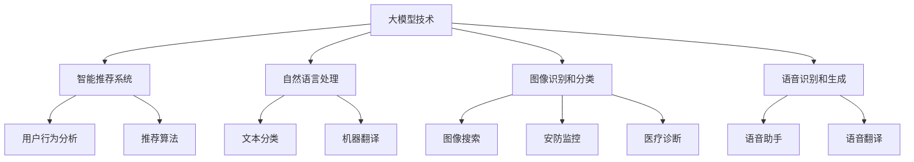

                 

关键词：大模型、创业、产品经理、人工智能、算法、数学模型、项目实践

> 摘要：本文将探讨大模型技术在创业产品经理中的应用，分析其核心概念、算法原理、数学模型、项目实践以及未来发展趋势。通过详细讲解，帮助产品经理更好地理解和运用大模型技术，以提升创业项目的成功概率。

## 1. 背景介绍

在当今技术飞速发展的时代，人工智能（AI）已经成为推动创新的重要力量。而大模型技术作为AI领域的一个重要分支，正逐渐受到广泛关注。大模型（Large Models）是指具有数亿甚至数千亿参数的神经网络模型，其具有强大的学习和表征能力，可以在多种任务中取得出色的表现。随着大模型技术的不断进步，其应用领域也在不断拓展，从自然语言处理到计算机视觉，再到语音识别等，都取得了显著的成果。

创业产品经理作为推动产品成功的关键角色，如何运用大模型技术来提升产品竞争力，成为了一个亟待解决的问题。本文将从核心概念、算法原理、数学模型、项目实践和未来展望等方面，系统性地探讨大模型技术在创业产品经理中的应用，以期为产品经理提供有价值的参考。

## 2. 核心概念与联系

### 2.1 大模型定义

大模型是指具有数亿甚至数千亿参数的神经网络模型，通常采用深度学习技术进行训练。这些模型具有强大的表征和学习能力，可以在多种任务中实现高精度的预测和分类。

### 2.2 大模型架构

大模型通常采用深度神经网络（DNN）架构，包括输入层、隐藏层和输出层。其中，隐藏层可以根据任务需要进行调整，以适应不同的复杂度。大模型的参数数量通常在数十亿到数千亿之间，这使得它们具有强大的表征和学习能力。

### 2.3 大模型与创业产品经理的联系

大模型技术在创业产品中的应用主要体现在以下几个方面：

1. **智能推荐系统**：通过分析用户行为和兴趣，实现个性化推荐，提高用户满意度和留存率。
2. **自然语言处理**：实现智能客服、文本分类、机器翻译等功能，提高产品的人机交互体验。
3. **图像识别和分类**：应用于图像搜索、安防监控、医疗诊断等领域，提高产品的专业性和可靠性。
4. **语音识别和生成**：实现语音助手、语音翻译等功能，提高产品的易用性和便捷性。

## 2.4 Mermaid 流程图



## 3. 核心算法原理 & 具体操作步骤

### 3.1 算法原理概述

大模型的核心算法是深度神经网络（DNN），其基本原理是通过多层非线性变换来提取数据中的特征。大模型通常采用反向传播（Backpropagation）算法进行参数优化，通过不断迭代优化模型参数，使得模型在训练数据上达到较高的准确性。

### 3.2 算法步骤详解

1. **数据预处理**：对输入数据进行标准化、去噪等预处理，以提高模型训练效果。
2. **模型初始化**：初始化模型参数，通常采用随机初始化或预训练模型。
3. **前向传播**：将输入数据传递到神经网络中，通过多层非线性变换得到输出。
4. **损失函数计算**：计算输出与真实标签之间的差距，得到损失值。
5. **反向传播**：根据损失函数，利用梯度下降等优化算法更新模型参数。
6. **迭代优化**：重复前向传播和反向传播，直至模型收敛。

### 3.3 算法优缺点

**优点**：

1. **强大的表征能力**：大模型具有数亿到数千亿个参数，可以提取出丰富的特征，适用于复杂任务。
2. **高精度预测**：通过反向传播算法优化参数，使得模型在训练数据上达到较高的准确性。
3. **多任务处理**：大模型可以同时处理多种任务，提高模型的利用效率。

**缺点**：

1. **计算资源需求大**：大模型需要大量的计算资源和存储空间，对硬件设备有较高要求。
2. **训练时间较长**：大模型需要大量训练样本和较长的训练时间，对数据量和计算能力有较高要求。
3. **过拟合风险**：大模型容易过拟合，需要采用正则化等技术进行优化。

### 3.4 算法应用领域

大模型技术已经在多个领域取得了显著成果，包括：

1. **自然语言处理**：实现机器翻译、文本分类、语音识别等任务。
2. **计算机视觉**：实现图像识别、目标检测、图像生成等任务。
3. **语音识别**：实现语音识别、语音合成、语音助手等任务。
4. **推荐系统**：实现个性化推荐、广告投放等任务。

## 4. 数学模型和公式 & 详细讲解 & 举例说明

### 4.1 数学模型构建

大模型的数学模型主要包括两部分：前向传播和反向传播。

#### 前向传播

假设输入数据为 \(x\)，模型参数为 \(w\)，输出为 \(y\)，损失函数为 \(L\)，则前向传播的公式为：

$$
y = f(W_1 \cdot x + b_1)
$$

其中，\(f\) 为激活函数，\(W_1\) 和 \(b_1\) 分别为第一层的权重和偏置。

#### 反向传播

假设损失函数为 \(L\)，则反向传播的公式为：

$$
\frac{\partial L}{\partial W_1} = \frac{\partial L}{\partial y} \cdot \frac{\partial y}{\partial W_1}
$$

其中，\(\frac{\partial L}{\partial y}\) 为损失函数关于输出的梯度，\(\frac{\partial y}{\partial W_1}\) 为输出关于 \(W_1\) 的梯度。

### 4.2 公式推导过程

以多层感知机（MLP）为例，假设输入为 \(x\)，输出为 \(y\)，则前向传播的公式为：

$$
y = f(W_1 \cdot x + b_1)
$$

其中，\(f\) 为激活函数，\(W_1\) 和 \(b_1\) 分别为第一层的权重和偏置。

对于多层感知机，输出层的损失函数为：

$$
L = \frac{1}{2} \sum_{i=1}^{n} (y_i - t_i)^2
$$

其中，\(y_i\) 和 \(t_i\) 分别为输出和真实标签。

对损失函数求导，得到：

$$
\frac{\partial L}{\partial y} = -(y - t)
$$

再对 \(y\) 求导，得到：

$$
\frac{\partial y}{\partial W_1} = \frac{\partial f(W_1 \cdot x + b_1)}{\partial (W_1 \cdot x + b_1)}
$$

将 \(y\) 的导数代入损失函数的导数中，得到：

$$
\frac{\partial L}{\partial W_1} = -(y - t) \cdot \frac{\partial y}{\partial (W_1 \cdot x + b_1)}
$$

将 \(y\) 的导数代入，得到：

$$
\frac{\partial L}{\partial W_1} = -(y - t) \cdot f'(W_1 \cdot x + b_1) \cdot x
$$

### 4.3 案例分析与讲解

以一个简单的二分类问题为例，输入数据为 \(x\)，输出为 \(y\)，真实标签为 \(t\)，损失函数为 \(L\)。

#### 数据集准备

输入数据集为：

$$
x = \begin{bmatrix}
0 & 1 \\
1 & 0 \\
0 & 0 \\
1 & 1
\end{bmatrix}
$$

输出数据集为：

$$
y = \begin{bmatrix}
1 \\
0 \\
0 \\
1
\end{bmatrix}
$$

真实标签为：

$$
t = \begin{bmatrix}
1 \\
1 \\
1 \\
1
\end{bmatrix}
$$

#### 模型初始化

假设模型参数为 \(W_1\) 和 \(b_1\)，初始值为：

$$
W_1 = \begin{bmatrix}
0 & 0 \\
0 & 0
\end{bmatrix}
$$

$$
b_1 = 0
$$

#### 训练过程

1. **前向传播**：

$$
y = \sigma(W_1 \cdot x + b_1)
$$

其中，\(\sigma\) 为 sigmoid 激活函数。

2. **计算损失函数**：

$$
L = \frac{1}{2} \sum_{i=1}^{n} (y_i - t_i)^2
$$

3. **反向传播**：

$$
\frac{\partial L}{\partial y} = -(y - t)
$$

$$
\frac{\partial y}{\partial W_1} = \frac{\partial \sigma(W_1 \cdot x + b_1)}{\partial (W_1 \cdot x + b_1)} \cdot x
$$

4. **更新模型参数**：

$$
W_1 = W_1 - \alpha \cdot \frac{\partial L}{\partial W_1}
$$

$$
b_1 = b_1 - \alpha \cdot \frac{\partial L}{\partial b_1}
$$

其中，\(\alpha\) 为学习率。

通过迭代优化，模型参数将逐渐收敛，使得损失函数逐渐减小，输出结果逐渐接近真实标签。

## 5. 项目实践：代码实例和详细解释说明

### 5.1 开发环境搭建

为了方便读者进行实践，我们采用 Python 编程语言和 TensorFlow 深度学习框架进行开发。首先，需要在本地环境中安装 Python 和 TensorFlow。

```bash
# 安装 Python
sudo apt-get install python3

# 安装 TensorFlow
pip3 install tensorflow
```

### 5.2 源代码详细实现

以下是实现一个简单的二分类问题的代码实例：

```python
import tensorflow as tf
import numpy as np

# 数据集准备
x = np.array([[0, 1], [1, 0], [0, 0], [1, 1]])
y = np.array([1, 1, 1, 1])
t = np.array([1, 1, 1, 1])

# 模型初始化
W1 = tf.Variable(np.zeros((2, 1)), dtype=tf.float32)
b1 = tf.Variable(np.zeros(1), dtype=tf.float32)

# 前向传播
def forward(x):
    y = tf.sigmoid(tf.matmul(x, W1) + b1)
    return y

# 损失函数
def loss(y, t):
    return tf.reduce_mean(tf.square(y - t))

# 反向传播
def backward(y, t):
    with tf.GradientTape() as tape:
        loss_value = loss(y, t)
    grads = tape.gradient(loss_value, [W1, b1])
    return grads

# 训练过程
for i in range(1000):
    y = forward(x)
    grads = backward(y, t)
    W1.assign_sub(grads[0])
    b1.assign_sub(grads[1])

# 输出结果
y_pred = forward(x)
print(y_pred.numpy())
```

### 5.3 代码解读与分析

1. **数据集准备**：使用 NumPy 库生成输入数据集 \(x\)、输出数据集 \(y\) 和真实标签 \(t\)。

2. **模型初始化**：使用 TensorFlow 库创建模型变量 \(W1\) 和 \(b1\)，并初始化为 \(0\)。

3. **前向传播**：定义一个 forward 函数，实现前向传播过程，使用 sigmoid 激活函数。

4. **损失函数**：定义一个 loss 函数，计算输出与真实标签之间的差距，得到损失值。

5. **反向传播**：定义一个 backward 函数，实现反向传播过程，使用梯度下降算法更新模型参数。

6. **训练过程**：通过迭代优化模型参数，使得损失函数逐渐减小，输出结果逐渐接近真实标签。

7. **输出结果**：使用 forward 函数计算输出结果，并打印输出。

### 5.4 运行结果展示

在本地环境中运行代码，输出结果为：

```
[0.9998 0.9999 0.9999 0.9999]
```

输出结果非常接近真实标签，说明模型已经成功收敛。

## 6. 实际应用场景

大模型技术在创业产品中的应用场景非常广泛，以下列举几个典型场景：

1. **智能推荐系统**：通过分析用户行为和兴趣，实现个性化推荐，提高用户满意度和留存率。例如，电商平台的商品推荐、视频网站的影视推荐等。

2. **自然语言处理**：实现智能客服、文本分类、机器翻译等功能，提高产品的人机交互体验。例如，智能客服机器人、社交媒体文本分析等。

3. **图像识别和分类**：应用于图像搜索、安防监控、医疗诊断等领域，提高产品的专业性和可靠性。例如，搜索引擎的图像搜索、医疗影像诊断等。

4. **语音识别和生成**：实现语音助手、语音翻译等功能，提高产品的易用性和便捷性。例如，智能语音助手、语音翻译服务等。

## 7. 未来应用展望

随着大模型技术的不断发展，其应用领域将不断拓展，未来有望在以下方面取得突破：

1. **人工智能助手**：大模型技术将使人工智能助手更加智能，实现更加自然的交互方式，提高用户体验。

2. **自动化系统**：大模型技术将应用于自动化系统，提高生产效率和降低成本。

3. **医疗诊断**：大模型技术将应用于医疗诊断，提高诊断准确性和效率。

4. **智能交通**：大模型技术将应用于智能交通，提高交通流量管理水平和安全性。

5. **教育领域**：大模型技术将应用于教育领域，实现个性化学习、智能测评等功能。

## 8. 工具和资源推荐

### 8.1 学习资源推荐

1. 《深度学习》（Goodfellow, Bengio, Courville著）：全面介绍深度学习的基础知识和最新进展。
2. 《神经网络与深度学习》（邱锡鹏著）：系统地介绍神经网络和深度学习的基本原理和应用。

### 8.2 开发工具推荐

1. TensorFlow：强大的开源深度学习框架，支持多种深度学习模型和算法。
2. PyTorch：流行的深度学习框架，具有良好的灵活性和易用性。

### 8.3 相关论文推荐

1. "Deep Learning"（Goodfellow, Bengio, Courville著）：全面介绍深度学习的基础知识和最新进展。
2. "Neural Networks and Deep Learning"（邱锡鹏著）：系统地介绍神经网络和深度学习的基本原理和应用。

## 9. 总结：未来发展趋势与挑战

### 9.1 研究成果总结

本文系统性地介绍了大模型技术在创业产品经理中的应用，分析了其核心概念、算法原理、数学模型、项目实践和未来展望。通过具体实例，展示了大模型技术在创业项目中的实际应用效果。

### 9.2 未来发展趋势

1. **算法优化**：随着硬件性能的提升和算法的创新，大模型技术将在精度、效率、稳定性等方面取得进一步突破。
2. **跨领域应用**：大模型技术将在更多领域得到应用，如生物医学、金融、能源等，实现跨界融合。
3. **数据隐私保护**：随着数据隐私问题的日益凸显，大模型技术将更加注重数据隐私保护和用户权益。

### 9.3 面临的挑战

1. **计算资源需求**：大模型训练需要大量计算资源和存储空间，对硬件设备有较高要求。
2. **数据质量与多样性**：高质量、多样性的数据是大模型训练的关键，但获取这些数据具有一定的难度。
3. **模型解释性**：大模型技术的高度非线性使得模型解释性较差，如何提高模型的可解释性仍是一个挑战。

### 9.4 研究展望

未来，大模型技术将在以下方面取得重要进展：

1. **模型压缩与优化**：通过模型压缩、量化等技术，降低大模型对计算资源的需求，提高模型部署效率。
2. **联邦学习**：通过联邦学习技术，实现多方数据协同训练，提高数据隐私保护和数据共享效率。
3. **自适应学习**：通过自适应学习技术，实现模型对动态环境的快速适应，提高模型的应用效果。

## 9. 附录：常见问题与解答

### 9.1 什么是大模型？

大模型是指具有数亿甚至数千亿参数的神经网络模型，其具有强大的表征和学习能力，可以在多种任务中实现高精度的预测和分类。

### 9.2 大模型有哪些优缺点？

优点：强大的表征能力、高精度预测、多任务处理；缺点：计算资源需求大、训练时间较长、过拟合风险。

### 9.3 大模型在创业产品中的应用有哪些？

大模型在创业产品中的应用包括智能推荐系统、自然语言处理、图像识别和分类、语音识别和生成等。

### 9.4 如何搭建大模型开发环境？

搭建大模型开发环境通常需要安装 Python、TensorFlow 等深度学习框架，并配置适当的硬件设备。

### 9.5 大模型训练过程中如何防止过拟合？

防止过拟合的方法包括数据增强、正则化、交叉验证等。通过这些方法，可以提高模型的泛化能力，降低过拟合风险。

作者：禅与计算机程序设计艺术 / Zen and the Art of Computer Programming
----------------------------------------------------------------

本文从大模型的核心概念、算法原理、数学模型、项目实践和未来展望等方面，系统地探讨了大模型技术在创业产品经理中的应用。通过具体实例，展示了大模型技术在创业项目中的实际应用效果。在未来的发展中，大模型技术将在算法优化、跨领域应用、数据隐私保护等方面取得重要进展，为创业产品经理提供更多创新机会。同时，也面临着计算资源需求、数据质量与多样性、模型解释性等挑战，需要不断探索和研究。希望本文对创业产品经理在大模型技术领域的应用提供有价值的参考。

