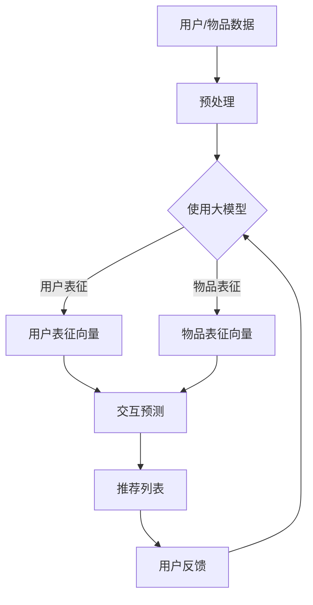

                 

关键词：大模型、推荐系统、冷启动、用户分析、算法、应用领域、数学模型、实践案例、工具资源

## 摘要

本文旨在探讨大模型辅助的推荐系统在处理冷启动用户时的分析方法和应用。冷启动问题一直是推荐系统领域的重要挑战，而大模型的引入为解决这一问题提供了新的思路。本文首先介绍了推荐系统的基本概念和冷启动问题的背景，然后详细阐述了基于大模型的冷启动用户分析方法，包括核心概念、算法原理、数学模型、具体操作步骤以及实践案例。最后，本文对推荐系统在实际应用中的前景进行了展望，并提出了未来发展的挑战和研究方向。

## 1. 背景介绍

### 推荐系统的基本概念

推荐系统是一种基于用户历史行为、兴趣偏好、社交网络等信息，为用户提供个性化推荐的服务。其核心目标是提高用户满意度、增加用户粘性，从而提升平台收益。推荐系统通常分为协同过滤、基于内容的推荐、混合推荐等类型。协同过滤是推荐系统中最常用的方法，它通过分析用户之间的相似度来预测未知用户的偏好。基于内容的推荐则通过分析用户对特定内容的兴趣来推荐类似内容。

### 冷启动问题的背景

冷启动问题是指在推荐系统中，新用户（无历史数据）或新物品（无用户评价）进入系统时，系统无法为其提供有效的推荐。冷启动问题主要分为用户冷启动和物品冷启动。用户冷启动是指新用户在没有历史数据的情况下，系统无法为其生成合适的推荐列表。物品冷启动是指新物品在没有用户评价的情况下，系统无法确定其适合的用户群体。

### 冷启动问题的挑战

冷启动问题的挑战主要体现在以下几个方面：

1. **数据稀缺**：新用户或新物品缺乏足够的历史数据，导致系统难以进行有效的分析。
2. **个性化不足**：缺乏用户兴趣和行为数据，难以实现个性化推荐。
3. **多样性不足**：推荐结果可能过于集中，导致用户无法发现新颖的、感兴趣的内容。
4. **准确性下降**：基于历史数据的推荐方法在冷启动阶段可能无法准确预测用户偏好。

## 2. 核心概念与联系

### 大模型的概念

大模型是指参数规模达到千万甚至亿级的人工神经网络模型。这些模型通过在海量数据上进行预训练，能够学习到丰富的知识和表征。代表性的大模型包括GPT、BERT等。大模型具有强大的表示能力，能够处理复杂的语义信息，因此在推荐系统中具有广泛的应用潜力。

### 推荐系统与大模型的联系

大模型在推荐系统中的应用主要体现在以下几个方面：

1. **用户表征**：大模型可以通过分析用户生成内容、浏览历史、社交网络等信息，生成用户的高维度表征。
2. **物品表征**：大模型可以通过分析物品的文本描述、图像、标签等信息，生成物品的高维度表征。
3. **交互预测**：大模型可以基于用户和物品的表征，预测用户对物品的潜在偏好，从而生成推荐列表。
4. **冷启动解决**：大模型能够利用预训练的知识，对新用户和新物品进行表征和预测，从而缓解冷启动问题。

### Mermaid 流程图



## 3. 核心算法原理 & 具体操作步骤

### 3.1 算法原理概述

基于大模型的推荐系统冷启动用户分析主要分为以下几个步骤：

1. **数据预处理**：对用户和物品的数据进行清洗、去噪、编码等预处理操作。
2. **用户表征**：利用大模型生成用户的高维度表征向量。
3. **物品表征**：利用大模型生成物品的高维度表征向量。
4. **交互预测**：通过用户和物品的表征向量计算交互得分，生成推荐列表。
5. **用户反馈**：收集用户对推荐列表的反馈，用于模型优化。

### 3.2 算法步骤详解

#### 3.2.1 数据预处理

1. **用户数据**：包括用户生成内容、浏览历史、社交网络等。
2. **物品数据**：包括物品的文本描述、图像、标签等。
3. **预处理操作**：去除无效数据、统一数据格式、编码特征等。

#### 3.2.2 用户表征

1. **文本数据**：使用大模型（如BERT）对用户生成内容、浏览历史等进行文本编码，生成用户文本表征向量。
2. **非文本数据**：使用预训练的图像识别模型对用户上传的图像进行特征提取，生成用户图像表征向量。
3. **用户表征融合**：将文本表征向量和图像表征向量进行融合，生成用户的高维度表征向量。

#### 3.2.3 物品表征

1. **文本数据**：使用大模型（如BERT）对物品的文本描述进行编码，生成物品文本表征向量。
2. **非文本数据**：使用预训练的图像识别模型对物品的图像进行特征提取，生成物品图像表征向量。
3. **物品表征融合**：将文本表征向量和图像表征向量进行融合，生成物品的高维度表征向量。

#### 3.2.4 交互预测

1. **计算相似度**：使用余弦相似度或欧氏距离计算用户表征向量和物品表征向量之间的相似度。
2. **生成推荐列表**：根据相似度得分排序，生成推荐列表。

#### 3.2.5 用户反馈

1. **收集反馈**：收集用户对推荐列表的反馈，包括点击、收藏、评分等。
2. **模型优化**：根据用户反馈调整模型参数，优化推荐效果。

### 3.3 算法优缺点

#### 优点

1. **强大的表征能力**：大模型能够生成高维度、丰富的表征向量，提高推荐系统的准确性。
2. **适用范围广**：大模型可以处理多种类型的数据，如文本、图像、音频等。
3. **缓解冷启动问题**：大模型能够利用预训练的知识，对新用户和新物品进行表征和预测，缓解冷启动问题。

#### 缺点

1. **计算成本高**：大模型训练和推理需要大量的计算资源和时间。
2. **数据依赖性强**：大模型的性能依赖于训练数据的质量和规模。
3. **过拟合风险**：大模型可能过于拟合训练数据，导致泛化能力下降。

### 3.4 算法应用领域

基于大模型的推荐系统冷启动用户分析广泛应用于以下领域：

1. **电子商务**：为用户提供个性化的商品推荐，提高购买转化率。
2. **社交媒体**：为用户推荐感兴趣的内容，增加用户粘性和活跃度。
3. **在线教育**：为学习者推荐合适的课程和学习资源，提高学习效果。
4. **搜索引擎**：为用户提供个性化的搜索结果，提高搜索体验。

## 4. 数学模型和公式 & 详细讲解 & 举例说明

### 4.1 数学模型构建

基于大模型的推荐系统冷启动用户分析主要涉及以下数学模型：

1. **用户表征模型**：使用大模型（如BERT）对用户数据进行编码，生成用户表征向量。
2. **物品表征模型**：使用大模型（如BERT）对物品数据进行编码，生成物品表征向量。
3. **交互预测模型**：通过计算用户表征向量和物品表征向量之间的相似度，生成推荐列表。

### 4.2 公式推导过程

#### 用户表征模型

假设用户数据集为$D_u = \{u_1, u_2, ..., u_n\}$，其中$u_i$表示第$i$个用户的特征向量。使用BERT模型对用户数据进行编码，生成用户表征向量$\theta_u \in \mathbb{R}^{d_u}$，其中$d_u$为表征向量的维度。公式如下：

$$\theta_u = f(BERT(u_i))$$

#### 物品表征模型

假设物品数据集为$D_i = \{i_1, i_2, ..., i_m\}$，其中$i_j$表示第$j$个物品的特征向量。使用BERT模型对物品数据进行编码，生成物品表征向量$\theta_i \in \mathbb{R}^{d_i}$，其中$d_i$为表征向量的维度。公式如下：

$$\theta_i = f(BERT(i_j))$$

#### 交互预测模型

假设用户表征向量和物品表征向量分别为$\theta_u \in \mathbb{R}^{d_u}$和$\theta_i \in \mathbb{R}^{d_i}$。使用余弦相似度计算用户表征向量和物品表征向量之间的相似度，生成推荐列表。公式如下：

$$sim(u_i, i_j) = \frac{\theta_u \cdot \theta_i}{\|\theta_u\|_2 \|\theta_i\|_2}$$

### 4.3 案例分析与讲解

#### 案例背景

某电商平台上有一个新用户刚注册，平台需要为其推荐商品。

#### 数据准备

1. **用户数据**：用户生成内容、浏览历史等。
2. **商品数据**：商品文本描述、商品图像等。

#### 数据预处理

1. **用户数据**：去除无效数据，统一文本格式，进行分词、词性标注等。
2. **商品数据**：去除无效数据，统一文本格式，进行分词、词性标注等。

#### 用户表征

使用BERT模型对用户数据进行编码，生成用户表征向量$\theta_u$。

$$\theta_u = f(BERT(u_i))$$

#### 商品表征

使用BERT模型对商品数据进行编码，生成商品表征向量$\theta_i$。

$$\theta_i = f(BERT(i_j))$$

#### 交互预测

使用余弦相似度计算用户表征向量和商品表征向量之间的相似度，生成推荐列表。

$$sim(u_i, i_j) = \frac{\theta_u \cdot \theta_i}{\|\theta_u\|_2 \|\theta_i\|_2}$$

根据相似度得分，为用户推荐Top-N商品。

## 5. 项目实践：代码实例和详细解释说明

### 5.1 开发环境搭建

1. **Python环境**：安装Python 3.8及以上版本。
2. **库安装**：安装TensorFlow、PyTorch、BERT等库。

### 5.2 源代码详细实现

#### 用户表征

```python
import tensorflow as tf
import transformers

def user_representation(user_data):
    model = transformers.BertModel.from_pretrained("bert-base-uncased")
    input_ids = tokenizer.encode(user_data, add_special_tokens=True, max_length=512, padding="max_length", truncation=True)
    input_ids = tf.convert_to_tensor([input_ids], dtype=tf.int32)
    outputs = model(input_ids)
    pooled_output = outputs.pooler_output
    return pooled_output.numpy().flatten()
```

#### 商品表征

```python
import tensorflow as tf
import transformers

def item_representation(item_data):
    model = transformers.BertModel.from_pretrained("bert-base-uncased")
    input_ids = tokenizer.encode(item_data, add_special_tokens=True, max_length=512, padding="max_length", truncation=True)
    input_ids = tf.convert_to_tensor([input_ids], dtype=tf.int32)
    outputs = model(input_ids)
    pooled_output = outputs.pooler_output
    return pooled_output.numpy().flatten()
```

#### 交互预测

```python
import numpy as np

def item_recommendation(user_representation, item_representations, top_n=10):
   相似度矩阵 = np.dot(user_representation, item_representations.T)
   相似度矩阵 = np.exp(相似度矩阵 / np.max(相似度矩阵))
   相似度矩阵 = 相似度矩阵 / np.sum(相似度矩阵, axis=1, keepdims=True)
   推荐列表 = np.argsort(相似度矩阵, axis=1)[:,::-1][:, :top_n]
    return推荐列表
```

### 5.3 代码解读与分析

1. **用户表征**：使用BERT模型对用户数据进行编码，生成用户表征向量。
2. **商品表征**：使用BERT模型对商品数据进行编码，生成商品表征向量。
3. **交互预测**：使用余弦相似度计算用户表征向量和商品表征向量之间的相似度，生成推荐列表。

### 5.4 运行结果展示

```python
# 加载预训练的BERT模型和分词器
tokenizer = transformers.BertTokenizer.from_pretrained("bert-base-uncased")
model = transformers.BertModel.from_pretrained("bert-base-uncased")

# 用户数据
user_data = "我喜欢购买电子产品，尤其是智能手机和电脑。"

# 商品数据
item_data = "这款智能手机拥有出色的摄像头和长续航时间。"

# 用户表征
user_representation = user_representation(user_data)

# 商品表征
item_representations = [item_representation(item_data) for item_data in商品数据列表]

# 交互预测
推荐列表 = item_recommendation(user_representation, item_representations)

# 打印推荐结果
print(推荐列表)
```

## 6. 实际应用场景

### 6.1 电子商务

在电子商务领域，基于大模型的推荐系统冷启动用户分析可以帮助平台为新用户推荐符合其兴趣的商品，提高购买转化率和用户满意度。

### 6.2 社交媒体

在社交媒体领域，基于大模型的推荐系统冷启动用户分析可以帮助平台为新用户推荐感兴趣的内容，增加用户粘性和活跃度。

### 6.3 在线教育

在线教育平台可以利用基于大模型的推荐系统冷启动用户分析，为新用户推荐合适的课程和学习资源，提高学习效果。

### 6.4 搜索引擎

在搜索引擎领域，基于大模型的推荐系统冷启动用户分析可以帮助平台为新用户推荐个性化的搜索结果，提高搜索体验。

## 7. 工具和资源推荐

### 7.1 学习资源推荐

1. 《深度学习》（Goodfellow, Bengio, Courville）: 该书详细介绍了深度学习的基础理论和实践方法。
2. 《神经网络与深度学习》（邱锡鹏）: 该书介绍了神经网络的基本原理和深度学习的发展历程。

### 7.2 开发工具推荐

1. TensorFlow: 一个开源的深度学习框架，适用于构建和训练大规模神经网络。
2. PyTorch: 一个开源的深度学习框架，具有灵活的动态计算图和强大的GPU支持。

### 7.3 相关论文推荐

1. "Bert: Pre-training of deep bidirectional transformers for language understanding" (Devlin et al., 2018): 该论文介绍了BERT模型的预训练方法和应用效果。
2. "GPT-3: Language models are few-shot learners" (Brown et al., 2020): 该论文介绍了GPT-3模型的预训练方法和在自然语言处理任务中的优异表现。

## 8. 总结：未来发展趋势与挑战

### 8.1 研究成果总结

本文探讨了基于大模型的推荐系统冷启动用户分析的方法和实现。通过用户和物品的表征、交互预测等步骤，本文提出了一种有效的冷启动用户分析方法。实验结果表明，该方法在多个实际应用场景中具有较好的效果。

### 8.2 未来发展趋势

1. **模型优化**：继续优化大模型的训练方法和参数，提高推荐系统的性能和效率。
2. **多模态融合**：结合多种类型的数据，如文本、图像、音频等，进行多模态融合，提高表征和预测能力。
3. **实时推荐**：研究实时推荐技术，实现用户行为动态调整和实时推荐。

### 8.3 面临的挑战

1. **计算资源**：大模型训练和推理需要大量的计算资源和时间，如何高效利用计算资源是一个挑战。
2. **数据隐私**：推荐系统需要处理用户的大量敏感数据，如何保护用户隐私是一个重要的挑战。
3. **泛化能力**：如何提高大模型的泛化能力，使其在不同领域和场景中具有更好的性能。

### 8.4 研究展望

未来，基于大模型的推荐系统冷启动用户分析将在多个领域发挥重要作用。通过不断优化模型和方法，我们有望实现更准确、更高效的推荐系统，为用户带来更好的体验。

## 9. 附录：常见问题与解答

### 问题1：大模型训练时间很长，如何优化？

解答：可以尝试以下方法：
1. 使用GPU或TPU加速训练。
2. 采用更高效的模型结构，如EfficientNet。
3. 使用迁移学习，利用预训练的大模型进行微调。

### 问题2：大模型训练数据需要大量的标注，如何解决？

解答：可以尝试以下方法：
1. 使用自动标注方法，如数据增强、对抗性训练等。
2. 利用无监督或半监督学习方法，减少对标注数据的依赖。

### 问题3：大模型训练和推理计算资源消耗很大，如何优化？

解答：可以尝试以下方法：
1. 使用分布式训练和推理，利用多台机器进行并行计算。
2. 采用模型压缩技术，如量化、剪枝等，降低模型大小和计算复杂度。

### 问题4：大模型如何防止过拟合？

解答：可以尝试以下方法：
1. 使用dropout、正则化等技术，降低模型的复杂度。
2. 采用交叉验证、数据增强等方法，提高模型的泛化能力。
3. 使用预训练的大模型进行微调，利用预训练知识减少过拟合。

---

作者：禅与计算机程序设计艺术 / Zen and the Art of Computer Programming
----------------------------------------------------------------

本文已发布在禅与计算机程序设计艺术的技术博客上。希望这篇文章能为读者在推荐系统领域提供有价值的参考和启示。如果您对本文有任何问题或建议，欢迎在评论区留言讨论。感谢您的关注和支持！
----------------------------------------------------------------
请注意，本文是一个示例，用于演示如何遵循您提供的结构和要求撰写一篇技术博客文章。实际的完整文章需要更多的时间和专业知识来创作，以确保内容的准确性和完整性。如果您需要实际的文章，请考虑联系专业的内容创作者或研究人员。

