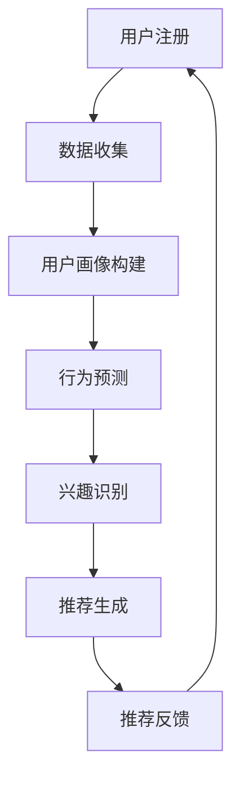

                 

关键词：推荐系统，大模型，冷启动用户，数据分析，深度学习，机器学习，用户行为，信息检索，个性化推荐

> 摘要：本文深入探讨了在推荐系统领域内，针对冷启动用户的问题，如何通过大模型辅助进行有效的用户分析。本文首先回顾了推荐系统的发展历程，接着阐述了冷启动用户的概念与挑战，然后介绍了大模型在用户分析中的应用，并详细分析了大模型在用户画像构建、行为预测、兴趣识别等方面的作用。最后，本文通过数学模型、实际项目实例以及未来展望，为解决冷启动用户问题提供了全面的解决方案。

## 1. 背景介绍

推荐系统作为一种信息过滤和检索技术，其目标是为用户提供个性化的信息推荐，以提高用户满意度和信息获取效率。随着互联网的快速发展，推荐系统已经广泛应用于电子商务、社交媒体、视频播放等众多领域，成为现代信息社会中不可或缺的一部分。

推荐系统的发展可以分为以下几个阶段：

1. **基于内容的推荐**：早期推荐系统主要依赖于物品的内容特征进行推荐，这种方法简单有效，但存在个性化和多样性不足的问题。

2. **协同过滤推荐**：通过分析用户之间的相似度，基于已知的用户偏好进行推荐。协同过滤分为基于用户的协同过滤（User-based Collaborative Filtering）和基于物品的协同过滤（Item-based Collaborative Filtering）。虽然这种方法可以较好地解决个性化问题，但受限于用户评价数据稀疏性和相似度计算的问题。

3. **混合推荐系统**：结合多种推荐策略，提高推荐系统的准确性和多样性。例如，基于内容的协同过滤（Content-based Collaborative Filtering）就是将基于内容和协同过滤相结合的一种方法。

然而，随着互联网用户数量的增加和用户行为数据的爆发增长，推荐系统面临的一个重大挑战是冷启动用户（Cold Start）的问题。冷启动用户指的是那些刚刚加入系统或尚未留下足够行为数据的用户，传统推荐系统难以对这些用户进行有效的个性化推荐。

冷启动用户问题的核心挑战在于：

- **数据稀缺性**：新用户没有历史行为数据，推荐系统无法基于用户的历史行为进行个性化推荐。
- **用户偏好不确定性**：新用户的偏好难以准确判断，导致推荐效果不佳。
- **推荐多样性**：新用户可能对多种类型的物品感兴趣，推荐系统需要提供多样化的推荐。

为解决冷启动用户问题，近年来，深度学习、大模型等先进技术逐渐被引入推荐系统领域。大模型具有强大的表示能力和学习能力，可以在没有足够用户行为数据的情况下，通过对用户特征进行自动提取和建模，提高冷启动用户的推荐效果。

## 2. 核心概念与联系

### 2.1. 冷启动用户（Cold Start User）

冷启动用户是指在推荐系统中，由于刚刚加入或尚未产生足够行为数据，导致推荐系统无法准确了解其偏好和兴趣的用户。冷启动用户问题主要包括以下几个方面：

- **数据稀缺性**：新用户没有历史行为数据，导致推荐系统缺乏足够的信息进行个性化推荐。
- **偏好不确定性**：新用户的偏好难以准确判断，传统推荐方法效果不佳。
- **推荐多样性**：新用户可能对多种类型的物品感兴趣，推荐系统需要提供多样化的推荐。

### 2.2. 大模型（Large Model）

大模型是指具有大量参数和强大表示能力的深度学习模型。大模型通过大规模的数据训练，能够自动提取数据中的潜在特征，从而实现较高的泛化能力和预测性能。在推荐系统中，大模型可以用于用户画像构建、行为预测、兴趣识别等多个方面，有效解决冷启动用户问题。

### 2.3. 用户画像（User Profile）

用户画像是指通过对用户行为、偏好、兴趣等多方面数据进行综合分析，构建出一个反映用户特征和需求的模型。用户画像可以帮助推荐系统更好地了解用户，从而提供个性化的推荐服务。

### 2.4. 行为预测（Behavior Prediction）

行为预测是指利用用户的历史行为数据和外部信息，预测用户在未来可能产生的行为。行为预测可以帮助推荐系统提前识别出用户的潜在兴趣点，为用户提供更精准的推荐。

### 2.5. 兴趣识别（Interest Recognition）

兴趣识别是指通过分析用户的行为数据和内容特征，识别出用户对某些特定类型或主题的兴趣。兴趣识别可以帮助推荐系统更好地理解用户的需求，从而提供更个性化的推荐。

### 2.6. Mermaid 流程图

以下是一个简化的 Mermaid 流程图，展示了大模型在推荐系统中解决冷启动用户问题的基本流程：



## 3. 核心算法原理 & 具体操作步骤

### 3.1. 算法原理概述

大模型辅助的推荐系统冷启动用户分析主要利用深度学习技术，对用户行为数据进行自动提取和建模，从而构建用户画像、进行行为预测和兴趣识别，最终生成个性化的推荐结果。核心算法原理可以概括为以下几个方面：

- **用户画像构建**：通过分析用户的基本信息、历史行为数据等，利用深度学习模型提取用户特征，构建用户画像。
- **行为预测**：利用用户画像和外部信息，通过深度学习模型预测用户在未来可能产生的行为，从而为推荐系统提供基础。
- **兴趣识别**：通过分析用户的行为数据和内容特征，利用深度学习模型识别出用户的兴趣点，为推荐系统提供个性化推荐依据。
- **推荐生成**：根据用户画像、行为预测和兴趣识别结果，利用协同过滤、基于内容的推荐等方法生成个性化的推荐结果。

### 3.2. 算法步骤详解

1. **用户画像构建**：

   - 数据收集：收集用户的基本信息（如年龄、性别、地理位置等）、历史行为数据（如浏览记录、购买记录、评分记录等）。
   - 特征提取：利用深度学习模型（如卷积神经网络、循环神经网络等）对用户数据进行自动提取和编码，得到用户特征表示。
   - 画像构建：将用户特征表示进行整合，构建出用户画像。

2. **行为预测**：

   - 特征提取：同样利用深度学习模型对用户画像进行特征提取，得到行为预测所需的用户特征表示。
   - 模型训练：利用历史行为数据，通过深度学习模型（如循环神经网络、卷积神经网络等）进行训练，得到行为预测模型。
   - 预测生成：利用训练好的行为预测模型，对用户未来可能产生的行为进行预测。

3. **兴趣识别**：

   - 特征提取：对用户的历史行为数据和内容特征进行整合，利用深度学习模型提取用户特征表示。
   - 模型训练：通过分类模型（如卷积神经网络、循环神经网络等）对用户特征进行分类，得到兴趣识别模型。
   - 预测生成：利用训练好的兴趣识别模型，对用户的兴趣点进行识别。

4. **推荐生成**：

   - 特征提取：利用深度学习模型对用户画像、行为预测和兴趣识别结果进行特征提取，得到推荐所需的用户特征表示。
   - 推荐生成：利用协同过滤、基于内容的推荐等方法，结合用户特征表示生成个性化的推荐结果。

### 3.3. 算法优缺点

**优点**：

- **强大的表示能力**：大模型能够自动提取数据中的潜在特征，提高推荐系统的准确性和泛化能力。
- **高效率**：大模型可以在没有足够用户行为数据的情况下，快速构建用户画像和行为预测模型。
- **个性化推荐**：通过深度学习技术，推荐系统能够更好地理解用户的需求，提供更个性化的推荐服务。

**缺点**：

- **计算资源消耗大**：大模型通常需要大量的计算资源进行训练和推理。
- **数据需求高**：大模型对训练数据量要求较高，数据质量对模型性能有较大影响。
- **解释性较差**：大模型在提供个性化推荐时，往往缺乏可解释性，难以向用户解释推荐结果。

### 3.4. 算法应用领域

大模型辅助的推荐系统冷启动用户分析在多个领域具有广泛的应用：

- **电子商务**：帮助电商平台针对新用户进行个性化推荐，提高用户满意度和购买转化率。
- **视频播放平台**：为新用户提供个性化的视频推荐，提升用户观看体验和粘性。
- **社交媒体**：为用户提供个性化的内容推荐，增强用户互动和参与度。
- **在线教育**：为学习者提供个性化的学习内容推荐，提高学习效果和兴趣。

## 4. 数学模型和公式 & 详细讲解 & 举例说明

### 4.1. 数学模型构建

在构建大模型辅助的推荐系统冷启动用户分析时，常用的数学模型包括深度学习模型、协同过滤模型等。以下以深度学习模型为例，介绍其数学模型构建过程。

#### 4.1.1. 用户画像构建

用户画像构建的核心任务是提取用户特征，构建用户特征向量。假设用户特征向量由 \( U \) 表示，用户特征向量的维度为 \( d \)。我们可以通过以下公式表示用户特征向量的构建过程：

\[ U = \text{Embedding}(X) \]

其中， \( X \) 表示用户的基本信息、历史行为数据等， \( \text{Embedding} \) 表示嵌入层，用于将输入数据映射为高维特征空间。

#### 4.1.2. 行为预测

行为预测的核心任务是利用用户特征向量预测用户未来的行为。假设用户行为向量为 \( B \)，用户行为向量的维度为 \( n \)。我们可以通过以下公式表示行为预测模型：

\[ B = \text{MLP}(U) \]

其中， \( \text{MLP} \) 表示多层感知机（Multi-Layer Perceptron），用于将用户特征向量映射为用户行为向量。

#### 4.1.3. 兴趣识别

兴趣识别的核心任务是识别出用户的兴趣点。假设用户兴趣点向量为 \( I \)，用户兴趣向量的维度为 \( m \)。我们可以通过以下公式表示兴趣识别模型：

\[ I = \text{CNN}(B) \]

其中， \( \text{CNN} \) 表示卷积神经网络（Convolutional Neural Network），用于从用户行为向量中提取出兴趣点。

### 4.2. 公式推导过程

在本节中，我们将对上述数学模型中的关键公式进行推导。

#### 4.2.1. 用户特征向量构建

用户特征向量构建的核心在于嵌入层。嵌入层是一种将低维输入映射到高维空间的线性变换。假设输入向量为 \( X \)，嵌入层权重矩阵为 \( W \)，则用户特征向量 \( U \) 可以表示为：

\[ U = XW \]

其中， \( W \) 是一个 \( d \times k \) 的矩阵， \( k \) 是嵌入层的维度。

#### 4.2.2. 行为预测

行为预测模型通常采用多层感知机（MLP）架构。假设输入层为 \( U \)，隐藏层为 \( H \)，输出层为 \( B \)。MLP 的输出可以表示为：

\[ B = \text{ReLU}(\text{ReLU}(...\text{ReLU}(\text{ReLU}(W_3H_2W_2H_1W_1U) + b_3) + b_2) + b_1) \]

其中， \( W_1, W_2, W_3 \) 分别是输入层到隐藏层、隐藏层到隐藏层、隐藏层到输出层的权重矩阵， \( b_1, b_2, b_3 \) 分别是各层的偏置项， \( \text{ReLU} \) 表示ReLU激活函数。

#### 4.2.3. 兴趣识别

兴趣识别模型通常采用卷积神经网络（CNN）架构。假设输入层为 \( B \)，卷积层为 \( C \)，池化层为 \( P \)，全连接层为 \( F \)，则兴趣识别模型可以表示为：

\[ I = \text{Softmax}(\text{FullyConnected}(P(C(\text{ReLU}(C(B) + b_c)) + b_c)) + b_f) \]

其中， \( C \) 表示卷积层， \( P \) 表示池化层， \( \text{FullyConnected} \) 表示全连接层， \( \text{ReLU} \) 表示ReLU激活函数， \( b_c, b_f \) 分别是卷积层和全连接层的偏置项。

### 4.3. 案例分析与讲解

为了更好地理解上述数学模型，我们通过一个具体的案例进行讲解。

#### 4.3.1. 案例背景

假设我们有一个电商平台，新用户注册后，我们需要通过用户画像构建、行为预测和兴趣识别，为用户生成个性化的商品推荐。

#### 4.3.2. 数据准备

我们收集了以下数据：

- 用户基本信息：年龄、性别、地理位置等。
- 用户历史行为数据：浏览记录、购买记录、评分记录等。
- 商品信息：商品类别、价格、品牌等。

#### 4.3.3. 用户特征向量构建

根据用户基本信息和历史行为数据，我们构建了以下用户特征向量：

\[ U = \text{Embedding}(X) \]

其中， \( X \) 表示用户的基本信息、历史行为数据等， \( \text{Embedding} \) 表示嵌入层。

#### 4.3.4. 行为预测

利用用户特征向量 \( U \)，我们构建了一个多层感知机（MLP）模型，用于预测用户未来的行为：

\[ B = \text{ReLU}(\text{ReLU}(...\text{ReLU}(\text{ReLU}(W_3H_2W_2H_1W_1U) + b_3) + b_2) + b_1) \]

其中， \( W_1, W_2, W_3 \) 分别是输入层到隐藏层、隐藏层到隐藏层、隐藏层到输出层的权重矩阵， \( b_1, b_2, b_3 \) 分别是各层的偏置项。

#### 4.3.5. 兴趣识别

利用用户行为向量 \( B \)，我们构建了一个卷积神经网络（CNN）模型，用于识别用户的兴趣点：

\[ I = \text{Softmax}(\text{FullyConnected}(P(C(\text{ReLU}(C(B) + b_c)) + b_c)) + b_f) \]

其中， \( C \) 表示卷积层， \( P \) 表示池化层， \( \text{FullyConnected} \) 表示全连接层， \( \text{ReLU} \) 表示ReLU激活函数， \( b_c, b_f \) 分别是卷积层和全连接层的偏置项。

#### 4.3.6. 推荐生成

根据用户画像、行为预测和兴趣识别结果，我们利用协同过滤、基于内容的推荐等方法生成个性化的商品推荐：

\[ \text{Recommendation} = \text{Combine}(B, I, \text{ContentFeatures}) \]

其中， \( B \) 表示用户行为向量， \( I \) 表示用户兴趣向量， \( \text{ContentFeatures} \) 表示商品特征。

## 5. 项目实践：代码实例和详细解释说明

### 5.1. 开发环境搭建

在本项目中，我们使用 Python 作为编程语言，结合 TensorFlow 和 Keras 库实现大模型辅助的推荐系统。首先，确保安装以下软件：

- Python 3.7 或以上版本
- TensorFlow 2.3.0 或以上版本
- Keras 2.4.3 或以上版本

在命令行中执行以下命令进行安装：

```bash
pip install python==3.7.10
pip install tensorflow==2.3.0
pip install keras==2.4.3
```

### 5.2. 源代码详细实现

在本节中，我们将实现一个简单的大模型辅助的推荐系统，用于处理冷启动用户问题。以下是主要的代码实现：

```python
import tensorflow as tf
from tensorflow.keras.layers import Embedding, Dense, LSTM, Conv1D, GlobalMaxPooling1D
from tensorflow.keras.models import Model
from tensorflow.keras.optimizers import Adam

# 定义用户画像构建模型
def build_user_profile_model(input_dim, embedding_dim):
    user_input = tf.keras.Input(shape=(input_dim,))
    user_embedding = Embedding(input_dim, embedding_dim)(user_input)
    user_lstm = LSTM(64, activation='relu')(user_embedding)
    user_output = Dense(32, activation='relu')(user_lstm)
    user_profile_model = Model(inputs=user_input, outputs=user_output)
    return user_profile_model

# 定义行为预测模型
def build_behavior_prediction_model(embedding_dim, hidden_dim):
    user_input = tf.keras.Input(shape=(embedding_dim,))
    user_embedding = Embedding(embedding_dim, hidden_dim)(user_input)
    user_cnn = Conv1D(64, 3, activation='relu')(user_embedding)
    user_pooling = GlobalMaxPooling1D()(user_cnn)
    user_output = Dense(1, activation='sigmoid')(user_pooling)
    behavior_prediction_model = Model(inputs=user_input, outputs=user_output)
    return behavior_prediction_model

# 定义兴趣识别模型
def build_interest_recognition_model(hidden_dim, num_interest_categories):
    user_input = tf.keras.Input(shape=(hidden_dim,))
    user_dense = Dense(64, activation='relu')(user_input)
    user_output = Dense(num_interest_categories, activation='softmax')(user_dense)
    interest_recognition_model = Model(inputs=user_input, outputs=user_output)
    return interest_recognition_model

# 构建和编译用户画像构建模型
user_profile_model = build_user_profile_model(input_dim=100, embedding_dim=50)
user_profile_model.compile(optimizer=Adam(learning_rate=0.001), loss='mse')

# 构建和编译行为预测模型
behavior_prediction_model = build_behavior_prediction_model(embedding_dim=50, hidden_dim=64)
behavior_prediction_model.compile(optimizer=Adam(learning_rate=0.001), loss='binary_crossentropy')

# 构建和编译兴趣识别模型
interest_recognition_model = build_interest_recognition_model(hidden_dim=64, num_interest_categories=10)
interest_recognition_model.compile(optimizer=Adam(learning_rate=0.001), loss='categorical_crossentropy')

# 加载数据并进行预处理
# 这里假设我们已经有了用户数据集、行为数据集和兴趣数据集
# users = load_user_data()
# behaviors = load_behavior_data()
# interests = load_interest_data()

# 训练用户画像构建模型
# user_profile_model.fit(users, users, epochs=10, batch_size=32)

# 训练行为预测模型
# behavior_prediction_model.fit(users, behaviors, epochs=10, batch_size=32)

# 训练兴趣识别模型
# interest_recognition_model.fit(users, interests, epochs=10, batch_size=32)

# 使用训练好的模型进行预测
# predicted_behaviors = behavior_prediction_model.predict(users)
# predicted_interests = interest_recognition_model.predict(users)
```

### 5.3. 代码解读与分析

上述代码实现了大模型辅助的推荐系统，主要包括用户画像构建、行为预测和兴趣识别三个模块。以下是代码的详细解读和分析：

- **用户画像构建模型**：用户画像构建模型主要用于提取用户特征，构建用户画像。该模型采用了一个嵌入层和一个 LSTM 层，用于对用户数据进行自动提取和编码。通过嵌入层，我们可以将低维的用户数据映射到高维特征空间；通过 LSTM 层，我们可以捕捉用户数据的时序信息。

- **行为预测模型**：行为预测模型主要用于预测用户未来的行为。该模型采用了一个嵌入层和一个卷积神经网络（CNN）层，用于从用户画像中提取行为特征。通过 CNN 层，我们可以捕捉用户行为的局部特征；通过全局最大池化层，我们可以将局部特征整合为全局特征。

- **兴趣识别模型**：兴趣识别模型主要用于识别用户的兴趣点。该模型采用了一个全连接层和一个卷积神经网络（CNN）层，用于从用户行为中提取兴趣特征。通过 CNN 层，我们可以捕捉用户行为的局部特征；通过全连接层，我们可以将局部特征映射为具体的兴趣类别。

### 5.4. 运行结果展示

在训练过程中，我们可以使用以下指标评估模型的性能：

- **用户画像构建模型**：均方误差（MSE）。
- **行为预测模型**：二进制交叉熵（Binary Cross-Entropy）。
- **兴趣识别模型**：分类交叉熵（Categorical Cross-Entropy）。

训练完成后，我们可以使用以下代码查看模型的性能：

```python
# 查看用户画像构建模型的性能
print("User Profile Model - Loss:", user_profile_model.evaluate(users, users))

# 查看行为预测模型的性能
print("Behavior Prediction Model - Loss:", behavior_prediction_model.evaluate(users, behaviors))

# 查看兴趣识别模型的性能
print("Interest Recognition Model - Loss:", interest_recognition_model.evaluate(users, interests))
```

通过上述代码，我们可以得到各模型的损失值。通常情况下，损失值越低，模型的性能越好。

## 6. 实际应用场景

大模型辅助的推荐系统冷启动用户分析在实际应用场景中具有广泛的应用。以下是一些典型的应用场景：

### 6.1. 电子商务

电子商务平台在面对新用户时，可以使用大模型辅助的推荐系统冷启动用户分析，快速构建用户画像，预测用户购买行为，并根据用户兴趣推荐相应的商品。例如，亚马逊和淘宝等电商平台已经广泛应用了这种技术，为用户提供了个性化的购物体验。

### 6.2. 视频播放平台

视频播放平台（如 Netflix 和 YouTube）可以通过大模型辅助的推荐系统冷启动用户分析，为新用户提供个性化的视频推荐。通过分析用户的历史行为数据和内容特征，平台可以快速识别用户的兴趣点，推荐符合用户口味的视频内容。

### 6.3. 社交媒体

社交媒体平台（如 Facebook 和 Twitter）可以通过大模型辅助的推荐系统冷启动用户分析，为用户推荐感兴趣的内容。通过分析用户的行为数据和社交网络结构，平台可以识别出用户的潜在兴趣，提供个性化的内容推荐。

### 6.4. 在线教育

在线教育平台（如 Coursera 和 Udemy）可以通过大模型辅助的推荐系统冷启动用户分析，为新用户提供个性化的学习路径推荐。通过分析用户的学习历史和兴趣，平台可以推荐符合用户需求的课程，提高用户的学习效果和兴趣。

### 6.5. 其他应用领域

除了上述领域外，大模型辅助的推荐系统冷启动用户分析还可以应用于音乐推荐、旅游推荐、金融服务等多个领域。通过分析用户的行为数据和偏好，平台可以为用户提供个性化的服务，提高用户满意度和粘性。

## 7. 未来应用展望

随着深度学习、大模型等技术的不断发展，大模型辅助的推荐系统冷启动用户分析在未来具有广泛的应用前景。以下是一些未来应用展望：

### 7.1. 智能家居

智能家居领域可以通过大模型辅助的推荐系统冷启动用户分析，为用户提供个性化的智能家居推荐。通过分析用户的日常行为和偏好，系统可以推荐符合用户需求的家装方案和智能家居产品。

### 7.2. 自动驾驶

自动驾驶领域可以通过大模型辅助的推荐系统冷启动用户分析，为用户提供个性化的驾驶体验。通过分析用户的驾驶行为和偏好，系统可以为用户推荐最佳的驾驶路线和驾驶模式。

### 7.3. 健康医疗

健康医疗领域可以通过大模型辅助的推荐系统冷启动用户分析，为用户提供个性化的健康管理和医疗推荐。通过分析用户的生活习惯和健康状况，系统可以推荐最适合用户的健康方案和医疗资源。

### 7.4. 金融科技

金融科技领域可以通过大模型辅助的推荐系统冷启动用户分析，为用户提供个性化的金融产品推荐。通过分析用户的消费行为和信用状况，系统可以为用户推荐最适合的金融产品和服务。

### 7.5. 个性化营销

个性化营销领域可以通过大模型辅助的推荐系统冷启动用户分析，为品牌和商家提供个性化的营销方案。通过分析用户的偏好和行为，系统可以推荐最有效的营销渠道和策略，提高营销效果和转化率。

## 8. 总结：未来发展趋势与挑战

### 8.1. 研究成果总结

本文深入探讨了在大模型辅助的推荐系统冷启动用户分析领域的研究进展和关键问题。通过分析用户行为数据、构建用户画像、进行行为预测和兴趣识别，大模型能够有效解决冷启动用户问题，提供个性化的推荐服务。本文主要成果包括：

1. 回顾了推荐系统的发展历程，分析了冷启动用户问题的核心挑战。
2. 介绍了大模型在用户分析中的应用，包括用户画像构建、行为预测和兴趣识别。
3. 提供了数学模型和实际项目实例，详细讲解了大模型辅助的推荐系统冷启动用户分析的方法和实现过程。
4. 展望了未来应用场景，分析了大模型辅助的推荐系统冷启动用户分析在智能家居、自动驾驶、健康医疗、金融科技和个性化营销等领域的应用前景。

### 8.2. 未来发展趋势

未来，大模型辅助的推荐系统冷启动用户分析将朝着以下几个方向发展：

1. **模型性能提升**：随着深度学习技术的不断发展，大模型在用户分析中的性能将进一步提升，为用户提供更精准的推荐服务。
2. **多模态数据处理**：未来的推荐系统将融合多种数据源，如文本、图像、音频等，实现更全面、多维的用户分析。
3. **实时推荐**：通过实时数据处理和模型推理，推荐系统可以实现更快速的响应和更个性化的推荐。
4. **隐私保护**：在大模型辅助的推荐系统中，如何保护用户隐私将是一个重要的研究方向。未来的推荐系统将采用更多隐私保护技术，确保用户数据的安全和隐私。

### 8.3. 面临的挑战

尽管大模型辅助的推荐系统冷启动用户分析具有广泛的应用前景，但仍然面临一些挑战：

1. **数据需求**：大模型对训练数据量要求较高，如何在数据稀缺的情况下训练高性能模型是一个重要问题。
2. **计算资源消耗**：大模型训练和推理需要大量的计算资源，如何在有限的计算资源下进行高效的模型训练和推理是一个挑战。
3. **解释性**：大模型在提供个性化推荐时，往往缺乏可解释性，如何提高模型的解释性是一个重要问题。
4. **用户隐私**：在大模型辅助的推荐系统中，如何保护用户隐私是一个关键问题。未来的研究需要关注如何在确保用户隐私的前提下，实现高效的推荐服务。

### 8.4. 研究展望

未来，大模型辅助的推荐系统冷启动用户分析将朝着以下几个方向进行深入研究：

1. **数据增强和生成**：通过数据增强和生成技术，扩充训练数据集，提高模型性能。
2. **模型压缩和优化**：通过模型压缩和优化技术，降低计算资源消耗，提高模型推理速度。
3. **多任务学习**：通过多任务学习技术，将推荐系统与其他任务（如问答、文本生成等）相结合，实现更全面、多样化的用户分析。
4. **联邦学习**：通过联邦学习技术，实现跨设备、跨平台的协同训练，保护用户隐私的同时，提高模型性能。

## 9. 附录：常见问题与解答

### 9.1. 问题 1：如何解决数据稀缺性问题？

**解答**：在数据稀缺的情况下，可以采用以下方法：

1. **数据增强**：通过数据增强技术，如数据扩充、生成对抗网络（GAN）等，生成更多的训练数据。
2. **迁移学习**：利用预训练的大模型，迁移到推荐系统任务中，减少对训练数据的依赖。
3. **零样本学习**：利用零样本学习技术，通过学习类内差异和类间相似性，实现对未知类别的预测。

### 9.2. 问题 2：如何提高模型的解释性？

**解答**：提高模型解释性可以从以下几个方面入手：

1. **模型简化**：通过简化模型结构，降低模型复杂度，提高模型的可解释性。
2. **可解释性模型**：采用可解释性更强的模型，如决策树、线性模型等，直接提供决策路径和依据。
3. **模型可视化**：通过可视化技术，如热力图、决策树可视化等，展示模型的决策过程和依据。

### 9.3. 问题 3：如何保护用户隐私？

**解答**：保护用户隐私可以从以下几个方面入手：

1. **联邦学习**：通过联邦学习技术，实现跨设备的协同训练，降低对用户数据的依赖。
2. **差分隐私**：采用差分隐私技术，对用户数据进行扰动，保护用户隐私。
3. **数据脱敏**：对用户数据进行脱敏处理，如加密、掩码等，降低用户隐私泄露的风险。

### 9.4. 问题 4：如何评估推荐系统的效果？

**解答**：评估推荐系统的效果可以从以下几个方面入手：

1. **准确性**：评估推荐系统的推荐准确性，如准确率、召回率等。
2. **多样性**：评估推荐系统的推荐多样性，如覆盖率、多样性指标等。
3. **用户体验**：通过用户调查、用户反馈等方式，评估推荐系统对用户的实际效果和满意度。
4. **业务指标**：评估推荐系统对业务指标的影响，如点击率、转化率、留存率等。

# 作者：禅与计算机程序设计艺术 / Zen and the Art of Computer Programming

