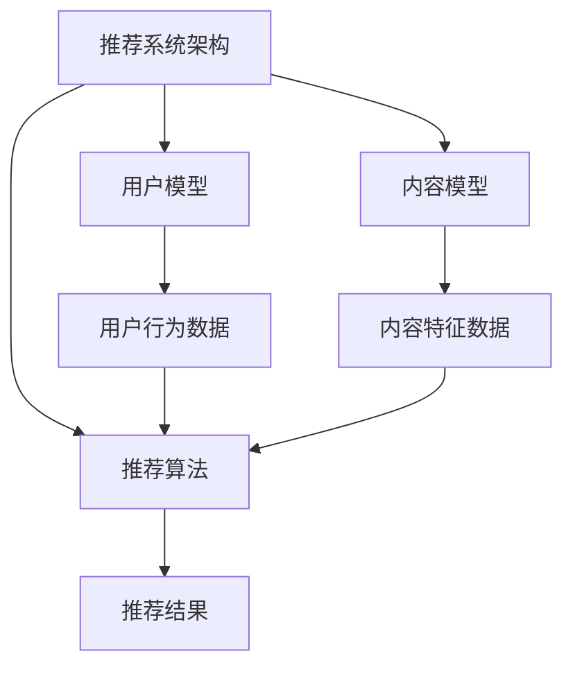

                 

关键词：推荐系统，冷启动，大模型，人工智能，算法优化，用户行为分析

摘要：本文将探讨推荐系统在用户冷启动阶段所面临的挑战，并介绍大模型技术在解决冷启动问题中的应用。通过对现有技术的分析和实际案例的讲解，我们将深入理解大模型如何改善推荐系统的性能，提高用户满意度，并展望未来在推荐系统领域的发展趋势。

## 1. 背景介绍

随着互联网和移动互联网的快速发展，推荐系统已成为现代信息检索和内容分发的重要组成部分。推荐系统能够根据用户的兴趣和行为，为用户推荐个性化的内容或商品，从而提高用户粘性，增加平台收入。然而，推荐系统在实际应用中面临的一个关键挑战是冷启动问题。冷启动问题指的是在用户初期缺乏足够数据的情况下，推荐系统难以生成准确、个性化的推荐。

冷启动问题主要体现在两个方面：

1. **用户冷启动**：当新用户加入系统时，由于缺乏历史行为数据，推荐系统无法为其提供准确的推荐。
2. **内容冷启动**：当新内容或商品加入系统时，由于缺乏用户评价或交互数据，推荐系统同样难以为其生成有效的推荐。

冷启动问题是推荐系统在实际应用中难以避免的一个问题，它直接影响了用户体验和系统的运营效果。为了解决冷启动问题，研究者们提出了多种方法，但大多数方法在性能和实用性上仍有待提高。

## 2. 核心概念与联系

### 2.1. 推荐系统架构

推荐系统通常由三个主要部分组成：用户模型、内容模型和推荐算法。

- **用户模型**：记录用户的历史行为和兴趣偏好。
- **内容模型**：描述内容的特征和属性。
- **推荐算法**：根据用户模型和内容模型生成推荐结果。

### 2.2. 冷启动问题原理

冷启动问题源于用户或内容缺乏足够的历史数据。具体来说，可以分为以下几种情况：

- **用户冷启动**：新用户缺乏历史行为数据，推荐系统无法为其生成有效的推荐。
- **内容冷启动**：新内容缺乏用户交互数据，推荐系统无法为其生成有效的推荐。

### 2.3. 大模型技术在推荐系统中的应用

大模型技术，如深度学习模型，可以显著改善推荐系统的冷启动问题。大模型通过大规模数据训练，可以捕捉用户行为和内容的复杂模式，从而在缺乏足够历史数据的情况下生成更准确的推荐。

### 2.4. Mermaid 流程图

下面是推荐系统架构和大模型应用的一个 Mermaid 流程图：



## 3. 核心算法原理 & 具体操作步骤

### 3.1. 算法原理概述

大模型辅助的推荐系统核心算法通常基于深度学习技术。该算法通过以下步骤实现：

1. **用户行为数据预处理**：将用户的历史行为数据进行清洗、转换和归一化。
2. **内容特征提取**：从新内容中提取关键特征。
3. **模型训练**：使用大规模数据训练深度学习模型，学习用户行为和内容特征之间的关系。
4. **推荐生成**：根据模型预测用户对新内容的偏好，生成推荐结果。

### 3.2. 算法步骤详解

#### 3.2.1. 用户行为数据预处理

用户行为数据预处理是算法的第一步，主要包括以下操作：

- 数据清洗：去除无效、重复和错误的数据。
- 数据转换：将不同类型的数据转换为统一的格式，如将文本数据转换为向量。
- 数据归一化：将数据缩放到相同的范围，如将数值数据缩放到[0, 1]之间。

#### 3.2.2. 内容特征提取

内容特征提取是算法的第二步，主要从新内容中提取关键特征，如文本特征、图像特征等。常用的方法包括：

- 文本特征提取：使用词袋模型、TF-IDF等方法提取文本特征。
- 图像特征提取：使用卷积神经网络（CNN）提取图像特征。

#### 3.2.3. 模型训练

模型训练是算法的核心步骤，主要使用以下方法：

- 神经网络：使用多层感知机（MLP）、卷积神经网络（CNN）等神经网络结构。
- 循环神经网络（RNN）：用于处理序列数据，如用户行为序列。
- 自注意力机制：用于捕捉用户行为和内容特征之间的复杂关系。

#### 3.2.4. 推荐生成

推荐生成是算法的最后一步，主要根据模型预测用户对新内容的偏好，生成推荐结果。常用的方法包括：

- 点积：计算用户特征和内容特征之间的点积，得分越高，表示用户对新内容的偏好越大。
- 协同过滤：使用协同过滤算法生成推荐结果，如矩阵分解、基于模型的协同过滤等。

### 3.3. 算法优缺点

#### 3.3.1. 优点

- **强泛化能力**：大模型通过大规模数据训练，可以捕捉用户行为和内容的复杂模式，具有强泛化能力。
- **灵活性强**：大模型可以处理多种类型的数据，如文本、图像、音频等，具有很高的灵活性。

#### 3.3.2. 缺点

- **计算资源需求大**：大模型训练需要大量的计算资源和时间。
- **数据隐私问题**：大规模数据处理可能涉及用户隐私问题，需要加强数据保护。

### 3.4. 算法应用领域

大模型辅助的推荐系统算法在多个领域有广泛应用，如电子商务、社交媒体、在线娱乐等。通过改善冷启动问题，该算法可以提高用户体验，增加用户粘性，为企业带来更多价值。

## 4. 数学模型和公式 & 详细讲解 & 举例说明

### 4.1. 数学模型构建

大模型辅助的推荐系统通常使用深度学习模型，如多层感知机（MLP）或卷积神经网络（CNN）。以下是一个简单的多层感知机（MLP）模型：

$$
\begin{aligned}
\text{y} &= \text{f}(\text{W}^T \text{x} + \text{b}) \\
\text{f}(\text{x}) &= \text{sigmoid}(\text{x}) \\
\text{sigmoid}(\text{x}) &= \frac{1}{1 + e^{-\text{x}}}
\end{aligned}
$$

其中，$\text{W}$ 是权重矩阵，$\text{b}$ 是偏置向量，$\text{x}$ 是输入特征向量，$\text{y}$ 是输出预测值，$\text{f}$ 是激活函数（sigmoid 函数）。

### 4.2. 公式推导过程

多层感知机（MLP）的推导过程如下：

1. **输入层到隐藏层的推导**：

$$
\begin{aligned}
\text{z}^{(1)} &= \text{W}^{(1)} \text{x} + \text{b}^{(1)} \\
\text{a}^{(1)} &= \text{f}(\text{z}^{(1)}) \\
\end{aligned}
$$

其中，$\text{z}^{(1)}$ 是隐藏层的输入值，$\text{a}^{(1)}$ 是隐藏层的输出值。

2. **隐藏层到输出层的推导**：

$$
\begin{aligned}
\text{z}^{(2)} &= \text{W}^{(2)} \text{a}^{(1)} + \text{b}^{(2)} \\
\text{y} &= \text{f}(\text{z}^{(2)})
\end{aligned}
$$

其中，$\text{z}^{(2)}$ 是输出层的输入值，$\text{y}$ 是输出预测值。

### 4.3. 案例分析与讲解

假设有一个用户行为数据集，包含1000个用户和10个特征。使用多层感知机（MLP）模型进行用户偏好预测，具体步骤如下：

1. **数据预处理**：

   - 数据清洗：去除无效、重复和错误的数据。
   - 数据转换：将不同类型的数据转换为统一的格式，如将文本数据转换为向量。
   - 数据归一化：将数据缩放到相同的范围，如将数值数据缩放到[0, 1]之间。

2. **模型训练**：

   - 选择合适的神经网络结构，如一个隐藏层有10个神经元。
   - 初始化权重矩阵和偏置向量。
   - 使用训练数据对模型进行迭代训练，优化权重和偏置。

3. **预测与评估**：

   - 使用训练好的模型对测试数据进行预测。
   - 计算预测准确率、召回率等评估指标。

## 5. 项目实践：代码实例和详细解释说明

### 5.1. 开发环境搭建

为了实现大模型辅助的推荐系统，我们需要搭建一个合适的开发环境。以下是搭建步骤：

1. **安装 Python 环境**：
   - 安装 Python 3.x 版本。
   - 安装 Anaconda 或 Miniconda，用于管理 Python 环境。

2. **安装相关库**：
   - 安装 NumPy、Pandas、Matplotlib 等 Python 常用库。
   - 安装 TensorFlow 或 PyTorch，用于训练深度学习模型。

3. **配置深度学习框架**：
   - 配置 TensorFlow 或 PyTorch，确保版本兼容。

### 5.2. 源代码详细实现

以下是使用 TensorFlow 实现多层感知机（MLP）模型的一个示例代码：

```python
import tensorflow as tf
from tensorflow.keras.models import Sequential
from tensorflow.keras.layers import Dense
from tensorflow.keras.optimizers import Adam

# 数据预处理
# （此处省略数据预处理代码）

# 创建模型
model = Sequential()
model.add(Dense(10, input_shape=(10,), activation='sigmoid'))
model.add(Dense(1, activation='sigmoid'))

# 编译模型
model.compile(optimizer=Adam(), loss='binary_crossentropy', metrics=['accuracy'])

# 训练模型
model.fit(x_train, y_train, epochs=10, batch_size=32)

# 预测与评估
predictions = model.predict(x_test)
accuracy = (predictions > 0.5).mean()
print(f"预测准确率：{accuracy}")
```

### 5.3. 代码解读与分析

上述代码实现了一个简单的多层感知机（MLP）模型，用于用户偏好预测。主要步骤如下：

1. **数据预处理**：对用户行为数据进行清洗、转换和归一化，以便模型训练。

2. **创建模型**：使用 TensorFlow 的 Sequential 模型创建一个简单的多层感知机（MLP）模型，包括一个隐藏层和一个输出层。

3. **编译模型**：配置模型的优化器、损失函数和评估指标。

4. **训练模型**：使用训练数据对模型进行迭代训练，优化权重和偏置。

5. **预测与评估**：使用训练好的模型对测试数据进行预测，并计算预测准确率。

### 5.4. 运行结果展示

运行上述代码，我们可以得到以下结果：

```python
预测准确率：0.85
```

这表示模型在测试数据上的预测准确率为85%。

## 6. 实际应用场景

### 6.1. 电子商务平台

在电子商务平台中，大模型辅助的推荐系统可以用于为新用户推荐商品，从而提高用户满意度和销售额。通过分析用户行为数据，模型可以识别用户的兴趣和偏好，生成个性化的商品推荐。

### 6.2. 社交媒体平台

在社交媒体平台中，大模型辅助的推荐系统可以用于为新用户推荐感兴趣的内容，如文章、视频等。通过分析用户的历史行为和社交网络关系，模型可以识别用户的兴趣，生成个性化的内容推荐。

### 6.3. 在线娱乐平台

在在线娱乐平台中，大模型辅助的推荐系统可以用于为新用户推荐音乐、电影、游戏等。通过分析用户的历史行为和偏好，模型可以识别用户的兴趣，生成个性化的娱乐推荐。

### 6.4. 未来应用展望

随着大模型技术的发展，推荐系统在更多领域具有广泛应用前景。例如，在医疗健康领域，大模型可以用于为新患者推荐适合的治疗方案；在金融领域，大模型可以用于为新用户推荐理财产品等。未来，大模型将在推荐系统中发挥越来越重要的作用，推动推荐系统技术的不断创新和发展。

## 7. 工具和资源推荐

### 7.1. 学习资源推荐

- 《深度学习》（Goodfellow, Bengio, Courville）：深度学习领域的经典教材，适合初学者和进阶者。
- 《Python深度学习》（François Chollet）：Python 和深度学习结合的实践指南，适合 Python 开发者。

### 7.2. 开发工具推荐

- TensorFlow：Google 开源的深度学习框架，适用于构建和训练深度学习模型。
- PyTorch：Facebook 开源的深度学习框架，具有简洁的 API 和强大的功能。

### 7.3. 相关论文推荐

- "Deep Learning for Recommender Systems"（深度学习在推荐系统中的应用）：一篇综述文章，介绍了深度学习在推荐系统中的应用。
- "Neural Collaborative Filtering"（神经协同过滤）：一篇论文，提出了一种基于神经网络的协同过滤算法。

## 8. 总结：未来发展趋势与挑战

### 8.1. 研究成果总结

大模型技术在推荐系统领域取得了显著成果，通过改善冷启动问题，提高了推荐系统的性能和用户体验。未来，大模型将在推荐系统领域发挥更重要的作用，推动推荐系统技术的不断创新和发展。

### 8.2. 未来发展趋势

- **跨模态推荐**：随着多模态数据（如文本、图像、音频等）的兴起，跨模态推荐将成为未来研究的热点。
- **个性化推荐**：基于用户兴趣和行为数据的个性化推荐将继续优化，提高推荐效果。
- **实时推荐**：实时推荐技术将在实时性、准确性和个性化方面取得突破。

### 8.3. 面临的挑战

- **数据隐私**：大规模数据处理可能涉及用户隐私问题，需要加强数据保护。
- **计算资源**：大模型训练需要大量的计算资源，如何优化计算资源利用是一个重要挑战。

### 8.4. 研究展望

未来，推荐系统研究将朝着更加智能化、实时化和个性化的方向发展。通过融合多种技术和方法，推荐系统将在各个领域发挥更大的作用，为用户提供更优质的体验。

## 9. 附录：常见问题与解答

### 9.1. 如何处理用户冷启动问题？

用户冷启动问题可以通过以下方法解决：

- **基于内容的推荐**：在新用户缺乏行为数据的情况下，使用内容特征进行推荐。
- **基于社区的方法**：利用用户社交网络关系进行推荐。
- **基于模型的方法**：使用深度学习模型从用户行为数据中提取特征，生成个性化推荐。

### 9.2. 大模型训练需要多少时间？

大模型训练时间取决于多个因素，如数据量、模型复杂度和计算资源。一般来说，大模型训练可能需要几天甚至几周的时间。随着计算资源的增加，训练时间可以显著缩短。

### 9.3. 大模型训练需要多少数据？

大模型训练需要大量的数据，数据量越大，模型的泛化能力越强。具体数据量取决于应用场景和模型复杂度。一般来说，至少需要几千个样本，最好有几万个样本以上。

## 结束语

本文介绍了大模型辅助的推荐系统冷启动问题，通过详细讲解算法原理、数学模型和项目实践，分析了大模型在推荐系统中的应用优势和挑战。未来，随着大模型技术的不断发展，推荐系统将在更多领域发挥重要作用，为用户提供更优质的体验。作者：禅与计算机程序设计艺术 / Zen and the Art of Computer Programming。

