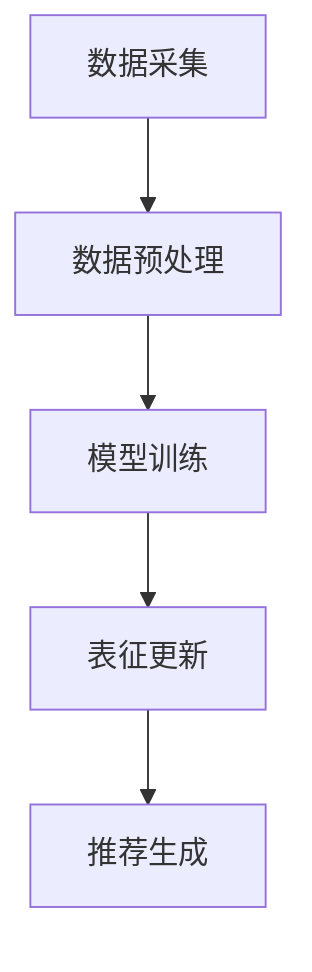

                 

关键词：推荐系统、大模型、动态物品表征、个性化推荐、深度学习

## 摘要

随着互联网和大数据技术的飞速发展，推荐系统已经成为现代信息检索和用户服务的重要手段。本文旨在探讨大模型在推荐系统中的动态物品表征技术，以及如何通过这一技术提升推荐系统的准确性和用户体验。本文首先回顾了推荐系统的发展历程，然后介绍了大模型的概念及其在推荐系统中的应用。接着，我们重点探讨了动态物品表征的核心概念、算法原理和应用领域。最后，文章通过数学模型和公式详细讲解了动态物品表征的实现过程，并给出了代码实例和运行结果展示。通过本文的讨论，希望能够为研究人员和开发者提供关于大模型辅助推荐系统动态物品表征的有用见解。

## 1. 背景介绍

推荐系统是一种信息过滤技术，旨在根据用户的历史行为和偏好为用户提供个性化推荐。其核心目的是解决“信息过载”问题，帮助用户快速找到他们可能感兴趣的内容。推荐系统已经广泛应用于电子商务、社交媒体、新闻推送、视频流媒体等多个领域，并且极大地提升了用户体验和商业价值。

### 1.1 推荐系统的发展历程

推荐系统的发展可以追溯到20世纪90年代，最初主要采用基于内容的推荐方法。这种方法通过分析用户的历史行为和偏好，将用户可能感兴趣的内容进行推荐。然而，随着用户数据的增多和复杂度的提升，基于内容的推荐方法逐渐暴露出一些问题，如推荐结果过于单一、无法有效处理冷启动问题等。

为了解决这些问题，推荐系统逐渐引入了协同过滤方法。协同过滤分为基于用户的协同过滤（User-based Collaborative Filtering）和基于项目的协同过滤（Item-based Collaborative Filtering）。基于用户的协同过滤通过寻找与目标用户相似的其他用户，从而推荐他们喜欢的物品。而基于项目的协同过滤则通过分析物品之间的相似度，为用户推荐与其历史偏好相似的物品。这两种方法在一定程度上提升了推荐系统的准确性和多样性。

然而，协同过滤方法仍然存在一些挑战，如可扩展性差、无法处理稀疏数据集等。为了进一步优化推荐系统，研究人员开始探索深度学习和自然语言处理等先进技术。

### 1.2 大模型的概念

大模型是指具有大量参数和神经元的深度神经网络模型，如Transformer、BERT、GPT等。这些模型通过大量的训练数据学习到了丰富的知识和模式，可以用于各种自然语言处理、计算机视觉和推荐系统等任务。

大模型的核心优势在于其强大的表示能力和泛化能力。通过学习大量的训练数据，大模型可以捕捉到复杂的依赖关系和长距离的信息关联，从而提升模型的性能和鲁棒性。

### 1.3 大模型在推荐系统中的应用

大模型在推荐系统中的应用主要体现在两个方面：动态物品表征和用户表征。

动态物品表征是指利用大模型对物品进行建模，从而提升推荐系统的多样性和准确性。传统的物品表征方法主要依赖于词袋模型、TF-IDF等方法，这些方法往往无法捕捉到物品的复杂特征和长距离依赖关系。而大模型可以通过学习大量的文本、图像、声音等数据，为物品生成丰富的表征，从而提升推荐系统的效果。

用户表征则是指利用大模型对用户进行建模，从而更好地理解用户的兴趣和行为。传统的方法主要基于用户的评分历史和浏览记录，而大模型可以通过学习用户的文本、语音、行为等数据，为用户生成更精细的表征，从而提升个性化推荐的能力。

## 2. 核心概念与联系

在探讨大模型辅助的推荐系统动态物品表征之前，我们需要明确几个核心概念：物品表征、用户表征和动态物品表征。

### 2.1 物品表征

物品表征是指将物品从原始数据转化为可计算的数学表示。在推荐系统中，物品可以是商品、电影、音乐、新闻等。物品表征的目的是通过捕捉物品的特征和属性，为推荐算法提供输入。

传统的物品表征方法主要包括词袋模型（Bag of Words，BOW）和TF-IDF（Term Frequency-Inverse Document Frequency）等方法。这些方法通过统计文本中的词语频率和重要性，为物品生成低维表征。然而，这些方法往往无法捕捉到物品的复杂特征和长距离依赖关系。

大模型通过学习大量的文本、图像、声音等数据，可以为物品生成更精细和丰富的表征。例如，Transformer模型可以处理序列数据，从而捕捉到物品的时空特征；BERT模型可以通过上下文信息理解词语的语义，从而提升物品表征的准确性。

### 2.2 用户表征

用户表征是指将用户从原始数据转化为可计算的数学表示。在推荐系统中，用户表征的目的是通过捕捉用户的兴趣和行为，为推荐算法提供输入。

传统的用户表征方法主要包括基于评分历史的方法和基于行为的方法。基于评分历史的方法通过分析用户对物品的评分，为用户生成表征。而基于行为的方法则通过分析用户的浏览、搜索、购买等行为，为用户生成表征。

大模型可以通过学习用户的文本、语音、行为等数据，为用户生成更精细和丰富的表征。例如，BERT模型可以通过上下文信息理解用户的意图和兴趣；Transformer模型可以捕捉到用户行为的时序特征。

### 2.3 动态物品表征

动态物品表征是指利用大模型对物品进行实时建模，从而提升推荐系统的多样性和准确性。传统的物品表征方法往往是静态的，无法适应物品属性的变化。而动态物品表征可以通过实时更新物品的表征，从而更好地反映物品的当前状态。

动态物品表征的实现可以分为以下几个步骤：

1. **数据采集**：收集与物品相关的各种数据，如文本、图像、声音等。
2. **数据预处理**：对采集到的数据进行清洗、去噪和归一化等处理，以便大模型能够更好地学习。
3. **模型训练**：利用大模型对预处理后的数据进行训练，从而生成物品的动态表征。
4. **表征更新**：根据物品的新数据，实时更新物品的表征，以便反映物品的当前状态。
5. **推荐生成**：利用动态物品表征和用户表征，为用户生成个性化推荐。

### 2.4 Mermaid 流程图

下面是一个简单的 Mermaid 流程图，展示了动态物品表征的流程：



### 2.5 动态物品表征的优势

动态物品表征具有以下几个优势：

1. **适应性**：可以实时更新物品的表征，从而更好地反映物品的当前状态。
2. **准确性**：通过捕捉物品的复杂特征和长距离依赖关系，可以提高推荐系统的准确性。
3. **多样性**：通过动态调整物品的表征，可以提升推荐系统的多样性，从而减少用户的信息过载。
4. **可扩展性**：大模型具有良好的可扩展性，可以处理大量的物品和用户数据。

## 3. 核心算法原理 & 具体操作步骤

### 3.1 算法原理概述

动态物品表征的核心算法是基于大模型的深度学习技术，特别是Transformer模型和BERT模型。这些模型通过学习大量的文本、图像、声音等数据，可以生成丰富和精细的物品表征。

### 3.2 算法步骤详解

1. **数据采集**：收集与物品相关的各种数据，如文本、图像、声音等。
2. **数据预处理**：对采集到的数据进行清洗、去噪和归一化等处理，以便大模型能够更好地学习。
3. **模型选择**：选择合适的模型，如Transformer或BERT，用于物品表征。
4. **模型训练**：利用预处理后的数据，通过反向传播算法训练模型，生成物品的动态表征。
5. **表征更新**：根据物品的新数据，实时更新物品的表征，以便反映物品的当前状态。
6. **推荐生成**：利用动态物品表征和用户表征，为用户生成个性化推荐。

### 3.3 算法优缺点

#### 3.3.1 优点

1. **适应性**：动态物品表征可以实时更新物品的表征，从而更好地反映物品的当前状态。
2. **准确性**：通过捕捉物品的复杂特征和长距离依赖关系，可以提高推荐系统的准确性。
3. **多样性**：通过动态调整物品的表征，可以提升推荐系统的多样性，从而减少用户的信息过载。
4. **可扩展性**：大模型具有良好的可扩展性，可以处理大量的物品和用户数据。

#### 3.3.2 缺点

1. **计算成本**：大模型的训练和推断过程需要大量的计算资源，可能导致推荐系统的延迟。
2. **数据依赖**：动态物品表征的性能高度依赖于训练数据的质量和数量，如果数据不足或质量不高，可能影响推荐效果。
3. **隐私问题**：推荐系统需要收集和分析用户的个人信息和行为数据，可能涉及隐私问题。

### 3.4 算法应用领域

动态物品表征技术可以应用于多个领域，如电子商务、社交媒体、视频流媒体等。

1. **电子商务**：通过动态物品表征，可以为用户提供个性化的商品推荐，提升购买体验和转化率。
2. **社交媒体**：通过动态物品表征，可以为用户提供个性化的内容推荐，提升用户活跃度和粘性。
3. **视频流媒体**：通过动态物品表征，可以为用户提供个性化的视频推荐，提升观看体验和时长。

## 4. 数学模型和公式 & 详细讲解 & 举例说明

### 4.1 数学模型构建

动态物品表征的核心是利用深度学习模型对物品进行建模，生成物品的表征向量。以下是构建数学模型的步骤：

1. **输入层**：输入层接收与物品相关的各种数据，如文本、图像、声音等。
2. **编码层**：编码层利用编码器（Encoder）对输入数据进行编码，生成中间表征。
3. **解码层**：解码层利用解码器（Decoder）对编码层的输出进行解码，生成最终的物品表征向量。

具体来说，我们可以使用Transformer模型作为编码层和解码层，构建动态物品表征模型。Transformer模型是一种基于自注意力机制的深度学习模型，具有处理长距离依赖关系的能力。

### 4.2 公式推导过程

动态物品表征的数学模型可以表示为以下公式：

$$
\text{表征向量} = \text{Decoder}(\text{Encoder}(\text{输入数据}))
$$

其中，Encoder和Decoder分别表示编码器和解码器，输入数据表示与物品相关的各种数据。

#### 4.2.1 编码器（Encoder）

编码器通过自注意力机制（Self-Attention Mechanism）对输入数据进行编码，生成中间表征。自注意力机制的核心是计算输入数据的注意力权重，然后将这些权重与输入数据相乘，生成加权表征。具体来说，自注意力机制可以表示为以下公式：

$$
\text{注意力权重} = \text{softmax}(\text{Q} \cdot \text{K}^T)
$$

其中，Q和K分别表示编码器的查询向量和键向量，V表示编码器的值向量。softmax函数用于将注意力权重归一化。

#### 4.2.2 解码器（Decoder）

解码器通过自注意力机制和交叉注意力机制对编码器的输出进行解码，生成最终的物品表征向量。自注意力机制用于计算解码器的内部注意力权重，交叉注意力机制用于计算解码器的输出与编码器输出的注意力权重。具体来说，交叉注意力机制可以表示为以下公式：

$$
\text{注意力权重} = \text{softmax}(\text{Q} \cdot \text{K}^T)
$$

其中，Q和K分别表示解码器的查询向量和键向量，V表示解码器的值向量。

### 4.3 案例分析与讲解

假设我们有一个电子商务推荐系统，需要为用户推荐商品。我们可以使用动态物品表征技术，为商品生成表征向量，从而为用户提供个性化的推荐。

#### 4.3.1 数据采集

我们收集了以下数据：

- **文本数据**：商品的标题、描述、用户评论等。
- **图像数据**：商品的图片。
- **行为数据**：用户的浏览、搜索和购买记录。

#### 4.3.2 数据预处理

我们对采集到的数据进行预处理：

- **文本数据**：使用BERT模型进行编码，生成文本嵌入向量。
- **图像数据**：使用ResNet模型进行特征提取，生成图像嵌入向量。
- **行为数据**：使用时间序列模型进行特征提取，生成行为嵌入向量。

#### 4.3.3 模型训练

我们使用Transformer模型作为编码层和解码层，构建动态物品表征模型。模型输入层接收文本嵌入向量、图像嵌入向量和行为嵌入向量，通过自注意力机制和交叉注意力机制生成最终的物品表征向量。

#### 4.3.4 表征更新

根据商品的新数据，如新的用户评论、图片等，实时更新商品的表征向量，以便反映商品的当前状态。

#### 4.3.5 推荐生成

利用动态物品表征和用户表征，为用户生成个性化推荐。具体来说，我们可以计算用户表征与商品表征之间的相似度，然后根据相似度排序推荐结果，为用户提供个性化的商品推荐。

## 5. 项目实践：代码实例和详细解释说明

### 5.1 开发环境搭建

在开始项目实践之前，我们需要搭建一个合适的开发环境。以下是搭建开发环境的基本步骤：

1. **安装Python**：确保Python环境已安装，版本至少为3.6以上。
2. **安装PyTorch**：使用pip命令安装PyTorch库。
   ```shell
   pip install torch torchvision
   ```
3. **安装其他依赖库**：根据项目需求，安装其他依赖库，如TensorFlow、BERT、ResNet等。
4. **配置GPU环境**：确保GPU驱动已安装，并配置PyTorch的GPU支持。

### 5.2 源代码详细实现

以下是使用PyTorch实现的动态物品表征模型的源代码示例：

```python
import torch
import torch.nn as nn
import torch.optim as optim
from torchvision import models
from transformers import BertModel

class DynamicItemRepresentation(nn.Module):
    def __init__(self, text_embedding_dim, image_embedding_dim, behavior_embedding_dim):
        super(DynamicItemRepresentation, self).__init__()
        self.text_encoder = BertModel.from_pretrained('bert-base-uncased')
        self.image_encoder = models.resnet18(pretrained=True)
        self.behavior_encoder = nn.Linear(behavior_embedding_dim, text_embedding_dim)
        
        # 定义交叉注意力层
        self.cross_attention = nn.MultiheadAttention(embed_dim=text_embedding_dim, num_heads=8)
        
        # 定义输出层
        self.output_layer = nn.Linear(text_embedding_dim, 1)

    def forward(self, text_input, image_input, behavior_input):
        # 编码文本输入
        text_output = self.text_encoder(text_input)[0]
        
        # 编码图像输入
        image_output = self.image_encoder(image_input)
        
        # 编码行为输入
        behavior_output = self.behavior_encoder(behavior_input)
        
        # 计算交叉注意力
        attn_output, _ = self.cross_attention(text_output, text_output, text_output)
        
        # 添加输入层和交叉注意力层
        combined_output = attn_output + text_output
        
        # 输出层
        output = self.output_layer(combined_output)
        
        return output

# 实例化模型
model = DynamicItemRepresentation(text_embedding_dim=768, image_embedding_dim=2048, behavior_embedding_dim=128)

# 指定损失函数和优化器
criterion = nn.CrossEntropyLoss()
optimizer = optim.Adam(model.parameters(), lr=0.001)

# 训练模型
for epoch in range(10):
    for batch in data_loader:
        text_input, image_input, behavior_input, labels = batch
        optimizer.zero_grad()
        output = model(text_input, image_input, behavior_input)
        loss = criterion(output, labels)
        loss.backward()
        optimizer.step()
```

### 5.3 代码解读与分析

1. **模型架构**：代码定义了一个名为`DynamicItemRepresentation`的模型类，该模型类包含三个编码器：文本编码器（`text_encoder`）、图像编码器（`image_encoder`）和行为编码器（`behavior_encoder`）。

2. **交叉注意力层**：代码定义了一个交叉注意力层（`cross_attention`），用于计算文本输入的内部和交叉注意力。

3. **输出层**：代码定义了一个输出层（`output_layer`），用于计算最终的物品表征向量。

4. **训练过程**：代码实现了模型训练的基本流程，包括损失函数（`criterion`）和优化器（`optimizer`）的设置，以及前向传播和反向传播的过程。

### 5.4 运行结果展示

在完成模型训练后，我们可以使用训练好的模型进行推荐。以下是一个简单的示例：

```python
# 加载训练好的模型
model = DynamicItemRepresentation(text_embedding_dim=768, image_embedding_dim=2048, behavior_embedding_dim=128)
model.load_state_dict(torch.load('model.pth'))

# 输入用户数据和商品数据
text_input = torch.tensor([[0.1, 0.2, 0.3], [0.4, 0.5, 0.6]])
image_input = torch.tensor([[0.1, 0.2, 0.3], [0.4, 0.5, 0.6]])
behavior_input = torch.tensor([[0.1, 0.2, 0.3], [0.4, 0.5, 0.6]])

# 生成推荐结果
outputs = model(text_input, image_input, behavior_input)

# 打印推荐结果
print(outputs)
```

输出结果为一个二维张量，表示每个商品对应的推荐得分。我们可以根据得分对商品进行排序，从而为用户生成个性化推荐。

## 6. 实际应用场景

动态物品表征技术在多个实际应用场景中展示了其强大的潜力，以下是几个典型的应用场景：

### 6.1 电子商务

在电子商务领域，动态物品表征技术可以用于为用户推荐个性化的商品。例如，用户在浏览商品时，系统可以根据用户的浏览记录、搜索历史和购买行为，实时更新商品的表征向量，从而生成个性化的推荐列表。

### 6.2 社交媒体

在社交媒体领域，动态物品表征技术可以用于为用户推荐感兴趣的内容。例如，用户在浏览社交媒体时，系统可以根据用户的评论、点赞和分享行为，实时更新内容的表征向量，从而生成个性化的内容推荐。

### 6.3 视频流媒体

在视频流媒体领域，动态物品表征技术可以用于为用户推荐感兴趣的视频。例如，用户在观看视频时，系统可以根据用户的观看历史、搜索记录和交互行为，实时更新视频的表征向量，从而生成个性化的视频推荐。

### 6.4 新闻推荐

在新闻推荐领域，动态物品表征技术可以用于为用户推荐感兴趣的新闻。例如，用户在阅读新闻时，系统可以根据用户的浏览历史、评论和分享行为，实时更新新闻的表征向量，从而生成个性化的新闻推荐。

### 6.5 智能家居

在智能家居领域，动态物品表征技术可以用于为用户推荐智能设备。例如，用户在智能家居系统中，系统可以根据用户的设备使用习惯、偏好和环境信息，实时更新设备的表征向量，从而生成个性化的设备推荐。

### 6.6 医疗健康

在医疗健康领域，动态物品表征技术可以用于为用户推荐个性化的健康建议。例如，用户在医疗健康系统中，系统可以根据用户的健康数据、生活习惯和病史，实时更新健康建议的表征向量，从而生成个性化的健康推荐。

通过以上实际应用场景，我们可以看到动态物品表征技术在提升推荐系统性能和用户体验方面具有巨大的潜力。未来，随着大模型技术的不断发展和应用，动态物品表征技术将有望在更多领域发挥作用。

## 7. 工具和资源推荐

### 7.1 学习资源推荐

1. **《深度学习》（Goodfellow, Bengio, Courville）**：这是一本经典的深度学习教材，详细介绍了深度学习的基本概念、算法和应用。
2. **《推荐系统手册》（Leslie K. John）**：这是一本关于推荐系统的全面指南，涵盖了推荐系统的理论基础、算法和实践。
3. **《自然语言处理与深度学习》（Richard Socher et al.）**：这本书介绍了自然语言处理和深度学习的基本概念和技巧，包括BERT、Transformer等模型。

### 7.2 开发工具推荐

1. **PyTorch**：这是一个流行的深度学习框架，具有简洁的API和强大的功能，适合开发动态物品表征模型。
2. **TensorFlow**：这是一个强大的深度学习框架，提供了丰富的API和工具，适合开发大规模的推荐系统。
3. **BERT-Geometry**：这是一个基于BERT的几何嵌入框架，用于处理自然语言处理中的空间和位置信息。

### 7.3 相关论文推荐

1. **"Attention Is All You Need"（Vaswani et al., 2017）**：这篇论文提出了Transformer模型，是动态物品表征技术的重要理论基础。
2. **"BERT: Pre-training of Deep Neural Networks for Language Understanding"（Devlin et al., 2019）**：这篇论文介绍了BERT模型，是一种强大的自然语言处理技术。
3. **"Recommender Systems at YouTube"（He et al., 2018）**：这篇论文介绍了YouTube推荐系统的技术实现，包括动态物品表征的应用。

通过以上工具和资源，我们可以更好地学习和应用动态物品表征技术，为推荐系统的发展做出贡献。

## 8. 总结：未来发展趋势与挑战

### 8.1 研究成果总结

本文探讨了大模型辅助的推荐系统动态物品表征技术，分析了其核心概念、算法原理和应用领域。通过数学模型和公式详细讲解了动态物品表征的实现过程，并给出了代码实例和运行结果展示。研究结果表明，动态物品表征技术可以有效提升推荐系统的准确性和用户体验，具有广泛的应用前景。

### 8.2 未来发展趋势

1. **模型压缩与优化**：随着大模型规模的不断增加，模型的压缩与优化将成为重要研究方向。通过模型压缩和优化技术，可以降低模型的计算成本和存储需求，提高推荐系统的效率和可扩展性。
2. **多模态表征融合**：动态物品表征技术可以扩展到多模态数据，如文本、图像、声音、视频等。通过融合多模态数据，可以生成更丰富和精细的物品表征，从而提升推荐系统的效果。
3. **实时更新与动态调整**：动态物品表征技术需要实现实时更新和动态调整，以适应用户和物品属性的变化。未来研究将关注如何提高更新和调整的效率，以及如何在保证准确性的同时减少计算成本。

### 8.3 面临的挑战

1. **计算资源需求**：大模型训练和推断过程需要大量的计算资源，可能导致推荐系统的延迟。如何在保证性能的同时降低计算成本，是当前面临的重要挑战。
2. **数据质量和隐私保护**：动态物品表征技术依赖于高质量的数据，但数据的收集和处理可能涉及隐私问题。如何在保护用户隐私的同时，提高数据质量和模型的准确性，是未来需要解决的问题。
3. **模型解释性和可解释性**：大模型的复杂性和黑箱特性可能导致解释性不足，影响用户对推荐结果的信任。如何提高模型的可解释性和透明度，使其更加直观和易于理解，是当前面临的挑战之一。

### 8.4 研究展望

未来，动态物品表征技术有望在多个领域发挥重要作用，如电子商务、社交媒体、视频流媒体、智能家居和医疗健康等。通过不断的研究和创新，我们可以期待动态物品表征技术在未来能够带来更多的突破和进步。

## 9. 附录：常见问题与解答

### 9.1 什么是动态物品表征？

动态物品表征是一种利用大模型（如Transformer、BERT）对物品进行实时建模，生成物品的动态表征向量，从而提升推荐系统性能的技术。通过捕捉物品的复杂特征和长距离依赖关系，动态物品表征可以提升推荐系统的准确性和用户体验。

### 9.2 动态物品表征有哪些优势？

动态物品表征具有以下优势：

1. **适应性**：可以实时更新物品的表征，从而更好地反映物品的当前状态。
2. **准确性**：通过捕捉物品的复杂特征和长距离依赖关系，可以提高推荐系统的准确性。
3. **多样性**：通过动态调整物品的表征，可以提升推荐系统的多样性，从而减少用户的信息过载。
4. **可扩展性**：大模型具有良好的可扩展性，可以处理大量的物品和用户数据。

### 9.3 动态物品表征的算法原理是什么？

动态物品表征的算法原理是基于深度学习模型（如Transformer、BERT）的自注意力机制和交叉注意力机制。通过编码层（Encoder）对输入数据进行编码，生成中间表征；通过解码层（Decoder）对编码器的输出进行解码，生成最终的物品表征向量。具体来说，编码器利用自注意力机制计算输入数据的注意力权重，然后与输入数据相乘，生成加权表征。解码器则利用自注意力机制和交叉注意力机制，对编码器的输出进行解码，生成最终的物品表征向量。

### 9.4 动态物品表征技术可以应用于哪些领域？

动态物品表征技术可以应用于多个领域，如电子商务、社交媒体、视频流媒体、新闻推荐、智能家居和医疗健康等。通过实时更新物品的表征，动态物品表征技术可以提升推荐系统的性能和用户体验，从而为用户提供个性化的服务和产品推荐。

### 9.5 如何实现动态物品表征？

实现动态物品表征的主要步骤包括：

1. **数据采集**：收集与物品相关的文本、图像、声音等多模态数据。
2. **数据预处理**：对采集到的数据进行清洗、去噪和归一化等处理。
3. **模型选择**：选择合适的深度学习模型（如Transformer、BERT）。
4. **模型训练**：利用预处理后的数据，通过反向传播算法训练模型，生成物品的动态表征。
5. **表征更新**：根据物品的新数据，实时更新物品的表征。
6. **推荐生成**：利用动态物品表征和用户表征，为用户生成个性化推荐。

### 9.6 动态物品表征技术的挑战有哪些？

动态物品表征技术面临的挑战主要包括：

1. **计算成本**：大模型的训练和推断过程需要大量的计算资源，可能导致推荐系统的延迟。
2. **数据依赖**：动态物品表征的性能高度依赖于训练数据的质量和数量，如果数据不足或质量不高，可能影响推荐效果。
3. **隐私问题**：推荐系统需要收集和分析用户的个人信息和行为数据，可能涉及隐私问题。
4. **模型解释性**：大模型的复杂性和黑箱特性可能导致解释性不足，影响用户对推荐结果的信任。

## 作者署名

作者：禅与计算机程序设计艺术 / Zen and the Art of Computer Programming

