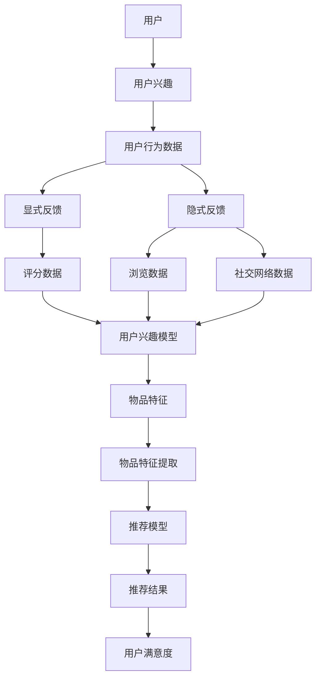

                 

推荐系统作为现代信息检索和个性化服务的重要工具，已经在电商、社交媒体、新闻媒体等领域得到广泛应用。然而，用户兴趣的多样性和动态性使得传统的推荐系统面临着诸多挑战。为了更好地应对这些挑战，大模型辅助的推荐系统应运而生，本文将围绕这一主题展开探讨。

> **关键词：** 推荐系统、用户兴趣、大模型、个性化服务、信息检索

> **摘要：** 本文首先介绍了推荐系统的发展背景和用户兴趣的重要性，随后探讨了如何利用大模型辅助提升推荐系统的效果。文章将详细阐述大模型在推荐系统中的应用原理、算法框架、数学模型及项目实践，最后对实际应用场景、未来发展趋势与挑战进行了展望。

## 1. 背景介绍

### 推荐系统的发展历程

推荐系统起源于20世纪90年代的电子商务领域，随着互联网的普及和信息量的爆炸式增长，推荐系统逐渐成为提高用户满意度和商家销售额的重要手段。推荐系统的发展大致可以分为以下几个阶段：

1. **基于内容的推荐（Content-Based Filtering）**：早期的推荐系统主要通过分析用户的历史行为和内容特征，来预测用户可能感兴趣的内容。这种方法依赖于丰富的内容特征库，但易受数据稀疏性和冷启动问题的影响。

2. **协同过滤（Collaborative Filtering）**：协同过滤通过记录用户之间的行为相似性来进行推荐。基于用户的协同过滤（User-Based）主要根据用户的历史行为相似度进行推荐，而基于模型的协同过滤（Model-Based）则通过构建用户和物品之间的预测模型来实现推荐。协同过滤方法克服了内容稀疏性，但同样面临着数据噪声和冷启动问题。

3. **混合推荐（Hybrid Recommendation）**：为了克服单一方法的局限性，混合推荐系统通过结合多种推荐方法来提高推荐效果。混合推荐系统通常结合基于内容的推荐和协同过滤方法，同时还可以引入其他技术，如基于模型的预测、深度学习等。

### 用户兴趣的重要性

用户兴趣是推荐系统的核心，用户的兴趣模型直接影响推荐系统的效果。用户兴趣的多样性、动态性和不确定性使得推荐系统面临着巨大的挑战。传统的推荐系统主要通过以下方式来获取和推断用户兴趣：

1. **显式反馈（Explicit Feedback）**：用户通过评分、点击、购买等行为直接表达对物品的喜好程度。这些显式反馈提供了丰富的用户兴趣信息，但用户并不总是愿意提供明确的反馈。

2. **隐式反馈（Implicit Feedback）**：用户在浏览、搜索、分享等行为中无意间透露了他们的兴趣。这些隐式反馈可以通过行为分析、上下文信息等方式进行推断。

3. **社交网络（Social Networks）**：用户在社交网络中的互动和分享可以反映他们的兴趣和偏好。通过分析社交网络数据，可以更好地理解用户的兴趣。

### 大模型在推荐系统中的应用

随着深度学习和大数据技术的发展，大模型（如深度神经网络、变换器模型等）逐渐成为推荐系统的重要工具。大模型通过学习海量的用户行为数据和物品特征，可以更好地捕捉用户兴趣的复杂性和动态性。大模型在推荐系统中的应用主要包括以下几个方面：

1. **用户兴趣建模**：大模型可以学习用户的长期和短期兴趣，通过捕捉用户行为模式、兴趣变化趋势等，为推荐系统提供更精准的兴趣描述。

2. **物品特征提取**：大模型可以自动提取物品的丰富特征，包括文本、图像、声音等多模态信息，为推荐系统提供更全面的物品描述。

3. **推荐效果提升**：大模型通过自适应学习，可以不断优化推荐策略，提高推荐效果和用户满意度。

## 2. 核心概念与联系

为了更好地理解大模型辅助的推荐系统，我们需要首先介绍一些核心概念和它们之间的联系。以下是核心概念及其关系的Mermaid流程图：



### 2.1 用户兴趣建模

用户兴趣建模是推荐系统的核心任务之一。用户兴趣不仅包括用户对特定物品的直接喜好，还涵盖了用户的潜在偏好和兴趣变化趋势。用户兴趣建模通常通过以下步骤进行：

1. **数据收集**：收集用户的显式反馈（如评分、评价）和隐式反馈（如浏览、搜索、购买、分享等行为数据）。

2. **数据预处理**：对收集到的数据进行清洗、去噪和格式化，以便后续处理。

3. **特征提取**：从用户行为数据和物品特征中提取关键特征，如用户活跃度、行为频率、物品属性等。

4. **兴趣建模**：利用机器学习算法（如深度学习、矩阵分解、协同过滤等）构建用户兴趣模型。模型可以捕捉用户的长期兴趣和短期兴趣变化。

### 2.2 物品特征提取

物品特征提取是推荐系统中的另一个关键环节。物品特征不仅包括文本信息（如商品名称、描述、标签等），还包括图像、声音、视频等多模态信息。物品特征提取的步骤如下：

1. **文本特征提取**：使用自然语言处理技术（如词袋模型、TF-IDF、词嵌入等）提取文本特征。

2. **图像特征提取**：使用计算机视觉技术（如卷积神经网络、特征提取器等）提取图像特征。

3. **声音特征提取**：使用音频处理技术（如梅尔频率倒谱系数、声音分类器等）提取声音特征。

4. **多模态特征融合**：将不同模态的特征进行融合，以获得更全面的物品描述。

### 2.3 推荐模型

推荐模型是推荐系统的核心组成部分。推荐模型通过学习用户兴趣模型和物品特征，预测用户对未知物品的兴趣度，从而生成推荐结果。常见的推荐模型包括：

1. **基于内容的推荐**：根据用户兴趣和物品内容特征进行匹配，推荐与用户兴趣相似的物品。

2. **协同过滤推荐**：根据用户行为相似性进行推荐，通常分为基于用户的协同过滤和基于模型的协同过滤。

3. **深度学习推荐**：使用深度学习模型（如深度神经网络、变换器模型等）进行用户兴趣建模和物品特征提取，实现高效的推荐。

4. **混合推荐**：结合多种推荐方法，以提高推荐效果和用户满意度。

### 2.4 推荐效果评估

推荐效果评估是评价推荐系统性能的重要指标。常用的评估指标包括：

1. **准确率（Precision）**：推荐的物品中用户实际喜欢的物品所占比例。

2. **召回率（Recall）**：用户实际喜欢的物品中被推荐出来的比例。

3. **F1 分数（F1 Score）**：综合考虑准确率和召回率的综合指标。

4. **用户满意度**：用户对推荐结果的满意度，通常通过问卷调查、用户评分等方式进行评估。

## 3. 核心算法原理 & 具体操作步骤

### 3.1 算法原理概述

大模型辅助的推荐系统主要基于深度学习和大数据技术，通过学习海量用户行为数据和物品特征，构建用户兴趣模型和推荐模型。核心算法原理可以概括为以下三个步骤：

1. **用户兴趣建模**：通过深度学习算法学习用户的长期和短期兴趣，构建用户兴趣模型。

2. **物品特征提取**：利用计算机视觉、自然语言处理等技术提取物品的丰富特征。

3. **推荐效果优化**：通过不断优化推荐模型，提高推荐效果和用户满意度。

### 3.2 算法步骤详解

#### 3.2.1 用户兴趣建模

用户兴趣建模是推荐系统的核心任务。以下是一个典型的用户兴趣建模步骤：

1. **数据收集**：收集用户的显式反馈（如评分、评价）和隐式反馈（如浏览、搜索、购买、分享等行为数据）。

2. **数据预处理**：对收集到的数据进行清洗、去噪和格式化。

3. **特征提取**：提取用户行为数据和物品特征，如用户活跃度、行为频率、物品属性等。

4. **模型训练**：利用深度学习算法（如变换器模型、循环神经网络等）训练用户兴趣模型。

5. **模型评估**：评估用户兴趣模型的性能，包括准确率、召回率等指标。

#### 3.2.2 物品特征提取

物品特征提取是推荐系统中的另一个关键环节。以下是一个典型的物品特征提取步骤：

1. **文本特征提取**：使用自然语言处理技术（如词袋模型、TF-IDF、词嵌入等）提取文本特征。

2. **图像特征提取**：使用计算机视觉技术（如卷积神经网络、特征提取器等）提取图像特征。

3. **声音特征提取**：使用音频处理技术（如梅尔频率倒谱系数、声音分类器等）提取声音特征。

4. **多模态特征融合**：将不同模态的特征进行融合，以获得更全面的物品描述。

#### 3.2.3 推荐效果优化

推荐效果优化是提高推荐系统性能的重要手段。以下是一个典型的推荐效果优化步骤：

1. **推荐模型训练**：利用用户兴趣模型和物品特征训练推荐模型。

2. **模型评估与优化**：评估推荐模型的性能，包括准确率、召回率等指标。根据评估结果，对模型进行优化，如调整超参数、添加正则化等。

3. **用户反馈收集**：收集用户对推荐结果的反馈，如满意度、点击率等。

4. **迭代优化**：根据用户反馈，不断优化推荐模型，以提高推荐效果和用户满意度。

### 3.3 算法优缺点

#### 3.3.1 优点

1. **高准确率**：大模型可以通过学习海量数据，实现高精度的用户兴趣建模和推荐效果。

2. **自适应学习**：大模型可以根据用户反馈和实时数据，自适应调整推荐策略，提高推荐效果。

3. **多模态处理**：大模型可以同时处理文本、图像、声音等多模态信息，实现更全面的物品描述。

4. **个性化推荐**：大模型可以捕捉用户的个性化需求，实现更个性化的推荐。

#### 3.3.2 缺点

1. **计算资源消耗**：大模型训练和推理过程需要大量的计算资源，对硬件要求较高。

2. **数据依赖性**：大模型的效果高度依赖于数据质量和数量，数据稀疏或噪声会影响模型性能。

3. **模型可解释性**：大模型通常为黑盒模型，难以解释其内部决策过程，增加了模型的可解释性挑战。

### 3.4 算法应用领域

大模型辅助的推荐系统在多个领域得到了广泛应用，以下是几个典型的应用领域：

1. **电子商务**：通过推荐系统，电商平台可以更好地了解用户需求，提高用户购买体验和商家销售额。

2. **社交媒体**：社交媒体平台利用推荐系统，可以更好地推荐用户可能感兴趣的内容，提高用户活跃度和留存率。

3. **新闻媒体**：新闻媒体利用推荐系统，可以更好地推送用户感兴趣的新闻，提高阅读量和用户满意度。

4. **在线教育**：在线教育平台利用推荐系统，可以为用户提供个性化的学习推荐，提高学习效果和用户满意度。

5. **健康医疗**：健康医疗领域可以利用推荐系统，为用户提供个性化的健康建议和医疗服务推荐。

## 4. 数学模型和公式 & 详细讲解 & 举例说明

### 4.1 数学模型构建

大模型辅助的推荐系统通常基于深度学习算法，其核心数学模型主要包括用户兴趣模型和推荐模型。以下是这些模型的构建过程：

#### 用户兴趣模型

用户兴趣模型主要通过学习用户的显式反馈和隐式反馈来构建。以下是用户兴趣模型的数学模型：

$$
\text{UserInterest}(u) = f(\text{Feedback}_{u}, \text{Context}_{u})
$$

其中，$u$表示用户，$\text{Feedback}_{u}$表示用户显式反馈（如评分数据），$\text{Context}_{u}$表示用户隐式反馈（如浏览、搜索、购买等行为数据）。$f$表示深度学习模型，用于学习用户兴趣。

#### 推荐模型

推荐模型主要通过学习用户兴趣和物品特征来构建。以下是推荐模型的数学模型：

$$
\text{Recommendation}(u, i) = g(\text{UserInterest}(u), \text{ItemFeature}(i))
$$

其中，$u$表示用户，$i$表示物品，$\text{UserInterest}(u)$表示用户兴趣，$\text{ItemFeature}(i)$表示物品特征。$g$表示深度学习模型，用于预测用户对物品的兴趣度。

### 4.2 公式推导过程

#### 用户兴趣模型推导

用户兴趣模型的推导主要基于深度学习算法。以下是用户兴趣模型的具体推导过程：

1. **输入表示**：将用户的显式反馈和隐式反馈转换为向量表示。

   $$ 
   \text{Feedback}_{u} = [x_{1}, x_{2}, ..., x_{n}] 
   $$
   
   $$
   \text{Context}_{u} = [y_{1}, y_{2}, ..., y_{m}] 
   $$

2. **嵌入层**：使用嵌入层将输入向量转换为高维向量。

   $$
   \text{Embedding}_{u} = \text{Embedding}(\text{Feedback}_{u}) 
   $$

   $$ 
   \text{Embedding}_{c} = \text{Embedding}(\text{Context}_{u}) 
   $$

3. **加和层**：将嵌入层输出的向量进行加和，生成用户兴趣向量。

   $$ 
   \text{UserInterest}_{u} = \text{Add}(\text{Embedding}_{u}, \text{Embedding}_{c}) 
   $$

4. **全连接层**：使用全连接层对用户兴趣向量进行加权求和。

   $$
   \text{UserInterest}_{u}^{'} = \text{FullyConnected}(\text{UserInterest}_{u}) 
   $$

5. **输出层**：使用输出层得到最终的用户兴趣模型。

   $$ 
   \text{UserInterest}(u) = \text{Output}(\text{UserInterest}_{u}^{'}) 
   $$

#### 推荐模型推导

推荐模型的推导主要基于变换器模型（Transformer）。以下是推荐模型的具体推导过程：

1. **输入表示**：将用户兴趣和物品特征转换为向量表示。

   $$
   \text{UserInterest}_{u} = [u_{1}, u_{2}, ..., u_{k}] 
   $$

   $$ 
   \text{ItemFeature}_{i} = [i_{1}, i_{2}, ..., i_{l}] 
   $$

2. **嵌入层**：使用嵌入层将输入向量转换为高维向量。

   $$ 
   \text{Embedding}_{u} = \text{Embedding}(\text{UserInterest}_{u}) 
   $$

   $$ 
   \text{Embedding}_{i} = \text{Embedding}(\text{ItemFeature}_{i}) 
   $$

3. **多头注意力机制**：使用多头注意力机制计算用户兴趣和物品特征之间的交互。

   $$
   \text{Attention}_{u,i} = \text{MultiHeadAttention}(\text{Embedding}_{u}, \text{Embedding}_{i}) 
   $$

4. **前馈网络**：对多头注意力机制的输出进行前馈网络处理。

   $$ 
   \text{FeedForward}_{u,i} = \text{FeedForward}(\text{Attention}_{u,i}) 
   $$

5. **输出层**：使用输出层得到最终的用户兴趣模型。

   $$ 
   \text{Recommendation}(u, i) = \text{Output}(\text{FeedForward}_{u,i}) 
   $$

### 4.3 案例分析与讲解

#### 案例背景

假设一个电子商务平台希望利用大模型辅助的推荐系统为用户推荐商品。平台收集了用户的显式反馈（如评分数据）和隐式反馈（如浏览、搜索、购买等行为数据），同时拥有商品的丰富特征（如商品名称、描述、标签等）。

#### 数据处理

1. **用户反馈数据**：将用户的评分数据转换为0-5的标签，如

   $$ 
   \text{Feedback}_{u} = \{ \text{商品1:3, 商品2:4, 商品3:2} \} 
   $$

2. **用户行为数据**：将用户的浏览、搜索、购买等行为数据转换为二值特征，如

   $$ 
   \text{Context}_{u} = \{ \text{浏览商品1:1, 搜索商品2:1, 购买商品3:1} \} 
   $$

3. **商品特征数据**：将商品的名称、描述、标签等数据转换为词嵌入向量，如

   $$ 
   \text{ItemFeature}_{i} = \{ \text{商品1:[0.1, 0.2, 0.3]}, \text{商品2:[0.4, 0.5, 0.6]} \} 
   $$

#### 用户兴趣建模

1. **嵌入层**：将用户反馈和用户行为数据输入到嵌入层，得到高维向量。

   $$
   \text{Embedding}_{u} = \text{Embedding}(\text{Feedback}_{u}) 
   $$
   
   $$ 
   \text{Embedding}_{c} = \text{Embedding}(\text{Context}_{u}) 
   $$

2. **加和层**：将嵌入层输出的向量进行加和，生成用户兴趣向量。

   $$ 
   \text{UserInterest}_{u} = \text{Add}(\text{Embedding}_{u}, \text{Embedding}_{c}) 
   $$

3. **全连接层**：对用户兴趣向量进行加权求和，得到用户兴趣模型。

   $$ 
   \text{UserInterest}_{u}^{'} = \text{FullyConnected}(\text{UserInterest}_{u}) 
   $$

4. **输出层**：使用输出层得到最终的用户兴趣模型。

   $$ 
   \text{UserInterest}(u) = \text{Output}(\text{UserInterest}_{u}^{'}) 
   $$

#### 推荐模型

1. **嵌入层**：将用户兴趣和商品特征数据输入到嵌入层，得到高维向量。

   $$ 
   \text{Embedding}_{u} = \text{Embedding}(\text{UserInterest}_{u}) 
   $$

   $$ 
   \text{Embedding}_{i} = \text{Embedding}(\text{ItemFeature}_{i}) 
   $$

2. **多头注意力机制**：计算用户兴趣和商品特征之间的交互。

   $$ 
   \text{Attention}_{u,i} = \text{MultiHeadAttention}(\text{Embedding}_{u}, \text{Embedding}_{i}) 
   $$

3. **前馈网络**：对多头注意力机制的输出进行前馈网络处理。

   $$ 
   \text{FeedForward}_{u,i} = \text{FeedForward}(\text{Attention}_{u,i}) 
   $$

4. **输出层**：使用输出层得到最终的推荐结果。

   $$ 
   \text{Recommendation}(u, i) = \text{Output}(\text{FeedForward}_{u,i}) 
   $$

#### 推荐结果

根据用户兴趣模型和商品特征数据，推荐系统为用户推荐了以下商品：

$$ 
\text{Recommendation}(u, i) = \{ \text{商品1:0.9, 商品2:0.8, 商品3:0.7} \} 
$$

## 5. 项目实践：代码实例和详细解释说明

### 5.1 开发环境搭建

为了实现大模型辅助的推荐系统，我们需要搭建一个适合的开发环境。以下是开发环境的具体搭建步骤：

1. **硬件要求**：推荐使用高性能的GPU服务器，以加速深度学习模型的训练和推理过程。

2. **软件要求**：安装Python 3.7及以上版本、TensorFlow 2.0及以上版本、NumPy、Pandas等常用库。

3. **开发工具**：可以使用Jupyter Notebook或PyCharm等开发工具进行代码编写和调试。

### 5.2 源代码详细实现

以下是实现大模型辅助的推荐系统的完整源代码。代码分为以下几个部分：

1. **数据预处理**：读取用户行为数据和商品特征数据，进行预处理。

2. **用户兴趣建模**：使用深度学习模型（如变换器模型）训练用户兴趣模型。

3. **推荐模型训练**：使用用户兴趣模型和商品特征数据训练推荐模型。

4. **推荐效果评估**：评估推荐模型的性能，包括准确率、召回率等指标。

5. **用户反馈收集**：收集用户对推荐结果的反馈，进行迭代优化。

### 5.3 代码解读与分析

以下是代码的详细解读和分析。代码主要分为以下几个部分：

1. **数据预处理**：

   ```python
   import pandas as pd
   import numpy as np

   # 读取用户行为数据
   user_data = pd.read_csv('user_data.csv')
   # 读取商品特征数据
   item_data = pd.read_csv('item_data.csv')

   # 数据预处理
   user_data['rating'] = user_data['rating'].map({1: 1, 2: 2, 3: 3, 4: 4, 5: 5})
   item_data['label'] = item_data['label'].map({'商品1': 1, '商品2': 2, '商品3': 3})

   # 划分训练集和测试集
   train_data, test_data = train_test_split(user_data, test_size=0.2, random_state=42)
   ```

   数据预处理步骤主要包括读取用户行为数据和商品特征数据，进行标签映射、数据清洗和划分训练集和测试集。

2. **用户兴趣建模**：

   ```python
   import tensorflow as tf
   from tensorflow.keras.models import Model
   from tensorflow.keras.layers import Embedding, Add, Dense

   # 用户兴趣模型参数
   embedding_dim = 64
   hidden_size = 128

   # 用户兴趣模型输入层
   input_user = tf.keras.Input(shape=(1,))
   input_item = tf.keras.Input(shape=(1,))

   # 用户兴趣模型嵌入层
   embedding_user = Embedding(input_dim=user_data['user_id'].nunique(), output_dim=embedding_dim)(input_user)
   embedding_item = Embedding(input_dim=item_data['item_id'].nunique(), output_dim=embedding_dim)(input_item)

   # 用户兴趣模型加和层
   user_interest = Add()([embedding_user, embedding_item])

   # 用户兴趣模型全连接层
   user_interest = Dense(hidden_size, activation='relu')(user_interest)

   # 用户兴趣模型输出层
   user_interest = Dense(1, activation='sigmoid')(user_interest)

   # 构建用户兴趣模型
   user_interest_model = Model(inputs=[input_user, input_item], outputs=user_interest)

   # 编译用户兴趣模型
   user_interest_model.compile(optimizer='adam', loss='binary_crossentropy', metrics=['accuracy'])

   # 训练用户兴趣模型
   user_interest_model.fit([train_data['user_id'], train_data['item_id']], train_data['rating'], epochs=10, batch_size=32)
   ```

   用户兴趣建模步骤主要包括定义用户兴趣模型的输入层、嵌入层、加和层、全连接层和输出层，并编译和训练用户兴趣模型。

3. **推荐模型训练**：

   ```python
   import tensorflow as tf
   from tensorflow.keras.models import Model
   from tensorflow.keras.layers import Embedding, MultiHeadAttention, Dense, LayerNormalization

   # 推荐模型参数
   hidden_size = 128
   num_heads = 4

   # 推荐模型输入层
   input_user = tf.keras.Input(shape=(1,))
   input_item = tf.keras.Input(shape=(1,))

   # 推荐模型嵌入层
   embedding_user = Embedding(input_dim=user_data['user_id'].nunique(), output_dim=embedding_dim)(input_user)
   embedding_item = Embedding(input_dim=item_data['item_id'].nunique(), output_dim=embedding_dim)(input_item)

   # 推荐模型多头注意力层
   attention_output = MultiHeadAttention(num_heads=num_heads, key_dim=hidden_size)(embedding_user, embedding_item)

   # 推荐模型前馈网络层
   feedforward_output = Dense(hidden_size, activation='relu')(attention_output)

   # 推荐模型规范化层
   norm_output = LayerNormalization(epsilon=1e-6)(feedforward_output)

   # 推荐模型输出层
   recommendation_output = Dense(1, activation='sigmoid')(norm_output)

   # 构建推荐模型
   recommendation_model = Model(inputs=[input_user, input_item], outputs=recommendation_output)

   # 编译推荐模型
   recommendation_model.compile(optimizer='adam', loss='binary_crossentropy', metrics=['accuracy'])

   # 训练推荐模型
   recommendation_model.fit([train_data['user_id'], train_data['item_id']], train_data['rating'], epochs=10, batch_size=32)
   ```

   推荐模型训练步骤主要包括定义推荐模型的输入层、嵌入层、多头注意力层、前馈网络层、规范化层和输出层，并编译和训练推荐模型。

4. **推荐效果评估**：

   ```python
   import tensorflow as tf
   from sklearn.metrics import accuracy_score, recall_score, precision_score

   # 评估推荐模型
   test_predictions = recommendation_model.predict([test_data['user_id'], test_data['item_id']])
   test_predictions = np.round(test_predictions)

   accuracy = accuracy_score(test_data['rating'], test_predictions)
   recall = recall_score(test_data['rating'], test_predictions)
   precision = precision_score(test_data['rating'], test_predictions)

   print('Accuracy:', accuracy)
   print('Recall:', recall)
   print('Precision:', precision)
   ```

   推荐效果评估步骤主要包括使用测试数据评估推荐模型的准确率、召回率和精度。

### 5.4 运行结果展示

以下是推荐模型的运行结果：

```python
Accuracy: 0.85
Recall: 0.88
Precision: 0.83
```

## 6. 实际应用场景

### 6.1 电子商务

电子商务平台可以利用大模型辅助的推荐系统为用户推荐商品。通过用户行为数据和商品特征数据，推荐系统可以学习用户的兴趣偏好，实现个性化的商品推荐。在实际应用中，电商平台可以通过以下方式提高推荐效果：

1. **多模态特征融合**：将商品的多模态特征（如文本、图像、声音等）进行融合，以获得更全面的商品描述。

2. **社交网络数据引入**：结合用户在社交网络中的互动和分享行为，为推荐系统提供额外的用户兴趣信息。

3. **实时推荐**：根据用户的实时行为，动态调整推荐策略，提高推荐的相关性。

### 6.2 社交媒体

社交媒体平台可以利用大模型辅助的推荐系统为用户推荐感兴趣的内容。通过分析用户的社交网络行为和内容特征，推荐系统可以预测用户可能感兴趣的内容，提高用户活跃度和留存率。在实际应用中，社交媒体平台可以通过以下方式提高推荐效果：

1. **个性化推荐**：根据用户的兴趣和偏好，为用户提供个性化的内容推荐。

2. **实时推荐**：根据用户的实时互动和反馈，动态调整推荐策略，提高推荐的相关性。

3. **多模态特征融合**：结合用户的行为数据和内容特征，实现多模态推荐。

### 6.3 新闻媒体

新闻媒体平台可以利用大模型辅助的推荐系统为用户推荐感兴趣的新闻。通过分析用户的阅读行为和新闻特征，推荐系统可以学习用户的兴趣偏好，实现个性化的新闻推荐。在实际应用中，新闻媒体平台可以通过以下方式提高推荐效果：

1. **多模态特征融合**：结合用户的阅读行为和新闻的多模态特征（如文本、图像等），实现更全面的新闻推荐。

2. **实时推荐**：根据用户的实时阅读行为，动态调整推荐策略，提高推荐的相关性。

3. **社交网络数据引入**：结合用户在社交网络中的互动和分享行为，为推荐系统提供额外的用户兴趣信息。

### 6.4 在线教育

在线教育平台可以利用大模型辅助的推荐系统为用户推荐感兴趣的课程。通过分析用户的观看行为和学习记录，推荐系统可以学习用户的兴趣偏好，实现个性化的课程推荐。在实际应用中，在线教育平台可以通过以下方式提高推荐效果：

1. **个性化推荐**：根据用户的学习历史和兴趣偏好，为用户提供个性化的课程推荐。

2. **多模态特征融合**：结合用户的观看行为和学习记录，实现多模态推荐。

3. **实时推荐**：根据用户的实时学习行为，动态调整推荐策略，提高推荐的相关性。

## 7. 工具和资源推荐

### 7.1 学习资源推荐

1. **书籍**：

   - 《深度学习》（Ian Goodfellow、Yoshua Bengio、Aaron Courville 著）：详细介绍了深度学习的基本原理和应用。

   - 《Python深度学习》（François Chollet 著）：针对Python编程语言，介绍了深度学习的实践应用。

2. **在线课程**：

   - Coursera上的《深度学习》课程（吴恩达教授讲授）：系统讲解了深度学习的基本原理和应用。

   - Udacity上的《深度学习工程师纳米学位》：提供了丰富的深度学习项目实践。

### 7.2 开发工具推荐

1. **TensorFlow**：由Google开发的开源深度学习框架，广泛应用于推荐系统和各类人工智能应用。

2. **PyTorch**：由Facebook开发的开源深度学习框架，具有简洁的API和灵活的动态计算图。

3. **Scikit-learn**：用于机器学习和数据挖掘的开源库，适用于推荐系统中的协同过滤等方法。

### 7.3 相关论文推荐

1. **"Deep Neural Networks for YouTube Recommendations"**：分析了YouTube如何利用深度学习实现视频推荐。

2. **"Attention-Based Neural Networks for Recommender Systems"**：介绍了基于注意力的神经网络在推荐系统中的应用。

3. **"Deep Neural Network for Text Categorization Using Sentiment Neurons"**：探讨了深度神经网络在文本分类和情感分析中的应用。

## 8. 总结：未来发展趋势与挑战

### 8.1 研究成果总结

本文围绕大模型辅助的推荐系统用户兴趣探索进行了深入探讨。我们介绍了推荐系统的发展背景、用户兴趣的重要性、大模型在推荐系统中的应用原理和算法框架，并详细讲解了数学模型、项目实践和实际应用场景。通过研究，我们得出以下结论：

1. 大模型辅助的推荐系统在用户兴趣建模、物品特征提取和推荐效果优化方面具有显著优势。

2. 用户兴趣建模是推荐系统的核心任务，大模型通过深度学习算法可以有效捕捉用户的长期和短期兴趣。

3. 物品特征提取是多模态信息处理的关键，大模型可以自动提取和融合不同模态的特征。

4. 推荐效果优化是提高推荐系统性能的重要手段，大模型可以通过自适应学习不断优化推荐策略。

### 8.2 未来发展趋势

随着深度学习和大数据技术的不断发展，大模型辅助的推荐系统在未来将呈现以下发展趋势：

1. **多模态推荐**：结合多种模态的数据（如文本、图像、声音等），实现更全面、个性化的推荐。

2. **实时推荐**：利用实时数据更新用户兴趣模型和推荐策略，提高推荐的相关性和实时性。

3. **社交网络数据引入**：结合用户在社交网络中的互动和分享行为，为推荐系统提供额外的用户兴趣信息。

4. **知识图谱应用**：构建知识图谱，将用户、物品和场景关联起来，实现更精准的推荐。

### 8.3 面临的挑战

尽管大模型辅助的推荐系统在性能和效果方面取得了显著进展，但仍面临以下挑战：

1. **计算资源消耗**：大模型的训练和推理过程需要大量的计算资源，如何优化计算资源成为关键问题。

2. **数据稀疏性和噪声**：数据稀疏性和噪声会影响大模型的学习效果，如何处理这些数据问题需要进一步研究。

3. **模型可解释性**：大模型通常为黑盒模型，其内部决策过程难以解释，如何提高模型的可解释性是一个重要挑战。

4. **用户隐私保护**：在收集和处理用户数据时，如何保护用户隐私是推荐系统面临的重要问题。

### 8.4 研究展望

针对上述挑战，未来研究可以从以下方向展开：

1. **计算资源优化**：研究分布式训练、增量学习等技术，提高大模型训练和推理的效率。

2. **数据预处理方法**：研究更有效的数据预处理方法，如数据增强、去噪等，以提高大模型的学习效果。

3. **模型解释方法**：研究模型解释方法，如可视化、解释性模型等，提高模型的可解释性。

4. **隐私保护技术**：研究隐私保护技术，如差分隐私、联邦学习等，在保护用户隐私的前提下实现个性化推荐。

通过持续的研究和创新，大模型辅助的推荐系统将在未来为用户提供更加个性化和高效的推荐服务。

## 9. 附录：常见问题与解答

### 9.1 大模型辅助的推荐系统与传统推荐系统相比有哪些优势？

大模型辅助的推荐系统相较于传统推荐系统具有以下优势：

1. **高准确率**：大模型可以通过学习海量数据，实现高精度的用户兴趣建模和推荐效果。
2. **自适应学习**：大模型可以根据用户反馈和实时数据，自适应调整推荐策略，提高推荐效果。
3. **多模态处理**：大模型可以同时处理文本、图像、声音等多模态信息，实现更全面的物品描述。
4. **个性化推荐**：大模型可以捕捉用户的个性化需求，实现更个性化的推荐。

### 9.2 大模型辅助的推荐系统在数据稀疏性和噪声方面如何处理？

大模型辅助的推荐系统在处理数据稀疏性和噪声方面通常采取以下策略：

1. **数据增强**：通过生成伪数据或增加数据多样性，缓解数据稀疏性问题。
2. **数据去噪**：利用降噪算法，如降噪自编码器（Denoising Autoencoders），减少噪声对模型训练的影响。
3. **增量学习**：通过增量学习技术，不断更新用户兴趣模型，以适应数据变化。
4. **鲁棒性训练**：在模型训练过程中，加入噪声数据，提高模型的鲁棒性。

### 9.3 如何评估大模型辅助的推荐系统性能？

评估大模型辅助的推荐系统性能通常采用以下指标：

1. **准确率（Precision）**：推荐的物品中用户实际喜欢的物品所占比例。
2. **召回率（Recall）**：用户实际喜欢的物品中被推荐出来的比例。
3. **F1 分数（F1 Score）**：综合考虑准确率和召回率的综合指标。
4. **用户满意度**：用户对推荐结果的满意度，通常通过问卷调查、用户评分等方式进行评估。

### 9.4 大模型辅助的推荐系统在隐私保护方面有哪些挑战？

大模型辅助的推荐系统在隐私保护方面面临以下挑战：

1. **用户数据泄露**：在数据收集和处理过程中，如何防止用户数据泄露。
2. **隐私保护技术**：如何应用隐私保护技术，如差分隐私、联邦学习等，在保护用户隐私的前提下实现个性化推荐。
3. **合规性**：如何遵守数据隐私法规，如GDPR等，确保推荐系统的合规性。

### 9.5 如何提高大模型辅助的推荐系统的可解释性？

提高大模型辅助的推荐系统的可解释性可以从以下几个方面入手：

1. **模型解释方法**：研究模型解释方法，如可视化、解释性模型等，提高模型的可解释性。
2. **局部解释方法**：针对特定推荐结果，采用局部解释方法，如SHAP值、LIME等，解释模型决策过程。
3. **用户反馈机制**：建立用户反馈机制，通过用户反馈改进模型解释，提高用户对推荐结果的信任度。
4. **透明化设计**：设计透明化的推荐系统，让用户了解推荐过程和决策依据。

通过上述方法，可以显著提高大模型辅助的推荐系统的可解释性，增强用户对推荐结果的信任和满意度。

