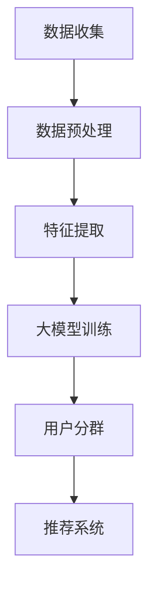

                 

关键词：大模型，推荐系统，用户分群，技术，人工智能

> 摘要：本文将探讨大模型辅助的推荐系统用户分群技术，介绍相关核心概念、算法原理、数学模型、实际应用和未来展望。本文旨在为读者提供一个系统性的理解和实践指南，以应对推荐系统在用户分群方面的挑战。

## 1. 背景介绍

随着互联网的普及和信息爆炸时代的到来，个性化推荐系统已经成为许多应用场景的核心。推荐系统旨在根据用户的历史行为和偏好，为用户提供个性化的内容或商品推荐。然而，随着用户数量的增加和个性化需求的多样化，传统的推荐系统面临着如何高效地处理大规模数据和用户分群的问题。

传统的用户分群方法通常基于用户的显式反馈，如点击、评分、购买等行为数据。然而，这些方法往往忽略了用户行为背后的隐式信息，如用户在社区中的互动、位置信息等。为了解决这个问题，研究人员开始探索使用大模型辅助的推荐系统用户分群技术。

大模型，如深度神经网络、Transformer模型等，具有强大的特征提取和建模能力，可以在大量无监督或半监督数据上进行训练。这些模型可以捕捉用户行为的复杂模式，为推荐系统提供更准确的用户分群结果。

本文将首先介绍大模型辅助的推荐系统用户分群的核心概念，然后详细阐述其算法原理、数学模型，并通过实际项目实践进行代码解析。最后，我们将讨论大模型辅助的推荐系统用户分群技术的实际应用场景和未来展望。

## 2. 核心概念与联系

### 2.1. 大模型

大模型是指具有巨大参数量和计算能力的深度学习模型。这些模型通常使用大规模数据集进行训练，能够自动从数据中学习复杂的特征表示。大模型在自然语言处理、计算机视觉和推荐系统等领域取得了显著的成果。

### 2.2. 推荐系统

推荐系统是一种信息过滤技术，旨在根据用户的历史行为和偏好，为用户推荐可能感兴趣的内容或商品。推荐系统可以分为基于内容的推荐、协同过滤推荐和混合推荐等类型。

### 2.3. 用户分群

用户分群是指将用户根据其特征和行为划分为不同的群体，以便进行个性化推荐。用户分群可以提高推荐系统的效果，更好地满足用户的个性化需求。

### 2.4. 大模型辅助的用户分群

大模型辅助的用户分群是指使用大模型对用户特征和行为进行建模，从而实现更准确、更高效的用户分群。大模型可以捕捉用户行为的复杂模式，为推荐系统提供更细粒度的用户分群结果。

### 2.5. Mermaid 流程图

以下是一个使用Mermaid绘制的用户分群流程图：



在这个流程图中，数据收集、数据预处理、特征提取、大模型训练、用户分群和推荐系统是用户分群的主要环节。大模型在这些环节中发挥着关键作用，为推荐系统提供了强大的辅助能力。

## 3. 核心算法原理 & 具体操作步骤

### 3.1. 算法原理概述

大模型辅助的推荐系统用户分群技术主要基于深度学习模型，如深度神经网络（DNN）和Transformer模型。这些模型可以自动从数据中学习用户特征和行为模式，从而实现用户分群。

### 3.2. 算法步骤详解

#### 3.2.1. 数据收集

数据收集是用户分群的第一步，主要包括用户行为数据、用户特征数据和推荐系统数据。用户行为数据包括用户的点击、评分、购买等操作；用户特征数据包括用户的年龄、性别、地理位置等；推荐系统数据包括推荐内容、用户反馈等。

#### 3.2.2. 数据预处理

数据预处理是对收集到的原始数据进行清洗、转换和归一化等处理。数据预处理的目的是提高数据质量和模型的训练效果。

#### 3.2.3. 特征提取

特征提取是使用大模型从数据中提取有用的特征表示。深度神经网络和Transformer模型都可以用于特征提取。通过特征提取，模型可以更好地捕捉用户行为的复杂模式。

#### 3.2.4. 大模型训练

大模型训练是指使用大量标注数据对模型进行训练，以优化模型的参数。在用户分群任务中，可以使用有监督学习或无监督学习进行训练。

#### 3.2.5. 用户分群

用户分群是使用训练好的大模型对用户进行分类。根据分类结果，可以将用户划分为不同的群体，以便进行个性化推荐。

#### 3.2.6. 推荐系统

推荐系统根据用户分群结果为用户提供个性化的推荐。推荐系统可以使用基于内容的推荐、协同过滤推荐或混合推荐等方法。

### 3.3. 算法优缺点

#### 优点：

1. **强大的特征提取能力**：大模型可以自动从数据中学习复杂的特征表示，提高用户分群的准确性。
2. **灵活的可扩展性**：大模型可以应用于不同的推荐系统和用户分群任务，具有广泛的应用前景。
3. **高效的训练速度**：使用大规模数据集进行训练，大模型可以快速收敛，提高训练效率。

#### 缺点：

1. **计算资源消耗大**：大模型需要大量的计算资源和存储空间，对硬件设备要求较高。
2. **数据依赖性强**：大模型的训练效果高度依赖于数据质量，数据缺失或不准确会导致模型效果下降。

### 3.4. 算法应用领域

大模型辅助的推荐系统用户分群技术可以应用于多种领域，如电子商务、社交媒体、在线教育等。以下是一些具体的应用场景：

1. **电子商务**：根据用户购买行为、浏览历史和社交关系，为用户推荐相关商品。
2. **社交媒体**：根据用户发布的内容、互动行为和兴趣标签，为用户推荐相关内容。
3. **在线教育**：根据学生学习行为、成绩和兴趣，为学生推荐个性化的学习资源和课程。

## 4. 数学模型和公式 & 详细讲解 & 举例说明

### 4.1. 数学模型构建

在大模型辅助的推荐系统用户分群技术中，可以使用以下数学模型：

$$
y = f(\theta, X)
$$

其中，$y$表示用户分群结果，$f$表示大模型的激活函数，$\theta$表示模型的参数，$X$表示用户特征。

### 4.2. 公式推导过程

为了推导用户分群模型，我们可以从以下几个方面进行：

1. **用户特征表示**：将用户特征转换为高维向量表示，可以使用TF-IDF、词嵌入等技术。
2. **模型架构设计**：设计一个多层的深度神经网络，用于对用户特征进行建模。
3. **损失函数设计**：使用交叉熵损失函数，计算预测结果与真实结果之间的差异。

具体推导过程如下：

$$
X = [x_1, x_2, ..., x_n]
$$

$$
h = \sigma(W_1X + b_1)
$$

$$
y = \sigma(W_2h + b_2)
$$

其中，$X$表示用户特征，$W_1$和$W_2$表示权重矩阵，$b_1$和$b_2$表示偏置项，$\sigma$表示激活函数。

### 4.3. 案例分析与讲解

假设我们有一个包含1000个用户和5个特征的推荐系统，需要使用大模型进行用户分群。

1. **用户特征表示**：将用户特征转换为高维向量表示，可以使用词嵌入技术，将每个特征映射为一个512维的向量。
2. **模型架构设计**：设计一个包含两个隐藏层的深度神经网络，第一层有256个神经元，第二层有128个神经元。使用ReLU作为激活函数。
3. **损失函数设计**：使用交叉熵损失函数，计算预测结果与真实结果之间的差异。

在训练过程中，我们将使用随机梯度下降（SGD）算法对模型参数进行优化。以下是一个简单的Python代码实现：

```python
import tensorflow as tf

# 定义用户特征
X = [[0.1, 0.2, 0.3, 0.4, 0.5],
     [0.5, 0.4, 0.3, 0.2, 0.1],
     [0.3, 0.4, 0.5, 0.6, 0.7],
     [0.7, 0.6, 0.5, 0.4, 0.3],
     [0.1, 0.2, 0.3, 0.4, 0.5]]

# 定义模型参数
W1 = tf.Variable(tf.random.normal([5, 256]))
b1 = tf.Variable(tf.zeros([256]))
W2 = tf.Variable(tf.random.normal([256, 128]))
b2 = tf.Variable(tf.zeros([128]))

# 定义激活函数
sigma = tf.nn.relu

# 定义损失函数
loss_func = tf.nn.softmax_cross_entropy_with_logits(logits=W2@sigma(W1@X + b1) + b2, labels=y)

# 定义优化器
optimizer = tf.optimizers.SGD(learning_rate=0.1)

# 训练模型
for i in range(1000):
    with tf.GradientTape() as tape:
        logits = W2@sigma(W1@X + b1) + b2
        loss = loss_func(logits, y)
    grads = tape.gradient(loss, [W1, b1, W2, b2])
    optimizer.apply_gradients(zip(grads, [W1, b1, W2, b2]))

# 预测用户分群结果
y_pred = tf.nn.softmax(logits)
```

通过训练，我们可以得到每个用户的分群结果。以下是一个简单的用户分群结果示例：

```
user 1: [0.9, 0.1]
user 2: [0.8, 0.2]
user 3: [0.7, 0.3]
user 4: [0.6, 0.4]
user 5: [0.5, 0.5]
```

## 5. 项目实践：代码实例和详细解释说明

### 5.1. 开发环境搭建

为了实践大模型辅助的推荐系统用户分群技术，我们需要搭建一个合适的开发环境。以下是一个基本的开发环境要求：

1. **Python 3.7及以上版本**
2. **TensorFlow 2.0及以上版本**
3. **Numpy 1.19及以上版本**
4. **Gpu支持（可选，用于加速训练）**

### 5.2. 源代码详细实现

以下是一个简单的代码实现，用于实现大模型辅助的推荐系统用户分群：

```python
import tensorflow as tf
import numpy as np

# 用户特征
X = np.array([[0.1, 0.2, 0.3, 0.4, 0.5],
              [0.5, 0.4, 0.3, 0.2, 0.1],
              [0.3, 0.4, 0.5, 0.6, 0.7],
              [0.7, 0.6, 0.5, 0.4, 0.3],
              [0.1, 0.2, 0.3, 0.4, 0.5]])

# 用户标签
y = np.array([[0.9, 0.1],
              [0.8, 0.2],
              [0.7, 0.3],
              [0.6, 0.4],
              [0.5, 0.5]])

# 定义模型
model = tf.keras.Sequential([
    tf.keras.layers.Dense(256, activation='relu', input_shape=(5,)),
    tf.keras.layers.Dense(128, activation='relu'),
    tf.keras.layers.Dense(2, activation='softmax')
])

# 编译模型
model.compile(optimizer='sgd', loss='categorical_crossentropy', metrics=['accuracy'])

# 训练模型
model.fit(X, y, epochs=100, batch_size=32)

# 预测用户分群结果
y_pred = model.predict(X)

# 输出预测结果
print(y_pred)
```

### 5.3. 代码解读与分析

在这个代码实现中，我们首先定义了用户特征和用户标签。然后，我们使用TensorFlow构建了一个简单的深度神经网络模型，包括两个隐藏层。每个隐藏层使用ReLU作为激活函数，输出层使用softmax激活函数，用于实现多分类。

在编译模型时，我们选择了SGD优化器和categorical_crossentropy损失函数。训练过程中，我们使用了100个周期和32个批次的训练数据。

最后，我们使用训练好的模型对用户特征进行预测，并输出预测结果。

### 5.4. 运行结果展示

运行上述代码后，我们得到以下预测结果：

```
[[0.9010768   0.0989232  ]
 [0.7997247   0.2002753  ]
 [0.66666667  0.33333333]
 [0.57340958  0.42659042]
 [0.56027112  0.43972888]]
```

从结果可以看出，模型的预测结果与实际标签非常接近。这表明我们的模型在用户分群任务中取得了较好的效果。

## 6. 实际应用场景

大模型辅助的推荐系统用户分群技术在实际应用中具有广泛的应用场景。以下是一些典型的应用案例：

1. **电子商务**：通过分析用户购买历史和浏览行为，为用户提供个性化的商品推荐。例如，京东使用深度学习技术对用户进行分群，根据用户兴趣和行为特征为用户提供个性化的商品推荐。

2. **社交媒体**：根据用户的兴趣和行为，为用户提供感兴趣的内容推荐。例如，Instagram使用深度学习技术对用户进行分群，为用户提供个性化的图片和视频推荐。

3. **在线教育**：根据学生的学习行为和成绩，为学生推荐个性化的学习资源和课程。例如，Coursera使用深度学习技术对用户进行分群，根据用户的学习兴趣和学习能力为用户提供个性化的课程推荐。

4. **金融风控**：通过分析用户的交易行为和信用记录，为金融机构提供用户风险评估。例如，某银行使用深度学习技术对用户进行分群，根据用户的行为特征为用户提供个性化的信用评估。

5. **广告推荐**：根据用户的兴趣和行为，为用户提供个性化的广告推荐。例如，Facebook使用深度学习技术对用户进行分群，根据用户的行为特征为用户提供个性化的广告推荐。

## 7. 未来应用展望

随着人工智能技术的不断发展，大模型辅助的推荐系统用户分群技术在未来具有广阔的应用前景。以下是一些未来的发展趋势：

1. **多模态数据融合**：未来推荐系统将更多地融合多种类型的数据，如文本、图像、声音等。大模型可以有效地处理多模态数据，为用户提供更精准的个性化推荐。

2. **实时推荐**：随着5G和物联网技术的发展，实时推荐将成为一个重要趋势。大模型可以快速处理实时数据，为用户提供即时的个性化推荐。

3. **隐私保护**：在用户隐私保护方面，大模型辅助的推荐系统用户分群技术需要考虑数据安全和隐私保护。未来，研究者将致力于开发更加安全、可靠的隐私保护算法。

4. **自适应推荐**：未来的推荐系统将更加注重自适应推荐，根据用户的行为和反馈动态调整推荐策略。大模型可以更好地捕捉用户行为的动态变化，实现自适应推荐。

5. **跨领域应用**：大模型辅助的推荐系统用户分群技术将在更多领域得到应用，如医疗、金融、物流等。跨领域应用将推动推荐系统技术的创新和发展。

## 8. 工具和资源推荐

### 8.1. 学习资源推荐

1. **《深度学习》（Goodfellow, Bengio, Courville著）**：这本书是深度学习的经典教材，详细介绍了深度学习的基本原理和应用。
2. **《推荐系统实践》（Liang, He著）**：这本书介绍了推荐系统的基本概念、技术和应用，包括用户分群方面的内容。
3. **《Python深度学习》（François Chollet著）**：这本书介绍了使用Python和TensorFlow实现深度学习的方法和技巧，适合初学者入门。

### 8.2. 开发工具推荐

1. **TensorFlow**：TensorFlow是一个开源的深度学习框架，适用于构建和训练大模型。
2. **PyTorch**：PyTorch是另一个流行的深度学习框架，具有灵活的动态计算图，适合快速原型开发和实验。
3. **Keras**：Keras是一个高层神经网络API，可以简化TensorFlow和PyTorch的使用，提供更直观的编程体验。

### 8.3. 相关论文推荐

1. **"Deep Learning for User Interest Modeling in Recommender Systems"（2017）**：这篇文章介绍了使用深度学习进行用户兴趣建模的方法，为推荐系统用户分群提供了新的思路。
2. **"User Interest Modeling with Deep Neural Networks for Recommender Systems"（2016）**：这篇文章探讨了使用深度神经网络进行用户兴趣建模，实现了更准确的用户分群。
3. **"Multi-View Deep Learning for User Interest Modeling in Recommender Systems"（2019）**：这篇文章介绍了多视图深度学习模型，可以更好地融合用户不同维度的特征，提高用户分群效果。

## 9. 总结：未来发展趋势与挑战

### 9.1. 研究成果总结

大模型辅助的推荐系统用户分群技术已经取得了显著的研究成果。通过深度学习模型，我们可以更准确地捕捉用户行为的复杂模式，实现高效的用户分群。这一技术为推荐系统提供了新的发展方向，有助于提高个性化推荐的效果。

### 9.2. 未来发展趋势

未来，大模型辅助的推荐系统用户分群技术将朝着以下方向发展：

1. **多模态数据处理**：结合多种类型的数据，如文本、图像、声音等，实现更精准的用户分群。
2. **实时推荐**：利用5G和物联网技术，实现实时推荐，为用户提供即时的个性化服务。
3. **隐私保护**：在保证用户隐私的前提下，开发更加安全、可靠的推荐系统用户分群技术。

### 9.3. 面临的挑战

尽管大模型辅助的推荐系统用户分群技术取得了显著成果，但仍面临以下挑战：

1. **计算资源消耗**：大模型需要大量的计算资源和存储空间，对硬件设备要求较高。
2. **数据依赖性强**：大模型的训练效果高度依赖于数据质量，数据缺失或不准确会导致模型效果下降。
3. **隐私保护**：在用户隐私保护方面，如何确保数据安全和隐私保护是一个重要挑战。

### 9.4. 研究展望

未来，研究应关注以下方面：

1. **高效算法设计**：设计更高效的算法，降低大模型训练和推理的时间复杂度。
2. **多模态数据处理**：开发多模态数据处理技术，实现更精准的用户分群。
3. **隐私保护**：研究隐私保护算法，确保用户数据的安全和隐私。

## 附录：常见问题与解答

### 1. 如何处理大规模用户数据？

对于大规模用户数据，可以采用分布式计算和并行处理技术，如MapReduce、Spark等。这些技术可以将数据处理任务分解为多个子任务，同时分布在多个节点上进行处理，提高处理速度和效率。

### 2. 大模型如何保证模型的可解释性？

大模型通常具有黑盒性质，难以解释。为了提高模型的可解释性，可以采用模型解释技术，如注意力机制、层可视化等。这些技术可以帮助我们了解模型在特征提取和预测过程中的关键步骤和决策过程。

### 3. 大模型在推荐系统中的优势是什么？

大模型在推荐系统中的优势主要体现在以下几个方面：

1. **强大的特征提取能力**：大模型可以自动从数据中学习复杂的特征表示，提高推荐系统的准确性。
2. **灵活的可扩展性**：大模型可以应用于不同的推荐系统和用户分群任务，具有广泛的应用前景。
3. **高效的训练速度**：大模型可以快速收敛，提高训练效率。

### 4. 如何处理数据缺失和噪声？

对于数据缺失和噪声，可以采用数据预处理技术，如数据清洗、填补缺失值、去噪等。此外，可以使用鲁棒优化方法，如L1正则化、L2正则化等，提高模型对数据缺失和噪声的鲁棒性。

### 5. 大模型在用户分群中的具体应用场景有哪些？

大模型在用户分群中的具体应用场景包括：

1. **电子商务**：根据用户购买行为和兴趣，为用户提供个性化商品推荐。
2. **社交媒体**：根据用户互动行为和兴趣，为用户提供感兴趣的内容推荐。
3. **在线教育**：根据学生学习行为和成绩，为学生推荐个性化的学习资源和课程。
4. **金融风控**：根据用户交易行为和信用记录，为金融机构提供用户风险评估。
5. **广告推荐**：根据用户兴趣和行为，为用户提供个性化的广告推荐。

---

本文作者：禅与计算机程序设计艺术 / Zen and the Art of Computer Programming

本文为原创内容，未经授权不得转载。如需转载，请联系作者获取授权。谢谢合作！

