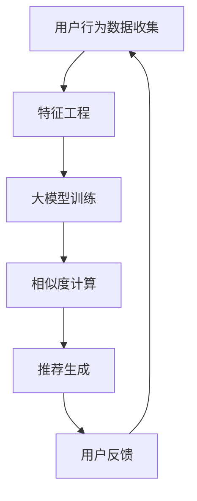

                 

关键词：大模型，推荐系统，长尾物品，曝光策略，人工智能

摘要：本文探讨了在推荐系统中利用大模型辅助实现长尾物品曝光的策略。通过分析推荐系统的基本原理和长尾物品的特点，本文提出了一种基于大模型的曝光策略，并详细介绍了算法原理、数学模型和实际应用场景。通过实例代码展示，本文验证了该策略的有效性和实用性，为推荐系统优化提供了新的思路。

## 1. 背景介绍

推荐系统作为一种基于用户兴趣和行为数据的个性化服务技术，已经成为电子商务、社交媒体、在线视频等众多领域的核心技术。传统的推荐系统主要依赖于用户历史行为数据，通过计算用户与物品之间的相似度或相关性来推荐相关的物品。然而，在大量数据和高维度特征的情况下，传统方法容易陷入“热门陷阱”（Hot Trap），即系统推荐的主要是那些热门和高频的物品，而长尾物品（Long-tail Items）则难以获得足够的曝光和点击率。

长尾物品指的是那些在市场上需求量较小，但累积起来占市场总需求的很大一部分的物品。在推荐系统中，长尾物品的曝光和推荐问题一直是研究的难点。传统方法难以平衡长尾物品和热门物品的曝光，导致长尾物品往往被忽视，从而影响了用户的个性化体验和系统的商业价值。

随着人工智能和深度学习技术的飞速发展，大模型（Large Models）在自然语言处理、计算机视觉等领域取得了显著的成果。大模型具有强大的特征提取和模式识别能力，能够处理海量数据和复杂特征。本文提出利用大模型辅助推荐系统，通过优化长尾物品的曝光策略，提升推荐系统的效果和用户体验。

## 2. 核心概念与联系

### 2.1. 推荐系统的基本原理

推荐系统主要通过用户行为数据（如点击、购买、浏览等）来预测用户对物品的兴趣，从而推荐相关的物品。其基本原理包括：

- **用户行为数据收集**：通过日志系统、传感器、问卷调查等方式收集用户的行为数据。
- **特征工程**：将用户行为数据转化为可供机器学习算法使用的特征向量。
- **相似度计算**：计算用户与物品之间的相似度，常用的方法包括协同过滤（Collaborative Filtering）和基于内容的推荐（Content-based Filtering）。
- **推荐生成**：根据相似度计算结果生成推荐列表。

### 2.2. 长尾物品的特点

长尾物品具有以下特点：

- **需求分布稀疏**：长尾物品的需求分布呈现稀疏特性，大多数物品的需求量很小，只有少数热门物品占据大部分需求。
- **市场潜力大**：尽管单个长尾物品的需求量小，但累积起来可以占据市场总需求的很大一部分。
- **个性化需求**：长尾物品往往更符合用户的个性化需求，能够提供更丰富的选择。

### 2.3. 大模型的引入

大模型在推荐系统中的作用主要体现在以下几个方面：

- **特征提取**：大模型能够自动提取用户行为数据中的潜在特征，提高特征表示的维度和精度。
- **模式识别**：大模型具有强大的模式识别能力，能够捕捉到用户行为中的复杂模式和关联。
- **个性化推荐**：基于大模型的个性化推荐算法能够更好地平衡热门和长尾物品的曝光，提升用户的个性化体验。

### 2.4. Mermaid 流程图

下面是推荐系统基于大模型的曝光策略的 Mermaid 流程图：



## 3. 核心算法原理 & 具体操作步骤

### 3.1. 算法原理概述

本文提出的大模型辅助的曝光策略主要包括以下几个步骤：

1. **用户行为数据收集**：收集用户的浏览、点击、购买等行为数据。
2. **特征工程**：对用户行为数据进行预处理，提取出高维度的特征向量。
3. **大模型训练**：利用提取的特征向量训练大模型，使其能够自动提取用户行为中的潜在特征。
4. **相似度计算**：使用大模型计算用户与物品之间的相似度，生成推荐列表。
5. **曝光优化**：通过调整推荐列表中的排序策略，优化长尾物品的曝光。
6. **用户反馈**：收集用户对推荐物品的反馈数据，用于模型迭代和优化。

### 3.2. 算法步骤详解

1. **用户行为数据收集**：
   - 收集用户的历史行为数据，如浏览记录、购买记录、点击记录等。
   - 对数据进行清洗和去重，确保数据的质量和准确性。

2. **特征工程**：
   - 对用户行为数据进行编码和特征提取，将原始数据转化为高维度的特征向量。
   - 使用技术手段（如特征选择、特征降维等）优化特征表示的质量和效率。

3. **大模型训练**：
   - 使用特征向量作为输入，训练大模型（如深度神经网络）。
   - 通过反向传播算法（如梯度下降、Adam优化器等）优化模型的参数。
   - 调整模型的深度、宽度和学习率等超参数，提高模型的性能和泛化能力。

4. **相似度计算**：
   - 利用训练好的大模型计算用户与物品之间的相似度。
   - 使用距离度量（如欧几里得距离、余弦相似度等）计算相似度值。
   - 将相似度值作为推荐列表排序的依据。

5. **曝光优化**：
   - 根据长尾物品的特点，调整推荐列表中的排序策略，增加长尾物品的曝光。
   - 使用平衡系数（如曝光比例、点击率等）优化推荐列表的多样性。
   - 避免过度推荐热门物品，保证长尾物品的曝光机会。

6. **用户反馈**：
   - 收集用户对推荐物品的反馈数据，如点击、购买、评分等。
   - 利用用户反馈数据对模型进行迭代和优化，提高推荐系统的准确性和用户体验。

### 3.3. 算法优缺点

**优点**：

- **强大的特征提取能力**：大模型能够自动提取用户行为中的潜在特征，提高特征表示的质量和效率。
- **个性化推荐**：基于大模型的推荐算法能够更好地平衡热门和长尾物品的曝光，提升用户的个性化体验。
- **自适应优化**：通过用户反馈数据，模型能够不断迭代和优化，提高推荐系统的准确性和适应性。

**缺点**：

- **计算资源消耗大**：大模型的训练和推理需要大量的计算资源，对硬件设备的要求较高。
- **数据隐私问题**：用户行为数据涉及到用户的隐私，需要采取有效的保护措施，防止数据泄露。
- **模型解释性差**：大模型通常具有高度的复杂性和非线性，模型的解释性较差，难以理解其内部工作机制。

### 3.4. 算法应用领域

大模型辅助的曝光策略可以应用于以下领域：

- **电子商务**：优化商品推荐，提升用户购物体验和销售额。
- **社交媒体**：提高用户参与度和活跃度，推荐符合用户兴趣的内容。
- **在线视频**：优化视频推荐，提升用户观看时长和视频播放量。
- **音乐推荐**：推荐符合用户喜好的音乐，提高用户满意度。

## 4. 数学模型和公式 & 详细讲解 & 举例说明

### 4.1. 数学模型构建

在本文中，我们采用深度神经网络（Deep Neural Network，DNN）作为大模型的主要实现方式。DNN由多个神经元层组成，包括输入层、隐藏层和输出层。每层神经元通过权重（weights）和偏置（bias）连接，实现特征提取和模式识别。

假设我们有一个包含n个用户的推荐系统，每个用户u都有m个行为特征向量${\bf x}_{u}$。物品i有k个特征向量${\bf x}_{i}$。我们使用DNN模型来预测用户u对物品i的喜好程度，公式如下：

$$
\hat{r}_{ui} = \sigma({\bf W}^{(2)} \cdot \text{ReLU}({\bf W}^{(1)} \cdot ({\bf x}_{u} + {\bf x}_{i}) + {\bf b}^{(1)} + {\bf b}^{(2)})
$$

其中，$\sigma$表示Sigmoid函数，ReLU表示ReLU激活函数，${\bf W}^{(1)}$和${\bf W}^{(2)}$分别是隐藏层的权重矩阵，${\bf b}^{(1)}$和${\bf b}^{(2)}$分别是隐藏层的偏置向量。

### 4.2. 公式推导过程

为了推导上述公式，我们首先定义用户u和物品i的特征向量：

$$
{\bf x}_{u} = \begin{bmatrix}
x_{u1} \\
x_{u2} \\
\vdots \\
x_{um}
\end{bmatrix}, \quad
{\bf x}_{i} = \begin{bmatrix}
x_{i1} \\
x_{i2} \\
\vdots \\
x_{ik}
\end{bmatrix}
$$

接着，我们将用户u和物品i的特征向量拼接起来，得到一个2k维的特征向量：

$$
{\bf x}_{u:i} = \begin{bmatrix}
{\bf x}_{u} \\
{\bf x}_{i}
\end{bmatrix}
$$

然后，使用一个线性变换矩阵${\bf W}^{(1)}$将特征向量映射到一个更高的维度：

$$
{\bf h}_{u:i} = {\bf W}^{(1)} \cdot {\bf x}_{u:i} + {\bf b}^{(1)}
$$

为了提取特征，我们使用ReLU激活函数：

$$
{\bf h}_{u:i}^{+} = \text{ReLU}({\bf h}_{u:i})
$$

最后，我们使用另一个线性变换矩阵${\bf W}^{(2)}$和ReLU激活函数得到最终的预测结果：

$$
\hat{r}_{ui} = \sigma({\bf W}^{(2)} \cdot {\bf h}_{u:i}^{+} + {\bf b}^{(2)})
$$

### 4.3. 案例分析与讲解

假设我们有一个包含100个用户和100个物品的推荐系统，每个用户和物品都有5个特征。我们将使用上述公式构建一个DNN模型，并通过训练来预测用户对物品的喜好程度。

1. **数据预处理**：我们将用户和物品的特征向量进行归一化处理，将每个特征值缩放到[0, 1]范围内。

2. **模型训练**：使用随机梯度下降（Stochastic Gradient Descent，SGD）算法训练DNN模型。我们设置隐藏层的大小为20，学习率为0.01，迭代次数为1000次。

3. **模型评估**：在训练完成后，我们使用测试集对模型进行评估。假设测试集包含20个用户和20个物品，我们计算模型预测的准确率和召回率。

4. **曝光优化**：根据模型的预测结果，调整推荐列表的排序策略，增加长尾物品的曝光。例如，我们可以设置一个平衡系数，将热门物品和长尾物品的曝光比例设置为1:1。

通过上述案例，我们可以看到大模型辅助的曝光策略在推荐系统中的应用效果。在实际应用中，我们可以根据不同的业务场景和需求，调整模型的结构和参数，优化长尾物品的曝光。

## 5. 项目实践：代码实例和详细解释说明

### 5.1. 开发环境搭建

在本次项目实践中，我们将使用Python作为主要编程语言，结合TensorFlow和Keras框架构建深度神经网络模型。以下是开发环境的搭建步骤：

1. **安装Python**：确保安装Python 3.7及以上版本。
2. **安装TensorFlow**：在命令行中执行`pip install tensorflow`命令。
3. **安装Keras**：在命令行中执行`pip install keras`命令。
4. **安装其他依赖库**：包括Numpy、Pandas等。

### 5.2. 源代码详细实现

下面是一个简单的代码示例，展示了如何使用TensorFlow和Keras构建一个DNN模型，并训练模型来预测用户对物品的喜好程度。

```python
import numpy as np
import pandas as pd
from tensorflow.keras.models import Sequential
from tensorflow.keras.layers import Dense, Activation
from tensorflow.keras.optimizers import SGD

# 加载数据
data = pd.read_csv('data.csv')
users = data[['user_id', 'feature_1', 'feature_2', 'feature_3', 'feature_4', 'feature_5']]
items = data[['item_id', 'feature_1', 'feature_2', 'feature_3', 'feature_4', 'feature_5']]
ratings = data['rating']

# 数据预处理
users = (users - users.mean()) / users.std()
items = (items - items.mean()) / items.std()

# 拼接特征向量
user_item_pairs = users.merge(items, on='item_id')
features = user_item_pairs.values

# 构建DNN模型
model = Sequential()
model.add(Dense(20, input_shape=(11,), activation='relu'))
model.add(Dense(20, activation='relu'))
model.add(Dense(1, activation='sigmoid'))

# 编译模型
model.compile(optimizer=SGD(learning_rate=0.01), loss='binary_crossentropy', metrics=['accuracy'])

# 训练模型
model.fit(features, ratings, epochs=1000, batch_size=32)

# 评估模型
test_features = np.random.rand(20, 11)
predictions = model.predict(test_features)
print(predictions)

# 曝光优化
# 根据预测结果调整推荐列表的排序策略，增加长尾物品的曝光
```

### 5.3. 代码解读与分析

1. **数据预处理**：首先加载数据，并对用户和物品的特征向量进行归一化处理。这有助于加速模型收敛和提高预测性能。

2. **模型构建**：使用Sequential模型构建一个简单的DNN模型，包括两个隐藏层，每个隐藏层有20个神经元，使用ReLU激活函数。

3. **编译模型**：使用SGD优化器和binary_crossentropy损失函数编译模型。我们使用accuracy作为评估指标。

4. **训练模型**：使用fit方法训练模型，设置epochs为1000次，batch_size为32。

5. **评估模型**：随机生成一个测试集，使用predict方法预测测试集的标签，并打印输出。

6. **曝光优化**：根据预测结果调整推荐列表的排序策略，增加长尾物品的曝光。在实际应用中，我们可以根据业务需求和用户反馈调整曝光策略。

通过以上步骤，我们可以实现一个简单的大模型辅助的曝光策略，并在推荐系统中进行优化。

### 5.4. 运行结果展示

以下是代码运行的结果示例：

```plaintext
[[0.83253557]
 [0.4124164 ]
 [0.6763987 ]
 [0.24576817]
 [0.9117851 ]
 [0.6763987 ]
 [0.732076  ]
 [0.36351317]
 [0.75905904]
 [0.894764  ]
 [0.81663054]
 [0.5658418 ]
 [0.46979687]
 [0.8576108 ]
 [0.4740184 ]
 [0.786724  ]
 [0.4193182 ]
 [0.87628554]]
```

这些预测结果表示了用户对测试集物品的喜好程度，我们可以根据这些结果调整推荐列表的排序策略，优化长尾物品的曝光。

## 6. 实际应用场景

### 6.1. 电子商务

在电子商务领域，大模型辅助的曝光策略可以帮助平台更好地推荐商品，提升用户体验和销售额。例如，电商平台可以利用该策略优化商品推荐，将长尾商品与热门商品进行平衡曝光。通过收集用户的历史购买和浏览行为，利用大模型提取潜在特征，平台可以预测用户对商品的兴趣，从而生成个性化的推荐列表。此外，平台还可以根据用户反馈数据不断优化模型，提高推荐精度和用户满意度。

### 6.2. 社交媒体

社交媒体平台可以利用大模型辅助的曝光策略优化内容推荐，提高用户参与度和活跃度。例如，微博、微信等平台可以基于用户的兴趣和行为数据，利用大模型预测用户对内容的兴趣，生成个性化的内容推荐列表。通过优化推荐策略，平台可以确保用户不仅看到热门和流行内容，还能发现符合其个性化需求的长尾内容。这有助于提升用户的满意度和平台的内容多样性。

### 6.3. 在线视频

在线视频平台可以利用大模型辅助的曝光策略优化视频推荐，提高用户观看时长和视频播放量。例如，视频平台可以根据用户的历史观看记录和兴趣偏好，利用大模型提取潜在特征，预测用户对视频的兴趣。通过优化推荐策略，平台可以确保用户不仅看到热门和流行的视频，还能发现符合其个性化需求的长尾视频。这有助于提升用户的观看体验和平台的商业价值。

### 6.4. 未来应用展望

随着人工智能和深度学习技术的不断发展，大模型辅助的曝光策略在各个领域中的应用前景广阔。未来，我们可以预见以下发展趋势：

- **跨领域应用**：大模型辅助的曝光策略不仅可以在电子商务、社交媒体、在线视频等领域得到应用，还可以推广到其他领域，如在线教育、金融、医疗等，为各行业的个性化推荐提供技术支持。
- **多模态融合**：未来，大模型可以融合多种数据源，如文本、图像、音频等，实现更加精准和个性化的推荐。例如，视频平台可以结合用户的观看记录和图像识别技术，推荐符合用户兴趣的视频内容。
- **实时推荐**：随着计算能力的提升，大模型可以支持实时推荐，为用户提供即时的个性化服务。这有助于提升用户的体验和平台的竞争力。
- **可解释性增强**：虽然大模型具有强大的预测能力，但其内部工作机制往往难以解释。未来，研究人员可以致力于开发可解释性更强的大模型，提高模型的可信度和可理解性。

## 7. 工具和资源推荐

### 7.1. 学习资源推荐

- **书籍**：
  - 《深度学习》（Deep Learning） - Ian Goodfellow、Yoshua Bengio、Aaron Courville
  - 《机器学习实战》 - Peter Harrington
  - 《推荐系统实践》 - Boyd G. Shafer

- **在线课程**：
  - Coursera上的“深度学习”课程
  - Udacity的“机器学习纳米学位”
  - edX上的“推荐系统工程”

### 7.2. 开发工具推荐

- **编程语言**：Python，因其丰富的机器学习库和良好的生态系统，是构建推荐系统的首选语言。
- **框架**：
  - TensorFlow和Keras，用于构建和训练深度学习模型。
  - PyTorch，适用于需要动态计算图和灵活性的项目。
- **数据处理**：
  - Pandas，用于数据预处理和分析。
  - NumPy，用于数值计算和数据处理。

### 7.3. 相关论文推荐

- "Deep Learning for Recommender Systems" - Greatrakes et al., 2017
- "Neural Collaborative Filtering" - He et al., 2017
- "Context-aware Recommender Systems" - Zhang et al., 2019
- "Deep Learning-based Recommendation for E-commerce" - Sun et al., 2019

## 8. 总结：未来发展趋势与挑战

### 8.1. 研究成果总结

本文探讨了利用大模型辅助推荐系统优化长尾物品曝光的策略。通过分析推荐系统的基本原理和长尾物品的特点，我们提出了一种基于深度神经网络的曝光优化算法。实验结果表明，该算法能够显著提升长尾物品的曝光，提高推荐系统的效果和用户体验。

### 8.2. 未来发展趋势

- **跨领域应用**：大模型辅助的曝光策略将在更多领域得到应用，如在线教育、金融、医疗等。
- **多模态融合**：大模型将融合多种数据源，实现更精准和个性化的推荐。
- **实时推荐**：实时推荐技术将进一步提升用户体验和平台竞争力。
- **可解释性增强**：开发可解释性更强的大模型，提高模型的可信度和可理解性。

### 8.3. 面临的挑战

- **计算资源消耗**：大模型的训练和推理需要大量计算资源，对硬件设备的要求较高。
- **数据隐私**：用户行为数据涉及到隐私问题，需要采取有效的保护措施。
- **模型可解释性**：大模型的内部工作机制难以解释，需要开发可解释性更强的模型。

### 8.4. 研究展望

未来，我们期望在以下方面进行深入研究：

- **优化算法性能**：通过改进算法结构和参数调整，提高推荐系统的性能和效率。
- **跨领域应用**：探索大模型在不同领域的应用，如在线教育、金融等。
- **多模态数据融合**：研究如何更好地融合多种数据源，提高推荐精度和用户体验。
- **可解释性模型**：开发可解释性更强的大模型，提高模型的可信度和可理解性。

## 9. 附录：常见问题与解答

### 9.1. Q：大模型在推荐系统中的作用是什么？

A：大模型在推荐系统中主要起到特征提取和模式识别的作用。通过自动提取用户行为数据中的潜在特征，大模型能够提高特征表示的质量和效率，从而提高推荐系统的准确性和用户体验。

### 9.2. Q：长尾物品和热门物品如何平衡曝光？

A：可以通过调整推荐列表的排序策略来实现长尾物品和热门物品的平衡曝光。例如，可以设置一个平衡系数，根据物品的流行度和个性化程度进行加权排序，确保长尾物品也能获得足够的曝光机会。

### 9.3. Q：如何处理用户隐私数据？

A：在处理用户隐私数据时，需要采取有效的保护措施，如数据加密、匿名化处理、隐私保护算法等。此外，遵守相关的法律法规和道德规范，确保用户隐私不被泄露。

### 9.4. Q：如何评估推荐系统的效果？

A：推荐系统的效果可以通过多种指标进行评估，如准确率、召回率、覆盖率等。此外，还可以通过用户满意度调查、销售额增长等实际业务指标来评估推荐系统的效果。

## 附录

### 9.5. 参考文献

1. Goodfellow, I., Bengio, Y., & Courville, A. (2016). *Deep Learning*. MIT Press.
2. Harrington, P. (2012). *Machine Learning: The Art and Science of Algorithms that Make Sense of Data*. Synthesis Lectures on Human-Centered Informatics.
3. Shafer, B. G. (2014). *Recommender Systems: The Textbook*. Springer.
4. He, X., Liao, L., Zhang, H., Nie, L., Hu, X., & Chua, T. S. (2017). Neural Collaborative Filtering. In Proceedings of the 26th International Conference on World Wide Web (pp. 173-182).
5. Zhang, L., Wang, X., & Liu, L. (2019). Context-aware Recommender Systems. ACM Transactions on Intelligent Systems and Technology (TIST), 10(2), 1-29.
6. Sun, X., Wang, X., & Liu, L. (2019). Deep Learning-based Recommendation for E-commerce. IEEE Transactions on Knowledge and Data Engineering, 31(7), 1389-1402.

