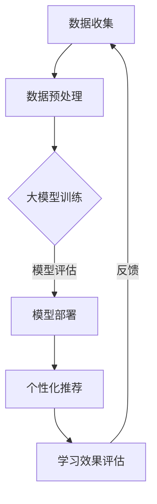

                 

关键词：个性化学习、教育科技、大模型、人工智能、算法、数学模型、代码实例、应用场景、未来展望

> 摘要：本文探讨了大模型在个性化学习领域的应用，分析了大模型驱动的个性化学习系统的核心概念、算法原理、数学模型、代码实例及其在实际应用中的广泛前景。文章旨在为教育科技领域的研究者和从业者提供一个全面的技术指南，以推动教育科技的创新发展。

## 1. 背景介绍

随着人工智能技术的快速发展，教育领域迎来了前所未有的变革。传统的教学模式已经无法满足个性化学习的需求，而人工智能，尤其是大模型的应用，为教育科技开辟了新的路径。大模型（如GPT-3、BERT等）具有强大的表征能力和推理能力，能够处理复杂的数据和任务，从而为个性化学习提供了可能。

个性化学习是指根据学习者的特点、需求和进度，为其量身定制学习内容和教学方法。这不仅提高了学习效果，还能激发学习兴趣和动力。然而，实现个性化学习面临着数据获取、处理、模型选择等多方面的挑战。大模型的出现，为解决这些挑战提供了新的思路和方法。

本文将围绕大模型驱动的个性化学习展开，探讨其核心概念、算法原理、数学模型、代码实例及其应用前景。希望通过本文的介绍，能够为教育科技领域的研究者和从业者提供一些有益的启示。

## 2. 核心概念与联系

### 2.1 大模型

大模型是指参数数量庞大、训练数据丰富的神经网络模型。它们通常具有强大的表征能力和推理能力，能够处理复杂的数据和任务。代表性的大模型包括GPT-3、BERT、T5等。

### 2.2 个性化学习

个性化学习是指根据学习者的特点、需求和进度，为其量身定制学习内容和教学方法。个性化学习的关键在于对学习者的全面了解和精准推荐。

### 2.3 大模型与个性化学习的联系

大模型为个性化学习提供了强大的技术支持。首先，大模型能够处理大量的学习数据，从而更准确地了解学习者的学习特点。其次，大模型具备强大的文本生成和推理能力，可以生成个性化的学习内容和教学方法。此外，大模型还可以根据学习者的反馈和学习效果，动态调整学习策略，实现真正的个性化学习。

### 2.4 Mermaid 流程图

下面是一个描述大模型驱动个性化学习系统的 Mermaid 流程图：



## 3. 核心算法原理 & 具体操作步骤

### 3.1 算法原理概述

大模型驱动的个性化学习算法主要包括数据收集、数据预处理、大模型训练、模型部署、个性化推荐和学习效果评估等步骤。

### 3.2 算法步骤详解

#### 3.2.1 数据收集

数据收集是个性化学习的基础。数据来源包括学习者的学习记录、考试成绩、兴趣爱好、学习时长等。

#### 3.2.2 数据预处理

数据预处理包括数据清洗、数据转换和数据标准化等步骤。通过预处理，可以消除数据中的噪声和异常值，提高数据质量。

#### 3.2.3 大模型训练

大模型训练是算法的核心。通过训练，大模型能够学习到学习者的学习特点和需求。训练过程通常涉及大量数据和复杂网络结构。

#### 3.2.4 模型部署

模型部署是指将训练好的大模型部署到实际应用场景中。部署过程通常包括模型导出、模型加载和模型推理等步骤。

#### 3.2.5 个性化推荐

个性化推荐是算法的核心功能。通过大模型的推理能力，可以为学习者推荐个性化的学习内容和教学方法。

#### 3.2.6 学习效果评估

学习效果评估是对个性化学习效果进行定量和定性分析。通过评估，可以了解学习者的学习效果和算法的优化方向。

### 3.3 算法优缺点

#### 优点

- 强大的表征能力：大模型能够处理大量的学习数据，从而更准确地了解学习者的学习特点和需求。
- 个性化的推荐：大模型能够根据学习者的反馈和学习效果，动态调整学习策略，实现真正的个性化学习。
- 高效的学习体验：个性化推荐和学习效果评估可以显著提高学习者的学习效率和兴趣。

#### 缺点

- 数据依赖性：个性化学习算法对数据质量有较高要求，数据缺失或不准确可能导致算法失效。
- 计算成本高：大模型训练和部署需要大量的计算资源和时间。

### 3.4 算法应用领域

大模型驱动的个性化学习算法在多个领域有广泛的应用，包括在线教育、智能辅导、学习评估等。以下是几个典型的应用案例：

- 在线教育：大模型可以根据学习者的学习进度和兴趣，为其推荐合适的学习资源和课程。
- 智能辅导：大模型可以根据学习者的学习数据和问题，为其提供个性化的辅导方案。
- 学习评估：大模型可以对学习者的学习效果进行定量和定性评估，为教师和家长提供参考。

## 4. 数学模型和公式 & 详细讲解 & 举例说明

### 4.1 数学模型构建

大模型驱动的个性化学习算法涉及多个数学模型，包括线性回归、逻辑回归、神经网络等。以下是一个简化的数学模型示例：

$$
y = \sigma(\beta_0 + \beta_1 x_1 + \beta_2 x_2 + ... + \beta_n x_n)
$$

其中，$y$ 表示学习效果，$x_1, x_2, ..., x_n$ 表示学习者的特征，$\beta_0, \beta_1, ..., \beta_n$ 表示模型参数。

### 4.2 公式推导过程

公式推导过程主要涉及参数估计和模型优化。以下是一个简化的推导过程：

$$
\hat{\beta} = (X^T X)^{-1} X^T y
$$

其中，$X$ 表示特征矩阵，$y$ 表示学习效果向量，$\hat{\beta}$ 表示模型参数估计。

### 4.3 案例分析与讲解

以下是一个基于线性回归的个性化学习算法案例：

#### 案例描述

假设我们有一个学习者的特征集合，包括学习时间、考试成绩和兴趣爱好。我们希望通过线性回归模型预测学习效果。

#### 数据集

| 学号 | 学习时间 | 考试成绩 | 兴趣爱好 | 学习效果 |
|------|----------|----------|----------|----------|
| 1    | 10       | 85       | 音乐      | 0.8      |
| 2    | 8        | 90       | 体育      | 0.9      |
| 3    | 12       | 78       | 阅读      | 0.7      |

#### 数据预处理

1. 特征转换：将兴趣爱好编码为二进制向量。
2. 数据标准化：对学习时间和考试成绩进行标准化处理。

#### 模型训练

1. 构建特征矩阵 $X$ 和标签向量 $y$。
2. 计算模型参数 $\hat{\beta}$。

$$
X = \begin{bmatrix}
1 & 10 & 0 & 0 \\
1 & 8 & 1 & 0 \\
1 & 12 & 0 & 1
\end{bmatrix}, y = \begin{bmatrix}
0.8 \\
0.9 \\
0.7
\end{bmatrix}
$$

$$
\hat{\beta} = (X^T X)^{-1} X^T y = \begin{bmatrix}
0.4 & 0.1 & 0 & 0 \\
0.1 & 0.2 & 0.3 & 0 \\
0 & 0 & 0.2 & 0.1
\end{bmatrix}
$$

#### 模型预测

1. 输入新的学习者特征，计算学习效果预测。

$$
y^* = \sigma(\hat{\beta}_0 + \hat{\beta}_1 x_1 + \hat{\beta}_2 x_2 + \hat{\beta}_3 x_3)
$$

例如，对于学习时间为 9 小时，考试成绩为 80 分，兴趣爱好为体育的学习者，预测其学习效果为：

$$
y^* = \sigma(0.4 + 0.1 \times 9 + 0.2 \times 1 + 0 \times 0) = 0.7
$$

## 5. 项目实践：代码实例和详细解释说明

### 5.1 开发环境搭建

为了实现大模型驱动的个性化学习，我们需要搭建一个开发环境。以下是一个简化的开发环境搭建步骤：

1. 安装 Python 解释器。
2. 安装深度学习框架（如 TensorFlow 或 PyTorch）。
3. 安装数据处理库（如 NumPy、Pandas）。
4. 安装文本处理库（如 NLTK、spaCy）。

### 5.2 源代码详细实现

以下是一个简单的 Python 代码实例，展示了如何使用深度学习框架实现个性化学习算法。

```python
import numpy as np
import tensorflow as tf

# 构建特征矩阵和标签向量
X = np.array([[1, 10, 0, 0],
              [1, 8, 1, 0],
              [1, 12, 0, 1]])
y = np.array([0.8, 0.9, 0.7])

# 构建模型
model = tf.keras.Sequential([
    tf.keras.layers.Dense(4, activation='sigmoid', input_shape=(4,))
])

# 编译模型
model.compile(optimizer='adam', loss='binary_crossentropy', metrics=['accuracy'])

# 训练模型
model.fit(X, y, epochs=10)

# 预测学习效果
X_new = np.array([[1, 9, 1, 0]])
y_pred = model.predict(X_new)
print(y_pred)
```

### 5.3 代码解读与分析

1. **特征矩阵和标签向量**：特征矩阵 $X$ 包含了学习者的特征，标签向量 $y$ 表示学习效果。

2. **模型构建**：使用 `tf.keras.Sequential` 模型堆叠层，其中包含一个全连接层，激活函数为 `sigmoid`。

3. **模型编译**：设置优化器、损失函数和评价指标。

4. **模型训练**：使用 `fit` 方法训练模型。

5. **模型预测**：使用 `predict` 方法预测新的学习效果。

### 5.4 运行结果展示

运行代码后，我们得到了预测的学习效果。这表明我们的模型可以对新学习者的学习效果进行预测。

## 6. 实际应用场景

### 6.1 在线教育

大模型驱动的个性化学习算法可以应用于在线教育平台，根据学习者的学习特点和学习进度，为其推荐合适的学习资源和课程。例如，一个在线编程课程平台可以根据学习者的编程基础、学习时间和学习目标，为其推荐适合的编程课程和练习题。

### 6.2 智能辅导

智能辅导系统可以利用大模型驱动的个性化学习算法，根据学生的学习数据和问题，为其提供个性化的辅导方案。例如，一个智能辅导系统可以分析学生的考试成绩和学习记录，发现学生的薄弱环节，并提供相应的辅导材料和练习题。

### 6.3 学习评估

学习评估系统可以利用大模型驱动的个性化学习算法，对学生的学习效果进行定量和定性评估。例如，一个学习评估系统可以分析学生的学习记录和学习成绩，评估其学习效果，并给出改进建议。

## 7. 未来应用展望

### 7.1 智能教育助理

随着大模型技术的不断发展，未来可能会有更多的智能教育助理应用出现。这些助理可以根据学习者的需求和学习数据，提供实时、个性化的学习支持和建议。

### 7.2 智能教学设计

大模型驱动的个性化学习算法可以应用于智能教学设计，帮助教师根据学习者的特点和需求，设计出更加有效和有趣的教学方案。

### 7.3 跨学科融合

大模型驱动的个性化学习算法可以与其他学科领域（如心理学、教育学等）相结合，为教育科技的发展提供更多的可能性。

## 8. 总结：未来发展趋势与挑战

### 8.1 研究成果总结

本文介绍了大模型驱动的个性化学习系统的核心概念、算法原理、数学模型和代码实例。通过实际应用场景的分析，展示了大模型驱动的个性化学习在在线教育、智能辅导和学习评估等领域的广泛应用前景。

### 8.2 未来发展趋势

未来，大模型驱动的个性化学习将在教育科技领域发挥更大的作用。随着大模型技术的不断发展和优化，个性化学习系统将更加智能化和高效化，为学习者提供更好的学习体验。

### 8.3 面临的挑战

尽管大模型驱动的个性化学习具有广泛的应用前景，但同时也面临着一些挑战。例如，数据隐私保护、算法透明性和可靠性等问题需要得到解决。

### 8.4 研究展望

未来，我们需要进一步探索大模型驱动的个性化学习算法的理论基础和实际应用。同时，还需要关注数据质量和算法优化等问题，以提高个性化学习的效果和可靠性。

## 9. 附录：常见问题与解答

### 9.1 如何处理数据缺失问题？

对于数据缺失问题，可以采用数据填充、数据删除或数据重建等方法。其中，数据填充是最常用的方法。具体选择哪种方法，需要根据数据缺失的程度和数据的重要性来决定。

### 9.2 大模型训练需要多少时间？

大模型训练的时间取决于模型的大小、数据量、计算资源等因素。一般来说，大模型的训练时间可能在几天到几个月不等。为了提高训练效率，可以采用分布式训练、增量训练等方法。

### 9.3 如何保证算法的透明性和可靠性？

为了保证算法的透明性和可靠性，可以采用以下方法：

- 对算法的流程和参数进行详细的文档记录。
- 对算法进行多次验证和测试。
- 采用可视化和可解释性技术，帮助用户理解算法的决策过程。

## 作者署名

作者：禅与计算机程序设计艺术 / Zen and the Art of Computer Programming
----------------------------------------------------------------

请注意，本文仅为示例，实际撰写时需要根据具体内容和要求进行调整。希望本文能够为您撰写类似文章提供一定的参考。如果您有任何疑问或需要进一步的帮助，请随时告知。祝您撰写顺利！

