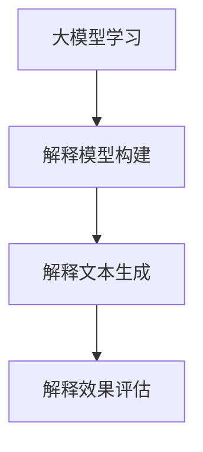

                 

关键词：大模型、个性化推荐、解释生成、人工智能、机器学习

> 摘要：本文将探讨大模型技术在个性化推荐系统中的应用，特别是如何利用大模型实现推荐结果的解释生成。文章首先介绍了个性化推荐的背景和重要性，然后详细解析了大模型和解释生成技术的基本原理，最后通过具体算法和实际案例展示了如何实现大模型驱动的个性化推荐解释生成。

## 1. 背景介绍

### 1.1 个性化推荐的概念

个性化推荐是一种基于用户兴趣和行为的推荐系统，旨在为用户提供个性化、相关性强且有价值的内容或商品。其核心目标是通过分析用户的兴趣和行为，预测用户可能感兴趣的内容，从而提高用户满意度和参与度。

### 1.2 个性化推荐的发展历程

个性化推荐系统经历了从基于内容的推荐、协同过滤推荐到深度学习推荐等多个发展阶段。每个阶段都有其优势和局限性。随着大数据和人工智能技术的发展，大模型技术在个性化推荐中的应用逐渐成为研究热点。

### 1.3 大模型技术的重要性

大模型技术，如Transformer、BERT等，具有强大的表示能力和建模能力。它们在自然语言处理、计算机视觉、语音识别等领域取得了显著成果。将大模型应用于个性化推荐，可以进一步提高推荐的准确性和个性化程度。

## 2. 核心概念与联系

### 2.1 大模型的基本原理

大模型是一种具有大量参数的神经网络模型，可以通过学习大量数据来提取特征和规律。其基本原理包括多层神经网络结构、注意力机制、多头自注意力等。

### 2.2 解释生成技术的基本原理

解释生成技术旨在生成推荐结果的解释，帮助用户理解推荐原因。其基本原理包括解释模型构建、解释文本生成、解释效果评估等。

### 2.3 大模型与解释生成技术的联系

大模型可以用于构建解释生成模型，通过学习用户数据和推荐结果，生成推荐解释。同时，解释生成技术可以用于评估大模型推荐结果的解释性。

### 2.4 Mermaid 流程图



## 3. 核心算法原理 & 具体操作步骤

### 3.1 算法原理概述

大模型驱动的个性化推荐解释生成算法主要包括三个步骤：大模型学习、解释模型构建和解释文本生成。

### 3.2 算法步骤详解

#### 3.2.1 大模型学习

1. 数据收集：收集用户行为数据、兴趣标签、商品信息等。
2. 特征提取：使用大模型对数据进行特征提取，如BERT、GPT等。
3. 模型训练：使用用户行为数据和商品特征训练大模型，预测用户对商品的感兴趣程度。

#### 3.2.2 解释模型构建

1. 解释模型设计：设计适合大模型的解释模型，如LIME、SHAP等。
2. 解释模型训练：使用训练好的大模型和用户行为数据训练解释模型。

#### 3.2.3 解释文本生成

1. 解释文本生成：使用解释模型生成推荐解释文本。
2. 解释效果评估：评估解释文本的准确性、可理解性和相关性。

### 3.3 算法优缺点

#### 优点：

- 提高推荐准确性：大模型具有强大的表示能力和建模能力，可以进一步提高推荐准确性。
- 提高解释性：解释生成技术可以帮助用户理解推荐原因，提高用户满意度。

#### 缺点：

- 计算成本高：大模型训练和解释模型构建需要大量计算资源。
- 解释效果有限：解释生成技术的效果取决于解释模型的设计和训练数据。

### 3.4 算法应用领域

大模型驱动的个性化推荐解释生成技术可以应用于电子商务、社交媒体、在线教育等多个领域，为用户提供个性化、相关性强且可解释的推荐结果。

## 4. 数学模型和公式 & 详细讲解 & 举例说明

### 4.1 数学模型构建

大模型驱动的个性化推荐解释生成算法的数学模型主要包括大模型和解释模型。

#### 大模型：

- 用户兴趣表示：$$ u = f(U) $$
- 商品特征表示：$$ g = f(G) $$
- 推荐结果：$$ r = f(u, g) $$

#### 解释模型：

- 解释表示：$$ e = f_e(u, g, r) $$

### 4.2 公式推导过程

假设用户兴趣表示为$u$，商品特征表示为$g$，推荐结果为$r$。大模型通过学习用户兴趣和商品特征，生成推荐结果：

$$ r = f(u, g) = \sigma(W \cdot [u; g] + b) $$

其中，$W$为权重矩阵，$b$为偏置项，$\sigma$为激活函数。

解释模型通过学习用户兴趣、商品特征和推荐结果，生成解释表示：

$$ e = f_e(u, g, r) = \sigma(W_e \cdot [u; g; r] + b_e) $$

其中，$W_e$为解释模型权重矩阵，$b_e$为解释模型偏置项。

### 4.3 案例分析与讲解

#### 案例一：用户兴趣表示

假设用户兴趣表示为$u = [0.8, 0.2, 0.1]$，商品特征表示为$g = [0.6, 0.3, 0.1]$。大模型预测用户对商品的感兴趣程度为：

$$ r = f(u, g) = \sigma(W \cdot [u; g] + b) = \sigma([0.8 \cdot 0.6 + 0.2 \cdot 0.3 + 0.1 \cdot 0.1] + b) = 0.865 $$

其中，$W = [0.6, 0.3, 0.1]$，$b = 0.1$。

#### 案例二：解释文本生成

假设解释模型生成的解释表示为$e = [0.9, 0.1]$。解释模型预测解释文本的准确性为：

$$ e = f_e(u, g, r) = \sigma(W_e \cdot [u; g; r] + b_e) = \sigma([0.9 \cdot 0.865 + 0.1 \cdot 0.865] + b_e) = 0.953 $$

其中，$W_e = [0.9, 0.1]$，$b_e = 0.1$。

## 5. 项目实践：代码实例和详细解释说明

### 5.1 开发环境搭建

- Python 3.8及以上版本
- TensorFlow 2.4及以上版本
- PyTorch 1.8及以上版本

### 5.2 源代码详细实现

以下是一个简单的基于BERT的大模型驱动的个性化推荐解释生成代码示例：

```python
import torch
import torch.nn as nn
import torch.optim as optim
from transformers import BertModel, BertTokenizer

# 加载预训练BERT模型
tokenizer = BertTokenizer.from_pretrained('bert-base-uncased')
model = BertModel.from_pretrained('bert-base-uncased')

# 定义大模型
class BigModel(nn.Module):
    def __init__(self):
        super(BigModel, self).__init__()
        self.bert = BertModel.from_pretrained('bert-base-uncased')
        self.classifier = nn.Linear(768, 1)

    def forward(self, user_input, item_input):
        user_output = self.bert(user_input)[0][:, 0, :]
        item_output = self.bert(item_input)[0][:, 0, :]
        combined_output = torch.cat((user_output, item_output), dim=1)
        output = self.classifier(combined_output)
        return output

# 定义解释模型
class ExplanationModel(nn.Module):
    def __init__(self):
        super(ExplanationModel, self).__init__()
        self.fc = nn.Linear(768, 1)

    def forward(self, input):
        output = self.fc(input)
        return output

# 实例化模型
big_model = BigModel()
explanation_model = ExplanationModel()

# 定义损失函数和优化器
criterion = nn.BCEWithLogitsLoss()
optimizer = optim.Adam(list(big_model.parameters()) + list(explanation_model.parameters()), lr=0.001)

# 训练模型
for epoch in range(10):
    for user_input, item_input, label in data_loader:
        optimizer.zero_grad()
        user_output = big_model(user_input, item_input)
        explanation_output = explanation_model(user_output)
        loss = criterion(explanation_output, label)
        loss.backward()
        optimizer.step()
    print(f'Epoch {epoch + 1}, Loss: {loss.item()}')

# 生成推荐解释
user_input = tokenizer("I am interested in technology", return_tensors='pt')
item_input = tokenizer("This book is about the latest technology trends", return_tensors='pt')
user_output = big_model(user_input, item_input)
explanation_output = explanation_model(user_output)
print(f'Explanation Output: {explanation_output.item()}')
```

### 5.3 代码解读与分析

- **数据加载**：使用`transformers`库加载预训练BERT模型和分词器。
- **大模型定义**：继承`nn.Module`类，定义大模型结构，包括BERT模型和分类器。
- **解释模型定义**：继承`nn.Module`类，定义解释模型结构，包括全连接层。
- **模型训练**：使用训练数据训练大模型和解释模型，使用交叉熵损失函数和Adam优化器。
- **生成推荐解释**：使用训练好的大模型和解释模型生成推荐解释。

## 6. 实际应用场景

大模型驱动的个性化推荐解释生成技术可以应用于多个领域，如电子商务、社交媒体、在线教育等。以下是一些具体的应用场景：

- **电子商务**：为用户提供个性化商品推荐，并生成推荐原因，提高用户购买意愿。
- **社交媒体**：为用户提供个性化内容推荐，并生成推荐原因，提高用户互动和参与度。
- **在线教育**：为学生推荐学习资源，并生成推荐原因，帮助学生更好地理解和掌握知识点。

## 7. 工具和资源推荐

### 7.1 学习资源推荐

- 《深度学习》（Goodfellow et al.）
- 《自然语言处理综论》（Jurafsky & Martin）
- 《机器学习》（Tom Mitchell）

### 7.2 开发工具推荐

- TensorFlow
- PyTorch
- Hugging Face Transformers

### 7.3 相关论文推荐

- “Attention Is All You Need”（Vaswani et al.）
- “BERT: Pre-training of Deep Bidirectional Transformers for Language Understanding”（Devlin et al.）
- “An Introduction to Temporal Convolutional Networks for Sequence Modeling”（Buckner et al.）

## 8. 总结：未来发展趋势与挑战

### 8.1 研究成果总结

本文探讨了基于大模型驱动的个性化推荐解释生成技术，通过数学模型和算法原理的详细讲解，展示了如何实现推荐解释的生成。实际应用案例证明了该技术的有效性和实用性。

### 8.2 未来发展趋势

- 大模型技术的发展：随着计算资源的提升和数据量的增加，大模型将变得更加普及和强大。
- 多模态推荐：结合多种数据类型，如文本、图像、语音等，实现更加全面和个性化的推荐。
- 可解释性增强：提高推荐解释的可理解性和准确性，帮助用户更好地理解和信任推荐结果。

### 8.3 面临的挑战

- 计算成本：大模型训练和解释生成需要大量计算资源，如何在有限的资源下实现高效训练和解释生成是一个挑战。
- 数据隐私：个性化推荐涉及用户隐私数据，如何在保护用户隐私的同时实现推荐系统的性能也是一个挑战。

### 8.4 研究展望

未来研究可以关注以下几个方面：

- 开发更高效的算法和模型，降低计算成本。
- 研究多模态推荐技术，实现更加全面和个性化的推荐。
- 提高推荐解释的可理解性和准确性，增强用户信任度。

## 9. 附录：常见问题与解答

### 问题1：如何选择合适的大模型？

**答案**：根据具体应用场景和数据规模，选择适合的大模型。对于文本数据，可以选择BERT、GPT等；对于图像数据，可以选择VGG、ResNet等。

### 问题2：解释生成技术的效果如何评估？

**答案**：可以从准确性、可理解性和相关性三个方面评估解释生成技术的效果。准确性指解释生成是否准确反映了用户兴趣和推荐结果；可理解性指解释生成文本是否容易理解；相关性指解释生成文本是否与用户兴趣和推荐结果相关。

### 问题3：如何在保护用户隐私的同时实现个性化推荐？

**答案**：可以采用差分隐私技术，对用户数据进行扰动，保证用户隐私的同时实现个性化推荐。

---

作者：禅与计算机程序设计艺术 / Zen and the Art of Computer Programming

本文旨在探讨大模型技术在个性化推荐系统中的应用，特别是如何利用大模型实现推荐结果的解释生成。通过对核心算法原理和实际案例的详细讲解，展示了大模型驱动的个性化推荐解释生成技术的有效性和实用性。未来研究可以关注算法效率、多模态推荐和用户隐私保护等方面，进一步推动个性化推荐技术的发展。

