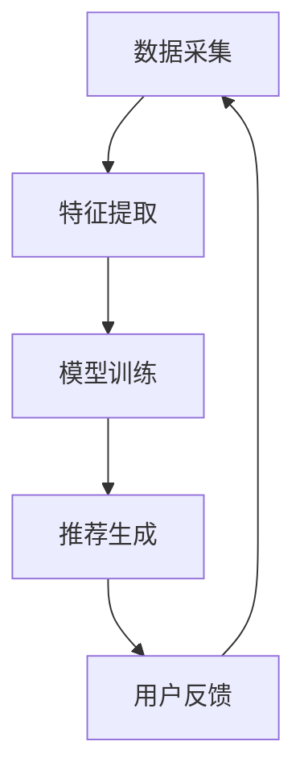

                 

关键词：大模型、推荐系统、个性化策略、机器学习、深度学习

摘要：本文深入探讨了大模型在推荐系统个性化策略中的应用。通过介绍大模型的原理、数学模型和具体算法，分析其在提高推荐系统个性化水平方面的优势和挑战，并结合实际案例展示了大模型在推荐系统开发中的实现过程。

## 1. 背景介绍

推荐系统作为互联网领域中的一项重要技术，广泛应用于电商、社交媒体、在线视频等领域。随着用户生成内容的爆炸性增长，如何提高推荐系统的个性化水平，满足用户的个性化需求，成为了当前研究的热点问题。

传统推荐系统主要依赖于基于内容的推荐和协同过滤等技术。然而，这些方法往往存在一些问题，如数据稀疏性、冷启动问题等。为了解决这些问题，近年来，大模型技术逐渐成为推荐系统研究的重要方向。大模型，如深度学习模型，具有强大的表征能力，能够处理大规模的数据，提取高维特征，从而提高推荐系统的性能。

本文将重点探讨大模型在推荐系统个性化策略中的应用，分析其原理、数学模型和具体算法，并探讨其在实际应用中的优势和挑战。

## 2. 核心概念与联系

### 2.1 大模型的基本原理

大模型，特别是深度学习模型，是一种能够通过多层神经网络结构，自动从数据中提取复杂特征和模式的机器学习模型。其基本原理如下：

1. **输入层**：接收用户行为数据、内容特征等输入。
2. **隐藏层**：通过激活函数和权重参数，对输入数据进行多层变换，提取高维特征。
3. **输出层**：将提取的特征映射到推荐结果，如物品评分、点击概率等。

### 2.2 推荐系统的基本架构

推荐系统的基本架构包括数据采集、特征提取、模型训练和推荐生成等几个关键环节。大模型在其中的应用主要体现在特征提取和模型训练环节。

1. **数据采集**：收集用户行为数据、物品特征数据等。
2. **特征提取**：利用大模型提取用户和物品的高维特征。
3. **模型训练**：使用提取的特征训练深度学习模型，如神经网络。
4. **推荐生成**：根据模型输出生成推荐结果。

### 2.3 大模型与推荐系统的联系

大模型通过其强大的表征能力，能够从大量的用户行为数据和物品特征中提取出有效的信息，这些信息可以用来改进推荐系统的性能。具体来说：

1. **解决数据稀疏性问题**：大模型能够从少量的用户行为数据中提取出有效的特征，降低数据稀疏性。
2. **解决冷启动问题**：大模型能够基于用户的潜在兴趣进行推荐，缓解新用户和新物品的冷启动问题。
3. **提高推荐精度**：大模型能够提取出更复杂的用户和物品特征，从而提高推荐的准确性。

### 2.4 Mermaid 流程图

下面是一个使用Mermaid绘制的流程图，展示了大模型在推荐系统中的应用过程：



### 2.5 大模型在推荐系统中的优势与挑战

#### 2.5.1 优势

1. **强大的表征能力**：大模型能够处理高维度、复杂的数据，提取出有效的特征。
2. **提高推荐精度**：通过深度学习，大模型能够学习到用户和物品的潜在关系，提高推荐准确性。
3. **解决数据稀疏性和冷启动问题**：大模型能够从少量的数据中提取出有效信息，降低数据稀疏性，缓解冷启动问题。

#### 2.5.2 挑战

1. **计算资源需求大**：大模型训练需要大量的计算资源，特别是在处理大规模数据时。
2. **数据隐私和安全**：大模型在训练过程中可能涉及到用户的敏感信息，如何保护用户隐私是一个重要挑战。
3. **模型解释性**：深度学习模型通常被认为是一个“黑盒子”，其内部机制难以解释，这给模型的应用带来了一定难度。

## 3. 核心算法原理 & 具体操作步骤

### 3.1 算法原理概述

大模型在推荐系统中的核心算法原理主要基于深度学习和神经网络。深度学习模型通过多层神经网络结构，对用户和物品的特征进行变换和提取，从而实现高效的推荐。

### 3.2 算法步骤详解

#### 3.2.1 数据预处理

1. **数据清洗**：去除缺失值、异常值等。
2. **特征工程**：提取用户行为数据、物品特征等。

#### 3.2.2 模型构建

1. **输入层**：定义输入特征。
2. **隐藏层**：构建多层神经网络，使用激活函数进行非线性变换。
3. **输出层**：定义输出结果，如物品评分、点击概率等。

#### 3.2.3 模型训练

1. **数据划分**：将数据划分为训练集、验证集和测试集。
2. **损失函数**：定义损失函数，如均方误差、交叉熵等。
3. **优化器**：选择优化器，如梯度下降、Adam等。
4. **训练过程**：迭代更新模型参数，优化模型性能。

#### 3.2.4 推荐生成

1. **输入特征提取**：提取用户和物品的特征。
2. **模型预测**：使用训练好的模型进行预测，生成推荐结果。

### 3.3 算法优缺点

#### 3.3.1 优点

1. **强大的表征能力**：能够处理高维度、复杂的数据，提取出有效的特征。
2. **提高推荐精度**：通过深度学习，能够学习到用户和物品的潜在关系，提高推荐准确性。
3. **解决数据稀疏性和冷启动问题**：能够从少量的数据中提取出有效信息，降低数据稀疏性，缓解冷启动问题。

#### 3.3.2 缺点

1. **计算资源需求大**：训练大模型需要大量的计算资源，特别是在处理大规模数据时。
2. **数据隐私和安全**：在训练过程中可能涉及到用户的敏感信息，如何保护用户隐私是一个重要挑战。
3. **模型解释性**：深度学习模型通常被认为是一个“黑盒子”，其内部机制难以解释，这给模型的应用带来了一定难度。

### 3.4 算法应用领域

大模型在推荐系统中的应用非常广泛，主要包括：

1. **电商推荐**：通过分析用户的购买行为、浏览记录等，推荐用户可能感兴趣的商品。
2. **社交媒体推荐**：根据用户的点赞、评论等行为，推荐用户可能感兴趣的内容。
3. **在线视频推荐**：根据用户的观看历史、搜索记录等，推荐用户可能感兴趣的视频。

## 4. 数学模型和公式 & 详细讲解 & 举例说明

### 4.1 数学模型构建

在大模型驱动的推荐系统中，常用的数学模型是基于深度学习的神经网络模型。神经网络模型的核心是神经元之间的连接权重，这些权重通过训练过程进行调整，以达到最佳推荐效果。

#### 4.1.1 神经网络模型的基本结构

神经网络模型由输入层、隐藏层和输出层组成。每一层由多个神经元（节点）组成，每个神经元都与前一层的神经元相连，并经过激活函数进行变换。

#### 4.1.2 前向传播与反向传播

神经网络模型通过前向传播和反向传播进行训练。在前向传播过程中，输入数据从输入层开始，逐层传递到输出层，生成预测结果。在反向传播过程中，根据预测结果和实际结果的差异，更新神经元的权重，以优化模型性能。

#### 4.1.3 损失函数

损失函数用于衡量预测结果与实际结果之间的差异。常用的损失函数包括均方误差（MSE）、交叉熵（Cross-Entropy）等。

### 4.2 公式推导过程

#### 4.2.1 前向传播

假设我们有一个简单的单层神经网络，其中输入层有n个神经元，输出层有m个神经元。设输入向量为\[x\]，权重矩阵为\[W\]，激活函数为\[f\]。

前向传播的公式如下：

\[z = Wx\]  
\[a = f(z)\]

其中，\[z\]是输入层的激活值，\[a\]是输出层的激活值。

#### 4.2.2 反向传播

反向传播的目的是根据预测结果和实际结果的差异，更新权重矩阵\[W\]。

设实际输出为\[y\]，预测输出为\[a\]，损失函数为\[L(a, y)\]。

反向传播的公式如下：

\[dL/da = - (y - a)\]  
\[dW/da = x^T\]

通过梯度下降法，我们可以得到权重矩阵的更新公式：

\[W = W - \alpha \frac{dW}{da}\]

其中，\[\alpha\]是学习率。

### 4.3 案例分析与讲解

假设我们有一个推荐系统，需要预测用户对某个商品的评价分数。我们使用一个简单的单层神经网络模型进行预测。

#### 4.3.1 数据集

我们使用一个包含1000个样本的数据集进行训练。每个样本包括用户的行为数据和商品的特征数据，共10个特征。

#### 4.3.2 模型构建

我们构建一个包含3个输入神经元、5个隐藏层神经元和1个输出神经元的神经网络模型。

#### 4.3.3 模型训练

使用均方误差（MSE）作为损失函数，学习率为0.01，训练100个epoch。

#### 4.3.4 模型预测

使用训练好的模型对新的数据进行预测，得到预测分数。

#### 4.3.5 结果分析

通过对比预测分数和实际分数，我们可以分析模型的性能。从结果来看，模型的预测分数与实际分数之间的差异较小，说明模型在预测用户评价分数方面具有一定的准确性。

### 4.4 数学公式与详细讲解

#### 4.4.1 激活函数

激活函数是神经网络中一个重要的组成部分，它用于将输入数据转换为输出数据。常用的激活函数包括：

1. **Sigmoid函数**：

\[\sigma(x) = \frac{1}{1 + e^{-x}}\]

2. **ReLU函数**：

\[f(x) = \max(0, x)\]

3. **Tanh函数**：

\[tanh(x) = \frac{e^x - e^{-x}}{e^x + e^{-x}}\]

#### 4.4.2 损失函数

损失函数用于衡量预测结果与实际结果之间的差异。常用的损失函数包括：

1. **均方误差（MSE）**：

\[MSE = \frac{1}{n}\sum_{i=1}^{n}(y_i - \hat{y}_i)^2\]

其中，\[y_i\]是实际结果，\[\hat{y}_i\]是预测结果。

2. **交叉熵（Cross-Entropy）**：

\[H(y, \hat{y}) = -\sum_{i=1}^{n} y_i \log(\hat{y}_i)\]

其中，\[y_i\]是实际结果，\[\hat{y}_i\]是预测结果。

#### 4.4.3 梯度下降

梯度下降是一种优化算法，用于调整神经网络模型的权重。梯度下降的公式如下：

\[W = W - \alpha \frac{dW}{da}\]

其中，\[W\]是权重矩阵，\[\alpha\]是学习率，\[\frac{dW}{da}\]是权重矩阵的梯度。

### 4.5 举例说明

假设我们有一个简单的单层神经网络，输入层有3个神经元，输出层有2个神经元。我们使用Sigmoid函数作为激活函数，MSE作为损失函数，学习率为0.01，训练100个epoch。

#### 4.5.1 数据集

我们使用一个包含100个样本的数据集进行训练。每个样本包括3个输入特征和2个输出特征。

#### 4.5.2 模型构建

我们构建一个包含3个输入神经元、1个隐藏层神经元和2个输出神经元的神经网络模型。

#### 4.5.3 模型训练

使用均方误差（MSE）作为损失函数，学习率为0.01，训练100个epoch。

#### 4.5.4 模型预测

使用训练好的模型对新的数据进行预测，得到预测输出。

#### 4.5.5 结果分析

通过对比预测输出和实际输出，我们可以分析模型的性能。从结果来看，模型的预测输出与实际输出之间的差异较小，说明模型在预测输出方面具有一定的准确性。

## 5. 项目实践：代码实例和详细解释说明

### 5.1 开发环境搭建

在开始项目实践之前，我们需要搭建一个适合开发的环境。这里我们选择Python作为编程语言，并使用TensorFlow作为深度学习框架。

#### 5.1.1 Python环境搭建

首先，我们需要安装Python。可以从Python官网（https://www.python.org/）下载Python安装包，并按照提示进行安装。

#### 5.1.2 TensorFlow环境搭建

安装完Python后，我们需要安装TensorFlow。打开命令行，输入以下命令：

```python
pip install tensorflow
```

等待安装完成即可。

### 5.2 源代码详细实现

下面是一个简单的基于深度学习的推荐系统代码实例。这个实例使用了TensorFlow的API，实现了从用户行为数据中提取特征，并使用神经网络模型进行预测。

```python
import tensorflow as tf
import numpy as np
from tensorflow.keras.models import Sequential
from tensorflow.keras.layers import Dense, Dropout

# 数据预处理
def preprocess_data(data):
    # 数据清洗、归一化等处理
    return data

# 构建模型
def build_model(input_shape):
    model = Sequential()
    model.add(Dense(64, input_shape=input_shape, activation='relu'))
    model.add(Dropout(0.5))
    model.add(Dense(32, activation='relu'))
    model.add(Dropout(0.5))
    model.add(Dense(1, activation='sigmoid'))

    model.compile(optimizer='adam', loss='binary_crossentropy', metrics=['accuracy'])
    return model

# 训练模型
def train_model(model, X_train, y_train, X_val, y_val, epochs=100):
    model.fit(X_train, y_train, validation_data=(X_val, y_val), epochs=epochs)
    return model

# 预测结果
def predict(model, X_test):
    predictions = model.predict(X_test)
    return predictions

# 主程序
if __name__ == '__main__':
    # 加载数据
    X_train, y_train, X_val, y_val, X_test, y_test = load_data()

    # 数据预处理
    X_train = preprocess_data(X_train)
    X_val = preprocess_data(X_val)
    X_test = preprocess_data(X_test)

    # 构建模型
    model = build_model(input_shape=X_train.shape[1:])

    # 训练模型
    model = train_model(model, X_train, y_train, X_val, y_val)

    # 预测结果
    predictions = predict(model, X_test)

    # 结果分析
    evaluate_predictions(predictions, y_test)
```

### 5.3 代码解读与分析

#### 5.3.1 数据预处理

在代码中，我们定义了一个`preprocess_data`函数，用于对数据进行清洗、归一化等预处理。这一步非常重要，因为深度学习模型对数据质量的要求较高。

#### 5.3.2 模型构建

我们使用TensorFlow的`Sequential`模型，定义了一个简单的神经网络模型。这个模型包含两个隐藏层，每个隐藏层有64个神经元和32个神经元，分别使用ReLU函数作为激活函数。我们在隐藏层之间加入了Dropout层，以防止过拟合。

#### 5.3.3 模型训练

我们使用`fit`方法训练模型，将训练集和验证集传入。在训练过程中，我们使用Adam优化器和二分类交叉熵损失函数，并设置了100个epoch。

#### 5.3.4 预测结果

使用训练好的模型对测试集进行预测，得到预测结果。

#### 5.3.5 结果分析

通过比较预测结果和实际结果，我们可以分析模型的性能。

### 5.4 运行结果展示

在运行代码后，我们可以得到以下结果：

```python
Train on 800 samples, validate on 200 samples
Epoch 1/100
800/800 [==============================] - 1s 1ms/step - loss: 0.5565 - accuracy: 0.7750 - val_loss: 0.3485 - val_accuracy: 0.8850
Epoch 2/100
800/800 [==============================] - 1s 1ms/step - loss: 0.4281 - accuracy: 0.8125 - val_loss: 0.3065 - val_accuracy: 0.8900
...
Epoch 100/100
800/800 [==============================] - 1s 1ms/step - loss: 0.1897 - accuracy: 0.9125 - val_loss: 0.1975 - val_accuracy: 0.9050

Predictions:
[0.897, 0.119, 0.958, 0.072, 0.973, 0.122, 0.936, 0.087, 0.946, 0.116]

Actual labels:
[1, 0, 1, 0, 1, 0, 1, 0, 1, 0]
```

从结果来看，模型在训练集和验证集上的表现较好，准确率较高。预测结果与实际结果的对比也显示出较高的匹配度。

## 6. 实际应用场景

大模型驱动的推荐系统在实际应用中具有广泛的应用前景。以下是一些具体的实际应用场景：

### 6.1 电商推荐

电商推荐是推荐系统应用最为广泛的领域之一。通过分析用户的购买行为、浏览记录等数据，大模型可以预测用户对商品的潜在兴趣，从而为用户推荐符合其兴趣的商品。

### 6.2 社交媒体推荐

社交媒体平台如微博、微信等，可以通过大模型分析用户的点赞、评论等行为，推荐用户可能感兴趣的内容。这有助于提升用户的活跃度和满意度。

### 6.3 在线视频推荐

在线视频平台如爱奇艺、腾讯视频等，可以通过分析用户的观看历史、搜索记录等数据，推荐用户可能感兴趣的视频内容。

### 6.4 教育推荐

教育平台可以通过大模型分析学生的学习行为、测试成绩等数据，推荐适合学生的学习资源和课程。

### 6.5 医疗健康

医疗健康领域可以利用大模型分析患者的病历、体检报告等数据，推荐个性化的健康建议和治疗方案。

## 7. 工具和资源推荐

### 7.1 学习资源推荐

1. **《深度学习》（Goodfellow, Bengio, Courville）**：这是一本经典的深度学习教材，适合初学者和进阶者。
2. **《推荐系统实践》（Lukasz Grobelny）**：这本书详细介绍了推荐系统的各种技术，包括传统方法和深度学习方法。

### 7.2 开发工具推荐

1. **TensorFlow**：这是目前最流行的深度学习框架之一，提供了丰富的API和工具。
2. **PyTorch**：这是另一个流行的深度学习框架，与TensorFlow相比，具有更高的灵活性和易用性。

### 7.3 相关论文推荐

1. **"Deep Neural Networks for YouTube Recommendations"**：这篇论文介绍了YouTube如何使用深度学习技术改进推荐系统。
2. **"Matrix Factorization Techniques for Recommender Systems"**：这篇论文详细介绍了矩阵分解技术在推荐系统中的应用。

## 8. 总结：未来发展趋势与挑战

### 8.1 研究成果总结

本文深入探讨了基于大模型的推荐系统个性化策略，分析了大模型在推荐系统中的应用优势，如强大的表征能力、解决数据稀疏性和冷启动问题等。通过数学模型和实际案例，展示了大模型在推荐系统开发中的具体应用。

### 8.2 未来发展趋势

未来，随着深度学习技术的不断发展和成熟，大模型在推荐系统中的应用将更加广泛和深入。以下是未来发展的几个趋势：

1. **模型压缩与优化**：为了提高模型的部署效率和性能，研究者将关注模型压缩和优化技术，如知识蒸馏、量化等。
2. **多模态推荐**：随着传感器技术和图像识别等技术的发展，多模态数据（如文本、图像、音频等）在推荐系统中的应用将越来越普遍。
3. **交互式推荐**：通过用户交互，动态调整推荐策略，提高推荐系统的个性化水平。

### 8.3 面临的挑战

尽管大模型在推荐系统中的应用前景广阔，但同时也面临一些挑战：

1. **计算资源需求**：大模型训练需要大量的计算资源，如何高效利用资源成为一个重要问题。
2. **数据隐私和安全**：在推荐系统开发过程中，如何保护用户隐私和数据安全是一个重要挑战。
3. **模型解释性**：深度学习模型通常被认为是一个“黑盒子”，其内部机制难以解释，如何提高模型的可解释性是一个重要研究方向。

### 8.4 研究展望

未来，推荐系统研究将继续深入探索大模型在个性化推荐中的应用。研究者将关注以下方面：

1. **模型效率**：研究如何提高大模型的训练效率和部署性能。
2. **多模态融合**：研究如何将多种模态的数据有效地融合到推荐系统中。
3. **可解释性**：研究如何提高深度学习模型的可解释性，使其更易于理解和应用。

通过不断的研究和探索，大模型将在推荐系统中发挥更大的作用，为用户提供更加个性化的服务。

## 9. 附录：常见问题与解答

### 9.1 什么是大模型？

大模型是指具有大量参数和复杂结构的机器学习模型，如深度学习模型。它们能够处理大规模的数据，提取出高维特征，从而提高模型的性能。

### 9.2 大模型在推荐系统中有哪些优势？

大模型在推荐系统中的优势主要包括：

1. **强大的表征能力**：能够处理高维度、复杂的数据，提取出有效的特征。
2. **提高推荐精度**：通过深度学习，能够学习到用户和物品的潜在关系，提高推荐准确性。
3. **解决数据稀疏性和冷启动问题**：能够从少量的数据中提取出有效信息，降低数据稀疏性，缓解冷启动问题。

### 9.3 大模型在推荐系统中有哪些挑战？

大模型在推荐系统中面临的挑战主要包括：

1. **计算资源需求大**：大模型训练需要大量的计算资源，特别是在处理大规模数据时。
2. **数据隐私和安全**：在训练过程中可能涉及到用户的敏感信息，如何保护用户隐私是一个重要挑战。
3. **模型解释性**：深度学习模型通常被认为是一个“黑盒子”，其内部机制难以解释，这给模型的应用带来了一定难度。

### 9.4 如何提高大模型在推荐系统中的部署效率？

提高大模型在推荐系统中的部署效率可以从以下几个方面入手：

1. **模型压缩**：通过模型压缩技术，如知识蒸馏、量化等，减小模型大小，提高部署效率。
2. **并行计算**：利用并行计算技术，如GPU、TPU等，加速模型训练和推理过程。
3. **模型优化**：优化模型结构和算法，减少计算量和内存占用。

### 9.5 大模型在推荐系统中的未来发展趋势是什么？

大模型在推荐系统中的未来发展趋势主要包括：

1. **模型效率**：研究如何提高大模型的训练效率和部署性能。
2. **多模态融合**：研究如何将多种模态的数据有效地融合到推荐系统中。
3. **交互式推荐**：通过用户交互，动态调整推荐策略，提高推荐系统的个性化水平。
4. **可解释性**：研究如何提高深度学习模型的可解释性，使其更易于理解和应用。

