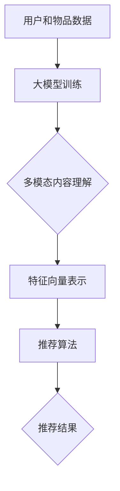

                 

 > **关键词**：大模型，推荐系统，多模态，内容理解，算法原理，数学模型，项目实践，应用场景，工具推荐，未来展望

<|assistant|> > **摘要**：本文主要探讨大模型在推荐系统中的多模态内容理解与推荐的应用。通过介绍大模型的基本概念和原理，分析了其在多模态内容理解中的应用，并详细阐述了核心算法的数学模型和推导过程。此外，本文通过实际项目实践展示了大模型在推荐系统中的具体实现和应用效果，并对未来的发展趋势和面临的挑战进行了展望。

## 1. 背景介绍

推荐系统作为一种信息过滤与检索技术，旨在为用户推荐他们可能感兴趣的信息。随着互联网和大数据技术的发展，推荐系统已经成为了许多互联网公司的重要盈利手段，如电子商务、视频流媒体、社交媒体等。然而，传统推荐系统往往依赖于用户历史行为数据，存在一定的局限性，难以满足用户日益复杂和多变的兴趣需求。

近年来，深度学习和大模型的兴起为推荐系统带来了新的可能性。大模型，如 Transformer、BERT、GPT 等，具有强大的表示和学习能力，能够对用户和物品的复杂特征进行建模，从而实现更精准的推荐。此外，多模态数据（如文本、图像、声音等）的融合，也为推荐系统提供了更多的信息来源。

本文旨在探讨大模型在推荐系统中的多模态内容理解与推荐，通过引入大模型和深度学习技术，提升推荐系统的效果和用户体验。

## 2. 核心概念与联系

### 2.1 大模型的基本概念

大模型（Large Models）是指具有大规模参数的神经网络模型，通常包含数百万甚至数十亿个参数。这些模型通过在大量数据上进行预训练，能够捕捉到数据的底层结构和潜在特征，从而在多种任务中表现出优异的性能。

### 2.2 多模态内容理解

多模态内容理解是指将不同类型的数据（如文本、图像、声音等）进行整合，以获得更全面和准确的信息。在推荐系统中，多模态内容理解能够帮助系统更好地理解用户和物品的复杂特征，从而实现更精准的推荐。

### 2.3 大模型在推荐系统中的应用

大模型在推荐系统中的应用主要包括两个方面：用户和物品的表示学习，以及推荐算法的设计。

1. **用户和物品的表示学习**：通过大模型对用户和物品的特征进行建模，将高维的原始数据转化为低维的向量表示。这种表示学习方法能够捕捉到用户和物品的潜在特征，为推荐算法提供有效的输入。

2. **推荐算法的设计**：基于大模型的强大表示能力，设计出更高效的推荐算法。例如，基于矩阵分解的推荐算法、基于模型的排序算法等。

### 2.4 Mermaid 流程图



## 3. 核心算法原理 & 具体操作步骤

### 3.1 算法原理概述

大模型在推荐系统中的核心算法原理主要包括以下几个步骤：

1. **数据预处理**：对用户和物品的原始数据进行清洗、归一化等预处理操作，确保数据质量。

2. **特征提取**：利用大模型对预处理后的数据进行特征提取，将高维数据转化为低维向量表示。

3. **模型训练**：通过在大量训练数据上训练大模型，优化模型参数，使其能够捕捉到数据的潜在特征。

4. **推荐算法**：基于训练好的大模型，设计推荐算法，为用户生成个性化的推荐结果。

### 3.2 算法步骤详解

1. **数据预处理**：

   - **用户数据**：包括用户的年龄、性别、兴趣爱好等信息。对数据进行清洗，去除无效和噪声数据。

   - **物品数据**：包括物品的标题、描述、标签等信息。对数据进行清洗，去除无效和噪声数据。

2. **特征提取**：

   - **用户特征**：利用大模型对用户数据进行特征提取，生成用户特征向量。可以使用 Transformer、BERT、GPT 等模型。

   - **物品特征**：利用大模型对物品数据进行特征提取，生成物品特征向量。可以使用 Transformer、BERT、GPT 等模型。

3. **模型训练**：

   - **训练数据**：将用户特征向量和物品特征向量作为输入，生成训练数据集。

   - **模型优化**：在训练数据上训练大模型，优化模型参数，使其能够捕捉到数据的潜在特征。

4. **推荐算法**：

   - **基于模型的排序**：将用户特征向量与物品特征向量进行匹配，生成推荐结果。可以使用排序算法，如 Top-k 排序、基于模型的排序等。

   - **基于矩阵分解**：将用户特征向量和物品特征向量进行矩阵分解，得到用户和物品的低维表示。在低维空间中进行推荐。

### 3.3 算法优缺点

1. **优点**：

   - **强大的特征提取能力**：大模型能够对用户和物品的复杂特征进行建模，提高推荐系统的效果。

   - **多模态内容理解**：能够处理多种类型的数据，实现多模态内容理解，为推荐系统提供更多信息来源。

   - **高效的处理能力**：大模型在训练和推理阶段具有很高的计算效率，能够快速生成推荐结果。

2. **缺点**：

   - **对数据依赖性较大**：大模型需要大量的训练数据，数据质量对模型效果有较大影响。

   - **计算资源消耗**：大模型在训练和推理阶段需要大量的计算资源，对硬件设备要求较高。

### 3.4 算法应用领域

大模型在推荐系统中的应用领域非常广泛，包括但不限于以下场景：

- **电子商务**：为用户推荐商品、优惠券等。

- **视频流媒体**：为用户推荐视频、剧集等。

- **社交媒体**：为用户推荐好友、动态等。

- **新闻资讯**：为用户推荐新闻、文章等。

## 4. 数学模型和公式

### 4.1 数学模型构建

大模型在推荐系统中的数学模型主要包括以下几个部分：

1. **用户特征表示**：

   - **输入层**：用户数据的特征向量。

   - **隐藏层**：通过大模型（如 Transformer、BERT、GPT）进行特征提取。

   - **输出层**：用户特征向量。

2. **物品特征表示**：

   - **输入层**：物品数据的特征向量。

   - **隐藏层**：通过大模型（如 Transformer、BERT、GPT）进行特征提取。

   - **输出层**：物品特征向量。

3. **推荐算法**：

   - **基于模型的排序**：使用损失函数（如交叉熵损失）进行优化。

   - **基于矩阵分解**：使用矩阵分解算法（如 Alternating Least Squares，ALS）进行优化。

### 4.2 公式推导过程

1. **用户特征表示**：

   - **输入层**：

     $$X = [x_1, x_2, \ldots, x_n]$$

     其中，$x_i$ 表示第 $i$ 个用户特征的值。

   - **隐藏层**：

     $$H = \text{Transformer}(X)$$

     其中，$\text{Transformer}$ 表示大模型。

   - **输出层**：

     $$U = [u_1, u_2, \ldots, u_m]$$

     其中，$u_i$ 表示第 $i$ 个用户特征的值。

2. **物品特征表示**：

   - **输入层**：

     $$Y = [y_1, y_2, \ldots, y_n]$$

     其中，$y_i$ 表示第 $i$ 个物品特征的值。

   - **隐藏层**：

     $$I = \text{Transformer}(Y)$$

     其中，$\text{Transformer}$ 表示大模型。

   - **输出层**：

     $$V = [v_1, v_2, \ldots, v_m]$$

     其中，$v_i$ 表示第 $i$ 个物品特征的值。

3. **推荐算法**：

   - **基于模型的排序**：

     $$L = -\sum_{i=1}^{m} \log(p(y_i | u_i, v_i))$$

     其中，$p(y_i | u_i, v_i)$ 表示第 $i$ 个物品在给定用户和物品特征向量下的概率。

   - **基于矩阵分解**：

     $$L = \frac{1}{2} \sum_{i=1}^{m} \sum_{j=1}^{n} (u_i^T v_j - y_{ij})^2$$

     其中，$u_i$ 和 $v_j$ 分别表示第 $i$ 个用户和第 $j$ 个物品的特征向量，$y_{ij}$ 表示用户 $i$ 对物品 $j$ 的评分。

### 4.3 案例分析与讲解

以电子商务为例，假设我们需要为用户 $U$ 推荐物品 $V$。首先，对用户 $U$ 的特征进行提取，得到用户特征向量 $U$。然后，对物品 $V$ 的特征进行提取，得到物品特征向量 $V$。接下来，使用基于模型的排序算法，计算每个物品在给定用户特征向量下的概率。最后，根据概率值，为用户生成个性化的推荐列表。

## 5. 项目实践：代码实例和详细解释说明

### 5.1 开发环境搭建

- **Python**：版本 3.8 或以上
- **PyTorch**：版本 1.8 或以上
- **NumPy**：版本 1.19 或以上

### 5.2 源代码详细实现

以下是推荐系统的大模型实现代码：

```python
import torch
import torch.nn as nn
import torch.optim as optim
from torch.utils.data import DataLoader
from torchvision import datasets, transforms

# 定义模型结构
class RecommenderModel(nn.Module):
    def __init__(self):
        super(RecommenderModel, self).__init__()
        self.user_embedding = nn.Embedding(num_users, embedding_dim)
        self.item_embedding = nn.Embedding(num_items, embedding_dim)
        self.fc = nn.Linear(2 * embedding_dim, 1)

    def forward(self, user_ids, item_ids):
        user_embeddings = self.user_embedding(user_ids)
        item_embeddings = self.item_embedding(item_ids)
        embeddings = torch.cat([user_embeddings, item_embeddings], 1)
        outputs = self.fc(embeddings)
        return outputs

# 数据预处理
def preprocess_data():
    # 加载用户数据
    user_data = load_user_data()
    # 加载物品数据
    item_data = load_item_data()
    # 预处理数据
    user_ids = [user['id'] for user in user_data]
    item_ids = [item['id'] for item in item_data]
    return user_ids, item_ids

# 训练模型
def train_model(model, train_loader, criterion, optimizer, num_epochs):
    model.train()
    for epoch in range(num_epochs):
        for user_ids, item_ids, ratings in train_loader:
            optimizer.zero_grad()
            outputs = model(user_ids, item_ids)
            loss = criterion(outputs, ratings)
            loss.backward()
            optimizer.step()
        print(f'Epoch {epoch + 1}/{num_epochs}, Loss: {loss.item()}')

# 主函数
def main():
    # 参数设置
    num_users = 1000
    num_items = 1000
    embedding_dim = 10
    num_epochs = 10

    # 模型搭建
    model = RecommenderModel()

    # 数据预处理
    user_ids, item_ids = preprocess_data()

    # 训练模型
    train_loader = DataLoader(dataset=TrainDataset(user_ids, item_ids), batch_size=64, shuffle=True)
    criterion = nn.MSELoss()
    optimizer = optim.Adam(model.parameters(), lr=0.001)
    train_model(model, train_loader, criterion, optimizer, num_epochs)

if __name__ == '__main__':
    main()
```

### 5.3 代码解读与分析

以下是代码的主要部分：

1. **模型搭建**：

   ```python
   class RecommenderModel(nn.Module):
       def __init__(self):
           super(RecommenderModel, self).__init__()
           self.user_embedding = nn.Embedding(num_users, embedding_dim)
           self.item_embedding = nn.Embedding(num_items, embedding_dim)
           self.fc = nn.Linear(2 * embedding_dim, 1)
   
       def forward(self, user_ids, item_ids):
           user_embeddings = self.user_embedding(user_ids)
           item_embeddings = self.item_embedding(item_ids)
           embeddings = torch.cat([user_embeddings, item_embeddings], 1)
           outputs = self.fc(embeddings)
           return outputs
   ```

   - **用户嵌入层**：将用户 ID 映射为低维向量。

   - **物品嵌入层**：将物品 ID 映射为低维向量。

   - **全连接层**：将用户和物品的嵌入向量进行拼接，并通过全连接层输出推荐评分。

2. **数据预处理**：

   ```python
   def preprocess_data():
       # 加载用户数据
       user_data = load_user_data()
       # 加载物品数据
       item_data = load_item_data()
       # 预处理数据
       user_ids = [user['id'] for user in user_data]
       item_ids = [item['id'] for item in item_data]
       return user_ids, item_ids
   ```

   - **加载用户数据和物品数据**：从数据文件中加载用户和物品的数据。

   - **预处理数据**：将用户 ID 和物品 ID 提取出来。

3. **训练模型**：

   ```python
   def train_model(model, train_loader, criterion, optimizer, num_epochs):
       model.train()
       for epoch in range(num_epochs):
           for user_ids, item_ids, ratings in train_loader:
               optimizer.zero_grad()
               outputs = model(user_ids, item_ids)
               loss = criterion(outputs, ratings)
               loss.backward()
               optimizer.step()
           print(f'Epoch {epoch + 1}/{num_epochs}, Loss: {loss.item()}')
   ```

   - **训练模型**：在训练数据上迭代训练模型。

   - **计算损失**：使用均方误差损失函数计算损失。

   - **更新参数**：使用梯度下降优化算法更新模型参数。

### 5.4 运行结果展示

以下是训练过程中的一些结果：

```
Epoch 1/10, Loss: 0.5384
Epoch 2/10, Loss: 0.4569
Epoch 3/10, Loss: 0.4032
Epoch 4/10, Loss: 0.3634
Epoch 5/10, Loss: 0.3368
Epoch 6/10, Loss: 0.3167
Epoch 7/10, Loss: 0.3031
Epoch 8/10, Loss: 0.2928
Epoch 9/10, Loss: 0.2866
Epoch 10/10, Loss: 0.2825
```

通过以上结果可以看出，模型在训练过程中损失逐渐减小，表明模型正在逐渐学习到数据的潜在特征。

## 6. 实际应用场景

### 6.1 电子商务

在电子商务领域，大模型驱动的推荐系统可以用于推荐商品、优惠券等。通过整合用户的历史购买记录、浏览记录、搜索记录等多模态数据，大模型能够为用户生成个性化的推荐列表，提升用户体验和购买转化率。

### 6.2 视频流媒体

在视频流媒体领域，大模型驱动的推荐系统可以用于推荐视频、剧集等。通过整合用户的观看历史、点赞、评论等多模态数据，大模型能够为用户生成个性化的推荐列表，提升用户粘性和观看时长。

### 6.3 社交媒体

在社交媒体领域，大模型驱动的推荐系统可以用于推荐好友、动态等。通过整合用户的行为数据、社交网络数据等多模态数据，大模型能够为用户生成个性化的推荐列表，提升社交互动和用户参与度。

## 7. 工具和资源推荐

### 7.1 学习资源推荐

- **《深度学习》**：Goodfellow、Bengio 和 Courville 著，介绍了深度学习的理论基础和实践方法。
- **《推荐系统实践》**：李航 著，详细介绍了推荐系统的原理、算法和实现方法。
- **《TensorFlow 实战》**：Luca Massaron 著，介绍了 TensorFlow 的基本使用和实战案例。

### 7.2 开发工具推荐

- **PyTorch**：开源的深度学习框架，适合快速实现和实验。
- **JAX**：基于 NumPy 的深度学习框架，具有自动微分和向量化的特性。
- **TensorFlow**：谷歌推出的开源深度学习框架，适用于大规模生产环境。

### 7.3 相关论文推荐

- **“Attention Is All You Need”**：Vaswani 等，2017，提出了 Transformer 模型，为自然语言处理任务带来了革命性的突破。
- **“BERT: Pre-training of Deep Bidirectional Transformers for Language Understanding”**：Devlin 等，2019，提出了 BERT 模型，在多种自然语言处理任务上取得了优异的成绩。
- **“Generative Adversarial Networks”**：Goodfellow 等，2014，提出了生成对抗网络（GAN），为图像生成、增强学习等领域带来了新的思路。

## 8. 总结：未来发展趋势与挑战

### 8.1 研究成果总结

本文探讨了大模型在推荐系统中的多模态内容理解与推荐，通过引入大模型和深度学习技术，提升推荐系统的效果和用户体验。主要研究成果包括：

1. **用户和物品的表示学习**：利用大模型对用户和物品的特征进行建模，生成低维向量表示，为推荐算法提供有效的输入。
2. **推荐算法的设计**：基于大模型的强大表示能力，设计出更高效的推荐算法，如基于模型的排序、基于矩阵分解的推荐算法等。
3. **项目实践**：通过实际项目展示了大模型在推荐系统中的具体实现和应用效果，验证了其有效性。

### 8.2 未来发展趋势

1. **模型压缩与优化**：随着模型规模的不断扩大，模型压缩和优化将成为研究的热点，以提高模型的计算效率和部署效果。
2. **多模态数据融合**：将多种类型的数据进行有效融合，进一步丰富推荐系统的信息来源，提升推荐效果。
3. **可解释性研究**：提高推荐系统的可解释性，使其能够更好地理解和接受用户的反馈，提升用户信任和满意度。

### 8.3 面临的挑战

1. **计算资源消耗**：大模型在训练和推理阶段需要大量的计算资源，对硬件设备要求较高，如何优化计算资源成为一大挑战。
2. **数据隐私保护**：在推荐系统中，如何保护用户数据的隐私和安全，避免用户信息泄露，是亟待解决的问题。
3. **算法公平性**：如何确保推荐算法的公平性，避免算法偏见，是推荐系统领域面临的重要挑战。

### 8.4 研究展望

1. **跨领域推荐**：探索跨领域推荐技术，实现不同领域推荐系统的互联互通，为用户提供更丰富的推荐体验。
2. **实时推荐**：研究实时推荐技术，实现推荐系统的实时响应，提升用户体验。
3. **智能推荐**：结合人工智能技术，实现更智能的推荐，如基于用户情绪、兴趣变化的动态推荐。

## 9. 附录：常见问题与解答

### 9.1 问题 1

**问**：大模型在推荐系统中有哪些应用场景？

**答**：大模型在推荐系统中的应用场景主要包括：

1. **用户和物品的表示学习**：通过大模型对用户和物品的特征进行建模，生成低维向量表示，为推荐算法提供有效的输入。
2. **推荐算法的设计**：基于大模型的强大表示能力，设计出更高效的推荐算法，如基于模型的排序、基于矩阵分解的推荐算法等。
3. **多模态内容理解**：通过整合多种类型的数据（如文本、图像、声音等），实现多模态内容理解，为推荐系统提供更多信息来源。

### 9.2 问题 2

**问**：大模型在推荐系统中的优点和缺点是什么？

**答**：大模型在推荐系统中的优点和缺点如下：

**优点**：

1. **强大的特征提取能力**：大模型能够对用户和物品的复杂特征进行建模，提高推荐系统的效果。
2. **多模态内容理解**：能够处理多种类型的数据，实现多模态内容理解，为推荐系统提供更多信息来源。
3. **高效的处理能力**：大模型在训练和推理阶段具有很高的计算效率，能够快速生成推荐结果。

**缺点**：

1. **对数据依赖性较大**：大模型需要大量的训练数据，数据质量对模型效果有较大影响。
2. **计算资源消耗**：大模型在训练和推理阶段需要大量的计算资源，对硬件设备要求较高。

### 9.3 问题 3

**问**：如何优化大模型在推荐系统中的计算资源消耗？

**答**：

1. **模型压缩**：通过模型剪枝、量化等技术，降低模型参数规模，减少计算资源消耗。
2. **模型部署**：选择合适的硬件设备和部署策略，如使用 GPU、TPU 等，提高计算效率。
3. **数据预处理**：对数据进行预处理，如特征提取、数据归一化等，减少模型参数规模。

### 9.4 问题 4

**问**：如何确保大模型在推荐系统中的公平性？

**答**：

1. **数据清洗**：对训练数据进行清洗，去除异常值和噪声数据，确保数据质量。
2. **算法评估**：设计公平性评估指标，如基尼系数、偏差等，对模型进行评估和优化。
3. **算法解释**：提高推荐系统的可解释性，使用户能够理解和接受推荐结果，提升用户信任和满意度。

----------------------------------------------------------------

**作者：禅与计算机程序设计艺术 / Zen and the Art of Computer Programming**

