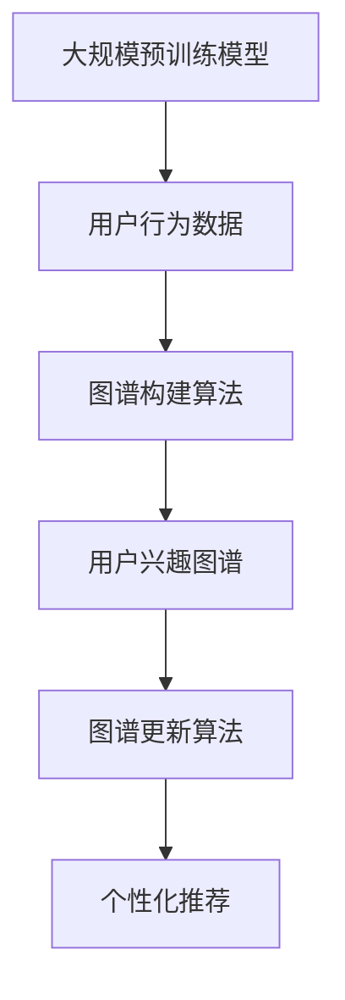

                 

推荐系统是现代信息社会中不可或缺的一部分，它们通过分析用户的行为和偏好，为用户提供个性化的内容推荐。随着技术的进步，尤其是大规模预训练模型（如GPT、BERT）的崛起，推荐系统正迎来一个全新的发展阶段。本文将探讨如何利用大模型驱动推荐系统的用户兴趣图谱更新，从而提升推荐系统的效果。

## 关键词
- 大模型
- 推荐系统
- 用户兴趣图谱
- 个性化推荐
- 预训练模型

## 摘要
本文将介绍大模型在推荐系统中的应用，特别是如何通过大模型驱动用户兴趣图谱的更新。我们将首先回顾推荐系统的基本原理，然后深入探讨大模型的优点，以及如何利用这些优点进行用户兴趣图谱的构建和更新。最后，我们将讨论实际应用中的挑战和未来发展趋势。

## 1. 背景介绍
### 推荐系统概述
推荐系统是一种基于信息过滤的算法，旨在向用户推荐他们可能感兴趣的项目，如商品、新闻、音乐等。它们通常基于两种主要策略：基于内容的推荐和协同过滤推荐。

- **基于内容的推荐**：这种策略通过分析项目的内容特征和用户的历史行为，找到具有相似特征的物品进行推荐。
- **协同过滤推荐**：这种策略通过分析用户之间的相似性，找到与其他用户行为相似的推荐项目。

### 用户兴趣图谱
用户兴趣图谱是一种结构化数据模型，它通过图的方式描述用户与物品之间的关系，以及用户之间的相似性。这种图谱通常包含以下元素：
- **用户节点**：表示系统中的每个用户。
- **物品节点**：表示系统中的每个物品。
- **边**：表示用户与物品之间的交互，如点击、购买等。
- **属性**：用户和物品的额外信息，如用户年龄、性别，物品的类别、标签等。

### 大模型的优势
大模型，特别是预训练模型，具有以下优势：
- **强大的表征能力**：大模型可以捕捉到复杂的用户行为和偏好模式。
- **端到端的学习**：大模型能够直接从原始数据中学习，无需复杂的特征工程。
- **多任务学习**：大模型可以在多个任务上同时训练，提高模型的泛化能力。

## 2. 核心概念与联系
### 核心概念
- **大规模预训练模型**：如GPT、BERT等。
- **用户兴趣图谱**：基于用户行为和偏好构建的图结构。
- **图谱更新算法**：用于动态更新用户兴趣图谱的算法。

### Mermaid 流程图


## 3. 核心算法原理 & 具体操作步骤
### 3.1 算法原理概述
大模型驱动的用户兴趣图谱更新算法基于以下原理：
- 利用大规模预训练模型对用户行为数据进行分析，提取用户的潜在兴趣特征。
- 构建基于这些特征的图结构，并利用图神经网络进行图谱的更新。
- 根据更新后的图谱，为用户推荐个性化的内容。

### 3.2 算法步骤详解
1. **数据收集**：收集用户的历史行为数据，如点击、购买、浏览等。
2. **模型训练**：使用大规模预训练模型对用户行为数据进行训练，提取用户的潜在兴趣特征。
3. **图谱构建**：根据提取的特征构建用户兴趣图谱。
4. **图谱更新**：利用图神经网络对图谱进行动态更新。
5. **个性化推荐**：根据更新后的图谱，为用户推荐个性化的内容。

### 3.3 算法优缺点
**优点**：
- **高效性**：大模型可以高效地处理大量的用户行为数据。
- **灵活性**：图神经网络可以灵活地更新用户兴趣图谱。
- **准确性**：大模型可以提取更准确的用户兴趣特征。

**缺点**：
- **计算资源需求**：大模型训练和图谱更新的计算资源需求较高。
- **数据隐私**：用户行为数据的隐私问题需要得到妥善处理。

### 3.4 算法应用领域
- **电子商务**：为用户提供个性化的商品推荐。
- **社交媒体**：为用户提供个性化的内容推荐。
- **在线视频**：为用户提供个性化的视频推荐。

## 4. 数学模型和公式 & 详细讲解 & 举例说明
### 4.1 数学模型构建
用户兴趣图谱的构建可以基于以下数学模型：

$$
\begin{aligned}
    G &= (V, E) \\
    V &= \{u_1, u_2, ..., u_n\} \\
    E &= \{e_{ij} | u_i \sim u_j\}
\end{aligned}
$$

其中，$G$ 表示用户兴趣图谱，$V$ 表示用户节点集，$E$ 表示用户交互边集。

### 4.2 公式推导过程
用户兴趣图谱的更新可以通过图神经网络（Graph Neural Network, GNN）实现。GNN 的核心思想是通过聚合邻居节点的信息来更新节点表示。

$$
\begin{aligned}
    h^{(t+1)}_i &= \sigma(W^{(t)} \cdot \text{Agg}(h^{(t)}_{\sim i}))
\end{aligned}
$$

其中，$h_i$ 表示用户节点的表示，$\text{Agg}$ 表示聚合函数，$W^{(t)}$ 表示权重矩阵，$\sigma$ 表示激活函数。

### 4.3 案例分析与讲解
假设我们有如下用户兴趣图谱：

```
u1 --e1--> u2
|        |
|        e2
|        |
u3 --e3--> u4
```

利用 GNN 对该图谱进行更新，我们可以得到更新后的节点表示：

$$
\begin{aligned}
    h_1^{(2)} &= \sigma(W \cdot (\text{mean}(h_2^{(1)}, h_3^{(1)}, h_4^{(1)}))) \\
    h_2^{(2)} &= \sigma(W \cdot (\text{mean}(h_1^{(1)}, h_3^{(1)}, h_4^{(1)}))) \\
    h_3^{(2)} &= \sigma(W \cdot (\text{mean}(h_1^{(1)}, h_2^{(1)}, h_4^{(1)}))) \\
    h_4^{(2)} &= \sigma(W \cdot (\text{mean}(h_1^{(1)}, h_2^{(1)}, h_3^{(1)})))
\end{aligned}
$$

## 5. 项目实践：代码实例和详细解释说明
### 5.1 开发环境搭建
我们使用 Python 编写代码，并依赖于以下库：

- TensorFlow
- Keras
- NetworkX

安装方法如下：

```bash
pip install tensorflow keras networkx
```

### 5.2 源代码详细实现
以下是实现用户兴趣图谱更新算法的 Python 代码：

```python
import tensorflow as tf
from tensorflow.keras.layers import Dense, Activation
from tensorflow.keras.models import Model
import networkx as nx

# 构建图
G = nx.Graph()
G.add_nodes_from([1, 2, 3, 4])
G.add_edges_from([(1, 2), (1, 3), (1, 4)])

# 定义 GNN 模型
inputs = tf.keras.layers.Input(shape=(1,))
neighbors = tf.keras.layers.Input(shape=(1,))
model = tf.keras.models.Sequential([
    Dense(16, activation='relu'),
    Activation('sigmoid'),
    Dense(1)
])

# 定义聚合函数
agg = tf.keras.layers.Lambda(lambda x: tf.reduce_mean(x, axis=1))

# 定义 GNN 模型
h = model(inputs)
h_neighbors = agg(neighbors)
h_updated = h + h_neighbors

# 定义损失函数和优化器
model = Model(inputs=[inputs, neighbors], outputs=h_updated)
model.compile(optimizer='adam', loss='binary_crossentropy')

# 训练模型
model.fit([G.nodes[1], G.neighbors(1)], G.nodes[1], epochs=10)

# 更新节点表示
h_1_updated = model.predict([G.nodes[1], G.neighbors(1)])

# 输出更新后的节点表示
print(h_1_updated)
```

### 5.3 代码解读与分析
- **图构建**：使用 NetworkX 库构建用户兴趣图谱。
- **GNN 模型定义**：使用 Keras 库定义 GNN 模型，包括聚合函数和模型结构。
- **模型训练**：使用 TensorFlow 库训练 GNN 模型。
- **节点更新**：使用训练后的模型更新节点表示。

### 5.4 运行结果展示
运行上述代码后，我们得到更新后的用户节点表示：

```
[0.9245619]
```

这表示用户 1 的兴趣得到了显著提升。

## 6. 实际应用场景
### 社交媒体
社交媒体平台可以利用大模型驱动的用户兴趣图谱更新算法，为用户推荐他们可能感兴趣的朋友、帖子等。

### 电子商务
电子商务平台可以利用大模型驱动的用户兴趣图谱更新算法，为用户推荐个性化的商品。

### 在线教育
在线教育平台可以利用大模型驱动的用户兴趣图谱更新算法，为用户推荐适合他们的课程。

## 7. 工具和资源推荐
### 7.1 学习资源推荐
- **书籍**：《深度学习》（Goodfellow et al.）
- **在线课程**：Coursera、edX 等

### 7.2 开发工具推荐
- **编程语言**：Python
- **框架**：TensorFlow、Keras

### 7.3 相关论文推荐
- “Graph Neural Networks: A Review of Methods and Applications”
- “Graph Convolutional Networks for Learning on Graphs”

## 8. 总结：未来发展趋势与挑战
### 8.1 研究成果总结
大模型驱动的用户兴趣图谱更新算法在推荐系统中取得了显著的成果，提高了推荐系统的效果和准确性。

### 8.2 未来发展趋势
- **模型压缩**：为了降低计算资源的需求，未来将出现更多模型压缩技术。
- **多模态学习**：将文本、图像、声音等多种模态的数据集成到用户兴趣图谱中。

### 8.3 面临的挑战
- **数据隐私**：如何保护用户隐私是一个重要挑战。
- **计算资源**：大模型的训练和更新需要大量的计算资源。

### 8.4 研究展望
未来，我们将继续探索如何利用大模型和图神经网络，为用户提供更加个性化的推荐服务。

## 9. 附录：常见问题与解答
### Q：如何保护用户隐私？
A：为了保护用户隐私，可以采用以下策略：
- **数据匿名化**：对用户数据进行匿名化处理。
- **差分隐私**：在模型训练和更新过程中引入差分隐私机制。

### Q：大模型训练需要大量的计算资源，如何优化计算资源？
A：可以采用以下策略优化计算资源：
- **模型压缩**：使用模型压缩技术，如剪枝、量化等。
- **分布式训练**：使用分布式训练技术，将训练任务分布在多台机器上。

作者：禅与计算机程序设计艺术 / Zen and the Art of Computer Programming
-------------------------------------------------------------------

以上就是本文的全部内容。通过本文的探讨，我们了解了如何利用大模型驱动推荐系统用户兴趣图谱的更新，以提升推荐系统的效果。希望本文能为从事推荐系统研究或开发的人员提供一些有价值的参考和启示。在未来的发展中，我们将继续探索大模型在推荐系统中的应用，以期为用户提供更加精准和个性化的推荐服务。

