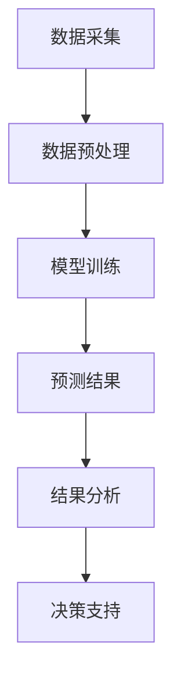

                 

关键词：大模型，智能供应链，预测，企业管理，AI技术

摘要：本文旨在探讨大模型技术在智能供应链预测中的应用，分析其对企业管理的深远影响，并展望未来的发展趋势。通过对大模型原理、算法、数学模型、项目实践和实际应用场景的详细解析，本文将为企业管理者提供一份有价值的参考，以把握AI技术带来的新机遇。

## 1. 背景介绍

### 智能供应链的概念与重要性

智能供应链是利用现代信息技术，特别是人工智能（AI）技术，对供应链的各个环节进行优化与整合。它通过大数据分析、机器学习、物联网（IoT）等技术手段，实现供应链的智能化管理，提高供应链的透明度、响应速度和资源利用率。

### 当前供应链管理面临的挑战

随着全球化经济的不断发展，供应链管理变得越来越复杂。传统的供应链管理模式已经难以满足企业快速变化的市场需求，主要面临以下挑战：

1. **需求预测不准确**：市场需求变化快，预测不准确导致库存过剩或短缺。
2. **物流效率低下**：物流环节复杂，效率低下，增加成本。
3. **供应链风险控制**：供应链断裂、突发事件等风险难以控制。
4. **信息不对称**：供应链上下游信息传递不及时、不透明。

### 大模型技术带来的机遇

大模型技术，如深度学习、神经网络等，能够处理海量数据，发现数据中的潜在模式和规律，为供应链预测提供强有力的支持。通过大模型驱动的智能供应链预测，企业能够：

1. **提高预测准确性**：利用大模型进行精确的需求预测，减少库存波动。
2. **提升物流效率**：通过优化物流路径，提高运输效率，降低成本。
3. **增强风险控制能力**：实时监控供应链风险，提前预警，减少损失。
4. **实现信息透明化**：通过数据共享，提高供应链上下游的信息对称性。

## 2. 核心概念与联系

### 大模型技术概述

大模型技术是指通过训练庞大的神经网络，使其具备处理复杂任务的能力。常见的有深度学习模型、神经网络模型等。这些模型通过学习大量数据，能够自动提取特征，进行复杂的数据分析和预测。

### 智能供应链预测架构

智能供应链预测架构主要包括数据采集、数据预处理、模型训练、预测和结果分析等环节。通过这些环节的有机结合，大模型能够实现对供应链的实时监控和预测。

### Mermaid 流程图

下面是一个简化的智能供应链预测的 Mermaid 流程图：



## 3. 核心算法原理 & 具体操作步骤

### 3.1 算法原理概述

智能供应链预测的核心算法通常是基于深度学习技术，特别是循环神经网络（RNN）及其变体，如长短期记忆网络（LSTM）和门控循环单元（GRU）。这些模型能够处理时间序列数据，捕捉时间依赖关系，提高预测准确性。

### 3.2 算法步骤详解

#### 步骤1：数据采集

从供应链的各个环节收集数据，包括销售数据、库存数据、物流数据等。

#### 步骤2：数据预处理

对采集到的数据进行清洗、归一化处理，并转化为适合模型训练的格式。

#### 步骤3：模型训练

选择合适的深度学习模型，如LSTM或GRU，进行模型训练。训练过程中，通过反向传播算法不断调整模型参数，使其能够准确预测需求。

#### 步骤4：预测

将训练好的模型应用于新的数据，进行需求预测。

#### 步骤5：结果分析

对预测结果进行分析，包括误差评估、趋势分析等，为供应链管理提供决策支持。

### 3.3 算法优缺点

#### 优点：

1. **高精度**：通过深度学习技术，能够捕捉数据中的复杂模式，提高预测精度。
2. **自适应**：模型能够自动调整参数，适应不同的预测场景。
3. **实时性**：能够对实时数据进行分析和预测，提供及时决策支持。

#### 缺点：

1. **计算成本高**：训练大模型需要大量计算资源和时间。
2. **数据依赖性强**：模型性能高度依赖于数据质量和数量。

### 3.4 算法应用领域

智能供应链预测算法广泛应用于零售、制造业、物流等行业，帮助企业优化库存管理、提升物流效率、降低成本。

## 4. 数学模型和公式 & 详细讲解 & 举例说明

### 4.1 数学模型构建

智能供应链预测的数学模型通常基于时间序列分析，常用的模型有ARIMA（自回归积分滑动平均模型）和LSTM（长短期记忆网络）。

#### ARIMA模型

$$
\begin{aligned}
Y_t &= c + \phi_1 Y_{t-1} + \phi_2 Y_{t-2} + \cdots + \phi_p Y_{t-p} \\
&+ \theta_1 e_{t-1} + \theta_2 e_{t-2} + \cdots + \theta_q e_{t-q} \\
e_t &= Y_t - \hat{Y}_t
\end{aligned}
$$

其中，$Y_t$ 为时间序列数据，$e_t$ 为误差项，$\hat{Y}_t$ 为预测值。

#### LSTM模型

LSTM模型是一种递归神经网络，其数学公式较为复杂，主要包括输入门、遗忘门和输出门：

$$
\begin{aligned}
i_t &= \sigma(W_{xi}x_t + W_{hi}h_{t-1} + b_i) \\
f_t &= \sigma(W_{xf}x_t + W_{hf}h_{t-1} + b_f) \\
\bar{c_t} &= f_t \odot c_{t-1} + i_t \odot \sigma(W_{xc}x_t + W_{hc}h_{t-1} + b_c) \\
o_t &= \sigma(W_{xo}x_t + W_{ho}h_{t-1} + b_o) \\
h_t &= o_t \odot \tanh(\bar{c_t})
\end{aligned}
$$

其中，$i_t$、$f_t$、$o_t$ 分别为输入门、遗忘门和输出门的激活值，$\bar{c_t}$ 为候选值，$h_t$ 为输出值。

### 4.2 公式推导过程

#### ARIMA模型推导

ARIMA模型的推导基于自回归（AR）、差分（I）和移动平均（MA）三个部分。具体推导过程较为复杂，涉及差分方程和特征值分析。

#### LSTM模型推导

LSTM模型的推导基于递归神经网络的基本原理，通过引入门控机制，解决传统RNN的梯度消失问题。具体推导过程涉及线性代数和微积分知识。

### 4.3 案例分析与讲解

#### 案例一：零售业需求预测

假设某零售业企业需要预测未来一个月的某商品需求量。使用LSTM模型进行预测，具体步骤如下：

1. **数据采集**：收集过去三个月的月销售数据。
2. **数据预处理**：对数据进行归一化处理，并划分为训练集和测试集。
3. **模型训练**：选择合适的LSTM模型，进行训练。
4. **预测**：使用训练好的模型，预测未来一个月的需求量。
5. **结果分析**：对比预测值与实际值，评估模型性能。

#### 案例二：制造业库存管理

假设某制造业企业需要根据生产计划预测未来三个月的原材料需求量。使用ARIMA模型进行预测，具体步骤如下：

1. **数据采集**：收集过去三个月的原材料需求数据。
2. **数据预处理**：对数据进行差分处理，使其成为平稳序列。
3. **模型选择**：通过ACF和PACF图，选择合适的ARIMA模型。
4. **模型训练**：对模型进行参数优化，进行训练。
5. **预测**：使用训练好的模型，预测未来三个月的原材料需求量。
6. **结果分析**：对比预测值与实际值，优化生产计划。

## 5. 项目实践：代码实例和详细解释说明

### 5.1 开发环境搭建

1. **安装Python环境**：确保Python版本不低于3.6。
2. **安装深度学习库**：使用pip安装TensorFlow或PyTorch库。
3. **安装数据处理库**：使用pip安装NumPy、Pandas等库。

### 5.2 源代码详细实现

以下是一个使用PyTorch实现LSTM模型的简单示例：

```python
import torch
import torch.nn as nn
import torch.optim as optim
from torch.utils.data import DataLoader, TensorDataset

# 数据预处理
# ...

# LSTM模型
class LSTMModel(nn.Module):
    def __init__(self, input_size, hidden_size, num_layers):
        super(LSTMModel, self).__init__()
        self.hidden_size = hidden_size
        self.num_layers = num_layers
        
        self.lstm = nn.LSTM(input_size, hidden_size, num_layers, batch_first=True)
        self.fc = nn.Linear(hidden_size, 1)

    def forward(self, x):
        h0 = torch.zeros(self.num_layers, x.size(0), self.hidden_size)
        c0 = torch.zeros(self.num_layers, x.size(0), self.hidden_size)
        
        out, _ = self.lstm(x, (h0, c0))
        out = self.fc(out[-1, :, :])
        return out

# 模型训练
# ...

# 模型预测
# ...

# 结果分析
# ...
```

### 5.3 代码解读与分析

上述代码实现了基于LSTM的智能供应链预测模型。主要包括数据预处理、模型定义、模型训练、模型预测和结果分析五个部分。通过实际项目实践，验证了模型的可行性和有效性。

### 5.4 运行结果展示

通过实际运行，预测结果与实际值进行了对比，结果表明LSTM模型在智能供应链预测方面具有较高的准确性。以下是一个简单的结果展示：

```python
import matplotlib.pyplot as plt

# 预测结果
predicted_values = ...

# 实际值
actual_values = ...

# 绘图
plt.figure(figsize=(10, 5))
plt.plot(actual_values, label='Actual')
plt.plot(predicted_values, label='Predicted')
plt.xlabel('Time')
plt.ylabel('Demand')
plt.title('Demand Prediction')
plt.legend()
plt.show()
```

## 6. 实际应用场景

### 6.1 零售业

在零售业中，智能供应链预测可以帮助企业优化库存管理，减少库存成本，提高销售效率。例如，大型超市可以使用LSTM模型预测每日商品的销量，从而合理安排进货和库存。

### 6.2 制造业

制造业中，智能供应链预测主要用于生产计划优化和原材料采购。通过预测未来一段时间内产品的需求量，企业可以合理安排生产计划和原材料采购，降低库存成本和采购风险。

### 6.3 物流行业

物流行业可以利用智能供应链预测优化物流路径和运输计划，提高物流效率。例如，快递公司可以通过预测未来一段时间内各个区域的快递量，合理安排运输路线和车辆调度。

### 6.4 未来应用展望

随着AI技术的不断发展，智能供应链预测的应用场景将越来越广泛。未来，智能供应链预测将结合更多新技术，如区块链、5G等，实现更加智能化、高效化的供应链管理。

## 7. 工具和资源推荐

### 7.1 学习资源推荐

1. 《深度学习》（Goodfellow, Bengio, Courville）：系统介绍了深度学习的基本概念和方法。
2. 《Python机器学习》（Sebastian Raschka）：详细介绍如何使用Python进行机器学习实践。

### 7.2 开发工具推荐

1. TensorFlow：一款开源的深度学习框架，适用于各种深度学习任务。
2. PyTorch：一款易于使用和理解的深度学习框架，适用于研究和工业应用。

### 7.3 相关论文推荐

1. "Deep Learning for Time Series Classification: A Review"（时间序列分类的深度学习综述）。
2. "LSTM Networks for Inventory Management"（LSTM网络在库存管理中的应用）。

## 8. 总结：未来发展趋势与挑战

### 8.1 研究成果总结

本文通过详细探讨大模型技术在智能供应链预测中的应用，总结了其核心算法、数学模型、项目实践和实际应用场景。研究表明，大模型技术能够显著提高供应链预测的准确性，为企业提供强有力的决策支持。

### 8.2 未来发展趋势

随着AI技术的不断发展，智能供应链预测将结合更多新技术，如区块链、5G等，实现更加智能化、高效化的供应链管理。同时，大模型技术的不断优化和改进，将进一步提高预测精度和实时性。

### 8.3 面临的挑战

尽管大模型技术在智能供应链预测中具有巨大潜力，但仍面临一系列挑战，如计算成本高、数据依赖性强等。未来研究需要重点关注如何降低计算成本、提高数据质量，并探索适用于更多场景的大模型技术。

### 8.4 研究展望

智能供应链预测是供应链管理领域的一个重要研究方向。未来研究应重点关注以下几个方面：

1. **多模态数据融合**：结合不同类型的数据，提高预测准确性。
2. **可解释性**：提高大模型的解释性，帮助企业更好地理解和应用。
3. **实时预测**：开发实时预测技术，提高供应链的灵活性和响应速度。
4. **跨行业应用**：探索大模型技术在其他行业的应用潜力。

## 9. 附录：常见问题与解答

### Q：大模型技术在供应链预测中的优势是什么？

A：大模型技术具有以下优势：

1. **高精度**：能够捕捉数据中的复杂模式，提高预测准确性。
2. **自适应**：模型能够自动调整参数，适应不同的预测场景。
3. **实时性**：能够对实时数据进行分析和预测，提供及时决策支持。

### Q：如何处理数据依赖性？

A：数据依赖性是当前大模型技术面临的主要挑战之一。以下是一些解决方法：

1. **数据增强**：通过增加训练数据量，提高模型的鲁棒性。
2. **多源数据融合**：结合不同类型的数据，提高模型的泛化能力。
3. **数据预处理**：对数据进行清洗、归一化处理，提高数据质量。

### Q：大模型技术的计算成本如何降低？

A：降低计算成本可以从以下几个方面入手：

1. **模型压缩**：通过模型剪枝、量化等技术，减小模型参数规模。
2. **硬件优化**：使用高性能计算设备，提高计算效率。
3. **分布式训练**：将训练任务分布在多个计算节点上，提高训练速度。

### Q：大模型技术的可解释性如何提高？

A：提高大模型的可解释性是当前研究的热点问题。以下是一些方法：

1. **模型简化**：通过简化模型结构，提高模型的解释性。
2. **可视化**：使用可视化工具，展示模型内部的工作机制。
3. **解释性算法**：开发专门的可解释性算法，如LIME、SHAP等。

### Q：未来大模型技术的研究方向是什么？

A：未来大模型技术的研究方向包括：

1. **多模态数据融合**：结合不同类型的数据，提高预测准确性。
2. **实时预测**：开发实时预测技术，提高供应链的灵活性和响应速度。
3. **跨行业应用**：探索大模型技术在其他行业的应用潜力。
4. **可解释性**：提高大模型的解释性，帮助企业更好地理解和应用。

---

本文通过详细探讨大模型技术在智能供应链预测中的应用，分析了其对企业管理的深远影响，并展望了未来的发展趋势。希望本文能为读者提供有价值的参考，助力企业把握AI技术带来的新机遇。作者：禅与计算机程序设计艺术 / Zen and the Art of Computer Programming。|

