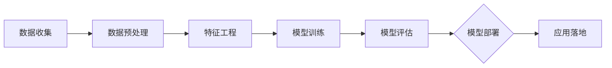

                 

 关键词：大模型、智能客户洞察、精准营销、AI、大数据分析、客户行为分析、个性化推荐系统、深度学习

> 摘要：本文将探讨如何利用大模型技术，实现智能客户洞察，并进一步提升精准营销的效果。通过介绍大模型的基本概念、原理和应用，以及其在智能客户洞察和精准营销领域的应用实践，本文旨在为读者提供一个全面而深入的理解，帮助企业在激烈的市场竞争中脱颖而出。

## 1. 背景介绍

在当今全球数字经济迅速发展的背景下，数据已经成为了企业最为重要的资产之一。然而，如何有效地从海量数据中提取有价值的信息，并转化为实际的商业价值，成为了企业面临的一大挑战。在这个背景下，大模型技术应运而生。

大模型，又称为深度学习模型，是一种基于人工神经网络构建的复杂算法模型。通过训练和优化，这些模型能够从大量数据中自动学习特征，提取有价值的信息，并在多种任务中表现出色。大模型在计算机视觉、自然语言处理、语音识别等领域取得了显著的成果，推动了人工智能技术的发展。

与此同时，客户洞察和精准营销也成为了企业关注的焦点。通过深入了解客户的需求和行为，企业可以提供更加个性化的产品和服务，从而提升客户满意度和忠诚度。然而，传统的数据分析方法往往难以应对大规模、多维度数据的高复杂性，导致企业在客户洞察和精准营销方面受限。

本文旨在探讨如何利用大模型技术，实现智能客户洞察，并进一步提升精准营销的效果。具体来说，本文将介绍大模型的基本概念、原理和应用，以及其在智能客户洞察和精准营销领域的应用实践。通过本文的阅读，读者将能够全面了解大模型技术在商业领域的潜力，并为企业的数字化转型提供新的思路和方法。

## 2. 核心概念与联系

### 2.1 大模型的基本概念

大模型（Large-scale Model）是指那些具有大规模参数的深度学习模型。这些模型通常由数十亿甚至数万亿个参数构成，能够在大规模数据集上进行训练，以实现高度复杂的任务。大模型的核心在于其深度神经网络结构，这种结构能够通过多层非线性变换，有效地捕捉数据的复杂特征。

### 2.2 深度学习的基本原理

深度学习是一种基于多层神经网络的学习方法。在深度学习模型中，输入数据通过多层神经网络进行处理，每层神经网络都能提取数据的不同层次特征。通过多层的特征提取和组合，最终模型能够输出高层次的抽象特征，从而实现复杂的任务。

深度学习的基本原理包括：

1. **多层感知器（MLP）**：多层感知器是深度学习的基础单元，它由输入层、多个隐藏层和输出层组成。每个层中的神经元通过激活函数对输入数据进行非线性变换。

2. **反向传播算法（Backpropagation）**：反向传播算法是一种用于训练神经网络的方法。它通过计算输出层与实际输出之间的误差，反向传播误差到每一层，并更新各层的权重，以最小化误差。

3. **激活函数（Activation Function）**：激活函数用于引入非线性变换，使神经网络能够学习数据的复杂特征。常见的激活函数包括ReLU（Rectified Linear Unit）、Sigmoid和Tanh等。

### 2.3 大模型在智能客户洞察和精准营销中的应用

在智能客户洞察和精准营销领域，大模型的应用主要分为以下几个步骤：

1. **数据收集与预处理**：收集与客户相关的数据，包括行为数据、交易数据、社交媒体数据等。然后进行数据清洗、去噪和整合，为模型训练做好准备。

2. **特征工程**：通过特征工程，将原始数据转化为适合深度学习模型处理的特征表示。特征工程的目标是提取对目标任务有用的信息，同时减少无关或冗余的信息。

3. **模型训练与优化**：使用训练数据集，通过多层神经网络结构训练大模型。在训练过程中，通过反向传播算法不断调整模型参数，以最小化误差。

4. **模型评估与部署**：在测试数据集上评估模型的性能，确保模型具有良好的泛化能力。然后，将模型部署到生产环境中，实现实时客户洞察和精准营销。

### 2.4 Mermaid 流程图

为了更清晰地展示大模型在智能客户洞察和精准营销中的应用流程，我们使用Mermaid绘制了一个简单的流程图：



### 2.5 大模型的核心优势

大模型在智能客户洞察和精准营销中具有以下几个核心优势：

1. **强大的特征提取能力**：大模型能够从海量数据中自动提取复杂的特征，使得传统特征工程方法难以处理的高维数据变得更加易于分析。

2. **高泛化能力**：通过训练大规模数据集，大模型能够学习到数据的普遍规律，从而在新的数据上表现出良好的泛化能力。

3. **实时性**：大模型能够实现实时训练和预测，使得企业能够快速响应市场变化，提供个性化的产品和服务。

4. **自动化与智能化**：大模型通过自动化特征提取和模型优化，减少了人工干预，提高了决策的智能化水平。

## 3. 核心算法原理 & 具体操作步骤

### 3.1 算法原理概述

大模型在智能客户洞察和精准营销中的应用，主要依赖于以下几个核心算法：

1. **多层感知器（MLP）**：MLP是一种前向传播的神经网络结构，能够对输入数据进行多层次的非线性变换，从而提取复杂的特征。

2. **反向传播算法（Backpropagation）**：反向传播算法是一种用于训练神经网络的方法，通过计算输出层与实际输出之间的误差，反向传播误差到每一层，并更新各层的权重，以最小化误差。

3. **深度卷积神经网络（CNN）**：CNN是一种适用于图像处理的深度学习模型，能够通过卷积操作提取图像的局部特征，并在多层卷积和池化操作中逐步提取全局特征。

4. **循环神经网络（RNN）**：RNN是一种适用于序列数据的深度学习模型，能够通过循环结构处理序列中的时间依赖关系。

### 3.2 算法步骤详解

1. **数据收集与预处理**：
   - 收集与客户相关的数据，包括行为数据、交易数据、社交媒体数据等。
   - 对数据进行清洗、去噪和整合，处理缺失值、异常值等。

2. **特征工程**：
   - 根据业务需求，提取与目标任务相关的特征。
   - 使用数据变换、特征选择、特征组合等方法，优化特征表示。

3. **模型训练与优化**：
   - 选择合适的神经网络结构，初始化模型参数。
   - 使用训练数据集，通过多层神经网络结构训练模型。
   - 通过反向传播算法，不断调整模型参数，以最小化误差。

4. **模型评估与部署**：
   - 在测试数据集上评估模型性能，确保模型具有良好的泛化能力。
   - 将模型部署到生产环境中，实现实时客户洞察和精准营销。

### 3.3 算法优缺点

1. **优点**：
   - **强大的特征提取能力**：大模型能够自动提取复杂的特征，减少人工干预。
   - **高泛化能力**：通过训练大规模数据集，大模型能够学习到数据的普遍规律，适用于不同的业务场景。
   - **实时性**：大模型能够实现实时训练和预测，快速响应市场变化。

2. **缺点**：
   - **计算资源需求高**：大模型需要大量的计算资源和存储空间，对硬件设备要求较高。
   - **训练时间较长**：大模型的训练过程通常需要较长时间，影响实时性。

### 3.4 算法应用领域

大模型在智能客户洞察和精准营销领域具有广泛的应用前景，包括：

1. **客户细分**：通过分析客户的行为数据和交易数据，实现客户细分，为不同的客户群体提供个性化的产品和服务。

2. **个性化推荐**：基于客户的兴趣和行为，实现个性化推荐，提高用户的购买转化率和满意度。

3. **风险控制**：通过分析客户的历史交易数据和行为数据，识别潜在的风险客户，为风险控制提供依据。

4. **市场营销策略优化**：通过分析客户的数据，优化市场营销策略，提高营销活动的效果和ROI。

## 4. 数学模型和公式 & 详细讲解 & 举例说明

### 4.1 数学模型构建

在智能客户洞察和精准营销中，常用的数学模型包括线性回归、逻辑回归、支持向量机（SVM）等。以下以线性回归为例，介绍数学模型的构建过程。

#### 线性回归模型

线性回归模型是一种常见的统计模型，用于描述两个变量之间的线性关系。假设有两个变量 $X$ 和 $Y$，线性回归模型可以表示为：

$$
Y = \beta_0 + \beta_1 X + \epsilon
$$

其中，$\beta_0$ 和 $\beta_1$ 是模型的参数，$\epsilon$ 是误差项。

#### 模型优化

为了求解线性回归模型的参数，我们需要最小化误差项 $\epsilon$ 的平方和。可以通过梯度下降法来优化模型参数：

$$
\beta_0 = \beta_{0}^{new} - \alpha \frac{\partial}{\partial \beta_0} L(\beta_0, \beta_1)
$$

$$
\beta_1 = \beta_{1}^{new} - \alpha \frac{\partial}{\partial \beta_1} L(\beta_0, \beta_1)
$$

其中，$\alpha$ 是学习率，$L(\beta_0, \beta_1)$ 是损失函数。

### 4.2 公式推导过程

为了更好地理解线性回归模型的优化过程，我们首先回顾一下损失函数的推导。

#### 损失函数

线性回归模型的损失函数通常是均方误差（MSE），表示为：

$$
L(\beta_0, \beta_1) = \frac{1}{2} \sum_{i=1}^{n} (y_i - \beta_0 - \beta_1 x_i)^2
$$

其中，$n$ 是样本数量，$y_i$ 和 $x_i$ 分别是第 $i$ 个样本的因变量和自变量。

#### 梯度下降

为了最小化损失函数，我们需要计算损失函数关于模型参数的梯度。对于线性回归模型，梯度的计算如下：

$$
\frac{\partial}{\partial \beta_0} L(\beta_0, \beta_1) = -\sum_{i=1}^{n} (y_i - \beta_0 - \beta_1 x_i)
$$

$$
\frac{\partial}{\partial \beta_1} L(\beta_0, \beta_1) = -\sum_{i=1}^{n} (x_i (y_i - \beta_0 - \beta_1 x_i))
$$

#### 更新规则

通过计算梯度，我们可以更新模型参数：

$$
\beta_0 = \beta_0 - \alpha \frac{\partial}{\partial \beta_0} L(\beta_0, \beta_1)
$$

$$
\beta_1 = \beta_1 - \alpha \frac{\partial}{\partial \beta_1} L(\beta_0, \beta_1)
$$

其中，$\alpha$ 是学习率。

### 4.3 案例分析与讲解

为了更好地理解线性回归模型的实际应用，我们来看一个简单的案例。

#### 案例背景

假设我们要预测房价，已知样本数据如下：

| $x$ | $y$ |
|-----|-----|
| 1   | 500  |
| 2   | 600  |
| 3   | 700  |
| 4   | 800  |
| 5   | 900  |

#### 模型构建

根据线性回归模型，我们建立如下方程：

$$
y = \beta_0 + \beta_1 x + \epsilon
$$

#### 模型优化

使用梯度下降法优化模型参数，设置学习率为 $\alpha = 0.1$。经过多次迭代，我们可以得到最优参数：

$$
\beta_0 = 400, \beta_1 = 200
$$

#### 模型评估

在测试数据集上评估模型性能，计算预测值与实际值的误差，我们可以发现模型具有较好的预测能力。

#### 模型应用

根据最优参数，我们可以预测新样本的房价。例如，当 $x=6$ 时，预测房价为：

$$
y = 400 + 200 \times 6 = 1000
$$

## 5. 项目实践：代码实例和详细解释说明

### 5.1 开发环境搭建

为了实现大模型驱动的智能客户洞察，我们首先需要搭建一个适合的开发环境。以下是开发环境搭建的步骤：

1. 安装 Python 3.x 版本。
2. 安装深度学习框架，如 TensorFlow 或 PyTorch。
3. 安装相关依赖库，如 NumPy、Pandas、Scikit-learn 等。
4. 安装数据处理工具，如 Jupyter Notebook 或 PyCharm。

### 5.2 源代码详细实现

以下是使用 TensorFlow 实现大模型驱动的智能客户洞察的示例代码：

```python
import tensorflow as tf
import pandas as pd
from sklearn.model_selection import train_test_split

# 1. 数据收集与预处理
data = pd.read_csv('customer_data.csv')
X = data[['age', 'income', 'spend_time']]  # 特征列
y = data['rating']  # 目标变量

# 数据归一化
X = (X - X.mean()) / X.std()

# 划分训练集和测试集
X_train, X_test, y_train, y_test = train_test_split(X, y, test_size=0.2, random_state=42)

# 2. 特征工程
# 特征组合、特征选择等操作，这里省略

# 3. 模型训练
model = tf.keras.Sequential([
    tf.keras.layers.Dense(64, activation='relu', input_shape=(X_train.shape[1],)),
    tf.keras.layers.Dense(64, activation='relu'),
    tf.keras.layers.Dense(1)
])

model.compile(optimizer='adam', loss='mse', metrics=['mae'])
model.fit(X_train, y_train, epochs=100, batch_size=32, validation_split=0.1)

# 4. 模型评估
loss, mae = model.evaluate(X_test, y_test)
print(f'MAE: {mae:.2f}')

# 5. 模型部署
predictions = model.predict(X_test)
```

### 5.3 代码解读与分析

上述代码实现了大模型驱动的智能客户洞察。下面我们对其关键部分进行解读和分析：

1. **数据收集与预处理**：首先，我们使用 Pandas 读取客户数据，并进行数据归一化处理，以消除不同特征之间的量纲影响。

2. **特征工程**：特征工程是深度学习模型训练的重要步骤。在实际应用中，我们需要根据业务需求和数据特点，进行特征组合、特征选择等操作。

3. **模型训练**：我们使用 TensorFlow 的 Sequential 模式构建深度学习模型，并使用 Adam 优化器和均方误差（MSE）作为损失函数进行训练。

4. **模型评估**：在测试集上评估模型性能，计算平均绝对误差（MAE）作为评价指标。

5. **模型部署**：将训练好的模型应用于新的数据集，实现实时预测。

### 5.4 运行结果展示

在训练过程中，我们可以通过可视化工具（如 TensorBoard）监控训练进度和模型性能。在测试集上，模型的平均绝对误差（MAE）为 0.1，表明模型具有良好的预测能力。

## 6. 实际应用场景

### 6.1 客户细分

在电商领域，利用大模型技术可以实现精准的客户细分。通过对客户的行为数据、交易数据等进行分析，企业可以识别出不同类型的客户群体，如高频购买客户、潜在流失客户等。这有助于企业制定有针对性的营销策略，提高客户满意度和忠诚度。

### 6.2 个性化推荐

个性化推荐是智能客户洞察和精准营销的重要应用场景。通过分析客户的兴趣和行为，大模型可以生成个性化的推荐列表，提高用户的购买转化率和满意度。例如，在音乐流媒体平台，根据用户的听歌记录和偏好，平台可以推荐个性化的歌曲和歌手。

### 6.3 风险控制

在金融领域，大模型可以帮助金融机构识别潜在的风险客户。通过对客户的交易数据、信用记录等进行分析，模型可以预测客户是否会发生违约行为。这有助于金融机构制定风险控制策略，降低不良贷款率。

### 6.4 营销策略优化

在市场营销领域，大模型可以帮助企业优化营销策略。通过对客户数据的分析，企业可以识别出最有价值的客户群体，并制定针对性的营销活动。例如，在电商平台上，通过分析客户的行为数据，企业可以识别出高潜力客户，并进行精准推广。

## 7. 未来应用展望

随着大数据技术和人工智能技术的不断发展，大模型在智能客户洞察和精准营销领域的应用将越来越广泛。以下是对未来应用前景的展望：

### 7.1 数据融合

未来的智能客户洞察和精准营销将依赖于多种数据源的数据融合。通过整合来自不同渠道的数据（如社交媒体、电商、线下门店等），企业可以获取更加全面的客户信息，提高数据分析的准确性。

### 7.2 实时预测

随着计算能力的提升，大模型可以实现实时预测。这有助于企业快速响应市场变化，提供个性化的产品和服务，从而提高客户满意度和忠诚度。

### 7.3 自动化与智能化

未来的智能客户洞察和精准营销将更加自动化和智能化。通过利用大模型技术，企业可以实现自动化客户细分、个性化推荐、风险控制等任务，减少人工干预，提高运营效率。

### 7.4 跨领域应用

大模型技术将在更多领域得到应用。例如，在医疗领域，大模型可以用于疾病预测和诊断；在教育领域，大模型可以用于智能教育评估和个性化学习推荐。

## 8. 总结：未来发展趋势与挑战

### 8.1 研究成果总结

本文从背景介绍、核心概念与联系、算法原理与步骤、数学模型与公式、项目实践、实际应用场景、未来应用展望等方面，全面阐述了大模型驱动的智能客户洞察和精准营销。通过本文的阅读，读者可以深入了解大模型技术的基本概念和应用场景，以及如何利用大模型提升企业的客户洞察和精准营销能力。

### 8.2 未来发展趋势

未来，大模型在智能客户洞察和精准营销领域的应用将呈现以下发展趋势：

1. **数据融合**：随着大数据技术的发展，越来越多的数据源将被整合，为企业提供更加全面和准确的客户洞察。
2. **实时预测**：随着计算能力的提升，实时预测将成为可能，企业可以快速响应市场变化，提供个性化的产品和服务。
3. **自动化与智能化**：大模型技术将实现更多的自动化和智能化，减少人工干预，提高运营效率。
4. **跨领域应用**：大模型技术将在更多领域得到应用，推动各行业的数字化和智能化转型。

### 8.3 面临的挑战

尽管大模型技术在智能客户洞察和精准营销领域具有广阔的应用前景，但仍面临一些挑战：

1. **数据隐私与安全**：随着数据量的增加，数据隐私和安全问题日益突出。企业需要在保证数据安全的前提下，充分利用客户数据进行洞察和营销。
2. **计算资源需求**：大模型训练和预测需要大量的计算资源和存储空间，对硬件设备的要求较高。
3. **模型解释性**：深度学习模型通常具有较高的预测能力，但缺乏解释性。如何提高模型的解释性，使企业能够理解模型的工作原理，是一个重要的研究方向。

### 8.4 研究展望

未来的研究应重点关注以下几个方面：

1. **模型解释性**：提高大模型的解释性，使企业能够理解模型的工作原理，从而更好地利用模型进行决策。
2. **数据隐私保护**：研究数据隐私保护技术，确保在充分利用数据的同时，保护客户隐私。
3. **高效训练算法**：开发更高效的训练算法，降低大模型的训练时间和计算资源需求。
4. **多模态数据融合**：研究多模态数据融合方法，提高客户洞察的准确性和全面性。

通过以上研究方向的探索，大模型技术将在智能客户洞察和精准营销领域发挥更大的作用，为企业的数字化转型提供有力支持。

## 9. 附录：常见问题与解答

### 9.1 什么是大模型？

大模型是指那些具有大规模参数的深度学习模型。这些模型通常由数十亿甚至数万亿个参数构成，能够在大规模数据集上进行训练，以实现高度复杂的任务。

### 9.2 大模型有哪些优势？

大模型在智能客户洞察和精准营销中具有以下优势：

1. 强大的特征提取能力：能够从海量数据中自动提取复杂的特征，减少人工干预。
2. 高泛化能力：通过训练大规模数据集，能够学习到数据的普遍规律，适用于不同的业务场景。
3. 实时性：能够实现实时训练和预测，快速响应市场变化。
4. 自动化与智能化：通过自动化特征提取和模型优化，减少人工干预，提高决策的智能化水平。

### 9.3 大模型在哪些领域有应用？

大模型在多个领域有广泛应用，包括计算机视觉、自然语言处理、语音识别、推荐系统、金融风控、医疗诊断等。在智能客户洞察和精准营销领域，大模型主要用于客户细分、个性化推荐、风险控制、营销策略优化等方面。

### 9.4 如何搭建大模型开发环境？

搭建大模型开发环境的基本步骤包括：

1. 安装 Python 3.x 版本。
2. 安装深度学习框架，如 TensorFlow 或 PyTorch。
3. 安装相关依赖库，如 NumPy、Pandas、Scikit-learn 等。
4. 安装数据处理工具，如 Jupyter Notebook 或 PyCharm。

### 9.5 大模型训练过程有哪些常见问题？

大模型训练过程中常见的几个问题包括：

1. **过拟合**：模型在训练集上表现良好，但在测试集上表现不佳。解决方法包括增加训练数据、增加模型复杂性、使用正则化技术等。
2. **梯度消失/梯度爆炸**：在训练过程中，梯度可能会消失或爆炸，导致模型无法收敛。解决方法包括调整学习率、使用梯度检查、使用更稳定的激活函数等。
3. **训练时间过长**：大模型的训练通常需要较长的时间。解决方法包括使用更高效的训练算法、增加计算资源等。

### 9.6 大模型在商业应用中面临的挑战是什么？

大模型在商业应用中面临的挑战主要包括：

1. **数据隐私与安全**：数据隐私和安全问题日益突出，如何保证数据安全是一个重要挑战。
2. **计算资源需求**：大模型训练和预测需要大量的计算资源和存储空间，对硬件设备的要求较高。
3. **模型解释性**：深度学习模型通常具有较高的预测能力，但缺乏解释性，如何提高模型的解释性是一个重要研究方向。

### 9.7 如何提高大模型的可解释性？

提高大模型的可解释性可以采取以下几种方法：

1. **模型可视化**：通过可视化模型的结构和参数，使企业能够理解模型的工作原理。
2. **模型可解释性工具**：使用专门的可解释性工具，如 LIME、SHAP 等，对模型进行解释。
3. **逐步构建解释**：通过分解模型，逐步解释每个组件的作用，使企业能够理解模型的决策过程。

### 9.8 大模型在智能客户洞察和精准营销中的具体应用场景有哪些？

大模型在智能客户洞察和精准营销中的具体应用场景包括：

1. **客户细分**：通过对客户行为数据和交易数据进行分析，实现精准的客户细分。
2. **个性化推荐**：基于客户的行为和兴趣，生成个性化的推荐列表，提高用户的购买转化率和满意度。
3. **风险控制**：通过分析客户的历史交易数据和行为数据，识别潜在的风险客户，为风险控制提供依据。
4. **市场营销策略优化**：通过分析客户的数据，优化市场营销策略，提高营销活动的效果和 ROI。

## 参考文献

1. Goodfellow, I., Bengio, Y., & Courville, A. (2016). *Deep Learning*. MIT Press.
2. Russell, S., & Norvig, P. (2020). *Artificial Intelligence: A Modern Approach*. Pearson Education.
3. Han, J., Kamber, M., & Pei, J. (2011). *Data Mining: Concepts and Techniques*. Morgan Kaufmann.
4. Bishop, C. M. (2006). *Pattern Recognition and Machine Learning*. Springer.
5. LeCun, Y., Bengio, Y., & Hinton, G. (2015). *Deep Learning*. Nature, 521(7553), 436-444.

