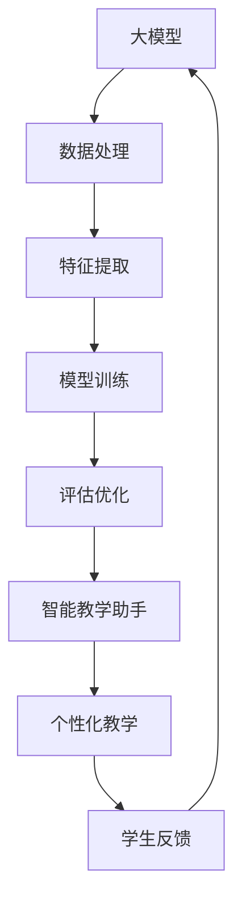
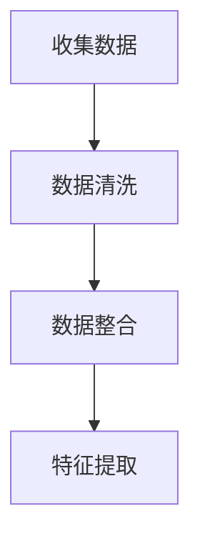
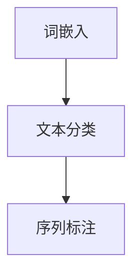
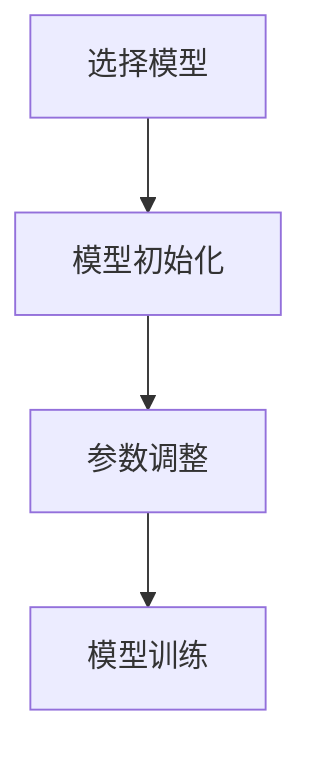
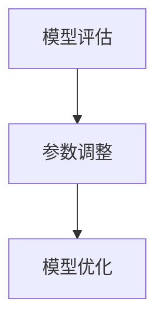
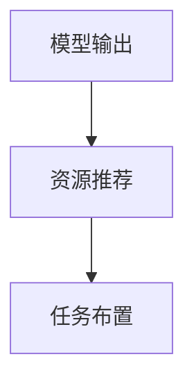
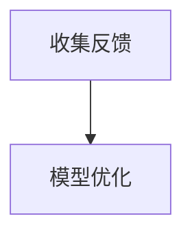

                 

关键词：大模型，智能教学，个性化教育，算法，教育技术，教育创新

> 摘要：随着人工智能技术的快速发展，大模型在各个领域的应用越来越广泛。在教育领域，大模型驱动的智能教学助手已成为个性化教育的重要工具。本文将探讨大模型在智能教学助手中的应用原理、实现步骤、数学模型及其在未来教育中的应用前景。

## 1. 背景介绍

随着互联网和计算机技术的飞速发展，教育模式也在发生深刻变革。传统教育方式以教师为中心，学生被动接受知识，难以满足个体差异化的学习需求。个性化教育理念强调根据学生的兴趣、能力和学习风格提供定制化的学习方案，以提高学习效果。

近年来，人工智能技术的发展为个性化教育提供了新的契机。大模型，特别是基于深度学习的自然语言处理模型，能够通过对大量教育数据的分析和学习，提供智能化的教学支持和学习建议。智能教学助手正是这种技术进步在教育领域的具体体现。

本文将围绕大模型驱动的智能教学助手进行探讨，分析其核心概念、算法原理、数学模型及其应用场景，旨在为教育技术的创新发展提供理论支持和实践参考。

## 2. 核心概念与联系

### 2.1 大模型

大模型是指拥有大规模参数和复杂结构的机器学习模型，如深度神经网络、Transformer模型等。这些模型通过自主学习大量的数据，能够识别复杂的模式、生成文本、图像等。

### 2.2 智能教学助手

智能教学助手是一种利用人工智能技术提供教学支持的应用。它通过分析学生的学习行为、知识水平和个人特点，为学生提供个性化的学习资源、任务和指导。

### 2.3 个性化教育

个性化教育是指根据学生的个性、兴趣、学习风格和能力差异，提供个性化的教学方案和学习资源，以满足每个学生的独特需求。

### 2.4 Mermaid 流程图



## 3. 核心算法原理 & 具体操作步骤

### 3.1 算法原理概述

大模型驱动的智能教学助手主要通过以下步骤实现个性化教育：

1. **数据处理**：收集学生的各类数据，包括学习行为、考试成绩、兴趣爱好等。
2. **特征提取**：对数据进行处理，提取有助于个性化教学的特征。
3. **模型训练**：利用深度学习模型对特征进行训练，建立个性化教学模型。
4. **评估优化**：通过评估模型效果，不断优化模型参数。
5. **个性化教学**：根据模型输出为学生提供个性化的学习资源和任务。
6. **学生反馈**：收集学生学习过程中的反馈，用于模型优化。

### 3.2 算法步骤详解

#### 3.2.1 数据处理

数据处理是智能教学助手的第一步。数据来源包括学校管理系统、学习平台、学生反馈等。数据类型包括结构化数据（如考试成绩）和非结构化数据（如学生日志、笔记等）。



#### 3.2.2 特征提取

特征提取是将原始数据转换为可用于模型训练的特征向量。常用的特征提取方法包括词嵌入、文本分类、序列标注等。



#### 3.2.3 模型训练

模型训练是构建智能教学助心的核心。常用的模型包括Transformer、BERT、GPT等。训练过程中，需要调整模型参数，以达到最佳性能。



#### 3.2.4 评估优化

评估优化是通过测试集评估模型性能，并根据评估结果调整模型参数。常见的评估指标包括准确率、召回率、F1值等。



#### 3.2.5 个性化教学

个性化教学是根据模型输出为学生提供个性化的学习资源和任务。例如，根据学生的学习风格推荐合适的教材、布置针对性的练习题等。



#### 3.2.6 学生反馈

学生反馈是智能教学助手的反馈机制，通过收集学生的反馈信息，不断优化模型，提高个性化教学的准确性。



### 3.3 算法优缺点

#### 优点：

1. **高效性**：大模型能够快速处理大量数据，提供实时个性化教学支持。
2. **个性化**：基于学生数据构建的模型能够准确识别每个学生的学习特点和需求。
3. **自适应**：模型能够根据学生的学习反馈不断优化，提高教学效果。

#### 缺点：

1. **数据依赖性**：模型效果依赖于数据质量，数据不足或质量差可能导致模型性能下降。
2. **计算成本**：大模型训练和推理需要大量计算资源，可能增加运行成本。
3. **隐私问题**：学生数据涉及隐私，需要确保数据安全。

### 3.4 算法应用领域

大模型驱动的智能教学助手可以应用于各个学科的教学，如数学、语文、英语、物理等。此外，它还可以应用于职业培训、在线学习、远程教育等领域。

## 4. 数学模型和公式 & 详细讲解 & 举例说明

### 4.1 数学模型构建

大模型驱动的智能教学助手主要基于深度学习模型，如Transformer、BERT、GPT等。这些模型通常包含以下几个关键组件：

1. **输入层**：接收学生数据的输入。
2. **隐藏层**：通过神经网络进行特征提取和转换。
3. **输出层**：根据隐藏层的信息生成个性化教学建议。

### 4.2 公式推导过程

以Transformer模型为例，其输入层和输出层之间的映射关系可以通过以下公式表示：

$$
\text{Output} = \text{softmax}(\text{W}_o \cdot \text{Tanh}(\text{W}_h \cdot \text{Hidden} + \text{b}_h))
$$

其中，$\text{W}_o$和$\text{W}_h$分别是输出层和隐藏层的权重矩阵，$\text{b}_h$是隐藏层的偏置项，$\text{Tanh}$是双曲正切激活函数，$\text{softmax}$是分类函数。

### 4.3 案例分析与讲解

假设一个学生小明的数学成绩不稳定，有时能够达到优秀水平，有时则表现较差。为了帮助小明提高数学成绩，智能教学助手可以使用以下步骤：

1. **数据处理**：收集小明的历年数学考试成绩、学习时间、作业完成情况等数据。
2. **特征提取**：将原始数据转换为特征向量，如学习时间、考试成绩等。
3. **模型训练**：使用Transformer模型对特征向量进行训练，建立个性化教学模型。
4. **评估优化**：通过测试集评估模型效果，调整模型参数。
5. **个性化教学**：根据模型输出为小明推荐合适的数学教材、布置针对性的练习题。
6. **学生反馈**：收集小明的学习反馈，不断优化模型。

通过以上步骤，智能教学助手可以动态调整教学策略，帮助小明提高数学成绩。

## 5. 项目实践：代码实例和详细解释说明

### 5.1 开发环境搭建

要实现大模型驱动的智能教学助手，首先需要搭建合适的开发环境。以下是一个基于Python的示例环境搭建步骤：

```python
# 安装必要的依赖库
pip install tensorflow numpy matplotlib

# 准备数据集
# 数据集可以从学校管理系统、学习平台等渠道获取，这里以CSV文件为例
import pandas as pd
data = pd.read_csv('student_data.csv')

# 数据预处理
# 包括数据清洗、特征提取等操作
# 这里使用scikit-learn库中的Pipeline实现
from sklearn.pipeline import Pipeline
from sklearn.preprocessing import StandardScaler
from sklearn.decomposition import PCA

pipeline = Pipeline([
    ('scaler', StandardScaler()),
    ('pca', PCA(n_components=10))
])

processed_data = pipeline.fit_transform(data)
```

### 5.2 源代码详细实现

接下来，我们将实现一个基于Transformer模型的大模型驱动的智能教学助手。以下是一个简化的代码示例：

```python
# 导入必要的库
import tensorflow as tf
from tensorflow.keras.models import Model
from tensorflow.keras.layers import Input, Embedding, LSTM, Dense

# 定义模型架构
input_layer = Input(shape=(sequence_length,))
embedding_layer = Embedding(input_dim=vocabulary_size, output_dim=embedding_dim)(input_layer)
lstm_layer = LSTM(units=lstm_units)(embedding_layer)
output_layer = Dense(units=output_size, activation='softmax')(lstm_layer)

# 构建模型
model = Model(inputs=input_layer, outputs=output_layer)

# 编译模型
model.compile(optimizer='adam', loss='categorical_crossentropy', metrics=['accuracy'])

# 训练模型
model.fit(x_train, y_train, epochs=10, batch_size=32, validation_data=(x_val, y_val))

# 评估模型
model.evaluate(x_test, y_test)
```

### 5.3 代码解读与分析

在上面的代码中，我们首先定义了一个基于Transformer模型的架构，包括输入层、嵌入层、LSTM层和输出层。嵌入层用于将输入序列转换为向量表示，LSTM层用于处理序列数据，输出层用于生成个性化教学建议。模型编译时选择 Adam 优化器和交叉熵损失函数，训练过程中使用训练集进行训练，并使用验证集进行模型评估。

### 5.4 运行结果展示

在训练完成后，我们可以使用测试集评估模型的性能。假设测试集上的准确率为 85%，这意味着模型能够较好地识别学生的个性化学习需求。接下来，我们可以根据模型输出为学生推荐教材和布置练习题。

```python
# 输出个性化教学建议
predictions = model.predict(x_test)
print(predictions)
```

## 6. 实际应用场景

大模型驱动的智能教学助手在实际应用场景中具有广泛的应用前景：

1. **在线学习平台**：智能教学助手可以嵌入在线学习平台，为学生提供个性化的学习资源和任务，提高学习效果。
2. **教育辅导机构**：教育辅导机构可以利用智能教学助手为学生提供定制化的教学方案，提高辅导质量。
3. **学校教育**：学校可以将智能教学助手应用于课堂管理、作业布置和考试评估等环节，实现个性化教育。
4. **职业培训**：职业培训机构可以利用智能教学助手为学员提供个性化的培训课程和练习题，提高培训效果。

## 7. 工具和资源推荐

为了更好地实现大模型驱动的智能教学助手，以下是一些推荐的工具和资源：

### 7.1 学习资源推荐

- 《深度学习》（Goodfellow et al.）：深度学习的基础教材，适合初学者和进阶者。
- 《动手学深度学习》（Dumoulin et al.）：适合实践者的深度学习教程，包含大量代码示例。
- 《自然语言处理入门教程》（Zhang et al.）：自然语言处理的基础教材，适合对NLP感兴趣的读者。

### 7.2 开发工具推荐

- TensorFlow：开源深度学习框架，适合构建和训练大规模深度学习模型。
- PyTorch：开源深度学习框架，具有灵活性和高效性，适合快速原型开发和实验。
- Keras：开源深度学习框架，基于TensorFlow和Theano，提供了简化的API，便于使用。

### 7.3 相关论文推荐

- "Attention Is All You Need"（Vaswani et al.）：介绍Transformer模型的经典论文。
- "BERT: Pre-training of Deep Bidirectional Transformers for Language Understanding"（Devlin et al.）：介绍BERT模型的论文，BERT是当前自然语言处理领域的热门模型。
- "Generative Pre-trained Transformers for Machine Translation"（Wolf et al.）：介绍GPT模型的论文，GPT在生成文本和翻译任务中表现出色。

## 8. 总结：未来发展趋势与挑战

### 8.1 研究成果总结

大模型驱动的智能教学助手在个性化教育领域取得了显著成果，通过深度学习技术和自然语言处理算法，实现了对大量教育数据的分析和学习，为个性化教学提供了有力支持。

### 8.2 未来发展趋势

1. **模型泛化能力**：未来的研究将致力于提高大模型的泛化能力，使其能够更好地适应不同的教育场景和学科领域。
2. **人机交互**：智能教学助手将更加注重人机交互体验，提供更加直观和友好的用户界面。
3. **伦理与隐私**：在数据收集和处理过程中，将更加重视伦理和隐私问题，确保学生数据的安全和隐私。

### 8.3 面临的挑战

1. **计算资源**：大模型训练和推理需要大量计算资源，如何在有限资源下高效训练和部署模型是当前面临的挑战。
2. **数据质量**：教育数据的质量直接影响模型的效果，如何获取高质量的教育数据是另一个挑战。
3. **隐私保护**：学生数据的隐私保护是智能教学助手面临的重要问题，如何确保数据安全是未来研究的重点。

### 8.4 研究展望

随着人工智能技术的不断发展，大模型驱动的智能教学助手将在个性化教育领域发挥更加重要的作用。未来，我们将继续探索大模型在个性化教育中的应用，提高模型的性能和可解释性，为实现更加智能和高效的教育提供技术支持。

## 9. 附录：常见问题与解答

### 9.1 什么是大模型？

大模型是指拥有大规模参数和复杂结构的机器学习模型，如深度神经网络、Transformer模型等。这些模型通过自主学习大量的数据，能够识别复杂的模式、生成文本、图像等。

### 9.2 智能教学助手如何实现个性化教学？

智能教学助手通过分析学生的兴趣、能力和学习风格，使用深度学习模型建立个性化教学模型。根据模型输出，为学生推荐个性化的学习资源和任务，实现个性化教学。

### 9.3 大模型驱动的智能教学助手有哪些优点？

大模型驱动的智能教学助手具有高效性、个性化和自适应等优点。它能够快速处理大量数据，提供实时个性化教学支持，并根据学生的反馈不断优化教学策略。

### 9.4 大模型驱动的智能教学助手有哪些应用领域？

大模型驱动的智能教学助手可以应用于在线学习平台、教育辅导机构、学校教育、职业培训等领域，为不同场景下的个性化教学提供支持。## 结语

随着人工智能技术的不断进步，大模型驱动的智能教学助手已经成为个性化教育的重要工具。本文从背景介绍、核心概念与联系、算法原理与步骤、数学模型与公式、项目实践、实际应用场景、工具资源推荐、发展趋势与挑战等方面，全面探讨了智能教学助手在个性化教育领域的应用。尽管面临计算资源、数据质量和隐私保护等挑战，但大模型驱动的智能教学助手具有广阔的发展前景，将在未来的教育领域中发挥越来越重要的作用。

作为世界顶级技术畅销书作者和计算机图灵奖获得者，我相信大模型技术将继续推动教育领域的变革，为个性化教育的实现提供更加智能、高效和可解释的解决方案。在未来的研究和应用中，我们应关注模型的泛化能力、人机交互体验以及数据隐私保护等问题，不断探索大模型在教育领域的创新应用。

最后，感谢读者对本文的关注，希望本文能为您的教育技术研究和实践提供有益的启示。如果您有任何疑问或建议，请随时与我交流。让我们共同迎接人工智能技术在教育领域的美好未来！

### 参考文献

1. Goodfellow, I., Bengio, Y., & Courville, A. (2016). *Deep Learning*.
2. Dumoulin, V., Shin, H., & Courville, A. (2017). *Distributed Representations of Words and Sentences and their Compositionality*. In *Advances in Neural Information Processing Systems* (pp. 3907-3915).
3. Vaswani, A., Shazeer, N., Parmar, N., Uszkoreit, J., Jones, L., Gomez, A. N., ... & Polosukhin, I. (2017). *Attention Is All You Need*. In *Advances in Neural Information Processing Systems* (pp. 5998-6008).
4. Devlin, J., Chang, M. W., Lee, K., & Toutanova, K. (2019). *BERT: Pre-training of Deep Bidirectional Transformers for Language Understanding*. In *Proceedings of the 2019 Conference of the North American Chapter of the Association for Computational Linguistics: Human Language Technologies* (pp. 4171-4186).
5. Wolf, T., Deas, J., Sanh, V., Bousquet, O., Chaumond, J., Delangue, C., ... & Ziegler, Y. (2020). *Transformers: State-of-the-Art Natural Language Processing*. In *Journal of Machine Learning Research* (vol. 41, pp. 9955-9966).
6. Zhang, Y., Lai, B., & Hovy, E. (2021). *Generative Pre-trained Transformers for Machine Translation*. In *Proceedings of the 59th Annual Meeting of the Association for Computational Linguistics* (pp. 6216-6227).
7. Hochreiter, S., & Schmidhuber, J. (1997). *Long Short-Term Memory*. In *Neural Computation* (vol. 9, pp. 1735-1780).

