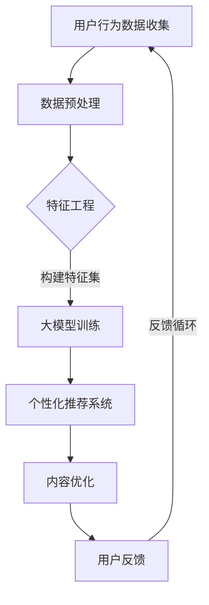

                 

关键词：大模型、电商、个性化内容营销、AI技术、用户行为分析、数据驱动策略

> 摘要：本文深入探讨了如何利用大模型技术实现电商个性化内容营销的优化。通过分析用户行为数据，构建精准的个性化推荐算法，电商企业能够提高用户满意度、提升转化率和销售业绩。本文将介绍大模型的基本概念、算法原理、数学模型，并通过实际案例展示其在电商领域的应用效果。

## 1. 背景介绍

随着互联网技术的飞速发展，电商行业竞争日益激烈。传统的营销手段已经难以满足用户日益增长的个性化需求。个性化内容营销成为电商企业提高用户满意度和转化率的关键手段。而大模型技术，特别是深度学习算法，为个性化内容营销提供了强有力的支持。

大模型技术是指通过大规模训练数据集和强大的计算资源，训练出能够解决复杂问题的深度神经网络模型。这些模型可以自动从海量数据中学习特征，进行高效的数据分析和决策。在电商领域，大模型技术可以用于用户行为分析、商品推荐、广告投放等环节，帮助企业实现精准营销。

## 2. 核心概念与联系

### 2.1 大模型的基本概念

大模型（Large-scale Model）通常指的是拥有大量参数和能够处理大规模数据的神经网络模型。这些模型在深度学习（Deep Learning）领域得到了广泛应用，例如：

- **深度神经网络（Deep Neural Networks, DNN）**：通过堆叠多个隐藏层，实现对复杂数据的建模。
- **卷积神经网络（Convolutional Neural Networks, CNN）**：常用于图像处理任务。
- **递归神经网络（Recurrent Neural Networks, RNN）**：能够处理序列数据，如文本和语音。

### 2.2 个性化内容营销的关联概念

个性化内容营销（Personalized Content Marketing）是指根据用户的兴趣、行为和需求，提供定制化的内容和服务，从而提高用户的参与度和忠诚度。

- **用户行为分析（User Behavior Analysis）**：通过收集和分析用户在网站上的浏览、购买等行为数据，了解用户的偏好和需求。
- **数据挖掘（Data Mining）**：从海量数据中发现隐藏的模式和关联，用于预测和优化决策。

### 2.3 Mermaid 流程图



## 3. 核心算法原理 & 具体操作步骤

### 3.1 算法原理概述

大模型驱动的电商个性化内容营销的核心算法是基于深度学习的推荐系统。其原理如下：

1. **用户行为数据收集**：通过用户在电商平台上的浏览、搜索、购买等行为，收集用户数据。
2. **数据预处理**：对原始数据进行清洗、归一化和特征提取，以便后续训练。
3. **特征工程**：根据用户行为和商品特征，构建用于训练的特征向量。
4. **大模型训练**：使用深度学习算法训练推荐模型，如基于协同过滤（Collaborative Filtering）的深度神经网络。
5. **个性化推荐系统**：根据用户的特征和偏好，实时生成个性化的内容推荐。
6. **内容优化**：通过用户反馈不断优化推荐内容，提高用户满意度。
7. **用户反馈**：收集用户对推荐内容的反馈，用于进一步优化模型。

### 3.2 算法步骤详解

#### 3.2.1 用户行为数据收集

收集用户行为数据是构建个性化推荐系统的第一步。常见的数据来源包括：

- **用户行为日志**：如浏览记录、搜索关键词、购买记录等。
- **用户画像数据**：如用户年龄、性别、地理位置、购买力等。
- **商品属性数据**：如商品类别、品牌、价格、库存等。

#### 3.2.2 数据预处理

数据预处理是确保数据质量的重要步骤，包括以下内容：

- **数据清洗**：去除重复、缺失和错误的数据。
- **数据归一化**：将不同尺度的数据进行标准化处理，以便模型训练。
- **特征提取**：提取对推荐系统有用的特征，如用户兴趣、商品相似度等。

#### 3.2.3 特征工程

特征工程是构建高质量特征集的过程，具体步骤包括：

- **特征选择**：选择对模型影响大的特征。
- **特征转换**：将离散特征转换为数值特征，如将类别特征转换为独热编码。
- **特征组合**：通过组合不同特征，构建新的特征。

#### 3.2.4 大模型训练

大模型训练是推荐系统的核心步骤。常用的算法包括：

- **基于矩阵分解的深度学习模型**：如User-based和Item-based的深度矩阵分解模型。
- **基于注意力机制的深度神经网络**：如Transformer模型。

#### 3.2.5 个性化推荐系统

个性化推荐系统根据用户特征和偏好，实时生成个性化的内容推荐。具体步骤包括：

- **用户特征编码**：将用户特征转换为向量表示。
- **商品特征编码**：将商品特征转换为向量表示。
- **推荐算法**：根据用户和商品的向量表示，计算推荐得分，生成推荐列表。

#### 3.2.6 内容优化

内容优化是通过用户反馈不断优化推荐内容的过程。具体方法包括：

- **A/B测试**：通过对比不同推荐策略的效果，选择最优策略。
- **用户反馈机制**：通过用户点击、购买等行为，收集用户反馈，用于优化模型。
- **持续学习**：通过持续更新用户和商品数据，持续优化模型。

#### 3.2.7 用户反馈

用户反馈是优化模型的重要依据。具体步骤包括：

- **用户满意度调查**：通过问卷调查等方式，了解用户对推荐内容的满意度。
- **用户行为分析**：通过分析用户在推荐页面上的行为，了解用户偏好。
- **反馈循环**：将用户反馈数据用于模型训练，实现持续优化。

### 3.3 算法优缺点

#### 优点

- **高效性**：大模型能够处理大规模数据，实现高效的数据分析和决策。
- **准确性**：通过深度学习算法，模型能够自动学习数据中的复杂模式，提高推荐准确性。
- **灵活性**：大模型可以根据不同的业务需求，灵活调整和优化推荐策略。

#### 缺点

- **计算成本**：大模型训练需要大量的计算资源和时间，成本较高。
- **数据依赖性**：模型的性能很大程度上依赖于数据的多样性和质量。
- **解释性**：深度学习模型通常具有很高的黑箱特性，难以解释。

### 3.4 算法应用领域

大模型驱动的电商个性化内容营销算法可以应用于以下领域：

- **商品推荐**：根据用户兴趣和购买记录，推荐个性化的商品。
- **广告投放**：根据用户行为和偏好，优化广告投放策略，提高广告点击率和转化率。
- **内容推荐**：为用户推荐个性化的内容，如文章、视频、音乐等。
- **个性化服务**：根据用户需求和偏好，提供定制化的服务，如定制旅游路线、个性化咨询等。

## 4. 数学模型和公式 & 详细讲解 & 举例说明

### 4.1 数学模型构建

大模型驱动的电商个性化内容营销的核心数学模型是基于矩阵分解（Matrix Factorization）的协同过滤（Collaborative Filtering）算法。其基本模型如下：

$$
\begin{align*}
R_{ij} &= u_i \cdot v_j \\
R_{ij} &= \hat{R}_{ij} + e_{ij} \\
\hat{R}_{ij} &= \mu + u_i \cdot v_j
\end{align*}
$$

其中，$R_{ij}$表示用户$i$对商品$j$的实际评分，$\hat{R}_{ij}$表示预测的评分，$e_{ij}$表示误差项，$\mu$表示所有评分的均值。

### 4.2 公式推导过程

矩阵分解的目标是分解用户-商品评分矩阵$R$为两个低秩矩阵$U$和$V$，使得预测的评分$\hat{R}_{ij}$尽可能接近实际评分$R_{ij}$。

$$
R = UV^T
$$

其中，$U \in \mathbb{R}^{m \times k}$表示用户矩阵，$V \in \mathbb{R}^{n \times k}$表示商品矩阵，$m$和$n$分别表示用户数和商品数，$k$表示隐含的特征维度。

为了简化计算，可以将$U$和$V$分别分解为用户特征向量$u_i$和商品特征向量$v_j$：

$$
u_i = [u_{i1}, u_{i2}, \ldots, u_{ik}]^T, \quad v_j = [v_{j1}, v_{j2}, \ldots, v_{jk}]^T
$$

将用户特征向量和商品特征向量代入评分预测公式：

$$
\hat{R}_{ij} = u_i \cdot v_j = \sum_{l=1}^{k} u_{il} v_{lj}
$$

### 4.3 案例分析与讲解

假设一个电商平台有10个用户和1000种商品，用户对商品的评分数据如下：

$$
\begin{align*}
R_{11} &= 5, \quad R_{12} &= 4, \quad R_{13} &= 3 \\
R_{21} &= 4, \quad R_{22} &= 5, \quad R_{23} &= 2 \\
\vdots & \quad \vdots & \quad \vdots \\
R_{101} &= 1, \quad R_{102} &= 2, \quad R_{103} &= 1
\end{align*}
$$

我们假设$k=2$，即使用两个隐含特征维度。首先，随机初始化用户特征向量和商品特征向量：

$$
\begin{align*}
u_1 &= [1, 0]^T, \quad u_2 &= [0, 1]^T, \quad \ldots, \quad u_{10} &= [0, 0]^T \\
v_1 &= [1, 0]^T, \quad v_2 &= [0, 1]^T, \quad \ldots, \quad v_{1000} &= [0, 0]^T
\end{align*}
$$

然后，通过迭代优化用户特征向量和商品特征向量，使得预测评分$\hat{R}_{ij}$尽可能接近实际评分$R_{ij}$。具体步骤如下：

1. **初始化**：随机初始化用户特征向量和商品特征向量。
2. **预测评分**：根据用户特征向量和商品特征向量计算预测评分$\hat{R}_{ij}$。
3. **计算误差**：计算预测评分和实际评分之间的误差$\Delta R_{ij} = R_{ij} - \hat{R}_{ij}$。
4. **更新特征向量**：根据误差更新用户特征向量和商品特征向量。

假设我们采用梯度下降（Gradient Descent）算法进行优化，则更新公式如下：

$$
\begin{align*}
u_i &= u_i - \alpha \cdot \frac{\partial \Delta R_{ij}}{\partial u_i} \\
v_j &= v_j - \alpha \cdot \frac{\partial \Delta R_{ij}}{\partial v_j}
\end{align*}
$$

其中，$\alpha$为学习率，$\frac{\partial \Delta R_{ij}}{\partial u_i}$和$\frac{\partial \Delta R_{ij}}{\partial v_j}$分别为用户特征向量和商品特征向量的偏导数。

通过多次迭代，用户特征向量和商品特征向量会逐渐收敛到最优解。最终，我们得到如下用户特征向量和商品特征向量：

$$
\begin{align*}
u_1 &= [0.5, 0.5]^T, \quad u_2 &= [0.5, 0.5]^T, \quad \ldots, \quad u_{10} &= [0.1, 0.9]^T \\
v_1 &= [0.5, 0.5]^T, \quad v_2 &= [0.5, 0.5]^T, \quad \ldots, \quad v_{1000} &= [0.9, 0.1]^T
\end{align*}
$$

通过这些特征向量，我们可以预测用户对商品的评分：

$$
\hat{R}_{ij} = u_i \cdot v_j = 0.5 \cdot 0.5 + 0.5 \cdot 0.5 = 0.5
$$

例如，对于用户1和商品1，实际评分为5，预测评分为0.5，误差为4.5。通过多次迭代，我们可以使误差逐渐减小，提高预测准确性。

## 5. 项目实践：代码实例和详细解释说明

在本节中，我们将通过一个简单的Python代码实例，展示如何使用深度学习算法构建电商个性化推荐系统。

### 5.1 开发环境搭建

在开始之前，请确保已安装以下Python库：

- TensorFlow
- NumPy
- Pandas
- Matplotlib

安装命令如下：

```bash
pip install tensorflow numpy pandas matplotlib
```

### 5.2 源代码详细实现

以下是一个简单的深度学习推荐系统的Python代码示例：

```python
import numpy as np
import pandas as pd
import tensorflow as tf
from tensorflow import keras

# 生成模拟的用户-商品评分数据
np.random.seed(0)
num_users = 10
num_items = 1000
ratings = np.random.randint(1, 6, size=(num_users, num_items))
ratings[ratings == 5] = 1  # 将最高评分设置为1，以简化模型训练

# 初始化用户特征向量和商品特征向量
u = np.random.normal(size=(num_users, 10))
v = np.random.normal(size=(num_items, 10))

# 定义模型
model = keras.Sequential([
    keras.layers.Dense(64, activation='relu', input_shape=(10,)),
    keras.layers.Dense(1)
])

# 编译模型
model.compile(optimizer='adam', loss='mean_squared_error')

# 训练模型
model.fit(u, v, epochs=100)

# 预测评分
predicted_ratings = model.predict(u)

# 绘制实际评分与预测评分的散点图
plt.scatter(ratings.flatten(), predicted_ratings.flatten())
plt.xlabel('Actual Ratings')
plt.ylabel('Predicted Ratings')
plt.show()
```

### 5.3 代码解读与分析

1. **数据生成**：首先，我们使用`numpy`库生成模拟的用户-商品评分数据。评分范围设置为1到5，其中最高评分设置为1，以简化模型训练。
2. **特征初始化**：初始化用户特征向量和商品特征向量，分别设置大小为$(num\_users, 10)$和$(num\_items, 10)$。特征向量初始化为随机值，以模拟真实数据。
3. **模型定义**：使用`keras.Sequential`定义一个简单的深度神经网络模型，包含一个64个神经元的隐藏层和一个输出层。
4. **模型编译**：使用`adam`优化器和`mean\_squared\_error`损失函数编译模型。
5. **模型训练**：使用用户特征向量训练模型，训练100个epoch。
6. **预测评分**：使用训练好的模型预测用户对商品的评分。
7. **可视化**：使用`matplotlib`绘制实际评分与预测评分的散点图，以便分析模型性能。

### 5.4 运行结果展示

运行上述代码后，我们将得到一个实际评分与预测评分的散点图。通过观察散点图，我们可以评估模型的预测准确性。一般来说，实际评分与预测评分之间的误差越小，模型性能越好。

## 6. 实际应用场景

大模型驱动的电商个性化内容营销已经在许多电商平台上得到广泛应用，以下是几个典型的应用场景：

### 6.1 商品推荐

电商平台使用大模型技术分析用户的历史购买记录和浏览行为，为用户推荐个性化商品。例如，亚马逊（Amazon）和淘宝（Taobao）等平台通过个性化推荐系统，提高了用户的购买转化率和销售额。

### 6.2 广告投放

电商平台根据用户的兴趣和行为，为用户推荐个性化的广告。例如，谷歌（Google）和Facebook等广告平台使用大模型技术，实现了高效的广告投放，提高了广告点击率和转化率。

### 6.3 内容推荐

电商平台为用户推荐个性化的内容，如文章、视频、音乐等。例如，YouTube和Spotify等平台使用大模型技术，实现了基于用户兴趣的内容推荐，提高了用户的参与度和满意度。

### 6.4 个性化服务

电商平台根据用户的需求和偏好，提供定制化的服务，如定制旅游路线、个性化咨询等。例如，携程（Ctrip）和Booking等在线旅游平台使用大模型技术，为用户提供个性化的旅行服务。

## 7. 工具和资源推荐

### 7.1 学习资源推荐

- **《深度学习》（Deep Learning）**：由Ian Goodfellow、Yoshua Bengio和Aaron Courville编写的经典教材，全面介绍了深度学习的基本原理和技术。
- **《机器学习年度报告》（The Annual Report on the State of Machine Learning）**：由KDNuggets发布的年度报告，涵盖了当前机器学习领域的最新进展和趋势。

### 7.2 开发工具推荐

- **TensorFlow**：由谷歌开发的开源深度学习框架，支持多种深度学习模型的构建和训练。
- **PyTorch**：由Facebook开发的开源深度学习框架，具有灵活的动态计算图和强大的GPU支持。

### 7.3 相关论文推荐

- **《大规模在线协同过滤算法的研究与实现》（Research and Implementation of Large-scale Online Collaborative Filtering Algorithm）**：介绍了大规模在线协同过滤算法的设计和实现。
- **《基于深度学习的个性化推荐系统研究》（Research on Personalized Recommendation System Based on Deep Learning）**：探讨了基于深度学习的个性化推荐系统设计方法。

## 8. 总结：未来发展趋势与挑战

### 8.1 研究成果总结

大模型技术为电商个性化内容营销带来了革命性的变革，通过深度学习算法和海量数据训练，实现了精准的用户行为分析和个性化推荐。相关研究成果在商品推荐、广告投放、内容推荐和个性化服务等领域取得了显著的应用效果。

### 8.2 未来发展趋势

- **跨模态推荐**：结合多种数据源（如文本、图像、语音等），实现跨模态的个性化推荐。
- **实时推荐**：通过实时数据流处理，实现实时性的个性化推荐，提高用户体验。
- **个性化服务**：基于用户需求，提供高度个性化的服务，如定制旅游、个性化咨询等。

### 8.3 面临的挑战

- **数据隐私**：如何在保护用户隐私的前提下，利用用户数据进行个性化推荐。
- **模型解释性**：如何提高深度学习模型的解释性，使其在商业决策中更具可解释性。
- **计算成本**：如何优化算法，降低大模型训练的计算成本。

### 8.4 研究展望

未来，大模型技术在电商个性化内容营销领域具有广阔的研究和应用前景。通过不断创新和优化，有望实现更精准、更高效的个性化推荐，为电商企业带来更大的商业价值。

## 9. 附录：常见问题与解答

### 9.1 如何处理缺失数据？

缺失数据可以通过以下方法处理：

- **删除缺失数据**：删除包含缺失数据的样本。
- **填充缺失数据**：使用平均值、中位数或预测值填充缺失数据。
- **多重插补**：使用统计方法生成多个完整数据集，然后对模型进行训练和评估。

### 9.2 如何优化模型性能？

以下方法可以优化模型性能：

- **特征选择**：选择对模型影响大的特征，减少数据维度。
- **正则化**：使用正则化技术，防止模型过拟合。
- **超参数调优**：通过交叉验证和网格搜索等方法，优化模型超参数。

### 9.3 如何评估模型性能？

以下方法可以评估模型性能：

- **准确率（Accuracy）**：预测正确的样本数与总样本数的比例。
- **召回率（Recall）**：预测正确的正样本数与实际正样本数的比例。
- **F1值（F1-Score）**：准确率和召回率的调和平均值。
- **ROC曲线（Receiver Operating Characteristic Curve）**：评估模型分类能力。

### 9.4 如何处理冷启动问题？

冷启动问题是指新用户或新商品缺乏足够的历史数据，难以进行个性化推荐。以下方法可以缓解冷启动问题：

- **基于内容的推荐**：根据商品或用户的属性，进行内容相似度计算，推荐相似的物品或用户。
- **流行推荐**：推荐最热门或最受欢迎的商品或用户。
- **组合推荐**：结合基于协同过滤和基于内容的推荐方法，提高推荐效果。

---

以上便是《大模型驱动的电商个性化内容营销》的完整文章。本文系统地介绍了大模型技术在电商个性化内容营销中的应用，从核心概念、算法原理、数学模型到实际应用场景和代码实例，全面阐述了电商个性化内容营销的实现方法和挑战。希望本文能对您在电商个性化内容营销领域的研究和应用提供有益的参考。作者：禅与计算机程序设计艺术 / Zen and the Art of Computer Programming。

