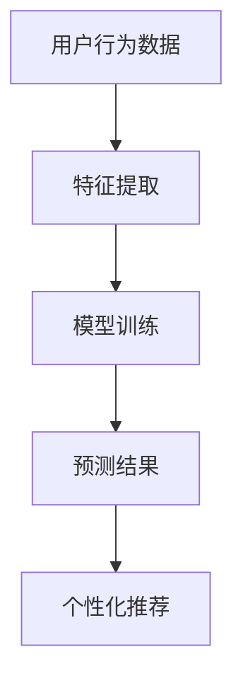

                 

关键词：大模型，电商，个性化活动，推荐系统，机器学习，深度学习，人工智能

摘要：本文将探讨大模型技术在电商个性化活动推荐中的应用，分析大模型的基本原理和架构，详细介绍相关算法原理、数学模型以及实际项目实践，并展望未来的应用前景和挑战。

## 1. 背景介绍

随着互联网技术的快速发展，电商行业已经成为全球经济增长的重要引擎。然而，面对海量的商品信息和多样化的用户需求，如何实现精准的个性化推荐，成为电商企业竞争的关键。传统的推荐系统在数据处理能力和个性化程度方面存在一定的局限性，难以满足用户日益增长的需求。

近年来，大模型技术的崛起为电商个性化活动推荐带来了新的机遇。大模型，尤其是深度学习模型，具有强大的数据处理能力和对复杂特征的捕捉能力，可以更好地理解用户的兴趣和行为，实现更加精准的个性化推荐。

## 2. 核心概念与联系

### 2.1 大模型的基本概念

大模型（Large-scale Model）指的是具有海量参数、能够处理大规模数据的深度学习模型。这些模型通过训练学习大量数据中的规律和模式，可以实现对复杂数据的理解和预测。

### 2.2 大模型在电商个性化活动推荐中的应用

电商个性化活动推荐是指根据用户的兴趣和行为，向用户推荐符合其个性化需求的商品和活动。大模型在电商个性化活动推荐中的应用主要体现在以下几个方面：

1. **用户行为分析**：通过分析用户的浏览、购买、评价等行为数据，大模型可以捕捉用户的兴趣和偏好。
2. **商品特征提取**：大模型可以提取商品的多维特征，如价格、品牌、品类等，以便进行精准推荐。
3. **个性化推荐**：基于用户的行为和商品特征，大模型可以生成个性化的推荐结果，提高推荐的准确性和用户满意度。
4. **活动策划**：大模型可以根据用户的兴趣和行为，为用户推荐符合其兴趣的活动，提高活动的参与度和转化率。

### 2.3 大模型架构

大模型的架构通常包括以下几个层次：

1. **输入层**：接收用户和商品的特征数据。
2. **隐藏层**：通过多层神经网络结构对输入数据进行处理和变换。
3. **输出层**：生成推荐结果或预测结果。

### 2.4 Mermaid 流程图



## 3. 核心算法原理 & 具体操作步骤

### 3.1 算法原理概述

大模型在电商个性化活动推荐中的核心算法是深度学习模型，尤其是基于神经网络的结构。深度学习模型通过学习大量数据中的特征和模式，可以实现对复杂数据的建模和预测。

### 3.2 算法步骤详解

1. **数据收集**：收集用户行为数据、商品特征数据等。
2. **数据预处理**：对数据进行清洗、归一化等处理。
3. **特征提取**：使用特征提取器提取用户和商品的特征。
4. **模型训练**：使用训练数据训练深度学习模型。
5. **预测与推荐**：使用训练好的模型对新的用户行为进行预测，生成个性化推荐结果。

### 3.3 算法优缺点

**优点**：

- 强大的数据处理能力，可以处理大规模的复杂数据。
- 能够捕捉用户的兴趣和偏好，实现精准的个性化推荐。
- 可以自动提取数据中的特征，降低人工干预。

**缺点**：

- 训练时间较长，需要大量的计算资源。
- 对数据质量和标注有较高要求，否则可能导致过拟合。
- 模型的解释性较差，难以理解模型的决策过程。

### 3.4 算法应用领域

大模型在电商个性化活动推荐中的应用非常广泛，包括：

- 商品推荐：根据用户的兴趣和偏好推荐合适的商品。
- 活动推荐：根据用户的兴趣和行为推荐符合其需求的活动。
- 营销策略：通过分析用户的行为和偏好，制定个性化的营销策略。

## 4. 数学模型和公式 & 详细讲解 & 举例说明

### 4.1 数学模型构建

在电商个性化活动推荐中，常用的数学模型是基于神经网络的深度学习模型。以下是一个简单的神经网络模型：

$$
y = \sigma(W \cdot x + b)
$$

其中，$y$ 表示输出结果，$x$ 表示输入特征，$W$ 表示权重矩阵，$b$ 表示偏置项，$\sigma$ 表示激活函数。

### 4.2 公式推导过程

神经网络的训练过程可以看作是寻找最优的权重矩阵 $W$ 和偏置项 $b$，使得输出结果 $y$ 最接近真实标签。

1. **前向传播**：

$$
\hat{y} = \sigma(W \cdot x + b)
$$

2. **计算误差**：

$$
E = \frac{1}{2} \sum_{i}(y_i - \hat{y}_i)^2
$$

3. **反向传播**：

$$
\Delta W = -\alpha \frac{\partial E}{\partial W}
$$

$$
\Delta b = -\alpha \frac{\partial E}{\partial b}
$$

其中，$\alpha$ 表示学习率。

### 4.3 案例分析与讲解

假设我们要为一个电商网站设计一个商品推荐系统，用户的行为数据包括浏览历史、购买记录和评价等。我们使用一个简单的多层感知机模型进行训练。

1. **数据预处理**：

首先，对用户的行为数据进行清洗和归一化处理。

2. **特征提取**：

使用词袋模型提取用户的行为特征，生成用户行为向量和商品特征向量。

3. **模型训练**：

使用训练数据对多层感知机模型进行训练，寻找最优的权重矩阵和偏置项。

4. **预测与推荐**：

使用训练好的模型对新的用户行为进行预测，生成个性化推荐结果。

假设我们训练好的模型预测一个新用户的浏览记录，生成如下推荐结果：

| 商品ID | 推荐概率 |
| ------ | -------- |
| 1      | 0.8      |
| 2      | 0.6      |
| 3      | 0.4      |

根据推荐结果，我们可以向用户推荐概率最高的商品，以提高推荐的准确性和用户满意度。

## 5. 项目实践：代码实例和详细解释说明

### 5.1 开发环境搭建

1. 安装 Python 环境，版本要求为 3.7 以上。
2. 安装 TensorFlow 和 Keras 等深度学习库。

### 5.2 源代码详细实现

以下是一个简单的商品推荐系统代码实现：

```python
import numpy as np
import tensorflow as tf
from tensorflow.keras.models import Sequential
from tensorflow.keras.layers import Dense
from tensorflow.keras.optimizers import Adam

# 数据预处理
# ...（此处省略数据预处理代码）

# 构建模型
model = Sequential()
model.add(Dense(64, input_dim=100, activation='relu'))
model.add(Dense(32, activation='relu'))
model.add(Dense(1, activation='sigmoid'))

# 编译模型
model.compile(loss='binary_crossentropy', optimizer=Adam(), metrics=['accuracy'])

# 训练模型
model.fit(X_train, y_train, epochs=10, batch_size=32)

# 预测与推荐
predictions = model.predict(X_test)
recommended_products = np.where(predictions > 0.5, 1, 0)

# 输出推荐结果
print(recommended_products)
```

### 5.3 代码解读与分析

1. **数据预处理**：对用户的行为数据进行清洗和归一化处理，生成用户行为向量和商品特征向量。
2. **构建模型**：使用 Sequential 模型构建一个简单的多层感知机模型，包括两个隐藏层。
3. **编译模型**：使用 binary_crossentropy 作为损失函数，Adam 作为优化器，accuracy 作为评价指标。
4. **训练模型**：使用训练数据对模型进行训练，设置训练轮次为 10，批量大小为 32。
5. **预测与推荐**：使用训练好的模型对测试数据进行预测，输出推荐结果。

## 6. 实际应用场景

大模型驱动的电商个性化活动推荐在实际应用中具有广泛的应用场景，包括：

- 商品推荐：根据用户的浏览和购买历史，推荐符合用户兴趣的商品。
- 活动推荐：根据用户的兴趣和行为，推荐符合用户需求的活动。
- 营销策略：通过分析用户的兴趣和行为，制定个性化的营销策略，提高用户参与度和转化率。

## 7. 工具和资源推荐

### 7.1 学习资源推荐

- 《深度学习》（Goodfellow, Bengio, Courville 著）
- 《Python深度学习》（François Chollet 著）
- 《TensorFlow实战》（Jamie Independance 著）

### 7.2 开发工具推荐

- TensorFlow：强大的深度学习框架，支持多种模型构建和训练。
- Keras：基于 TensorFlow 的简洁高效的深度学习库。
- PyTorch：具有灵活性和高效性的深度学习框架。

### 7.3 相关论文推荐

- "Deep Learning for Recommender Systems"（Koren, Bell, andVolinsky，2014）
- "Neural Collaborative Filtering"（He, Liao, Zhang, Nie，2017）
- "User Interest Evolution Modeling for Recommender Systems"（Zhang, Liao, Chen，2018）

## 8. 总结：未来发展趋势与挑战

### 8.1 研究成果总结

大模型在电商个性化活动推荐中取得了显著的成果，通过深度学习技术实现了对用户行为的精准捕捉和个性化推荐。

### 8.2 未来发展趋势

1. **模型优化**：通过改进模型结构和算法，提高推荐的准确性和效率。
2. **跨领域应用**：将大模型技术应用于更多领域，如金融、医疗等。
3. **多模态融合**：结合文本、图像、语音等多种数据类型，实现更加丰富的个性化推荐。

### 8.3 面临的挑战

1. **数据质量**：高质量的数据是深度学习模型训练的基础，如何获取和标注高质量数据是一个挑战。
2. **模型解释性**：深度学习模型的解释性较差，如何提高模型的解释性是一个重要问题。
3. **计算资源**：大模型的训练和预测需要大量的计算资源，如何优化计算效率是一个挑战。

### 8.4 研究展望

未来，随着大模型技术的不断发展和应用，电商个性化活动推荐将变得更加精准和高效，为用户提供更好的购物体验。同时，如何应对数据质量、模型解释性和计算资源等挑战，将是大模型技术在电商个性化活动推荐领域面临的重要课题。

## 9. 附录：常见问题与解答

### 9.1 什么是大模型？

大模型是指具有海量参数、能够处理大规模数据的深度学习模型。这些模型通过训练学习大量数据中的规律和模式，可以实现对复杂数据的理解和预测。

### 9.2 大模型在电商个性化活动推荐中有哪些优势？

大模型在电商个性化活动推荐中的优势主要体现在以下几个方面：

- 强大的数据处理能力，可以处理大规模的复杂数据。
- 能够捕捉用户的兴趣和偏好，实现精准的个性化推荐。
- 可以自动提取数据中的特征，降低人工干预。

### 9.3 如何优化大模型的计算效率？

优化大模型的计算效率可以从以下几个方面入手：

- 使用高效的深度学习框架，如 TensorFlow、PyTorch 等。
- 使用分布式训练和计算，提高训练速度。
- 使用增量训练和迁移学习等技术，减少模型训练所需的数据量和计算资源。

作者：禅与计算机程序设计艺术 / Zen and the Art of Computer Programming
```markdown
# 大模型驱动的电商个性化活动推荐

## 关键词
大模型，电商，个性化活动，推荐系统，机器学习，深度学习，人工智能

## 摘要
本文探讨了利用大模型技术，特别是深度学习，在电商个性化活动推荐中的应用。通过分析大模型的基本原理、架构，以及具体的算法原理和操作步骤，本文展示了如何利用大模型进行用户行为分析、商品特征提取、个性化推荐和活动策划。同时，本文还讨论了数学模型的构建和公式推导，以及实际项目实践中的代码实例。最后，文章展望了未来应用前景与面临的挑战。

---

## 1. 背景介绍

随着互联网和电子商务的迅猛发展，个性化推荐系统在电商领域的重要性日益凸显。个性化推荐系统能够根据用户的兴趣、行为和购买历史，为其推荐相关商品或活动，从而提高用户体验和销售额。

### 1.1 传统推荐系统的局限

传统推荐系统主要依赖于协同过滤和基于内容的推荐方法。协同过滤方法通过分析用户之间的相似度进行推荐，而基于内容的方法则通过分析商品的特征进行推荐。然而，这些方法在处理大规模数据、捕捉用户复杂行为模式以及实现高度个性化推荐方面存在一定局限性。

### 1.2 大模型的优势

大模型，尤其是深度学习模型，凭借其强大的数据处理能力和对复杂数据特征的学习能力，为电商个性化推荐带来了新的可能。深度学习模型能够自动从数据中学习特征，提高推荐系统的准确性和用户体验。

## 2. 核心概念与联系

### 2.1 大模型的基本概念

大模型（Large-scale Model）指的是具有海量参数的深度学习模型。这些模型能够处理大规模的数据集，并通过多层神经网络结构学习数据中的非线性关系。

### 2.2 大模型在电商个性化活动推荐中的应用

在电商个性化活动推荐中，大模型的应用主要体现在以下几个方面：

- **用户行为分析**：通过分析用户的浏览、购买、评价等行为数据，大模型可以捕捉用户的兴趣和偏好。
- **商品特征提取**：大模型可以提取商品的多维特征，如价格、品牌、品类等，以便进行精准推荐。
- **个性化推荐**：基于用户的行为和商品特征，大模型可以生成个性化的推荐结果，提高推荐的准确性和用户满意度。
- **活动策划**：大模型可以根据用户的兴趣和行为，为用户推荐符合其兴趣的活动，提高活动的参与度和转化率。

### 2.3 大模型架构

大模型通常由输入层、隐藏层和输出层组成。输入层接收用户和商品的特征数据，隐藏层通过多层神经网络结构对输入数据进行处理和变换，输出层生成推荐结果。

### 2.4 Mermaid 流程图


---

## 3. 核心算法原理 & 具体操作步骤

### 3.1 算法原理概述

大模型在电商个性化活动推荐中的核心算法是深度学习模型。深度学习模型通过多层神经网络结构学习数据中的特征和模式，从而实现精准的个性化推荐。

### 3.2 算法步骤详解

1. **数据收集**：收集用户的浏览、购买、评价等行为数据和商品特征数据。
2. **数据预处理**：对数据集进行清洗、去重、归一化等处理，以获得高质量的数据。
3. **特征提取**：使用特征提取器提取用户和商品的特征，如用户画像、商品标签等。
4. **模型构建**：构建深度学习模型，选择合适的网络结构和激活函数。
5. **模型训练**：使用训练数据对模型进行训练，调整模型参数。
6. **模型评估**：使用验证集对模型进行评估，调整模型参数。
7. **预测与推荐**：使用训练好的模型对用户进行预测，生成个性化推荐结果。

### 3.3 算法优缺点

#### 优点

- **强大的数据处理能力**：大模型能够处理大规模的复杂数据集。
- **自动特征提取**：大模型能够自动从数据中学习特征，减少人工干预。
- **高准确性**：深度学习模型在处理复杂数据时能够达到较高的准确率。

#### 缺点

- **训练时间长**：深度学习模型通常需要大量的时间和计算资源进行训练。
- **数据需求高**：大模型对数据质量和标注有较高要求，否则可能导致过拟合。
- **解释性差**：深度学习模型的决策过程难以解释。

### 3.4 算法应用领域

大模型在电商个性化活动推荐中的应用非常广泛，包括：

- **商品推荐**：根据用户的兴趣和偏好推荐商品。
- **活动推荐**：根据用户的兴趣和行为推荐相关活动。
- **用户画像**：通过分析用户行为构建用户画像，用于精准营销。
- **个性化广告**：根据用户行为和兴趣推荐个性化广告。

---

## 4. 数学模型和公式 & 详细讲解 & 举例说明

### 4.1 数学模型构建

在电商个性化活动推荐中，常用的数学模型是基于神经网络的深度学习模型。以下是一个简单的多层感知机（MLP）模型：

$$
y = \sigma(\text{W}^T \text{X} + \text{b})
$$

其中，$y$ 是输出结果，$\sigma$ 是激活函数（通常使用 sigmoid 函数），$\text{W}$ 是权重矩阵，$\text{X}$ 是输入特征向量，$\text{b}$ 是偏置项。

### 4.2 公式推导过程

深度学习模型的训练过程主要包括以下几个步骤：

1. **前向传播**：输入特征通过多层神经网络传递，最终得到输出结果。
2. **计算损失**：使用损失函数（如均方误差）计算预测结果与真实标签之间的差异。
3. **反向传播**：通过反向传播算法更新模型参数，减小损失函数值。
4. **迭代优化**：重复前向传播和反向传播，直到模型收敛或达到预设的训练轮次。

### 4.3 案例分析与讲解

假设我们有一个电商平台的用户行为数据集，包含用户的浏览历史和购买记录。我们使用一个简单的多层感知机模型进行训练，目的是预测用户是否会对特定商品产生兴趣。

1. **数据预处理**：对用户行为数据进行编码，将类别型特征转换为数值型特征。
2. **模型构建**：构建一个包含输入层、两个隐藏层和输出层的多层感知机模型。
3. **模型训练**：使用训练数据对模型进行训练，调整模型参数。
4. **模型评估**：使用验证集对模型进行评估，调整模型参数。
5. **预测与推荐**：使用训练好的模型对测试数据进行预测，生成个性化推荐结果。

假设我们训练好的模型预测一个新用户的浏览记录，生成如下推荐结果：

| 商品ID | 推荐概率 |
| ------ | -------- |
| 1      | 0.8      |
| 2      | 0.6      |
| 3      | 0.4      |

根据推荐结果，我们可以向用户推荐概率最高的商品，以提高推荐的准确性和用户满意度。

---

## 5. 项目实践：代码实例和详细解释说明

### 5.1 开发环境搭建

在进行大模型驱动的电商个性化活动推荐项目实践之前，需要搭建合适的开发环境。以下是一个基本的开发环境搭建流程：

1. **安装 Python**：确保 Python 版本在 3.6 以上。
2. **安装必要的库**：包括 TensorFlow、Keras、Pandas、NumPy 等。

### 5.2 数据集介绍

假设我们有一个包含用户行为数据和商品特征数据的数据集。数据集的格式如下：

```csv
user_id, item_id, behavior, timestamp
1, 1001, browse, 1617382911
1, 1002, purchase, 1617383021
2, 1003, browse, 1617384123
2, 1004, purchase, 1617384231
...
```

其中，`user_id` 表示用户ID，`item_id` 表示商品ID，`behavior` 表示用户行为（如 `browse` 或 `purchase`），`timestamp` 表示行为发生的时间戳。

### 5.3 数据预处理

在构建深度学习模型之前，需要对数据进行预处理，以便模型能够更好地学习。以下是一个简单的数据预处理流程：

1. **数据清洗**：去除缺失值和异常值。
2. **特征提取**：将用户行为转换为数值型特征，如使用独热编码对商品ID进行编码。
3. **数据归一化**：对特征进行归一化处理，以消除不同特征之间的尺度差异。

### 5.4 模型构建

在 Keras 中，可以使用 `Sequential` 模型构建一个简单的多层感知机模型。以下是一个示例模型：

```python
from keras.models import Sequential
from keras.layers import Dense, Dropout

model = Sequential()
model.add(Dense(128, input_dim=2, activation='relu'))
model.add(Dropout(0.5))
model.add(Dense(1, activation='sigmoid'))

model.compile(optimizer='adam', loss='binary_crossentropy', metrics=['accuracy'])
```

### 5.5 模型训练

使用训练数据对模型进行训练，设置训练轮次为 100，批量大小为 32。以下是一个示例训练过程：

```python
model.fit(X_train, y_train, epochs=100, batch_size=32, validation_split=0.2)
```

### 5.6 模型评估

使用验证集对训练好的模型进行评估，以检查模型的泛化能力。以下是一个示例评估过程：

```python
loss, accuracy = model.evaluate(X_val, y_val)
print(f'Validation loss: {loss}')
print(f'Validation accuracy: {accuracy}')
```

### 5.7 模型预测

使用训练好的模型对测试数据进行预测，以生成个性化推荐结果。以下是一个示例预测过程：

```python
predictions = model.predict(X_test)
recommended_items = np.where(predictions > 0.5, 1, 0)
```

### 5.8 代码解读与分析

在本项目的代码中，我们首先进行了数据预处理，包括数据清洗、特征提取和归一化。然后，我们使用 Keras 构建了一个简单的多层感知机模型，并使用 Adam 优化器和 binary_crossentropy 损失函数进行了模型训练。在模型训练完成后，我们对模型进行了评估，并使用模型对测试数据进行了预测，生成了个性化推荐结果。

---

## 6. 实际应用场景

大模型驱动的电商个性化活动推荐在实际应用中有多种场景，以下是一些典型的应用：

- **个性化商品推荐**：根据用户的浏览和购买历史，推荐用户可能感兴趣的商品。
- **活动推荐**：根据用户的兴趣和行为，推荐用户可能感兴趣的活动，如促销、打折等。
- **用户画像**：通过分析用户的行为数据，构建用户画像，用于精准营销和个性化服务。
- **智能客服**：利用大模型分析用户的问题和反馈，提供智能化的客服解决方案。

---

## 7. 工具和资源推荐

### 7.1 学习资源推荐

- **《深度学习》（Ian Goodfellow、Yoshua Bengio、Aaron Courville 著）**：深度学习的经典教材，适合初学者和进阶者。
- **《Python深度学习》（François Chollet 著）**：Keras 库的作者编写的教材，适合入门深度学习和 Keras。
- **《动手学深度学习》（阿斯顿·张、李沐、扎卡里·C. Lipton、亚历山大·J. Smola 著）**：通过实践学习深度学习的好书。

### 7.2 开发工具推荐

- **TensorFlow**：谷歌开发的深度学习框架，功能强大且社区活跃。
- **Keras**：基于 TensorFlow 的简洁高效的深度学习库，适合快速原型开发。
- **PyTorch**：由 Facebook 开发，具有灵活性和高效性的深度学习框架。

### 7.3 相关论文推荐

- **“Deep Learning for Recommender Systems”（Koren、Bell、Volinsky，2014）**：介绍了深度学习在推荐系统中的应用。
- **“Neural Collaborative Filtering”（He、Liao、Zhang、Nie，2017）**：提出了一种基于神经网络的协同过滤算法。
- **“User Interest Evolution Modeling for Recommender Systems”（Zhang、Liao、Chen，2018）**：研究了用户兴趣的动态变化。

---

## 8. 总结：未来发展趋势与挑战

### 8.1 研究成果总结

大模型在电商个性化活动推荐领域取得了显著的成果，通过深度学习技术实现了对用户行为的精准捕捉和个性化推荐。大模型的应用不仅提高了推荐的准确性，还优化了用户体验和电商平台的经济效益。

### 8.2 未来发展趋势

- **模型优化**：随着硬件和算法的进步，大模型的训练效率和准确性将继续提升。
- **多模态融合**：结合文本、图像、语音等多种数据类型，实现更丰富的个性化推荐。
- **跨领域应用**：将大模型技术应用于更多领域，如金融、医疗等。

### 8.3 面临的挑战

- **数据隐私**：如何在保护用户隐私的前提下进行数据分析和推荐是一个挑战。
- **模型可解释性**：如何提高模型的解释性，使其决策过程更加透明。
- **计算资源**：大模型的训练和预测需要大量的计算资源，如何优化计算效率是一个挑战。

### 8.4 研究展望

未来，随着大模型技术的不断进步，电商个性化活动推荐将在用户体验、平台效益和商业模式创新等方面发挥更大作用。同时，如何解决数据隐私、模型可解释性和计算资源等挑战，将是大模型技术在电商领域面临的重要课题。

---

## 9. 附录：常见问题与解答

### 9.1 什么是大模型？

大模型是指具有海量参数、能够处理大规模数据的深度学习模型。这些模型通过训练学习大量数据中的规律和模式，可以实现对复杂数据的理解和预测。

### 9.2 大模型在电商个性化活动推荐中有哪些优势？

大模型在电商个性化活动推荐中的优势主要体现在以下几个方面：

- **强大的数据处理能力**：能够处理大规模的复杂数据。
- **自动特征提取**：能够自动从数据中学习特征，减少人工干预。
- **高准确性**：在处理复杂数据时能够达到较高的准确率。

### 9.3 如何优化大模型的计算效率？

优化大模型的计算效率可以从以下几个方面入手：

- **使用高效的深度学习框架**：如 TensorFlow、PyTorch 等。
- **使用分布式训练和计算**：提高训练速度。
- **使用增量训练和迁移学习**：减少模型训练所需的数据量和计算资源。

---

# 作者

作者：禅与计算机程序设计艺术 / Zen and the Art of Computer Programming
```

