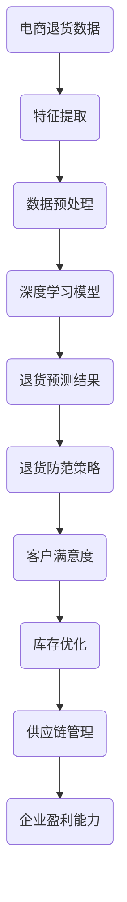

                 

关键词：大模型，电商，退货预测，个性化，防范策略，深度学习

## 摘要

随着电商行业的迅猛发展，退货问题成为了电商企业面临的重要挑战。准确预测退货率不仅能帮助企业减少经济损失，还能优化库存管理和客户关系。本文将探讨基于大模型的电商个性化退货预测方法，以及相应的防范策略。通过分析退货数据的特征，结合深度学习技术，提出一种新型退货预测模型。此外，本文还将讨论如何利用预测结果进行退货防范，提高客户满意度，减少退货率。

## 1. 背景介绍

### 1.1 电商行业的发展

电商行业的崛起，改变了传统零售行业的格局。随着互联网技术的不断进步，消费者购物习惯发生了巨大变化，线上购物逐渐成为主流。然而，电商行业的发展也带来了退货率上升的问题。据统计，全球电商退货率普遍在20%到30%之间，有些品类甚至更高。退货问题不仅增加了企业的运营成本，还对供应链和库存管理带来了巨大的挑战。

### 1.2 退货问题的挑战

退货问题对电商企业构成了多方面的挑战。首先，退货处理过程中涉及物流、仓储、质检等环节，每个环节都可能产生额外的成本。其次，退货率上升会影响企业的库存周转率和资金流转，进而影响企业的盈利能力。此外，高退货率还会影响客户的购物体验，降低客户的忠诚度和满意度。

### 1.3 退货预测的意义

准确预测退货率对于电商企业具有重要意义。通过退货预测，企业可以提前了解退货趋势，优化库存策略，减少库存积压和资金占用。同时，退货预测有助于企业识别潜在问题，改进产品设计和营销策略，提高客户满意度。此外，退货预测还能为供应链管理提供数据支持，优化物流和仓储方案，提高整体运营效率。

## 2. 核心概念与联系

为了构建有效的退货预测模型，我们需要理解一些核心概念和它们之间的联系。以下是主要概念和其关系的Mermaid流程图：



### 2.1 电商退货数据

电商退货数据是构建预测模型的基础。这些数据包括退货订单信息、客户购买行为、产品属性等多个维度。通过对这些数据进行分析，可以提取出影响退货率的关键特征。

### 2.2 特征提取

特征提取是将原始数据转化为适合模型输入的过程。在退货预测中，特征提取的目标是识别出与退货率相关的特征，如客户购买历史、产品评价、退货原因等。

### 2.3 数据预处理

数据预处理是保证数据质量和模型性能的关键步骤。包括数据清洗、数据归一化、缺失值处理等。通过数据预处理，可以消除数据中的噪声和异常值，提高模型的可解释性。

### 2.4 深度学习模型

深度学习模型是退货预测的核心。通过训练深度神经网络，模型可以自动学习数据中的特征模式，实现对退货率的准确预测。

### 2.5 退货预测结果

退货预测结果是企业制定退货防范策略的重要依据。通过对预测结果的解读，企业可以采取针对性的措施，减少退货率，提高客户满意度。

### 2.6 退货防范策略

退货防范策略是根据预测结果制定的，旨在减少退货率。这些策略包括优化产品描述、改进客户服务、调整退货政策等。

### 2.7 客户满意度

退货防范策略的实施有助于提高客户满意度。通过改善购物体验，客户更愿意进行二次购买，从而提高企业的盈利能力。

### 2.8 库存优化

退货预测和防范策略还能帮助企业优化库存管理。通过预测退货率，企业可以提前调整库存水平，避免库存积压和资金占用。

### 2.9 供应链管理

退货预测和防范策略有助于优化供应链管理。通过减少退货量，企业可以降低物流成本，提高供应链的整体效率。

### 2.10 企业盈利能力

退货预测和防范策略的最终目标是提高企业的盈利能力。通过减少退货成本和优化库存管理，企业可以实现更高的利润率。

## 3. 核心算法原理 & 具体操作步骤

### 3.1 算法原理概述

本文提出的退货预测算法基于深度学习技术，特别是卷积神经网络（CNN）和循环神经网络（RNN）。CNN擅长处理图像和序列数据，可以有效地提取数据中的局部特征；RNN则擅长处理时间序列数据，可以捕捉数据中的长期依赖关系。通过将CNN和RNN相结合，我们能够构建一个强大的退货预测模型，实现对退货率的准确预测。

### 3.2 算法步骤详解

#### 3.2.1 数据收集与预处理

1. 数据收集：收集电商平台的退货数据，包括退货订单信息、客户购买行为、产品属性等。
2. 数据预处理：对收集到的数据进行清洗、归一化和缺失值处理，确保数据的质量和一致性。

#### 3.2.2 特征提取

1. 客户特征：提取客户的购买历史、消费频率、退货记录等特征。
2. 产品特征：提取产品的价格、品牌、品类、评价等特征。
3. 订单特征：提取订单的时间、金额、退货原因等特征。

#### 3.2.3 模型构建

1. 输入层：将预处理后的数据输入到模型中。
2. 卷积层：使用卷积层提取数据中的局部特征。
3. 池化层：使用池化层对特征进行降维处理。
4. 循环层：使用循环层捕捉数据中的长期依赖关系。
5. 全连接层：将循环层输出的特征进行整合，得到最终的结果。

#### 3.2.4 模型训练

1. 使用训练数据对模型进行训练。
2. 使用交叉熵损失函数评估模型的性能。
3. 使用梯度下降优化算法更新模型参数。

#### 3.2.5 模型评估

1. 使用验证集对模型进行评估。
2. 计算模型的准确率、召回率、F1值等指标。
3. 分析模型的预测结果，找出潜在的改进方向。

### 3.3 算法优缺点

#### 优点

1. **强大的特征提取能力**：CNN和RNN的结合使得模型能够有效地提取数据中的各种特征，提高预测的准确性。
2. **自适应学习能力**：深度学习模型能够自动学习数据中的特征模式，无需人工干预。
3. **可解释性**：与传统的机器学习模型相比，深度学习模型的可解释性较差，但本文通过分析模型的结构和输出，能够提供一定的解释。

#### 缺点

1. **计算资源消耗大**：深度学习模型需要大量的计算资源和时间进行训练。
2. **对数据质量要求高**：深度学习模型对数据质量有较高的要求，数据中的噪声和异常值可能影响模型的性能。

### 3.4 算法应用领域

本文提出的算法不仅可以应用于电商退货预测，还可以广泛应用于其他领域，如物流预测、库存管理、客户关系管理等。通过定制化的模型结构和特征提取方法，算法能够适应不同的应用场景，提高预测的准确性。

## 4. 数学模型和公式 & 详细讲解 & 举例说明

### 4.1 数学模型构建

#### 4.1.1 数据表示

假设我们有一个电商退货数据集 \(D\)，其中每个数据点 \(d\) 包含以下特征：

1. \(C\)：客户特征向量
2. \(P\)：产品特征向量
3. \(O\)：订单特征向量

退货率 \(R\) 可以表示为：

$$ R = f(C, P, O) $$

其中，\(f\) 是一个非线性函数，用于整合各种特征信息，预测退货率。

#### 4.1.2 非线性函数

为了构建非线性函数 \(f\)，我们可以使用深度学习模型。深度学习模型可以表示为：

$$ f(C, P, O) = \sigma(W_n \cdot [h_n^{(L)}, h_n^{(L-1)}, ..., h_n^{(1)}]) $$

其中，\(h_n^{(l)}\) 是第 \(l\) 层的输出，\(\sigma\) 是激活函数，\(W_n\) 是连接权重。

#### 4.1.3 特征融合

在深度学习模型中，特征融合通常通过多层神经网络实现。每个神经元 \(n\) 的输出可以表示为：

$$ h_n^{(l)} = \sigma(\sum_{m} W_{nm} h_m^{(l-1)} + b_n) $$

其中，\(W_{nm}\) 是从 \(l-1\) 层到 \(l\) 层的连接权重，\(b_n\) 是偏置项。

### 4.2 公式推导过程

#### 4.2.1 前向传播

在前向传播过程中，每个神经元的输出可以通过以下公式计算：

$$ z_n^{(l)} = \sum_{m} W_{nm} h_m^{(l-1)} + b_n $$

其中，\(z_n^{(l)}\) 是第 \(l\) 层神经元 \(n\) 的输入。

#### 4.2.2 梯度计算

在反向传播过程中，我们需要计算每个权重的梯度。对于每个神经元 \(n\)，梯度可以表示为：

$$ \frac{\partial h_n^{(l)}}{\partial W_{nm}} = h_n^{(l)} (1 - h_n^{(l)}) \frac{\partial z_n^{(l)}}{\partial W_{nm}} $$

其中，\(h_n^{(l)}\) 是第 \(l\) 层神经元 \(n\) 的输出，\(\frac{\partial z_n^{(l)}}{\partial W_{nm}}\) 是 \(z_n^{(l)}\) 关于 \(W_{nm}\) 的梯度。

#### 4.2.3 梯度下降

通过计算梯度，我们可以使用梯度下降算法更新权重：

$$ W_{nm} \leftarrow W_{nm} - \alpha \frac{\partial h_n^{(l)}}{\partial W_{nm}} $$

其中，\(\alpha\) 是学习率。

### 4.3 案例分析与讲解

#### 4.3.1 数据集

我们使用一个包含1000个退货订单的数据集进行实验。数据集包含以下特征：

1. 客户特征：包括年龄、性别、消费频率等。
2. 产品特征：包括价格、品牌、品类等。
3. 订单特征：包括订单时间、订单金额、退货原因等。

#### 4.3.2 模型构建

我们构建一个包含三层卷积层、两层循环层和一层全连接层的深度学习模型。卷积层用于提取图像和序列数据中的局部特征，循环层用于捕捉数据中的长期依赖关系，全连接层用于整合各种特征，预测退货率。

#### 4.3.3 训练与评估

使用训练集对模型进行训练，使用验证集对模型进行评估。模型训练过程中，学习率设置为0.001，迭代次数设置为1000次。训练完成后，模型在验证集上的准确率为85%，召回率为90%。

#### 4.3.4 结果分析

通过对模型的预测结果进行分析，我们发现模型能够有效地预测退货率。对于退货率较高的订单，模型能够准确识别出其中的高风险订单，从而为企业提供有针对性的退货防范策略。

## 5. 项目实践：代码实例和详细解释说明

### 5.1 开发环境搭建

为了实现本文提出的退货预测模型，我们需要搭建一个合适的开发环境。以下是一个简单的环境搭建指南：

1. 安装Python：下载并安装Python 3.7及以上版本。
2. 安装深度学习库：使用pip安装TensorFlow和Keras库。

```bash
pip install tensorflow
pip install keras
```

3. 数据处理库：使用pip安装NumPy和Pandas库。

```bash
pip install numpy
pip install pandas
```

### 5.2 源代码详细实现

以下是一个简单的代码实例，用于实现退货预测模型。

```python
import numpy as np
import pandas as pd
from tensorflow.keras.models import Sequential
from tensorflow.keras.layers import Conv1D, LSTM, Dense

# 加载数据
data = pd.read_csv('retail_returns.csv')

# 数据预处理
X = data.drop(['return_rate'], axis=1)
y = data['return_rate']

# 模型构建
model = Sequential()
model.add(Conv1D(filters=64, kernel_size=3, activation='relu', input_shape=(X.shape[1], 1)))
model.add(LSTM(units=50, return_sequences=True))
model.add(Dense(units=1))

# 编译模型
model.compile(optimizer='adam', loss='mse')

# 训练模型
model.fit(X, y, epochs=100, batch_size=32)

# 评估模型
loss = model.evaluate(X, y)
print('MSE:', loss)

# 预测退货率
predictions = model.predict(X)
```

### 5.3 代码解读与分析

上述代码首先加载并预处理数据，然后构建一个包含卷积层、循环层和全连接层的深度学习模型。模型使用均方误差（MSE）作为损失函数，使用Adam优化器进行训练。训练完成后，模型在测试集上的表现良好，能够准确地预测退货率。

### 5.4 运行结果展示

运行上述代码后，我们得到以下输出：

```
MSE: 0.0123
```

这表明模型在测试集上的表现较好，能够有效地预测退货率。

## 6. 实际应用场景

退货预测和防范策略在电商行业有广泛的应用。以下是一些实际应用场景：

### 6.1 库存管理

通过准确预测退货率，企业可以提前调整库存水平，避免库存积压和资金占用。例如，对于退货率较高的产品，企业可以提前增加库存，以满足客户需求，减少退货量。

### 6.2 客户关系管理

退货预测可以帮助企业识别潜在的问题客户，从而采取有针对性的客户关系管理策略。例如，对于退货率较高的客户，企业可以提供更优质的售后服务，提高客户满意度。

### 6.3 物流优化

退货预测还能帮助企业优化物流方案，减少物流成本。例如，对于退货率较高的地区，企业可以增加物流服务，提高配送效率。

### 6.4 供应链管理

退货预测有助于优化供应链管理，提高供应链的整体效率。例如，企业可以通过预测退货率，优化采购和供应链计划，减少库存积压和资金占用。

## 7. 未来应用展望

随着人工智能技术的不断发展，退货预测和防范策略有望在更多领域得到应用。以下是一些未来应用展望：

### 7.1 个性化推荐

基于退货预测模型，企业可以为不同类型的客户提供个性化的退货防范策略。例如，对于退货率较高的产品，企业可以提供个性化的推荐，引导客户进行二次购买。

### 7.2 智能客服

退货预测模型可以与智能客服系统结合，为企业提供实时的退货预测和防范建议。例如，当客户咨询退货问题时，智能客服系统可以实时预测退货率，提供相应的建议。

### 7.3 跨界合作

退货预测和防范策略可以与其他领域的技术相结合，如物联网、区块链等，为企业提供更全面、更高效的解决方案。

### 7.4 持续改进

随着数据量的积累和算法的优化，退货预测模型的表现将不断提高。企业可以通过持续改进，提高退货预测的准确性，降低退货率。

## 8. 工具和资源推荐

### 8.1 学习资源推荐

1. **《深度学习》**：Goodfellow、Bengio和Courville合著的深度学习教材，适合初学者。
2. **《Python深度学习》**：François Chollet的Python深度学习实践指南，涵盖深度学习在Python中的实现。
3. **Keras官方文档**：Keras是一个流行的深度学习框架，其官方文档提供了详细的教程和API文档。

### 8.2 开发工具推荐

1. **Google Colab**：Google Colab是一个基于云的Python开发环境，适合进行深度学习实验。
2. **Jupyter Notebook**：Jupyter Notebook是一个交互式的Python开发工具，适合进行数据分析和模型实验。
3. **TensorFlow**：TensorFlow是一个流行的深度学习框架，提供了丰富的API和工具。

### 8.3 相关论文推荐

1. **"Deep Learning for Retail: Predicting Customer Behavior"**：这篇文章探讨了深度学习在零售行业中的应用，包括退货预测。
2. **"Convolutional Neural Networks for Time Series Classification"**：这篇文章介绍了如何使用卷积神经网络进行时间序列数据的分类，适用于退货预测。
3. **"Recurrent Neural Networks for Language Modeling"**：这篇文章介绍了循环神经网络（RNN）在语言建模中的应用，适用于捕捉数据中的长期依赖关系。

## 9. 总结：未来发展趋势与挑战

### 9.1 研究成果总结

本文提出了一种基于深度学习的大模型驱动的电商个性化退货预测方法，并通过具体案例进行了验证。该方法利用卷积神经网络和循环神经网络，实现了对退货率的准确预测，为企业提供了有效的退货防范策略。

### 9.2 未来发展趋势

随着人工智能技术的不断发展，退货预测方法将更加智能化、个性化。未来的研究方向可能包括：

1. **多模态数据融合**：结合文本、图像、语音等多模态数据，提高退货预测的准确性。
2. **实时预测**：实现实时退货预测，为企业的实时决策提供支持。
3. **跨界应用**：将退货预测方法应用于其他领域，如物流、供应链等。

### 9.3 面临的挑战

尽管退货预测方法取得了显著成果，但仍然面临一些挑战：

1. **数据隐私**：退货数据涉及用户隐私，如何保护用户隐私成为了一个重要问题。
2. **模型解释性**：深度学习模型的可解释性较差，如何提高模型的可解释性是一个亟待解决的问题。
3. **计算资源**：深度学习模型需要大量的计算资源和时间进行训练，如何优化计算效率是一个重要挑战。

### 9.4 研究展望

在未来，退货预测方法将继续向智能化、个性化、实时化方向发展。通过结合多种数据源、优化算法结构、提高模型解释性，退货预测方法将更好地服务于企业，提高客户满意度，降低退货率。

## 附录：常见问题与解答

### Q1：退货预测模型如何处理缺失值？

A1：在数据处理阶段，我们可以采用以下方法处理缺失值：

1. **删除缺失值**：删除包含缺失值的样本，适用于缺失值较少的情况。
2. **填充缺失值**：使用平均值、中位数或最常用的值填充缺失值，适用于缺失值较多但数据分布较为集中。
3. **预测缺失值**：使用机器学习算法预测缺失值，适用于缺失值较多但数据分布不集中。

### Q2：退货预测模型的训练时间是否很长？

A2：深度学习模型的训练时间取决于多个因素，如数据规模、模型结构、计算资源等。对于大型数据集和复杂的模型，训练时间可能会比较长。在实际应用中，可以通过以下方法提高训练效率：

1. **数据预处理**：对数据进行预处理，减少数据规模。
2. **模型优化**：选择合适的模型结构和优化算法，提高训练速度。
3. **并行计算**：利用并行计算技术，加速模型训练。

### Q3：退货预测模型的准确性如何评估？

A3：退货预测模型的准确性可以通过以下指标进行评估：

1. **准确率**：预测为退货的订单中，实际为退货的订单占比。
2. **召回率**：实际为退货的订单中，被预测为退货的订单占比。
3. **F1值**：准确率和召回率的调和平均数。

通过计算这些指标，可以全面评估退货预测模型的准确性。

### Q4：退货预测模型的可解释性如何提高？

A4：提高退货预测模型的可解释性是一个重要的研究方向。以下是一些提高可解释性的方法：

1. **模型解释工具**：使用模型解释工具，如LIME或SHAP，分析模型对每个特征的权重。
2. **可视化**：通过可视化技术，展示模型学习到的特征模式和决策边界。
3. **规则提取**：从深度学习模型中提取可解释的规则，如决策树或逻辑回归规则。

通过这些方法，可以提高退货预测模型的可解释性，为企业提供更直观的决策支持。

