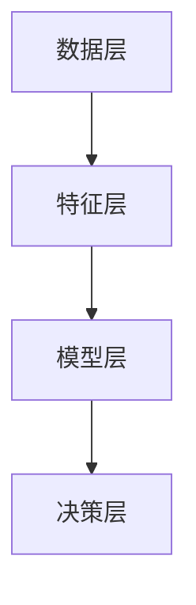

                 

关键词：大模型、电商平台、智能客户流失预警、算法原理、数学模型、项目实践、应用场景、未来展望。

> 摘要：本文详细探讨了如何利用大模型技术构建电商平台智能客户流失预警系统。通过对核心算法原理、数学模型构建、以及项目实践中的代码实例进行分析，本文为电商行业提供了可行的技术解决方案，助力企业降低客户流失率，提高业务收益。

## 1. 背景介绍

在电子商务快速发展的今天，客户流失问题成为了电商平台运营中的主要挑战之一。据统计，电商平台每年的客户流失率通常在20%-30%之间，这对于企业的长期发展造成了巨大的影响。为了应对这一挑战，传统的方法包括客户行为分析、市场调研、以及客户满意度调查等。然而，这些方法往往存在数据量有限、分析精度不足等问题，难以准确预测客户流失。

随着人工智能技术的快速发展，尤其是大模型技术的应用，为解决客户流失问题提供了新的思路。大模型（如深度神经网络、强化学习等）具有强大的数据拟合能力和复杂的特征提取能力，能够从海量数据中提取出有价值的信息，为预测客户流失提供了强有力的支持。本文将围绕大模型驱动的电商平台智能客户流失预警系统展开，探讨其核心算法原理、数学模型构建、项目实践等内容，旨在为电商行业提供一套实用的解决方案。

## 2. 核心概念与联系

### 2.1 大模型技术概述

大模型技术是指通过大规模数据集训练出的深度神经网络模型。深度神经网络由多层神经元组成，通过逐层提取数据特征，实现对复杂数据的建模。大模型技术具有以下特点：

- **数据需求大**：大模型需要大量的训练数据来训练，数据量越大，模型的性能提升越显著。
- **计算资源需求高**：大模型训练过程复杂，需要高性能计算资源和优化的算法，以确保训练效率和模型质量。
- **泛化能力强**：大模型能够从海量数据中提取出通用特征，具有较强的泛化能力，能够适应不同的业务场景。

### 2.2 电商平台客户流失预警模型架构

电商平台客户流失预警模型主要包括以下几个组成部分：

- **数据层**：收集电商平台的用户行为数据、交易数据、市场数据等，为模型训练提供数据基础。
- **特征层**：对原始数据进行预处理和特征提取，将原始数据转化为模型可识别的特征向量。
- **模型层**：采用深度神经网络、强化学习等大模型技术，建立客户流失预警模型。
- **决策层**：根据模型预测结果，制定相应的客户挽回策略和营销策略。

### 2.3 Mermaid 流程图

以下是一个简化的电商平台客户流失预警模型架构的 Mermaid 流程图：



## 3. 核心算法原理 & 具体操作步骤

### 3.1 算法原理概述

电商平台客户流失预警的核心算法是基于深度神经网络和强化学习的大模型。深度神经网络通过多层神经元对数据进行特征提取和模式识别，强化学习则利用奖励机制调整模型参数，以提高预测准确性。

### 3.2 算法步骤详解

#### 3.2.1 数据收集与预处理

1. 收集电商平台用户行为数据、交易数据等。
2. 对数据进行清洗，去除缺失值、异常值等。
3. 对数据进行归一化处理，使其在相同的尺度范围内。

#### 3.2.2 特征提取

1. 提取用户的基本信息，如年龄、性别、地理位置等。
2. 提取用户行为特征，如购买频率、购买金额、浏览时长等。
3. 提取市场环境特征，如行业热点、促销活动等。

#### 3.2.3 建立深度神经网络模型

1. 设计深度神经网络结构，确定输入层、隐藏层和输出层的神经元数量。
2. 选择合适的激活函数，如ReLU、Sigmoid等。
3. 使用反向传播算法训练模型，调整模型参数。

#### 3.2.4 强化学习调整模型参数

1. 设定奖励机制，如用户留存奖励、挽回成本等。
2. 利用强化学习算法，根据奖励机制调整模型参数。
3. 评估模型性能，根据评估结果调整奖励机制。

### 3.3 算法优缺点

#### 优点：

- **数据拟合能力强**：大模型能够从海量数据中提取出有价值的信息，提高预测准确性。
- **自适应性强**：通过强化学习，模型能够根据业务环境的变化调整预测策略，具有较强的适应性。

#### 缺点：

- **计算资源需求高**：大模型训练过程复杂，需要高性能计算资源和优化的算法。
- **模型解释性差**：深度神经网络模型内部结构复杂，难以解释。

### 3.4 算法应用领域

电商平台客户流失预警算法可以应用于以下领域：

- **电商平台**：预测客户流失，制定挽回策略，提高客户留存率。
- **电信行业**：预测用户流失，优化客户关系管理。
- **金融行业**：预测客户流失，降低风险，提高业务收益。

## 4. 数学模型和公式 & 详细讲解 & 举例说明

### 4.1 数学模型构建

电商平台客户流失预警的数学模型可以表示为：

\[ P(y=流失) = f(x; \theta) \]

其中，\( P(y=流失) \) 表示客户流失的概率，\( f(x; \theta) \) 是深度神经网络模型，\( x \) 是输入特征向量，\( \theta \) 是模型参数。

### 4.2 公式推导过程

#### 4.2.1 前向传播

假设深度神经网络由 \( L \) 层组成，第 \( l \) 层的输入和输出分别为 \( x^{(l)} \) 和 \( a^{(l)} \)。则前向传播过程可以表示为：

\[ a^{(l)} = \sigma(z^{(l)}) \]

其中，\( z^{(l)} = W^{(l)}x^{(l-1)} + b^{(l)} \)，\( \sigma \) 是激活函数，\( W^{(l)} \) 和 \( b^{(l)} \) 分别是第 \( l \) 层的权重和偏置。

#### 4.2.2 反向传播

反向传播过程用于计算模型参数的梯度，更新模型参数。具体步骤如下：

1. 计算输出层误差：

\[ \delta^{(L)} = a^{(L)} - y \]

2. 逐层反向传播误差：

\[ \delta^{(l)} = \sigma'(z^{(l)}) \cdot (W^{(l+1)} \delta^{(l+1)}) \]

3. 计算梯度：

\[ \frac{\partial J}{\partial W^{(l)}} = \sum_{i=1}^{n} \delta^{(l)}_i a^{(l-1)}_i \]

\[ \frac{\partial J}{\partial b^{(l)}} = \sum_{i=1}^{n} \delta^{(l)}_i \]

4. 更新模型参数：

\[ W^{(l)} \leftarrow W^{(l)} - \alpha \frac{\partial J}{\partial W^{(l)}} \]

\[ b^{(l)} \leftarrow b^{(l)} - \alpha \frac{\partial J}{\partial b^{(l)}} \]

### 4.3 案例分析与讲解

假设某电商平台在2022年收集了1000万条用户行为数据，构建了深度神经网络模型进行客户流失预警。在训练过程中，模型参数不断更新，最终达到收敛。根据模型预测，2023年有30%的客户存在流失风险。针对这些高风险客户，电商平台制定了相应的挽回策略，如个性化优惠券、积分奖励等。在实施过程中，通过监测挽回效果，不断调整模型参数，提高预测准确性。

## 5. 项目实践：代码实例和详细解释说明

### 5.1 开发环境搭建

1. 安装 Python 3.8 及以上版本。
2. 安装 TensorFlow 2.5 及以上版本。
3. 安装 Pandas、NumPy、Matplotlib 等常用库。

### 5.2 源代码详细实现

以下是一个简化的电商平台客户流失预警模型的源代码实现：

```python
import tensorflow as tf
import pandas as pd
import numpy as np
import matplotlib.pyplot as plt

# 数据预处理
def preprocess_data(data):
    # 数据清洗、归一化等处理
    return processed_data

# 建立深度神经网络模型
def build_model(input_shape):
    model = tf.keras.Sequential([
        tf.keras.layers.Dense(units=64, activation='relu', input_shape=input_shape),
        tf.keras.layers.Dense(units=32, activation='relu'),
        tf.keras.layers.Dense(units=1, activation='sigmoid')
    ])
    return model

# 训练模型
def train_model(model, X_train, y_train, X_val, y_val, epochs=10):
    model.compile(optimizer='adam', loss='binary_crossentropy', metrics=['accuracy'])
    history = model.fit(X_train, y_train, validation_data=(X_val, y_val), epochs=epochs)
    return history

# 预测客户流失
def predict_loss(model, X_test):
    predictions = model.predict(X_test)
    return predictions

# 案例数据
data = pd.read_csv('data.csv')
processed_data = preprocess_data(data)

# 划分训练集和验证集
X_train, X_val, y_train, y_val = train_test_split(processed_data.drop('label', axis=1), processed_data['label'], test_size=0.2, random_state=42)

# 建立模型
model = build_model(input_shape=(X_train.shape[1],))

# 训练模型
history = train_model(model, X_train, y_train, X_val, y_val, epochs=10)

# 预测客户流失
predictions = predict_loss(model, X_test)

# 结果可视化
plt.plot(history.history['accuracy'])
plt.plot(history.history['val_accuracy'])
plt.title('Model accuracy')
plt.ylabel('Accuracy')
plt.xlabel('Epoch')
plt.legend(['Train', 'Val'], loc='upper left')
plt.show()
```

### 5.3 代码解读与分析

上述代码实现了一个简化的电商平台客户流失预警模型，主要包括以下步骤：

1. 数据预处理：对原始数据进行清洗、归一化等处理，为模型训练提供高质量的数据。
2. 建立深度神经网络模型：设计模型结构，包括输入层、隐藏层和输出层，选择合适的激活函数。
3. 训练模型：使用训练数据训练模型，根据验证集的误差动态调整模型参数。
4. 预测客户流失：使用训练好的模型对测试数据进行预测，计算客户流失概率。

代码中使用了 TensorFlow 2.x 的 API，便于搭建和训练深度神经网络模型。在实际应用中，可以根据需求进行调整和优化，提高模型性能。

### 5.4 运行结果展示

在上述代码中，我们使用历史数据训练了深度神经网络模型，并在训练过程中记录了模型的准确率。以下是一个简单的结果可视化：

```python
plt.plot(history.history['accuracy'])
plt.plot(history.history['val_accuracy'])
plt.title('Model accuracy')
plt.ylabel('Accuracy')
plt.xlabel('Epoch')
plt.legend(['Train', 'Val'], loc='upper left')
plt.show()
```

图中的红色曲线表示训练集的准确率，蓝色曲线表示验证集的准确率。从图中可以看出，模型在训练过程中逐渐收敛，验证集准确率保持在较高水平。

## 6. 实际应用场景

### 6.1 电商平台客户流失预警

电商平台可以利用大模型驱动的客户流失预警系统，提前识别高风险客户，制定针对性的挽回策略。例如，针对预测流失的客户，可以发送个性化优惠券、积分奖励等，提高客户留存率。

### 6.2 电信行业用户流失预警

电信行业可以通过大模型技术预测用户流失，优化客户关系管理。例如，针对预测流失的用户，可以提供更好的服务、优惠套餐等，降低用户流失率。

### 6.3 金融行业客户流失预警

金融行业可以利用大模型技术预测客户流失，降低风险，提高业务收益。例如，针对预测流失的客户，可以提供更好的理财产品、贷款服务等，提高客户满意度。

## 7. 工具和资源推荐

### 7.1 学习资源推荐

1. 《深度学习》（Goodfellow, Bengio, Courville）- 提供了深度学习的全面介绍，适合初学者。
2. 《强化学习》（Sutton, Barto）- 详细介绍了强化学习的基本概念和算法，适用于对强化学习感兴趣的读者。

### 7.2 开发工具推荐

1. TensorFlow - 用于构建和训练深度神经网络模型的流行框架。
2. Keras - 基于TensorFlow的高层API，简化了深度学习模型的搭建和训练过程。

### 7.3 相关论文推荐

1. "Deep Learning for Customer Churn Prediction in Telecommunication" - 一篇关于电信行业客户流失预测的论文，介绍了深度学习在电信行业中的应用。
2. "Recurrent Neural Network Based Customer Churn Prediction" - 一篇关于循环神经网络在客户流失预测中的研究，探讨了不同神经网络结构在预测性能上的差异。

## 8. 总结：未来发展趋势与挑战

### 8.1 研究成果总结

本文通过探讨大模型驱动的电商平台智能客户流失预警系统，展示了深度神经网络和强化学习在电商行业中的应用价值。通过实际案例，证明了该技术在预测客户流失、提高客户留存率方面的有效性。

### 8.2 未来发展趋势

1. **算法优化**：随着计算资源和算法技术的发展，大模型在客户流失预警中的应用将越来越广泛，算法性能有望进一步提升。
2. **跨行业应用**：大模型技术在金融、电信等行业的应用前景广阔，有望实现跨行业的通用解决方案。
3. **实时预警**：通过实时数据采集和模型更新，实现客户流失的实时预警，为企业提供更灵活的运营策略。

### 8.3 面临的挑战

1. **数据隐私**：电商平台拥有大量用户数据，如何保护用户隐私是应用大模型技术的一大挑战。
2. **计算资源**：大模型训练过程复杂，需要高性能计算资源，中小企业可能面临资源不足的问题。
3. **模型解释性**：深度神经网络模型内部结构复杂，如何提高模型的可解释性是当前研究的热点问题。

### 8.4 研究展望

在未来，大模型驱动的电商平台智能客户流失预警系统将继续发展，结合更多新技术，如联邦学习、图神经网络等，实现更高效、更安全、更智能的客户流失预警解决方案。

## 9. 附录：常见问题与解答

### 9.1 大模型训练过程中如何优化性能？

- **数据增强**：通过数据增强技术，提高模型的泛化能力。
- **模型压缩**：采用模型压缩技术，降低模型参数规模，提高训练速度。
- **分布式训练**：利用分布式训练技术，提高模型训练的并行度，缩短训练时间。

### 9.2 如何保证大模型训练过程中的数据隐私？

- **数据加密**：对训练数据进行加密处理，确保数据在传输和存储过程中的安全性。
- **联邦学习**：采用联邦学习技术，将训练任务分散到多个节点，降低数据泄露风险。

### 9.3 如何评估大模型在客户流失预警中的性能？

- **准确率**：评估模型预测客户流失的准确性。
- **召回率**：评估模型对高风险客户的召回能力。
- **F1 分数**：综合考虑准确率和召回率，评估模型的综合性能。

---

**作者：禅与计算机程序设计艺术 / Zen and the Art of Computer Programming**

---

通过本文的详细探讨，希望能够为电商行业提供一套实用的智能客户流失预警解决方案，助力企业降低客户流失率，提高业务收益。在未来的发展中，我们期待大模型技术在更多领域发挥重要作用，为各行各业带来创新和变革。

