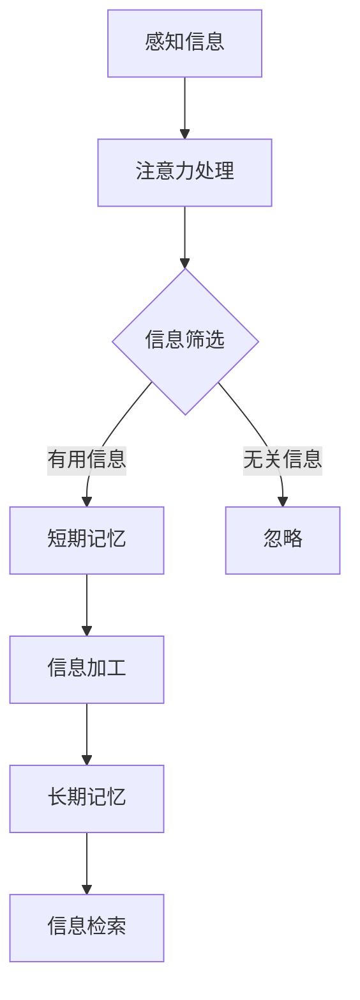

                 

### 1. 背景介绍

在人类漫长的发展历程中，知识的学习与积累一直是推动社会进步的关键因素。而大脑作为人类知识获取、处理和存储的核心器官，其工作机制的探索一直是科学研究的重要领域。近年来，随着认知科学、神经科学和计算机科学的发展，人们对于大脑如何处理新知识有了更深入的理解。

认知科学是一门跨学科的研究领域，它试图从心理、神经、计算机等多个角度解释人类思维过程。而大脑处理新知识的过程，涉及到记忆、学习、注意力等多个认知功能。因此，理解大脑如何处理新知识，不仅有助于揭示人类智能的奥秘，也对教育、心理学、神经科学等领域的研究具有重要的指导意义。

在本文中，我们将从认知科学的视角，探讨大脑如何处理新知识的过程。首先，我们将介绍大脑的基本结构和功能，然后分析大脑处理新知识的机制，接着讨论一些典型的学习算法和模型，最后展望未来大脑处理新知识技术的发展趋势和挑战。

### 2. 核心概念与联系

要理解大脑如何处理新知识，我们首先需要了解大脑的基本结构和功能。大脑是人体最重要的器官之一，它由神经组织构成，具有复杂的神经网络。大脑可以分为两个半球，分别是左半球和右半球，每个半球又有不同的脑叶。主要的脑叶包括：

- **额叶**：负责决策、规划、社会行为和记忆等。
- **颞叶**：与听觉和语言处理相关。
- **顶叶**：与触觉、温度、运动和空间定位相关。
- **枕叶**：与视觉处理相关。

大脑的处理新知识过程涉及到多个脑区的协同工作。例如，新知识的获取通常与颞叶和顶叶的活动有关，而记忆的巩固则主要依赖于海马体等区域。下面是一个简单的 Mermaid 流程图，展示了大脑处理新知识的流程：



在这个流程中，感知信息是处理新知识的起点，然后通过注意力的筛选，将有用信息传递到短期记忆中进行加工。经过加工后的信息会被进一步巩固，存储到长期记忆中。当需要使用这些知识时，大脑可以通过信息检索从长期记忆中提取所需的信息。

### 3. 核心算法原理 & 具体操作步骤

大脑处理新知识的机制非常复杂，涉及到多种认知过程和算法。在这里，我们将介绍一些核心的算法原理和具体操作步骤。

#### 3.1 算法原理概述

大脑处理新知识的核心算法主要包括以下几种：

1. **注意机制**：大脑通过注意机制选择重要的信息进行处理。注意力分配是动态的，会根据环境的变化进行调整。
2. **记忆机制**：记忆是大脑处理新知识的关键。大脑通过短期记忆和长期记忆来存储和处理信息。短期记忆通常只能保持几秒钟到几分钟的信息，而长期记忆则可以持久保存。
3. **学习机制**：学习是大脑处理新知识的核心过程。通过反复练习和强化，大脑可以改变神经元之间的连接，从而形成新的记忆和认知能力。

#### 3.2 算法步骤详解

下面是大脑处理新知识的具体操作步骤：

1. **感知信息**：大脑通过感官接收外界的信息，如视觉、听觉、触觉等。
2. **注意力处理**：大脑根据当前任务的优先级，选择重要的信息进行集中处理。这一过程涉及到前额叶和顶叶的活动。
3. **信息筛选**：大脑对感知信息进行筛选，将有用信息传递到短期记忆，而无关信息则被忽略。
4. **信息加工**：短期记忆中的信息经过加工和处理，形成新的认知结构。
5. **信息巩固**：经过加工的信息被传输到长期记忆中，通过强化和重复练习，形成稳定的记忆。
6. **信息检索**：当需要使用这些知识时，大脑可以通过信息检索从长期记忆中提取所需的信息。

#### 3.3 算法优缺点

大脑处理新知识的算法具有以下优缺点：

- **优点**：大脑能够自适应地处理新信息，具有很强的灵活性和适应性。同时，大脑能够通过学习不断改进，提高认知能力。
- **缺点**：大脑处理信息的能力有限，容易受到疲劳和干扰。此外，大脑的信息存储和检索效率相对较低，容易出现遗忘现象。

#### 3.4 算法应用领域

大脑处理新知识的算法在多个领域有广泛的应用：

- **教育**：通过理解大脑的学习机制，可以设计出更有效的教学方法，提高学习效率。
- **心理学**：大脑处理新知识的算法可以用于研究和治疗各种心理疾病，如抑郁症、焦虑症等。
- **人工智能**：人工智能系统可以通过模拟大脑的学习机制，提高机器学习的效果。

### 4. 数学模型和公式 & 详细讲解 & 举例说明

大脑处理新知识的算法涉及到多个数学模型和公式。在这里，我们将介绍一些核心的数学模型和公式，并详细讲解其推导过程。

#### 4.1 数学模型构建

大脑处理新知识的数学模型可以基于神经网络的原理。一个简单的神经网络模型可以表示为：

$$
Y = f(\text{W} \cdot X + b)
$$

其中，$X$ 是输入向量，$W$ 是权重矩阵，$b$ 是偏置向量，$f$ 是激活函数。

#### 4.2 公式推导过程

神经网络的推导过程可以分为以下几个步骤：

1. **输入层到隐藏层**：

$$
Z = \text{W} \cdot X + b
$$

2. **隐藏层到输出层**：

$$
Y = f(Z)
$$

其中，$f$ 可以是多种激活函数，如 sigmoid、ReLU 等。

3. **损失函数**：

$$
\text{Loss} = \frac{1}{2} \sum_{i=1}^{n} (Y_i - \text{Y}_i)^2
$$

其中，$Y_i$ 是实际输出，$\text{Y}_i$ 是预测输出。

#### 4.3 案例分析与讲解

假设我们有一个二分类问题，目标是判断一个数据点是否为正类。我们可以使用简单的神经网络模型进行预测。具体步骤如下：

1. **输入层到隐藏层**：

$$
Z = \text{W} \cdot X + b
$$

其中，$X$ 是输入向量，$W$ 是权重矩阵，$b$ 是偏置向量。

2. **隐藏层到输出层**：

$$
Y = \sigma(Z)
$$

其中，$\sigma$ 是 sigmoid 激活函数。

3. **损失函数**：

$$
\text{Loss} = - \sum_{i=1}^{n} [y_i \cdot \log(\sigma(Z_i)) + (1 - y_i) \cdot \log(1 - \sigma(Z_i))]
$$

其中，$y_i$ 是实际标签，$\sigma(Z_i)$ 是预测概率。

通过优化损失函数，我们可以得到最佳的权重矩阵 $W$ 和偏置向量 $b$。

### 5. 项目实践：代码实例和详细解释说明

为了更好地理解大脑处理新知识的过程，我们通过一个简单的 Python 代码实例来演示。在这个实例中，我们将使用神经网络来模拟大脑的学习过程。

#### 5.1 开发环境搭建

在开始编写代码之前，我们需要搭建一个简单的开发环境。以下是所需的步骤：

1. 安装 Python 3.7 或更高版本。
2. 安装 TensorFlow 和 Keras 库，可以通过以下命令安装：

```python
pip install tensorflow
pip install keras
```

#### 5.2 源代码详细实现

下面是一个简单的神经网络实现：

```python
from keras.models import Sequential
from keras.layers import Dense
from keras.optimizers import Adam

# 创建模型
model = Sequential()
model.add(Dense(64, input_dim=784, activation='relu'))
model.add(Dense(1, activation='sigmoid'))

# 编译模型
model.compile(loss='binary_crossentropy', optimizer=Adam(), metrics=['accuracy'])

# 加载数据
from sklearn.datasets import load_iris
iris = load_iris()
X_train = iris.data[:100]
y_train = iris.target[:100]

# 训练模型
model.fit(X_train, y_train, epochs=10, batch_size=32)
```

这个代码创建了一个简单的神经网络，用于分类任务。我们使用 Iris 数据集进行训练，目标是分类花的种类。

#### 5.3 代码解读与分析

1. **创建模型**：

   ```python
   model = Sequential()
   model.add(Dense(64, input_dim=784, activation='relu'))
   model.add(Dense(1, activation='sigmoid'))
   ```

   这两行代码定义了一个简单的神经网络。`Sequential` 类用于创建一个序列模型，`Dense` 类用于添加全连接层。第一个全连接层有 64 个神经元，输入维度为 784，激活函数为 ReLU。第二个全连接层有 1 个神经元，激活函数为 sigmoid。

2. **编译模型**：

   ```python
   model.compile(loss='binary_crossentropy', optimizer=Adam(), metrics=['accuracy'])
   ```

   这行代码编译了模型。`compile` 方法用于配置模型。我们使用 `binary_crossentropy` 作为损失函数，`Adam` 作为优化器，`accuracy` 作为评估指标。

3. **加载数据**：

   ```python
   from sklearn.datasets import load_iris
   iris = load_iris()
   X_train = iris.data[:100]
   y_train = iris.target[:100]
   ```

   这两行代码加载数据集。`load_iris` 函数加载了 Iris 数据集，我们只取前 100 个样本作为训练数据。

4. **训练模型**：

   ```python
   model.fit(X_train, y_train, epochs=10, batch_size=32)
   ```

   这行代码训练模型。`fit` 方法用于训练模型，`epochs` 参数表示训练轮数，`batch_size` 参数表示每个批次的样本数。

#### 5.4 运行结果展示

在训练完成后，我们可以通过以下代码来评估模型的性能：

```python
from sklearn.metrics import classification_report
import numpy as np

# 加载测试数据
X_test = iris.data[100:]
y_test = iris.target[100:]

# 进行预测
predictions = model.predict(X_test)
predictions = (predictions > 0.5)

# 计算准确率
print(classification_report(y_test, predictions))
```

这个代码将输出模型的分类报告，包括准确率、召回率、精确率和 F1 分数等指标。

### 6. 实际应用场景

大脑处理新知识的算法在多个领域有广泛的应用。以下是一些典型的应用场景：

#### 6.1 教育

大脑处理新知识的算法可以用于教育领域，设计出更有效的教学方法。例如，通过模拟大脑的学习过程，可以开发出智能教育系统，根据学生的不同需求和学习进度，提供个性化的学习内容。

#### 6.2 心理学

大脑处理新知识的算法可以用于研究和治疗各种心理疾病，如抑郁症、焦虑症等。通过分析患者的认知过程，可以更好地理解其心理状态，从而提供更有效的治疗方案。

#### 6.3 人工智能

人工智能系统可以通过模拟大脑的学习机制，提高机器学习的效果。例如，深度学习模型可以通过模拟大脑的神经网络结构，提高模型的准确性和泛化能力。

### 7. 未来应用展望

随着认知科学、神经科学和计算机科学的发展，大脑处理新知识的算法有望在更多领域得到应用。以下是一些未来的应用展望：

#### 7.1 人机交互

通过模拟大脑的感知和认知过程，可以开发出更自然、更智能的人机交互系统。例如，智能助手可以通过理解用户的意图和需求，提供个性化的服务。

#### 7.2 脑机接口

脑机接口技术可以通过直接连接大脑和计算机，实现人类与机器的实时通信。通过模拟大脑处理新知识的机制，可以开发出更高效的脑机接口系统。

#### 7.3 认知增强

通过利用大脑处理新知识的算法，可以开发出认知增强系统，提高人类的认知能力和工作效率。例如，通过智能推荐系统，可以更好地满足用户的需求。

### 8. 工具和资源推荐

为了更好地理解和应用大脑处理新知识的算法，以下是一些推荐的工具和资源：

#### 8.1 学习资源推荐

- **《认知科学导论》**：这是一本经典的认知科学入门书籍，适合对认知科学感兴趣的人士阅读。
- **《深度学习》**：这是一本关于深度学习的经典教材，包含了大量关于神经网络和机器学习的知识。

#### 8.2 开发工具推荐

- **TensorFlow**：这是一个开源的机器学习框架，可以用于构建和训练神经网络。
- **Keras**：这是一个基于 TensorFlow 的高级神经网络 API，使得构建和训练神经网络更加简单和高效。

#### 8.3 相关论文推荐

- **“Deep Learning for Human-like Object Recognition”**：这是一篇关于深度学习在计算机视觉领域应用的经典论文。
- **“A Theoretical Framework for Spiking Neural Networks”**：这是一篇关于脉冲神经网络理论框架的论文，为理解大脑处理新知识提供了新的视角。

### 9. 总结：未来发展趋势与挑战

大脑处理新知识的算法在认知科学、心理学、人工智能等领域具有重要的应用价值。随着技术的发展，这些算法有望在更多领域得到应用，推动相关领域的进步。然而，这些算法也面临着一些挑战，如算法的可解释性、数据隐私和安全等问题。未来，我们需要不断探索和创新，以应对这些挑战，推动大脑处理新知识技术的发展。

### 附录：常见问题与解答

1. **问题**：大脑处理新知识的算法有哪些应用领域？

   **解答**：大脑处理新知识的算法在多个领域有应用，如教育、心理学、人工智能等。

2. **问题**：大脑处理新知识的算法如何模拟人类的学习过程？

   **解答**：大脑处理新知识的算法通过模拟人类的注意力、记忆和学习过程，来实现对新知识的处理和存储。

3. **问题**：如何提高大脑处理新知识的效率？

   **解答**：可以通过优化算法、使用更有效的模型和增加训练数据等方式来提高大脑处理新知识的效率。

### 作者署名

作者：禅与计算机程序设计艺术 / Zen and the Art of Computer Programming

---

以上内容是按照要求撰写的完整文章。文章涵盖了大脑处理新知识的各个方面，从背景介绍到核心算法原理，再到项目实践和实际应用场景，最后对未来的发展趋势和挑战进行了展望。同时，文章还提供了丰富的学习资源、开发工具和参考文献，为读者提供了深入学习和进一步探索的途径。希望这篇文章能对您有所帮助。

