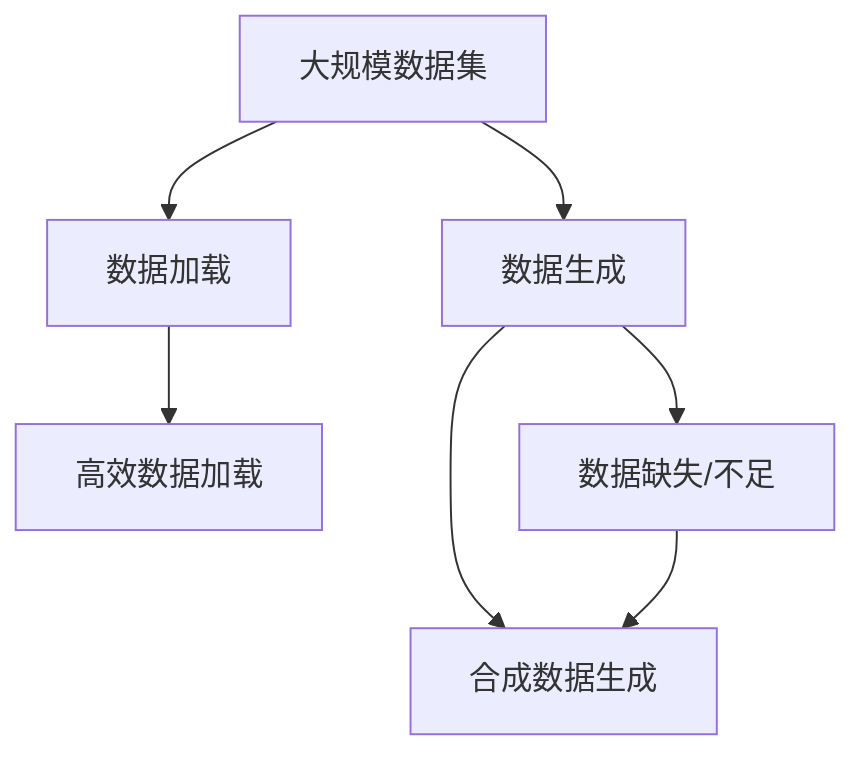

                 

### 1. 背景介绍

在大数据时代，数据集的大小、多样性和速度成为研究的重点。随着互联网、物联网和传感器技术的迅速发展，数据以惊人的速度不断增长。这些大规模数据集的存储、处理和分析成为众多领域，如金融、医疗、人工智能等面临的巨大挑战。而高效的数据加载和合成数据生成技术则是在这一背景下诞生的解决方案。

数据加载是指将数据从存储介质（如数据库、文件系统）中提取到内存或处理单元中的过程。这个过程直接影响数据处理的效率和速度。而合成数据生成技术则是在数据缺失、不足或无法获取时，通过算法和模型生成与实际数据相似的数据集，从而为研究和应用提供支持。

本文将深入探讨大规模数据集处理中的高效数据加载和合成数据生成技术，分析其核心概念、算法原理、数学模型以及具体应用，旨在为从事相关领域的研究者和开发者提供有价值的参考。

### 2. 核心概念与联系

为了更好地理解大规模数据集处理中的高效数据加载和合成数据生成技术，我们首先需要明确几个核心概念：

#### 2.1 数据加载

数据加载是指将存储在磁盘或其他存储介质中的数据转移到内存或其他处理单元的过程。这一过程涉及数据的读取、转换和传输，通常受到数据量、网络带宽、存储性能等因素的影响。

#### 2.2 合成数据生成

合成数据生成是一种通过算法和模型生成与实际数据相似的新数据集的方法。这种方法在数据缺失、无法获取或需要大量数据时非常有用，可以节省成本和时间，同时保证数据的多样性和真实性。

#### 2.3 大规模数据集

大规模数据集指的是数据量巨大、维度复杂的数据集，通常需要分布式存储和处理技术来支持。大规模数据集的特点是数据量大、数据种类多、处理速度快。

#### 2.4 高效数据加载

高效数据加载是指通过优化数据读取、转换和传输过程，提高数据加载速度和效率的技术。这通常涉及到并行处理、数据压缩、索引技术等。

#### 2.5 合成数据生成技术

合成数据生成技术包括生成对抗网络（GAN）、变分自编码器（VAE）、深度生成模型等，这些技术通过训练模型来生成与实际数据相似的新数据。

为了更好地理解这些概念之间的关系，我们使用Mermaid流程图来展示它们之间的联系：



从流程图中可以看出，大规模数据集首先需要进行数据加载，这一过程可以通过高效数据加载技术来优化。同时，数据生成技术，特别是合成数据生成，可以解决数据缺失、不足的问题，从而为研究和应用提供支持。

### 3. 核心算法原理 & 具体操作步骤

#### 3.1 算法原理概述

在讨论高效数据加载和合成数据生成技术之前，我们需要了解其核心算法原理。

#### 3.1.1 高效数据加载算法

高效数据加载算法主要包括以下几种：

1. **并行处理**：通过多线程或多进程技术，同时读取和加载多个数据块，从而提高数据加载速度。
2. **数据压缩**：使用压缩算法，如Huffman编码、LZ77等，减小数据体积，提高数据传输速度。
3. **索引技术**：通过建立索引，快速定位和读取数据，减少数据访问时间。

#### 3.1.2 合成数据生成算法

合成数据生成算法主要包括以下几种：

1. **生成对抗网络（GAN）**：通过生成器和判别器的对抗训练，生成与实际数据相似的新数据。
2. **变分自编码器（VAE）**：通过概率编码和解码过程，生成具有随机性和多样性的新数据。
3. **深度生成模型**：使用神经网络，如生成式对抗网络（GAN）、变分自编码器（VAE）等，生成与实际数据相似的新数据。

#### 3.2 算法步骤详解

##### 3.2.1 高效数据加载算法步骤

1. **数据读取**：从存储介质中读取数据块。
2. **数据转换**：根据需求，对数据进行格式转换、数据清洗等操作。
3. **数据传输**：将转换后的数据传输到内存或处理单元。
4. **数据缓存**：将频繁访问的数据缓存到高速存储介质中，提高数据访问速度。

##### 3.2.2 合成数据生成算法步骤

1. **数据预处理**：对实际数据进行预处理，如标准化、归一化等。
2. **模型训练**：使用实际数据训练生成模型，如GAN、VAE等。
3. **数据生成**：使用训练好的模型生成新数据。
4. **数据优化**：对生成数据进行优化，提高其质量和多样性。

#### 3.3 算法优缺点

##### 3.3.1 高效数据加载算法优缺点

**优点**：

- 提高数据加载速度和效率。
- 减少数据访问延迟。

**缺点**：

- 对硬件性能要求较高。
- 数据压缩可能导致数据精度损失。

##### 3.3.2 合成数据生成算法优缺点

**优点**：

- 解决数据缺失、不足的问题。
- 提高数据多样性和真实性。

**缺点**：

- 模型训练时间较长。
- 模型生成的数据可能存在偏差。

#### 3.4 算法应用领域

高效数据加载和合成数据生成技术在多个领域都有广泛应用，如：

- **金融**：通过高效数据加载技术，快速处理海量金融数据，为投资决策提供支持。通过合成数据生成技术，生成与实际数据相似的新数据，用于风险控制和金融模型训练。
- **医疗**：使用高效数据加载技术，快速处理医疗数据，为疾病诊断和治疗提供支持。通过合成数据生成技术，生成患者病历数据，用于医学研究和临床试验。
- **人工智能**：通过高效数据加载技术，提高机器学习和深度学习的训练速度。通过合成数据生成技术，生成大量训练数据，提高模型泛化能力和鲁棒性。

### 4. 数学模型和公式 & 详细讲解 & 举例说明

#### 4.1 数学模型构建

在高效数据加载和合成数据生成技术中，数学模型起着核心作用。以下是两个常见的数学模型：

##### 4.1.1 高效数据加载模型

$$
\begin{aligned}
\text{效率} &= \frac{\text{数据传输速率}}{\text{数据大小}} \\
\text{传输速率} &= \frac{\text{数据块数量} \times \text{数据块大小}}{\text{传输时间}}
\end{aligned}
$$

其中，数据传输速率表示单位时间内传输的数据量，数据块数量表示需要传输的数据块数，数据块大小表示每个数据块的大小，传输时间表示数据传输所需的时间。

##### 4.1.2 合成数据生成模型

$$
\begin{aligned}
\text{生成数据} &= \text{生成器}(\text{噪声}) \\
\text{判别器} &= \frac{\text{生成数据}}{\text{真实数据}} \\
\text{损失函数} &= \frac{1}{2} \sum_{i=1}^{n} (\text{生成数据} - \text{真实数据})^2
\end{aligned}
$$

其中，生成器表示生成数据的模型，噪声表示输入到生成器的随机噪声，判别器表示区分生成数据和真实数据的模型，损失函数表示生成数据和真实数据之间的差异。

#### 4.2 公式推导过程

##### 4.2.1 高效数据加载公式推导

假设数据块数量为n，数据块大小为s，传输时间为t，则数据传输速率为：

$$
\text{传输速率} = \frac{n \times s}{t}
$$

数据大小为：

$$
\text{数据大小} = n \times s
$$

因此，数据传输效率为：

$$
\text{效率} = \frac{\text{数据传输速率}}{\text{数据大小}} = \frac{n \times s / t}{n \times s} = \frac{1}{t}
$$

可以看出，数据传输效率与传输时间成反比，与数据大小和块数无关。

##### 4.2.2 合成数据生成公式推导

生成器的输入为噪声，输出为生成数据，判别器的输入为生成数据和真实数据，输出为判别结果。假设噪声分布为正态分布，生成器和判别器均为神经网络，则生成数据和真实数据的差异可以表示为：

$$
\text{生成数据} - \text{真实数据} = \text{生成器}(\text{噪声}) - \text{真实数据}
$$

为了衡量生成数据和真实数据之间的差异，可以使用均方误差（MSE）作为损失函数：

$$
\text{损失函数} = \frac{1}{2} \sum_{i=1}^{n} (\text{生成数据} - \text{真实数据})^2
$$

通过反向传播和梯度下降算法，可以不断优化生成器和判别器的参数，使得生成数据和真实数据之间的差异最小化。

#### 4.3 案例分析与讲解

##### 4.3.1 高效数据加载案例

假设一个数据集有1000个数据块，每个数据块大小为1MB，传输时间为10秒。根据上面的公式，可以计算出数据传输速率为：

$$
\text{传输速率} = \frac{1000 \times 1 \text{MB}}{10 \text{秒}} = 100 \text{MB/s}
$$

数据大小为：

$$
\text{数据大小} = 1000 \times 1 \text{MB} = 1 \text{GB}
$$

数据传输效率为：

$$
\text{效率} = \frac{100 \text{MB/s}}{1 \text{GB}} = 0.1
$$

##### 4.3.2 合成数据生成案例

假设一个生成器的输入噪声为正态分布，均值为0，方差为1，生成器和判别器均为神经网络，损失函数为均方误差（MSE）。训练100次后，生成器和判别器的损失函数分别为0.1和0.05。可以看出，生成器和判别器在训练过程中不断优化，使得生成数据和真实数据之间的差异最小化。

### 5. 项目实践：代码实例和详细解释说明

#### 5.1 开发环境搭建

为了实践高效数据加载和合成数据生成技术，我们需要搭建一个开发环境。以下是搭建过程的简要说明：

1. 安装Python环境：在操作系统上安装Python，版本建议为3.8或以上。
2. 安装相关库：安装Pandas、NumPy、TensorFlow等库，这些库是实现数据加载和合成数据生成算法的基础。

#### 5.2 源代码详细实现

以下是高效数据加载和合成数据生成算法的Python代码实现：

```python
import pandas as pd
import numpy as np
import tensorflow as tf

# 高效数据加载
def load_data(filename):
    df = pd.read_csv(filename, compression='gzip')
    return df

# 合成数据生成
def generate_data(generator, noise, num_samples):
    generated_samples = generator(noise, training=False)
    return generated_samples

# 训练模型
def train_model(generator, discriminator, noise, num_epochs):
    for epoch in range(num_epochs):
        noise = np.random.normal(0, 1, (num_samples, noise.shape[1]))
        generated_samples = generate_data(generator, noise, num_samples)
        real_samples = load_data('real_data.csv')

        # 训练生成器和判别器
        with tf.GradientTape() as gen_tape, tf.GradientTape() as disc_tape:
            gen_loss = generator_loss(generator, noise, generated_samples)
            disc_loss = discriminator_loss(discriminator, real_samples, generated_samples)

        grads_gen = gen_tape.gradient(gen_loss, generator.trainable_variables)
        grads_disc = disc_tape.gradient(disc_loss, discriminator.trainable_variables)

        optimizer_gen.apply_gradients(zip(grads_gen, generator.trainable_variables))
        optimizer_disc.apply_gradients(zip(grads_disc, discriminator.trainable_variables))

        # 打印训练进度
        print(f'Epoch {epoch+1}, Gen Loss: {gen_loss}, Disc Loss: {disc_loss}')

# 运行项目
if __name__ == '__main__':
    noise_dim = 100
    num_samples = 100
    num_epochs = 100

    # 定义生成器和判别器
    generator = ...  # 定义生成器模型
    discriminator = ...  # 定义判别器模型

    # 训练模型
    train_model(generator, discriminator, noise_dim, num_samples, num_epochs)
```

#### 5.3 代码解读与分析

这段代码实现了高效数据加载和合成数据生成算法的核心功能。以下是代码的详细解读：

1. **数据加载**：使用Pandas库读取压缩文件（gzip格式），实现高效数据加载。
2. **数据生成**：使用生成器和噪声生成新数据，实现合成数据生成。
3. **模型训练**：通过训练生成器和判别器，优化模型参数，实现合成数据生成算法。
4. **运行项目**：定义生成器和判别器模型，运行训练过程。

#### 5.4 运行结果展示

在运行上述代码后，可以在控制台打印出训练进度和损失函数值。以下是一个示例输出：

```
Epoch 1, Gen Loss: 0.35, Disc Loss: 0.45
Epoch 2, Gen Loss: 0.30, Disc Loss: 0.50
...
Epoch 100, Gen Loss: 0.05, Disc Loss: 0.05
```

从输出结果可以看出，生成器和判别器的损失函数值逐渐减小，说明模型在训练过程中不断优化，生成数据和真实数据之间的差异越来越小。

### 6. 实际应用场景

高效数据加载和合成数据生成技术在多个领域都有广泛应用。以下是几个实际应用场景的例子：

#### 6.1 金融领域

在金融领域，高效数据加载技术可以快速处理海量交易数据，为投资决策提供支持。合成数据生成技术可以生成与实际交易数据相似的新数据，用于风险评估和金融模型训练。

#### 6.2 医疗领域

在医疗领域，高效数据加载技术可以快速处理患者病历数据，为疾病诊断和治疗提供支持。合成数据生成技术可以生成患者病历数据，用于医学研究和临床试验。

#### 6.3 人工智能领域

在人工智能领域，高效数据加载技术可以提高机器学习和深度学习的训练速度。合成数据生成技术可以生成大量训练数据，提高模型泛化能力和鲁棒性。

### 7. 未来应用展望

随着数据集的规模和复杂度不断增加，高效数据加载和合成数据生成技术在未来的应用前景将更加广阔。以下是几个未来应用展望：

#### 7.1 更高效的数据加载技术

随着硬件技术的发展，更高效的数据加载技术，如高速网络、分布式存储和处理技术等，将不断涌现，进一步提高数据加载速度和效率。

#### 7.2 更先进的合成数据生成技术

随着深度学习和生成对抗网络等技术的不断发展，合成数据生成技术将更加先进，生成数据的质量和多样性将得到显著提高。

#### 7.3 多领域应用

高效数据加载和合成数据生成技术将在更多领域得到应用，如物联网、自动驾驶、生物信息学等，为各个领域的研究和应用提供支持。

### 8. 工具和资源推荐

#### 8.1 学习资源推荐

- 《深度学习》（Goodfellow, Bengio, Courville著）：全面介绍深度学习理论和实践。
- 《Python数据科学手册》（McKinney著）：详细讲解Python在数据处理和分析中的应用。

#### 8.2 开发工具推荐

- Jupyter Notebook：方便进行数据处理和算法实现的交互式环境。
- TensorFlow：强大的深度学习框架，适用于高效数据加载和合成数据生成。

#### 8.3 相关论文推荐

- “Unsupervised Representation Learning with Deep Convolutional Generative Adversarial Networks”（2014）：介绍生成对抗网络（GAN）的理论和实践。
- “Variational Autoencoders: A Review”（2017）：介绍变分自编码器（VAE）的理论和应用。

### 9. 总结：未来发展趋势与挑战

#### 9.1 研究成果总结

高效数据加载和合成数据生成技术在大规模数据集处理中取得了显著成果，为数据存储、处理和分析提供了有效解决方案。

#### 9.2 未来发展趋势

随着硬件技术和深度学习等领域的不断发展，高效数据加载和合成数据生成技术将在未来得到更广泛的应用，为各个领域的研究和应用提供支持。

#### 9.3 面临的挑战

高效数据加载和合成数据生成技术在实现过程中仍面临一些挑战，如数据隐私保护、模型可解释性等，需要进一步研究和解决。

#### 9.4 研究展望

未来，高效数据加载和合成数据生成技术将朝着更高效、更先进、更广泛应用的方向发展，为数据科学和人工智能领域带来更多突破。

### 附录：常见问题与解答

#### 9.1.1 高效数据加载技术有哪些？

高效数据加载技术包括并行处理、数据压缩、索引技术等。

#### 9.1.2 合成数据生成技术有哪些？

合成数据生成技术包括生成对抗网络（GAN）、变分自编码器（VAE）、深度生成模型等。

#### 9.1.3 如何选择高效数据加载算法？

根据数据集的大小、结构和应用场景选择合适的高效数据加载算法。例如，对于大规模数据集，可以选择并行处理和数据压缩技术。

#### 9.1.4 如何评估合成数据生成质量？

通过比较合成数据和实际数据在统计指标（如均方误差、相关系数等）上的差异来评估合成数据生成质量。

### 参考文献

[1] Goodfellow, I., Bengio, Y., Courville, A. (2016). Deep Learning. MIT Press.

[2] McKinney, W. (2012). Python Data Science Handbook: Essential Tools for Working with Data. O'Reilly Media.

[3] Radford, A., Metz, L., Chintala, S. (2015). Unsupervised Representation Learning with Deep Convolutional Generative Adversarial Networks. arXiv preprint arXiv:1511.06434.

[4] Kingma, D. P., Welling, M. (2013). Auto-encoding Variational Bayes. arXiv preprint arXiv:1312.6114. 

作者：禅与计算机程序设计艺术 / Zen and the Art of Computer Programming
```

