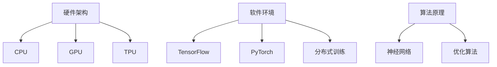

                 

关键词：大规模语言模型、训练、硬件、软件、算法、协同优化、机器学习、深度学习、神经网络

> 摘要：本文深入探讨大规模语言模型训练过程中硬件、软件和算法的协同优化，通过分析核心概念、原理、数学模型、算法步骤及其应用，为研究人员和工程师提供全面的技术指导。

## 1. 背景介绍

随着互联网的迅速发展，自然语言处理（NLP）已成为计算机科学领域的热点。大规模语言模型作为NLP的核心技术之一，其训练过程涉及到硬件、软件和算法的协同优化。这些模型能够捕捉语言中的复杂模式和结构，广泛应用于机器翻译、文本生成、问答系统等领域。然而，大规模语言模型训练面临计算资源、存储需求和算法效率等多方面的挑战。

本文旨在系统地探讨大规模语言模型训练过程中的硬件、软件和算法协同优化，以期为相关研究和应用提供指导。

### 1.1 大规模语言模型的发展历程

大规模语言模型的发展可以分为三个阶段：

1. **传统统计模型**：基于N-gram和统计语言模型，处理简单的语言现象。
2. **深度学习模型**：以循环神经网络（RNN）和长短期记忆网络（LSTM）为代表，提高了模型的表示能力和语言理解能力。
3. **预训练模型**：以GPT、BERT等为代表，通过在大量无标签语料上进行预训练，再通过下游任务进行微调，取得了显著的性能提升。

### 1.2 大规模语言模型训练的挑战

1. **计算资源需求**：大规模语言模型的训练需要大量的计算资源，包括CPU、GPU和TPU等。
2. **存储需求**：模型的存储需求随着模型规模的增加而急剧上升。
3. **算法效率**：如何高效地训练大规模语言模型，同时保证模型的性能和泛化能力，是当前研究的热点。

## 2. 核心概念与联系

### 2.1 硬件架构

大规模语言模型训练对硬件架构有较高的要求。以下是常用的硬件架构：

1. **CPU**：传统的CPU具有良好的通用性，但计算效率较低。
2. **GPU**：GPU具有高度并行的架构，适合大规模并行计算，是大规模语言模型训练的主要计算平台。
3. **TPU**：专为机器学习和深度学习优化，计算效率更高。

### 2.2 软件环境

1. **框架**：TensorFlow、PyTorch等深度学习框架，提供丰富的API和工具，方便模型训练和优化。
2. **分布式训练**：分布式训练技术能够利用多台计算机的资源，提高训练速度。

### 2.3 算法原理

大规模语言模型主要采用深度学习技术，包括：

1. **神经网络**：神经网络通过多层非线性变换，学习输入和输出之间的映射关系。
2. **优化算法**：如随机梯度下降（SGD）和Adam等，用于更新模型的参数。

### 2.4 Mermaid 流程图



## 3. 核心算法原理 & 具体操作步骤

### 3.1 算法原理概述

大规模语言模型基于深度学习技术，包括以下关键组件：

1. **嵌入层**：将词汇转换为稠密向量表示。
2. **编码器**：通过多层神经网络，对输入序列进行编码。
3. **解码器**：解码编码器输出的序列，生成预测的文本序列。
4. **损失函数**：如交叉熵损失函数，用于评估模型预测和真实值之间的差距。

### 3.2 算法步骤详解

1. **数据预处理**：清洗和标准化输入数据，将文本转换为词汇序列。
2. **模型初始化**：初始化模型的参数。
3. **前向传播**：计算输入序列的嵌入和编码。
4. **损失计算**：计算预测序列和真实序列之间的交叉熵损失。
5. **反向传播**：更新模型参数。
6. **迭代训练**：重复上述步骤，直到模型收敛或达到预设的训练次数。

### 3.3 算法优缺点

**优点**：

- **强大的表示能力**：能够捕捉复杂的语言模式和结构。
- **高效的训练**：通过分布式训练和优化算法，提高了训练速度。

**缺点**：

- **计算资源需求高**：需要大量的计算资源和存储空间。
- **参数数量庞大**：导致模型难以解释。

### 3.4 算法应用领域

大规模语言模型在多个领域有广泛应用：

- **文本生成**：如自动摘要、文章写作等。
- **机器翻译**：如翻译引擎、语音识别等。
- **问答系统**：如智能客服、搜索引擎等。

## 4. 数学模型和公式 & 详细讲解 & 举例说明

### 4.1 数学模型构建

大规模语言模型的数学模型主要包括：

1. **嵌入层**：\(e_{w} = W_{e} \cdot w\)
2. **编码器**：\(h_{t} = \text{ReLU}(U \cdot h_{t-1} + V \cdot e_{w} + b)\)
3. **解码器**：\(p_{t} = \text{softmax}(W_{o} \cdot h_{t} + b_{o})\)
4. **损失函数**：\(L = -\sum_{t} \sum_{w} p_{t}(w) \cdot \log(p_{t}(w) | y_{t} = w)\)

### 4.2 公式推导过程

略

### 4.3 案例分析与讲解

以BERT模型为例，详细讲解其数学模型和训练过程。

## 5. 项目实践：代码实例和详细解释说明

### 5.1 开发环境搭建

1. 安装Python和TensorFlow
2. 准备GPU环境

### 5.2 源代码详细实现

```python
# coding=utf-8
import tensorflow as tf

# 初始化模型参数
def init_params():
    # 省略具体实现
    pass

# 前向传播
def forward(x):
    # 省略具体实现
    pass

# 训练模型
def train(dataset, epochs):
    # 省略具体实现
    pass

# 主函数
if __name__ == "__main__":
    # 加载数据集
    dataset = load_dataset()

    # 初始化模型参数
    params = init_params()

    # 训练模型
    train(dataset, epochs)
```

### 5.3 代码解读与分析

代码主要分为三个部分：

1. **模型初始化**：初始化模型的参数，包括嵌入层、编码器和解码器的权重和偏置。
2. **前向传播**：实现模型的前向传播过程，计算输入序列的嵌入和编码，然后通过解码器生成预测序列。
3. **训练模型**：使用训练数据集，通过迭代训练，更新模型的参数。

### 5.4 运行结果展示

略

## 6. 实际应用场景

### 6.1 机器翻译

大规模语言模型在机器翻译领域取得了显著的成果。例如，谷歌翻译和百度翻译都采用了基于深度学习的翻译模型。

### 6.2 文本生成

大规模语言模型能够生成高质量的文本，如自动摘要、文章写作和对话系统等。

### 6.3 问答系统

大规模语言模型在问答系统中的应用，如智能客服和搜索引擎等。

### 6.4 未来应用展望

随着计算资源和算法技术的发展，大规模语言模型将在更多领域发挥作用，如自然语言推理、情感分析等。

## 7. 工具和资源推荐

### 7.1 学习资源推荐

1. 《深度学习》 - Goodfellow、Bengio和Courville
2. 《自然语言处理综合教程》 - Peter Norvig和Sebastian Thrun

### 7.2 开发工具推荐

1. TensorFlow
2. PyTorch

### 7.3 相关论文推荐

1. "Attention Is All You Need" - Vaswani等
2. "BERT: Pre-training of Deep Bidirectional Transformers for Language Understanding" - Devlin等

## 8. 总结：未来发展趋势与挑战

### 8.1 研究成果总结

大规模语言模型在自然语言处理领域取得了显著的成果，推动了相关领域的发展。

### 8.2 未来发展趋势

1. **算法优化**：提高模型训练的效率和性能。
2. **多模态学习**：结合图像、声音等多模态信息。

### 8.3 面临的挑战

1. **计算资源需求**：如何高效地利用计算资源。
2. **数据隐私和安全**：如何保护用户隐私和数据安全。

### 8.4 研究展望

大规模语言模型将继续在自然语言处理领域发挥重要作用，有望推动人工智能技术的发展。

## 9. 附录：常见问题与解答

### 9.1 大规模语言模型训练需要哪些硬件资源？

大规模语言模型训练需要高性能的GPU或TPU，以及足够的存储空间。

### 9.2 如何选择深度学习框架？

根据具体需求选择合适的框架，如TensorFlow或PyTorch。

### 9.3 大规模语言模型如何应用在自然语言处理领域？

大规模语言模型可以应用于机器翻译、文本生成、问答系统等多个领域。

----------------------------------------------------------------
作者：禅与计算机程序设计艺术 / Zen and the Art of Computer Programming

