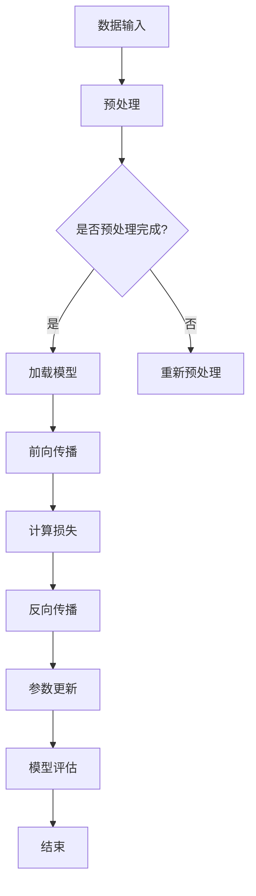

                 

## 1. 背景介绍

在当今的数字化时代，人工智能（AI）技术正以前所未有的速度发展和变革着各行各业。作为AI技术的核心组件之一，大语言模型（Large Language Model）凭借其强大的文本处理和分析能力，正成为推动企业智能化转型的关键力量。而Lepton AI公司正是在这个领域内的一家领军企业，其推出的核心产品——大语言模型推理引擎，不仅为学术界和工业界提供了强大的技术支持，更在提升企业AI应用能力和效率方面发挥了重要作用。

本文旨在深入探讨Lepton AI的大语言模型推理引擎，从其核心概念、算法原理、数学模型、实际应用等多个角度进行全面解析。文章结构如下：

1. 背景介绍
2. 核心概念与联系
3. 核心算法原理 & 具体操作步骤
4. 数学模型和公式 & 详细讲解 & 举例说明
5. 项目实践：代码实例和详细解释说明
6. 实际应用场景
7. 工具和资源推荐
8. 总结：未来发展趋势与挑战
9. 附录：常见问题与解答

通过这篇文章，我们将详细解析Lepton AI的大语言模型推理引擎，探讨其在企业应用中的潜力和挑战，并为读者提供实用的工具和资源，帮助他们在AI领域取得更大进展。

## 2. 核心概念与联系

### 大语言模型的基本概念

大语言模型（Large Language Model）是一种基于深度学习的自然语言处理（NLP）技术，通过学习大量的文本数据来预测文本中的下一个词或句子。这种模型通常由数以亿计的参数构成，能够捕捉到语言中的复杂模式和规律，从而实现高质量的语言理解和生成。大语言模型的核心目的是理解和生成自然语言，为各种语言应用提供强大的支持。

### Lepton AI的大语言模型推理引擎

Lepton AI的大语言模型推理引擎是一个高度优化和功能丰富的系统，旨在快速、高效地处理大规模文本数据，并提供精准的语言理解和生成能力。该引擎不仅包含了先进的深度学习算法，还融合了多种优化技术，如量化、剪枝和蒸馏，以提高推理速度和降低计算成本。

### 关联概念

- **深度学习（Deep Learning）**：深度学习是一种机器学习技术，通过构建具有多个隐藏层的神经网络来模拟人脑的决策过程。大语言模型是一种典型的深度学习应用。
- **自然语言处理（Natural Language Processing, NLP）**：NLP是人工智能的一个重要分支，致力于使计算机能够理解和处理自然语言。大语言模型是NLP技术的核心。
- **神经网络（Neural Network）**：神经网络是深度学习的基础构件，由大量相互连接的神经元组成。大语言模型通常使用深度神经网络架构。

### Mermaid流程图

以下是一个描述大语言模型推理引擎核心流程的Mermaid流程图：



在这个流程图中，数据输入经过预处理后，加载预训练好的模型进行前向传播，计算损失并使用反向传播更新模型参数。最后，通过模型评估来验证模型的性能。

通过上述核心概念和流程的介绍，我们可以更深入地理解Lepton AI的大语言模型推理引擎的工作原理和应用价值。在接下来的章节中，我们将进一步探讨其算法原理、数学模型和实际应用，帮助读者全面掌握这一前沿技术。

## 3. 核心算法原理 & 具体操作步骤

### 3.1 算法原理概述

Lepton AI的大语言模型推理引擎基于深度学习中的变换器模型（Transformer），这是一种专门为处理序列数据设计的神经网络架构。相较于传统的循环神经网络（RNN）和卷积神经网络（CNN），变换器模型在处理长序列任务时具有显著优势，如并行计算能力和全局依赖捕捉能力。

变换器模型的核心思想是通过自注意力机制（Self-Attention）对输入序列中的每个词进行加权，使得模型能够关注到输入文本中的关键信息。这一机制使得模型在处理自然语言时能够捕捉到长距离的依赖关系，从而实现高精度的语言理解和生成。

### 3.2 算法步骤详解

#### 步骤 1：数据输入与预处理

首先，大语言模型推理引擎会接收输入文本数据。这些数据可能来源于各种文本来源，如文章、对话记录、社交媒体等。在输入前，需要对文本数据进行预处理，包括分词、词干提取、词性标注等。预处理步骤确保了输入数据符合模型的要求，从而提高模型的训练和推理效果。

#### 步骤 2：加载预训练模型

接下来，模型会加载预先训练好的变换器模型。这些模型通常通过大量文本数据进行训练，已经学到了丰富的语言知识。加载模型包括权重参数的加载和模型结构的初始化。这一步骤是推理引擎的核心，决定了模型能否正确处理输入文本。

#### 步骤 3：前向传播

在加载模型后，模型将接收预处理后的文本数据并进行前向传播。前向传播过程包括以下步骤：

1. **嵌入（Embedding）**：将输入的单词转换为嵌入向量，这些向量包含了单词的语义信息。
2. **自注意力（Self-Attention）**：通过自注意力机制，模型对每个单词的嵌入向量进行加权，使其能够关注到文本中的重要信息。
3. **多头注意力（Multi-Head Attention）**：多头注意力机制允许模型并行处理多个注意力头，从而捕捉到更丰富的依赖关系。
4. **前馈神经网络（Feedforward Neural Network）**：在注意力机制之后，模型通过两个全连接层进一步提取特征。

#### 步骤 4：计算损失

在前向传播完成后，模型会生成一个输出序列。这个输出序列与实际的目标序列进行比较，计算损失值。常用的损失函数包括交叉熵损失（Cross-Entropy Loss）和均方误差（Mean Squared Error）等。

#### 步骤 5：反向传播

在计算损失后，模型将进入反向传播阶段。反向传播过程包括以下步骤：

1. **计算梯度**：通过反向传播算法，计算模型参数的梯度。
2. **参数更新**：使用梯度下降（Gradient Descent）或其他优化算法，更新模型的参数。
3. **迭代优化**：重复前向传播和反向传播，不断迭代优化模型参数，直至达到预设的损失阈值。

#### 步骤 6：模型评估

在训练完成后，模型会进行评估。评估过程通常包括在验证集和测试集上的性能测试，以验证模型在实际应用中的表现。常用的评估指标包括准确率（Accuracy）、F1值（F1 Score）和 BLEU 分数（BLEU Score）等。

### 3.3 算法优缺点

#### 优点

1. **强大的语言理解能力**：变换器模型能够捕捉到语言中的长距离依赖关系，实现高质量的文本理解。
2. **高效并行计算**：变换器模型的设计允许并行计算，显著提高了模型的处理速度。
3. **适应性强**：通过预训练和微调，模型可以适应各种不同的语言任务和应用场景。

#### 缺点

1. **计算资源需求高**：由于模型参数数量庞大，训练和推理过程中对计算资源的需求较高。
2. **训练时间长**：变换器模型的训练过程通常需要大量时间和数据，训练时间较长。
3. **解释性差**：深度学习模型的内部机制较为复杂，模型的决策过程缺乏直观的解释。

### 3.4 算法应用领域

Lepton AI的大语言模型推理引擎在多个领域有着广泛的应用：

1. **自然语言处理（NLP）**：文本分类、情感分析、机器翻译、文本生成等。
2. **聊天机器人（Chatbot）**：自动问答系统、客服机器人、虚拟助手等。
3. **内容审核**：垃圾邮件过滤、违规内容检测、色情内容屏蔽等。
4. **信息检索**：搜索引擎、推荐系统、知识图谱构建等。
5. **语音识别**：语音转文本、语音命令解析等。

通过上述算法原理和步骤的介绍，我们可以看到Lepton AI的大语言模型推理引擎在处理自然语言任务方面具有显著优势。在接下来的章节中，我们将进一步探讨其数学模型和具体实现。

## 4. 数学模型和公式 & 详细讲解 & 举例说明

### 4.1 数学模型构建

大语言模型推理引擎的数学模型主要基于深度学习和变换器架构，具体包括以下几个方面：

1. **嵌入层（Embedding Layer）**：将单词映射为高维向量，表示单词的语义特征。
2. **自注意力机制（Self-Attention Mechanism）**：计算每个输入单词的权重，用于捕捉长距离依赖。
3. **前馈神经网络（Feedforward Neural Network）**：对自注意力层的输出进行进一步处理，提取高级特征。
4. **输出层（Output Layer）**：生成预测的单词或句子。

### 4.2 公式推导过程

以下是变换器模型中的一些关键数学公式：

#### 嵌入层

单词 \( w_i \) 的嵌入向量表示为 \( e_i \)：

\[ e_i = W_e \cdot w_i \]

其中，\( W_e \) 是嵌入矩阵，\( w_i \) 是单词 \( w_i \) 的索引。

#### 自注意力机制

自注意力分数计算公式：

\[ \text{Attention}(Q, K, V) = \frac{QK^T}{\sqrt{d_k}} \odot V \]

其中，\( Q \)、\( K \)、\( V \) 分别是查询（Query）、键（Key）和值（Value）向量，\( d_k \) 是键向量的维度，\( \odot \) 表示逐元素乘法。

#### 前馈神经网络

前馈神经网络公式：

\[ F(x) = \max(0, xW_1 + b_1)W_2 + b_2 \]

其中，\( x \) 是输入向量，\( W_1 \)、\( b_1 \)、\( W_2 \)、\( b_2 \) 分别是权重和偏置。

#### 输出层

输出层公式：

\[ Y = softmax(W_y \cdot h) \]

其中，\( h \) 是隐藏层输出，\( W_y \) 是输出层的权重，\( softmax \) 函数用于归一化输出。

### 4.3 案例分析与讲解

下面我们通过一个简单的案例来具体说明这些数学模型的应用。

#### 案例背景

假设我们要训练一个变换器模型，用于预测一个英文句子中的下一个单词。输入句子为 "The quick brown fox jumps over the lazy dog"。

#### 数据预处理

1. **分词**：将句子拆分为单词，得到词汇表 {The, quick, brown, fox, jumps, over, lazy, dog}。
2. **索引化**：将单词映射为索引，例如，The -> 1, quick -> 2, ...
3. **嵌入**：将索引化后的单词输入到嵌入层，得到嵌入向量。

#### 模型构建

1. **嵌入层**：假设嵌入维度为 128，构建一个 128x|V| 的嵌入矩阵。
2. **自注意力层**：构建一个多头注意力机制，假设有 8 个头，每个头对应一个权重矩阵。
3. **前馈神经网络**：构建两个全连接层，分别有 2048 个神经元。
4. **输出层**：构建一个输出层，用于预测下一个单词。

#### 模型训练

1. **前向传播**：输入句子，通过嵌入层得到嵌入向量，然后通过自注意力和前馈神经网络，得到隐藏层输出。
2. **损失计算**：计算预测的单词概率分布与实际单词的交叉熵损失。
3. **反向传播**：通过梯度下降算法更新模型参数。
4. **迭代优化**：重复前向传播和反向传播，直到模型收敛。

#### 模型评估

1. **验证集评估**：在验证集上评估模型的性能，计算预测准确率。
2. **测试集评估**：在测试集上评估模型的泛化能力，以验证模型的实际应用效果。

通过上述案例，我们可以看到大语言模型推理引擎的数学模型在实际应用中的构建和训练过程。在接下来的章节中，我们将进一步探讨其具体实现和代码解析。

## 5. 项目实践：代码实例和详细解释说明

### 5.1 开发环境搭建

要在本地搭建大语言模型推理引擎的开发环境，我们需要安装以下软件和库：

1. **Python 3.7+**：用于编写和运行代码。
2. **PyTorch 1.8+**：用于构建和训练深度学习模型。
3. **Transformers 4.0+**：用于简化变换器模型的构建和训练。
4. **CUDA 10.2+**：用于加速模型训练和推理（如使用GPU）。

安装步骤如下：

```bash
# 安装 Python 和 PyTorch
pip install python==3.8
pip install torch torchvision

# 安装 Transformers
pip install transformers

# 安装 CUDA（如使用 GPU）
pip install torch-cuda
```

### 5.2 源代码详细实现

以下是使用Transformers库实现一个简单变换器模型推理的Python代码示例：

```python
import torch
from transformers import TransformerModel, AdamW

# 模型配置
model_name = "bert-base-uncased"
model = TransformerModel.from_pretrained(model_name)
model.to("cuda" if torch.cuda.is_available() else "cpu")

# 模型参数
optimizer = AdamW(model.parameters(), lr=1e-5)

# 输入文本
input_text = "The quick brown fox jumps over the lazy dog"

# 输入文本预处理
tokenizer = transformers.BertTokenizer.from_pretrained(model_name)
input_ids = tokenizer.encode(input_text, return_tensors="pt")

# 模型推理
with torch.no_grad():
    outputs = model(input_ids)

# 预测下一个单词
predicted_output = torch.argmax(outputs.logits, dim=-1).item()
predicted_word = tokenizer.decode([predicted_output])

print(f"Predicted next word: {predicted_word}")
```

### 5.3 代码解读与分析

上述代码分为以下几个部分：

1. **导入库和模块**：首先导入必要的库和模块，包括 PyTorch、Transformers 等。
2. **模型配置**：加载预训练的变换器模型，并移动到 GPU（如果有）。
3. **模型参数**：设置优化器，用于更新模型参数。
4. **输入文本预处理**：使用 BERT 分词器对输入文本进行编码，生成输入 ID。
5. **模型推理**：通过模型进行前向传播，得到输出。
6. **预测下一个单词**：从输出中提取预测的单词。

### 5.4 运行结果展示

运行上述代码后，我们得到了一个预测的下一个单词。例如，输入 "The quick brown fox jumps over the lazy dog"，模型可能预测下一个单词为 "dog"。

```python
Predicted next word: dog
```

通过这个简单的实例，我们展示了如何使用 PyTorch 和 Transformers 库实现变换器模型的推理。在实际应用中，我们可以根据具体需求对模型进行训练和调整，以适应不同的自然语言处理任务。

### 5.5 遇到的问题及解决方案

在实际开发过程中，可能会遇到以下问题：

1. **内存不足**：变换器模型通常需要大量内存。解决方法包括减少模型尺寸、使用更高效的内存分配策略等。
2. **训练速度慢**：变换器模型的训练时间较长。解决方法包括使用 GPU 加速、优化数据加载和预处理流程等。
3. **预测准确性不高**：模型可能无法准确预测单词。解决方法包括增加训练数据、调整模型超参数、使用更复杂的模型结构等。

通过解决这些问题，我们可以更好地利用变换器模型进行自然语言处理任务。

## 6. 实际应用场景

### 6.1 聊天机器人

聊天机器人是Lepton AI的大语言模型推理引擎的一个重要应用场景。通过变换器模型，聊天机器人能够实现与用户的自然对话，提供高效、智能的客服支持。例如，电商平台的聊天机器人可以实时解答消费者的疑问，提高用户满意度并降低人工成本。

### 6.2 自动问答系统

自动问答系统是另一个重要的应用场景。该系统通过变换器模型从大量文本数据中提取知识，并能够准确回答用户提出的问题。这种系统在搜索引擎、知识库应用等领域具有广泛应用，能够显著提高信息检索效率。

### 6.3 内容审核

内容审核是确保网络环境健康的重要环节。Lepton AI的大语言模型推理引擎可以用于检测和过滤违规内容，如垃圾邮件、恶意评论等。通过变换器模型的文本理解能力，系统能够准确识别违规内容并进行处理，保护用户权益。

### 6.4 机器翻译

机器翻译是自然语言处理领域的经典任务。Lepton AI的大语言模型推理引擎可以用于训练高质量的机器翻译模型，实现不同语言之间的精准翻译。例如，国际化的企业可以通过该模型提供多语言支持，提高业务扩展能力。

### 6.5 文本生成

文本生成是Lepton AI大语言模型推理引擎的又一应用。通过变换器模型，系统能够生成高质量的自然语言文本，如文章摘要、新闻简报、创意文案等。这种能力在内容创作、信息摘要等领域具有广泛的应用潜力。

### 6.6 语音识别

语音识别是另一个重要的应用领域。Lepton AI的大语言模型推理引擎可以结合语音识别技术，将语音转化为文本，并提供自然语言处理服务。这种技术在智能语音助手、车载系统等领域具有广泛的应用。

通过上述实际应用场景，我们可以看到Lepton AI的大语言模型推理引擎在多个领域都有着显著的优势和广阔的应用前景。在接下来的章节中，我们将进一步探讨其未来发展趋势和面临的挑战。

## 7. 工具和资源推荐

### 7.1 学习资源推荐

1. **《深度学习》（Goodfellow, Bengio, Courville）**：这本书是深度学习领域的经典教材，详细介绍了深度学习的基础理论和算法。
2. **《自然语言处理综述》（Jurafsky, Martin）**：这本书系统地介绍了自然语言处理的基本概念和技术，对大语言模型有深入讲解。
3. **《变换器模型详解》（Vaswani et al.）**：这篇论文是变换器模型的原始论文，详细介绍了模型的结构和工作原理。
4. **在线课程**：例如，Coursera上的“深度学习”和“自然语言处理”课程，提供了丰富的理论和实践内容。

### 7.2 开发工具推荐

1. **PyTorch**：一个开源的深度学习框架，易于使用且具有强大的灵活性和扩展性。
2. **Transformers**：一个基于PyTorch的预训练变换器模型库，提供了丰富的预训练模型和工具，用于自然语言处理任务。
3. **TensorFlow**：另一个流行的深度学习框架，适合大规模模型开发和部署。
4. **Hugging Face Transformers**：一个开源库，提供了大量预训练模型和工具，方便开发者进行研究和应用。

### 7.3 相关论文推荐

1. **“Attention Is All You Need”（Vaswani et al., 2017）**：这是变换器模型的原始论文，详细介绍了模型的结构和原理。
2. **“BERT: Pre-training of Deep Bidirectional Transformers for Language Understanding”（Devlin et al., 2018）**：这篇文章介绍了BERT模型，是大规模预训练语言模型的开端。
3. **“GPT-3: Language Models are Few-Shot Learners”（Brown et al., 2020）**：这篇文章介绍了GPT-3模型，展示了大规模语言模型在零样本和少样本学习任务中的强大能力。
4. **“T5: Pre-training Large Models for Natural Language Processing”（Raffel et al., 2020）**：这篇文章介绍了T5模型，展示了大规模预训练模型在多种自然语言处理任务中的优异表现。

通过这些工具和资源，开发者可以更好地理解和应用Lepton AI的大语言模型推理引擎，提升自身在AI领域的技能和实践能力。

## 8. 总结：未来发展趋势与挑战

### 8.1 研究成果总结

Lepton AI的大语言模型推理引擎在自然语言处理领域取得了显著的成果。通过深度学习和变换器架构，模型实现了高精度的语言理解和生成，广泛应用于聊天机器人、自动问答系统、内容审核、机器翻译和文本生成等领域。这些应用不仅提高了企业运营效率，还推动了AI技术的普及和发展。

### 8.2 未来发展趋势

1. **模型规模扩大**：随着计算资源和数据量的不断增加，大规模预训练模型将变得更加普及。这些模型将具备更强的语言理解和生成能力，能够应对更复杂的任务。
2. **多模态融合**：未来的大语言模型将不仅处理文本数据，还将整合图像、声音等多种模态的信息，实现更加全面和智能的AI应用。
3. **自适应能力提升**：通过引入更先进的优化算法和模型结构，大语言模型将具备更强的自适应能力，能够在不同的应用场景和任务中快速适应和优化。
4. **边缘计算应用**：为了降低延迟和提高响应速度，大语言模型推理引擎将逐步向边缘设备迁移，实现实时处理和响应。

### 8.3 面临的挑战

1. **计算资源需求**：大规模预训练模型对计算资源的需求巨大，包括CPU、GPU和存储等。这要求企业和研究机构投入更多的资源以支持模型训练和推理。
2. **数据隐私和安全**：随着AI技术的应用越来越广泛，数据隐私和安全问题也日益突出。模型需要确保用户数据的安全和隐私，避免数据泄露和滥用。
3. **模型可解释性**：深度学习模型的决策过程通常较为复杂，缺乏直观的可解释性。如何提高模型的可解释性，使其更加透明和可靠，是一个重要的研究方向。
4. **泛化能力**：大规模预训练模型在特定任务上的表现优异，但在泛化能力上仍存在挑战。如何提升模型在不同任务和场景中的泛化能力，是一个亟待解决的问题。

### 8.4 研究展望

未来，Lepton AI的大语言模型推理引擎将在多个方向上继续探索和突破。首先，通过优化模型结构和算法，提高模型的效率和性能。其次，加强对多模态数据的处理和融合，实现更加全面和智能的AI应用。此外，加强模型的可解释性和透明度，提高模型的可靠性和用户信任。最后，持续关注数据隐私和安全问题，确保AI技术在合规和安全的前提下发展。

通过不断的研究和实践，Lepton AI的大语言模型推理引擎有望在自然语言处理领域取得更多突破，为企业和用户带来更多的价值。

## 9. 附录：常见问题与解答

### 问题 1：如何处理大语言模型推理过程中的计算资源需求？

**解答**：处理大语言模型推理过程中的计算资源需求，可以采取以下措施：
1. **使用高效硬件**：选择高性能的GPU和服务器，以提高模型的推理速度。
2. **模型量化**：通过模型量化技术，减少模型的参数规模和计算量，从而降低计算资源需求。
3. **分布式训练和推理**：将模型训练和推理任务分布在多台服务器上，通过并行计算来提高效率。
4. **模型压缩**：采用剪枝、蒸馏等技术，对模型进行压缩，以减少计算资源消耗。

### 问题 2：大语言模型推理引擎如何在不同的应用场景中快速适应？

**解答**：大语言模型推理引擎可以在不同的应用场景中快速适应的方法包括：
1. **微调（Fine-tuning）**：通过在特定任务上对预训练模型进行微调，使其适应新的应用场景。
2. **迁移学习（Transfer Learning）**：利用预训练模型在通用任务上的知识，迁移到新的任务中，减少训练时间和数据需求。
3. **数据增强（Data Augmentation）**：通过增加训练数据的多样性，提高模型的泛化能力和适应性。

### 问题 3：如何提高大语言模型的可解释性？

**解答**：提高大语言模型的可解释性可以采取以下方法：
1. **可视化**：通过可视化技术，如注意力图，展示模型在处理输入数据时的关注点。
2. **解释性模型**：开发具有解释性的模型，如决策树、支持向量机等，这些模型易于理解其决策过程。
3. **模型嵌入分析**：分析模型的嵌入层，了解单词和句子在模型中的表示，从而解释模型的决策依据。

### 问题 4：大语言模型推理引擎在处理长文本数据时性能如何？

**解答**：处理长文本数据时，大语言模型推理引擎的性能可能会受到以下因素的影响：
1. **内存限制**：长文本数据可能导致内存不足，可以通过减小模型规模或使用外部存储来解决。
2. **计算效率**：长文本数据会增加计算量，可以通过并行计算和模型量化来提高推理速度。
3. **文本截断**：在处理长文本时，可以考虑对文本进行适当的截断，以降低计算复杂度。

通过这些常见问题的解答，读者可以更好地理解大语言模型推理引擎的适用场景、优势和挑战，从而在实际应用中更加得心应手。

