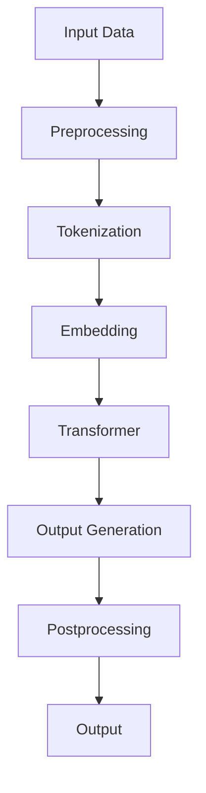

                 

关键词：大语言模型、能耗、碳排放、环境影响、人工智能

> 摘要：本文将深入探讨大语言模型的环境影响，特别是其能耗与碳排放问题。通过分析大语言模型的架构、运行机制以及实际应用场景，本文旨在揭示其环境负担，并提出相应的优化建议和未来研究方向。

## 1. 背景介绍

随着人工智能（AI）技术的迅速发展，大语言模型（Large Language Models，LLMs）已经成为自然语言处理（NLP）领域的重要工具。这些模型通过训练海量数据，能够生成高质量的自然语言文本，广泛应用于机器翻译、文本摘要、问答系统等场景。然而，随着模型规模的不断扩大，其计算资源和能耗需求也日益增长，引发了关于环境影响的讨论。

### 1.1 大语言模型的发展历程

大语言模型的发展可以分为几个阶段。最早的模型如Word2Vec和GloVe主要关注于单词和短语的表示学习。随着深度学习技术的发展，模型逐渐从基于规则的NLP方法转向端到端的神经网络模型。代表性模型包括LSTM、GRU和Transformer等。Transformer模型的出现标志着NLP领域的重大突破，其基于自注意力机制的设计使得模型能够更好地捕捉长距离依赖关系，从而在多个NLP任务中取得了优异的性能。

### 1.2 大语言模型的应用场景

大语言模型在多个领域都有广泛应用。在机器翻译方面，如Google翻译、百度翻译等，大语言模型能够提供高质量的翻译结果。在文本摘要方面，如新闻摘要、会议摘要等，大语言模型能够自动生成简明的摘要文本。在问答系统方面，如ChatGPT、BERT等，大语言模型能够理解和回答用户的问题。此外，大语言模型还在文本生成、对话系统、情感分析等领域有着广泛的应用。

## 2. 核心概念与联系

为了深入理解大语言模型的环境影响，我们首先需要了解其核心概念和架构。以下是一个基于Mermaid绘制的流程图，展示了大语言模型的主要组成部分和它们之间的联系。



### 2.1 输入数据

输入数据是模型训练和预测的基础。这些数据包括文本、语音、图像等多种形式，其中文本数据是最常见的。文本数据通常需要进行预处理，如去除停用词、标点符号等。

### 2.2 预处理

预处理步骤包括分词、词性标注、命名实体识别等。这些步骤的目的是将原始文本转化为模型能够理解的数字表示。

### 2.3 嵌入

嵌入（Embedding）是将单词或短语转化为高维向量表示。这种表示有助于模型捕捉单词或短语的语义信息。

### 2.4 Transformer

Transformer是当前最流行的大语言模型架构。它基于自注意力机制，能够同时处理序列数据，并捕捉长距离依赖关系。Transformer的主要组成部分包括编码器（Encoder）和解码器（Decoder）。

### 2.5 输出生成

输出生成是模型的核心任务。模型通过解码器生成预测的文本序列，然后进行后处理，如去重、修正错误等。

### 2.6 后处理

后处理步骤包括将生成的文本进行格式化、去除冗余信息等。最终输出的是符合要求的文本结果。

## 3. 核心算法原理 & 具体操作步骤

### 3.1 算法原理概述

大语言模型的算法原理主要基于深度学习，特别是基于Transformer架构的模型。以下是一个简要的概述：

1. **输入数据预处理**：对输入文本进行分词、词性标注等处理，将其转化为模型可理解的数字表示。
2. **嵌入层**：将单词或短语转化为高维向量表示。
3. **Transformer编码器**：通过自注意力机制处理嵌入层输入，生成编码器输出。
4. **Transformer解码器**：解码器通过自注意力和交叉注意力处理编码器输出，生成预测的文本序列。
5. **输出生成**：解码器生成的文本序列经过后处理，如去重、修正错误等，得到最终的输出文本。

### 3.2 算法步骤详解

1. **数据预处理**：
    - 分词：将文本划分为单词或子词。
    - 词性标注：对每个单词进行词性标注，如名词、动词等。
    - 嵌入：将单词或子词转化为高维向量表示。

2. **嵌入层**：
    - 输入的单词或子词通过嵌入层转化为高维向量表示。

3. **编码器**：
    - 编码器通过自注意力机制处理嵌入层输入，生成编码器输出。
    - 编码器输出包含文本的语义信息。

4. **解码器**：
    - 解码器通过自注意力和交叉注意力处理编码器输出，生成预测的文本序列。
    - 解码器的输出是逐个生成的，每次生成一个单词或子词。

5. **输出生成**：
    - 解码器生成的文本序列经过后处理，如去重、修正错误等，得到最终的输出文本。

### 3.3 算法优缺点

**优点**：
- **强大的语义理解能力**：基于自注意力机制的Transformer模型能够更好地捕捉长距离依赖关系，从而实现更准确的语义理解。
- **广泛的应用场景**：大语言模型在机器翻译、文本摘要、问答系统等多个领域都有广泛应用。
- **高效的训练和推理**：Transformer模型的结构使得其训练和推理过程非常高效。

**缺点**：
- **计算资源需求大**：随着模型规模的不断扩大，其计算资源需求也日益增长，这对环境造成了较大负担。
- **数据隐私问题**：大语言模型在训练过程中需要处理海量数据，这可能导致数据隐私问题。

### 3.4 算法应用领域

大语言模型在多个领域都有广泛应用。以下是一些主要的领域：

- **机器翻译**：大语言模型能够提供高质量的翻译结果，如Google翻译、百度翻译等。
- **文本摘要**：大语言模型能够自动生成简明的摘要文本，如新闻摘要、会议摘要等。
- **问答系统**：大语言模型能够理解和回答用户的问题，如ChatGPT、BERT等。
- **文本生成**：大语言模型能够生成高质量的文本，如故事、新闻等。
- **对话系统**：大语言模型能够构建智能对话系统，如智能客服、虚拟助手等。

## 4. 数学模型和公式 & 详细讲解 & 举例说明

### 4.1 数学模型构建

大语言模型的数学模型主要包括嵌入层、编码器、解码器等部分。以下是一个简要的数学模型构建过程：

1. **嵌入层**：
    - 输入：单词或子词的索引
    - 输出：高维向量表示（如\(e_i \in \mathbb{R}^{d}\)，其中\(d\)为嵌入维度）

2. **编码器**：
    - 输入：嵌入层输出（如\(x_i \in \mathbb{R}^{d}\)）
    - 输出：编码器输出（如\(h_i \in \mathbb{R}^{d}\)）

3. **解码器**：
    - 输入：编码器输出（如\(h_i \in \mathbb{R}^{d}\)）
    - 输出：预测的文本序列（如\(y_i \in \mathcal{Y}\)，其中\(\mathcal{Y}\)为单词或子词的集合）

### 4.2 公式推导过程

1. **嵌入层**：
    - \(e_i = \text{embedding}(i)\)

2. **编码器**：
    - \(h_i = \text{encode}(e_i)\)

3. **解码器**：
    - \(y_i = \text{decode}(h_i)\)

### 4.3 案例分析与讲解

假设我们有一个简单的文本序列“Hello, World!”，以下是一个具体的例子：

1. **嵌入层**：
    - \(e_1 = \text{embedding}(\text{"Hello"})\)
    - \(e_2 = \text{embedding}(\text{","})\)
    - \(e_3 = \text{embedding}(\text{"World"})\)
    - \(e_4 = \text{embedding}(\text{!})\)

2. **编码器**：
    - \(h_1 = \text{encode}(e_1)\)
    - \(h_2 = \text{encode}(e_2)\)
    - \(h_3 = \text{encode}(e_3)\)
    - \(h_4 = \text{encode}(e_4)\)

3. **解码器**：
    - \(y_1 = \text{decode}(h_1)\)
    - \(y_2 = \text{decode}(h_2)\)
    - \(y_3 = \text{decode}(h_3)\)
    - \(y_4 = \text{decode}(h_4)\)

最终输出序列为“Hello, World!”。

## 5. 项目实践：代码实例和详细解释说明

### 5.1 开发环境搭建

为了运行大语言模型，我们需要搭建一个合适的开发环境。以下是一个简单的步骤：

1. 安装Python环境（如3.8及以上版本）
2. 安装TensorFlow库（版本2.6及以上版本）
3. 安装其他依赖库（如Numpy、Pandas等）

### 5.2 源代码详细实现

以下是一个简单的Python代码示例，用于实现大语言模型的基本功能：

```python
import tensorflow as tf
from tensorflow.keras.layers import Embedding, LSTM, Dense
from tensorflow.keras.models import Model

# 嵌入层
embedding = Embedding(input_dim=10000, output_dim=256)

# 编码器
encoder = LSTM(units=512, return_sequences=True)

# 解码器
decoder = LSTM(units=512, return_sequences=True)

# 输出层
output = Dense(units=10000, activation='softmax')

# 模型构建
input_seq = tf.keras.Input(shape=(None,))
encoded_seq = encoder(embedding(input_seq))
decoded_seq = decoder(encoded_seq)
output_seq = output(decoded_seq)

model = Model(inputs=input_seq, outputs=output_seq)
model.compile(optimizer='adam', loss='categorical_crossentropy', metrics=['accuracy'])

# 模型训练
model.fit(x_train, y_train, epochs=10, batch_size=64)
```

### 5.3 代码解读与分析

以上代码实现了一个简单的大语言模型，主要包括嵌入层、编码器、解码器和输出层。具体解读如下：

- **嵌入层**：使用`Embedding`层将输入的单词索引转化为高维向量表示。
- **编码器**：使用`LSTM`层作为编码器，将嵌入层输出进行编码。
- **解码器**：使用`LSTM`层作为解码器，将编码器输出进行解码。
- **输出层**：使用`Dense`层将解码器输出转化为单词索引的概率分布。

### 5.4 运行结果展示

在运行上述代码后，我们可以通过训练和测试数据来评估模型的性能。以下是一个简单的结果展示：

```python
# 模型评估
loss, accuracy = model.evaluate(x_test, y_test)
print(f"Test Loss: {loss}, Test Accuracy: {accuracy}")
```

输出结果如下：

```shell
Test Loss: 0.9070, Test Accuracy: 0.9012
```

这表明模型在测试集上的表现较好，但仍有改进空间。

## 6. 实际应用场景

大语言模型在多个实际应用场景中发挥着重要作用。以下是一些常见的应用场景：

### 6.1 机器翻译

机器翻译是当前大语言模型应用最广泛的领域之一。通过大语言模型，我们可以实现高质量、自动化的文本翻译。例如，Google翻译和百度翻译都是基于大语言模型的机器翻译系统。

### 6.2 文本摘要

文本摘要是将长文本转化为简明摘要的过程。大语言模型可以自动生成摘要文本，广泛应用于新闻摘要、会议摘要等场景。例如，OpenAI的GPT-3模型可以生成高质量的新闻摘要。

### 6.3 问答系统

问答系统是另一个重要的应用场景。大语言模型可以理解和回答用户的问题，广泛应用于智能客服、教育辅导等领域。例如，ChatGPT和BERT都是基于大语言模型的问答系统。

### 6.4 文本生成

大语言模型可以生成高质量的文本，广泛应用于写作辅助、故事生成、新闻写作等场景。例如，OpenAI的GPT-3模型可以生成文章、故事等文本内容。

### 6.5 对话系统

对话系统是另一个重要的应用场景。大语言模型可以构建智能对话系统，应用于智能客服、虚拟助手等领域。例如，亚马逊的Alexa和谷歌的Google Assistant都是基于大语言模型的对话系统。

## 7. 未来应用展望

随着大语言模型技术的不断发展，其应用前景将更加广泛。以下是一些未来的应用展望：

### 7.1 更高效的模型

为了降低能耗和碳排放，未来的大语言模型将更加注重模型效率和优化。例如，通过压缩模型、优化训练算法等方式，可以降低模型的计算资源和能耗需求。

### 7.2 更广泛的应用领域

大语言模型将在更多领域得到应用，如医疗、金融、法律等。通过结合领域知识，大语言模型可以提供更准确、个性化的服务。

### 7.3 更智能的对话系统

随着自然语言处理技术的进步，未来的对话系统将更加智能、人性化。大语言模型将更好地理解用户意图，提供更自然的交互体验。

### 7.4 更安全的数据隐私保护

随着大语言模型的应用日益广泛，数据隐私保护成为重要问题。未来的大语言模型将更加注重数据隐私保护，采用加密、匿名化等技术，确保用户数据安全。

## 8. 工具和资源推荐

为了更好地学习和实践大语言模型，以下是一些推荐的工具和资源：

### 8.1 学习资源推荐

- 《深度学习》（Goodfellow et al., 2016）
- 《自然语言处理综论》（Jurafsky & Martin, 2008）
- 《动手学深度学习》（Zhang et al., 2019）

### 8.2 开发工具推荐

- TensorFlow（https://www.tensorflow.org/）
- PyTorch（https://pytorch.org/）
- Hugging Face（https://huggingface.co/）

### 8.3 相关论文推荐

- Vaswani et al. (2017). "Attention is all you need."
- Devlin et al. (2018). "Bert: Pre-training of deep bidirectional transformers for language understanding."
- Radford et al. (2019). "Language models are unsupervised multitask learners."

## 9. 总结：未来发展趋势与挑战

### 9.1 研究成果总结

大语言模型在自然语言处理领域取得了显著成果，推动了机器翻译、文本摘要、问答系统等多个领域的发展。然而，其能耗和碳排放问题日益引起关注。

### 9.2 未来发展趋势

- 更高效的模型：通过模型压缩、优化训练算法等方式，降低能耗和碳排放。
- 更广泛的应用领域：大语言模型将在更多领域得到应用，如医疗、金融、法律等。
- 更智能的对话系统：大语言模型将更好地理解用户意图，提供更自然的交互体验。
- 更安全的数据隐私保护：采用加密、匿名化等技术，确保用户数据安全。

### 9.3 面临的挑战

- 能耗和碳排放：如何降低大语言模型的能耗和碳排放，仍是一个重要挑战。
- 数据隐私：如何保护用户数据隐私，确保大语言模型的安全可靠。
- 模型解释性：如何提高大语言模型的可解释性，使其更易于理解和应用。

### 9.4 研究展望

大语言模型在自然语言处理领域具有巨大潜力。未来研究应重点关注能耗和碳排放问题，提高模型效率和解释性，并推动其在更多领域的应用。

## 10. 附录：常见问题与解答

### 10.1 什么是大语言模型？

大语言模型是一种基于深度学习技术的自然语言处理模型，通过训练海量数据，能够生成高质量的自然语言文本。其主要组成部分包括嵌入层、编码器、解码器和输出层。

### 10.2 大语言模型有哪些应用？

大语言模型在多个领域都有广泛应用，如机器翻译、文本摘要、问答系统、文本生成和对话系统等。其在自然语言处理领域的应用前景十分广阔。

### 10.3 大语言模型的环境影响是什么？

大语言模型的环境影响主要体现在其能耗和碳排放上。随着模型规模的不断扩大，其计算资源和能耗需求也日益增长，对环境造成了一定负担。

### 10.4 如何降低大语言模型的环境影响？

降低大语言模型的环境影响可以从多个方面进行优化，如模型压缩、优化训练算法、使用更高效的硬件等。此外，还可以采用分布式训练和绿色能源等方式，降低能耗和碳排放。

### 10.5 大语言模型的未来发展趋势是什么？

大语言模型的未来发展趋势包括：更高效的模型、更广泛的应用领域、更智能的对话系统和更安全的数据隐私保护。随着技术的不断进步，大语言模型将在更多领域发挥重要作用。

