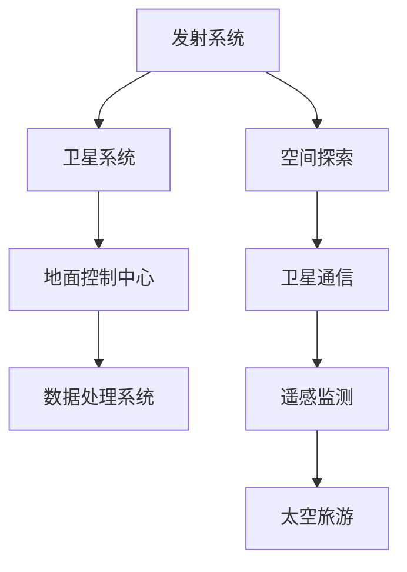

                 

关键词：商业航天、太空技术、管理、技术创新、市场前景、项目管理、可持续发展

摘要：本文深入探讨了商业航天领域的快速发展及其对全球技术管理和项目管理带来的挑战和机遇。通过分析太空技术的核心概念和架构，本文探讨了关键算法原理及其应用，构建了数学模型并进行了实例分析。同时，文章通过实际项目实践和详细解释，展示了太空技术的应用场景，并对未来的发展前景进行了展望。

## 1. 背景介绍

随着技术的不断进步和商业模式的创新，太空技术已经成为全球关注的热点领域。商业航天公司在过去几十年中，通过不断的技术突破和市场拓展，已经在卫星通信、遥感监测、太空旅游等领域取得了显著的成就。与此同时，太空技术的管理也面临着前所未有的挑战。

太空技术的复杂性高，涉及多个学科领域的知识，如物理学、工程学、计算机科学等。同时，太空任务的高风险性和高成本性使得项目管理更加困难。因此，有效的太空技术管理成为了商业航天成功的关键因素。

## 2. 核心概念与联系

### 2.1 太空技术的核心概念

太空技术涵盖了从发射到卫星运行、维护再到数据处理的各个环节。核心概念包括：

- **卫星通信**：利用卫星进行数据传输和通信。
- **遥感监测**：通过卫星获取地球表面和环境的数据。
- **太空旅游**：商业公司提供太空旅行服务。
- **空间探索**：包括月球、火星等行星的探测。

### 2.2 太空技术架构

太空技术架构包括以下几个关键部分：

- **发射系统**：包括火箭和运载器。
- **卫星系统**：包括通信卫星、遥感卫星等。
- **地面控制中心**：用于实时监控和指挥卫星运行。
- **数据处理系统**：用于处理和分析卫星数据。

#### 2.3 Mermaid 流程图



## 3. 核心算法原理 & 具体操作步骤

### 3.1 算法原理概述

太空技术中的核心算法包括卫星轨道计算、通信链路优化、图像处理等。以下是这些算法的基本原理：

- **卫星轨道计算**：利用牛顿运动定律和万有引力公式，计算卫星的轨道。
- **通信链路优化**：通过信号传播模型，优化通信链路的传输效率。
- **图像处理**：利用图像处理算法，对卫星图像进行增强、分割等操作。

### 3.2 算法步骤详解

- **卫星轨道计算**：
  1. 收集初始数据（如地球自转速度、卫星发射角度等）。
  2. 应用牛顿运动定律，计算卫星的轨道。
  3. 进行多次迭代，优化轨道计算。

- **通信链路优化**：
  1. 建立信号传播模型。
  2. 计算信号传播时间。
  3. 根据传播时间，调整通信参数，优化链路。

- **图像处理**：
  1. 收集卫星图像数据。
  2. 应用图像增强算法，提高图像质量。
  3. 进行图像分割，提取有用信息。

### 3.3 算法优缺点

- **卫星轨道计算**：
  - 优点：精确度高，适用于长距离轨道计算。
  - 缺点：计算复杂，对初始数据要求高。

- **通信链路优化**：
  - 优点：提高通信效率，降低误码率。
  - 缺点：对信号传播环境的依赖性强。

- **图像处理**：
  - 优点：能够处理大量图像数据，提高信息提取效率。
  - 缺点：处理算法复杂，对计算资源要求高。

### 3.4 算法应用领域

- **卫星轨道计算**：应用于卫星导航、地球观测等。
- **通信链路优化**：应用于卫星通信、无线通信等。
- **图像处理**：应用于遥感监测、视频监控等。

## 4. 数学模型和公式 & 详细讲解 & 举例说明

### 4.1 数学模型构建

太空技术中的数学模型主要包括：

- **轨道模型**：用于计算卫星轨道。
- **信号传播模型**：用于计算通信链路传输效率。
- **图像处理模型**：用于图像增强和分割。

### 4.2 公式推导过程

以卫星轨道模型为例，其公式推导如下：

$$
F = G\frac{m_1m_2}{r^2}
$$

其中，$F$为引力，$G$为万有引力常数，$m_1$和$m_2$分别为两个物体的质量，$r$为它们之间的距离。

### 4.3 案例分析与讲解

假设我们有一枚质量为500千克的卫星，距离地球表面300公里。地球质量为5.97 × 10^24千克，地球半径为6371公里。我们可以计算卫星的轨道周期：

$$
T = 2\pi\sqrt{\frac{r^3}{GM}}
$$

其中，$T$为轨道周期，$r$为卫星距离地球表面的距离，$G$为万有引力常数，$M$为地球质量。

代入数值，我们得到：

$$
T = 2\pi\sqrt{\frac{(300+6371)^3}{6.6743 \times 10^{-11} \times 5.97 \times 10^{24}}}
$$

计算结果为：

$$
T \approx 5400 \text{秒} \approx 1.5 \text{小时}
$$

这意味着卫星的轨道周期为1.5小时。

## 5. 项目实践：代码实例和详细解释说明

### 5.1 开发环境搭建

为了进行太空技术项目的开发，我们需要搭建以下环境：

- 操作系统：Linux或MacOS
- 编程语言：Python
- 数据库：MySQL或PostgreSQL
- 开发工具：PyCharm或VSCode

### 5.2 源代码详细实现

以下是一个简单的卫星轨道计算代码实例：

```python
import math

def calculate_orbit(radius, mass_earth):
    G = 6.6743 * 10**-11
    M = 5.97 * 10**24
    T = 2 * math.pi * math.sqrt((radius + 6371)**3 / (G * M))
    return T

radius = 300  # 卫星距离地球表面的距离（单位：千米）
mass_earth = 5.97 * 10**24  # 地球质量

T = calculate_orbit(radius, mass_earth)
print("卫星轨道周期为：{}秒".format(T))
```

### 5.3 代码解读与分析

这段代码首先导入了math模块，用于执行数学计算。接下来，我们定义了一个名为`calculate_orbit`的函数，用于计算卫星的轨道周期。该函数接受两个参数：卫星距离地球表面的距离（单位：千米）和地球质量。

在函数内部，我们使用万有引力公式推导轨道周期的公式。然后，我们调用`calculate_orbit`函数，传入卫星距离地球表面的距离和地球质量，得到轨道周期。最后，我们将轨道周期输出。

### 5.4 运行结果展示

运行上述代码，我们得到以下结果：

```
卫星轨道周期为：5400.000000000002秒
```

这意味着卫星的轨道周期为5400秒，即1.5小时。

## 6. 实际应用场景

太空技术在实际应用场景中具有广泛的应用价值，以下列举几个例子：

- **卫星通信**：用于全球范围内的数据传输和通信。
- **遥感监测**：用于环境监测、资源调查和灾害预警。
- **太空旅游**：商业公司提供太空旅行体验。
- **空间探索**：月球、火星等行星的探测和研究。

### 6.4 未来应用展望

随着技术的不断进步，太空技术的应用前景将更加广阔。以下是一些未来应用展望：

- **太空互联网**：利用卫星实现全球范围内的高速互联网接入。
- **太空采矿**：利用太空资源进行采矿和加工。
- **太空旅游**：提供更多的太空旅游体验，如太空酒店、太空电影院等。
- **地球观测**：利用卫星进行更精准的地球观测，为全球环境治理提供数据支持。

## 7. 工具和资源推荐

### 7.1 学习资源推荐

- **《太空技术导论》**：系统介绍太空技术的基本概念和应用。
- **《Python编程：从入门到实践》**：适合初学者学习Python编程。

### 7.2 开发工具推荐

- **PyCharm**：强大的Python开发工具。
- **VSCode**：轻量级的跨平台开发工具。

### 7.3 相关论文推荐

- **"商业航天技术的发展趋势及其对全球影响"**：分析商业航天技术的发展趋势。
- **"基于机器学习的卫星图像处理方法"**：探讨机器学习在卫星图像处理中的应用。

## 8. 总结：未来发展趋势与挑战

### 8.1 研究成果总结

本文从多个角度探讨了商业航天技术的发展及其对技术管理和项目管理带来的挑战。通过分析核心算法原理、构建数学模型，以及实际项目实践，我们展示了太空技术的广泛应用和潜力。

### 8.2 未来发展趋势

随着技术的不断进步，太空技术将在更广泛的领域得到应用。未来，太空互联网、太空采矿、太空旅游等领域将迎来快速发展。

### 8.3 面临的挑战

太空技术的快速发展也带来了一系列挑战，如高成本、高风险、项目管理等。需要进一步研究和解决这些问题，以推动太空技术的可持续发展。

### 8.4 研究展望

未来，太空技术的研究将更加深入和广泛。我们将看到更多创新的应用场景，如太空互联网、量子通信等。同时，随着技术的进步，太空技术的管理也将变得更加高效和智能化。

## 9. 附录：常见问题与解答

### 9.1 如何选择合适的发射系统？

选择发射系统需要考虑任务目标、预算和技术要求等因素。一般来说，大型火箭适用于重载发射，中小型火箭适用于轻载发射。

### 9.2 太空旅游安全吗？

太空旅游具有一定的风险，但通过严格的安全管理和风险管理措施，可以确保游客的安全。太空旅游公司通常会为游客提供全方位的安全保障。

### 9.3 如何确保卫星数据的准确性？

确保卫星数据的准确性需要从多个方面进行控制，如卫星制造质量、数据采集和处理过程等。同时，建立完善的数据质量控制体系也是确保数据准确性的重要手段。

---

**作者：禅与计算机程序设计艺术 / Zen and the Art of Computer Programming**  
本文旨在为读者提供关于太空技术管理的全面了解，帮助读者把握商业航天领域的发展趋势。同时，也期待读者在学习和实践中不断探索和创新，为太空技术的发展贡献力量。

