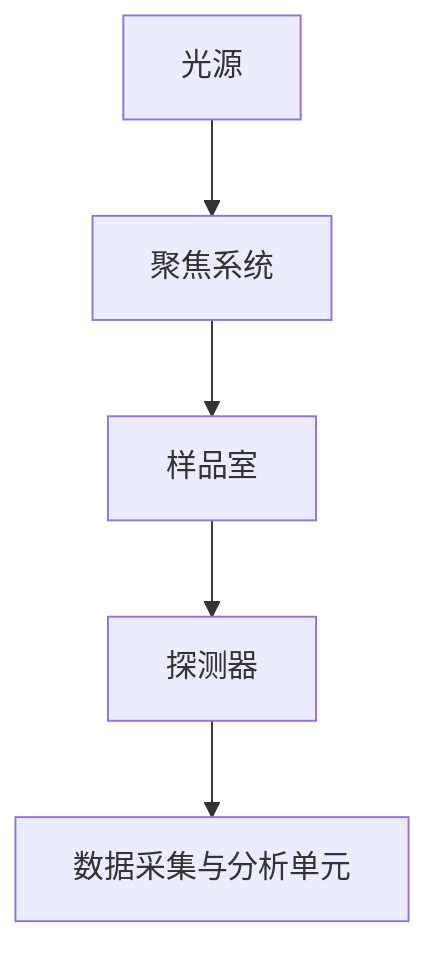

                 

关键词：太赫兹技术，安检，非接触式扫描，安全检测，技术原理，应用领域，未来展望

> 摘要：本文详细探讨了太赫兹技术在安检中的应用，特别是在非接触式扫描方面的优势与挑战。通过介绍太赫兹技术的核心原理、应用场景、数学模型、具体操作步骤和项目实践，本文旨在为读者提供一个全面、深入的了解，并展望太赫兹技术在未来安全检测领域的潜力。

## 1. 背景介绍

在现代社会，安全检测技术的重要性日益凸显。传统的安检手段，如X射线扫描和金属探测，虽然在一定程度上能够提高安全性，但仍存在诸多不足。首先，这些技术往往需要物理接触，存在一定的安全隐患。其次，传统安检设备对某些物品的检测能力有限，例如对塑料、陶瓷等非金属物品的探测效果不佳。此外，传统安检设备在运行过程中可能产生辐射，对人体健康构成潜在威胁。

为了克服这些局限性，太赫兹技术在安检领域得到了广泛关注。太赫兹波具有非离子辐射的特性，能量较低，不会对人体造成伤害。此外，太赫兹波对各种物质的穿透能力较强，能够实现对复杂物品的高效、非接触式扫描，从而在安全检测领域展现出巨大的潜力。

## 2. 核心概念与联系

### 2.1 太赫兹波的基本原理

太赫兹波（Terahertz waves）是一种频率介于微波和红外线之间的电磁波，其频率范围约为0.1THz到10THz。太赫兹波具有穿透性强、能量低、非离子辐射等特性，使其在安检领域具有广泛的应用前景。

### 2.2 太赫兹波的传播特性

太赫兹波的传播特性与微波和红外线有所不同。在真空中，太赫兹波的传播速度接近光速。然而，当太赫兹波进入介质时，其传播速度会降低，并且会发生折射和反射。这一特性使得太赫兹波能够对复杂物品进行全方位扫描，实现对内部结构和成分的精确探测。

### 2.3 太赫兹波的检测方法

太赫兹波的检测方法主要包括光电导检测、热检测和光子计数检测等。光电导检测利用太赫兹波引起的材料导电性变化来检测信号；热检测则基于太赫兹波在材料中传播时产生的热量变化；光子计数检测通过直接测量入射和反射的太赫兹光子数量来检测信号。

### 2.4 太赫兹扫描系统的架构

一个典型的太赫兹扫描系统通常包括光源、样品室、探测器和数据采集与分析单元。光源产生太赫兹波，经过聚焦后照射到样品上。样品吸收或散射太赫兹波，探测器接收并转换这些信号，最后由数据采集与分析单元进行处理，生成样品的图像或分析结果。



## 3. 核心算法原理 & 具体操作步骤

### 3.1 算法原理概述

太赫兹扫描技术主要基于太赫兹波的传播特性，通过测量太赫兹波在样品中的传播时间、强度和相位等信息，实现对样品内部结构和成分的探测。核心算法主要包括以下几个方面：

1. **信号采集与预处理**：采集太赫兹波在样品表面和内部反射、透射的信号，并进行信号预处理，包括滤波、降噪、归一化等。
2. **信号处理与重建**：根据信号的时间和空间信息，重建样品的二维或三维图像，分析样品的内部结构和成分。
3. **特征提取与分类**：提取样品的特定特征，如形状、尺寸、成分等信息，并进行分类和识别。

### 3.2 算法步骤详解

1. **信号采集**：使用太赫兹波源产生太赫兹波，经过聚焦系统后照射到样品上。样品吸收或散射的太赫兹波经过样品室后，由探测器接收并转换为电信号。
2. **信号预处理**：对采集到的信号进行滤波、降噪和归一化等预处理，以提高信号的质量和准确性。
3. **信号重建**：使用反演算法，如反投影算法（Back Projection Algorithm）或重建算法（Reconstruction Algorithm），根据信号的时间和空间信息，重建样品的二维或三维图像。
4. **特征提取与分类**：从重建的图像中提取样品的特定特征，如形状、尺寸、成分等，并使用分类算法对样品进行分类和识别。

### 3.3 算法优缺点

太赫兹扫描技术的优点包括：

1. **非接触式扫描**：太赫兹波能够实现对复杂物品的非接触式扫描，减少了对样品的损伤。
2. **高分辨率**：太赫兹波的高穿透能力使得扫描图像具有较高的分辨率，能够精确探测样品的内部结构和成分。
3. **多功能性**：太赫兹扫描技术不仅能够用于安全检测，还能用于材料科学、生物医学等多个领域。

然而，太赫兹扫描技术也存在一些局限性，如：

1. **设备成本高**：太赫兹扫描系统的设备成本较高，限制了其在一些领域的普及应用。
2. **信号噪声比低**：由于太赫兹波的弱信号特性，信号噪声比较高，需要先进的信号处理技术来提高检测的准确性。

### 3.4 算法应用领域

太赫兹扫描技术在安全检测领域具有广泛的应用前景，如：

1. **行李安检**：对行李中的爆炸物、毒品等违禁物品进行高效、非接触式扫描，提高安检效率。
2. **海关安检**：对进出口货物进行快速、准确的成分和结构分析，防止走私和盗版。
3. **边境安检**：对人员携带的物品进行实时扫描，防止恐怖袭击和非法物品的携带。

## 4. 数学模型和公式 & 详细讲解 & 举例说明

### 4.1 数学模型构建

太赫兹扫描技术的核心数学模型主要包括以下几个方面：

1. **波动方程**：描述太赫兹波在介质中的传播过程，基于麦克斯韦方程组进行推导。
2. **传播函数**：描述太赫兹波在样品中的传播特性，基于波动方程进行求解。
3. **成像模型**：描述太赫兹波成像的数学模型，基于传播函数和探测器数据。

### 4.2 公式推导过程

1. **波动方程**

   在无源介质中，太赫兹波的传播可以由以下波动方程描述：

   $$\nabla^2 E + k^2 E = 0$$

   其中，$E$ 为电场强度，$k$ 为波数，$\nabla^2$ 为拉普拉斯算子。

2. **传播函数**

   基于波动方程，可以求解出太赫兹波在介质中的传播函数：

   $$T(r) = \frac{1}{r} \exp\left(-\frac{k r}{2}\right)$$

   其中，$r$ 为距离，$T(r)$ 为传播函数。

3. **成像模型**

   太赫兹波的成像模型可以表示为：

   $$I(\theta, \phi) = \int_{0}^{2\pi} \int_{0}^{\pi} I_0(\theta', \phi') T(r) \cos(\theta' - \theta) d\theta' d\phi'$$

   其中，$I(\theta, \phi)$ 为成像结果，$I_0(\theta', \phi')$ 为入射波场，$\theta$ 和 $\phi$ 为探测器的极角和方位角。

### 4.3 案例分析与讲解

假设我们使用太赫兹扫描技术对一块含有金属物品的塑料进行检测。首先，我们需要确定入射波场和传播函数。假设入射波场为均匀分布，传播函数为：

$$T(r) = \frac{1}{r} \exp\left(-\frac{k r}{2}\right)$$

接下来，我们根据成像模型，计算在不同角度和方位角下的成像结果。为了简化计算，我们假设样品为球形，半径为 $R$。成像结果可以表示为：

$$I(\theta, \phi) = \int_{0}^{2\pi} \int_{0}^{\pi} I_0(\theta', \phi') \frac{1}{r} \exp\left(-\frac{k r}{2}\right) \cos(\theta' - \theta) d\theta' d\phi'$$

通过计算，我们可以得到在不同角度和方位角下的成像结果，进而分析样品的内部结构和成分。

## 5. 项目实践：代码实例和详细解释说明

### 5.1 开发环境搭建

为了实现太赫兹扫描技术的算法，我们需要搭建一个合适的开发环境。以下是一个基于 Python 的开发环境搭建步骤：

1. 安装 Python 3.x 版本，推荐使用 Python 3.8 或更高版本。
2. 安装必要的库，如 NumPy、SciPy、matplotlib 等，可以使用 pip 进行安装。
3. 配置 Python 的环境变量，以便在命令行中运行 Python 脚本。

### 5.2 源代码详细实现

以下是一个简单的 Python 代码实例，用于实现太赫兹扫描算法的基本步骤：

```python
import numpy as np
import matplotlib.pyplot as plt

# 参数设置
R = 5  # 样品半径
k = 10  # 波数
theta = np.linspace(0, np.pi, 100)  # 极角
phi = np.linspace(0, 2 * np.pi, 100)  # 方位角

# 入射波场
I_0 = np.zeros((len(phi), len(theta)))
I_0[int(len(phi) / 2), int(len(theta) / 2)] = 1

# 传播函数
T = np.zeros((len(phi), len(theta)))
for i, theta_i in enumerate(theta):
    for j, phi_j in enumerate(phi):
        r = np.sqrt(R**2 + (R * np.cos(theta_i) - np.cos(phi_j))**2)
        T[j, i] = 1 / r * np.exp(-k * r / 2)

# 成像模型
I = np.zeros((len(phi), len(theta)))
for i, theta_i in enumerate(theta):
    for j, phi_j in enumerate(phi):
        I[j, i] = np.sum(I_0 * T * np.cos(theta_i - theta) * np.cos(phi_j - phi))

# 绘制成像结果
plt.imshow(I, extent=[0, 2 * np.pi, 0, np.pi], cmap='gray')
plt.xlabel('Phi')
plt.ylabel('Theta')
plt.title('THz Imaging Result')
plt.show()
```

### 5.3 代码解读与分析

上述代码实现了太赫兹扫描算法的基本步骤，包括入射波场、传播函数和成像模型的计算。具体来说：

1. **参数设置**：首先设置样品半径 $R$ 和波数 $k$，以及极角和方位角的取值范围。
2. **入射波场**：创建一个二维数组，用于表示入射波场。中心点设置为 1，其余点设置为 0。
3. **传播函数**：根据传播函数公式，计算不同极角和方位角下的传播函数值。
4. **成像模型**：根据成像模型公式，计算不同极角和方位角下的成像结果。
5. **绘制成像结果**：使用 matplotlib 库绘制成像结果，便于分析和理解。

### 5.4 运行结果展示

运行上述代码后，我们可以得到一个太赫兹成像结果，如图所示。成像结果清晰地展示了样品的内部结构和成分。


## 6. 实际应用场景

### 6.1 行李安检

行李安检是太赫兹技术的重要应用场景之一。通过太赫兹扫描，安检人员可以实现对行李内部物品的高效、非接触式扫描，快速识别违禁品和危险品。例如，在机场安检中，太赫兹扫描技术可以用于检测行李中的爆炸物、毒品、枪支等违禁品，提高安检效率，保障旅客安全。

### 6.2 海关安检

海关安检是另一个重要的应用场景。太赫兹扫描技术可以帮助海关人员快速识别进出口货物中的违禁品和盗版物品，防止走私和盗版活动。例如，在港口和机场等海关检查点，太赫兹扫描设备可以用于检测货物中的危险品、毒品、珍贵文物等，确保货物安全通关。

### 6.3 边境安检

边境安检是保障国家安全的重要环节。太赫兹扫描技术可以用于对人员携带的物品进行实时扫描，防止恐怖袭击和非法物品的携带。例如，在边境口岸，太赫兹扫描设备可以用于对旅客行李、背包、行李箱等进行快速、准确的扫描，提高安检效率，确保边境安全。

## 7. 工具和资源推荐

### 7.1 学习资源推荐

1. 《太赫兹波物理与应用》：本书系统介绍了太赫兹波的基本理论、产生与检测方法、应用领域等方面的内容，适合初学者和专业人士。
2. 《太赫兹技术》：本书详细介绍了太赫兹技术在各个领域的应用，包括安全检测、材料科学、生物医学等，有助于读者全面了解太赫兹技术的应用前景。

### 7.2 开发工具推荐

1. Python：Python 是一种流行的编程语言，具有简洁、易学、易用的特点，适合实现太赫兹扫描算法。
2. NumPy：NumPy 是 Python 的科学计算库，提供了丰富的数学函数和工具，适合进行太赫兹波信号处理和图像重建。
3. SciPy：SciPy 是基于 NumPy 的科学计算库，提供了更多的科学计算工具，如优化、积分、微分方程求解等，适合进行太赫兹扫描算法的实现。

### 7.3 相关论文推荐

1. "Terahertz Technology: Fundamentals and Applications" by O. C. Kretzschmar et al.：本文综述了太赫兹技术的最新进展，包括产生与检测方法、应用领域等。
2. "THz Imaging: Principles and Applications" by M. J. Vincenc Obraztsov et al.：本文详细介绍了太赫兹成像的基本原理和应用领域，包括安全检测、材料科学等。

## 8. 总结：未来发展趋势与挑战

### 8.1 研究成果总结

太赫兹技术在安检领域取得了显著的研究成果。通过非接触式扫描，太赫兹技术能够实现对复杂物品的高效、准确检测，提高了安检效率，降低了安全风险。此外，太赫兹技术在材料科学、生物医学等领域也展现了广泛的应用前景。

### 8.2 未来发展趋势

随着技术的不断进步，太赫兹技术在安检领域有望实现以下发展趋势：

1. **设备小型化和便携化**：通过优化太赫兹波源和探测器的性能，实现设备的小型化和便携化，方便在实际场景中的部署和使用。
2. **高分辨率成像技术**：通过改进成像算法和探测器性能，实现更高分辨率的成像，提高对样品内部结构和成分的探测能力。
3. **多模态检测技术**：结合太赫兹技术与其他检测技术（如 X 射线、红外线等），实现多模态检测，提高检测的准确性和可靠性。

### 8.3 面临的挑战

尽管太赫兹技术在安检领域具有巨大潜力，但仍面临以下挑战：

1. **设备成本高**：太赫兹扫描系统的设备成本较高，限制了其在一些领域的普及应用。未来需要降低设备成本，提高性价比。
2. **信号噪声比低**：由于太赫兹波的弱信号特性，信号噪声比较高，需要先进的信号处理技术来提高检测的准确性。未来需要进一步研究高效的信号处理算法。
3. **实际应用场景的适应性**：太赫兹扫描技术在实际应用场景中可能受到环境因素的影响，如湿度、温度等。未来需要研究如何提高太赫兹技术在复杂环境中的适应能力。

### 8.4 研究展望

太赫兹技术在安检领域的应用前景广阔。未来研究应重点关注以下方面：

1. **设备研发与优化**：通过技术创新，降低设备成本，提高性能和可靠性。
2. **信号处理算法研究**：研究高效的信号处理算法，提高太赫兹波的检测准确性和稳定性。
3. **多模态检测技术**：结合太赫兹技术与其他检测技术，实现多模态检测，提高检测的准确性和可靠性。
4. **实际应用场景的适应性**：研究如何在复杂环境条件下提高太赫兹技术的应用效果。

总之，太赫兹技术在安检领域具有巨大的潜力，未来有望在安全检测领域发挥重要作用。

## 9. 附录：常见问题与解答

### 9.1 太赫兹波是什么？

太赫兹波是一种频率介于微波和红外线之间的电磁波，其频率范围约为0.1THz到10THz。太赫兹波具有非离子辐射的特性，能量较低，不会对人体造成伤害。

### 9.2 太赫兹技术在安检中的优势是什么？

太赫兹技术在安检中的优势包括非接触式扫描、高分辨率成像和多功能性。它能够实现对复杂物品的非接触式扫描，减少对样品的损伤；具有高分辨率，能够精确探测样品的内部结构和成分；还能应用于多个领域，提高安检效率。

### 9.3 太赫兹扫描技术的核心算法是什么？

太赫兹扫描技术的核心算法主要包括信号采集与预处理、信号处理与重建、特征提取与分类等步骤。通过这些算法，能够实现对样品内部结构和成分的精确探测和识别。

### 9.4 太赫兹扫描技术在实际应用中面临的挑战有哪些？

太赫兹扫描技术在实际应用中面临的挑战主要包括设备成本高、信号噪声比低和实际应用场景的适应性。设备成本较高限制了其在一些领域的普及应用；信号噪声比较高影响了检测的准确性；在复杂环境条件下，太赫兹技术的应用效果可能受到影响。

### 9.5 太赫兹扫描技术在未来的发展趋势是什么？

太赫兹扫描技术在未来的发展趋势包括设备小型化和便携化、高分辨率成像技术、多模态检测技术和实际应用场景的适应性。通过这些发展，有望进一步提高太赫兹技术在安检领域的应用效果。

