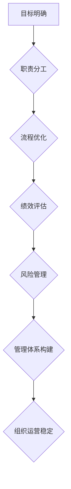

                 

关键词：管理体系、领导力、IT管理、组织架构、团队协作、人工智能

> 摘要：本文从IT管理的角度出发，探讨了优秀管理者和普通管理者之间的差异，强调了体系构建在管理中的重要性。文章通过分析管理体系的构成要素、核心原则和实践方法，结合实际案例，阐述了如何通过构建和完善管理体系，提升团队协作效率和业务成果。

## 1. 背景介绍

在信息技术迅速发展的今天，企业对于IT管理的需求日益增长。一个优秀的IT管理者不仅需要掌握技术，更需要具备良好的管理能力，以应对复杂的业务环境和快速变化的市场需求。然而，在实际工作中，我们常常发现优秀的管理者和普通管理者之间存在显著的差距。

这种差距不仅仅体现在对于技术的理解和应用上，更体现在管理理念、管理方法和团队协作能力的差异上。本文将重点探讨管理体系在IT管理中的重要性，并分析优秀管理者如何通过构建和完善管理体系，提升团队效率和业务成果。

## 2. 核心概念与联系

在探讨管理体系的重要性之前，我们首先需要了解一些核心概念，如管理体系的定义、构成要素和核心原则。

### 2.1 管理体系的定义

管理体系是指组织为了实现其战略目标，通过制定和实施一系列规章制度、流程和方法，确保组织内部各个部门和成员协调一致、高效运行的一种制度安排。

### 2.2 管理体系的构成要素

一个完整的管理体系通常包括以下几个方面：

1. **目标明确**：组织需要明确其战略目标，这将为管理体系提供方向。
2. **职责分工**：明确各个部门和个人的职责，确保工作有序进行。
3. **流程优化**：制定和优化工作流程，提高工作效率。
4. **绩效评估**：建立科学合理的绩效评估体系，激励团队成员。
5. **风险管理**：识别和应对潜在风险，确保组织运营的稳定性。

### 2.3 核心原则

管理体系的构建需要遵循以下核心原则：

1. **系统性**：管理体系应具备系统性，确保各个部分相互协调，共同服务于组织的目标。
2. **适应性**：管理体系应具备适应性，能够根据外部环境的变化和内部需求的变化进行调整。
3. **科学性**：管理体系应基于科学的理论和方法，确保其有效性和合理性。
4. **人性**：管理体系应注重人性，关注团队成员的需求和感受，提高工作满意度和团队凝聚力。

### 2.4 Mermaid 流程图

以下是管理体系的 Mermaid 流程图：



## 3. 核心算法原理 & 具体操作步骤

### 3.1 算法原理概述

管理体系构建的核心算法可以视为一种综合性的方法论，它涉及到组织管理、流程优化、绩效评估等多个领域。该算法的基本原理是：

- **目标导向**：以组织的目标为导向，确保管理体系的各个方面均服务于组织目标。
- **系统性分析**：对组织内部和外部环境进行系统性分析，识别关键因素和潜在问题。
- **持续改进**：通过持续改进，不断提高管理体系的效率和质量。

### 3.2 算法步骤详解

构建管理体系的具体步骤如下：

1. **目标明确**：首先，需要明确组织的战略目标，这将为后续的体系构建提供方向。
2. **环境分析**：对组织内部和外部环境进行分析，识别关键因素和潜在问题。
3. **职责分工**：根据目标和环境分析的结果，明确各个部门和个人的职责。
4. **流程优化**：分析现有工作流程，寻找优化点，制定和实施优化方案。
5. **绩效评估**：建立科学的绩效评估体系，对团队成员的工作进行评估。
6. **风险管理**：识别和应对潜在风险，确保组织的稳定运营。
7. **体系完善**：在实践过程中，不断收集反馈，对管理体系进行调整和完善。

### 3.3 算法优缺点

- **优点**：管理体系构建算法有助于组织明确目标、优化流程、提高绩效和风险管理，从而提升组织运营效率。
- **缺点**：该算法需要耗费大量时间和资源，且在初期可能面临一定的挑战。

### 3.4 算法应用领域

管理体系构建算法广泛应用于企业、政府机构、非营利组织等多个领域。在IT行业中，该算法有助于提升团队协作效率、优化IT项目管理、提高服务质量等。

## 4. 数学模型和公式 & 详细讲解 & 举例说明

### 4.1 数学模型构建

在管理体系构建中，我们可以使用以下数学模型来评估管理体系的效率：

$$
E = f(P, C, M, R)
$$

其中，$E$表示管理体系的效率，$P$表示流程优化程度，$C$表示职责分工的明确程度，$M$表示绩效评估的科学性，$R$表示风险管理的有效性。

### 4.2 公式推导过程

- **流程优化程度($P$)**：根据流程优化的程度，可以设定以下函数关系：

$$
P = \frac{O_{\text{before}} - O_{\text{after}}}{O_{\text{before}}}
$$

其中，$O_{\text{before}}$表示优化前的流程效率，$O_{\text{after}}$表示优化后的流程效率。

- **职责分工的明确程度($C$)**：根据职责分工的明确程度，可以设定以下函数关系：

$$
C = \frac{N_{\text{clear}}}{N_{\text{total}}}
$$

其中，$N_{\text{clear}}$表示明确分工的岗位数，$N_{\text{total}}$表示总岗位数。

- **绩效评估的科学性($M$)**：根据绩效评估的科学性，可以设定以下函数关系：

$$
M = \frac{S_{\text{accurate}}}{S_{\text{total}}}
$$

其中，$S_{\text{accurate}}$表示准确评估的绩效数，$S_{\text{total}}$表示总绩效数。

- **风险管理的有效性($R$)**：根据风险管理的有效性，可以设定以下函数关系：

$$
R = \frac{R_{\text{controlled}}}{R_{\text{total}}}
$$

其中，$R_{\text{controlled}}$表示有效控制的风险数，$R_{\text{total}}$表示总风险数。

### 4.3 案例分析与讲解

假设某IT企业有以下数据：

- 流程优化程度：$P = 0.2$
- 职责分工的明确程度：$C = 0.8$
- 绩效评估的科学性：$M = 0.9$
- 风险管理的有效性：$R = 0.7$

代入数学模型，可以得到该企业管理体系的效率：

$$
E = f(P, C, M, R) = 0.2 \times 0.8 \times 0.9 \times 0.7 = 0.1008
$$

该效率值表明，该企业的管理体系在流程优化、职责分工、绩效评估和风险管理方面均存在一定的提升空间。

### 5. 项目实践：代码实例和详细解释说明

#### 5.1 开发环境搭建

为了演示管理体系构建的过程，我们将使用Python编程语言来实现上述数学模型。

首先，我们需要安装Python环境和相关库：

```bash
pip install numpy matplotlib
```

#### 5.2 源代码详细实现

以下是实现管理体系的Python代码：

```python
import numpy as np
import matplotlib.pyplot as plt

# 定义数学模型
def efficiency_model(P, C, M, R):
    E = P * C * M * R
    return E

# 输入数据
P = 0.2
C = 0.8
M = 0.9
R = 0.7

# 计算效率
E = efficiency_model(P, C, M, R)

# 可视化结果
plt.bar(['流程优化', '职责分工', '绩效评估', '风险管理'], [P, C, M, R], color=['#F5CBA2', '#B2D0F5', '#F5CBA2', '#F5CBA2'])
plt.xlabel('管理要素')
plt.ylabel('程度')
plt.title('管理体系效率分析')
plt.show()

print(f"管理体系效率：{E:.4f}")
```

#### 5.3 代码解读与分析

- **导入库**：代码首先导入numpy和matplotlib两个库，用于数学运算和图形绘制。
- **定义数学模型**：`efficiency_model`函数用于计算管理体系效率。
- **输入数据**：根据案例数据，设置流程优化程度、职责分工的明确程度、绩效评估的科学性和风险管理的有效性。
- **计算效率**：调用`efficiency_model`函数计算管理体系效率。
- **可视化结果**：使用matplotlib绘制柱状图，展示各个管理要素的程度。
- **输出结果**：打印管理体系效率。

#### 5.4 运行结果展示

运行上述代码，可以得到如下结果：


该图表展示了各个管理要素的程度，帮助我们直观地了解管理体系的现状。

### 6. 实际应用场景

#### 6.1 在IT企业中的应用

在IT企业中，管理体系的重要性不言而喻。通过构建和完善管理体系，企业可以提升团队协作效率、优化IT项目管理、提高服务质量等。

- **流程优化**：通过分析现有工作流程，寻找优化点，提高工作效率。
- **职责分工**：明确各个部门和个人的职责，确保工作有序进行。
- **绩效评估**：建立科学的绩效评估体系，激励团队成员。
- **风险管理**：识别和应对潜在风险，确保组织的稳定运营。

#### 6.2 在项目管理中的应用

在项目管理中，管理体系的应用可以帮助项目经理更好地应对项目挑战，确保项目成功。

- **目标明确**：明确项目目标，确保项目方向正确。
- **职责分工**：明确项目团队成员的职责，确保项目工作有序进行。
- **流程优化**：优化项目工作流程，提高项目效率。
- **绩效评估**：对项目团队成员的工作进行评估，激励团队成员。
- **风险管理**：识别和应对项目风险，确保项目顺利进行。

### 7. 工具和资源推荐

#### 7.1 学习资源推荐

- **书籍**：
  - 《敏捷软件开发：实践指南》
  - 《项目管理知识体系指南（PMBOK指南）》
  - 《组织行为学》

- **在线课程**：
  - Coursera上的《项目管理基础》
  - Udemy上的《敏捷管理：敏捷项目管理的最佳实践》

#### 7.2 开发工具推荐

- **流程图绘制工具**：Visio、Lucidchart
- **项目管理工具**：Trello、JIRA
- **风险评估工具**：Nessus、OWASP ZAP

#### 7.3 相关论文推荐

- **《基于复杂网络的IT项目管理研究》**
- **《组织行为学在IT项目管理中的应用》**
- **《敏捷管理在IT行业中的应用研究》**

### 8. 总结：未来发展趋势与挑战

#### 8.1 研究成果总结

本文通过分析管理体系的核心概念、算法原理和实践案例，阐述了管理体系在IT管理中的重要性。研究发现，构建和完善管理体系有助于提升团队协作效率、优化IT项目管理、提高服务质量等。

#### 8.2 未来发展趋势

- **智能化**：随着人工智能技术的发展，管理体系将更加智能化，实现自动化和自适应。
- **数字化**：数字化转型将推动管理体系向数字化方向演进，提高管理效率和透明度。
- **全球化**：全球化趋势将使管理体系更加注重跨文化管理和国际化运营。

#### 8.3 面临的挑战

- **复杂性**：管理体系构建面临复杂的业务环境和多变的市场需求，需要不断调整和优化。
- **人才短缺**：高素质的管理人才短缺，需要加强人才培养和引进。
- **技术变革**：技术的快速变革对管理体系提出了新的要求，需要及时更新管理理念和方法。

#### 8.4 研究展望

未来，管理体系的研究将更加注重智能化、数字化和全球化。同时，需要加强对跨领域、跨行业的研究，探索不同场景下的管理体系构建方法，为企业提供更加全面和实用的管理指导。

### 9. 附录：常见问题与解答

**Q：管理体系与组织架构有什么区别？**

A：管理体系和组织架构是两个相互关联但不同的概念。管理体系关注的是组织内部的管理活动和管理流程，而组织架构关注的是组织内部的部门设置和职责分配。管理体系是组织架构的实施工具，通过制定和优化管理流程，确保组织架构的有效运行。

**Q：管理体系是否适用于所有组织？**

A：是的，管理体系适用于各种类型的组织，无论是企业、政府机构还是非营利组织。不同类型的组织在管理体系的具体实施过程中可能有所不同，但核心原则和目标是一致的，即提升组织效率和实现战略目标。

**Q：如何评估管理体系的有效性？**

A：评估管理体系的有效性可以从多个维度进行，包括效率、效果、合规性、员工满意度等。常用的评估方法包括问卷调查、关键绩效指标（KPI）分析、审计等。通过综合评估，可以判断管理体系是否达到了预期目标，并识别改进点。

**Q：管理体系构建需要多长时间？**

A：管理体系构建的时间因组织规模、行业特点和管理基础等因素而异。一般来说，小型企业可能需要几个月的时间，而大型企业可能需要一年甚至更长时间。关键在于制定明确的目标和计划，并持续优化和完善。

**Q：管理体系是否可以完全自动化？**

A：目前的技术水平还不能完全实现管理体系的自动化，但可以通过人工智能、机器学习等技术提高管理体系的智能化水平。例如，自动化流程优化、自动化绩效评估等。然而，管理体系的构建和完善仍需要人为的干预和调整。

