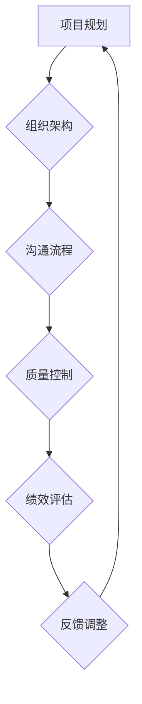

                 

关键词：管理者，管理技能，体系，领导力，组织效率，技术团队管理

> 摘要：本文深入探讨了在信息技术领域，优秀的管理者与普通管理者之间的显著差距，特别是在体系构建方面的重要性。通过分析具体的管理理论和实践案例，我们揭示了构建有效体系的关键要素，以及如何将这些要素应用于实际的技术团队管理中，以提升团队的整体效率和成果。

## 1. 背景介绍

在信息技术迅猛发展的今天，技术团队的管理显得尤为重要。一个优秀的管理者不仅需要具备扎实的专业知识，还需要具备卓越的管理能力。优秀的管理者与普通管理者的差距，往往体现在其对体系和组织的理解与运用上。

### 1.1 管理者角色的演变

随着技术的发展，管理者的角色也在不断演变。从传统的监督者到现在的赋能者，管理者的职责逐渐从执行者转变为规划者、协调者和激励者。在这个过程中，体系的重要性日益凸显。

### 1.2 体系的定义与作用

体系是指一套组织、管理和协调的框架，它不仅包括组织结构，还包括流程、规则和标准。在信息技术领域，体系的作用尤为关键，因为它能够确保团队在复杂的项目和任务中高效运作，降低错误率和风险。

## 2. 核心概念与联系

### 2.1 管理体系的概念

管理体系是指为实现组织的战略目标而建立的一套系统化的管理结构和流程。它包括组织架构、管理流程、标准规范和绩效评估等多个方面。

### 2.2 体系与组织效率的关系

一个完善的管理体系能够提高组织的效率和效果。它通过规范化的管理流程，减少冗余和重复工作，提高资源利用率。同时，明确的绩效评估机制能够激励团队成员，提升整体工作效率。

### 2.3 体系在技术团队管理中的应用

在技术团队管理中，体系的应用尤为重要。一个成功的项目往往需要一个清晰的组织架构、高效的沟通流程和严格的质量控制机制。通过这些体系，技术团队能够更好地协调工作，确保项目按时交付。

### 2.4 Mermaid 流程图

下面是一个简单的 Mermaid 流程图，展示了管理体系在技术团队管理中的应用：



## 3. 核心算法原理 & 具体操作步骤

### 3.1 算法原理概述

在技术团队管理中，一个关键的管理算法是敏捷开发（Agile Development）。敏捷开发是一种以人为核心、迭代和渐进的方法论。它通过迭代和反馈，确保项目能够快速响应变化，提高开发效率和产品质量。

### 3.2 算法步骤详解

- **需求收集**：与客户和利益相关者进行沟通，收集项目需求和预期目标。
- **迭代计划**：将需求划分为多个迭代，每个迭代都有明确的交付目标和时间表。
- **迭代开发**：在每个迭代中，团队专注于实现部分需求，进行编码、测试和集成。
- **评审和反馈**：在每个迭代结束时，进行项目评审，收集反馈，并对下一个迭代进行规划。
- **持续集成和部署**：在整个项目周期内，持续进行代码集成和部署，确保系统能够快速响应用户需求。

### 3.3 算法优缺点

**优点**：
- **快速响应变化**：敏捷开发能够快速适应需求变化，确保项目方向与市场需求保持一致。
- **持续改进**：通过不断的迭代和反馈，项目团队能够持续改进产品和开发流程。

**缺点**：
- **项目管理复杂度增加**：敏捷开发需要更精细化的项目管理，增加了项目的管理成本。
- **对团队协作要求高**：敏捷开发强调团队合作，对团队成员的沟通能力和协作能力有较高要求。

### 3.4 算法应用领域

敏捷开发广泛应用于软件开发领域，特别适用于需求变化频繁、项目周期较长的项目。此外，它也可以应用于产品管理和市场推广等领域的项目管理。

## 4. 数学模型和公式 & 详细讲解 & 举例说明

### 4.1 数学模型构建

在敏捷开发中，一个重要的数学模型是“速度模型”（velocity model）。速度模型用于衡量团队在每个迭代中的工作量。

\[ V(t) = \sum_{i=1}^{n} \frac{E_i}{T_i} \]

其中，\( V(t) \) 是团队在时间 \( t \) 的速度，\( E_i \) 是第 \( i \) 个迭代完成的工作量，\( T_i \) 是第 \( i \) 个迭代的时间。

### 4.2 公式推导过程

速度模型的推导基于工作量和时间的关系。每个迭代完成的工作量 \( E_i \) 与迭代时间 \( T_i \) 成正比。因此，可以通过以下公式计算速度：

\[ V(t) = \frac{E(t)}{T(t)} \]

其中，\( E(t) \) 是在时间 \( t \) 内完成的总工作量，\( T(t) \) 是在时间 \( t \) 内的总迭代时间。

### 4.3 案例分析与讲解

假设一个技术团队在一个季度内完成了三个迭代，每个迭代完成的工作量分别为 100、150 和 200 单位，每个迭代的时间分别为 2 周、3 周和 4 周。我们可以通过速度模型计算该团队在季度的平均速度：

\[ V(t) = \frac{100 + 150 + 200}{2 + 3 + 4} = \frac{450}{9} = 50 \]

因此，该团队在季度的平均速度为 50 单位/周。

## 5. 项目实践：代码实例和详细解释说明

### 5.1 开发环境搭建

为了实践敏捷开发，我们首先需要搭建一个合适的开发环境。这里我们选择使用 Git 作为版本控制系统，Jenkins 作为持续集成工具，以及 Docker 用于容器化部署。

### 5.2 源代码详细实现

以下是一个简单的示例，展示了如何使用 Git 和 Jenkins 进行敏捷开发的代码实现：

```python
# README.md
# 项目描述：一个简单的 Web 应用程序
# 使用技术：Python + Flask + Jenkins

# requirements.txt
# Flask
# Jinja2

# Jenkinsfile
pipeline {
    agent any
    stages {
        stage('Build') {
            steps {
                sh 'python -m venv venv'
                sh '. venv/bin/activate'
                sh 'pip install -r requirements.txt'
                sh 'python app.py'
            }
        }
        stage('Test') {
            steps {
                sh 'python -m unittest discover -s tests'
            }
        }
        stage('Deploy') {
            steps {
                sh 'docker build -t myapp .'
                sh 'docker run -d -p 8080:80 myapp'
            }
        }
    }
}
```

### 5.3 代码解读与分析

在这个示例中，我们使用 Git 和 Jenkins 实现了敏捷开发的三个关键步骤：构建、测试和部署。

- **README.md**：描述项目的功能和技术栈。
- **requirements.txt**：列出项目所需的依赖库。
- **Jenkinsfile**：定义了项目的构建、测试和部署流程。

通过 Jenkinsfile，我们可以实现自动化构建、测试和部署，确保项目的持续集成和持续交付。

### 5.4 运行结果展示

当我们将代码提交到 Git 仓库后，Jenkins 会自动触发构建、测试和部署流程。运行结果会在 Jenkins 界面中显示，包括构建日志、测试报告和部署状态。

## 6. 实际应用场景

### 6.1 企业内部管理系统

在许多企业内部，管理体系的应用场景非常广泛。例如，一个企业可能需要一个高效的采购管理系统，以优化采购流程，降低采购成本。通过构建一个完善的管理体系，企业可以实现采购计划的科学制定、采购流程的规范化管理和采购成本的精准控制。

### 6.2 教育培训机构

教育培训机构可以通过构建一个完善的教学管理体系，提高教学质量和管理效率。例如，一个培训机构可能需要一个在线学习管理系统，以支持学员在线学习、课程管理和教学评估。通过构建这样一个系统，培训机构可以提供更加个性化和高效的教育服务。

### 6.3 医疗保健领域

在医疗保健领域，管理体系的应用同样重要。例如，一个医疗机构可能需要一个电子病历系统，以实现病历管理的电子化和自动化。通过构建这样一个系统，医疗机构可以提高病历记录的准确性和效率，同时减少人工错误和医疗纠纷。

## 7. 未来应用展望

随着信息技术的不断发展，管理体系在各个领域的应用前景将更加广阔。未来，随着人工智能、大数据和物联网等技术的应用，管理体系将变得更加智能和高效。

### 7.1 人工智能与体系管理

人工智能技术可以用于优化管理体系，提高管理效率和决策质量。例如，通过数据挖掘和分析，人工智能可以预测项目的风险和进度，为管理者提供更科学的决策依据。

### 7.2 大数据与体系管理

大数据技术可以用于收集和分析海量数据，为管理体系提供更全面和准确的信息。通过大数据技术，管理者可以实时了解组织的运营状况，发现潜在问题和机会，从而优化管理体系。

### 7.3 物联网与体系管理

物联网技术可以用于实时监控和管理组织内的设备和资源。通过物联网技术，管理者可以实时了解设备的运行状态和资源消耗，优化资源配置，提高生产效率。

## 8. 工具和资源推荐

### 8.1 学习资源推荐

- **《敏捷开发实践指南》**：全面介绍了敏捷开发的方法和实践。
- **《项目管理知识体系指南》**：系统地介绍了项目管理的基本概念和最佳实践。
- **《人工智能：一种现代方法》**：深入讲解了人工智能的基本原理和应用。

### 8.2 开发工具推荐

- **Git**：优秀的版本控制系统，用于代码管理和协作开发。
- **Jenkins**：强大的持续集成和持续交付工具，用于自动化构建、测试和部署。
- **Docker**：容器化技术，用于简化应用部署和扩展。

### 8.3 相关论文推荐

- **《敏捷开发模型的研究与实施》**：探讨敏捷开发模型的理论和实践。
- **《基于大数据的管理决策方法研究》**：研究大数据技术在管理决策中的应用。
- **《物联网技术及其在管理体系中的应用》**：介绍物联网技术在管理体系中的应用。

## 9. 总结：未来发展趋势与挑战

### 9.1 研究成果总结

本文通过对管理体系在信息技术领域的应用进行分析，揭示了优秀管理者和普通管理者之间的差距。通过构建和完善管理体系，技术团队可以更好地应对复杂的项目和任务，提高工作效率和产品质量。

### 9.2 未来发展趋势

随着信息技术的不断发展，管理体系的应用将越来越广泛。未来，管理体系将更加智能化、自动化和高效化，为管理者提供更科学的决策依据和更高效的管理工具。

### 9.3 面临的挑战

在构建和完善管理体系的过程中，管理者将面临许多挑战，如如何适应快速变化的技术环境、如何提高团队成员的协作能力等。此外，如何充分利用人工智能、大数据和物联网等新技术，也是管理者需要考虑的重要问题。

### 9.4 研究展望

未来，管理体系的研究将继续深入，重点关注如何更好地利用新技术优化管理体系，提高管理效率和决策质量。同时，研究也将探讨如何通过创新的管理模式，激发团队成员的创造力和积极性，推动组织的发展。

## 10. 附录：常见问题与解答

### 10.1 什么是敏捷开发？

敏捷开发是一种以人为核心、迭代和渐进的方法论。它强调快速响应变化、持续交付和团队合作，以快速实现客户价值。

### 10.2 管理体系有哪些重要作用？

管理体系能够提高组织的效率和效果，规范管理流程，提高资源利用率，激励团队成员，降低错误率和风险。

### 10.3 如何构建一个有效的管理体系？

构建一个有效的管理体系需要明确组织目标、设计合理的组织架构、制定规范的管理流程和标准、建立有效的绩效评估机制等。

## 作者署名

作者：禅与计算机程序设计艺术 / Zen and the Art of Computer Programming

以上就是关于“好的管理者和普通管理者的差距：体系的重要性”的技术博客文章。希望通过本文的探讨，能够帮助更多的信息技术领域的管理者更好地理解和运用管理体系，提升团队的整体效率和成果。|

