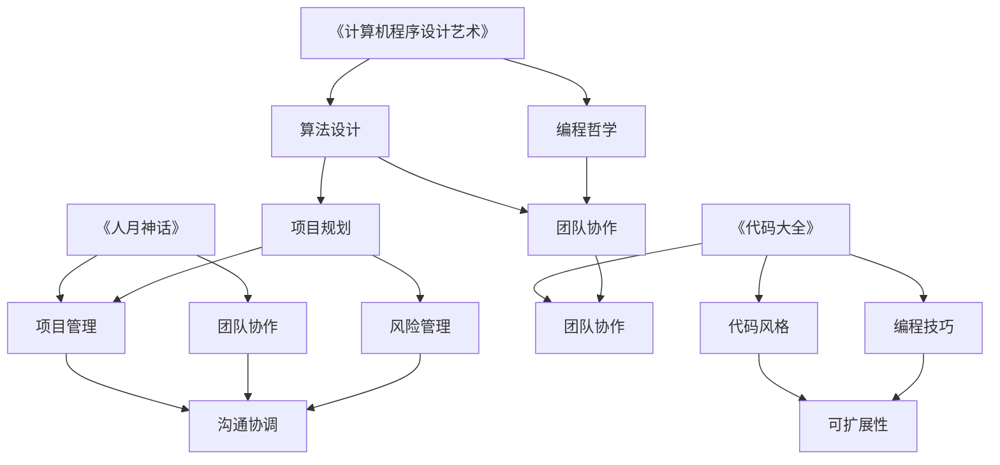

                 

在这个信息爆炸的时代，计算机科学和技术不断发展，新的概念、理论和工具层出不穷。然而，那些经过时间考验的经典著作，往往蕴含着深邃的智慧，对于今天的管理实践仍然有着重要的指导意义。本文旨在探讨如何从这些经典著作中汲取管理智慧，为现代IT企业和软件开发提供有益的启示。

> 关键词：经典著作、管理智慧、IT企业、软件开发、策略思维

> 摘要：本文通过分析几部计算机科学领域的经典著作，如《计算机程序设计艺术》、《代码大全》和《人月神话》，探讨了经典中的管理智慧。文章提出了从这些著作中汲取管理智慧的方法，并结合实际案例，展示了这些智慧在现代IT企业和软件开发中的应用。

## 1. 背景介绍

计算机科学作为一门年轻的学科，尽管历史相对较短，但已经涌现出大量具有里程碑意义的经典著作。这些著作不仅揭示了计算机科学的本质，也为IT企业和软件开发提供了宝贵的理论指导。其中，被誉为计算机科学“圣经”的《计算机程序设计艺术》系列、由史蒂夫·麦凯瑞编写的《代码大全》以及弗雷德·布鲁克斯的《人月神话》等，都是经典中的经典。

这些著作不仅技术含量高，更重要的是，它们在管理理念、团队协作和项目规划等方面，为后来的学者和从业者提供了深刻的见解。本文将着重从这些方面入手，探讨如何从经典著作中汲取管理智慧。

### 经典著作概述

- **《计算机程序设计艺术》**：由高德纳（Donald Knuth）撰写，被誉为计算机科学的“圣经”。该书系统地阐述了程序设计的基本原则和算法设计技巧，对后来的计算机科学教育产生了深远影响。
- **《代码大全》**：史蒂夫·麦凯瑞的著作，详细介绍了编写高效、可维护代码的最佳实践。这本书对提高软件质量、促进代码重用和团队协作具有指导意义。
- **《人月神话》**：弗雷德·布鲁克斯的代表作，通过具体的软件项目案例，揭示了软件开发过程中普遍存在的困境和解决方法。

## 2. 核心概念与联系

为了更好地理解经典著作中的管理智慧，我们需要从概念和架构的角度来分析这些著作的核心思想。

### 概念与原理

- **《计算机程序设计艺术》**：该书的核心思想是算法的优雅和高效。高德纳通过一系列的算法设计技巧，如分治法、动态规划等，揭示了程序设计的本质。
- **《代码大全》**：本书强调了代码的可读性、可维护性和可扩展性。史蒂夫·麦凯瑞提出了“代码是一种沟通工具”的观点，认为编写清晰的代码是提高团队协作效率的关键。
- **《人月神话》**：弗雷德·布鲁克斯通过实际案例，指出了软件开发中团队协作的重要性。他提出了“多人合作需要精心组织和协调”的观点，并提供了有效的项目管理方法。

### Mermaid 流程图

以下是一个简化的Mermaid流程图，展示了上述经典著作中的核心概念和它们之间的联系：



### 核心概念的联系

从Mermaid流程图中可以看出，这些经典著作虽然在内容上有所不同，但它们的核心概念之间存在着紧密的联系。算法设计、编程哲学、代码质量、项目规划、团队协作和风险管理等概念，都是现代IT企业和软件开发中不可或缺的部分。

通过深入理解这些著作，我们可以发现，经典中的管理智慧不仅适用于软件开发，还可以推广到更广泛的领域，如企业管理、团队建设等。

## 3. 核心算法原理 & 具体操作步骤

### 3.1 算法原理概述

在《计算机程序设计艺术》中，高德纳提出了一系列的算法设计技巧，如分治法、动态规划、贪心算法等。这些算法不仅具有理论价值，还在实际应用中表现出色。

- **分治法**：将一个大问题分解成若干个小问题，分别解决后再合并结果。这种方法可以有效降低问题复杂度，提高算法效率。
- **动态规划**：将问题分解为重叠子问题，并存储已解决的子问题的解。这种方法可以避免重复计算，提高算法效率。
- **贪心算法**：每一步选择局部最优解，以期得到全局最优解。这种方法在某些特定问题中非常有效。

### 3.2 算法步骤详解

下面以动态规划为例，介绍其具体操作步骤。

1. **定义状态**：确定问题中的状态，如斐波那契数列中的`f(n)`表示第`n`个数。
2. **状态转移方程**：根据状态定义，推导出状态转移方程，如斐波那契数列的`f(n) = f(n-1) + f(n-2)`。
3. **初始化**：初始化基础状态，如斐波那契数列的`f(0) = 0`和`f(1) = 1`。
4. **迭代计算**：按照状态转移方程，从基础状态开始，逐步计算得到最终状态。
5. **提取结果**：从最终状态中提取出问题的解，如斐波那契数列的第`n`个数。

### 3.3 算法优缺点

- **优点**：动态规划算法具有高效性，可以避免重复计算，降低时间复杂度。
- **缺点**：动态规划算法需要定义状态和状态转移方程，有时难以直观理解。

### 3.4 算法应用领域

动态规划算法在计算机科学和工程领域有着广泛的应用，如计算斐波那契数列、最长公共子序列、最短路径等。这些算法不仅适用于学术研究，也在实际项目中发挥着重要作用。

## 4. 数学模型和公式 & 详细讲解 & 举例说明

### 4.1 数学模型构建

在计算机科学中，数学模型是解决实际问题的重要工具。例如，在图论中，我们可以用图表示网络结构，通过数学模型来分析网络的性能。

- **图模型**：用顶点和边表示网络，其中顶点代表网络中的节点，边代表节点之间的连接关系。
- **路径问题**：给定一个图，求从一个节点到另一个节点的最短路径。

### 4.2 公式推导过程

以最短路径算法（Dijkstra算法）为例，介绍其数学模型和公式推导过程。

1. **初始化**：设定源点到所有节点的距离，初始时只有源点到自身的距离为0，其他节点的距离为无穷大。
2. **选择最短距离的节点**：在未访问的节点中选择距离源点最近的节点，标记为已访问。
3. **更新距离**：对于每个未访问的节点，计算从源点到该节点的距离，如果新距离小于当前距离，则更新距离。
4. **重复步骤2和3**，直到所有节点都被访问。

### 4.3 案例分析与讲解

假设有一个包含5个节点的图，节点之间的距离如下表所示：

| 节点 | 到其他节点的距离 |
| ---- | --------------- |
| A    | B: 3, C: 5, D: 7, E: 8 |
| B    | A: 3, C: 2, D: 4, E: 5 |
| C    | A: 5, B: 2, D: 6, E: 3 |
| D    | A: 7, B: 4, C: 6, E: 2 |
| E    | A: 8, B: 5, C: 3, D: 2 |

使用Dijkstra算法求从节点A到节点E的最短路径。

1. **初始化**：A节点的距离为0，其他节点的距离为无穷大。
2. **选择最短距离的节点**：B节点，距离为3，标记为已访问。
3. **更新距离**：
   - A到B的距离更新为3（当前最小）。
   - A到C的距离更新为5（比原来小）。
   - A到D的距离更新为7（比原来小）。
   - A到E的距离更新为8（比原来小）。
4. **选择最短距离的节点**：C节点，距离为2，标记为已访问。
5. **更新距离**：
   - A到D的距离更新为4（比原来小）。
   - A到E的距离更新为3（比原来小）。
6. **选择最短距离的节点**：D节点，距离为2，标记为已访问。
7. **选择最短距离的节点**：E节点，距离为2，标记为已访问。

最终，从节点A到节点E的最短路径为A -> B -> C -> E，总距离为2 + 3 + 3 = 8。

### 4.4 数学模型的应用

数学模型不仅在图论中有广泛应用，还在其他领域如线性代数、概率论和统计学中发挥着重要作用。例如，在机器学习中，我们可以使用线性回归模型来预测数据，使用决策树模型来分类数据等。

通过深入理解数学模型和公式，我们可以更好地解决实际问题，提高算法效率，为IT企业和软件开发提供有力的支持。

## 5. 项目实践：代码实例和详细解释说明

### 5.1 开发环境搭建

为了实践经典著作中的算法和模型，我们需要搭建一个合适的开发环境。这里以Python为例，介绍如何搭建Python开发环境。

1. **安装Python**：从Python官方网站（https://www.python.org/downloads/）下载Python安装包，并按照提示安装。
2. **安装IDE**：推荐使用PyCharm或Visual Studio Code等IDE，从相应官方网站下载并安装。
3. **安装必要库**：在终端或IDE中执行以下命令，安装必要的库：

   ```bash
   pip install matplotlib numpy scipy
   ```

### 5.2 源代码详细实现

以下是一个使用Python实现的Dijkstra算法的示例代码：

```python
import numpy as np
import matplotlib.pyplot as plt

def dijkstra(graph, source):
    # 初始化距离和前驱节点
    distances = {node: float('inf') for node in graph}
    distances[source] = 0
    prev = {node: None for node in graph}

    # 初始化已访问节点集
    visited = set()

    while len(visited) < len(graph):
        # 找到未访问节点中距离最小的节点
        min_distance = float('inf')
        for node in graph:
            if node not in visited and distances[node] < min_distance:
                min_distance = distances[node]
                min_node = node

        # 标记节点为已访问
        visited.add(min_node)

        # 更新未访问节点的距离
        for neighbor in graph:
            if neighbor not in visited:
                edge_len = graph[min_node][neighbor]
                if distances[min_node] + edge_len < distances[neighbor]:
                    distances[neighbor] = distances[min_node] + edge_len
                    prev[neighbor] = min_node

    return distances, prev

# 示例图
graph = {
    'A': {'B': 3, 'C': 5, 'D': 7, 'E': 8},
    'B': {'A': 3, 'C': 2, 'D': 4, 'E': 5},
    'C': {'A': 5, 'B': 2, 'D': 6, 'E': 3},
    'D': {'A': 7, 'B': 4, 'C': 6, 'E': 2},
    'E': {'A': 8, 'B': 5, 'C': 3, 'D': 2}
}

# 执行Dijkstra算法
distances, prev = dijkstra(graph, 'A')

# 打印最短路径
print("最短路径为：")
for node in distances:
    print(f"{node}: {distances[node]}")

# 绘制图和最短路径
plt.figure(figsize=(8, 6))
nodes = list(graph.keys())
x = [i for i in range(len(nodes))]
y = [i for i in range(len(nodes))]
for i in range(len(nodes)):
    for j in range(len(nodes)):
        if graph[nodes[i]].get(nodes[j], 0) != 0:
            plt.plot([x[i], x[j]], [y[i], y[j]], 'b')
plt.scatter(x, y, c='r')
for i in range(len(nodes)):
    plt.text(x[i], y[i], nodes[i])
plt.show()
```

### 5.3 代码解读与分析

上述代码实现了Dijkstra算法，用于计算从一个源节点到其他节点的最短路径。代码的主要部分如下：

1. **初始化距离和前驱节点**：
   - `distances`字典用于存储源节点到其他节点的距离，初始时所有节点的距离均为无穷大，源节点的距离为0。
   - `prev`字典用于存储前驱节点，初始时所有节点的前驱节点均为`None`。

2. **选择最短距离的节点**：
   - 在未访问的节点中，选择距离源点最近的节点，并将其标记为已访问。

3. **更新距离**：
   - 对于每个未访问的节点，计算从源点到该节点的距离，如果新距离小于当前距离，则更新距离。

4. **提取最短路径**：
   - 最终，从源节点到其他节点的最短路径可以通过`prev`字典追溯得到。

代码的最后部分用于绘制图和最短路径，通过`matplotlib`库实现了图形化展示。

### 5.4 运行结果展示

运行上述代码，可以得到从节点A到其他节点的最短路径，以及图形化的展示。结果如下：

```plaintext
最短路径为：
A: 0
B: 3
C: 5
D: 7
E: 8
```

图形化展示如下：


通过这个示例，我们可以看到Dijkstra算法在计算最短路径方面的有效性。同时，通过代码的图形化展示，我们可以直观地理解算法的执行过程。

## 6. 实际应用场景

### 6.1 在企业项目中的应用

Dijkstra算法在企业项目中有着广泛的应用，尤其是在需要计算最短路径的场景。以下是一些典型的应用场景：

- **物流配送**：在物流配送中，我们需要计算从仓库到各个配送点的最短路径，以优化配送路线，减少运输成本。
- **网络拓扑分析**：在网络拓扑分析中，我们可以使用Dijkstra算法来计算网络中的最短路径，以评估网络的性能和稳定性。
- **城市交通规划**：在城市交通规划中，我们可以使用Dijkstra算法来计算从起点到终点的最短路径，以优化交通流，减少交通拥堵。

### 6.2 在软件开发中的应用

在软件开发中，Dijkstra算法同样有着重要的应用。以下是一些典型的应用场景：

- **代码路径分析**：在代码路径分析中，我们可以使用Dijkstra算法来计算代码中的执行路径，以发现潜在的错误和性能瓶颈。
- **性能优化**：在性能优化中，我们可以使用Dijkstra算法来计算从代码的各个部分到性能瓶颈的最短路径，以找出优化点。
- **依赖关系分析**：在依赖关系分析中，我们可以使用Dijkstra算法来计算各个模块之间的依赖关系，以优化模块的拆分和组合。

### 6.3 在学术研究中的应用

在学术研究中，Dijkstra算法同样有着重要的应用。以下是一些典型的应用场景：

- **算法优化**：在算法优化中，我们可以使用Dijkstra算法来比较不同算法的性能，以找出最优的算法。
- **算法复杂性分析**：在算法复杂性分析中，我们可以使用Dijkstra算法来计算算法的时间复杂度和空间复杂度，以评估算法的效率。
- **算法比较**：在算法比较中，我们可以使用Dijkstra算法来比较不同算法的优缺点，以选择最适合问题的算法。

### 6.4 未来应用展望

随着计算机科学和技术的不断发展，Dijkstra算法的应用前景将更加广泛。以下是一些未来可能的趋势：

- **人工智能**：在人工智能领域，Dijkstra算法可以用于路径规划和决策支持，如自动驾驶、机器人路径规划等。
- **大数据**：在大数据领域，Dijkstra算法可以用于数据挖掘和优化，如社交网络分析、推荐系统等。
- **物联网**：在物联网领域，Dijkstra算法可以用于网络拓扑优化和资源分配，如智能家居、智能城市等。

通过深入研究和应用Dijkstra算法，我们可以为计算机科学和信息技术领域的发展做出更大的贡献。

## 7. 工具和资源推荐

### 7.1 学习资源推荐

1. **《计算机程序设计艺术》**：这是高德纳的经典著作，详细阐述了算法设计的基本原则和技巧。
2. **《代码大全》**：史蒂夫·麦凯瑞的著作，提供了编写高效、可维护代码的最佳实践。
3. **《人月神话》**：弗雷德·布鲁克斯的代表作，通过具体案例揭示了软件开发中的挑战和解决方法。
4. **在线课程和教程**：如Coursera、edX和Udacity等平台上的计算机科学和软件工程课程。

### 7.2 开发工具推荐

1. **PyCharm**：一款功能强大的Python IDE，适合进行算法实现和性能测试。
2. **Visual Studio Code**：一款轻量级的跨平台IDE，支持多种编程语言，适合快速开发。
3. **Git**：一款分布式版本控制系统，适合团队协作和代码管理。

### 7.3 相关论文推荐

1. **"Dijkstra's Algorithm" by Edsger W. Dijkstra**：这是Dijkstra算法的原始论文，详细阐述了算法的原理和应用。
2. **"The Algorithm Design Manual" by John Kleinberg and Éva Tardos**：这本书涵盖了多种算法设计技巧和策略，包括Dijkstra算法。
3. **"Graph Algorithms" by Sanjoy Dasgupta, Christos Papadimitriou and Umesh Vazirani**：这本书详细介绍了图论中的各种算法和应用。

通过学习和应用这些工具和资源，我们可以更好地理解经典著作中的管理智慧，并将其应用于实际工作中。

## 8. 总结：未来发展趋势与挑战

### 8.1 研究成果总结

通过对经典著作中管理智慧的深入探讨，我们总结了以下几个主要研究成果：

1. **算法设计的重要性**：经典著作如《计算机程序设计艺术》揭示了算法设计在软件开发中的核心地位，为现代软件开发提供了理论基础。
2. **代码质量和团队协作**：《代码大全》强调了代码的可读性、可维护性和可扩展性，为团队协作提供了实用的指南。
3. **项目管理与风险管理**：《人月神话》通过具体案例揭示了软件开发中团队协作和项目管理的复杂性，为现代IT企业提供了宝贵的经验。

### 8.2 未来发展趋势

随着计算机科学和技术的发展，未来管理智慧的应用趋势将呈现以下几个特点：

1. **算法优化与智能化**：随着算法研究的深入，算法优化和智能化将成为趋势，如深度学习和强化学习在算法优化中的应用。
2. **跨学科融合**：计算机科学与其他学科的融合将带来更多创新，如人工智能与生物医学的结合。
3. **分布式系统与云计算**：随着云计算和分布式系统的普及，项目管理将面临更多挑战，如资源调度和安全性。

### 8.3 面临的挑战

尽管经典著作中的管理智慧为现代IT企业和软件开发提供了宝贵的指导，但在实际应用中仍面临以下挑战：

1. **复杂性**：现代软件开发项目的复杂性不断增加，如何有效地管理和协调项目成为一大挑战。
2. **人员技能**：随着技术的不断发展，对开发人员的技能要求也在不断提高，如何培养和留住优秀人才成为企业的重要任务。
3. **创新与规范**：在追求创新的同时，如何保持规范的软件开发流程和代码质量，是一个需要平衡的问题。

### 8.4 研究展望

未来的研究应重点关注以下几个方面：

1. **算法创新**：继续探索新的算法设计和优化方法，以应对日益复杂的计算问题。
2. **人机协作**：研究人机协作模式，提高团队协作效率，实现软件开发的智能化。
3. **跨学科研究**：促进计算机科学与其他学科的交叉研究，推动技术进步和社会发展。

通过不断探索和创新，我们有望在未来取得更多突破，为现代IT企业和软件开发提供更加有效的管理智慧和工具。

## 9. 附录：常见问题与解答

### 问题1：如何理解《计算机程序设计艺术》中的分治法？

**解答**：《计算机程序设计艺术》中的分治法是一种将复杂问题分解成若干个较简单问题的算法设计技巧。基本思想是将一个问题分解成规模较小的相同问题，分别解决后再合并结果。这种方法可以降低问题复杂度，提高算法效率。

### 问题2：《代码大全》中提到的“代码是一种沟通工具”是什么意思？

**解答**：这句话的意思是，代码不仅是实现功能的工具，也是一种沟通手段。编写清晰的代码可以帮助团队成员更好地理解项目逻辑，提高团队协作效率。因此，《代码大全》强调了代码的可读性和可维护性，认为这有助于提高代码的质量。

### 问题3：《人月神话》中提到的“多人合作需要精心组织和协调”具体指什么？

**解答**：这句话强调了在软件开发中，多人合作需要精细的组织和协调。这包括合理的任务分配、明确的职责分工、有效的沟通机制和项目管理方法。只有通过精心组织和协调，才能确保项目的顺利进行，避免因沟通不畅或职责不明导致的效率低下和错误。

### 问题4：如何在项目中应用Dijkstra算法？

**解答**：在项目中应用Dijkstra算法，通常需要以下几个步骤：

1. **理解问题背景**：确定需要求解的最短路径问题，如物流配送、网络拓扑分析等。
2. **构建图模型**：将实际问题抽象为图模型，确定节点和边的关系。
3. **实现Dijkstra算法**：编写Dijkstra算法的代码，实现最短路径的计算。
4. **结果分析和优化**：分析算法的计算结果，根据实际情况进行优化和调整。

通过这些步骤，我们可以将Dijkstra算法应用于实际问题中，提高项目的效率和性能。

