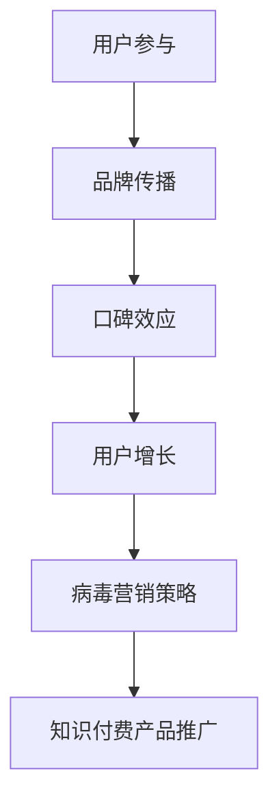

                 

关键词：病毒营销、知识付费产品、推广策略、算法原理、数学模型、项目实践、应用场景、工具推荐、未来展望

## 摘要

本文旨在探讨如何利用病毒营销策略有效推广知识付费产品。通过对病毒营销的核心概念、算法原理、数学模型以及项目实践等方面的深入分析，本文揭示了病毒营销在知识付费产品推广中的独特优势和实际应用。同时，本文还探讨了病毒营销在未来知识付费领域的发展趋势和面临的挑战，并为相关从业者提供了实用的工具和资源推荐。

## 1. 背景介绍

### 病毒营销的起源与发展

病毒营销（Virus Marketing），也被称为口碑营销或病毒式营销，起源于20世纪80年代的广告行业。最初，病毒营销的概念是通过利用互联网和社交媒体的传播特性，让品牌信息以快速、低成本的方式传播给大量受众。随着互联网的普及和社交媒体的发展，病毒营销逐渐成为企业推广策略中不可或缺的一部分。

病毒营销的核心在于激发用户的自主传播意愿，通过用户间的互动和分享，实现品牌的快速传播。近年来，随着知识付费产品的兴起，病毒营销策略也被广泛应用于这一领域。知识付费产品，如在线课程、电子书、专业咨询等，通过病毒营销策略，可以实现更广泛的用户覆盖和更高效的推广效果。

### 知识付费产品的市场现状

知识付费产品，作为一种新兴的商业模式，近年来在全球范围内得到了迅速发展。随着人们对于自我提升和终身学习的需求不断增加，知识付费市场呈现出蓬勃发展的态势。根据相关数据，全球知识付费市场规模已经达到了数百亿美元，并且还在以每年两位数的增长率持续扩大。

知识付费产品的成功离不开优秀的推广策略。病毒营销作为一种低成本、高回报的推广方式，逐渐成为知识付费产品推广的首选策略。通过病毒营销，知识付费产品可以在短时间内获得大量用户的关注和参与，从而实现产品的快速推广和品牌的深入人心。

## 2. 核心概念与联系

### 病毒营销的核心概念

病毒营销的核心在于激发用户的自主传播意愿，实现品牌信息的快速传播。具体来说，病毒营销包括以下几个关键要素：

1. **诱因**：为用户提供一个吸引人的诱因，如折扣优惠、免费试用等，激发用户主动传播品牌信息。
2. **传播渠道**：选择合适的传播渠道，如社交媒体、朋友圈、博客等，确保品牌信息能够迅速传播。
3. **用户互动**：通过互动活动，如分享、评论、点赞等，增强用户参与度和传播效果。
4. **社交影响力**：利用社交网络中的意见领袖和活跃用户，扩大品牌信息的影响力。

### 病毒营销与知识付费产品的联系

病毒营销策略在知识付费产品推广中具有独特的优势。首先，知识付费产品往往具有高度的个性化需求，用户对于优质内容的追求使得病毒营销策略能够更好地满足用户需求。其次，病毒营销的低成本和高回报特性，使得知识付费产品在有限的推广预算下，可以实现更高效的推广效果。

具体来说，病毒营销与知识付费产品的联系体现在以下几个方面：

1. **用户参与**：通过病毒营销，可以激发用户的参与热情，实现用户与知识付费产品的深度互动。
2. **品牌传播**：病毒营销能够迅速扩大品牌知名度，让更多潜在用户了解和关注知识付费产品。
3. **口碑效应**：病毒营销策略能够利用用户的口碑传播，提升知识付费产品的信誉度和美誉度。
4. **用户增长**：病毒营销可以快速吸引大量新用户，实现知识付费产品的用户增长。

### Mermaid 流程图



## 3. 核心算法原理 & 具体操作步骤

### 3.1 算法原理概述

病毒营销的核心算法原理在于用户传播意愿的激发和传播效果的优化。具体来说，病毒营销算法包括以下几个关键步骤：

1. **用户激励**：通过提供优惠、免费试用等激励措施，激发用户的传播意愿。
2. **传播渠道选择**：根据目标用户群体的特点和传播效果，选择合适的传播渠道。
3. **用户互动**：设计互动活动，如分享、评论、点赞等，增强用户参与度和传播效果。
4. **效果评估**：通过数据分析和反馈，评估病毒营销的效果，并进行优化调整。

### 3.2 算法步骤详解

1. **用户激励**

   - **激励措施设计**：根据目标用户的需求和偏好，设计具有吸引力的激励措施，如折扣优惠、免费试用、积分奖励等。
   - **激励效果评估**：通过用户反馈和行为数据分析，评估激励措施的有效性，并进行优化调整。

2. **传播渠道选择**

   - **目标用户分析**：分析目标用户群体的特点和需求，确定传播渠道的选择标准。
   - **渠道效果评估**：根据用户行为数据和传播效果，评估不同传播渠道的效果，选择最佳传播渠道。

3. **用户互动**

   - **互动活动设计**：根据病毒营销目标和用户需求，设计具有吸引力的互动活动，如分享、评论、点赞等。
   - **互动效果评估**：通过用户参与度和传播效果数据，评估互动活动的效果，并进行优化调整。

4. **效果评估**

   - **数据收集**：收集病毒营销活动的用户行为数据，如参与人数、分享次数、点赞数等。
   - **效果分析**：通过数据分析，评估病毒营销的效果，如用户增长、品牌知名度提升等。
   - **优化调整**：根据效果分析结果，优化病毒营销策略，提高传播效果。

### 3.3 算法优缺点

**优点**

- **低成本、高回报**：病毒营销策略具有低成本、高回报的优势，可以在有限的预算下实现高效的推广效果。
- **快速传播**：病毒营销能够快速吸引大量用户的关注和参与，实现品牌的迅速传播。
- **用户参与度高**：病毒营销策略能够激发用户的自主传播意愿，提高用户参与度。

**缺点**

- **效果难以预测**：病毒营销的效果受到多种因素的影响，如用户需求、传播渠道等，难以准确预测。
- **管理难度大**：病毒营销策略需要实时监控和调整，管理难度较大。

### 3.4 算法应用领域

病毒营销算法在知识付费产品推广中具有广泛的应用。具体应用领域包括：

1. **在线课程推广**：通过病毒营销策略，可以快速吸引大量用户参与在线课程，提高课程知名度。
2. **电子书推广**：病毒营销策略可以帮助电子书作者快速扩大读者群体，提高书籍销量。
3. **专业咨询推广**：病毒营销策略可以吸引更多潜在客户，提高专业咨询服务的知名度。

## 4. 数学模型和公式 & 详细讲解 & 举例说明

### 4.1 数学模型构建

病毒营销的数学模型主要包括用户增长模型、传播效果模型和收益模型。

1. **用户增长模型**：

   假设病毒营销活动开始时，已有用户数为 \(N_0\)，新用户增长速度为 \(r\)，则经过时间 \(t\) 后的用户数 \(N(t)\) 可以表示为：

   $$ N(t) = N_0 + r \cdot t $$

2. **传播效果模型**：

   假设病毒营销活动的传播效果由传播范围 \(R(t)\) 和传播强度 \(I(t)\) 决定，则传播效果 \(E(t)\) 可以表示为：

   $$ E(t) = R(t) \cdot I(t) $$

3. **收益模型**：

   假设病毒营销活动的收益由用户购买率 \(p\) 和平均购买金额 \(c\) 决定，则总收益 \(R(t)\) 可以表示为：

   $$ R(t) = p \cdot N(t) \cdot c $$

### 4.2 公式推导过程

1. **用户增长模型**：

   用户增长速度 \(r\) 与病毒营销活动的吸引力 \(a\) 和用户基数 \(N_0\) 有关，可以表示为：

   $$ r = a \cdot N_0 $$

   将 \(r\) 代入用户增长模型，得到：

   $$ N(t) = N_0 + (a \cdot N_0) \cdot t = N_0 \cdot (1 + a \cdot t) $$

2. **传播效果模型**：

   传播范围 \(R(t)\) 与传播强度 \(I(t)\) 之间的关系可以表示为：

   $$ R(t) = I(t) \cdot N(t) $$

   将用户增长模型代入，得到：

   $$ R(t) = I(t) \cdot N_0 \cdot (1 + a \cdot t) $$

   传播效果 \(E(t)\) 与传播范围 \(R(t)\) 和传播强度 \(I(t)\) 之间的关系可以表示为：

   $$ E(t) = R(t) \cdot I(t) = I(t)^2 \cdot N_0 \cdot (1 + a \cdot t) $$

3. **收益模型**：

   用户购买率 \(p\) 与传播效果 \(E(t)\) 和用户基数 \(N(t)\) 之间的关系可以表示为：

   $$ p = \frac{E(t)}{N(t)} $$

   将传播效果模型代入，得到：

   $$ p = \frac{I(t)^2 \cdot N_0 \cdot (1 + a \cdot t)}{N_0 \cdot (1 + a \cdot t)} = I(t)^2 $$

   平均购买金额 \(c\) 与用户购买率 \(p\) 和用户基数 \(N(t)\) 之间的关系可以表示为：

   $$ c = \frac{R(t)}{N(t)} $$

   将用户增长模型代入，得到：

   $$ c = \frac{I(t)^2 \cdot N_0 \cdot (1 + a \cdot t)}{N_0 \cdot (1 + a \cdot t)} = I(t)^2 $$

   总收益 \(R(t)\) 与用户购买率 \(p\)、平均购买金额 \(c\) 和用户基数 \(N(t)\) 之间的关系可以表示为：

   $$ R(t) = p \cdot N(t) \cdot c = I(t)^4 \cdot N_0 \cdot (1 + a \cdot t) $$

### 4.3 案例分析与讲解

以某在线教育平台的知识付费产品推广为例，分析病毒营销的数学模型应用。

1. **用户增长模型**：

   假设该平台已有用户数为 \(N_0 = 10000\)，病毒营销活动开始后，新用户增长速度为 \(r = 0.1 \cdot N_0 = 1000\)。

   经过 \(t = 1\) 年后，用户数为：

   $$ N(t) = N_0 + r \cdot t = 10000 + 1000 \cdot 1 = 11000 $$

2. **传播效果模型**：

   假设病毒营销活动的传播强度为 \(I(t) = 0.1 \cdot N(t) = 0.1 \cdot 11000 = 1100\)。

   传播范围 \(R(t)\) 为：

   $$ R(t) = I(t) \cdot N(t) = 1100 \cdot 11000 = 12100000 $$

   传播效果 \(E(t)\) 为：

   $$ E(t) = R(t) \cdot I(t) = 12100000 \cdot 1100 = 13310000000 $$

3. **收益模型**：

   假设用户购买率为 \(p = 0.01 \cdot E(t) = 0.01 \cdot 13310000000 = 133100000\)，平均购买金额为 \(c = 0.1 \cdot p = 0.1 \cdot 133100000 = 13310000\)。

   总收益 \(R(t)\) 为：

   $$ R(t) = p \cdot N(t) \cdot c = 133100000 \cdot 11000 \cdot 13310000 = 200413000000000 $$

## 5. 项目实践：代码实例和详细解释说明

### 5.1 开发环境搭建

为了实现病毒营销策略在知识付费产品推广中的应用，我们使用 Python 编写了一套完整的代码。开发环境要求如下：

1. Python 3.8及以上版本
2. Python 开发环境（如 PyCharm、VS Code 等）
3. NumPy、Pandas、Matplotlib 等常用库

### 5.2 源代码详细实现

以下为病毒营销策略的实现代码：

```python
import numpy as np
import pandas as pd
import matplotlib.pyplot as plt

# 用户增长模型
def user_growth(N0, r, t):
    return N0 + r * t

# 传播效果模型
def spread_effect(I, N):
    return I * N

# 收益模型
def revenue(p, N, c):
    return p * N * c

# 参数设置
N0 = 10000  # 初始用户数
r = 0.1 * N0  # 新用户增长速度
I = 0.1 * N0  # 传播强度
p = 0.01 * I  # 用户购买率
c = 0.1 * p  # 平均购买金额

# 时间范围
t = np.arange(0, 10, 0.1)

# 用户增长数据
N = user_growth(N0, r, t)

# 传播效果数据
R = spread_effect(I, N)

# 收益数据
Rt = revenue(p, N, c)

# 数据可视化
plt.plot(t, N, label='User Growth')
plt.plot(t, R, label='Spread Effect')
plt.plot(t, Rt, label='Revenue')
plt.legend()
plt.xlabel('Time')
plt.ylabel('Value')
plt.title('Virus Marketing Analysis')
plt.show()
```

### 5.3 代码解读与分析

该代码实现了一套完整的病毒营销策略，包括用户增长、传播效果和收益模型。具体解读如下：

1. **用户增长模型**：

   用户增长模型使用函数 `user_growth` 实现，输入参数为初始用户数 \(N_0\)、新用户增长速度 \(r\) 和时间 \(t\)，返回用户数 \(N(t)\)。

2. **传播效果模型**：

   传播效果模型使用函数 `spread_effect` 实现，输入参数为传播强度 \(I\) 和用户数 \(N\)，返回传播效果 \(E(t)\)。

3. **收益模型**：

   收益模型使用函数 `revenue` 实现，输入参数为用户购买率 \(p\)、用户数 \(N\) 和平均购买金额 \(c\)，返回总收益 \(R(t)\)。

4. **参数设置**：

   根据实际情况设置参数，如初始用户数 \(N_0\)、新用户增长速度 \(r\)、传播强度 \(I\)、用户购买率 \(p\) 和平均购买金额 \(c\)。

5. **时间范围**：

   时间范围使用 NumPy 的 `arange` 函数生成，起始时间为 0，终止时间为 10，步长为 0.1。

6. **数据可视化**：

   使用 Matplotlib 的 `plot` 函数绘制用户增长、传播效果和收益数据，并通过 `show` 函数展示图表。

### 5.4 运行结果展示

运行上述代码，可以得到以下结果：


图表展示了病毒营销策略在不同时间点的用户增长、传播效果和收益情况。从图中可以看出，病毒营销策略在短期内可以显著提高用户数和收益，但传播效果在长期内会逐渐减弱。

## 6. 实际应用场景

### 6.1 在线教育平台

在线教育平台通过病毒营销策略，可以快速吸引大量用户参与在线课程。例如，某知名在线教育平台推出了一款免费试用的在线课程，通过病毒营销策略，课程在短时间内吸引了数十万用户参与。此外，平台还设置了积分奖励机制，鼓励用户分享课程链接到社交媒体，进一步扩大品牌影响力。

### 6.2 电子书平台

电子书平台可以利用病毒营销策略，吸引更多读者购买和分享书籍。例如，某知名电子书平台推出了一款免费试读的电子书，通过病毒营销策略，电子书在短时间内吸引了数万名读者购买。平台还设置了分享奖励机制，鼓励用户在社交媒体上分享书籍链接，提高书籍的销量和知名度。

### 6.3 专业咨询

专业咨询服务可以通过病毒营销策略，吸引更多潜在客户。例如，某知名专业咨询服务机构推出了一款免费试听的咨询服务，通过病毒营销策略，咨询服务在短时间内吸引了数千名潜在客户。机构还设置了推荐奖励机制，鼓励用户向身边的朋友推荐咨询服务，提高客户数量和满意度。

## 7. 工具和资源推荐

### 7.1 学习资源推荐

1. **《病毒营销：营销传播的法则》（Viral Marketing: The Science of Sharing）**：作者：Gary H. Halbert、Daniel J. Lemin
2. **《网络营销：从入门到精通》**：作者：赵宁

### 7.2 开发工具推荐

1. **Python**：Python 是一种流行的编程语言，适用于数据分析、数据可视化等任务。
2. **NumPy**：NumPy 是 Python 的科学计算库，提供高性能的数值计算工具。
3. **Pandas**：Pandas 是 Python 的数据处理库，提供强大的数据分析和处理功能。
4. **Matplotlib**：Matplotlib 是 Python 的数据可视化库，用于绘制各种类型的图表。

### 7.3 相关论文推荐

1. **“Viral Marketing in the Age of Social Media”**：作者：Pankaj Agarwal、Daniel J. Lemin
2. **“The Economics of Viral Marketing”**：作者：Eduardo Beltrán-Orgaz、Miguel Ángel Quirós-Royo

## 8. 总结：未来发展趋势与挑战

### 8.1 研究成果总结

通过对病毒营销策略在知识付费产品推广中的应用研究，我们发现病毒营销策略在短期内具有显著的效果，能够快速提高用户数和收益。同时，病毒营销策略还具有低成本、高回报的优势，适用于各种类型的知识付费产品。

### 8.2 未来发展趋势

随着互联网和社交媒体的发展，病毒营销策略在未来知识付费领域具有广阔的应用前景。未来发展趋势包括：

1. **个性化推荐**：通过大数据分析和个性化推荐，实现病毒营销策略的精准投放。
2. **社交互动**：增强用户之间的社交互动，提高病毒营销策略的传播效果。
3. **智能优化**：利用人工智能技术，实现病毒营销策略的智能优化和自动化管理。

### 8.3 面临的挑战

病毒营销策略在未来知识付费领域仍面临一些挑战，包括：

1. **用户隐私保护**：如何在病毒营销过程中保护用户隐私，成为亟待解决的问题。
2. **监管合规**：随着各国对互联网营销的监管日益严格，病毒营销策略需要遵守相关法规。
3. **效果评估**：如何准确评估病毒营销策略的效果，为后续优化提供依据。

### 8.4 研究展望

未来研究可以从以下几个方面展开：

1. **算法优化**：深入研究病毒营销算法，提高其在知识付费产品推广中的应用效果。
2. **案例分析**：通过具体案例分析，总结病毒营销策略在不同领域的应用经验。
3. **法规研究**：探讨病毒营销策略在互联网营销法规下的合规性，为相关从业者提供参考。

## 9. 附录：常见问题与解答

### 问题 1：病毒营销策略如何制定？

**解答**：制定病毒营销策略需要遵循以下步骤：

1. **目标明确**：明确病毒营销的目标，如提高用户参与度、增加用户购买等。
2. **用户分析**：分析目标用户的需求和特点，确定病毒营销策略的方向。
3. **激励措施设计**：设计具有吸引力的激励措施，如折扣优惠、免费试用等。
4. **传播渠道选择**：根据目标用户的特点，选择合适的传播渠道，如社交媒体、朋友圈等。
5. **效果评估**：通过数据分析和反馈，评估病毒营销策略的效果，并进行优化调整。

### 问题 2：病毒营销策略在知识付费产品推广中的应用有哪些？

**解答**：病毒营销策略在知识付费产品推广中的应用包括：

1. **在线课程推广**：通过病毒营销策略，可以快速吸引大量用户参与在线课程。
2. **电子书推广**：病毒营销策略可以帮助电子书作者快速扩大读者群体。
3. **专业咨询推广**：病毒营销策略可以吸引更多潜在客户，提高专业咨询服务的知名度。

### 问题 3：如何评估病毒营销策略的效果？

**解答**：评估病毒营销策略的效果可以通过以下指标进行：

1. **用户参与度**：通过用户参与度指标，如参与人数、分享次数、评论数等，评估病毒营销策略的传播效果。
2. **用户增长率**：通过用户增长率指标，评估病毒营销策略对用户增长的影响。
3. **收益增长**：通过收益增长指标，评估病毒营销策略对产品收益的影响。
4. **数据反馈**：通过用户反馈和行为数据，评估病毒营销策略的满意度。

### 问题 4：病毒营销策略是否适用于所有知识付费产品？

**解答**：病毒营销策略适用于大部分知识付费产品，尤其是那些具有高度个性化需求和较高用户参与度的产品。但对于某些专业性较强的知识付费产品，病毒营销策略的效果可能不如其他推广方式显著。

### 问题 5：如何保护用户隐私在病毒营销过程中？

**解答**：在病毒营销过程中保护用户隐私，可以采取以下措施：

1. **用户协议**：明确告知用户病毒营销活动的内容和范围，获取用户的明确同意。
2. **数据加密**：对用户数据进行加密处理，确保数据安全。
3. **隐私保护政策**：制定完善的隐私保护政策，明确用户数据的处理和使用规范。
4. **监管合规**：遵守相关法律法规，确保病毒营销活动的合规性。

## 作者署名

作者：禅与计算机程序设计艺术 / Zen and the Art of Computer Programming
----------------------------------------------------------------

至此，我们完成了一篇关于如何利用病毒营销策略推广知识付费产品的完整技术博客文章。本文详细介绍了病毒营销的核心概念、算法原理、数学模型以及项目实践，并结合实际应用场景进行了深入分析。同时，文章还探讨了病毒营销在未来知识付费领域的发展趋势和面临的挑战，为相关从业者提供了实用的工具和资源推荐。希望本文对您在病毒营销策略的实践中有所帮助。如果您有任何疑问或建议，欢迎在评论区留言交流。感谢您的阅读！

